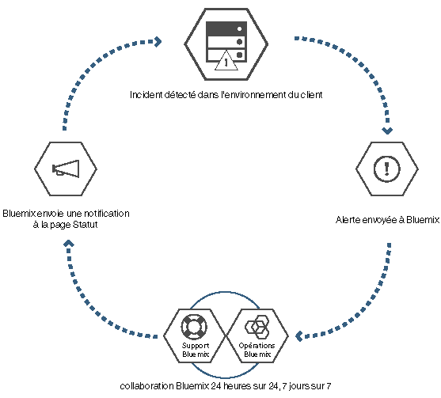

---

 

copyright:

  2015, 2016

 

---

{:new_window: target="_blank"}
{:shortdesc: .shortdesc}

#{{site.data.keyword.Bluemix_notm}} local
{: #local}
*Dernière mise à jour : 16 mai 2016*

L'environnement {{site.data.keyword.Bluemix}} local apporte la puissance et l'agilité de la plateforme reposant sur le cloud
{{site.data.keyword.Bluemix_notm}} à votre centre de données. Avec l'environnement {{site.data.keyword.Bluemix_notm}} local, vous pouvez protéger vos charges de travail les plus sensibles derrière le pare-feu
de votre société tout en restant connecté de façon sécurisée à l'environnement {{site.data.keyword.Bluemix_notm}} public et synchronisé.
{:shortdesc}

IBM® utilise des opérations de cloud en tant que service pour surveiller et gérer votre environnement de sorte que vous puissiez vous consacrer
pleinement à la construction d'applications et de services s'exécutant sur l'environnement. IBM gère également les mises à jour de la plateforme pour que
vous puissiez vous consacrer à votre activité.

Les environnements {{site.data.keyword.Bluemix_notm}} locaux appliquent les mêmes normes de sécurité que l'environnement
{{site.data.keyword.Bluemix_notm}} public en termes de sécurité opérationnelle. Vous fournissez le matériel et l'infrastructure, ce qui vous permet
de contrôler la sécurité physique et la sécurité de l'infrastructure. L'accès des développeurs à l'environnement {{site.data.keyword.Bluemix_notm}} local est contrôlé par vos stratégies LDAP, qui peuvent
être configurées par l'équipe {{site.data.keyword.Bluemix_notm}} lorsqu'elle configure votre environnement. Dans l'environnement local, vous pouvez
gérer les rôles utilisateur et les droits dans la page Administration.

L'environnement {{site.data.keyword.Bluemix_notm}} local est fourni avec tous les contextes d'exécution
{{site.data.keyword.Bluemix_notm}} et 64 Go de mémoire de traitement.

Par ailleurs, un éventail de services est disponible en tant que services de {{site.data.keyword.Bluemix_notm}} Local. Examinez le tableau suivant pour
déterminer les éléments inclus et ceux dont vous pouvez faire l'acquisition.

*Tableau 1. Services et contextes d'exécution locaux*

| **Type** | **Nom** | **Description** |
|----------|----------|-----------------|
|Inclus | Contextes d'exécution {{site.data.keyword.Bluemix_notm}} | Utilisez des contextes d'exécution pour que votre application soit opérationnelle rapidement, sans qu'il soit nécessaire de configurer et de gérer des machines et des systèmes d'exploitation. Vous pouvez utiliser tous les contextes d'exécution {{site.data.keyword.Bluemix_notm}} dans votre instance {{site.data.keyword.Bluemix_notm}} locale.|
|Facultatif | {{site.data.keyword.APIM}} | Utilisez le service {{site.data.keyword.APIMfull}} pour composer des API, les gérer et les diffuser sur les réseaux sociaux. Vous pouvez importer des API avec des ressources en utilisant une adresse URL de proxy ou en assemblant des données à partir de sources de données HTTP. L'avantage avec le service {{site.data.keyword.APIM}} est que vous pouvez gérer la façon dont vos API sont utilisées. |
|Inclus | {{site.data.keyword.autoscaling}}| Augmente ou diminue dynamiquement la capacité de vos ressources de traitement en fonction de
règles. Avec ce service, vous bénéficiez d'une utilisation illimitée dans votre environnement {{site.data.keyword.Bluemix}} local.|
|Facultatif | {{site.data.keyword.datacshort}} | Ce service fournit une grille de données en mémoire qui prend en charge des scénarios de mise en cache distribuée pour vos applications. Il inclut 50 Go de mémoire cache interne. |
|Facultatif | {{site.data.keyword.sescashort}} | Pour augmenter la redondance, {{site.data.keyword.sescashort}} fournit une réplique d'une session
qu'il stocke en cache. Par conséquent, en cas de microcoupure ou d'indisponibilité, votre application client peut continuer à accéder à la session en cache. Le service
prend en charge des scénarios de mise en cache de session pour les applications Web et mobiles. |
|Facultatif | {{site.data.keyword.iot_full}} | Ce service permet à vos applications de communiquer et de consommer les données collectées par vos
périphériques connectés, capteurs et passerelles. L'offre de base locale inclut un environnement initial permettant l'exécution d'une version privée d'IBM
{{site.data.keyword.iot_full}} dans l'environnement local, avec une capacité de 100000 périphériques ou applications connectés simultanément et 1,6 To
d'échange de données. |

Vous pouvez acquérir des composants facultatifs pour élargir la capacité de vos ressources et périphériques. Vous pouvez acquérir ces composants en contactant
l'équipe commerciale. Accédez à la page [Contactez-nous](https://console.ng.bluemix.net/?direct=classic/#/contactUs/cloudOEPaneId=contactUs) for
pour plus d'informations sur la manière de contacter un ingénieur commercial. Pour rehausser votre plan pour un service, vous pouvez sélectionner un plan depuis la vignette Service dans votre catalogue.

*Tableau 2. Composant facultatifs dont vous pouvez faire l'acquisition*

| **Nom** | **Description** |
|----------|-----------------|
|{{site.data.keyword.Bluemix_notm}} Local access one-time set up | Redevance unique pour déploiement et configuration de l'environnement local. |
|{{site.data.keyword.Bluemix_notm}} Local compute resources 16 GB capacity increase | Extension des ressources de traitement d'IBM
{{site.data.keyword.Bluemix_notm}}
Local pour fournir une capacité mémoire supplémentaire de 16 Go. |
|{{site.data.keyword.Bluemix_notm}} Data & Session Cache 50 GB capacity increase | Environnement permettant le déploiement et l'exécution
d'instances Data Cache et Session Cache jusqu'à une capacité cumulée de 50 Go. |
|{{site.data.keyword.Bluemix_notm}} Local {{site.data.keyword.APIM}} 500 API calls capacity increase | Environnement permettant l'exécution
d'une version privée de {{site.data.keyword.APIM}} {{site.data.keyword.Bluemix_notm}}, avec une capacité de 500 appels d'API par seconde. |
|{{site.data.keyword.Bluemix_notm}} {{site.data.keyword.iot_short}} Local incremental increase | Environnement s'ajoutant à l'offre
de service de base {{site.data.keyword.iot_full}} Local et permettant l'exécution d'une version privée d'{{site.data.keyword.iot_full}} dans
l'environnement local, avec une capacité de 100000 périphériques ou applications connectés simultanément et 0,5 To d'échange de données. |

**Remarque **: les composants {{site.data.keyword.Bluemix_notm}} Local peuvent indiquer une capacité configurée
spécifique, par exemple en gigaoctets ou transactions par seconde. Comme la capacité effective concrète pour chaque configuration du service de cloud varie en fonction de nombreux facteurs, elle peut être supérieure ou inférieure à
la capacité configurée.

### Catalogue mixte

L'environnement {{site.data.keyword.Bluemix_notm}} local inclut un catalogue privé mixte qui affiche les services locaux disponibles
exclusivement pour vous. Il inclut également des services supplémentaires qui sont à votre disposition depuis l'environnement
{{site.data.keyword.Bluemix_notm}} public.

Le catalogue mixte fournit la fonction permettant de créer des applications hybrides composées de
services publics et privés. Vous pouvez choisir les services publics qui satisfont les exigences pour votre activité selon vos critères de
sécurité et de confidentialité des données. S'il s'agit d'une instance privée du service pour votre environnement local, l'étiquette "Local" est associée à
la vignette de service dans votre catalogue. De même, s'il s'agit d'un service personnalisé, l'étiquette "Personnalisé" est associée à la vignette du
service.
 

*Tableau 3. Services disponibles par région pour syndication depuis {{site.data.keyword.Bluemix_notm}} Public*

|Service	|Disponible dans la région Sud des Etats-Unis	|Disponible dans la région Europe-Royaume-Uni |Disponible dans la région Australie-Sydney|
|:----------|:------------------------------|:------------------|:------------------|
|{{site.data.keyword.alchemyapishort}} 		|Oui	   	|Oui  		|Oui|
|{{site.data.keyword.alertnotificationshort}}		|Oui		|Oui			|Oui		|
|{{site.data.keyword.appseccloudshort}}		|Oui		|Oui		|Oui |
|{{site.data.keyword.hadoopst}}			|Oui		|Non		|Non |
|{{site.data.keyword.APIM}}			|Oui		|Oui		|Oui |
|{{site.data.keyword.rules_short}}		|Oui		|Oui		|Oui |
|{{site.data.keyword.cloudant}}			|Oui		|Oui		|Oui |
|{{site.data.keyword.conceptexpansionshort}}	|Oui		|Oui		|Oui|
|{{site.data.keyword.conceptinsightsshort}}	|Oui		|Oui		|Oui |
|{{site.data.keyword.dashdbshort}}		|Oui		|Oui		|Oui |
|{{site.data.keyword.dataworks_short}}		|Oui		|Oui		|Non|
|{{site.data.keyword.DB2OnCloud_short}}		|Oui		|Oui		|Oui |
|{{site.data.keyword.dialogshort}}		|Oui		|Oui		|Oui|
|{{site.data.keyword.documentconversionshort}}	|Oui		|Oui		|Oui|
|{{site.data.keyword.game}}			|Non		|Non		|Oui |
|{{site.data.keyword.geospatialshort_Geospatial}}	|Oui	|Oui		|Oui |
|{{site.data.keyword.GlobalizationPipeline_short}}	|Oui		| Oui		| Oui |
|{{site.data.keyword.identitymixershort}}		|Oui		|Oui		|Oui|
|{{site.data.keyword.twittershort}}		|Oui		|Oui		|Oui|
|{{site.data.keyword.weather_short}}		|Oui		|Oui		|Oui|
|{{site.data.keyword.languagetranslationshort}}	|Oui		|Oui		|Oui |
|{{site.data.keyword.eventhubshort}}		|Oui		|Non		|Non|
|{{site.data.keyword.messagehub}}		|Oui		|Oui		|Non|
|{{site.data.keyword.macm_short}}		|Oui		|Oui		|Oui|
|{{site.data.keyword.manda}}			|Oui		|Oui		|Oui |
|{{site.data.keyword.amashort}}			|Oui		|Oui		|Oui |
|{{site.data.keyword.mqa}}			|Oui		|Oui		|Oui |
|{{site.data.keyword.mql}}			|Oui		|Oui		|Oui |
|{{site.data.keyword.nlclassifierlshort}} 	|Oui 		|Oui 		|Oui|
|{{site.data.keyword.personalityinsightsshort}}	|Oui		|Oui		|Oui|
|{{site.data.keyword.pm_short}}			|Oui		|Oui		|Non |
|{{site.data.keyword.presenceinsightsshort}}	|Oui		|Oui		|Oui|
|{{site.data.keyword.mobilepush}}		|Oui		|Oui		|Oui |
|{{site.data.keyword.questionandanswershort}}	|Oui		|Oui		|Oui|
|{{site.data.keyword.relationshipextractionshort}}	|Oui	|Oui		|Oui|
|{{site.data.keyword.retrieveandrankshort}}	|Oui 		|Oui 		|Oui|
|{{site.data.keyword.runbook_short}}		|Oui		|Oui		|Oui|
|{{site.data.keyword.SecureGateway}}		|Oui		|Oui		|Oui |
|{{site.data.keyword.ssofull}}			|Oui		|Non		|Non|
|{{site.data.keyword.speechtotextshort}}	|Oui 		|Oui	 	|Oui|
|{{site.data.keyword.streaminganalyticsshort}}	|Oui		|Oui		|Oui |
|{{site.data.keyword.texttospeechshort}} 	|Oui 		|Oui	 	|Oui|
|{{site.data.keyword.toneanalyzershort}} 	|Oui 		|Oui 		|Oui|
|{{site.data.keyword.tradeoffanalyticsshort}}	|Oui		|Oui		|Oui|
|{{site.data.keyword.visualinsightsshort}}	|Oui		|Oui		|Oui|
|{{site.data.keyword.visualrecognitionshort}}	|Oui 		|Oui	 	|Oui|
|{{site.data.keyword.iot_short}}		|Oui		|Oui		|Non|
|{{site.data.keyword.workflow}}			|Oui		|Oui		|Oui |
|{{site.data.keyword.workloadscheduler}}	|Oui		|Oui		|Oui |

## Architecture de l'environnement {{site.data.keyword.Bluemix_notm}} local
{: #localarch}

L'environnement {{site.data.keyword.Bluemix_notm}} local s'appuie sur une machine virtuelle qui se situe derrière le pare-feu de votre société pour que vous puissiez bénéficier de l'infrastructure de cloud la plus performante et la mieux sécurisée. IBM installe, surveille à distance et gère l'environnement {{site.data.keyword.Bluemix_notm}} local dans votre centre de données par le biais de la technologie de relais d'IBM. Reportez-vous au diagramme suivant pour des informations sur la façon dont {{site.data.keyword.Bluemix_notm}} est configuré dans votre environnement local et la façon dont IBM gère votre instance locale :

*Figure 1. Architecture de l'environnement {{site.data.keyword.Bluemix_notm}} local*

La machine virtuelle de création s'exécute derrière le pare-feu de votre client sur un réseau disposant d'une connectivité
sortante vers le
centre des opérations IBM via un relais. Les composants de la plateforme {{site.data.keyword.Bluemix_notm}} et les fonctions de base s'exécutent
sur un réseau local virtuel (VLAN) isolé et privé. L'environnement {{site.data.keyword.Bluemix_notm}} local utilise un réseau VLAN pour le sous-réseau privé. L'utilisation d'un sous-réseau privé à la place d'un réseau VLAN public est plus sécurisée et peut vous aider à éviter les problèmes de routage. Les
fonctions de base qui prennent en charge la plateforme sont les suivantes :

<dl>
<dt>**Surveillance et journalisation**</dt>
<dd>Les fonctions de surveillance et de journalisation sont déployées dans vos centres de données via le relais et les données demeurent dans votre centre
de données. Des alertes sont envoyées au centre des opérations IBM selon les critères d'alerte définis. Aucune information sensible n'est incluse dans les
alertes qui sont renvoyées à IBM.</dd>
<dt>**Réseau**</dt>
<dd>Le relais est le relais de distribution inclus dans l'environnement {{site.data.keyword.Bluemix_notm}} local. Il permet à IBM de
distribuer les mises à jour les plus récentes automatiquement et de façon cohérente à tous les déploiements locaux pour que vous disposiez toujours d'un
système à jour et sécurisé. Le trafic dans ce tunnel est une activité automatisée qui sert et gère la plateforme, les ressources de traitement et les services pour votre
instance. Il inclut la capacité de surveillance qui est utilisée par le centre des opérations IBM afin d'identifier les problèmes pour votre instance
locale. Pour plus d'informations sur le relais, voir [Relais](index.html#localrelay).</dd>
<dt>**Traitement**</dt>
<dd>L'environnement {{site.data.keyword.Bluemix_notm}} local utilise des environnements d'exécution centrés sur les applications et qui reposent
sur Cloud Foundry.</dd>
<dt>**Security intelligence**</dt>
<dd>
IBM utilise QRadar Security Intelligence Platform pour fournir une architecture unifiée permettant l'intégration de plusieurs composants clés. Ces
composants incluent la gestion des événements et des informations de sécurité, la gestion des journaux, la détection des
anomalies, l'analyse des
incidents, ainsi que la gestion des configurations et des vulnérabilités. Bluemix utilise aussi les outils SIEM (gestion des événements et des informations
de sécurité) d'IBM Radar pour surveiller les actions des utilisateurs privilégiés ainsi que les tentatives de connexion, réussies ou non, des développeurs
d'applications. Les
rapports QRadar fournissent au client une certaine visibilité sur ces données d'événement dans la section Rapports et journaux de la page Administration. Pour
des informations sur les rapports de sécurité, voir [Affichage des rapports](../admin/index.html#oc_report).

IBM BigFix s'assure que les correctifs pour les systèmes d'exploitation sont appliqués régulièrement. Le processus de correction est automatisé et la
planification est convenue entre vous et IBM. Pour des informations sur la maintenance et les mises à niveau, voir [Gestion de votre instance locale](index.html#maintainlocal).

</dd>
</dl>

Vos applications sont déployées dans des conteneurs virtuels qui s'exécutent sur des machines virtuelles Cloud Foundry. Tous les composants Cloud
Foundry, comme les contrôleurs de cloud, les gestionnaires de santé, les routeurs et les agents DEA (Droplet Execution Agent) sont déployés lorsque
{{site.data.keyword.Bluemix_notm}} est configuré. Les divers composants de gestion {{site.data.keyword.Bluemix_notm}} sont également inclus
dans le déploiement de {{site.data.keyword.Bluemix_notm}}.

Les dispositifs DataPower fournissent l'accès aux domaines d'application {{site.data.keyword.Bluemix_notm}}. Ces dispositifs se connectent au réseau accessible à partir de votre intranet. Les
utilisateurs qui déploient des applications et des services obtiennent l'accès depuis le réseau accessible depuis votre intranet. Vous devez fournir sept adresses IP ayant un accès Internet sortant. Les dispositifs DataPower effectuent le routage à partir de ces adresses IP client vers le déploiement {{site.data.keyword.Bluemix_notm}} isolé. Pour plus d'informations sur les spécifications de réseau et les exigences en matière d'infrastructure, voir [Exigences de l'infrastructure d'un environnement {{site.data.keyword.Bluemix_notm}} local](../local/index.html#localinfra).

### Relais
{: #localrelay}

Le relais est une fonction de distribution incluse dans l'environnement {{site.data.keyword.Bluemix_notm}} local. Il permet à IBM de
distribuer les mises à jour les plus récentes automatiquement et de façon cohérente à tous les déploiements locaux pour que vous disposiez toujours d'un
système à jour et sécurisé. Il assure une connectivité sécurisée via un tunnel de réseau privé virtuel ouvert avec configuration SSL sortante, qui
provient de la machine virtuelle de création sur site en utilisant des certificats propres à chaque instance
{{site.data.keyword.Bluemix_notm}}
locale. Toutes les éditions {{site.data.keyword.Bluemix_notm}} initiales sont disponibles sur la machine virtuelle de création, qui sert
également de machine d'agent d'automatisation pour les déploiements et les mises à jour. La connexion SSL provient de la machine virtuelle de création.  Une
fois qu'une connexion sécurisée a été établie vers le serveur d'automatisation {{site.data.keyword.Bluemix_notm}}, IBM vérifie si les éditions
{{site.data.keyword.Bluemix_notm}} sont les plus récentes et si elles sont cohérentes, et commence à déployer des mises à jour.

Le trafic dans ce tunnel est une activité automatisée qui sert et gère la plateforme, les ressources de traitement et les services pour votre
instance. Il inclut la capacité de surveillance qui est utilisée par le centre des opérations IBM afin d'identifier les problèmes pour votre instance
locale. Le port Web sortant 443 est utilisé pour cette connexion. IBM utilise la fonction de relais pour distribuer des mises à jour de plateforme via un processus
de test et de validation cohérent. Ce dernier garantit que tous les déploiements envoyés par commande push dans vos environnements locaux sont stables et
sécurisés.

Seule l'équipe IBM qui travaille avec vous sur votre environnement local peut accéder de façon sécurisée à votre instance
{{site.data.keyword.Bluemix_notm}}. L'accès à votre environnement local est sécurisé à l'aide d'une authentification à deux facteurs au cours
de plusieurs étapes du processus de connexion. IBM fournit la liste des utilisateurs et des ID approuvés qui peuvent accéder à votre environnement,
et vous pouvez ensuite auditer tout accès à votre environnement. En générant un rapport de sécurité, vous pouvez savoir qui accède à votre
environnement, et quand et pourquoi des utilisateurs y ont accédé. Pour plus d'informations sur la génération de rapports de sécurité, voir
[Rapports de sécurité](../security/index.html#reports).

En tant qu'administrateur, vous pouvez voir l'intégralité de l'environnement pour gérer les incidents, les problèmes, les modifications, la capacité
et la sécurité. Vous pouvez accéder aux informations sur votre environnement dans la page Administration. La technologie de relais garde la page
Administration à jour avec les données les plus récentes. Pour plus d'informations sur l'accès utilisateur, les journaux de sécurité, le contrôle du catalogue mixte et la communication pour les mises à jour et la résolution des problèmes, voir [Gestion de l'environnement {{site.data.keyword.Bluemix_notm}} local et de l'environnement {{site.data.keyword.Bluemix_notm}} dédié](../admin/index.html#mng).

##Configuration de votre instance {{site.data.keyword.Bluemix_notm}} locale
{: #setuplocal}

L'environnement {{site.data.keyword.Bluemix_notm}} local a été conçu pour fournir une version privée de l'offre d'environnement
{{site.data.keyword.Bluemix_notm}} public qui est hébergée sur votre propre matériel, que vous gérez. Vous pouvez utiliser les services et les
contextes d'exécution {{site.data.keyword.Bluemix_notm}} pour répondre à vos besoins informatiques dans un environnement de cloud sécurisé, géré et
hébergé par le client.

IBM fournit l'accès à l'environnement {{site.data.keyword.Bluemix_notm}} local par le biais d'une connexion sécurisée par mot de passe. Vous
pouvez accéder aux services, aux contextes d'exécution et aux ressources associées, et déployer et retirer des applications
{{site.data.keyword.Bluemix_notm}}. Suivez les étapes ci-après pour collaborer avec votre interlocuteur IBM afin de configuration
votre instance locale de {{site.data.keyword.Bluemix_notm}}.

Pour configurer votre version privée de {{site.data.keyword.Bluemix_notm}} :

<ol>
<li>Vérifiez les <a href="index.html#localinfra">exigences de l'infrastructure d'un environnement
{{site.data.keyword.Bluemix_notm}} local</a> en vue de la configuration de votre instance locale.</li>
<li>Prenez contact avec votre représentant de compte IBM ou avec
<a href="https://console.ng.bluemix.net/?direct=classic/#/contactUs/cloudOEPaneId=contactUs" target="_blank">{{site.data.keyword.Bluemix_notm}}</a>
pour commencer.</li>
<li>Etablissez votre contrat {{site.data.keyword.Bluemix_notm}} local avec IBM, qui inclut des dates de jalon pour la distribution.
	<ol type="a">
	<li>Décidez avec IBM du tarif correspondant à votre instance {{site.data.keyword.Bluemix_notm}} locale. Le prix mensuel dépend des
services locaux que vous voulez utiliser, et comprend un abonnement à tous les services {{site.data.keyword.Bluemix_notm}} publics. Vous recevez ensuite une facture pour tous les éléments que vous
utilisez au-delà de ce contrat d'abonnement.</li>
	<li>Identifiez les échéances pour chaque phase de configuration de votre instance {{site.data.keyword.Bluemix_notm}} locale.</li>
	</ol>
	</li>
<li>Une fois votre plateforme et votre compte créés, vous identifiez les personnes de votre organisation à affecter aux rôles nécessaires à
la configuration et à l'exécution de votre
instance locale. Pour plus d'informations sur les rôles que vous attribuez, voir
<a href="index.html#rolesresponsibilities" target="_blank">Rôles et responsabilité de l'environnement {{site.data.keyword.Bluemix_notm}} local</a>.
</li>
<li>Vous fournissez le matériel et IBM vous aide à définir et à établir la connectivité du réseau entre votre réseau d'entreprise et
votre instance {{site.data.keyword.Bluemix_notm}} locale. Pour plus d'informations sur les exigences de l'infrastructure, voir
<a href="index.html#localinfra">Exigences de l'infrastructure d'un environnement {{site.data.keyword.Bluemix_notm}} local</a>.
	<ol type="a">
	<li>IBM configure l'accès réseau et LDAP en fonction des éléments que vous avez fournis. L'accès administrateur est accordé aux contacts que vous désignez. Vous devez également désigner un contact pour le support et la facturation.</li>
	<li>IBM configure un catalogue mixte dans votre environnement local qui répertorie vos services locaux et plusieurs des services
{{site.data.keyword.Bluemix_notm}} publics.</li>
	<li>Vous validez la configuration du réseau et du pare-feu ainsi que l'accès et le noeud final LDAP.</li>
	</ol>
</li>
</ol>

Vous pouvez vous attendre à obtenir un processus similaire à la liste suivante pour le déploiement initial et la configuration de votre environnement. Pour obtenir des détails sur les responsables de chaque tâche, voir [Rôles et responsabilités](../local/index.html#rolesresponsibilities).

<ol>
<li>Vous fournissez la configuration VMware qui respecte les spécifications de vos ressources de traitement,  vos réseaux et votre mode de stockage. Pour plus d'informations sur les exigences en matière d'infrastructure, voir <a href="../local/index.html#localinfra">Exigences de l'infrastructure d'un environnement {{site.data.keyword.Bluemix_notm}} local</a>.</li>
<li>Vous fournissez les données d'identification du cluster vCenter que la machine virtuelle de création utilisera. Vous devez indiquer les informations suivantes :
<ul>
<li>Nom du cluster VMware</li>
<li>Données d'identification du cluster vCenter, notamment l'ID utilisateur et le mot de passe</li>
<li>Le ou les noms de magasin de données (Nom LUN de stockage)</li>
<li>ID du réseau local virtuel/groupe de ports VMware</li>
<li>Nom du pool de ressources</li>
</ul>
</li>
<li>Vous travaillez en collaboration avec IBM pour valider les données d'identification que vous avez fournies dans la tâche précédente.</li>
<li>Vous fournissez 7 adresses IP sur votre réseau. Si vous disposez d'un proxy Web sécurisé pour autoriser l'accès Internet sortant pour les composants {{site.data.keyword.Bluemix_notm}} internes, vous devez fournir les données d'identification pour vous y connecter.

**Remarque** : si votre proxy Web n'est pas sécurisé, vous n'avez pas besoin de fournir de données d'identification. Notez également que les clients d'un environnement {{site.data.keyword.Bluemix_notm}} local n'utilisent pas tous un proxy Web.
</li>
<li>IBM fournit une liste blanche d'URL depuis lequel l'accès via votre proxy Web doit être approuvé avant de lancer le déploiement. 

**Remarque **: la liste blanche d'URL contient des sites Web tels que twitter.com, facebook.com et
youtube.com. Si ces URL ne sont pas approuvées, l'utilisation de certains services et zones de {{site.data.keyword.Bluemix_notm}} peut ne pas être
possible.

</li>
<li>Vous spécifiez les noms de domaine pour le déploiement et les ID que vous souhaitez utiliser. Vous obtenez deux domaines partiellement définis lorsque vous configurez votre instance locale et vous sélectionnez le préfixe de ces deux domaines. Par exemple, vous sélectionnez le préfixe pour <code>*masociété*.bluemix.net</code> et <code>*masociété*.mybluemix.net</code>. Et vous pouvez également choisir le domaine complet pour créer un domaine personnalisé.

Vous pouvez choisir autant de domaines personnalisés que vous le souhaitez. Cependant, vous êtes chargé des certificats de ces domaines personnalisés. Pour plus d'informations sur la création d'un domaine personnalisé, voir <a href="../manageapps/updapps.html#domain">Création et utilisation d'un domaine personnalisé</a>.
</li>
<li>Vous choisissez la technologie (tunnel IPSec ou OpenVPN) à utiliser pour configurer le relais permettant de se reconnecter au centre des opérations IBM.</li>
<li>IBM installe et démarre la machine virtuelle de création dans le cluster {{site.data.keyword.Bluemix_notm}}. Si vous fournissez votre propre VMware, un interlocuteur IBM aidera votre ingénieur commercial à réaliser cette tâche.</li>
<li>IBM configure le relais pour communiquer avec le centre des opérations IBM.</li>
<li>Le référentiel de la machine virtuelle de création extrait les artefacts de construction mis à jour.</li>
<li>Vous fournissez les données d'identification pour qu'IBM se connecte à l'instance d'annuaire LDAP de l'entreprise.</li>
<li>IBM a recours à l'automatisation pour déployer la plateforme {{site.data.keyword.Bluemix_notm}} de base.</li>
<li>IBM déploie la plateforme de base qui comprend les environnements d'exécution élastiques, la console, les fonctions d'administration et de surveillance.</li>
<li>IBM configure votre accès administrateur à l'environnement.</li>
<li>IBM relie le catalogue mixte de votre déploiement local à une instance {{site.data.keyword.Bluemix_notm}} publique pour l'utilisation de services publics. Par défaut, un ensemble de services publics est disponible dans votre instance locale. Vous pouvez utiliser la page d'administration pour la gestion du catalogue afin d'activer ou désactiver les services de votre instance locale.</li>
<li>Vous pouvez commencer à utiliser votre instance locale surveillée par l'équipe IBM chargée des opérations pour répondre aux alertes.</li>
</ol>

Une fois votre instance {{site.data.keyword.Bluemix_notm}} configurée, vous pouvez surveiller et gérer votre instance {{site.data.keyword.Bluemix_notm}} via la page Administration. Pour plus d'informations, voir [Gestion de l'environnement {{site.data.keyword.Bluemix_notm}} local et de l'environnement Bluemix dédié](../admin/index.html#mng). Pour plus d'informations sur les mises à niveau et la maintenance, voir [Gestion de votre instance locale](index.html#maintainlocal).

##Rôles et responsabilités
{: #rolesresponsibilities}

Si vous configurez un compte {{site.data.keyword.Bluemix_notm}} local, vous identifiez les personnes de votre organisation à affecter aux
rôles nécessaires à la configuration et à l'exécution de votre instance.

###Rôles

La liste suivante répertorie les rôles et les responsabilités des clients que vous attribuez :

<dl>
<dt>**Contact du service Achats (Procurement focal)**</dt>
<dd>Collabore avec l'interlocuteur IBM afin d'établir votre environnement {{site.data.keyword.Bluemix_notm}} local, notamment pour identifier
les
personnes autorisées dans votre organisation à travailler sur un aspect du projet. La personne disposant de ce rôle supervise la sélection de pattern, les
accords commerciaux et les accords relatifs à l'accès aux ressources du client. Le contact du service Achats est le contact général pour la configuration de l'instance locale.</dd>
<dt>**Agent de conformité (Compliance officer)**</dt>
<dd>Collabore avec l'interlocuteur IBM pour sélectionner une topologie et une option de déploiement répondant à vos exigences en matière de sécurité. La
personne disposant de ce rôle collabore avec le consultant en conformité d'IBM pour déterminer quels sont les patterns de déploiement qui permettent
d'atteindre les objectifs de conformité.</dd>
<dt>**Spécialiste réseau (Network specialist)**</dt>
<dd>Collabore avec l'interlocuteur IBM sur les plans de réseau pour le déploiement {{site.data.keyword.Bluemix_notm}}. La personne disposant de ce rôle passe en revue les spécifications de réseau requises par IBM et collabore avec IBM afin d'établir un plan
d'implémentation. A la fin de la phase d'installation et de vérification, elle confirme que la configuration du réseau est conforme aux standard
d'entreprise.</dd>
<dt>**Contact DevOps (DevOps focal)**</dt>
<dd>Collabore avec l'interlocuteur IBM afin de planifier et d'appliquer les mises à jour de maintenance nécessaires pour la plateforme, les services et les
contextes d'exécution {{site.data.keyword.Bluemix_notm}}. La personne disposant de ce rôle collabore également avec l'interlocuteur IBM sur la
configuration de votre instance {{site.data.keyword.Bluemix_notm}} locale.</dd>
<dt>**Spécialiste IaaS (IaaS specialist)**</dt>
<dd>Collabore avec les interlocuteurs IBM sur le plan de déploiement pour VMware. En général, il s'agit d'un administrateur VMware dans le
centre de données. La personne disposant de ce rôle passe en revue les
<a href="../local/index.html#localinfra">exigences de l'infrastructure de l'environnement {{site.data.keyword.Bluemix_notm}} local</a> et collabore
avec IBM afin d'établir un plan d'implémentation. A la fin du déploiement, la personne disposant de ce rôle confirme que le déploiement est conforme aux standard d'entreprise dans la couche IaaS.</dd>
</dl>

Vos ingénieurs commerciaux collaborent avec des spécialistes IBM pour garantir que vous disposiez toujours du support dont vous avez besoin. Vous
pouvez procéder à la mise à niveau vers le niveau de support Premium afin d'utiliser un responsable Client Success (CSM) dédié pour votre compte. Pour plus
d'informations sur les différents niveaux de support, voir [Contacter le service de support](../support/index.html#contacting-support). Le
responsable Client Success (CSM) effectue les types de tâche suivants :

<ul>
<li>Il assure la coordination technique entre vous et IBM.</li>
<li>Il coordonne les mises à jour, les mises à niveau, l'aide des experts d'IBM et l'intégration initiale d'un ingénieur support
{{site.data.keyword.Bluemix_notm}}.</li>
<li>Il fournit des informations sur les types de support disponibles.</li>
<li>Il fait office de point d'escalade initial, si nécessaire.</li>
</ul>

L'équipe en charge des opérations et du support {{site.data.keyword.Bluemix_notm}} qui travaille avec vous sur votre instance
{{site.data.keyword.Bluemix_notm}} peut accéder à votre environnement local, mais n'utilise cette possibilité que pour les raisons suivantes :

<ul>
<li>Pour répondre à des alertes et effectuer une maintenance opérationnelle</li>
<li>Pour tenter de reproduire un problème qui a été signalé dans un ticket d'incident</li>
</ul>

###Responsabilités

De la configuration de votre environnement à la maintenance permanente, vous et IBM devez effectuer diverses tâches. Les tableaux ci-dessous
répertorient
les tâches requises ainsi que les propriétaires pour l'exécution de la tâche au cours des phases de création, de progression et d'achèvement.

La phase de création permet d'établir l'environnement {{site.data.keyword.Bluemix_notm}} local. A ce stade, vous avez déjà révisé les
[exigences de l'infrastructure locale](../local/index.html#localinfra). Les objectifs principaux de cette phase sont les suivants :

- Réviser l'accord financier et établir les dates de jalon pour la distribution.
- Créer la plateforme {{site.data.keyword.Bluemix_notm}} et fournir l'accès aux contextes d'exécution et aux services.
- Définir et établir la connectivité du réseau entre votre réseau d'entreprise et les opérations {{site.data.keyword.Bluemix_notm}}.
- Identifier et affecter des rôles pour votre équipe d'administration.

*Tableau 4. Tâches de la phase de création*

| **Tâche** | **Détails de la tâche** | **Partie responsable** |
|----------|------------------|-----------------------|
|Définir les normes de conformité | Identifier les normes du gouvernement, de l'industrie et de l'entreprise propriétaire qui sont requises pour
l'environnement. | Client |
|Créer un plan d'intégration de conformité et de sécurité | Créer un plan d'intégration et de sécurité qui inclut les coûts, la planification et les
ressources qui sont nécessaires pour assurer la conformité et la sécurité. | IBM |
|Approbation du plan de conformité | Approbation du plan de conformité. | Client |
|Créer la taille de l'environnement |  	Créer la taille de l'environnement en fonction de choix prédéfinis qui prennent en compte les objectifs de haute
disponibilité et de reprise après incident, ainsi que la mise à disposition initiale des services et de l'agent DEA nécessaires pour la prise en charge des
applications créées avec la plateforme. Vous collaborez avec IBM pour définir par exemple les bases de données qui sont nécessaires, les services qui sont proposés dans le catalogue mixte du
client, etc. | IBM et le client partagent la responsabilité |
|Sélectionner une architecture | Sélectionner une architecture en fonction de choix prédéfinis qui prennent en compte les exigences de haute disponibilité
et de reprise après incident. | IBM |
|Définir les objectifs de reprise après incident | Définir les exigences de reprise après incident pour l'environnement. | Client |
|Créer un plan de reprise après incident | Définir le plan de reprise après incident et vous consulter. IBM crée un modèle de reprise après incident et
vous consulte pour que vous puissiez donner votre feedback et approuver le plan. | IBM et le client partagent la responsabilité |
|Créer un plan de sauvegarde et de reprise | Créer un plan de sauvegarde et de reprise qui définit la fréquence et les exigences pour une distribution sur
site et hors site de la sauvegarde. IBM sauvegarde des composants de plateforme, des services IBM, des métadonnées de service incluant des rôles
utilisateur,
etc. Vous sauvegardez les données propres à l'application desquelles vous êtes en charge. | IBM et le client partagent la responsabilité |
|Identifier les outils pour la détection d'événements et l'identification des problèmes. | Identifier les outils IBM et tiers utilisés pour la détection
d'événements et l'identification des problèmes au niveau de la plateforme {{site.data.keyword.Bluemix_notm}}. | IBM |
|Définir un plan d'escalade | Définir le plan d'escalade pour analyser les besoins et résoudre les événements détectés depuis les composants de
surveillance. | IBM |
|Signer des accords relatifs à l'infrastructure, la plateforme et le support | Signer le contrat d'abonnement incluant les dispositions financières pour
l'environnement. Signer l'abonnement au support. | Client |
|Procurer l'environnement | Procurer les ressources de traitement, le réseau et le stockage. Pour plus d'informations sur les exigences de
l'infrastructure pour l'environnement, voir [Exigences de l'infrastructure d'un environnement Bluemix local](../local/index.html#localinfra). | Client |
|Installer la solution de réseau privé virtuel | Installer la solution de réseau privé virtuel bidirectionnelle. | IBM |
|Installer les composants de plateforme, d'application, de surveillance et de gestion | Installer, configurer et vérifier les composants de plateforme,
comme
BOSH Director, le contrôleur de cloud, le gestionnaire de santé, la messagerie, les routeurs, les agents DEA et les fournisseurs de services, ainsi que les
composants de surveillance qui sont définis dans le plan d'escalade et de détection des problèmes. | IBM |
|Installer et configurer les composants de sécurité | Installer et configurer les composants de sécurité qui sont liés dans le plan de surveillance et
d'escalade, notamment IBM QRadar, le coffre des identifications, le système de prévention des intrusions, IBM BigFix et IBM Security Privileged Identity
Management. | IBM |
|Configurer le serveur de connexion | Configurer le serveur de connexion en vue de son utilisation avec l'annuaire LDAP d'entreprise. | IBM |
|Installer et configurer des composants personnalisés |  	Installer et configurer des composants personnalisés qui se trouvent hors de la portée du
produit et des services {{site.data.keyword.Bluemix_notm}}. | Client |
|Connecter le pipeline {{site.data.keyword.Bluemix_notm}} | Connecter le pipeline de distribution continue et l'intégration continue
{{site.data.keyword.Bluemix_notm}} avec des référentiels IBM. | IBM |
|Personnaliser les composants externes de la solution | Personnaliser les équilibreurs de charge pour les scénarios de reprise après incident. | Client |
|Effectuer le suivi du statut des contrôles de sécurité, de conformité et d'audit  | Effectuer le suivi du statut jusqu'à ce que tous les outils et
processus soient en place pour que la conformité identifiée soit assurée. | Client |
|Réviser l'infrastructure physique | Réviser les locaux physiques qui hébergent les composants de la solution afin d'identifier d'éventuelles menaces et
réviser les contrôles de sécurité pour la protection du centre de données. | Client |
|Inspecter le logiciel de surveillance | Inspecter les composants de surveillance et de gestion tels que définis dans le plan d'escalade et
d'identification des problèmes. | Client |
|Inspecter le système d'exploitation | Vérifier que l'image de système d'exploitation satisfait les normes de conformité. IBM fournit l'accès à l'image de
système d'exploitation. | IBM et le client partagent la responsabilité |

Ensuite vient la phase de progression. Elle décrit la relation de collaboration qui existe entre vous et IBM. Les objectifs principaux de cette phase
sont les suivants :

- Réviser la capacité et coordonner les ajustements nécessaires.
- Réviser les améliorations de la maintenance et de la plateforme.
- Coordonner les activités relatives à la résolution des problèmes et à l'analyse de la cause première.

*Tableau 5. Tâches de la phase de progression*

| **Tâche** | **Détails de la tâche** | **Partie responsable** |
|----------|------------------|-----------------------|
|Réviser les rapports de capacité hebdomadaire | Réviser les rapports de capacité hebdomadaires et prendre des mesures correctives, si nécessaire. | Client |
|Créer des projections sur une base mensuelle | Collecter des informations et créer une projection sur une base mensuelle pour la capacité et la
consommation. | IBM et le client partagent la responsabilité |
|Réviser les projections de capacité | Réviser les projections de capacité car elle sont liées à des événements externes pouvant avoir un impact sur la
capacité ainsi que sur de nouveaux déploiements anticipés des applications. Collaborer avec IBM pour réviser les projections et le plan en conséquence. | IBM et le client partagent la responsabilité |
|Ajuster la capacité |  Ajouter ou retirer de la capacité au fur et à mesure que vos besoins changent. | IBM |
|Publier la maintenance et les mises à jour entrantes | Créer une documentation pour la maintenance requise des composants IBM. | IBM |
|Assurer la maintenance | Communiquer avec IBM pour planifier une maintenance requise au cours d'une fenêtre de 21 jours. Vous pouvez fournir les dates qui ne vous
conviennent pas dans la fenêtre de 30 jours ; IBM s'arrangera pour planifier la maintenance en conséquence.  | IBM et le client partagent la responsabilité |
|Echecs de mise à disposition d'adresse | Corriger les échecs de mise à disposition, le cas échéant, pour les services créés par le client qui sont
déployés dans le catalogue. | IBM |
|Effectuer une analyse réseau et IP | Effectuer des analyses réseau et IP quotidiennement et mensuellement. | IBM et le client partagent la responsabilité |
|Fournir l'accès aux journaux d'audit | Fournit l'accès à tous les journaux d'audit de sécurité et d'administration   | IBM et le client partagent la responsabilité |
|Mener le test | Tester régulièrement les contrôles clés des opérations et effectuer un test de pénétration tiers. | IBM et le client partagent la responsabilité |
|Génération de rapports sur le statut, coordination de l'audit et réunions sur la conformité  | Assurer la génération de rapports sur le statut, la
coordination d'audit externe et la représentation dans des réunions sur le statut des examens de conformité. | IBM |
|Attestation d'emploi et vérification des besoins d'affaires | Effectuer l'attestation d'emploi trimestrielle et la vérification des besoins d'affaires
continus pour les interlocuteurs IBM qui ont accès à l'environnement client. | IBM |
|Résolution des vulnérabilités en matière de sécurité | Résoudre les vulnérabilités signalées en matière de sécurité sur la plateforme. | IBM |

L'étape finale d'achèvement représente la fin de la relation entre vous et {{site.data.keyword.Bluemix_notm}}. Les tâches principales de
cette phase sont les suivantes :

* Fin de l'accord financier
* Suppression de toutes les connexions réseau
* Recyclage de l'infrastructure

*Tableau 6. Tâches de la phase de réalisation*

| **Tâche** | **Détails de la tâche** | **Partie responsable** |
|----------|------------------|-----------------------|
|Mettre fin à l'accord financier | Discuter et convenir de la fin de l'accord financier. | IBM et le client partagent la responsabilité |
|Mettre l'environnement hors service | Désactiver l'accès à l'environnement et les données d'identification. | IBM et le client partagent la responsabilité |
|Arrêter le relais | Mettre fin à la connexion de relais. | IBM |
|Recycler l'infrastructure | Recycler votre infrastructure en fonction du guide de bonnes pratiques de la société. | Client |

## Exigences de l'infrastructure d'un environnement {{site.data.keyword.Bluemix_notm}} local
{: #localinfra}

Pour l'environnement {{site.data.keyword.Bluemix_notm}} local, vous êtes en charge de la sécurité
physique et de l'infrastructure de l'hébergement de l'instance locale. IBM définit les exigences minimales ci-après pour la configuration de l'environnement
{{site.data.keyword.Bluemix_notm}} local.

### Configuration matérielle

Vous trouverez ci-après les exigences relatives au type et à la taille du matériel disponible ; toutefois, vous pouvez adopter la combinaison de votre
choix pour satisfaire aux exigences définies en matière de ressources.

<dl>
<dt>**Matériel VMware ESXi**</dt>
<dd>
ESXi est une couche de virtualisation qui s'exécute sur des serveurs physiques et qui permet l'abstraction du processeur, de la mémoire, du
stockage et des ressources en plusieurs machines virtuelles. Choisissez la combinaison qui correspond aux nombres totaux de ressources ci-dessous, à la
condition que le nombre minimal de coeurs physiques par couche ESXi
soit huit. Les spécifications suivantes s'appliquent au contexte d'exécution {{site.data.keyword.Bluemix_notm}} de base seulement :
<ul>
<li>48 coeurs physiques à 2 Ghz ou plus chacun</li>
<li>756 Go de mémoire RAM physique</li>
<li>Taille totale de magasin de données de 7,5 To
<ul>
<li>Magasin de données de 7 To pour le stockage de {{site.data.keyword.Bluemix_notm}}</li>
<li>Magasin de données de 500 Go pour le stockage de la machine virtuelle de création</li>
</ul>
</li>
</ul>

<strong>Remarque :</strong> si vous utilisez plusieurs magasins de données, utilisez le même préfixe pour chacun d'entre eux.

</dd>
<dt>**Haute disponibilité**</dt>
<dd>
Pour pouvoir prendre en charge une défaillance de noeud unique, vous devez disposer de n+1 couches ESXi. Par exemple, si trois couches ESXi sont
utilisées, comptant 16x coeurs chacune, une quatrième est nécessaire.

<strong>Remarque :</strong> l'administrateur VMware client peut décider d'appliquer une reprise en ligne à haute disponibilité stricte dans le cluster
afin de garantir les ressources.

</dd>
<dt>**Réseau**</dt>
<dd>
La configuration requise recommandée inclut un groupe de ports accessible pour le client avec sept adresses IP réseau de client ayant un accès
Internet sortant dans le même sous-réseau. Deux ports sont utilisés par la machine virtuelle de création, trois ports représentent des adresses IP virtuelles utilisées pour les domaines, et les deux autres ports sont des adresses IP publiques pour les systèmes DataPower. Ensuite, vous définissez un deuxième réseau local virtuel (VLAN) privé uniquement entre les couches ESXis utilisées pour l'environnement {{site.data.keyword.Bluemix_notm}} local. Le réseau local virtuel apparaît en tant que groupe de ports dans VMware. L'environnement
{{site.data.keyword.Bluemix_notm}} local l'utilise pour le sous-réseau privé, qui est plus sécurisé et peut
éviter les problèmes de routage. 

Les ports suivants sont utilisés :

<ul>
<li>Le port 443 pour la connexion du relais

**Remarque** : si vous optez pour l'utilisation d'un tunnel IPSec au lieu d'OpenVPN, ouvrez alors un port client pour cette connexion.
</li>
<li>Le port 389 ou SSL 636 pour la connexion LDAP ou Active Directory</li>
</ul>

**Remarque** : IBM peut détecter si la connexion réseau est perdue. Dans ce cas, IBM vous contacte et travaille avec votre spécialiste réseau pour résoudre le problème.

</dd>
<dt>**Liaisons réseau montantes**</dt>
<dd>Utilisez deux interfaces, ou plus, de 1 à 10 Gbit/s, selon la charge de travail prévue pour le système.</dd>
</dl>

### Configuration du serveur vCenter

Passez en revue les exigences liées à la version, au centre de données, au pool de ressources
et au magasin de données.

<dl>
<dt>**Versions VMware prises en charge**</dt>
<dd>vCenter and ESXi 5.1, 5.5 et 6.0</dd>
<dt>**Types VMware pris en charge**</dt>
<dd>vSphere Enterprise 
vSphere Enterprise Plus, si vous prévoyez d'utiliser des commutateurs virtuels distribués.</dd>
<dt>**Centre de données**</dt>
<dd>Créez un centre de données s'il n'en existe pas.</dd>
<dt>**Dossier du centre de données**</dt>
<dd>Créez un dossier de machine virtuelle dont le nom est identique à celui du cluster si vous ne prévoyez pas d'attribuer l'accès administrateur qui
est propagé depuis le centre de données.</dd>
<dt>**Cluster**</dt>
<dd>Créez un cluster spécifiquement pour l'environnement {{site.data.keyword.Bluemix_notm}} local. Par exemple, vous pouvez le nommer `bluemix`.</dd>
<dt>**Pool de ressources**</dt>
<dd>Créez un pool de ressources sous le cluster de l'environnement {{site.data.keyword.Bluemix_notm}} local. Par
exemple, vous pouvez le nommer `local`.</dd>
</dt>**Magasins de données**</dt>
<dd>Requiert 7,5 To pour le déploiement initial de {{site.data.keyword.Bluemix_notm}}. 
 
**Remarque** : lorsque vous utilisez plusieurs magasins de données, assurez-vous que chacun commence par le même préfixe. Par exemple, voici des noms de plusieurs magasins de
données commençant par le même préfixe : `bluemix_datastore_01` et `bluemix_datastore_02`.</dd>
<dt>**Réseau**</dt>
<dd>Vous devez disposer d'un réseau accessible aux clients, qui présente une capacité Internet sortante. Le réseau local virtuel héberge le sous-réseau
privé sur lequel les composants de l'environnement Bluemix local s'exécutent. L'ensemble du trafic est routé depuis le sous-réseau privé vers le
sous-réseau du client. Une adresse IP de sous-réseau de client est utilisée pour tous les accès à l'environnement Bluemix local. Ensuite, vous pouvez
définir un deuxième réseau local virtuel privé entre les couches ESXi utilisées pour l'environnement Bluemix local. Le réseau local virtuel apparaît en tant que groupe de ports dans VMware. L'environnement
Bluemix local l'utilise pour le sous-réseau privé, qui est plus sécurisé et peut éviter les problèmes de routage.

Si vous utilisez des commutateurs
distribués vSphere, créez un dossier dans lequel les placer.

</dl>

### Bande passante du réseau pour le relais

Le débit recommandé est de 5 mégabits par seconde pour l'envoi par téléchargement et de 5 mégabits par
seconde pour la réception par téléchargement. De plus, vous pouvez prévoir une utilisation mensuelle des données de 10 Go. IBM établit des fenêtres
convenues lorsque de gros volumes de données, jusqu'à 4 Go, sont distribués.

### Droits VMware

Définissez les rôles et les droits ci-après. La propagation est définie pour chaque droit. Si le droit est propagé,
il peut être transmis vers le bas dans la hiérarchie d'objets. Toutefois, les droits attribués à un objet enfant remplacent toujours les droits qui sont
propagés depuis un objet parent.

<dl>
<dt>**Serveur vCenter**</dt>
<dd>Définissez le rôle en lecture seule, non propagé. 
 
**Remarque** : ce rôle est nécessaire afin d'extraire le statut des tâches pour des opérations de disque spécifiques.</dd>
<dt>**Centre de données**</dt>
<dd>Créez le rôle "{{site.data.keyword.Bluemix_notm}}"  et accordez les droits suivants :
<ul>
<li>Pour **Datastore**, définissez **Low level file operations** et **Update virtual machine
files**.</li>
<li>Pour **vApp**, définissez **Import**.</li>
<li>Pour le groupe **dvPort**, définissez **Modify**. Ces informations concernent les commutateurs distribués
vSphere seulement.</li>
</ul>
**Remarque** : ce rôle est nécessaire pour prendre en charge les publications de fichier dans les magasins de données.</dd>
<dt>**Cluster**</dt>
<dd>Définissez le rôle administrateur, propagé.</dd>
<dt>**Magasins de données**</dt>
<dd>Définissez le rôle administrateur, propagé, pour chaque magasin de données {{site.data.keyword.Bluemix_notm}}.</dd>
<dt>**Réseau**</dt>
<dd><ul>
<li>Pour vSwitch, définissez des groupes de ports publics et privés avec le rôle d'administrateur, non propagé.</li>
<li>Pour le dossier parent des commutateurs distribués vSphere, définissez l'accès en lecture seule, propagé.</li>
<li>Pour les commutateurs distribués vSphere, définissez des groupes de ports publics et privés avec le rôle d'administrateur, non propagé.</li>
</ul>
</dd>
</dl>

### Augmentation du pool d'agents DEA (Droplet Execution Agent)
Chaque agent DEA est configuré avec :
- 16 à 32 Go de mémoire RAM
- 2x à 4x UC virtuelles
- 150 à 300 Go d'espace de stockage

Par exemple, si la taille de l'hôte ESXi est de 256 Go de mémoire avec 16x coeurs, huit agents DEA sont
ajoutés. Si la taille de l'hôte ESXi est de 64 Go de mémoire avec 8x coeurs, deux couches ESXi et quatre agents DEA doivent être ajoutés. Un espace de stockage supplémentaire de 1,5 To est requis pour chacun des quatre agents DEA. Cet exemple s'appuie sur un agent DEA configuré avec 32 Go de
mémoire RAM, 4x UC virtuelles et 300 Go d'espace de stockage.

## Gestion de votre instance locale
{: #maintainlocal}

IBM gère et installe les mises à jour et les correctifs qu'elle juge nécessaires pour les contextes d'exécution et les services
{{site.data.keyword.Bluemix_notm}}. Il se peut que les services ne soient pas disponibles pendant les fenêtres de maintenance. De plus, IBM
collabore avec vous afin de planifier des mises à jour de maintenance pour la plateforme {{site.data.keyword.Bluemix_notm}}. 

Les types suivants de maintenance sont requis pour l'environnement {{site.data.keyword.Bluemix_notm}} local :
<dl>
<dt>**Maintenance standard des services**</dt>
<dd>Les services utilisent des fenêtres de maintenance standard prédéfinies qui peuvent entraîner leur indisponibilité. IBM n'exige pas l'approbation du
client avant de procéder à la maintenance des services, mais tente de réduire l'impact sur vos services. 
 
IBM envoie des messages de diffusion détaillant les changements qui sont planifiés pour chaque fenêtre de maintenance dans la page Statut.
 
 
**Important** : certains services peuvent ne pas être disponibles au cours de la période de maintenance.</dd>

<dt>**Maintenance standard de la plateforme {{site.data.keyword.Bluemix_notm}}**</dt>
<dd>Les mises à jour de maintenance sont appliquées après accord entre le client et IBM au cours d'une fenêtre de 21 jours. Vous indiquez à IBM des fenêtres de
maintenance pré-approuvées et des dates ou heures spécifiques qui ne vous conviennent pas ; IBM s'arrange pour planifier les mises à jour aux dates ou
autour des dates que vous avez sélectionnées.  

Accédez à **ADMINISTRATION > INFORMATIONS SYSTEME** pour afficher les mises à jour de maintenance planifiées et en attente. Pour plus
d'informations sur la définition de fenêtres pré-approuvées et de dates d'indisponibilité, ainsi que sur l'affichage ou l'approbation des mises à jour de
maintenance, voir <a href="../admin/index.html#oc_schedulemaintenance">Mises à jour de maintenance</a>
.</dd>
</dl>

**Important** : IBM se réserve le droit d'interrompre des services afin de procéder à une maintenance d'urgence si nécessaire. IBM
peut changer les heures de maintenance planifiées et vous fera part de tels changements et de toute information relative à la maintenance d'urgence.

Si un problème est signalé suite à une mise à jour de maintenance, déterminez avec le support {{site.data.keyword.Bluemix_notm}} s'il
convient de permettre à IBM d'annuler la mise à jour. Si vous parvenez à un accord, IBM annule la mise à jour afin de restaurer l'état précédent de l'environnement.

## Réponse aux incidents et support
{: #incidentresponse}

### Problèmes détectés par le client

Si vous identifiez un problème nécessitant l'attention du centre des opérations et du support IBM, vous pouvez prendre contact avec le support de
plusieurs façons. Pour des informations sur la façon de contacter le support, voir
[Contacter le service de support](../support/index.html#contacting-bluemix-support-local). Selon le problème, vous et IBM travaillerez ensemble
ou individuellement pour le résoudre.

### Incidents critiques détectés par IBM

Les incidents critiques sont des problèmes dont la résolution est urgente, comme des indisponibilités de service inattendues ou des
problèmes de stabilité ayant un impact sur votre environnement ou vos utilisateurs. Si IBM détecte un incident critique dans votre environnement, elle vous
envoie une notification sur la page **Statut**. Vous pouvez également rechercher dans la page Statut les problèmes connus pour la
plateforme ou vos services. Pour plus d'informations sur la page Statut, voir [Affichage du statut](../admin/index.html#oc_status). 

Si vous voulez intégrer vos notifications à un service Web qui prend en charge les webhooks, voir
[Notifications et abonnements à des événements](../admin/index.html#oc_eventsubscription) pour des informations sur l'extension de vos
fonctions de notification.

*Figure 2. Processus de réponse à un incident*

Selon le problème, vous et IBM travaillerez ensemble ou individuellement pour le résoudre. En cas de question relative à l'incident ou si vous avez besoin de l'aide d'un interlocuteur IBM pour résoudre le problème, vous pouvez ouvrir un ticket de
demande de service. Pour des informations sur la façon de contacter le support, voir
[Contacter le service de support](../support/index.html#contacting-bluemix-support-local).

**Remarque** : les tickets de demande de service de gravité 1 sont surveillés 24 heures sur 24, 7 jours sur 7. Les autres tickets
sont traités du dimanche 22h00
GMT au samedi 12h00 GMT. Pour plus d'informations sur la gravité des tickets de demande de service et la collaboration avec le support, voir
<a href="../support/index.html#contacting-bluemix-support-local">Contacter le service de support</a>.

## Reprise après incident
{: #dr}

La reprise après incident pour l'environnement {{site.data.keyword.Bluemix_short}} local peut être configurée de la même façon que dans
l'environnement {{site.data.keyword.Bluemix_short}} public. L'environnement {{site.data.keyword.Bluemix_short}} public fournit une
plateforme d'innovation disponible en permanence avec plusieurs mesures de sécurité qui garantissent que vos organisations, vos espaces et vos applications
sont toujours disponibles. Le déploiement d'applications dans plusieurs zones
géographiques permet une disponibilité continue qui constitue une protection contre la perte simultanée et non planifiée de plusieurs composants matériels
ou logiciels, ou la perte d'un centre de données entier, de sorte que même en cas de catastrophe naturelle dans une zone géographique, les instances
d'application {{site.data.keyword.Bluemix_notm}} publiques qui se trouvent dans d'autres zones géographiques restent disponibles.
{: shortdesc}

La reprise après incident pour l'environnement {{site.data.keyword.Bluemix_short}} local est possible grâce à la disponibilité continue de
vos applications, la haute disponibilité inhérente à la plateforme, et la possibilité de restaurer votre instance en cas d'échec. Vous êtes en charge de la
disponibilité continue de vos applications et pouvez la configurer en procédant au déploiement dans plusieurs régions. La haute disponibilité est intégrée
au niveau de la plateforme via des technologies incluses dans Cloud Foundry et d'autres composants. De plus, vous pouvez collaborer avec IBM pour vous
assurer que les données sont sauvegardées correctement au cas où vous auriez besoin de restaurer votre instance.

### Configuration de la disponibilité continue pour l'environnement {{site.data.keyword.Bluemix_notm}} local
{: #enabling}

Par défaut, l'environnement {{site.data.keyword.Bluemix_notm}} public procède au déploiement dans plusieurs zones géographiques. Toutefois,
vous devez effectuer les opérations suivantes pour activer les instances {{site.data.keyword.Bluemix_notm}} locales distribuées globalement :

* Assurez-vous que vos développeurs déploient les applications dans plusieurs régions, via un processus manuel ou automatisé. Les régions
sélectionnées doivent être séparées d'au moins 200 kilomètres pour éviter qu'une catastrophe naturelle n'ait d'impact sur deux zones géographiques.
* Configurez un équilibreur de charge global, comme Akamai ou Dyn, pour désigner des applications dans deux régions différentes au moins.

**Remarque** : les services {{site.data.keyword.Bluemix_notm}} ne prennent pas tous en charge la distribution régionale. Lorsque vous construisez une application, si vous voulez procéder à une distribution géographique, vous devez aussi vérifier que les services qui sont
utilisés par cette application proposent la synchronisation des données comme fonction principale.

#### Déploiement des applications {{site.data.keyword.Bluemix_notm}} locales dans plusieurs zones géographiques
{: #deploying}

Pour procéder au déploiement dans une deuxième zone ou dans plusieurs zones, vous devez suivre un processus similaire à celui que vous avez appliqué
pour activer votre zone géographique principale :

1. Activez un nouvel environnement local pour héberger des instances supplémentaires de vos applications. Pour créer un environnement, prenez
contact avec votre équipe commerciale IBM afin d'initier le processus. Pour plus d'informations sur la configuration d'une instance locale, voir
[Configuration d'un environnement {{site.data.keyword.Bluemix_notm}} local](../local/index.html#setuplocal). Vous devez vous
connecter séparément pour accéder à chaque environnement. Chaque zone physique pour les environnements hébergés doit se trouver à au moins 200 kilomètres
de la zone d'origine pour que la disponibilité soit assurée.
2. Procurez-vous le nom de domaine unique dans lequel votre nouvelle application déployée va être hébergée. Par exemple, si votre domaine d'origine
est *masociété.est.bluemix.net*, vous pouvez créer un environnement local avec un nouveau domaine tel que
*masociété.ouest.bluemix.net* et procéder au déploiement dans le nouveau domaine.
3. Procédez au déploiement dans la nouvelle zone à chaque fois que vous déployez votre application d'origine. Pour plus d'informations sur le
déploiement, voir [Téléchargement de votre application](../starters/upload_app.html).

#### Activation d'un équilibreur de charge global pour l'environnement {{site.data.keyword.Bluemix_notm}} local
{: #glb}

Un équilibreur de charge global assure non seulement la disponibilité continue et est requis pour la reprise après incident, mais présente également
de nombreux avantages :

* Il achemine les utilisateurs vers la région {{site.data.keyword.Bluemix_notm}} la plus proche par défaut
* Il procède à l'acheminement en fonction des performances
* Il dirige de façon sélective un pourcentage du trafic vers une nouvelle version d'application
* Il fournit la reprise en ligne sur site en fonction du diagnostic d'intégrité de la région
* Il fournit la reprise en ligne sur site en fonction du diagnostic d'intégrité de l'application
* Il utilise le routage pondéré entre les noeuds finaux

Vous pouvez choisir un équilibreur de charge global tel qu'Akamai ou Dyn. Pour plus d'informations sur l'utilisation d'Akamai comme équilibreur de
charge global, voir [Global traffic
management](https://www.akamai.com/us/en/solutions/products/web-performance/global-traffic-management.jsp){: new_window}. Pour plus d'informations sur l'utilisation de Dyn comme équilibreur de charge global, voir
[4 Reasons Businesses Are Taking Global Load Balancing
to the Cloud](http://dyn.com/blog/4-reasons-businesses-are-taking-global-load-balancing-to-the-cloud/){: new_window}.

### Haute disponibilité
{: #ha}

En plus de permettre une disponibilité en continu, {{site.data.keyword.Bluemix_notm}} permet également une haute disponibilité à travers la plateforme
en utilisant des technologies intégrées dans Cloud Foundry et d'autres composants.

Ces technologies incluent les points suivants :

<dl>
<dt>Evolutivité DEA dans Cloud Foundry</dt>
<dd>Un agent <a href="https://docs.cloudfoundry.org/concepts/architecture/execution-agent.html" target="_blank">Droplet Execution Agent (DEA)</a> Cloud
Foundry effectue des diagnostics d'intégrité pour les applications qu'il exécute. S'il existe un problème lié à l'application ou à l'agent DEA lui-même, il déploie des instances supplémentaires de l'application dans un autre agent DEA
afin de traiter le problème. Pour plus d'informations, voir la page relative à la
<a href="https://docs.cloudfoundry.org/concepts/high-availability.html" target="_blank">configuration de CF pour la haute disponibilité avec
redondance</a>. 

Pour garantir une haute disponibilité de vos applications, vous avez besoin de suffisamment de ressources de traitement pour équilibrer la charge, et
éventuellement d'un supplément pour faire face à une panne. Si vous avez besoin d'étoffer votre environnement en élargissant votre pool
DEA pour pouvoir faire face à une panne ou à une pointe de la charge de vos instances d'application, vous pouvez contacter votre ingénieur commercial
IBM pour commander des DEA supplémentaires et être certain de disposer du matériel approprié pour prendre en charge les ressources supplémentaires.

</dd>
<dt>Sauvegarde des métadonnées</dt>
<dd>Les métadonnées sont sauvegardées à un emplacement secondaire, en général sur une machine virtuelle sur site. Si possible, répliquez la sauvegarde
pour votre propre environnement, à au moins 200 kilomètres de distance.</dd>
</dl>

## Restauration de votre instance locale
{: #restorelocal}

Les paramètres, les métadonnées et les configurations de l'environnement {{site.data.keyword.Bluemix_notm}} local sont sauvegardés
régulièrement en vue d'une indisponibilité non planifiée dans l'environnement. Les données pour lesquelles vous êtes en charge de la sauvegarde incluent
des données d'application, des données de services de base de données de cloud et des magasins d'objets.

Dans le cadre de la sauvegarde des données, qui inclut les métadonnées système et les configurations, IBM effectue les tâches suivantes :

<ul>
<li>Elle chiffre toutes les copies de sauvegarde et gère les clés de chiffrement</li>
<li>Elle surveille et gère l'activité de sauvegarde</li>
<li>Elle fournit les fichiers de sauvegarde chiffrés</li>
<li>Elle restaure les données demandées</li>
<li>Elle gère les conflits de planification entre les opérations de sauvegarde et de gestion des correctifs</li>
</ul>

Etant donné que la protection des données privées est essentielle, IBM a besoin de votre aide pour la gestion des fichiers de sauvegarde, de sorte
que ceux-ci ne soit pas déplacés hors de vos centres de données. En particulier, IBM demande que vous effectuiez les tâches suivantes :

<ul>
<li>Vous devez déplacer une copie de vos données de sauvegarde chiffrées hors site, comme vous le feriez pour d'autres données de sauvegarde que vous
gérez.</li>
<li>Vous devez fournir les fichiers de sauvegarde à l'opérateur IBM si la restauration est nécessaire.</li>
</ul>

# rellinks
## general
* [Discover: {{site.data.keyword.Bluemix_notm}} Local](http://www.ibm.com/cloud-computing/bluemix/hybrid/local/)
* [Nouveautés de {{site.data.keyword.Bluemix_notm}}](../whatsnew/index.html)
* [Glossaire {{site.data.keyword.Bluemix_notm}}](../overview/glossary/index.html)
* [Gestion de l'environnement {{site.data.keyword.Bluemix_notm}} local et de l'environnement {{site.data.keyword.Bluemix_notm}} dédié](../admin/index.html#mng)
* [Contacter le service de support](../support/index.html#getting-customer-support)
