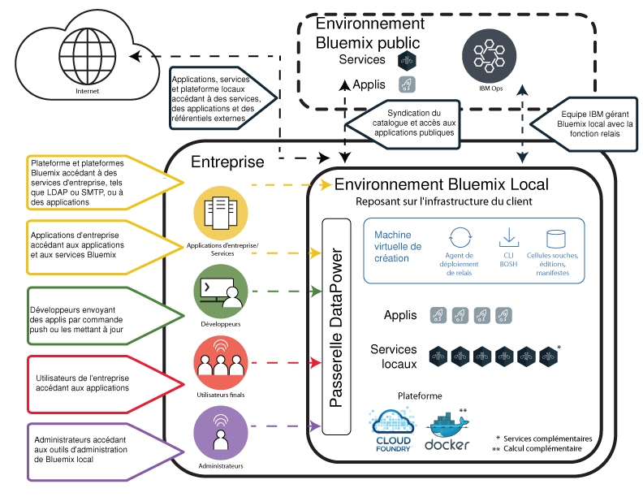

---

copyright:

  years: 2015, 2017

lastupdated: "2017-01-12"

---

{:new_window: target="_blank"}
{:shortdesc: .shortdesc}

# {{site.data.keyword.Bluemix_local_notm}}
{: #local}

L'environnement {{site.data.keyword.Bluemix_local}} apporte la puissance et l'agilité de la plateforme reposant sur le cloud {{site.data.keyword.Bluemix_notm}} à votre centre de données. Avec l'environnement {{site.data.keyword.Bluemix_local_notm}}, vous pouvez protéger vos charges de travail les plus sensibles derrière le pare-feu de votre société tout en restant connecté de façon sécurisée à l'environnement {{site.data.keyword.Bluemix_notm}} public et synchronisé.
{:shortdesc}

IBM® utilise des opérations de cloud en tant que service pour surveiller et gérer votre environnement de sorte que vous puissiez vous consacrer pleinement à la construction d'applications et de services s'exécutant sur l'environnement. {{site.data.keyword.IBM_notm}} gère également les mises à jour de la plateforme pour que vous puissiez vous consacrer à votre activité.

Les environnements {{site.data.keyword.Bluemix_local_notm}} appliquent les mêmes normes de sécurité que l'environnement {{site.data.keyword.Bluemix_notm}} public en termes de sécurité opérationnelle. Vous fournissez le matériel et l'infrastructure, ce qui vous permet de contrôler la [sécurité](/docs/security/index.html#localplatformsecurity) physique et de l'infrastructure. L'accès des développeurs à l'environnement {{site.data.keyword.Bluemix_notm}} local est contrôlé par vos stratégies LDAP, qui peuvent être configurées par l'équipe {{site.data.keyword.Bluemix_notm}} lorsqu'elle configure votre environnement. Dans l'environnement local, vous pouvez [gérer les utilisateurs et les droits](/docs/admin/index.html#oc_useradmin).

L'environnement {{site.data.keyword.Bluemix_local_notm}} est fourni avec tous les contextes d'exécution {{site.data.keyword.Bluemix_notm}} et 64 Go de mémoire de traitement.

Par ailleurs, un éventail de services est disponible en tant que services de {{site.data.keyword.Bluemix_local_notm}}. Examinez le tableau suivant pour déterminer les éléments inclus et ceux dont vous pouvez faire l'acquisition.

| **Type** | **Nom ** | **Description** |
|----------|----------|-----------------|
|Inclus | [Contextes d'exécution {{site.data.keyword.Bluemix_notm}}](/docs/cfapps/runtimes.html) | Utilisez des contextes d'exécution pour que votre application soit opérationnelle rapidement, sans qu'il soit nécessaire de configurer et de gérer des machines et des systèmes d'exploitation. Vous pouvez utiliser tous les contextes d'exécution {{site.data.keyword.Bluemix_notm}} dans votre instance {{site.data.keyword.Bluemix_notm}} locale.|
|Inclus | [{{site.data.keyword.autoscaling}}](/docs/services/Auto-Scaling/index.html)| Augmentez ou diminuez dynamiquement la capacité de traitement de votre application en fonction de règles. Avec ce service, vous bénéficiez d'une utilisation illimitée dans votre environnement {{site.data.keyword.Bluemix}} local.|
|Facultatif | [{{site.data.keyword.apiconnect_short}}](/docs/services/apiconnect/index.html) | {{site.data.keyword.apiconnect_long}} intègre {{site.data.keyword.APIM}} et IBM StrongLoop dans une offre unique qui fournit une solution complète pour la création, l'exécution, la gestion et l'application d'API et de microservices. |
|Facultatif | [{{site.data.keyword.containershort}}](/docs/containers/container_index.html) | Conteneurs Run Docker dans l'environnement {{site.data.keyword.Bluemix_notm}} local. Les conteneurs sont des objets logiciels virtuels qui incluent tous les éléments qu'une application a besoin d'exécuter. Un conteneur tire parti de l'isolation et de l'allocation des ressources, mais est plus portable et efficace que, par exemple, une machine virtuelle. Pour des informations sur la configuration matérielle requise, voir [IBM {{site.data.keyword.containershort}} dans les environnements {{site.data.keyword.Bluemix_notm}} dédié et local](/docs/containers/container_dl.html). |
|Facultatif | [{{site.data.keyword.datacshort}}](/docs/services/DataCache/index.html#data_cache) | Ce service fournit une grille de données en mémoire qui prend en charge des scénarios de mise en cache distribuée pour vos applications. Il inclut 50 Go de mémoire cache interne. |
| Facultatif (bêta) | [Logging](/docs/monitoringandlogging/cfapps_ml_logs_dedicated_ov.html#container_ml_logs_dedicated_ov) | Fournit des journaux pour vos applications Cloud Foundry dans votre interface utilisateur {{site.data.keyword.Bluemix_notm}} et des journaux permettant une recherche et des tableaux de bord dans Kibana. |
|Facultatif | [{{site.data.keyword.mobilepush}}](/docs/services/mobilepush/index.html) | {{site.data.keyword.mobilepush}} est un service que vous pouvez utiliser pour envoyer des notifications à un périphérique iOS ou Android. Les notifications peuvent être ciblées pour tous les utilisateurs d'application ou pour un ensemble spécifique d'utilisateurs et de périphériques à l'aide d'étiquettes. Vous pouvez administrer des périphériques, des étiquettes et des abonnements. Vous pouvez aussi utiliser un logiciel SDK (kit de développement de logiciels) et des API (interfaces de programme d'application) REST (Representational State Transfer) pour développer plus en détail vos applications client. |
|Facultatif | [{{site.data.keyword.sescashort}}](/docs/services/SessionCache/index.html#session_cache) | Pour augmenter la redondance, {{site.data.keyword.sescashort}} fournit une réplique d'une session qu'il stocke en cache. Par conséquent, en cas de microcoupure ou d'indisponibilité, votre application client peut continuer à accéder à la session en cache. Le service prend en charge des scénarios de mise en cache de session pour les applications Web et mobiles. |
|Facultatif | [{{site.data.keyword.iot_short}}](/docs/services/IoT/index.html) | Ce service permet à vos applications de communiquer et de consommer les données collectées par vos périphériques connectés, capteurs et passerelles. L'offre de base locale inclut un environnement initial permettant l'exécution d'une version privée d'IBM {{site.data.keyword.iot_short}} dans l'environnement local, avec une capacité de 100000 périphériques ou applications connectés simultanément et 1,6 To d'échange de données. |
{: caption="Table 1. Local services and runtimes" caption-side="top"}
{: #table01}

Vous pouvez acquérir des composants facultatifs pour élargir la capacité de vos ressources et périphériques. Vous pouvez acquérir ces composants en contactant l'équipe commerciale. Accédez à la page [Contactez-nous](https://console.ng.bluemix.net/?direct=classic/#/contactUs/cloudOEPaneId=contactUs) pour plus d'informations sur la manière de contacter un ingénieur commercial. Pour rehausser votre plan pour un service, vous pouvez sélectionner un plan depuis la vignette Service dans votre catalogue.

| **Nom ** | **Description** |
|----------|-----------------|
|{{site.data.keyword.Bluemix_notm}} Local {{site.data.keyword.apiconnect_short}} Professional 5 Million API Calls | Environnement permettant l'exécution d'une version privée de {{site.data.keyword.apiconnect_short}} avec une capacité de 5 millions d'appels d'API par mois ciblant des projets d'API au niveau des départements de l'entreprise. |
|{{site.data.keyword.Bluemix_notm}} Local {{site.data.keyword.apiconnect_short}} Professional 100 thousand API Calls increase| Extension de l'environnement {{site.data.keyword.apiconnect_short}} Professional offrant une capacité supplémentaire de 100000  appels d'API par mois. |
|{{site.data.keyword.Bluemix_notm}} Local {{site.data.keyword.apiconnect_short}} Enterprise 25 Million API Calls | Environnement permettant l'exécution d'une version privée de {{site.data.keyword.apiconnect_short}} avec une capacité de 25 millions d'appels d'API par mois ciblant des projets d'API au niveau de l'entreprise. |
|{{site.data.keyword.Bluemix_notm}} Local {{site.data.keyword.apiconnect_short}} Enterprise 100 thousand API Calls increase | Extension de l'environnement {{site.data.keyword.apiconnect_short}} Enterprise offrant une capacité supplémentaire de 100000 appels d'API par mois. |
|{{site.data.keyword.Bluemix_notm}} Data & Session Cache 50 GB capacity increase | Environnement permettant le déploiement et l'exécution d'instances Data Cache et Session Cache jusqu'à une capacité cumulée de 50 Go. |
|{{site.data.keyword.Bluemix_notm}} {{site.data.keyword.iot_short}} Local incremental increase | Environnement s'ajoutant à l'offre de service de base {{site.data.keyword.iot_short}} Local et permettant l'exécution d'une version privée d'{{site.data.keyword.iot_short}} dans l'environnement local, avec une capacité de 100000 périphériques ou applications connectés simultanément et 0,5 To d'échange de données. |
|{{site.data.keyword.IBM_notm}} {{site.data.keyword.mobilepush}} Local add-on instance | Environnement permettant le déploiement et l'exécution d'une instance {{site.data.keyword.mobilepush}} avec la possibilité d'accepter 300 demandes supplémentaires par seconde. |
{: caption="Table 2. Optional services components for purchase" caption-side="top"}
{: #table02}

| **Nom ** | **Description** |
|----------|-----------------|
|Local Cloud Foundry runtimes 64 GB capacity  | Environnement de contextes d'exécution Cloud Foundry avec une capacité d'exécution de 64 Go. |
|Local Cloud Foundry runtimes 16 GB capacity increase  | Extension de l'environnement de contextes d'exécution Cloud Foundry pour fournir une capacité d'exécution supplémentaire de 16 Go. |
|Local {{site.data.keyword.containerlong}} 16 GB capacity increase  | Extension de l'environnement {{site.data.keyword.containerlong}} pour fournir une capacité supplémentaire de 16 Go. |
|Local {{site.data.keyword.containerlong}} 64 GB capacity  | Environnement {{site.data.keyword.containerlong}} avec capacité de 64 Go. |
{: caption="Table 3. Optional platform add-on components for purchase" caption-side="top"}
{: #table03}

**Remarque **: les composants {{site.data.keyword.Bluemix_notm}} Local peuvent indiquer une capacité configurée spécifique, par exemple en gigaoctets ou transactions par seconde. Comme la capacité effective concrète pour chaque configuration du service de cloud varie en fonction de nombreux facteurs, elle peut être supérieure ou inférieure à la capacité configurée.

### Catalogue mixte
{: #cataloglocal}

L'environnement {{site.data.keyword.Bluemix_local_notm}} inclut un catalogue privé qui regroupe les services approuvés dans vos déploiements publics et locaux. Vous pouvez même publier et gérer l'accès à vos propres services via ce catalogue {{site.data.keyword.Bluemix_notm}}. Vous pouvez choisir les services publics qui satisfont les exigences pour votre activité selon vos critères de sécurité et de confidentialité des données.

Si vous disposez d'une instance privée d'un service {{site.data.keyword.Bluemix_notm}} pour votre environnement local, l'étiquette "Local" est associée aux noms de service dans votre vue d'administration du catalogue. De même, si le service est personnalisé (créé avec un courtier de services), l'étiquette "Personnalisé" est associée à son nom. Tous les autres services répertoriés sans l'étiquette "Local" ou "Personnalisé" sont disponibles via la syndication depuis l'environnement {{site.data.keyword.Bluemix_notm}} public. Les services syndiqués permettent la création d'applications hybrides composées de services publics et privés.

|Service	|Disponible dans la région Sud des Etats-Unis	|Disponible dans la région Europe-Royaume-Uni |Disponible dans la région Australie-Sydney|
|:----------|:------------------------------|:------------------|:------------------|
|{{site.data.keyword.alchemyapishort}} 		|Oui	   	|Oui  		|Oui|
|{{site.data.keyword.alertnotificationshort}}	|Oui		|Oui		|Oui	|
|{{site.data.keyword.apiconnect_short}}         |Oui            |Oui            |Oui  |
|{{site.data.keyword.appseccloudshort}}		|Oui		|Oui		|Oui |
|{{site.data.keyword.apiconnect_short}} 	|Oui   	 	|Oui  	 	|Oui   |
|Automated Accessibility Checker |Oui       |Oui    |Oui   |
|{{site.data.keyword.rules_short}}		|Oui		|Oui		|Oui |
|{{site.data.keyword.iotmapinsights_short}}    |Oui  |Oui  |Oui  |
|{{site.data.keyword.conversationshort}}  |Oui  |Oui  |Oui  |
|{{site.data.keyword.dashdbshort}}		|Oui		|Oui		|Oui |
|{{site.data.keyword.dataworks_short}}		|Oui		|Oui		|Non|
|{{site.data.keyword.DB2OnCloud_short}}		|Oui		|Oui		|Oui |
|Digital Content Checker |Oui  |Oui  |Oui  |
|{{site.data.keyword.documentconversionshort}}	|Oui		|Oui		|Oui|
|{{site.data.keyword.iotdriverinsights_short}}  |Oui |Oui  |Oui  |
|{{site.data.keyword.geospatialshort_Geospatial}}	|Oui	|Oui		|Oui |
|{{site.data.keyword.GlobalizationPipeline_short}}	|Oui		| Oui		| Oui |
|{{site.data.keyword.identitymixershort}}		|Oui		|Oui		|Oui|
|{{site.data.keyword.iot4auto_short}} |Oui   |Oui  |Oui  |
|{{site.data.keyword.iotelectronics}}  |Oui  |Oui  |Non |
|{{site.data.keyword.iotinsurance_short}} |Non   |Non   |Oui  |
|{{site.data.keyword.twittershort}}		|Oui		|Oui		|Oui|
|{{site.data.keyword.languagetranslationshort}}	|Oui		|Oui		|Oui |
|{{site.data.keyword.languagetranslatorshort}} |Oui  |Oui  |Oui  |
|{{site.data.keyword.dwl_short}}  |Oui  |Oui  |Non  |
|{{site.data.keyword.eventhubshort}}		|Oui		|Non		|Non|
|{{site.data.keyword.messagehub}}		|Oui		|Oui		|Non|
|{{site.data.keyword.manda}}			|Oui		|Oui		|Oui |
|{{site.data.keyword.amashort}}			|Oui		|Oui		|Oui |
|{{site.data.keyword.mqa}}			|Oui		|Oui		|Oui |
|{{site.data.keyword.mql}}			|Non		|Non		|Oui |
|{{site.data.keyword.nlclassifierlshort}} 	|Oui 		|Oui 		|Oui|
|{{site.data.keyword.personalityinsightsshort}}	|Oui		|Oui		|Oui|
|{{site.data.keyword.pm_short}}			|Oui		|Oui		|Non |
|{{site.data.keyword.mobilepush}}		|Oui		|Oui		|Oui |
|{{site.data.keyword.retrieveandrankshort}}	|Oui 		|Oui 		|Oui|
|{{site.data.keyword.runbook_short}}		|Oui		|Oui		|Oui|
|{{site.data.keyword.SecureGateway}}		|Oui		|Oui		|Oui |
|{{site.data.keyword.ssofull}}			|Oui		|Non		|Non|
|{{site.data.keyword.speechtotextshort}}	|Oui 		|Oui	 	|Oui|
|{{site.data.keyword.streaminganalyticsshort}}	|Oui		|Oui		|Oui |
|{{site.data.keyword.texttospeechshort}} 	|Oui 		|Oui	 	|Oui|
|{{site.data.keyword.toneanalyzershort}} 	|Oui 		|Oui 		|Oui|
|{{site.data.keyword.tradeoffanalyticsshort}}	|Oui		|Oui		|Oui|
|{{site.data.keyword.visualrecognitionshort}}	|Oui 		|Oui	 	|Oui|
|{{site.data.keyword.iot_short}}		|Oui		|Oui		|Non|
|{{site.data.keyword.weather_short}}		|Oui		|Oui		|Oui|
|{{site.data.keyword.workloadscheduler}}	|Oui		|Oui		|Oui |
{: caption="Table 4. Services available for syndication from {{site.data.keyword.Bluemix_notm}} Public par région" caption-side="top"}
{: #table04}

**Remarque** : les services tiers ne sont pas répertoriés dans le tableau. Consultez votre catalogue pour prendre connaissance des services tiers disponibles.

## Architecture {{site.data.keyword.Bluemix_local_notm}}
{: #localarch}

L'environnement {{site.data.keyword.Bluemix_local_notm}} s'appuie sur une infrastructure virtuelle qui se situe derrière le pare-feu de votre société pour que vous puissiez bénéficier de l'infrastructure de cloud la plus performante et la mieux sécurisée. {{site.data.keyword.IBM_notm}} installe, surveille à distance et gère l'environnement {{site.data.keyword.Bluemix_local_notm}} dans votre centre de données par le biais de la technologie de [relais](#localrelay) d'{{site.data.keyword.IBM_notm}}. L'architecture logique de la [Figure 1](#figure01) décrit la façon dont {{site.data.keyword.Bluemix_notm}} est configuré dans votre environnement local et la façon dont {{site.data.keyword.IBM_notm}} gère votre instance locale :

 

Figure 1. Architecture de l'environnement {{site.data.keyword.Bluemix_local_notm}}
{: #figure01}

La machine virtuelle de création s'exécute dans votre infrastructure virtuelle d'entreprise derrière votre pare-feu d'entreprise. La machine virtuelle de création crée une connexion réseau sortante vers le centre des opérations {{site.data.keyword.IBM_notm}} par le biais de la technologie de relais d'{{site.data.keyword.IBM_notm}}. Le relais a plusieurs fonctions et est décrit dans la section
[Relais](#localrelay) ci-après.

Les composants de la plateforme {{site.data.keyword.Bluemix_notm}} et les fonctions de base s'exécutent sur un réseau local virtuel (VLAN) isolé et privé. L'environnement {{site.data.keyword.Bluemix_local_notm}} utilise un réseau VLAN pour le sous-réseau privé. L'utilisation d'un sous-réseau privé à la place d'un réseau VLAN public est plus sécurisée et peut vous aider à éviter les problèmes de routage. Les fonctions de base qui constituent et prennent en charge la plateforme sont les suivantes :

<dl>
<dt>Plateforme</dt>
<dd>Au minimum, la plateforme est constituée des composants Cloud Foundry et de certains services d'application locaux. {{site.data.keyword.Bluemix_notm}} fournit l'environnement Cloud Foundry et l'environnement de calcul basé sur {{site.data.keyword.containerlong}}. L'un ou l'autre de ces environnements peut être configuré pour une entreprise, ou les deux. 
Une entreprise peut également ajouter des services d'application locaux supplémentaires. 

Pour connaître les services supplémentaires et les fonctions de calcul qui peuvent être ajoutés, voir [Composant facultatifs dont vous pouvez faire l'acquisition : modules complémentaires pour les services](#table02) et [Composant facultatifs dont vous pouvez faire l'acquisition : modules complémentaires de plateforme](#table03).

</dd>
<dt>{{site.data.keyword.Bluemix_notm}} public</dt>
<dd>
Un environnement {{site.data.keyword.Bluemix_local_notm}} peut disposer d'une connexion sortante vers une région de l'environnement {{site.data.keyword.Bluemix_notm}} public. Une telle connexion permet la syndication des services publics vers le catalogue local. La syndication des services de l'environnement {{site.data.keyword.Bluemix_notm}} public fournit aux développeurs un moyen pratique de générer des applications hébergées sur l'environnement {{site.data.keyword.Bluemix_local_notm}} de l'entreprise, ainsi qu'un accès aux services exécutés dans {{site.data.keyword.Bluemix_notm}} public. Reportez-vous à la liste des services {{site.data.keyword.IBM_notm}} qui peuvent être syndiqués depuis {{site.data.keyword.Bluemix_notm}} public dans la section [Catalogue mixte](#cataloglocal).
</dd>
<dt>Opérations {{site.data.keyword.IBM_notm}}</dt>
<dd>
{{site.data.keyword.IBM_notm}} gère et surveille la plateforme locale et les service locaux, et leur applique la maintenance adéquate, pour que vous puissiez vous concentrer sur la création d'applications innovantes. L'équipe {{site.data.keyword.IBM_notm}} Operations Support Services (OSS) effectue ces opérations en utilisant une connexion de tunnel VPN depuis la machine virtuelle de création vers le réseau des opérations {{site.data.keyword.IBM_notm}}.
</dd>
<dt>Entreprise</dt>
<dd>
L'environnement réseau d'entreprise est doté d'un lien réseau bidirectionnel vers {{site.data.keyword.Bluemix_local_notm}}. Cela permet aux applications hébergées dans {{site.data.keyword.Bluemix_local_notm}} d'accéder aux services et aux ressources de l'entreprise, y compris les sources de données et les services d'entreprise. Le lien réseau permet également à {{site.data.keyword.Bluemix_local_notm}} d'utiliser votre protocole LDAP pour l'authentification des développeurs et des administrateurs.
</dd>
<dt>Services locaux</dt>
<dd>Un ensemble de services destiné à une utilisation privée au sein de votre environnement {{site.data.keyword.Bluemix_local_notm}} est disponible. Vous décidez généralement des services que vous souhaitez utiliser dans votre environnement avant que l'équipe {{site.data.keyword.IBM_notm}} ne procède au déploiement. Pour obtenir la liste des services disponibles, voir [Services et contextes d'exécution locaux](#table01).
</dd>
<dt>Passerelle DataPower</dt>
<dd>
Les dispositifs {{site.data.keyword.IBM_notm}} DataPower Gateway permettent d'accéder aux domaines d'application {{site.data.keyword.Bluemix_notm}} application. Ces dispositifs se connectent à votre réseau intranet et au réseau privé {{site.data.keyword.Bluemix_notm}}, fournissant ainsi une passerelle sécurisée au déploiement {{site.data.keyword.Bluemix_notm}}. Vos développeurs, qui déploient les applications et les services, obtiennent ainsi leurs accès depuis votre intranet via cette passerelle. Les utilisateurs des applications, ainsi que vos administrateurs obtiennent également leurs accès via les dispositifs DataPower.
</dd>
<dt>Sécurité intérieure</dt>
<dd>
{{site.data.keyword.IBM_notm}} utilise la plateforme QRadar Security Intelligence Platform pour fournir une architecture unifiée pour l'intégration de plusieurs composants clés. Ces composants incluent la gestion des événements et des informations de sécurité, la gestion des journaux, la détection des anomalies, l'analyse des incidents, ainsi que la gestion des configurations et des vulnérabilités. {{site.data.keyword.Bluemix_notm}} utilise aussi les outils SIEM (information sur la sécurité et gestion des événements) d'{{site.data.keyword.IBM_notm}} QRadar pour surveiller les actions des utilisateurs privilégiés ainsi que les tentatives de connexion, réussies ou non, des développeurs d'applications. Les rapports QRadar fournissent au client une certaine visibilité dans la section Rapports et journaux de la page Administration. Pour des informations sur les rapports de sécurité, voir [Affichage des rapports](/docs/admin/index.html#oc_report).

{{site.data.keyword.IBM_notm}} BigFix s'assure que les correctifs pour les systèmes d'exploitation sont appliqués régulièrement. Le processus de correction est automatisé et la planification est convenue entre vous et IBM. Pour des informations sur la maintenance et les mises à niveau, voir [Gestion de votre instance locale](index.html#maintainlocal).

</dd>
</dl>

Vos applications sont déployées dans des conteneurs virtuels qui s'exécutent sur des machines virtuelles Cloud Foundry. Tous les composants Cloud Foundry, comme les contrôleurs de cloud, les gestionnaires de santé, les routeurs et les agents DEA (Droplet Execution Agent) sont déployés lorsque {{site.data.keyword.Bluemix_notm}} est configuré. Les divers composants de gestion {{site.data.keyword.Bluemix_notm}} sont également inclus dans le déploiement de {{site.data.keyword.Bluemix_notm}}.

Pour des informations sur les spécifications de réseau et les exigences en matière d'infrastructure, voir [Exigences de l'infrastructure d'un environnement {{site.data.keyword.Bluemix_local_notm}}](/docs/local/index.html#localinfra).

### Relais
{: #localrelay}

Le relais est le lien sécurisé entre votre réseau d'entreprise et les
opérations de cloud d'{{site.data.keyword.IBM_notm}}. Le trafic dans cette connexion de relais est une activité automatisée qui sert et gère la plateforme {{site.data.keyword.Bluemix_local_notm}}, les ressources de traitement et les services pour vos instances. Ce trafic peut être classé en différentes catégories comme suit :

* surveillance et événements
* sécurité intérieure
* déploiements et mises à jour
* identification des problèmes et correctifs
* maintenance d'urgence

<dl>
<dt>
Surveillance et événements
</dt>
<dd>
Les fonctions de surveillance et d'événements sont déployées dans votre centre de données. Les données d'application restent dans votre centre de données. 
Le trafic de la connexion relais inclut la capacité de surveillance qui est utilisée par les opérations {{site.data.keyword.IBM_notm}} pour surveiller l'état et identifier les problèmes si nécessaire. 

Aucune donnée sensible n'est incluse dans les informations de surveillance, ce qui signifie aucun mot de passe, aucune donnée d'application, aucun journal d'application et aucune clé. Le trafic du relais inclut des flux provenant de la machine virtuelle de création vers le centre des opérations {{site.data.keyword.Bluemix_notm}}.

</dd>
<dt>
Security Intelligence
</dt>
<dd>
{{site.data.keyword.IBM_notm}} utilise la plateforme QRadar Security Intelligence Platform pour fournir une architecture unifiée pour l'intégration de plusieurs composants clés. Ces composants incluent la gestion des événements et des informations de sécurité, la gestion des journaux, la détection des anomalies, l'analyse des incidents, ainsi que la gestion des configurations et des vulnérabilités. 

{{site.data.keyword.Bluemix_notm}} utilise aussi les outils SIEM (information sur la sécurité et gestion des événements) d'{{site.data.keyword.IBM_notm}} QRadar pour surveiller les actions des utilisateurs privilégiés ainsi que les tentatives de connexion, réussies ou non.

Les rapports QRadar fournissent à l'administrateur {{site.data.keyword.Bluemix_notm}} une certaine visibilité sur ces données d'événement dans la section Rapports et journaux de la page Administration. Les rapports QRadar sont générés régulièrement, tous les jours ou tous les mois selon le type de rapport. Tous les rapports sont conservés pendant 90 jours dans la console d'administration, à partir de laquelle vous pouvez y accéder. Au bout de ces 90 jours, {{site.data.keyword.IBM_notm}} les tient à disposition hors ligne sur demande pendant 9 mois. Au total, les rapports sont disponibles en vue de leur extraction pendant un an.

Aucune donnée d'application ne figure dans le trafic consommé par QRadar. Les seules données qui pourraient éventuellement être considérées comme sensibles sont les ID utilisateur figurant dans les rapports sur les tentatives de connexion et les adresses IP de certains composants {{site.data.keyword.Bluemix_notm}}.
Le trafic du relais inclut des flux entre le processeur d'événement QRadar dans {{site.data.keyword.Bluemix_local_notm}} et une console QRadar dans le centre des opérations {{site.data.keyword.IBM_notm}}.

</dd>
<dt>
Déploiement et mises à jour de maintenance
</dt>
<dd>
A l'exception de l'installation initiale de la machine virtuelle de création installée lors d'une phase antérieure du processus de déploiement, le déploiement de la plupart des autres composants est automatisé via UrbanCode Deploy. 

Pour les activités de déploiement, UrbanCode Deploy repose sur [BOSH ](https://bosh.cloudfoundry.org/){:new_window}, les composants BOSH étant parmi les premiers composants à être déployés à partir de la machine virtuelle de création. La fonction de distribution continue d'UrbanCode Deploy permet de distribuer des mises à jour de plateforme via un processus cohérent de test et de validation.

Les scripts et les packages sont transférés depuis le centre des opérations {{site.data.keyword.IBM_notm}} vers votre plateforme {{site.data.keyword.Bluemix_notm}} locale via le relais.

</dd>
<dt>
Correctifs
</dt>
<dd>
{{site.data.keyword.IBM_notm}} BigFix s'assure que les mises à jour de sécurité pour les systèmes d'exploitation sont appliqués régulièrement. Le processus de correction est automatisé et la planification est convenue entre vous et IBM.
</dd>
<dt>
Identification des problèmes et maintenance d'urgence
</dt>
<dd>
{{site.data.keyword.IBM_notm}} fournit la liste des utilisateurs et des ID approuvés du centre des opérations {{site.data.keyword.IBM_notm}} qui peuvent accéder à votre environnement. Vous pouvez procéder à l'audit des accès à votre environnement sur la page Administration de votre environnement {{site.data.keyword.Bluemix_local_notm}}. 

Les utilisateurs des opérations {{site.data.keyword.IBM_notm}} accèdent à l'environnement {{site.data.keyword.Bluemix_local_notm}} uniquement dans le but d'avoir une meilleure connaissance de l'état de la plateforme. L'équipe des opérations n'a jamais accès au code ou aux données des applications, et n'exécute que des commandes nécessaires à l'identification des problèmes afin de vérifier les configurations ou les paramètres en cas d'urgence et effectuer des opérations non automatisées. Aucune de ces commandes ne transfère de donnée sensible via le relais.

L'accès à votre environnement local est sécurisé à l'aide d'une authentification à deux facteurs au cours de plusieurs étapes du processus de connexion. En générant un rapport de sécurité, vous pouvez savoir qui accède à votre environnement, et quand et pourquoi des utilisateurs y ont accédé.

Le trafic du relais à des fins d'identification des problèmes et de maintenance d'urgence est un trafic SSH, tout comme le trafic LDAP et Kerberos employé pour l'authentification des utilisateurs {{site.data.keyword.IBM_notm}}. 
En tant qu'administrateur, vous pouvez voir l'intégralité de l'environnement pour gérer les incidents, les problèmes, les modifications, la capacité et la sécurité. Vous pouvez accéder aux informations sur votre environnement dans la page Administration. La technologie de relais garde la page Administration à jour avec les données d'événement de la plateforme les
plus récentes issues de QRadar. 

</dd>
</dl>

### Inspection SSL
{: #sslinspection}

Cloud Foundry et les applications
{{site.data.keyword.Bluemix_notm}} peuvent fonctionner avec des
certificats d'inspection SSL lorsqu'ils accèdent à des sources hors de
l'environnement local. L'inspection de contenu SSL  est disponible pour votre
environnement si vous fournissez un certificat racine utilisé pour signer les
flux SSL inspectés. 

L'équipe de déploiement {{site.data.keyword.Bluemix_notm}} charge
le certificat racine afin d'activer l'inspection SSL dans
l'environnement lors du processus de déploiement dans votre environnement local. L'activation
de l'inspection SSL lors du processus de configuration de
l'environnement n'allonge pas la durée du déploiement. Si cette fonction n'est
pas activée lors du déploiement initial, vous pouvez demander son activation ;
cela peut néanmoins entraîner un coût supplémentaire et l'activation peut
prendre de deux à quatre jours selon votre fenêtre de maintenance disponible.

## Configuration de votre instance {{site.data.keyword.Bluemix_local_notm}}
{: #setuplocal}

{{site.data.keyword.Bluemix_local_notm}} fournit une version privée de l'offre d'environnement {{site.data.keyword.Bluemix_notm}} public qui est hébergée sur le matériel de votre choix. Les deux options couramment prises en charge sont les suivantes :
* Vous fournissez le matériel sous la forme de VMware.
* Vous commandez le système local {{site.data.keyword.Bluemix_notm}} intégré dans un appareil PureApplication préconfiguré que vous pouvez vous procurer via {{site.data.keyword.IBM_notm}}. Pour plus d'informations sur les options de l'appareil PureApplication, voir [IBM {{site.data.keyword.Bluemix_notm}} Local System W3500 and W3550 models run cloud native services, enabled middleware, and open pattern workloads concurrently ](https://www-01.ibm.com/common/ssi/rep_ca/5/897/ENUS216-325/){: new_window}.

Pour {{site.data.keyword.Bluemix_local_notm}}, vous pouvez utiliser les services et les contextes d'exécution {{site.data.keyword.Bluemix_notm}} pour répondre à vos besoins informatiques dans un environnement de cloud sécurisé, géré et hébergé par le client. {{site.data.keyword.IBM_notm}} fournit l'accès à l'environnement {{site.data.keyword.Bluemix_local_notm}} par le biais d'une connexion sécurisée par mot de passe. Vous pouvez accéder aux services, aux contextes d'exécution et aux ressources associées, et déployer et retirer des applications {{site.data.keyword.Bluemix_notm}}. Suivez les étapes ci-après pour collaborer avec votre interlocuteur {{site.data.keyword.IBM_notm}} afin de configuration votre instance locale de {{site.data.keyword.Bluemix_notm}}.

**Remarque** : Si vous hébergez {{site.data.keyword.Bluemix_local_notm}} sur l'option matérielle {{site.data.keyword.Bluemix_notm}} Local System, le processus de configuration peut être différent car vous devez communiquer moins d'informations au représentant IBM. En outre, vos rôles et responsabilités tout au long des phases de conception et de progression risquent d'être réduits en raison du modèle de maintenance "appel vers IBM" de l'appareil PureApplication, par rapport au modèle de gestion nécessaire à l'utilisation d'un VMware en possession du client.

Pour configurer votre version privée de {{site.data.keyword.Bluemix_notm}} :

<ol>
<li>Vérifiez les <a href="index.html#localinfra" title="S'ouvre dans une nouvelle fenêtre">exigences de l'infrastructure d'un environnement {{site.data.keyword.Bluemix_local_notm}}</a> en vue de la configuration de votre instance locale.</li>
<li>Prenez contact avec votre représentant de compte {{site.data.keyword.IBM_notm}} ou <a href="https://console.ng.bluemix.net/?direct=classic/#/contactUs/cloudOEPaneId=contactUs" target="_blank">contactez {{site.data.keyword.Bluemix_notm}} </a> pour commencer.</li>
<li>Etablissez votre contrat {{site.data.keyword.Bluemix_local_notm}} avec {{site.data.keyword.IBM_notm}}, qui inclut des dates de jalon pour la distribution.
	<ol type="a">
	<li>Décidez avec IBM de votre configuration, qui ne sera effectuée qu'une fois, ainsi que des prix mensuels récurrents pour votre instance {{site.data.keyword.Bluemix_notm}} locale. Le prix mensuel dépend des services locaux que vous voulez utiliser, et comprend un abonnement à tous les services {{site.data.keyword.Bluemix_notm}} publics. Vous recevez ensuite une facture pour tous les éléments que vous utilisez au-delà de ce contrat d'abonnement.</li>
	<li>Identifiez les échéances pour chaque phase de configuration de votre instance {{site.data.keyword.Bluemix_local_notm}}.</li>
	</ol>
	</li>
<li>Une fois votre plateforme et votre compte créés, vous identifiez les personnes de votre organisation à affecter aux rôles nécessaires à la configuration et à l'exécution de votre instance locale. Pour plus d'informations sur les rôles que vous attribuez, voir <a href="/docs/local/index.html#rolesresponsibilities">Rôles et responsabilité de l'environnement {{site.data.keyword.Bluemix_notm}} local</a>.
</li>
<li>Vous fournissez le matériel et {{site.data.keyword.IBM_notm}} vous aide à définir et à établir la connectivité du réseau entre votre réseau d'entreprise et votre instance {{site.data.keyword.Bluemix_local_notm}}. Pour plus d'informations sur les exigences de l'infrastructure, voir <a href="index.html#localinfra">Exigences de l'infrastructure d'un environnement {{site.data.keyword.Bluemix_local_notm}}</a>.
	<ol type="a">
	<li>{{site.data.keyword.IBM_notm}} configure l'accès réseau et LDAP en fonction des éléments que vous avez fournis. L'accès administrateur est accordé aux contacts que vous désignez. Vous devez également désigner un contact pour le support et la facturation.</li>
	<li>{{site.data.keyword.IBM_notm}} configure un catalogue mixte dans votre environnement local qui répertorie vos services locaux et plusieurs des services {{site.data.keyword.Bluemix_notm}} publics.</li>
	<li>Vous validez la configuration du réseau et du pare-feu ainsi que l'accès et le noeud final LDAP.</li>
	</ol>
</li>
</ol>

Vous pouvez vous attendre à obtenir un processus similaire à la liste suivante pour le déploiement initial et la configuration de votre environnement. Pour obtenir des détails sur les responsables de chaque tâche, voir [Rôles et responsabilités](/docs/local/index.html#rolesresponsibilities).

**Remarque** : Si vous choisissez d'héberger votre
instance locale sur l'option matérielle {{site.data.keyword.Bluemix_notm}} Local
System, vous pouvez ignorer les étapes 1 à 3 dans la liste suivante.

<ol>
<li>Vous fournissez la configuration VMware qui respecte les spécifications de vos ressources de traitement,  vos réseaux et votre mode de stockage. Pour plus d'informations sur les exigences en matière d'infrastructure, voir <a href="/docs/local/index.html#localinfra">Exigences de l'infrastructure d'un environnement {{site.data.keyword.Bluemix_notm}} local</a>.</li>
<li>Vous fournissez les données d'identification du cluster vCenter que la machine virtuelle de création utilisera. Vous devez indiquer les informations suivantes :
<ul>
<li>Nom du cluster VMware</li>
<li>Données d'identification du cluster vCenter, notamment l'ID utilisateur et le mot de passe</li>
<li>Le ou les noms de magasin de données (Nom LUN de stockage)</li>
<li>ID du réseau local virtuel/groupe de ports VMware</li>
<li>Nom du pool de ressources</li>
</ul>
</li>
<li>Vous travaillez en collaboration avec {{site.data.keyword.IBM_notm}} pour valider les données d'identification que vous avez fournies dans la tâche précédente.</li>
<li>Vous fournissez 7 adresses IP sur votre réseau. Si vous disposez d'un proxy Web sécurisé pour autoriser l'accès Internet sortant pour les composants {{site.data.keyword.Bluemix_notm}} internes, vous devez fournir les données d'identification pour vous y connecter.

**Remarque** : si votre proxy Web n'est pas sécurisé, vous n'avez pas besoin de fournir de données d'identification. Notez également que les clients d'un environnement {{site.data.keyword.Bluemix_local_notm}} n'utilisent pas tous un proxy Web.
</li>
<li>{{site.data.keyword.IBM_notm}} fournit une liste blanche d'URL depuis lequel l'accès via votre proxy Web doit être approuvé avant de lancer le déploiement. 

**Remarque** : pour faire en sorte que vos applications existantes ou nouvelles puissent accéder aux ressources nécessaires, vous devrez peut-être exécuter des étapes supplémentaires afin de regrouper les ressources avec le pack de construction ou collaborer avec votre équipe de sécurité afin de placer dans une liste blanche les URL nécessaires à l'exécution de vos applications. Pour plus d'informations sur l'utilisation des packs de construction node.js et Liberty for Java, voir <a href="../runtimes/nodejs/offlineMode.html">Mode déconnecté pour node.js</a> et <a href="../runtimes/liberty/offlineMode.html">Mode déconnecté pour Liberty for Java</a>.

</li>
<li>Vous spécifiez les noms de domaine pour le déploiement et les ID que vous souhaitez utiliser. Vous obtenez deux domaines partiellement définis lorsque vous configurez votre instance locale et vous sélectionnez le préfixe de ces deux domaines. Par exemple, vous sélectionnez le préfixe pour <code>*masociété*.bluemix.net</code> et <code>*masociété*.mybluemix.net</code>. 
 
Vous pouvez également définir un domaine entièrement personnalisé, comme
monbmxpersonnalisé.mon_entreprise.com et application..mon_entreprise.com. Vous
devez fournir le certificat SSL, la clé de certificat et le certificat racine
avant le déploiement de l'environnement. Le certificat racine fourni peut également être utilisé pour configurer l'<a href="index.html#sslinspection">inspection SSL</a> de votre environnement sur demande.  
 
Vous pouvez choisir autant de domaines personnalisés pour vos applications que
vous le souhaitez, dans la mesure où vous fournissez les certificats des
domaines personnalisés. Pour plus d'informations sur la création d'un domaine personnalisé, voir <a href="../manageapps/updapps.html#domain">Création et utilisation d'un domaine personnalisé</a>.</li>
<li>Vous choisissez la technologie (tunnel IPSec ou OpenVPN) à utiliser pour configurer le relais permettant de se reconnecter au centre des opérations {{site.data.keyword.IBM_notm}}.</li>
<li>{{site.data.keyword.IBM_notm}} installe et démarre la machine virtuelle de création dans le cluster {{site.data.keyword.Bluemix_notm}}. Si vous fournissez votre propre VMware, un interlocuteur {{site.data.keyword.IBM_notm}} aidera votre ingénieur commercial à réaliser cette tâche. Si
vous avez commandé l'option matérielle
{{site.data.keyword.Bluemix_notm}} Local System, un représentant IBM
effectue cette tâche.</li>
<li>{{site.data.keyword.IBM_notm}} configure le relais pour communiquer avec le centre des opérations {{site.data.keyword.IBM_notm}}.</li>
<li>Le référentiel de la machine virtuelle de création extrait les artefacts de construction mis à jour.</li>
<li>Vous fournissez les données d'identification pour qu'{{site.data.keyword.IBM_notm}} se connecte à l'instance d'annuaire LDAP de l'entreprise.</li>
<li>{{site.data.keyword.IBM_notm}} a recours à l'automatisation pour déployer la plateforme {{site.data.keyword.Bluemix_notm}} de base.</li>
<li>{{site.data.keyword.IBM_notm}} déploie la plateforme de base qui comprend les environnements d'exécution élastiques, la console, les fonctions d'administration et de surveillance.</li>
<li>{{site.data.keyword.IBM_notm}} relie le catalogue mixte de votre déploiement local à une instance {{site.data.keyword.Bluemix_notm}} publique pour l'utilisation de services publics. Par défaut, un ensemble de services publics est disponible dans votre instance locale. Vous pouvez utiliser la page d'administration pour la gestion du catalogue afin d'activer ou désactiver les services de votre instance locale.</li>
<li>{{site.data.keyword.IBM_notm}} configure votre accès administrateur à l'environnement.</li>
<li>Vous pouvez commencer à utiliser votre instance locale surveillée par l'équipe {{site.data.keyword.IBM_notm}} chargée des opérations pour répondre aux alertes.</li>
</ol>

Une fois votre instance {{site.data.keyword.Bluemix_notm}} configurée, vous pouvez surveiller et gérer votre instance {{site.data.keyword.Bluemix_notm}} via la page Administration. Pour plus d'informations, voir [Gestion de l'environnement {{site.data.keyword.Bluemix_local_notm}} et de l'environnement Bluemix dédié](../admin/index.html#mng). Pour plus d'informations sur les mises à niveau et la maintenance, voir [Gestion de votre instance locale](index.html#maintainlocal).

##Rôles et responsabilités
{: #rolesresponsibilities}

Si vous configurez un compte {{site.data.keyword.Bluemix_local_notm}}, vous identifiez les personnes de votre organisation à affecter aux rôles nécessaires à la configuration et à l'exécution de votre instance.

###Rôles

La liste suivante répertorie les rôles et les responsabilités des clients que vous attribuez :

<dl>
<dt>**Contact du service Achats (Procurement focal)**</dt>
<dd>Collabore avec l'interlocuteur {{site.data.keyword.IBM_notm}} afin d'établir votre environnement {{site.data.keyword.Bluemix_local_notm}}, notamment pour identifier les personnes autorisées dans votre organisation à travailler sur un aspect du projet. La personne disposant de ce rôle supervise la sélection de pattern, les accords commerciaux et les accords relatifs à l'accès aux ressources du client. Le contact du service Achats est le contact général pour la configuration de l'instance locale.</dd>
<dt>**Agent de conformité (Compliance officer)**</dt>
<dd>Collabore avec l'interlocuteur {{site.data.keyword.IBM_notm}} pour sélectionner une topologie et une option de déploiement répondant à vos exigences en matière de sécurité. La personne disposant de ce rôle collabore avec le consultant en conformité d'{{site.data.keyword.IBM_notm}} pour déterminer quels sont les patterns de déploiement qui permettent d'atteindre les objectifs de conformité.</dd>
<dt>**Spécialiste réseau (Network specialist)**</dt>
<dd>Collabore avec l'interlocuteur {{site.data.keyword.IBM_notm}} sur les plans de réseau pour le déploiement {{site.data.keyword.Bluemix_notm}}. La personne disposant de ce rôle passe en revue les spécifications de réseau requises par {{site.data.keyword.IBM_notm}} et collabore avec {{site.data.keyword.IBM_notm}} afin d'établir un plan d'implémentation. A la fin de la phase d'installation et de vérification, elle confirme que la configuration du réseau est conforme aux standard d'entreprise.</dd>
<dt>**Contact DevOps (DevOps focal)**</dt>
<dd>Collabore avec l'interlocuteur {{site.data.keyword.IBM_notm}} afin de planifier et d'appliquer les mises à jour de maintenance nécessaires pour la plateforme, les services et les contextes d'exécution {{site.data.keyword.Bluemix_notm}}. La personne disposant de ce rôle collabore également avec l'interlocuteur {{site.data.keyword.IBM_notm}} sur la configuration de votre instance {{site.data.keyword.Bluemix_local_notm}}.</dd>
<dt>**Spécialiste IaaS (IaaS specialist)**</dt>
<dd>Collabore avec les interlocuteurs {{site.data.keyword.IBM_notm}} sur le plan de déploiement pour VMware. En général, il s'agit d'un administrateur VMware dans le centre de données. La personne disposant de ce rôle passe en revue les <a href="../local/index.html#localinfra">exigences de l'infrastructure de l'environnement {{site.data.keyword.Bluemix_local_notm}}</a> et collabore avec {{site.data.keyword.IBM_notm}} afin d'établir un plan d'implémentation. A la fin du déploiement, la personne disposant de ce rôle confirme que le déploiement est conforme aux standard d'entreprise dans la couche IaaS.</dd>
<dt>**Contact des opérations (Operations focal)**</dt>
<dd>Collabore avec l'équipe de support {{site.data.keyword.IBM_notm}} si nécessaire une fois l'environnement configuré et exécuté. Cet utilisateur dispose d'un accès **Superutilisateur** à la console d'administration et peut approuver et planifier les mises à jour de maintenance de l'environnement {{site.data.keyword.Bluemix_notm}} ; il est également disponible à tout moment en cas d'incident critique. La personne affectée à ce rôle doit avoir les connaissances techniques de l'environnement {{site.data.keyword.Bluemix_notm}} et être en mesure de joindre les experts de la société dans les domaines susceptibles d'être concernés, comme le réseau ou la sécurité.
</dd>
</dl>

Vos ingénieurs commerciaux collaborent avec des spécialistes {{site.data.keyword.IBM_notm}} pour garantir que vous disposiez toujours du support dont vous avez besoin. Vous pouvez procéder à la mise à niveau vers le niveau de support Premium afin d'utiliser un responsable Client Success (CSM) dédié pour votre compte. Pour plus d'informations sur les différents niveaux de support, voir [Contacter le service de support](../support/index.html#contacting-support). Le responsable Client Success (CSM) effectue les types de tâche suivants :

<ul>
<li>Il assure la coordination technique entre vous et IBM.</li>
<li>Il coordonne les mises à jour, les mises à niveau, l'aide des experts d'IBM et l'intégration initiale d'un ingénieur support {{site.data.keyword.Bluemix_notm}}.</li>
<li>Il fournit des informations sur les types de support disponibles.</li>
<li>Il fait office de point d'escalade initial, si nécessaire.</li>
</ul>

L'équipe en charge des opérations et du support {{site.data.keyword.Bluemix_notm}} qui travaille avec vous sur votre instance {{site.data.keyword.Bluemix_notm}} peut accéder à votre environnement local, mais n'utilise cette possibilité que pour les raisons suivantes :

<ul>
<li>Pour répondre à des alertes et effectuer une maintenance opérationnelle</li>
<li>Pour tenter de reproduire un problème qui a été signalé dans un ticket d'incident</li>
</ul>

###Responsabilités

De la configuration de votre environnement à la maintenance permanente, vous et IBM devez effectuer diverses tâches. Les tableaux ci-dessous répertorient les tâches requises ainsi que les propriétaires pour l'exécution de la tâche au cours des phases de création, de progression et d'achèvement.

La phase de création permet d'établir l'environnement {{site.data.keyword.Bluemix_local_notm}}. A ce stade, vous avez déjà révisé les [exigences de l'infrastructure locale](../local/index.html#localinfra). Les objectifs principaux de cette phase sont les suivants :

- Réviser l'accord financier et établir les dates de jalon pour la distribution.
- Créer la plateforme {{site.data.keyword.Bluemix_notm}} et fournir l'accès aux contextes d'exécution et aux services.
- Définir et établir la connectivité du réseau entre votre réseau d'entreprise et les opérations {{site.data.keyword.Bluemix_notm}}.
- Identifier et affecter des rôles pour votre équipe d'administration.

| **Tâche** | **Détails de la tâche** | **Partie responsable** |
|----------|------------------|-----------------------|
|Définir les normes de conformité | Identifier les normes du gouvernement, de l'industrie et de l'entreprise propriétaire qui sont requises pour l'environnement. | Client |
|Créer un plan d'intégration de conformité et de sécurité | Créer un plan d'intégration et de sécurité qui inclut les coûts, la planification et les ressources qui sont nécessaires pour assurer la conformité et la sécurité. | {{site.data.keyword.IBM_notm}} |
|Approbation du plan de conformité | Approbation du plan de conformité. | Client |
|Créer la taille de l'environnement |  	Créer la taille de l'environnement en fonction de choix prédéfinis qui prennent en compte les objectifs de haute disponibilité et de reprise après incident, ainsi que la mise à disposition initiale des services et de l'agent DEA nécessaires pour la prise en charge des applications créées avec la plateforme. Vous collaborez avec {{site.data.keyword.IBM_notm}} pour définir par exemple les bases de données qui sont nécessaires, les services qui sont proposés dans le catalogue mixte du client, etc. | {{site.data.keyword.IBM_notm}} et le client partagent la responsabilité |
|Sélectionner une architecture | Sélectionner une architecture en fonction de choix prédéfinis qui prennent en compte les exigences de haute disponibilité et de reprise après incident. | {{site.data.keyword.IBM_notm}} |
|Définir les objectifs de reprise après incident | Définir les exigences de reprise après incident pour l'environnement. | Client |
|Créer un plan de reprise après incident | Définir le plan de reprise après incident et vous consulter. {{site.data.keyword.IBM_notm}} et le client partagent la responsabilité crée un modèle de reprise après incident et vous consulte pour que vous puissiez donner votre feedback et approuver le plan. | {{site.data.keyword.IBM_notm}} et le client partagent la responsabilité |
|Créer un plan de sauvegarde et de reprise | Créer un plan de sauvegarde et de reprise qui définit la fréquence et les exigences pour une distribution sur site et hors site de la sauvegarde. {{site.data.keyword.IBM_notm}} sauvegarde des composants de plateforme, des services {{site.data.keyword.IBM_notm}}, des métadonnées de service incluant des rôles utilisateur, etc. Vous sauvegardez les données propres à l'application desquelles vous êtes en charge. | {{site.data.keyword.IBM_notm}} et le client partagent la responsabilité |
|Identifier les outils pour la détection d'événements et l'identification des problèmes. | Identifier les outils {{site.data.keyword.IBM_notm}} et tiers utilisés pour la détection d'événements et l'identification des problèmes au niveau de la plateforme {{site.data.keyword.Bluemix_notm}}. | {{site.data.keyword.IBM_notm}} |
|Définir un plan d'escalade | Définir le plan d'escalade pour analyser les besoins et résoudre les événements détectés depuis les composants de surveillance. | {{site.data.keyword.IBM_notm}} |
|Signer des accords relatifs à l'infrastructure, la plateforme et le support | Signer le contrat d'abonnement incluant les dispositions financières pour l'environnement. Signer l'abonnement au support. | Client |
|Procurer l'environnement | Procurer les ressources de traitement, le réseau et le stockage. Pour plus d'informations sur les exigences de l'infrastructure pour l'environnement, voir [Exigences de l'infrastructure d'un environnement Bluemix local](../local/index.html#localinfra). | Client |
|Installer la solution de réseau privé virtuel | Installer la solution de réseau privé virtuel bidirectionnelle. | {{site.data.keyword.IBM_notm}} |
|Installer les composants de plateforme, d'application, de surveillance et de gestion | Installer, configurer et vérifier les composants de plateforme, comme BOSH Director, le contrôleur de cloud, le gestionnaire de santé, la messagerie, les routeurs, les agents DEA et les fournisseurs de services, ainsi que les composants de surveillance qui sont définis dans le plan d'escalade et de détection des problèmes. | {{site.data.keyword.IBM_notm}} |
|Installer et configurer les composants de sécurité | Installer et configurer les composants de sécurité qui sont liés dans le plan de surveillance et d'escalade, notamment {{site.data.keyword.IBM_notm}} QRadar, le coffre des identifications, le système de prévention des intrusions, {{site.data.keyword.IBM_notm}} BigFix et {{site.data.keyword.IBM_notm}} Security Privileged Identity Management. | {{site.data.keyword.IBM_notm}} |
|Configurer le serveur de connexion | Configurer le serveur de connexion en vue de son utilisation avec l'annuaire LDAP d'entreprise. | {{site.data.keyword.IBM_notm}} |
|Installer et configurer des composants personnalisés |  	Installer et configurer des composants personnalisés qui se trouvent hors de la portée du produit et des services {{site.data.keyword.Bluemix_notm}}. | Client |
|Connecter le pipeline {{site.data.keyword.Bluemix_notm}} | Connecter le pipeline de distribution continue et l'intégration continue {{site.data.keyword.Bluemix_notm}} avec des référentiels {{site.data.keyword.IBM_notm}}. | {{site.data.keyword.IBM_notm}} |
|Personnaliser les composants externes de la solution | Personnaliser les équilibreurs de charge pour les scénarios de reprise après incident. | Client |
|Effectuer le suivi du statut des contrôles de sécurité, de conformité et d'audit  | Effectuer le suivi du statut jusqu'à ce que tous les outils et processus soient en place pour que la conformité identifiée soit assurée. | Client |
|Réviser l'infrastructure physique | Réviser les locaux physiques qui hébergent les composants de la solution afin d'identifier d'éventuelles menaces et réviser les contrôles de sécurité pour la protection du centre de données. | Client |
|Inspecter le logiciel de surveillance | Inspecter les composants de surveillance et de gestion tels que définis dans le plan d'escalade et d'identification des problèmes. | Client |
|Inspecter le système d'exploitation | Vérifier que l'image de système d'exploitation satisfait les normes de conformité. {{site.data.keyword.IBM_notm}} fournit l'accès à l'image de système d'exploitation. | {{site.data.keyword.IBM_notm}} et le client partagent la responsabilité |
{: caption="Table 5. Inception phase tasks" caption-side="top"}

Ensuite vient la phase de progression. Elle décrit la relation de collaboration qui existe entre vous et IBM. Les objectifs principaux de cette phase sont les suivants :

- Réviser la capacité et coordonner les ajustements nécessaires.
- Réviser les améliorations de la maintenance et de la plateforme.
- Coordonner les activités relatives à la résolution des problèmes et à l'analyse de la cause première.

| **Tâche** | **Détails de la tâche** | **Partie responsable** |
|----------|------------------|-----------------------|
|Réviser les rapports de capacité hebdomadaire | Réviser les rapports de capacité hebdomadaires et prendre des mesures correctives, si nécessaire. | Client |
|Créer des projections sur une base mensuelle | Collecter des informations et créer une projection sur une base mensuelle pour la capacité et la consommation. | {{site.data.keyword.IBM_notm}} et le client partagent la responsabilité |
|Réviser les projections de capacité | Réviser les projections de capacité car elle sont liées à des événements externes pouvant avoir un impact sur la capacité ainsi que sur de nouveaux déploiements anticipés des applications. Collaborer avec {{site.data.keyword.IBM_notm}} pour réviser les projections et le plan en conséquence. | {{site.data.keyword.IBM_notm}} et le client partagent la responsabilité |
|Ajuster la capacité |  Ajouter ou retirer de la capacité au fur et à mesure que vos besoins changent. | {{site.data.keyword.IBM_notm}} |
|Publier la maintenance et les mises à jour entrantes | Créer une documentation pour la maintenance requise des composants {{site.data.keyword.IBM_notm}}. | {{site.data.keyword.IBM_notm}} |
|Assurer la maintenance | Communiquer avec {{site.data.keyword.IBM_notm}} pour planifier une maintenance requise au cours d'une fenêtre de 21 jours. Vous pouvez fournir les dates qui ne vous conviennent pas dans la fenêtre de 30 jours ; {{site.data.keyword.IBM_notm}} s'arrangera pour planifier la maintenance en conséquence. | {{site.data.keyword.IBM_notm}} et le client partagent la responsabilité |
|Echecs de mise à disposition d'adresse | Corriger les échecs de mise à disposition, le cas échéant, pour les services créés par le client qui sont déployés dans le catalogue. | {{site.data.keyword.IBM_notm}} |
|Effectuer une analyse réseau et IP | Effectuer des analyses réseau et IP quotidiennement et mensuellement. | {{site.data.keyword.IBM_notm}} et le client partagent la responsabilité |
|Fournir l'accès aux journaux d'audit | Fournit l'accès à tous les journaux d'audit de sécurité et d'administration   | {{site.data.keyword.IBM_notm}} et le client partagent la responsabilité |
|Mener le test | Tester régulièrement les contrôles clés des opérations et effectuer un test de pénétration tiers. | {{site.data.keyword.IBM_notm}} et le client partagent la responsabilité |
|Génération de rapports sur le statut, coordination de l'audit et réunions sur la conformité  | Assurer la génération de rapports sur le statut, la coordination d'audit externe et la représentation dans des réunions sur le statut des examens de conformité. | {{site.data.keyword.IBM_notm}} |
|Attestation d'emploi et vérification des besoins d'affaires | Effectuer l'attestation d'emploi trimestrielle et la vérification des besoins d'affaires continus pour les interlocuteurs {{site.data.keyword.IBM_notm}} qui ont accès à l'environnement client. | {{site.data.keyword.IBM_notm}} |
|Résolution des vulnérabilités en matière de sécurité | Résoudre les vulnérabilités signalées en matière de sécurité sur la plateforme. | {{site.data.keyword.IBM_notm}} |
{: caption="Table 6. Progression phase tasks" caption-side="top"}

L'étape finale d'achèvement représente la fin de la relation entre vous et {{site.data.keyword.IBM_notm}} {{site.data.keyword.Bluemix_notm}}. Les tâches principales de cette phase sont les suivantes :

* Fin de l'accord financier
* Suppression de toutes les connexions réseau
* Recyclage de l'infrastructure

| **Tâche** | **Détails de la tâche** | **Partie responsable** |
|----------|------------------|-----------------------|
|Mettre fin à l'accord financier | Discuter et convenir de la fin de l'accord financier. | {{site.data.keyword.IBM_notm}} et le client partagent la responsabilité |
|Mettre l'environnement hors service | Désactiver l'accès à l'environnement et les données d'identification. | {{site.data.keyword.IBM_notm}} et le client partagent la responsabilité |
|Arrêter le relais | Mettre fin à la connexion de relais. | {{site.data.keyword.IBM_notm}} |
|Recycler l'infrastructure | Recycler votre infrastructure en fonction du guide de bonnes pratiques de la société. | Client |
{: caption="Table 7. Completion phase tasks" caption-side="top"}

## Exigences de l'infrastructure {{site.data.keyword.Bluemix_local_notm}}
{: #localinfra}

Pour l'environnement {{site.data.keyword.Bluemix_local_notm}}, vous êtes en charge de la sécurité physique et de l'infrastructure de l'hébergement de l'instance locale. Les exigences de l'infrastructure sont les mêmes que vous choisissiez d'utiliser et de gérer votre propre VMware ou d'acquérir auprès d'IBM le système {{site.data.keyword.Bluemix_local_notm}} System qui inclut un appareil PureApp. Toutefois, il existe deux options d'appareil PureApp que vous pouvez choisir lors de votre commande, et le processus de mise à l'échelle de votre environnement diffère pour VMware et {{site.data.keyword.Bluemix_local_notm}} System. Pour plus d'informations sur les options de l'appareil PureApp, voir [IBM {{site.data.keyword.Bluemix_notm}} Local System W3500 and W3550 models run cloud native services, enabled middleware, and open pattern workloads concurrently ](https://www-01.ibm.com/common/ssi/rep_ca/5/897/ENUS216-325/){: new_window}.

{{site.data.keyword.IBM_notm}} définit les exigences minimales ci-après pour la configuration de l'environnement {{site.data.keyword.Bluemix_local_notm}}.

### Configuration matérielle

Vous trouverez ci-après les exigences relatives au type et à la taille du matériel disponible ; toutefois, vous pouvez adopter la combinaison de votre choix pour satisfaire aux exigences définies en matière de ressources.

<dl>
<dt>**Matériel VMware ESXi**</dt>
<dd>
ESXi est une couche de virtualisation qui s'exécute sur des serveurs physiques et qui permet l'abstraction du processeur, de la mémoire, du stockage et des ressources en plusieurs machines virtuelles. Choisissez la combinaison qui correspond aux nombres totaux de ressources ci-dessous, à la condition que le nombre minimal de coeurs physiques par couche ESXi soit huit. Les spécifications suivantes s'appliquent au contexte d'exécution {{site.data.keyword.Bluemix_notm}} de base seulement :
<ul>
<li>32 coeurs physiques à 2 Ghz ou plus chacun</li>
<li>512 Go de mémoire RAM physique</li>
<li>Taille totale de magasin de données de 7,5 To
<ul>
<li>Magasin de données de 7 To pour le stockage de {{site.data.keyword.Bluemix_notm}}</li>
<li>Magasin de données de 500 Go pour le stockage de la machine virtuelle de création</li>
</ul>
</li>
</ul>

<strong>Remarque :</strong> si vous utilisez plusieurs magasins de données, utilisez le même préfixe pour chacun d'entre eux.

</dd>
<dt>**Haute disponibilité**</dt>
<dd>
Pour pouvoir prendre en charge une défaillance de noeud unique, vous devez disposer de n+1 couches ESXi. Par exemple, si les 32 coeurs et les 512 Go de mémoire sont obtenus à l'aide de deux coeurs 16x et serveurs ESXi 256 Go, vous avez besoin de ces trois de ces serveurs pour prendre en charge la panne totale d'un seul noeud.

<strong>Remarque :</strong> l'administrateur VMware du client peut décider d'appliquer une reprise en ligne à haute disponibilité stricte dans le cluster afin de garantir les ressources. Si vous choisissez de poursuivre sans la reprise à haute disponibilité, vous pouvez répondre aux exigences de ressource minimum de 32 coeurs et 512 Go.

</dd>
<dt>**Réseau**</dt>
<dd>
La configuration requise recommandée inclut un groupe de ports accessible pour le client avec sept adresses IP réseau de client ayant un accès Internet sortant dans le même sous-réseau. Deux ports sont utilisés par la machine virtuelle de création, trois ports représentent des adresses IP virtuelles utilisées pour les domaines, et les deux autres ports sont des adresses IP publiques pour les systèmes DataPower. Ensuite, vous définissez un deuxième réseau local virtuel (VLAN) privé uniquement entre les couches ESXis utilisées pour l'environnement {{site.data.keyword.Bluemix_local_notm}}. Le réseau local virtuel apparaît en tant que groupe de ports dans VMware. L'environnement {{site.data.keyword.Bluemix_local_notm}} l'utilise pour le sous-réseau privé, qui est plus sécurisé et peut éviter les problèmes de routage. 

Les ports suivants sont utilisés :

<ul>
<li>Le port 443 pour la connexion du relais

**Remarque** : si vous optez pour l'utilisation d'un tunnel IPSec au lieu d'OpenVPN, ouvrez alors un port client pour cette connexion.
</li>
<li>Le port 389 ou SSL 636 pour la connexion LDAP ou Active Directory</li>
</ul>

**Remarque** : {{site.data.keyword.IBM_notm}} peut détecter si la connexion réseau est perdue. Dans ce cas, {{site.data.keyword.IBM_notm}} vous contacte et travaille avec votre spécialiste réseau pour résoudre le problème.

</dd>
<dt>**Liaisons réseau montantes**</dt>
<dd>Utilisez deux interfaces, ou plus, de 1 à 10 Gbit/s, selon la charge de travail prévue pour le système.</dd>
</dl>

### Configuration du serveur vCenter

Passez en revue les exigences liées à la version, au centre de données, au pool de ressources et au magasin de données.

<dl>
<dt>**Versions VMware prises en charge**</dt>
<dd>vCenter et ESXi 5.1, 5.5 et 6.0</dd>
<dt>**Types VMware pris en charge**</dt>
<dd>vSphere Enterprise 
vSphere Enterprise Plus, si vous prévoyez d'utiliser des commutateurs virtuels distribués.</dd>
<dt>**Centre de données**</dt>
<dd>Créez un centre de données s'il n'en existe pas.</dd>
<dt>**Dossier du centre de données**</dt>
<dd>Créez un dossier de machine virtuelle dont le nom est identique à celui du cluster si vous ne prévoyez pas d'attribuer l'accès administrateur qui est propagé depuis le centre de données.</dd>
<dt>**Cluster**</dt>
<dd>Créez un cluster spécifiquement pour l'environnement
{{site.data.keyword.Bluemix_local_notm}}. Par exemple, vous pouvez le nommer `bluemix`.</dd>
<dt>**Pool de ressources**</dt>
<dd>Créez un pool de ressources sous le cluster de l'environnement {{site.data.keyword.Bluemix_local_notm}}. Par exemple, vous pouvez le nommer `local`.</dd>
</dt>**Magasins de données**</dt>
<dd>Requiert 7,5 To pour le déploiement initial de {{site.data.keyword.Bluemix_notm}}. 
 
**Remarque** : lorsque vous utilisez plusieurs magasins de données, assurez-vous que chacun commence par le même préfixe. Par exemple, voici des noms de plusieurs magasins de données commençant par le même préfixe : `bluemix_datastore_01` et `bluemix_datastore_02`.</dd>
<dt>**Réseau**</dt>
<dd>Vous devez disposer d'un réseau accessible aux clients, qui présente une capacité Internet sortante. Le réseau local virtuel héberge le sous-réseau privé sur lequel les composants de l'environnement Bluemix local s'exécutent. L'ensemble du trafic est routé depuis le sous-réseau privé vers le sous-réseau du client. Une adresse IP de sous-réseau de client est utilisée pour tous les accès à l'environnement Bluemix local. Ensuite, vous pouvez définir un deuxième réseau local virtuel privé entre les couches ESXi utilisées pour l'environnement Bluemix local. Le réseau local virtuel apparaît en tant que groupe de ports dans VMware. L'environnement Bluemix local l'utilise pour le sous-réseau privé, qui est plus sécurisé et peut éviter les problèmes de routage.

Si vous utilisez des commutateurs distribués vSphere, créez un dossier dans lequel les placer.

</dl>

### Bande passante du réseau pour le relais

Le débit recommandé est de 5 mégabits par seconde pour l'envoi par téléchargement et de 5 mégabits par seconde pour la réception par téléchargement. De plus, vous pouvez prévoir une utilisation mensuelle des données de 10 Go. {{site.data.keyword.IBM_notm}} établit des fenêtres convenues lorsque de gros volumes de données, jusqu'à 4 Go, sont distribués.

### Droits VMware

Définissez les rôles et les droits ci-après. La propagation est définie pour chaque droit. Si le droit est propagé, il peut être transmis vers le bas dans la hiérarchie d'objets. Toutefois, les droits attribués à un objet enfant remplacent toujours les droits qui sont propagés depuis un objet parent.

<dl>
<dt>**Serveur vCenter**</dt>
<dd>Définissez le rôle en lecture seule, non propagé. 
 
**Remarque** : ce rôle est nécessaire afin d'extraire le statut des tâches pour des opérations de disque spécifiques.</dd>
<dt>**Centre de données**</dt>
<dd>Créez le rôle "{{site.data.keyword.Bluemix_notm}}"  et accordez les droits suivants :
<ul>
<li>Pour **Datastore**, définissez **Low level file operations** et **Update virtual machine files**.</li>
<li>Pour **vApp**, définissez **Import**.</li>
<li>Pour le groupe **dvPort**, définissez **Modify**. Ces informations concernent les commutateurs distribués vSphere seulement.</li>
</ul>
**Remarque** : ce rôle est nécessaire pour prendre en charge les publications de fichier dans les magasins de données.</dd>
<dt>**Cluster**</dt>
<dd>Définissez le rôle administrateur, propagé.</dd>
<dt>**Magasins de données**</dt>
<dd>Définissez le rôle administrateur, propagé, pour chaque magasin de données {{site.data.keyword.Bluemix_notm}}.</dd>
<dt>**Réseau**</dt>
<dd><ul>
<li>Pour vSwitch, définissez des groupes de ports publics et privés avec le rôle d'administrateur, non propagé.</li>
<li>Pour le dossier parent des commutateurs distribués vSphere, définissez l'accès en lecture seule, propagé.</li>
<li>Pour les commutateurs distribués vSphere, définissez des groupes de ports publics et privés avec le rôle d'administrateur, non propagé.</li>
</ul>
</dd>
</dl>

### Mise à l'échelle de votre environnement

#### Option VMware

Si vous avez choisi de fournir votre propre matériel VMware en fonction
des spécifications minimales, vous disposez de 64 Go de mémoire disponible. Si
vous voulez ajouter 16 ou 32 Go, vous devez travailler avec votre équipe
matériel pour fournir la mémoire disponible ou ajouter un serveur ESXi si
nécessaire, comme décrit dans l'exemple qui suit. Lorsque la capacité
matérielle est disponible, discutez avec votre responsable Client Success qui
peut travailler avec l'équipe IBM pour gérer l'augmentation de la mémoire de
traitement.

Dans le but d'accroître le pool DEA, chaque agent DEA est configuré avec :

- 16 ou 32 Go de mémoire RAM
- 2x ou 4x UC virtuelles
- 150 ou 300 Go d'espace de stockage

Par exemple, si la taille de l'hôte ESXi est de 256 Go de mémoire avec 16x coeurs, huit agents DEA sont ajoutés. Si la taille de l'hôte ESXi est de 64 Go de mémoire avec 8x coeurs, deux couches ESXi et quatre agents DEA doivent être ajoutés. Un espace de stockage supplémentaire de 1,5 To est requis pour chacun des quatre agents DEA. Cet exemple s'appuie sur un agent DEA configuré avec 32 Go de mémoire RAM, 4x UC virtuelles et 300 Go d'espace de stockage.

#### Option Bluemix Local System

Si vous choisissez de commander le matériel
PureApplication auprès d'{{site.data.keyword.IBM_notm}} pour héberger
votre instance {{site.data.keyword.Bluemix_notm}} locale, vous devez
commander un autre noeud de traitement dans la taille de spécification que
vous avez précédemment achetée. Vous pouvez commander un autre noeud via votre
responsable Client Success qui travaille avec l'équipe IBM afin que le matériel
mis à jour vous soit directement livré. Une fois le matériel livré et
installé, IBM est notifié et l'équipe de déploiement ajoute 64 Go
supplémentaires. En fonction de la taille du noeud de traitement que
vous avez commandé, il se peut qu'une capacité supplémentaire soit disponible
pour de futures mises à niveau. Dans ce cas, vous devrez simplement contacter
IBM, et l'équipe pourra ajouter des incréments supplémentaires de 64 Go de
mémoire de traitement disponible, selon vos besoins.

## Gestion de votre instance locale
{: #maintainlocal}

{{site.data.keyword.IBM_notm}} gère et installe les mises à jour et les correctifs qu'{{site.data.keyword.IBM_notm}} juge nécessaires pour les contextes d'exécution et les services {{site.data.keyword.Bluemix_notm}}. Il se peut que les services ne soient pas disponibles pendant les fenêtres de maintenance. De plus, {{site.data.keyword.IBM_notm}} collabore avec vous afin de planifier des mises à jour de maintenance pour la plateforme {{site.data.keyword.Bluemix_notm}}.

### Maintenance de {{site.data.keyword.Bluemix_notm}}

Les types suivants de maintenance sont requis pour l'environnement {{site.data.keyword.Bluemix_local_notm}} :

<dl>
<dt>**Maintenance standard des services**</dt>
<dd>Les services utilisent des fenêtres de maintenance standard prédéfinies qui peuvent entraîner leur indisponibilité. {{site.data.keyword.IBM_notm}} n'exige pas l'approbation du client avant de procéder à la maintenance des services, mais tente de réduire l'impact sur vos services. 
 
{{site.data.keyword.IBM_notm}} envoie des messages de diffusion détaillant les changements qui sont planifiés pour chaque fenêtre de maintenance dans la page Statut. 
 
**Important** : certains services peuvent ne pas être disponibles au cours de la période de maintenance.</dd>

<dt>**Maintenance standard de la plateforme {{site.data.keyword.Bluemix_notm}}**</dt>
<dd>Les mises à jour de maintenance sont appliquées après accord entre le client et {{site.data.keyword.IBM_notm}} au cours d'une fenêtre de 21 jours. Vous indiquez à {{site.data.keyword.IBM_notm}} des fenêtres de maintenance pré-approuvées et des dates ou heures spécifiques qui ne vous conviennent pas ; {{site.data.keyword.IBM_notm}} s'arrange pour planifier les mises à jour aux dates ou autour des dates que vous avez sélectionnées. 

Accédez à **ADMINISTRATION > INFORMATIONS SYSTEME** pour afficher les mises à jour de maintenance planifiées et en attente. Pour plus d'informations sur la définition de fenêtres pré-approuvées et de dates d'indisponibilité, ainsi que sur l'affichage ou l'approbation des mises à jour de maintenance planifiées, voir <a href="../admin/index.html#oc_schedulemaintenance">Mises à jour de maintenance</a>.
</dd>
</dl>

**Important** : {{site.data.keyword.IBM_notm}} se réserve le droit d'interrompre des services afin de procéder à une maintenance d'urgence si nécessaire. {{site.data.keyword.IBM_notm}} peut changer les heures de maintenance planifiées et vous fera part de tels changements et de toute information relative à la maintenance d'urgence.

Si un problème est signalé suite à une mise à jour de maintenance, déterminez avec le support {{site.data.keyword.Bluemix_notm}} s'il convient de permettre à {{site.data.keyword.IBM_notm}} d'annuler la mise à jour. Si vous parvenez à un accord, {{site.data.keyword.IBM_notm}} annule la mise à jour afin de restaurer l'état précédent de l'environnement.

### Maintenance de l'infrastructure client
{: #inframaintenance}

{{site.data.keyword.Bluemix_local_notm}} est déployé sur l'hyperviseur ESXi et l'application vCenter est utilisée pour une gestion centralisée des machines virtuelles et des hôtes ESXi. {{site.data.keyword.Bluemix_notm}} prend en charge les trois versions les plus récentes d'ESXi et de vCenter, y-compris leurs mises à jour et correctifs intermédiaires. Les versions les plus récentes prises en charge sont toujours indiquées dans la section Exigences de l'infrastructure [Local](../local/index.html#localinfra).

**Important **: une fois {{site.data.keyword.Bluemix_local_notm}} déployé sur l'hyperviseur ESXi, les mises à jour et les correctifs ESXi peuvent perturber la disponibilité de l'environnement local, notamment de toutes les applications et de tous les services opérant dans cet environnement. Vous devez aviser {{site.data.keyword.Bluemix_notm}} via un ticket de demande de service avant d'appliquer une mise à niveau ou un correctif afin que l'interruption n'alerte pas par erreur l'équipe chargée des opérations. Si un responsable CSM vous a été affecté (CSM), vous pouvez communiquer le planning de mise à niveau via cet intermédiaire.

Pour garantir que votre instance locale soit compatible avec les dernières versions prises en charge,
l'équipe chargée des opérations {{site.data.keyword.Bluemix_notm}} surveille l'environnement pour détecter des versions non prises en charge
qui pourraient ne pas convenir aux dernières mises à jour de l'environnement {{site.data.keyword.Bluemix_notm}} Local. Certaines mises à jour de
{{site.data.keyword.Bluemix_notm}}, telles que les mises à jour de version Cloud Foundry, nécessitent de mettre à jour le logiciel ESXi ou vCenter. Le
support {{site.data.keyword.Bluemix_notm}} vous avisera des mises jour requises et de leur calendrier. Un créneau vous sera indiqué pour effectuer cette
mise à jour.

{{site.data.keyword.Bluemix_notm}} met tout en oeuvre pour préserver la compatibilité des environnements locaux
avec les versions ESXi et vCenter les plus récentes. Cependant, les versions ESXi et vCenter les plus récentes peuvent ne pas être prises en charge pendant de courtes périodes. Avant toute mise à jour, reportez-vous à la section Exigences de l'infrastructure [Local](/docs/local/index.html#localinfra) pour connaître les versions les plus récentes compatibles.

## Réponse aux incidents et support pour l'environnement
{{site.data.keyword.Bluemix_local_notm}}
{: #incidentresponse}

### Problèmes détectés par le client

Si vous identifiez un problème nécessitant l'attention du centre des opérations et du support {{site.data.keyword.IBM_notm}}, vous pouvez prendre contact avec le support de plusieurs façons. Pour des informations sur la façon de contacter le support, voir [Contacter le service de support](../support/index.html#contacting-bluemix-support-local). Selon le problème, vous et IBM travaillerez ensemble ou individuellement pour le résoudre.

### Incidents critiques détectés par IBM

Les incidents critiques sont des problèmes dont la résolution est urgente, comme des indisponibilités de service inattendues ou des
problèmes de stabilité ayant un impact sur votre environnement ou vos utilisateurs. Si {{site.data.keyword.IBM_notm}} détecte un incident critique dans votre environnement, elle vous envoie
une notification sur la page **Statut**. Vous pouvez également rechercher dans la page Statut les problèmes connus pour la
plateforme ou vos services. Pour plus d'informations sur la page Statut, voir [Affichage du statut](../admin/index.html#oc_status).

Si vous voulez intégrer vos notifications à un service Web qui prend en charge les webhooks, voir [Notifications et abonnements à des événements](/docs/admin/index.html#oc_eventsubscription) pour des informations sur l'extension de vos fonctions de notification.

Figure 2. Processus de réponse à un incident

Selon le problème, vous et IBM travaillerez ensemble ou individuellement pour le résoudre. En cas de question relative à l'incident ou si vous avez besoin de l'aide d'un interlocuteur {{site.data.keyword.IBM_notm}} pour résoudre le problème, vous pouvez ouvrir un ticket de
demande de service. Pour des informations sur la façon de contacter le support, voir [Contacter le service de support](../support/index.html#contacting-bluemix-support-local).

**Remarque** : les tickets de demande de service de gravité 1 sont surveillés 24 heures sur 24, 7 jours sur 7. Les autres tickets sont traités du dimanche 22h00 GMT au samedi 12h00 GMT. Pour plus d'informations sur la gravité des tickets de demande de service et la collaboration avec le support, voir <a href="/docs/support/index.html#contacting-bluemix-support-local">Contacter le service de support</a>.

## Reprise après incident pour l'environnement
{{site.data.keyword.Bluemix_local_notm}}
{: #dr}

La reprise après incident pour l'environnement {{site.data.keyword.Bluemix_short}} local peut être configurée de la même façon que dans
l'environnement {{site.data.keyword.Bluemix_short}} public. L'environnement {{site.data.keyword.Bluemix_short}} public fournit une
plateforme d'innovation disponible en permanence avec plusieurs mesures de sécurité qui garantissent que vos organisations, vos espaces et vos applications
sont toujours disponibles. Le déploiement d'applications dans plusieurs zones
géographiques permet une disponibilité continue qui constitue une protection contre la perte simultanée et non planifiée de plusieurs composants matériels
ou logiciels, ou la perte d'un centre de données entier, de sorte que même en cas de catastrophe naturelle dans une zone géographique, les instances
d'application {{site.data.keyword.Bluemix_notm}} publiques qui se trouvent dans d'autres zones géographiques restent disponibles.
{: shortdesc}

La reprise après incident pour l'environnement {{site.data.keyword.Bluemix_short}} local est possible grâce à la disponibilité continue de
vos applications, la haute disponibilité inhérente à la plateforme, et la possibilité de restaurer votre instance en cas d'échec. Vous êtes en charge de la
disponibilité continue de vos applications et pouvez la configurer en procédant au déploiement dans plusieurs régions. La haute disponibilité est intégrée
au niveau de la plateforme via des technologies incluses dans Cloud Foundry et d'autres composants. De plus, vous pouvez collaborer avec {{site.data.keyword.IBM_notm}} pour vous assurer que les données sont
sauvegardées correctement au cas où vous auriez besoin de restaurer votre
instance.

### Configuration de la disponibilité continue pour l'environnement
{{site.data.keyword.Bluemix_local_notm}}
{: #enabling}

Par défaut, l'environnement {{site.data.keyword.Bluemix_notm}} public procède au déploiement dans plusieurs zones géographiques. Toutefois, vous devez effectuer les opérations suivantes pour activer les
instances {{site.data.keyword.Bluemix_local_notm}} distribuées globalement :

* Assurez-vous que vos développeurs déploient les applications dans plusieurs régions, via un processus manuel ou automatisé. Les régions
sélectionnées doivent être séparées d'au moins 200 kilomètres pour éviter qu'une catastrophe naturelle n'ait d'impact sur deux zones géographiques.
* Configurez un équilibreur de charge global, comme Akamai ou Dyn, pour désigner des applications dans deux régions différentes au moins.

**Remarque** : les services {{site.data.keyword.Bluemix_notm}} ne prennent pas tous en charge la distribution régionale. Lorsque vous construisez une application, si vous voulez procéder à une distribution géographique, vous devez aussi vérifier que les services qui sont
utilisés par cette application proposent la synchronisation des données comme fonction principale.

#### Déploiement des applications {{site.data.keyword.Bluemix_local_notm}} dans plusieurs zones géographiques
{: #deploying}

Pour procéder au déploiement dans une deuxième zone ou dans plusieurs zones, vous devez suivre un processus similaire à celui que vous avez appliqué
pour activer votre zone géographique principale :

1. Activez un nouvel environnement local pour héberger des instances supplémentaires de vos applications. Pour créer un environnement, prenez contact avec votre équipe commerciale {{site.data.keyword.IBM_notm}}
afin d'initier le processus. Pour plus d'informations sur la configuration d'une instance locale, voir
[Configuration d'un environnement {{site.data.keyword.Bluemix_local_notm}}](../local/index.html#setuplocal). Vous devez vous
connecter séparément pour accéder à chaque environnement. Chaque zone physique pour les environnements hébergés doit se trouver à au moins 200 kilomètres
de la zone d'origine pour que la disponibilité soit assurée.
2. Procurez-vous le nom de domaine unique dans lequel votre nouvelle application déployée va être hébergée. Par exemple, si votre domaine d'origine
est *masociété.est.bluemix.net*, vous pouvez créer un environnement local avec un nouveau domaine tel que
*masociété.ouest.bluemix.net* et procéder au déploiement dans le nouveau domaine.
3. Procédez au déploiement dans la nouvelle zone à chaque fois que vous déployez votre application d'origine. Pour plus d'informations sur le
déploiement, voir [Téléchargement de votre application](/docs/starters/upload_app.html).

#### Activation d'un équilibreur de charge global pour l'environnement
{{site.data.keyword.Bluemix_local_notm}}
{: #glb}

Un équilibreur de charge global assure non seulement la disponibilité continue et est requis pour la reprise après incident, mais présente également
de nombreux avantages :

* Il achemine les utilisateurs vers la région {{site.data.keyword.Bluemix_notm}} la plus proche par défaut
* Il procède à l'acheminement en fonction des performances
* Il dirige de façon sélective un pourcentage du trafic vers une nouvelle version d'application
* Il fournit la reprise en ligne sur site en fonction du diagnostic d'intégrité de la région
* Il fournit la reprise en ligne sur site en fonction du diagnostic d'intégrité de l'application
* Il utilise le routage pondéré entre les noeuds finaux

Vous pouvez choisir un équilibreur de charge global tel qu'Akamai ou Dyn. Pour plus d'informations sur l'utilisation d'Akamai comme équilibreur de charge global, voir [Global traffic management ](https://www.akamai.com/us/en/solutions/products/web-performance/global-traffic-management.jsp){: new_window}. Pour plus d'informations sur l'utilisation de Dyn comme équilibreur de charge global, voir [4 Reasons Businesses Are Taking Global Load Balancing to the Cloud ](http://dyn.com/blog/4-reasons-businesses-are-taking-global-load-balancing-to-the-cloud/){: new_window}.

### Haute disponibilité
{: #ha}

En plus de permettre une disponibilité en continu, {{site.data.keyword.Bluemix_notm}} permet également une haute disponibilité à travers la plateforme
en utilisant des technologies intégrées dans Cloud Foundry et d'autres composants.

Ces technologies présentent les caractéristiques suivantes :

<dl>
<dt>Evolutivité DEA dans Cloud Foundry</dt>
<dd>Un agent <a href="https://docs.cloudfoundry.org/concepts/architecture/execution-agent.html" target="_blank">Droplet Execution Agent (DEA)  </a> Cloud Foundry effectue des diagnostics d'intégrité pour les applications qu'il exécute. S'il existe un problème lié à l'application ou à l'agent DEA lui-même, il déploie des instances supplémentaires de l'application dans un autre agent DEA afin de traiter le problème. Pour plus d'informations, voir <a href="https://docs.cloudfoundry.org/concepts/high-availability.html" target="_blank">Configuring CF for High Availability with Redundancy  </a>.

Pour garantir une haute disponibilité de vos applications, vous avez besoin de suffisamment de ressources de traitement pour équilibrer la charge, et
éventuellement d'un supplément pour faire face à une panne. Si vous avez besoin d'étoffer votre environnement en élargissant votre pool
DEA pour pouvoir faire face à une panne ou à une pointe de la charge de vos instances d'application, vous pouvez contacter votre ingénieur commercial
IBM pour commander des DEA supplémentaires et être certain de disposer du matériel approprié pour prendre en charge les ressources supplémentaires.

</dd>
<dt>Sauvegarde des métadonnées</dt>
<dd>Les métadonnées sont sauvegardées à un emplacement secondaire, en général sur une machine virtuelle sur site. Si possible, répliquez la sauvegarde
pour votre propre environnement, à au moins 200 kilomètres de distance.</dd>
</dl>

## Restauration de votre instance locale
{: #restorelocal}

Les paramètres, les métadonnées et les configurations de l'environnement
{{site.data.keyword.Bluemix_local_notm}} sont sauvegardés
régulièrement en vue d'une indisponibilité non planifiée dans l'environnement. Les données pour lesquelles vous êtes en charge de la sauvegarde incluent
des données d'application, des données de services de base de données de cloud et des magasins d'objets.

Dans le cadre de la sauvegarde des données, qui inclut les métadonnées
système et les configurations, {{site.data.keyword.IBM_notm}} effectue les tâches suivantes :

<ul>
<li>Elle chiffre toutes les copies de sauvegarde et gère les clés de chiffrement</li>
<li>Elle surveille et gère l'activité de sauvegarde</li>
<li>Elle fournit les fichiers de sauvegarde chiffrés</li>
<li>Elle restaure les données demandées</li>
<li>Elle gère les conflits de planification entre les opérations de sauvegarde et de gestion des correctifs</li>
</ul>

Etant donné que la protection des données privées est essentielle, {{site.data.keyword.IBM_notm}} a
besoin de votre aide pour la gestion des fichiers de sauvegarde, de sorte que
ceux-ci ne soit pas déplacés hors de vos centres de données. En particulier,
{{site.data.keyword.IBM_notm}} demande que vous effectuiez les tâches suivantes :

<ul>
<li>Vous devez déplacer une copie de vos données de sauvegarde chiffrées hors site, comme vous le feriez pour d'autres données de sauvegarde que vous
gérez.</li>
<li>Vous devez fournir les fichiers de sauvegarde à l'administrateur {{site.data.keyword.IBM_notm}} si la
restauration est nécessaire.</li>
</ul>

# rellinks
{: rellinks}
## general
{: general}
* [Découvrir : {{site.data.keyword.Bluemix_local_notm}} ](http://www.ibm.com/cloud-computing/bluemix/hybrid/local/){: new_window}
* [Nouveautés de {{site.data.keyword.Bluemix_notm}}](/docs/whatsnew/index.html)
* [Glossaire {{site.data.keyword.Bluemix_notm}}](/docs/overview/glossary/index.html)
* [Gestion de l'environnement {{site.data.keyword.Bluemix_local_notm}} et de l'environnement {{site.data.keyword.Bluemix_notm}} dédié](/docs/admin/index.html#mng)
* [Contacter le service de support](/docs/support/index.html#getting-customer-support)
