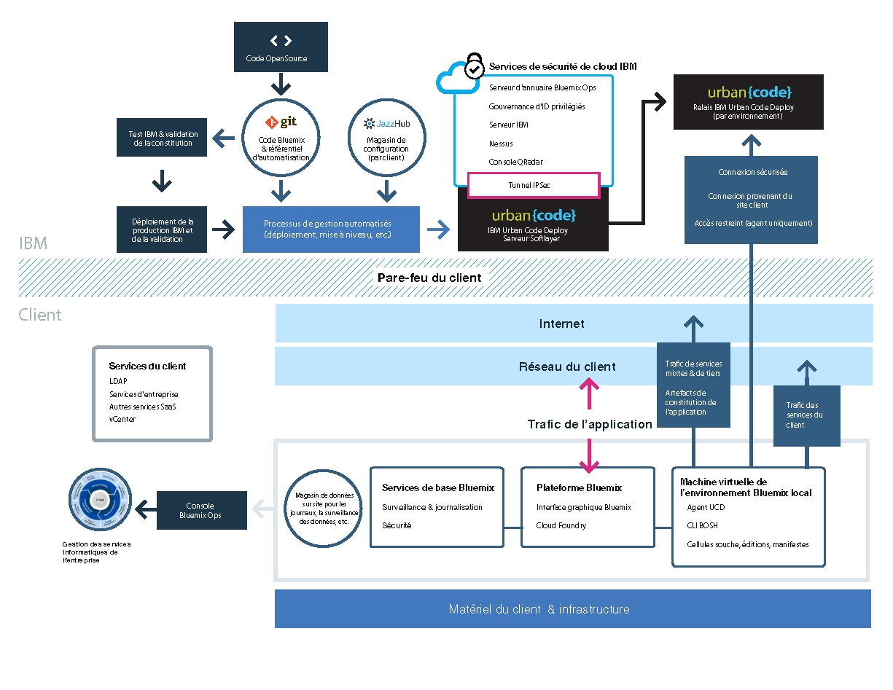

{:new_window: target="_blank"}
{:shortdesc: .shortdesc}

#{{site.data.keyword.Bluemix_notm}} local
{: #local}
*Dernière mise à jour : 20 octobre 2015*

L'environnement {{site.data.keyword.Bluemix}} local apporte la puissance et l'agilité de la plateforme reposant sur le cloud
{{site.data.keyword.Bluemix_notm}} à votre centre de données.
Avec l'environnement {{site.data.keyword.Bluemix_notm}} local, vous pouvez protéger vos charges de travail les plus sensibles derrière le pare-feu
de votre société tout en restant connecté de façon sécurisée à l'environnement {{site.data.keyword.Bluemix_notm}} public et synchronisé.
{:shortdesc}

IBM® utilise des opérations de cloud en tant que service pour surveiller et gérer votre environnement de sorte que vous puissiez vous consacrer
pleinement à la construction d'applications et de services s'exécutant sur l'environnement. IBM gère également les mises à jour de la plateforme pour que
vous puissiez vous consacrer à votre activité. 

L'environnement {{site.data.keyword.Bluemix_notm}} local inclut un catalogue privé mixte qui affiche les services locaux disponibles
exclusivement
pour vous. Il inclut également des services supplémentaires qui sont à votre disposition depuis l'environnement
{{site.data.keyword.Bluemix_notm}} public.

L'environnement {{site.data.keyword.Bluemix_notm}} local s'appuie sur une machine virtuelle qui se situe derrière le pare-feu de votre
société pour que vous puissiez bénéficier de l'infrastructure de cloud la
plus performante et la mieux sécurisée. IBM installe, surveille à distance et gère l'environnement {{site.data.keyword.Bluemix_notm}} local dans
votre centre de données par le biais de la technologie de relais d'IBM.

Le relais est une fonction de distribution incluse dans l'environnement {{site.data.keyword.Bluemix_notm}} local qui permet à IBM de
distribuer les mises à jour automatiquement et de façon cohérente à tous les déploiements locaux, pour que vous disposiez toujours d'un système à jour, stable
et
sécurisé. Le relais assure une connectivité sécurisée via un tunnel de réseau privé virtuel ouvert avec configuration SSL sortante, qui provient de
la machine
virtuelle de création et qui utilise des certificats propres à chaque instance {{site.data.keyword.Bluemix_notm}} locale. Le trafic dans ce tunnel
correspond à l'automatisation d'Urban Code Deployer qui sert et gère la plateforme, les ressources de traitement et les services pour votre instance.

*Figure 1. Présentation détaillée de l'environnement {{site.data.keyword.Bluemix_notm}} local*

Les environnements {{site.data.keyword.Bluemix_notm}} locaux appliquent les mêmes normes de sécurité que l'environnement
{{site.data.keyword.Bluemix_notm}} public en termes de sécurité opérationnelle. Vous fournissez le matériel et l'infrastructure, ce qui vous permet
de contrôler la sécurité physique et la sécurité de l'infrastructure.
L'accès des développeurs à l'environnement {{site.data.keyword.Bluemix_notm}} local est contrôlé par vos stratégies LDAP, qui peuvent
être configurées par l'équipe {{site.data.keyword.Bluemix_notm}} lorsqu'elle configure votre environnement. Dans l'environnement local, vous
pouvez
gérer les rôles utilisateur et les droits dans la console d'administration. 

L'environnement {{site.data.keyword.Bluemix_notm}} local est fourni avec tous les contextes d'exécution
{{site.data.keyword.Bluemix_notm}} et 64 Go de mémoire de traitement. 

De plus, un ensemble de services est disponible pour l'environnement {{site.data.keyword.Bluemix_notm}} local.

| **Type** | **Nom** | **Description** |    
|----------|----------|-----------------|
|Inclus | Contextes d'exécution {{site.data.keyword.Bluemix_notm}}  | Utilisez des contextes d'exécution pour que votre application soit
opérationnelle rapidement, sans qu'il ne soit nécessaire de configurer et de gérer des machines virtuelles et des systèmes d'exploitation. Vous pouvez
utiliser tous les
contextes d'exécution {{site.data.keyword.Bluemix_notm}} dans votre instance {{site.data.keyword.Bluemix_notm}} locale. |
|Inclus | {{site.data.keyword.autoscaling}}| Augmentez ou diminuez dynamiquement la capacité de traitement de votre application en fonction de règles. 
Avec ce service, vous bénéficiez d'une utilisation illimitée dans votre environnement {{site.data.keyword.Bluemix}} local. |
|Facultatif |{{site.data.keyword.datacshort}}| Ce service fournit une grille de données en mémoire qui prend en charge des scénarios de mise en cache distribuée
pour vos
applications. Il inclut 50 Go de mémoire cache interne.  |
|Facultatif | {{site.data.keyword.APIM}} | Utilisez le service {{site.data.keyword.APIMfull}} pour composer des API, les gérer et les
diffuser sur les réseaux sociaux. Vous pouvez importer des API avec des ressources en utilisant une adresse URL de proxy ou en assemblant des données à
partir de sources de données HTTP. L'avantage avec le service {{site.data.keyword.APIM}} est que vous pouvez gérer la façon dont vos API sont utilisées.  |

*Tableau 1. Services locaux*

##Configuration de votre instance {{site.data.keyword.Bluemix_notm}} locale 
{: #setuplocal}

L'environnement {{site.data.keyword.Bluemix_notm}} local a été conçu pour fournir une version privée de l'offre d'environnement
{{site.data.keyword.Bluemix_notm}} public qui est hébergée sur votre propre matériel, que vous gérez. Vous pouvez utiliser les services et les
contextes d'exécution {{site.data.keyword.Bluemix_notm}} pour répondre à vos besoins informatiques dans un environnement de cloud sécurisé, géré et
hébergé par le client. 

IBM fournit l'accès à l'environnement {{site.data.keyword.Bluemix_notm}} local par le biais d'une connexion sécurisée par mot de passe. Vous
pouvez accéder aux services, aux contextes d'exécution et aux ressources associées, et déployer et retirer des applications
{{site.data.keyword.Bluemix_notm}}. Suivez les étapes ci-après pour collaborer avec votre interlocuteur IBM afin de configuration
votre instance locale de {{site.data.keyword.Bluemix_notm}}.

Pour configurer votre version privée de {{site.data.keyword.Bluemix_notm}} :

<ol>
<li>Vérifiez les <a href="index.html#localinfra">exigences de l'infrastructure d'un environnement
{{site.data.keyword.Bluemix_notm}} local</a> en vue de la configuration de votre instance locale.
</li>
<li>Prenez contact avec votre représentant de compte IBM ou avec
<a href="https://console.ng.bluemix.net/?direct=classic/#/contactUs/cloudOEPaneId=contactUs" target="_blank">{{site.data.keyword.Bluemix_notm}}</a>
pour commencer.</li>
<li>Etablissez votre contrat {{site.data.keyword.Bluemix_notm}} local avec IBM, qui inclut des dates de jalon pour la distribution. <ol type="a">
	<li>Décidez avec IBM du tarif correspondant à votre instance {{site.data.keyword.Bluemix_notm}} locale. Le prix mensuel dépend des
services locaux que vous voulez utiliser, et comprend un abonnement à tous les services {{site.data.keyword.Bluemix_notm}} publics. Vous recevez ensuite une facture pour tous les éléments que vous
utilisez au-delà de ce contrat d'abonnement.</li>
	<li>Identifiez les échéances pour chaque phase de configuration de votre instance {{site.data.keyword.Bluemix_notm}} locale. </li>
	</ol>
	</li>
<li>Une fois votre plateforme et votre compte créés, vous identifiez les personnes de votre organisation à affecter aux rôles nécessaires à
la configuration et à l'exécution de votre
instance locale. A chaque rôle correspond un interlocuteur IBM. 

Rôles du client : 

<dl>
<dt>**Contact du service Achats (Procurement focal)**</dt>
<dd>Collabore avec l'interlocuteur IBM pour établir votre environnement {{site.data.keyword.Bluemix_notm}} local, notamment en identifiant les
personnes dans votre organisation devant travailler sur certains aspects du projet. Ce rôle supervise la sélection de pattern, les accords commerciaux et
les accords relatifs à l'accès aux ressources du client. Le contact du service Achats est le contact général pour la configuration de l'instance locale. </dd>
<dt>**Agent de conformité (Compliance officer)**</dt>
<dd>Collabore avec l'interlocuteur IBM pour sélectionner une topologie et une option de déploiement répondant à vos exigences en matière de sécurité.
Ce rôle collabore avec le consultant en conformité d'IBM pour déterminer quels sont les patterns de déploiement qui permettent d'atteindre les buts et les
objectifs de conformité. </dd>
<dt>**Spécialiste réseau (Network Specialist)**</dt>
<dd>Collabore avec l'interlocuteur IBM sur les plans de réseau pour le déploiement {{site.data.keyword.Bluemix_notm}}.
Ce rôle fournit les exigences à l'interlocuteur IBM, avec qui il collabore pour établir un plan d'implémentation. A la fin de la phase d'installation et de
vérification, il confirme que la configuration du réseau est conforme aux standard d'entreprise.
</dd>
<dt>**Contact DevOps (DevOps focal)**</dt>
<dd>Collabore avec l'interlocuteur IBM pour planifier et appliquer les mises à jour de maintenance nécessaires pour la plateforme, les services et les
contextes d'exécution {{site.data.keyword.Bluemix_notm}}. Ce rôle collabore également avec l'interlocuteur IBM sur la configuration de votre
instance {{site.data.keyword.Bluemix_notm}} locale. </dd>
</dl>

Rôles d'IBM : 

<dl>
<dt>**Gestionnaire des mises à disposition IBM (IBM provisioning manager)**</dt>
<dd>Collabore avec le contact du service Achats pour établir l'environnement client. </dd>
<dt>**Consultant en conformité IBM (IBM compliance consultant)**</dt>
<dd>Collabore avec l'agent de conformité du client pour sélectionner une topologie et une option de déploiement répondant à vos exigences en matière de
sécurité.</dd>
<dt>**Spécialiste réseau IBM (IBM network specialist)**</dt>
<dd>Collabore avec le spécialiste réseau du client afin d'établir les plans de réseau pour le déploiement.
Ce rôle collabore avec le client afin de collecter les exigences et de créer un plan d'implémentation. Il effectue également des tests automatisés pour
vérifier le résultat physique du plan d'implémentation.
</dd>	
<dt>**Contact Devops IBM (IBM DevOps focal)**</dt>
<dd>Collabore avec le contact DevOps du client sur l'installation et la maintenance continue de la topologie de déploiement. Ce rôle collabore avec le
client afin de planifier et d'effectuer les mises à jour nécessaires pour la plateforme et les services.
</dd>
</dl>
</li>
<li>Vous fournissez le matériel et IBM vous aide à définir et à établir la connectivité du réseau entre votre réseau d'entreprise et
votre instance {{site.data.keyword.Bluemix_notm}} locale. Pour plus d'informations sur les exigences de l'infrastructure, voir
<a href="index.html#localinfra">Exigences de l'infrastructure d'un environnement {{site.data.keyword.Bluemix_notm}} local</a>.
<ol type="a">
	<li>IBM configure l'accès réseau et LDAP en fonction des éléments que vous avez fournis. L'accès administrateur est accordé aux contacts que vous désignez. Vous devez également désigner un contact pour le support et la facturation.</li>
	<li>IBM configure un catalogue mixte dans votre environnement local qui répertorie vos services locaux et plusieurs des services
{{site.data.keyword.Bluemix_notm}} publics.</li>
	<li>Vous validez la configuration du réseau et du pare-feu ainsi que l'accès et le noeud final LDAP.</li>
	</ol>
</li>
</ol>
	
##Exigences de l'infrastructure d'un environnement {{site.data.keyword.Bluemix_notm}} local 
{: #localinfra}

Pour l'environnement {{site.data.keyword.Bluemix_notm}} local, vous êtes en charge de la sécurité
physique et de l'infrastructure de l'hébergement de l'instance locale. IBM définit les exigences ci-après pour la configuration de l'environnement {{site.data.keyword.Bluemix_notm}}
local.
###Configuration matérielle
Vous trouverez ci-après les exigences relatives au type et à la taille du matériel disponible ; toutefois, vous pouvez adopter la combinaison de votre
choix pour satisfaire aux exigences définies en matière de ressources.
<dl>
<dt>**Matériel VMware ESXi**</dt>
<dd>
ESXi est une couche de virtualisation qui s'exécute sur des serveurs physiques et qui permet l'abstraction du processeur, de la mémoire, du
stockage et des ressources en plusieurs machines virtuelles. Choisissez la combinaison qui correspond aux nombres totaux de ressources ci-dessous, à la
condition que le nombre minimal de coeurs physiques par couche ESXi
soit huit. Les spécifications suivantes s'appliquent au contexte d'exécution {{site.data.keyword.Bluemix_notm}} de base seulement :
<ul>
<li>48 coeurs physiques à 2 Ghz ou plus chacun </li>
<li>756 Go de mémoire RAM physique </li>
</li>Taille totale de magasin de données de 7,5 To <ul>
<li>Magasin de données de 7 To pour le stockage de {{site.data.keyword.Bluemix_notm}}</li>
<li>Magasin de données de 500 Go pour le stockage de la machine virtuelle de création</li>
</ul>
</ul>

<strong>Remarque :</strong> si vous utilisez plusieurs magasins de données, utilisez le même préfixe pour chacun d'entre eux.

</dd>
<dt>**Haute disponibilité**</dt>
<dd>
Pour pouvoir prendre en charge une défaillance de noeud unique, vous devez disposer de n+1 couches ESXi. Par exemple, si deux couches ESXi sont
utilisées, comptant 16x coeurs chacune, une troisième est nécessaire.

<strong>Remarque :</strong> l'administrateur VMware client peut décider d'appliquer une reprise en ligne à haute disponibilité stricte dans le cluster
afin de garantir les ressources.

</dd>
<dt>**Réseau **</dt>
<dd>
La configuration requise recommandée inclut un groupe de ports accessible pour le client avec dix adresses IP réseau de client ayant un accès
Internet sortant. Ensuite, vous devez définir un deuxième réseau local virtuel privé uniquement entre les couches ESXi utilisées pour
l'environnement {{site.data.keyword.Bluemix_notm}} local. Le réseau local virtuel apparaît en tant que groupe de ports dans VMware. L'environnement
{{site.data.keyword.Bluemix_notm}} local l'utilise pour le sous-réseau privé, qui est plus sécurisé et peut
éviter les problèmes de routage.
</dd>
</dl>

###Configuration du serveur vCenter
Passez en revue les exigences liées à la version, au centre de données, au pool de ressources
et au magasin de données.
<dl>
<dt>**Versions VMware prises en charge **</dt>
<dd>vCenter and ESXi versions 5.1 et 5.5</dd>
<dt>**Centre de données **</dt>
<dd>Créez un centre de données s'il n'en existe pas.</dd>
<dt>**Dossier du centre de données **</dt>
<dd>Créez un dossier de machine virtuelle dont le nom est identique à celui du cluster si vous ne prévoyez pas d'attribuer l'accès administrateur qui
est propagé depuis le centre de données.</dd>
<dt>**Cluster**</dt>
<dd>Créez un cluster spécifiquement pour l'environnement {{site.data.keyword.Bluemix_notm}} local. Par exemple, vous pouvez le nommer `bluemix`.</dd>
<dt>**Pool de ressources**</dt>
<dd>Créez un pool de ressources sous le cluster de l'environnement {{site.data.keyword.Bluemix_notm}} local. Par
exemple, vous pouvez le nommer `local`.</dd>
</dt>**Magasins de données**</dt>
<dd>Requiert 7,5 To pour le déploiement initial de {{site.data.keyword.Bluemix_notm}}. 
 
**Remarque** : lorsque vous utilisez plusieurs magasins de données, assurez-vous que chacun commence par le même préfixe. Par exemple, voici des noms de plusieurs magasins de
données commençant par le même préfixe : `bluemix_datastore_01` et `bluemix_datastore_02`.</dd>
</dl>

###Bande passante du réseau
Le débit recommandé est de 5 mégabits par seconde pour l'envoi par téléchargement et de 5 mégabits par
seconde pour la réception par téléchargement. De plus, vous pouvez prévoir une utilisation mensuelle des données de 10 Go. IBM établit des fenêtres
convenues lorsque de gros volumes de données, jusqu'à 3 Go, sont distribués.

###Droits VMware
Définissez les rôles et les droits ci-après. La propagation est définie pour chaque droit. Si le droit est propagé,
il peut être transmis vers le bas dans la hiérarchie d'objets. Toutefois, les droits attribués à un objet enfant remplacent toujours les droits qui sont
propagés depuis un objet parent.
<dl>
<dt>**Serveur vCenter **</dt>
<dd>Définissez le rôle en lecture seule, non propagé. 
 
**Remarque** : ce rôle est nécessaire afin d'extraire le statut des tâches pour des opérations de disque spécifiques.
</dd>
<dt>**Centre de données **</dt>
<dd>Créez le rôle "{{site.data.keyword.Bluemix_notm}}" et attribuez des droits pour le **magasin de données**, notamment **Low level file
operations** et **Update virtual machine files**. 
 
**Remarque** : ce rôle est nécessaire pour prendre en charge les envois de fichier dans les magasins de données.
</dd>
<dt>**Cluster**</dt>
<dd>Définissez le rôle administrateur, propagé.</dd>
<dt>**Magasins de données**</dt>
<dd>Définissez le rôle administrateur, propagé, pour chaque magasin de données {{site.data.keyword.Bluemix_notm}}.</dd>
<dt>**Réseau **</dt>
<dd>Attribuez à des groupes de ports publics et privés le rôle administrateur, non propagé.</dd>
</dl>

###Pool d'agents DEA (Droplet Execution Agent)
Chaque agent DEA est configuré avec :
- 16 à 32 Go de mémoire RAM
- 2x à 4x UC virtuelles
- 150 à 300 Go d'espace de stockage

Par exemple, si la taille de l'hôte ESXi est de 256 Go de mémoire avec 16x coeurs, huit agents DEA sont
ajoutés. Si la taille de l'hôte ESXi est de 64 Go de mémoire avec 8x coeurs, deux couches ESXi et quatre agents DEA doivent être ajoutés. Un espace de stockage supplémentaire de 1,5 To est requis pour chacun des quatre agents DEA. Cet exemple s'appuie sur un agent DEA configuré avec 32 Go de
mémoire RAM, 4x UC virtuelles et 300 Go d'espace de stockage.

##Gestion de votre instance locale 
{: #maintainlocal}

IBM gère et installe les mises à jour et les correctifs qu'elle juge nécessaires pour la plateforme, les contextes d'exécution et les services de
l'environnement Bluemix local. Il se peut que les services ne soient pas disponibles pendant les fenêtres de maintenance.

**Important** : IBM se réserve le droit d'interrompre des services afin de procéder à une maintenance d'urgence si nécessaire. IBM
peut changer les heures de maintenance planifiées et vous fera part de tels changements et de toute information relative à la maintenance d'urgence.

Les types suivants de maintenance sont requis pour l'environnement {{site.data.keyword.Bluemix_notm}} local : 
<dl>
<dt>**Fenêtres de maintenance standard**</dt>
<dd>Les services utilisent des fenêtres de maintenance standard prédéfinies qui peuvent entraîner leur indisponibilité.
IBM n'exige pas l'approbation du client avant de procéder à la maintenance, mais tente de réduire l'impact sur vos services.
 
 
IBM envoie des messages de diffusion concernant les changements qui sont planifiés pour chaque fenêtre de maintenance par courrier électronique, par
téléphone ou par d'autres moyens. 
 
**Important** : certains services peuvent ne pas être disponibles au cours de la période de maintenance.</dd>

<dt>**Fenêtre de maintenance mensuelle**</dt>
<dd>La fenêtre de maintenance mensuelle est convenue entre vous et IBM dans une fenêtre de 21 jours. Vous pouvez fournir à IBM des dates ou des heures
spécifiques qui ne vous conviennent pas dans la fenêtre de 21 jours. IBM tente de planifier les mises à jour en dehors de ces dates ou de ces heures. En
fonction des demandes, IBM vous communique la fenêtre de maintenance planifiée. Les fenêtres de maintenance mensuelle n'ont généralement pas d'impact sur
l'environnement Bluemix local en cours d'exécution.
 
 
**Remarque :** si vous ne proposez pas d'heure spécifique pour la mise à jour, la maintenance est appliquée automatiquement à la fin de
la fenêtre.
 
 
Accédez à **ADMINISTRATION > SYSTEM INFORMATION** pour afficher les mises à jour en attente, définir des dates d'indisponibilité et
approuver des mises à jour. Pour plus d'informations sur les notifications et la planification des mises à jour en attente, voir
<a href="../admin/index.html#oc_system">Affichage des informations système</a>. </dd>

<dt>**Autre**</dt>
<dd>IBM entend regrouper les maintenances pouvant avoir un impact sur vos services, en particulier la disponibilité de votre environnement Bluemix local, de
vos contextes d'exécution et de vos services, dans les fenêtres standard et mensuelles.
D'autres fenêtres de maintenance peuvent être utilisées exceptionnellement pour la gestion de l'environnement. IBM fera de son mieux pour limiter l'impact
sur vos activités pendant ces fenêtres de maintenance et vous avertira à l'avance. </dd>
</dl>

Pour configurer la maintenance de votre instance locale, collaborez avec votre représentant de compte IBM afin de convenir d'une fenêtre pour la
maintenance standard.
   
