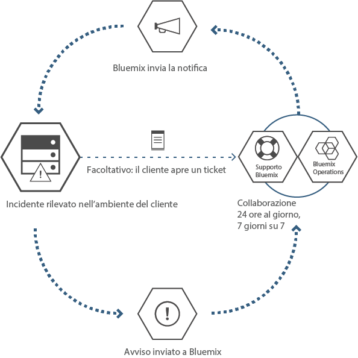

---

 

copyright:

  years: 2015, 2016

 

---

{:new_window: target="_blank"}
{:shortdesc: .shortdesc}

#{{site.data.keyword.Bluemix_notm}} locale
{: #local}
*Ultimo aggiornamento: 16 maggio 2016*

{{site.data.keyword.Bluemix}} locale porta la potenza e l'agilità della piattaforma {{site.data.keyword.Bluemix_notm}} basata sul cloud al tuo data center. Con {{site.data.keyword.Bluemix_notm}} locale, puoi proteggere i tuoi carichi di lavoro più sensibili dietro il tuo firewall aziendale, continuando al tempo stesso a essere connesso in modo protetto e sincronizzato con {{site.data.keyword.Bluemix_notm}} pubblico.
{:shortdesc}

IBM® utilizza le operazioni cloud come un servizio per monitorare e gestire il tuo ambiente, consentendoti così di concentrarti sulla creazione di applicazioni e servizi che vengono eseguiti sull'ambiente. IBM gestisce anche gli aggiornamenti della piattaforma, in modo da consentirti di concentrarti sull'attività di business.

Gli ambienti {{site.data.keyword.Bluemix_notm}} locale hanno gli stessi standard di sicurezza di {{site.data.keyword.Bluemix_notm}} pubblico in termini di sicurezza operativa. Fornisci l'hardware e l'infrastruttura, che ti offre il controllo su infrastruttura e sicurezza fisica. L'accesso degli sviluppatori a {{site.data.keyword.Bluemix_notm}} locale è controllato dalle tue politiche LDAP, che possono essere configurate dal team {{site.data.keyword.Bluemix_notm}} quando configura il tuo ambiente. All'interno dell'ambiente locale, utilizzando la pagina Amministrazione, puoi gestire i ruoli e le autorizzazioni degli utenti.

{{site.data.keyword.Bluemix_notm}} locale viene fornito con tutti i runtime {{site.data.keyword.Bluemix_notm}} inclusi e 64 GB di memoria di elaborazione.

Inoltre, è presente una serie di servizi disponibili come servizi locali {{site.data.keyword.Bluemix_notm}}. Consulta la seguente tabella per vedere cosa è incluso e cosa è disponibile per l'acquisto.

*Tabella 1. Servizi locali e runtime*

| **Tipo** | **Nome** | **Descrizione** |
|----------|----------|-----------------|
|Incluso | Runtime {{site.data.keyword.Bluemix_notm}} | Utilizza i runtime per avere un'applicazione subito operativa, senza dover impostare e gestire macchine e sistemi operativi. Tutti i runtime {{site.data.keyword.Bluemix_notm}} sono a tua disposizione per utilizzarli nella tua istanza di {{site.data.keyword.Bluemix_notm}} locale.|
|Facoltativo | {{site.data.keyword.APIM}} | Utilizza il servizio {{site.data.keyword.APIMfull}}
per comporre, gestire e socializzare le API. Puoi importare delle API con risorse utilizzando un URL proxy o assemblando dati dalle origini dati HTTP. Il servizio {{site.data.keyword.APIM}} offre il vantaggio che puoi gestire la modalità di utilizzo delle tue API. |
|Incluso | {{site.data.keyword.autoscaling}}| Ti permette di aumentare o ridurre dinamicamente la capacità delle risorse di elaborazione della tua applicazione in base alle politiche. Con questo servizio, hai un uso illimitato nel tuo ambiente {{site.data.keyword.Bluemix}} locale.|
|Facoltativo | {{site.data.keyword.datacshort}} | Questo servizio fornisce una griglia di dati in memoria
che supporta scenari di cache distribuita per le tue applicazioni. Include 50 GB di cache in memoria. |
|Facoltativo | {{site.data.keyword.sescashort}} | Per aumentare la ridondanza, {{site.data.keyword.sescashort}} fornisce una replica di una sessione memorizzata nella cache. Pertanto, nel caso di un'interruzione o di un calo di tensione, la tua applicazione client mantiene l'accesso alla sessione nella cache. Il servizio supporta scenari di memorizzazione di sessioni nella cache per applicazioni Web e mobili. |
|Facoltativo | {{site.data.keyword.iot_full}} | Questo servizio consente alle tue applicazioni di comunicare tra loro e utilizzare i dati raccolti dai tuoi dispositivi, sensori e gateway connessi. L'offerta di base locale consente l'esecuzione di una versione privata di IBM {{site.data.keyword.iot_full}} nell'ambiente locale con una capacità di 100,000 applicazioni o dispositivi connessi contemporaneamente e 1.6 TB di scambio dati. |

Sono presenti dei componenti facoltativi disponibili per te da acquistare per ridimensionare e estendere la capacità dei tuoi servizi o risorse. Puoi acquistare tutti questi componenti contattando il team di vendite; vai all'indirizzo [Contatti](https://console.ng.bluemix.net/?direct=classic/#/contactUs/cloudOEPaneId=contactUs) per informazioni su come contattare un rappresentante delle vendite. Per incrementare il tuo piano per un servizio, puoi selezionare il piano dal tile del servizio nel tuo catalogo.

*Tabella 2. Componenti facoltativi per l'acquisto*

| **Nome** | **Descrizione** |
|----------|-----------------|
|Impostazione accesso locale monouso per {{site.data.keyword.Bluemix_notm}} | Un addebito per un'impostazione monouso per la distribuzione e la configurazione dell'ambiente locale. |
|Incremento della capacità di 16 GB per le risorse di elaborazione locale di {{site.data.keyword.Bluemix_notm}} | Un'estensione delle risorse di elaborazione locale di IBM {{site.data.keyword.Bluemix_notm}} che fornisce una capacità di memoria extra di 16 GB. |
|Incremento della capacità di 50 GB di {{site.data.keyword.Bluemix_notm}} Data & Session Cache | Un ambiente che consente la distribuzione e l'esecuzione di istanze Data Cache e Session Cache fino alla capacità cumulativa di 50 GB. |
|Incremento della capacità di 500 chiamate API {{site.data.keyword.APIM}} locale per {{site.data.keyword.Bluemix_notm}} | Un ambiente che consente l'esecuzione di una versione privata di {{site.data.keyword.APIM}} per {{site.data.keyword.Bluemix_notm}} con una capacità di 500 chiamate API al secondo. |
|Aumento incrementale locale per {{site.data.keyword.Bluemix_notm}} {{site.data.keyword.iot_short}} | Un ambiente aggiuntivo all'offerta del servizio di base locale {{site.data.keyword.iot_full}} che consente l'esecuzione di una versione privata di {{site.data.keyword.iot_full}} nell'ambiente locale con una capacità di 100,000 applicazioni o dispositivi connessi contemporaneamente e 0.5 TB di scambio dati. |

**Nota**: i componenti locali {{site.data.keyword.Bluemix_notm}} possono indicare una capacità configurata specifica, come ad esempio gigabyte o transazioni al secondo. Poiché la capacità attuale messa in pratica per ogni configurazione del servizio cloud varia in base a molti fattori, la capacità attuale messa in pratica può essere maggiore o inferiore alla capacità configurata.

### Catalogo diffuso

{{site.data.keyword.Bluemix_notm}} locale include un catalogo diffuso privato che visualizza i servizi locali disponibili in esclusiva per te. Sono compresi inoltre dei servizi aggiuntivi messi a tua disposizione da {{site.data.keyword.Bluemix_notm}} pubblico.

Il catalogo diffuso fornisce la funzione per creare applicazioni ibride composte da servizi pubblici e privati. Hai la possibilità di decidere quali servizi pubblici rispondono ai tuoi requisiti aziendali, sulla base di criteri di sicurezza e privacy dei dati. Se si tratta di un'istanza privata del servizio per il tuo ambiente locale, vedi una tag "Locale" con i tile di servizio nel tuo catalogo. In modo analogo, se si tratta di un servizio personalizzato, vedi "Personalizzato" elencato con il tile di servizio. 

*Tabella 3. Servizi disponibili per la diffusione da {{site.data.keyword.Bluemix_notm}} pubblico per regione*

|Servizio	|Disponibile nella regione Stati Uniti Sud	|Disponibile nella regione Europa Regno Unito |Disponibile nella regione di Sydney in Australia|
|:----------|:------------------------------|:------------------|:------------------|
|{{site.data.keyword.alchemyapishort}} 		|Sì	   	|Sì  		|Sì|
|{{site.data.keyword.alertnotificationshort}}		|Sì		|Sì			|Sì		|
|{{site.data.keyword.appseccloudshort}}		|Sì		|Sì		|Sì |
|{{site.data.keyword.hadoopst}}			|Sì		|No		|No |
|{{site.data.keyword.APIM}}			|Sì		|Sì		|Sì |
|{{site.data.keyword.rules_short}}		|Sì		|Sì		|Sì |
|{{site.data.keyword.cloudant}}			|Sì		|Sì		|Sì |
|{{site.data.keyword.conceptexpansionshort}}	|Sì		|Sì		|Sì|
|{{site.data.keyword.conceptinsightsshort}}	|Sì		|Sì		|Sì |
|{{site.data.keyword.dashdbshort}}		|Sì		|Sì		|Sì |
|{{site.data.keyword.dataworks_short}}		|Sì		|Sì		|No|
|{{site.data.keyword.DB2OnCloud_short}}		|Sì		|Sì		|Sì |
|{{site.data.keyword.dialogshort}}		|Sì		|Sì		|Sì|
|{{site.data.keyword.documentconversionshort}}	|Sì		|Sì		|Sì|
|{{site.data.keyword.game}}			|No		|No		|Sì |
|{{site.data.keyword.geospatialshort_Geospatial}}	|Sì	|Sì		|Sì |
|{{site.data.keyword.GlobalizationPipeline_short}}	|Sì		| Sì		| Sì |
|{{site.data.keyword.identitymixershort}}		|Sì		|Sì		|Sì|
|{{site.data.keyword.twittershort}}		|Sì		|Sì		|Sì|
|{{site.data.keyword.weather_short}}		|Sì		|Sì		|Sì|
|{{site.data.keyword.languagetranslationshort}}	|Sì		|Sì		|Sì |
|{{site.data.keyword.eventhubshort}}		|Sì		|No		|No|
|{{site.data.keyword.messagehub}}		|Sì		|Sì		|No|
|{{site.data.keyword.macm_short}}		|Sì		|Sì		|Sì|
|{{site.data.keyword.manda}}			|Sì		|Sì		|Sì |
|{{site.data.keyword.amashort}}			|Sì		|Sì		|Sì |
|{{site.data.keyword.mqa}}			|Sì		|Sì		|Sì |
|{{site.data.keyword.mql}}			|Sì		|Sì		|Sì |
|{{site.data.keyword.nlclassifierlshort}} 	|Sì 		|Sì 		|Sì|
|{{site.data.keyword.personalityinsightsshort}}	|Sì		|Sì		|Sì|
|{{site.data.keyword.pm_short}}			|Sì		|Sì		|No |
|{{site.data.keyword.presenceinsightsshort}}	|Sì		|Sì		|Sì|
|{{site.data.keyword.mobilepush}}		|Sì		|Sì		|Sì |
|{{site.data.keyword.questionandanswershort}}	|Sì		|Sì		|Sì|
|{{site.data.keyword.relationshipextractionshort}}	|Sì	|Sì		|Sì|
|{{site.data.keyword.retrieveandrankshort}}	|Sì 		|Sì 		|Sì|
|{{site.data.keyword.runbook_short}}		|Sì		|Sì		|Sì|
|{{site.data.keyword.SecureGateway}}		|Sì		|Sì		|Sì |
|{{site.data.keyword.ssofull}}			|Sì		|No		|No|
|{{site.data.keyword.speechtotextshort}}	|Sì 		|Sì	 	|Sì|
|{{site.data.keyword.streaminganalyticsshort}}	|Sì		|Sì		|Sì |
|{{site.data.keyword.texttospeechshort}} 	|Sì 		|Sì	 	|Sì|
|{{site.data.keyword.toneanalyzershort}} 	|Sì 		|Sì 		|Sì|
|{{site.data.keyword.tradeoffanalyticsshort}}	|Sì		|Sì		|Sì|
|{{site.data.keyword.visualinsightsshort}}	|Sì		|Sì		|Sì|
|{{site.data.keyword.visualrecognitionshort}}	|Sì 		|Sì	 	|Sì|
|{{site.data.keyword.iot_short}}		|Sì		|Sì		|No|
|{{site.data.keyword.workflow}}			|Sì		|Sì		|Sì |
|{{site.data.keyword.workloadscheduler}}	|Sì		|Sì		|Sì |

## Architettura di {{site.data.keyword.Bluemix_notm}} locale
{: #localarch}

{{site.data.keyword.Bluemix_notm}} locale si trova su una macchina virtuale protetto dal tuo firewall aziendale, mettendo così a tua disposizione l'infrastruttura cloud con le prestazioni più elevate e la massima protezione possibili. IBM installa, esegue il monitoraggio in remoto e gestisce {{site.data.keyword.Bluemix_notm}} locale nel tuo data center attraverso la tecnologia Relay di IBM. Consulta il seguente diagramma per informazioni sull'impostazione di {{site.data.keyword.Bluemix_notm}} nel tuo ambiente locale e sulle modalità di gestione della tua istanza locale da parte di IBM:

*Figura 1. Architettura di {{site.data.keyword.Bluemix_notm}} locale*

L'esecuzione della macchina virtuale di inizio avviene sotto la protezione del firewall del cliente in una rete con connettività in uscita tramite Relay verso il centro operativo IBM. I componenti della piattaforma {{site.data.keyword.Bluemix_notm}} e le funzionalità principali che supportano i componenti della piattaforma vengono eseguiti in una VLAN (virtual local area network) privata e isolata. {{site.data.keyword.Bluemix_notm}} locale utilizza una VLAN per la sottorete privata. L'utilizzo di una sottorete privata anziché di una VLAN pubblica è più sicuro e può contribuire a evitare problemi di instradamento. L'insieme delle funzioni principali a supporto della piattaforma include:

<dl>
<dt>**Monitoraggio e registrazione**</dt>
<dd>Le funzioni di monitoraggio e registrazione vengono distribuite nel tuo data center tramite Relay e i dati rimangono nel data center. Gli avvisi vengono rimandati al centro operativo IBM secondo i criteri di avviso definiti. Gli avvisi inviati a IBM non contengono dati sensibili.</dd>
<dt>**Rete**</dt>
<dd>Relay è la rete di consegna fornita con {{site.data.keyword.Bluemix_notm}} locale. Relay consente a IBM di offrire in modo automatico e congruente gli ultimi aggiornamenti a tutte le distribuzioni locali, cosicché tu disponga sempre di un sistema aggiornato e sicuro. Il traffico su questo tunnel è l'attività automatica utilizzata per servire e gestire la piattaforma, le risorse di calcolo e i servizi per la tua istanza. Il traffico include la funzionalità di monitoraggio utilizzata dal centro operativo IBM per completare la determinazione dei problemi per la tua istanza locale. Per ulteriori informazioni su Relay, vedi [Relay](index.html#localrelay).</dd>
<dt>**Calcolo**</dt>
<dd>{{site.data.keyword.Bluemix_notm}} locale utilizza ambienti di runtime incentrati sulle applicazioni basati su Cloud Foundry.</dd>
<dt>**Intelligence di sicurezza**</dt>
<dd>
IBM utilizza QRadar Security Intelligence Platform per fornire un'architettura unificata per l'integrazione di diversi componenti chiave. Tali componenti includono informazioni sulla sicurezza e gestione eventi, gestione di log, rilevamento anomalie, indagini forensi sugli incidenti e gestione delle vulnerabilità e della configurazione. Bluemix utilizza inoltre IBM QRadar SIEM (security information and event management) per monitorare le azioni utente privilegiate e i tentativi di accesso riusciti e non riusciti degli sviluppatori di applicazioni. I report QRadar forniscono al cliente visibilità sui dati degli eventi attraverso la sezione Report e log della pagina Amministrazione. Per informazioni sui report di sicurezza, consultare [Visualizzazione dei report](../admin/index.html#oc_report).

IBM BigFix garantisce che le correzioni per i sistemi operativi vengano applicate con frequenza adeguata. Il processo di applicazione di patch è automatizzato e la pianificazione viene concordata tra te e IBM. Per informazioni su manutenzione e aggiornamenti, vedi [Gestione della tua istanza locale](index.html#maintainlocal).

</dd>
</dl>

Le tue applicazioni vengono distribuite all'interno di contenitori virtuali eseguiti su macchine virtuali Cloud Foundry. Tutti i componenti Cloud Foundry, quali i controller cloud, i gestori di integrità, i router e i DEA (Droplet Execution Agent), vengono distribuiti durante la configurazione di {{site.data.keyword.Bluemix_notm}}. La distribuzione {{site.data.keyword.Bluemix_notm}} include inoltre i vari componenti gestionali {{site.data.keyword.Bluemix_notm}}.

Le applicazioni DataPower forniscono accesso ai domini dell'applicazione {{site.data.keyword.Bluemix_notm}}. Queste applicazioni si connettono alla rete accessibile mediante la tua Intranet. I tuoi utenti che distribuiscono applicazioni e servizi accedono dalla rete accessibile dalla tua Intranet. Devi fornire sette indirizzi IP che abbiano l'accesso Internet in uscita. Le applicazioni DataPower vengono instradate da questi indirizzi IP del cliente alla distribuzione {{site.data.keyword.Bluemix_notm}} isolata. Per informazioni sulle specifiche di rete e sui requisiti dell'infrastruttura, vedi [Requisiti dell'infrastruttura {{site.data.keyword.Bluemix_notm}} locale](../local/index.html#localinfra).

### Relay
{: #localrelay}

Relay è una funzionalità di consegna inclusa in {{site.data.keyword.Bluemix_notm}} locale. Relay consente a IBM di offrire in modo automatico e congruente gli ultimi aggiornamenti a tutte le distribuzioni locali, cosicché tu disponga sempre di un sistema aggiornato e sicuro. Relay ottiene la connettività sicura attraverso un tunnel VPN SSL in uscita aperto che ha origine dalla macchina virtuale di inizio installata in loco, utilizzando i certificati specifici di ogni istanza {{site.data.keyword.Bluemix_notm}} locale. Tutte le release iniziali di {{site.data.keyword.Bluemix_notm}} sono disponibili nella macchina virtuale di inizio, che funge anche da macchina agent di automazione per le distribuzioni e gli aggiornamenti. La connessione SSL ha origine dalla macchina virtuale di inizio.  Una volta ristabilita una connessione sicura al server di automazione {{site.data.keyword.Bluemix_notm}}, IBM verifica la diffusione e la coerenza delle release {{site.data.keyword.Bluemix_notm}} e avvia la distribuzione degli aggiornamenti.

Il traffico su questo tunnel è l'attività automatica utilizzata per servire e gestire la piattaforma, le risorse di calcolo e i servizi per la tua istanza. Il traffico include la funzionalità di monitoraggio utilizzata dal centro operativo IBM per completare la determinazione dei problemi per la tua istanza locale. Per la connessione, viene utilizzata la porta Web in uscita 443. IBM utilizza la funzionalità Relay per fornire gli aggiornamenti di piattaforma attraverso test e convalide coerenti. Questo processo garantisce la stabilità e la sicurezza di tutte le distribuzioni di cui viene eseguito il push nei tuoi ambienti locali.

Solo il team IBM che lavora con te sul tuo ambiente locale può accedere in modo protetto alla tua istanza {{site.data.keyword.Bluemix_notm}}. L'accesso al tuo ambiente locale è protetto tramite autenticazione a due fattori durante varie fasi del processo di connessione. IBM fornisce un elenco degli utenti e degli ID autorizzati ad accedere al tuo ambiente, perciò puoi controllare qualsiasi accesso al tuo ambiente. Attraverso la creazione di un report di sicurezza, puoi scoprire chi ha effettuato l'accesso al tuo ambiente, quando e perché. Per informazioni sulla creazione dei report sulla sicurezza, vedi [Report sulla sicurezza](../security/index.html#reports).

In qualità di amministratore, puoi visualizzare l'intero ambiente ai fini della gestione di incidenti, problemi, modifiche, funzionalità e sicurezza. Puoi accedere alle informazioni sul tuo ambiente, attraverso la pagina Amministrazione. La tecnologia Relay mantiene questa pagina aggiornata con i dati più recenti. Per ulteriori informazioni su accesso utenti, log di sicurezza, controllo del catalogo diffuso a sulla comunicazione di aggiornamenti e risoluzione dei problemi, vedi [Gestione di {{site.data.keyword.Bluemix_notm}} locale e {{site.data.keyword.Bluemix_notm}} dedicato](../admin/index.html#mng).

##Configurazione della tua istanza di {{site.data.keyword.Bluemix_notm}} locale
{: #setuplocal}

{{site.data.keyword.Bluemix_notm}} locale è progettato per fornire una versione privata dell'offerta {{site.data.keyword.Bluemix_notm}} pubblico che è ospitata sul tuo hardware e da te gestita. Puoi utilizzare i servizi e i runtime {{site.data.keyword.Bluemix_notm}} per supportare le tue esigenze di elaborazione in un ambiente cloud protetto, ospitato e gestito dal cliente.

IBM ti fornisce l'accesso a {{site.data.keyword.Bluemix_notm}} locale utilizzando un accesso protetto da password. Puoi accedere a servizi, runtime
e risorse associate nonché distribuire e rimuovere applicazioni {{site.data.keyword.Bluemix_notm}}. Riesamina i seguenti passi per lavorare con il tuo
rappresentante IBM per configurare la tua istanza locale di {{site.data.keyword.Bluemix_notm}}.

Per configurare la tua versione privata di {{site.data.keyword.Bluemix_notm}}:

<ol>
<li>Riesamina i <a href="index.html#localinfra">Requisiti dell'infrastruttura {{site.data.keyword.Bluemix_notm}} locale</a> per configurare la tua istanza locale.</li>
<li>Per iniziare, contatta il tuo rappresentante dell'account designato IBM oppure contattare <a href="https://console.ng.bluemix.net/?direct=classic/#/contactUs/cloudOEPaneId=contactUs" target="_blank">{{site.data.keyword.Bluemix_notm}}</a>.</li>
<li>Stabilisci un accordo per {{site.data.keyword.Bluemix_notm}} locale con IBM che includa le date cardine per la distribuzione.
	<ol type="a">
	<li>Determina insieme a IBM la quota per la tua istanza di {{site.data.keyword.Bluemix_notm}} locale. La quota mensile ricorrente si basa sui servizi locali
che desideri utilizzare, oltre a una sottoscrizione a tutti i servizi pubblici {{site.data.keyword.Bluemix_notm}}. Riceverai quindi una fattura per tutto ciò che scegli di utilizzare
al di fuori di tale accordo di sottoscrizione.</li>
	<li>Identifica le scadenze per ogni fase di configurazione della tua istanza di {{site.data.keyword.Bluemix_notm}} locale.</li>
	</ol>
	</li>
<li>Dopo la creazione della tua piattaforma e del tuo account, identifichi le persone all'interno della tua organizzazione per i ruoli necessari per rendere operativa la tua istanza locale. Per ulteriori informazioni sui ruoli che puoi assegnare, vedi <a href="index.html#rolesresponsibilities" target="_blank">Ruoli e responsabilità {{site.data.keyword.Bluemix_notm}} locale</a>.
</li>
<li>Tu fornisci l'hardware e IBM ti aiuta a definire e stabilire la connettività di rete tra la tua rete aziendale e la tua istanza di {{site.data.keyword.Bluemix_notm}} locale. Per ulteriori informazioni sui requisiti dell'infrastruttura, vedi <a href="index.html#localinfra">Requisiti dell'infrastruttura {{site.data.keyword.Bluemix_notm}} locale</a>.
	<ol type="a">
	<li>IBM configura l'accesso alla rete e il LDAP in base alle informazioni che hai fornito. L'accesso amministrativo
viene fornito ai contatti da te designati. Devi designare un
contatto anche per il supporto e la fatturazione.</li>
	<li>IBM configura un catalogo diffuso su diversi canali nell'ambiente locale per visualizzare i tuoi servizi locali e molti dei servizi {{site.data.keyword.Bluemix_notm}} pubblici.</li>
	<li>Convalidi la configurazione di rete e del firewall e l'accesso e l'endpoint LDAP.</li>
	</ol>
</li>
</ol>

Per la distribuzione e configurazione iniziale del tuo ambiente puoi prevedere un processo simile a quello elencato di seguito. Per i dettagli sui responsabili di ciascuna attività, vedi [Ruoli e responsabilità](../local/index.html#rolesresponsibilities).

<ol>
<li>Fornisci la configurazione VMware conforme alle specifiche per le risorse di calcolo, la rete e l'archiviazione. Per ulteriori informazioni sui requisiti dell'infrastruttura, vedi <a href="../local/index.html#localinfra">Requisiti dell'infrastruttura {{site.data.keyword.Bluemix_notm}} locale</a>.</li>
<li>Fornisci le credenziali del cluster vCenter che verranno utilizzate dalla macchina virtuale di inizio. Devi fornire le seguenti informazioni:
<ul>
<li>Nome del cluster VMware</li>
<li>Credenziali del cluster vCenter che includono ID utente e password</li>
<li>Nome o nomi dell'archivio dati (nome LUN archiviazione)</li>
<li>ID VLAN/Gruppo di porte VMware</li>
<li>Nome del pool di risorse</li>
</ul>
</li>
<li>Lavora insieme a IBM per convalidare le credenziali fornite nell'attività precedente.</li>
<li>Fornisci 7 indirizzi IP sulla tua rete. Se disponi di un proxy Web protetto per consentire l'accesso in uscita a Internet per i componenti {{site.data.keyword.Bluemix_notm}} interni, devi fornire le credenziali per poter stabilire la connessione.

**Nota**: se il tuo proxy Web non è protetto, non sarà necessario fornire le credenziali. Inoltre, nota che tutti i clienti {{site.data.keyword.Bluemix_notm}} locale utilizzano un proxy Web.
</li>
<li>IBM fornisce un elenco di URL che è necessario consentire tramite il proxy Web prima di avviare la distribuzione. 

**Nota**: l'elenco di URL contiene i siti web come twitter.com, facebook.com e youtube.com. Se questi URL non sono consentiti, alcuni servizi e aree di {{site.data.keyword.Bluemix_notm}} potrebbero non essere disponibili per l'utilizzo.

</li>
<li>Specifica i nomi di dominio per la distribuzione e gli ID che desideri utilizzare. Quando configuri la tua istanza locale, ottieni due domini definiti in modo parziale e puoi scegliere il prefisso per i due domini. Ad esempio, puoi scegliere il prefisso per <code>*mycompany*.bluemix.net</code> e <code>*mycompany*.mybluemix.net</code>. Inoltre, puoi scegliere anche il dominio completo per creare un dominio personalizzato.

Puoi scegliere il numero di domini personalizzati desiderato. Tuttavia, sarai responsabile dei certificati dei domini personalizzati. Per ulteriori informazioni sulla creazione del dominio personalizzato, consulta <a href="../manageapps/updapps.html#domain">Creazione e utilizzo di un dominio personalizzato</a>.
</li>
<li>Scegli quale tecnologia utilizzare (il tunnel IPSec o OpenVPN) per configurare Relay per la riconnessione al centro operativo IBM.</li>
<li>IBM installa e avvia la macchina virtuale di inizio all'interno del cluster {{site.data.keyword.Bluemix_notm}}. Se fornisci il tuo proprio VMware, il rappresentante IBM aiuterà il tuo rappresentante clienti a completare questa attività.</li>
<li>IBM configura Relay per comunicare con il centro operativo IBM.</li>
<li>Il repository della macchina virtuale di inizio inserisce le risorse di build aggiornate.</li>
<li>Fornisci le credenziali in modo che IBM possa connettersi all'istanza della directory LDAP aziendale.</li>
<li>IBM utilizza l'automazione per distribuire la piattaforma {{site.data.keyword.Bluemix_notm}} di base.</li>
<li>IBM distribuisce la piattaforma di base che include i runtime elastici, la console, la funzione di amministrazione e il monitoraggio.</li>
<li>IBM configura il tuo accesso amministrativo all'ambiente.</li>
<li>IBM collega il tuo catalogo diffuso dalla distribuzione locale a un'istanza di {{site.data.keyword.Bluemix_notm}} pubblico per l'utilizzo di servizi pubblici. Per impostazione predefinita, nella tua istanza locale è disponibile una serie di servizi pubblici. Puoi utilizzare la pagina Amministrazione della gestione del catalogo per attivare o disattivare i servizi per la tua istanza locale.</li>
<li>Puoi iniziare a utilizzare la tua istanza locale, monitorata dal team operativo IBM, al fine di rispondere agli avvisi.</li>
</ol>

Una volta configurata la tua istanza {{site.data.keyword.Bluemix_notm}}, puoi monitorare e gestire l'istanza {{site.data.keyword.Bluemix_notm}} utilizzando la pagina Amministrazione. Per ulteriori informazioni, vedi [Gestione di {{site.data.keyword.Bluemix_notm}} locale e dedicato](../admin/index.html#mng). Per informazioni su aggiornamenti e manutenzione, vedi [Manutenzione dell'istanza locale](index.html#maintainlocal).

##Ruoli e responsabilità
{: #rolesresponsibilities}

Se hai configurato un account {{site.data.keyword.Bluemix_notm}} locale, devi identificare le persone all'interno della tua organizzazione a cui assegnare i ruoli necessari per rendere operativa la tua istanza.

###Ruoli

Il seguente elenco mostra i ruoli e le responsabilità dei clienti che puoi assegnare:

<dl>
<dt>**Procurement focal**</dt>
<dd>Lavora con il rappresentante IBM per organizzare il tuo ambiente {{site.data.keyword.Bluemix_notm}} locale, occupandosi inoltre dell'identificazione delle persone adeguate a gestire ogni aspetto del progetto all'interno della tua organizzazione. La persona assegnata a questo ruolo controlla la selezione del modello, gli accordi commerciali e la disposizione dell'accesso alle risorse dei clienti. Il Procurement focal è il contatto generale per la configurazione dell'istanza locale.</dd>
<dt>**Responsabile della conformità**</dt>
<dd>Lavora con il rappresentante IBM per selezionare un'opzione di topologia e distribuzione che risponda ai tuoi requisiti di sicurezza. La persona assegnata a questo ruolo collabora con i consulenti di conformità IBM per determinare quali modelli di distribuzione raggiungono gli obiettivi di conformità.</dd>
<dt>**Network specialist**</dt>
<dd>Lavora con il rappresentante IBM per identificare i piani di rete per la distribuzione di {{site.data.keyword.Bluemix_notm}}. La persona assegnata a questo ruolo riesamina le specifiche di rete richieste da IBM e lavora con IBM su un piano di implementazione. Al termine della fase di installazione e verifica, la persona assegnata a questo ruolo conferma che la configurazione di rete è in conformità con gli standard aziendali.</dd>
<dt>**DevOps focal**</dt>
<dd>Lavora con il rappresentante IBM per pianificare e applicare gli aggiornamenti di manutenzione necessari per la piattaforma, i servizi e i runtime {{site.data.keyword.Bluemix_notm}}. La persona assegnata a questo ruolo lavora anche con il rappresentante IBM sulla configurazione della tua istanza di {{site.data.keyword.Bluemix_notm}} locale.</dd>
<dt>**Specialista IaaS**</dt>
<dd>Lavora con i rappresentanti IBM sul piano di distribuzione per VMware. In genere, si tratta di un amministratore VMware nel data center. La persona assegnata a questo ruolo riesamina i <a href="../local/index.html#localinfra">requisiti dell'infrastruttura {{site.data.keyword.Bluemix_notm}} locale</a> e lavora con IBM su un piano di implementazione. Al termine della distribuzione, la persona assegnata a questo ruolo conferma che la distribuzione è in conformità con gli standard aziendali a livello IaaS.</dd>
</dl>

I tuoi rappresentanti dei clienti collaborano con gli specialisti IBM che lavorano insieme per garantirti tutto il supporto di cui hai bisogno. Puoi eseguire l'upgrade al livello di supporto Premier per operare con un CSM (Client Success Manager) dedicato per il tuo account. Per ulteriori informazioni sui diversi livelli di supporto, vedi [Come contattare il supporto](../support/index.html#contacting-support). Il CSM completa i seguenti tipi di attività:

<ul>
<li>Fornisce coordinamento tecnico tra te e IBM.</li>
<li>Coordina gli aggiornamenti, l'aiuto di esperti di IBM e l'abilitazione iniziale da un supporto tecnico {{site.data.keyword.Bluemix_notm}}.</li>
<li>Fornisce informazioni sui tipi di supporto disponibili.</li>
<li>Funge, se necessario, da punto di escalation iniziale.</li>
</ul>

Il team operativo e di supporto {{site.data.keyword.Bluemix_notm}} che insieme a te gestisce l'istanza {{site.data.keyword.Bluemix_notm}} potrebbe accedere al tuo ambiente locale, ma lo fa solo per i seguenti motivi.

<ul>
<li>Per rispondere agli avvisi ed eseguire la manutenzione operativa</li>
<li>Per tentare di riprodurre un problema riportato su un ticket di supporto</li>
</ul>

###Responsabilità

Dalla configurazione del tuo ambiente alla manutenzione continua, tu e IBM dovrete completare una serie di attività. Le seguenti tabelle illustrano le attività richieste e i proprietari per lo svolgimento delle attività attraverso le fasi di inizio, avanzamento e completamento.

La fase di inizio è utilizzata per organizzare l'ambiente {{site.data.keyword.Bluemix_notm}} locale. In questa fase, hai già riesaminato i requisiti dell'infrastruttura [locale](../local/index.html#localinfra). Gli obiettivi principali di questa fase sono i seguenti:

- Esaminare l'accordo finanziario e stabilire le date cardine per la distribuzione.
- Creare la piattaforma {{site.data.keyword.Bluemix_notm}} e fornire accesso a runtime e servizi.
- Definire e stabilire la connettività di rete tra la tua rete aziendale e le operazioni {{site.data.keyword.Bluemix_notm}}.
- Identificare e assegnare i ruoli per il team amministrativo.

*Tabella 4. Attività della fase di inizio*

| **Attività** | **Dettagli attività** | **Parte responsabile** |
|----------|------------------|-----------------------|
|Impostare gli standard di conformità | Identificare gli standard governativi, di settore e aziendali richiesti per l'ambiente. | Cliente |
|Creare un piano di integrazione di sicurezza e conformità | Creare un piano di sicurezza e di integrazione che includa i costi, la pianificazione e le risorse necessarie per garantire la conformità di sicurezza. | IBM |
|Approvazione del piano di conformità | Approvare il piano di conformità. | Cliente |
|Creare il dimensionamento per l'ambiente |  	Creare il dimensionamento dell'ambiente sulla base di scelte predefinite che tengono in considerazione gli obiettivi di alta disponibilità e ripristino di emergenza, così come il provisioning iniziale di DEA e servizi necessario per supportare le applicazioni create con la piattaforma. Lavora insieme a IBM per definire, ad esempio, quali database sono necessari, quali servizi vengono offerti nel catalogo diffuso del cliente e altro ancora. | Responsabilità condivisa tra IBM e il cliente |
|Selezionare l'architettura | Selezionare l'architettura sulla base di scelte predefinite che tengono in considerazione i requisiti di alta disponibilità e ripristino di emergenza. | IBM |
|Definire gli obiettivi del ripristino di emergenza | Definire i requisiti di ripristino di emergenza per l'ambiente. | Cliente |
|Creare il piano di ripristino di emergenza | Consultare e definire il piano di ripristino di emergenza. IBM crea un modello di ripristino di emergenza e con te stabilisce dove fornire il feedback e approvare il piano. | Responsabilità condivisa tra IBM e il cliente |
|Creare il piano di backup e ripristino | Creare un piano di backup e ripristino che definisce la frequenza e i requisiti per la distribuzione interna ed esterna del backup. IBM esegue il backup dei componenti della piattaforma, dei servizi IBM e dei metadati dei servizi, inclusi i ruoli utente e altro ancora. Tu esegui il backup dei dati specifici dell'applicazione di cui sei responsabile. | Responsabilità condivisa tra IBM e il cliente |
|Identificare gli strumenti per il rilevamento degli eventi e la determinazione dei problemi | Identificare gli strumenti IBM e di terze parti utilizzati per il rilevamento degli eventi e la determinazione dei problemi a livello della piattaforma {{site.data.keyword.Bluemix_notm}}. | IBM |
|Definire il piano di escalation | Definire il piano di escalation per valutare e risolvere gli eventi rilevati dai componenti di monitoraggio. | IBM |
|Firmare gli accordi relativi a infrastruttura, piattaforma e supporto | Firmare l'accordo di sottoscrizione che include i termini e le condizioni finanziarie per l'ambiente. Firmare la sottoscrizione di supporto. | Cliente |
|Disporre l'ambiente | Disporre le risorse di calcolo, la rete e la memoria. Per ulteriori informazioni sui requisiti dell'infrastruttura per l'ambiente, vedi [Requisiti dell'infrastruttura locale](../local/index.html#localinfra). | Cliente |
|Installare la soluzione VPN | Installare la soluzione VPN bidirezionale. | IBM |
|Installare i componenti della piattaforma, dell'applicazione e di monitoraggio e gestione | Installare, configurare e verificare i componenti della piattaforma, come ad esempio BOSH Director, Cloud Controller, Health Manager, messaggistica, router, DEA e provider di servizi e i componenti di monitoraggio definiti nel piano di escalation e rilevamento dei problemi. | IBM |
|Installare e configurare i componenti di sicurezza | Installare e configurare i componenti di sicurezza vincolati nel piano di monitoraggio e di escalation, tra cui IBM QRadar, archivio credenziali, sistema di prevenzione delle intrusioni, IBM BigFix e IBM Security Privileged Identity Management. | IBM |
|Configurare il server di accesso | Configurare il server di accesso per l'utilizzo del LDAP aziendale. | IBM |
|Installare e configurare i componenti personalizzati |  	Installare e configurare i componenti personalizzati che si trovano al di fuori del campo di applicazione del prodotto e dei servizi {{site.data.keyword.Bluemix_notm}}. | Cliente |
|Connettere la pipeline {{site.data.keyword.Bluemix_notm}} | Connettere la pipeline di fornitura e di integrazione continua {{site.data.keyword.Bluemix_notm}} ai repository IBM. | IBM |
|Personalizzare i componenti della soluzione esterni | Personalizzare i servizi di bilanciamento del carico per gli scenari di ripristino di emergenza. | Cliente |
|Tracciare lo stato per le verifiche di sicurezza, conformità e controllo  | Tracciare lo stato fino al punto in cui vengono osservati tutti gli strumenti e processi per raggiungere la conformità identificata. | Cliente |
|Controllare l'infrastruttura fisica | Controllare le sedi fisiche che ospitano i componenti della soluzione per individuare eventuali minacce e riesaminare i controlli di sicurezza per proteggere il data center. | Cliente |
|Ispezionare il software di monitoraggio | Ispezionare i componenti di monitoraggio e gestione, come definito nel piano di escalation e determinazione dei problemi. | Cliente |
|Ispezionare il sistema operativo | Verificare che l'immagine del sistema operativo rispetti gli standard di conformità. IBM fornisce l'accesso all'immagine del sistema operativo. | Responsabilità condivisa tra IBM e il cliente |

La fase successiva è quella di avanzamento. La fase di avanzamento descrive il rapporto di collaborazione in corso tra te e IBM. Gli obiettivi principali per questa fase sono i seguenti:

- Esaminare le capacità e coordinare le modifiche necessarie.
- Esaminare i miglioramenti di manutenzione e piattaforma.
- Coordinare le attività per la risoluzione dei problemi e l'analisi delle cause principali.

*Tabella 5. Attività della fase di avanzamento*

| **Attività** | **Dettagli attività** | **Parte responsabile** |
|----------|------------------|-----------------------|
|Esaminare i report sulle capacità settimanali | Esaminare i report sulle capacità settimanali e adottare misure correttive laddove necessario. | Cliente |
|Creare proiezioni mensili | Raccogliere informazioni e creare una proiezione mensile della capacità e del consumo. | Responsabilità condivisa tra IBM e il cliente |
|Esaminare le proiezioni della capacità | Esaminare le proiezioni della capacità relative ad eventi esterni che potrebbero influire sulle capacità così come sulle nuove distribuzioni previste per le applicazioni. Lavorare con IBM per esaminare le proiezioni e creare un piano adeguato. | Responsabilità condivisa tra IBM e il cliente |
|Regolare la capacità |  Aggiungere o rimuovere capacità al mutare delle esigenze. | IBM |
|Pubblicare gli aggiornamenti e la manutenzione previsti | Creare la documentazione per la manutenzione richiesta dei componenti IBM. | IBM |
|Effettuare la manutenzione | Lavorare con IBM per pianificare la manutenzione richiesta all'interno di una finestra di 21 giorni. Puoi fornire le date che per te potrebbero non andare bene all'interno della finestra di 21 giorni; IBM provvederà a pianificare la manutenzione di conseguenza.  | Responsabilità condivisa tra IBM e il cliente |
|Rilevamento di errori di provisioning | Correggere gli errori di provisioning, se presenti, per i servizi creati dal cliente che vengono distribuiti nel catalogo. | IBM |
|Eseguire scansioni di rete e IP | Eseguire scansioni di rete e IP giornaliere e mensili. | Responsabilità condivisa tra IBM e il cliente |
|Fornire accesso ai log di controllo | Fornire accesso a tutti i log di controllo amministrativo e della sicurezza.   | Responsabilità condivisa tra IBM e il cliente |
|Effettuare dei test | Effettuare periodicamente il test dei controlli chiave sulle operazioni e il test di penetrazione di terze parti. | Responsabilità condivisa tra IBM e il cliente |
|Segnalazione dello stato, coordinamento dei controlli e incontri di conformità  | Completare la segnalazione dello stato, il coordinamento del controllo esterno e la rappresentazione negli incontri sullo stato di revisione della conformità. | IBM |
|Verifica dell'occupazione lavorativa e delle esigenze aziendali | Completare la verifica trimestrale dell'occupazione lavorativa e la verifica delle continue esigenze aziendali per i rappresentanti IBM che hanno accesso all'ambiente del cliente. | IBM |
|Risoluzione delle vulnerabilità di sicurezza | Risolvere le vulnerabilità di sicurezza segnalate nella piattaforma. | IBM |

La fase finale di completamento rappresenta la fine del rapporto tra te e IBM {{site.data.keyword.Bluemix_notm}}. Le attività principali per questa fase sono le seguenti:

* Termine dell'accordo finanziario
* Rimozione di tutte le connessioni di rete
* Riciclaggio dell'infrastruttura

*Tabella 6. Attività della fase di completamento*

| **Attività** | **Dettagli attività** | **Parte responsabile** |
|----------|------------------|-----------------------|
|Terminare l'accordo finanziario | Discutere e concordare un termine per il contratto dell'accordo finanziario. | Responsabilità condivisa tra IBM e il cliente |
|Rimuovere le autorizzazioni per l'ambiente | Disattivare l'accesso e le credenziali per l'ambiente. | Responsabilità condivisa tra IBM e il cliente |
|Arrestare Relay | Interrompere la connessione Relay. | IBM |
|Riciclare l'infrastruttura | Riciclare l'infrastruttura in base alle direttive aziendali. | Cliente |

## Requisiti dell'infrastruttura {{site.data.keyword.Bluemix_notm}} locale
{: #localinfra}

Per {{site.data.keyword.Bluemix_notm}} locale, la sicurezza fisica e l'infrastruttura per ospitare l'istanza locale sono di tua competenza. IBM imposta i seguenti requisiti minimi per la configurazione di {{site.data.keyword.Bluemix_notm}} locale.

### Hardware

Anche se ci sono dei requisiti per il tipo e la dimensione di hardware disponibile, puoi scegliere qualsiasi combinazione per soddisfare i requisiti totali di risorse.

<dl>
<dt>**Hardware VMware ESXi**</dt>
<dd>
ESXi è un livello di virtualizzazione che viene eseguito sui server fisici e che astrae processore, memoria, archiviazione e risorse in più macchine virtuali. Scegli qualsiasi combinazione che soddisfi i seguenti totali di risorse, a condizione che il conteggio di core fisici minimo per ESXi sia otto. Le seguenti specifiche sono relative solo al runtime core di {{site.data.keyword.Bluemix_notm}}.
<ul>
<li>48 core fisici a 2.0 o più GHz ciascuno</li>
<li>756 GB di RAM fisica</li>
<li>Dimensione archivio dati totale di 7,5 TB
<ul>
<li>Archivio dati di 7 TB per contenere {{site.data.keyword.Bluemix_notm}}</li>
<li>Archivio dati di 500 GB per contenere la macchina virtuale di inizio</li>
</ul>
</li>
</ul>

<strong>Nota:</strong> se utilizzi più archivi dati, utilizza lo stesso prefisso per ognuno.

</dd>
<dt>**Alta disponibilità**</dt>
<dd>
Per supportare il malfunzionamento di un singolo nodo, devi disporre di n+1 ESXi. Ad esempio, se vengono utilizzati tre ESXi, il che significa 16x core ciascuno, ne occorre un quarto.

<strong>Nota:</strong> l'amministratore VMware del cliente può decidere di implementare un rigido failover dell'alta disponibilità nel cluster per garantire le risorse.

</dd>
<dt>**Rete**</dt>
<dd>
I requisiti consigliati includono un gruppo di porte accessibili ai clienti con sette indirizzi IP di rete cliente con accesso Internet in uscita nella stessa sottorete. Due porte sono utilizzate dalla macchina virtuale di inizio, tre porte sono degli indirizzi IP virtuali utilizzati per i domini e le ultime due sono indirizzi IP pubblici per i DataPower. Definisci quindi una seconda VLAN privata tra i soli ESXi utilizzati per {{site.data.keyword.Bluemix_notm}} locale. Questa VLAN viene visualizzata come un gruppo di porte in VMware. {{site.data.keyword.Bluemix_notm}} locale la utilizza per la sottorete privata, che è più sicura e può aiutare a evitare problemi di instradamento. 

Sono utilizzate le seguenti porte:

<ul>
<li>Porta 443 per la connessione Relay

**Nota**: se scegli di utilizzare un tunnel IPSec invece di OpenVPN, apri una porta cliente per questa connessione.
</li>
<li>Porta 389 o SSL 636 per la connessione LDAP o Active Directory</li>
</ul>

**Nota**: IBM può rilevare interruzioni nelle connessioni di rete. Nel caso in cui la connessione di rete venga interrotta, IBM ti contatterà e collaborerà con il tuo specialista di rete per risolvere il problema.

</dd>
<dt>**Uplink della rete**</dt>
<dd>Utilizza due o più interfacce da 1 a 10 Gbps, a seconda del carico di lavoro previsto per il sistema.</dd>
</dl>

### Configurazione del server vCenter

Riesamina i seguenti requisiti di versione, datacenter, pool di risorse e archivio dati.

<dl>
<dt>**Versioni VMware supportate**</dt>
<dd>vCenter ed ESXi 5.1, 5.5 e 6.0</dd>
<dt>**Tipi VMware supportati**</dt>
<dd>vSphere Enterprise 
vSphere Enterprise Plus, se intendi utilizzare gli switch virtuali distribuiti</dd>
<dt>**Datacenter**</dt>
<dd>Crea un datacenter, se non ne esiste uno.</dd>
<dt>**Cartella Datacenter**</dt>
<dd>Crea una cartella di macchina virtuale con lo stesso nome del cluster, se non intendi concedere l'accesso come amministratore propagato dal datacenter.</dd>
<dt>**Cluster**</dt>
<dd>Crea un cluster specificamente per l'utilizzo da parte di {{site.data.keyword.Bluemix_notm}} locale. Un esempio per il nome cluster è `bluemix`.</dd>
<dt>**Pool di risorse**</dt>
<dd>Crea un pool di risorse nel cluster {{site.data.keyword.Bluemix_notm}} locale. Un esempio per il nome di pool di risorse è `local`.</dd>
</dt>**Archivi dati**</dt>
<dd>Richiede 7,5 TB per la distribuzione iniziale di {{site.data.keyword.Bluemix_notm}}. 
 
**Nota**: quando utilizzi più di un archivio dati, assicurarti che ciascuno inizi con lo stesso prefisso. Degli esempi di più nomi di archivio dati con lo stesso prefisso sono `bluemix_datastore_01` e `bluemix_datastore_02`.</dd>
<dt>**Rete**</dt>
<dd>Devi disporre di un'unica rete accessibile ai clienti con funzionalità Internet in uscita. La VLAN ospita la sottorete privata in cui vengono eseguiti i componenti Bluemix locale. Tutto il traffico viene instradato dalla sottorete privata alla sottorete del cliente. Un IP della sottorete del cliente viene utilizzato per tutti gli accessi a Bluemix locale. Quindi, è possibile definire una seconda VLAN privata tra i soli ESXi utilizzati per Bluemix locale. Questa VLAN viene visualizzata come un gruppo di porte in VMware. Bluemix locale la utilizza per la sottorete privata, che è maggiormente protetta e può aiutare a evitare problemi di instradamento.

Se utilizzi dei vDS (vSphere Distributed Switch), crea una cartella contenitore per il vDS e inseriscilo al suo interno.

</dl>

### Larghezza di banda della rete per Relay

La velocità effettiva consigliata è 5 Mbps in upload e 5 Mbps in download, e puoi prevedere un utilizzo di dati mensile di 10 GB. Quando vengono consegnate grandi raccolte di dati, che possono raggiungere i 4 GB, IBM stabilisce delle finestre concordate.

### Autorizzazioni VMware

Imposta i ruoli e le autorizzazioni di seguito indicati. La propagazione è impostata per ciascuna autorizzazione. Se l'autorizzazione viene propagata, viene passata verso il basso nella gerarchia degli oggetti. Tuttavia, le autorizzazioni per un oggetto secondario sovrascrivono sempre le autorizzazioni propagate da un oggetto principale.

<dl>
<dt>**Server vCenter**</dt>
<dd>Imposta il ruolo come di sola lettura e non propagato. 
 
**Nota**: questo ruolo è necessario per richiamare lo stato attività per specifiche operazioni di disco.</dd>
<dt>**Datacenter**</dt>
<dd>Crea il ruolo "{{site.data.keyword.Bluemix_notm}}" e concedi le seguenti autorizzazioni:
<ul>
<li>Per l'**archivio dati**, imposta **Operazioni su file di basso livello** e **Aggiorna file macchina virtuale**.</li>
<li>Per **vApp**, imposta **Importa**.</li>
<li>Per il gruppo **dvPort**, imposta **Modifica**. Verrà utilizzato esclusivamente dai vDS.</li>
</ul>
**Nota**: questo ruolo è necessario per supportare gli inserimenti di file negli archivi dati.</dd>
<dt>**Cluster**</dt>
<dd>Imposta il ruolo come amministratore e propagato.</dd>
<dt>**Archivi dati**</dt>
<dd>Imposta il ruolo come amministratore e propagato per ciascun archivio dati {{site.data.keyword.Bluemix_notm}}.</dd>
<dt>**Rete**</dt>
<dd><ul>
<li>Per vSwitch, imposta i gruppi di porte pubbliche e private, con il ruolo amministratore e non propagato.</li>
<li>Per la cartella principale vDS, imposta come in sola lettura e propagata.</li>
<li>Per vDS, imposta i gruppi di porte pubbliche e private con il ruolo amministratore e non propagato.</li>
</ul>
</dd>
</dl>

### Ampliamento del pool di Droplet Execution Agent (DEA)
Ciascun DEA è configurato con:
- 16 - 32 GB di RAM
- 2x - 4x vCPU
- 150 - 300 GB di archiviazione

Ad esempio, se la dimensione dell'host ESXi è 256 GB di memoria con 16x core, vengono aggiunti otto DEA. Se la dimensione dell'host ESXi è 64 GB di memoria con 8x core, è richiesta l'aggiunta di due ESXi e quattro DEA. Sono richiesti 1,5 TB di archiviazione aggiuntivi per ogni quattro DEA. Questo esempio è basato su un DEA configurato con 32 GB di RAM, 4x vCPU e 300 GB di archiviazione.

## Gestione della tua istanza locale
{: #maintainlocal}

IBM effettua la manutenzione e l'installazione di aggiornamenti e correzioni ai runtime e ai servizi di {{site.data.keyword.Bluemix_notm}} come ritiene appropriato. I servizi potrebbero non essere disponibili durante le finestre di manutenzione. Inoltre, IBM collabora con te per pianificare gli aggiornamenti di manutenzione per la piattaforma {{site.data.keyword.Bluemix_notm}}.

Per {{site.data.keyword.Bluemix_notm}} locale sono richiesti i seguenti tipi di manutenzione:
<dl>
<dt>**Manutenzione standard per i servizi**</dt>
<dd>I servizi utilizzano delle finestre di manutenzione standard predefinite, che potrebbero causare la non disponibilità del servizi. IBM non richiede l'approvazione dei clienti per eseguire la manutenzione dei servizi, ma prova a ridurre al minimo l'impatto sui tuoi servizi. 
 
IBM invia dei messaggi di broadcast che descrivono in modo dettagliato le modifiche pianificate per ciascuna finestra di manutenzione nella pagina Stato. 
 
**Importante**: alcuni servizi potrebbero non essere a tua disposizione durante il periodo di manutenzione.</dd>

<dt>**Manutenzione standard per la piattaforma {{site.data.keyword.Bluemix_notm}}**</dt>
<dd>Gli aggiornamenti di manutenzione vengono applicati in base al coordinamento tra te e IBM entro una finestra di 21 giorni. Fornisci a IBM le finestre di manutenzione preapprovate e le date o gli orari specifici che potrebbero non andare bene per te; IBM cercherà di pianificare gli aggiornamenti durante o intorno alle date da te selezionate. 

Vai a **AMMINISTRAZIONE > INFORMAZIONI DI SISTEMA** per visualizzare gli aggiornamenti di manutenzione pianificati e in sospeso. Per ulteriori informazioni sull'impostazione delle tue finestre preapprovate, e la visualizzazione o l'approvazione degli aggiornamenti di manutenzione, vai a <a href="../admin/index.html#oc_schedulemaintenance">Aggiornamenti di manutenzione</a>
.</dd>
</dl>

**Importante**: IBM si riserva il diritto di interrompere i servizi per applicare la manutenzione di emergenza a seconda delle necessità. IBM potrebbe modificare le ore di manutenzione pianificate, ma verrai avvisato di tali modifiche nonché di tutte le informazioni relative alla manutenzione di emergenza.

Se viene segnalato un problema dopo l'aggiornamento di manutenzione, insieme al rappresentante del supporto {{site.data.keyword.Bluemix_notm}} puoi stabilire se sia utile consentire a IBM di eseguire il rollback dell'aggiornamento. Previo accordo, IBM esegue il rollback dell'aggiornamento per ripristinare l'ambiente allo stato precedente.

## Supporto e risposta agli incidenti
{: #incidentresponse}

### Problemi rilevati dal cliente

Se identifichi un problema che richiede un intervento e attenzione da parte del supporto IBM, puoi contattarlo in vari modi. Per informazioni su come contattare il supporto, vedi [Come contattare il supporto](../support/index.html#contacting-bluemix-support-local). A seconda del problema, dovrà essere risolto da te e/o da IBM.

### Incidenti critici rilevati da IBM

Gli incidenti critici sono interruzioni dei servizi impreviste con carattere d'urgenza e problemi di stabilità che colpiscono il tuo ambiente o i tuoi utenti. Se IBM individua un incidente critico nel proprio ambiente, te lo comunica tramite notifica nella pagina **Stato**. Puoi consultare la pagina Stato anche per eventuali problemi noti relativi alla piattaforma o ai tuoi servizi. Per ulteriori informazioni sulla pagina Stato, consulta [Visualizzazione dello stato](../admin/index.html#oc_status). 

Se desideri integrare le tue notifiche con un servizio Web che supporti gli hook Web, vedi [Notifiche e sottoscrizioni di eventi](../admin/index.html#oc_eventsubscription) per informazioni su come estendere le funzioni di notifica.

*Figura 2. Processo di risposta agli incidenti*

A seconda del problema, dovrà essere risolto da te e/o da IBM. Se hai domande sull'incidente o se hai bisogno che un rappresentante IBM ti aiuti a risolvere il problema, puoi aprire un ticket di supporto. Per informazioni su come contattare il supporto, vedi [Come contattare il supporto](../support/index.html#contacting-bluemix-support-local).

**Nota**: i ticket di supporto con severità 1 vengono monitorati 24 ore al giorno, 7 giorni a settimana. Gli altri ticket vengono elaborati dalle 22:00 GMT di domenica alle 12:00 GMT di sabato. Per ulteriori informazioni sulla severità dei ticket di supporto e sull'utilizzo del supporto, vedi <a href="../support/index.html#contacting-bluemix-support-local">Come contattare il supporto</a>.

## Ripristino di emergenza
{: #dr}

Il ripristino di emergenza per {{site.data.keyword.Bluemix_short}} locale può essere configurato in modo analogo a quello valido quando si utilizza {{site.data.keyword.Bluemix_short}} pubblico. {{site.data.keyword.Bluemix_short}} pubblico fornisce una piattaforma costantemente disponibile per l'innovazione con più misure di sicurezza per garantire che le tue organizzazioni, i tuoi spazi e le tue applicazioni siano sempre disponibili. La distribuzione delle applicazioni in più regioni geografiche consente una disponibilità continua che protegge contro l'imprevista perdita simultanea di più componenti hardware o software o la perdita di un intero data center; in tal modo, anche in caso di catastrofe naturale in una posizione geografica, le istanze distribuite della tua applicazione {{site.data.keyword.Bluemix_notm}} pubblico saranno disponibili in posizioni geografiche alternative.
{: shortdesc}

Il ripristino di emergenza per {{site.data.keyword.Bluemix_short}} locale è reso possibile grazie alla disponibilità continua per le tue applicazioni, all'alta disponibilità intrinseca della piattaforma e alla possibilità di ripristinare l'istanza in caso di errore. Sei responsabile dell'abilitazione della disponibilità continua delle tue applicazioni mediante la distribuzione a più regioni. L'alta disponibilità viene integrata a livello della piattaforma tramite le tecnologie incluse in Cloud Foundry e altri componenti. Inoltre, puoi collaborare con IBM per assicurarti che il backup dei tuoi dati venga eseguito correttamente nel caso in cui sia necessario ripristinare la tua istanza.

### Abilitazione della disponibilità continua per {{site.data.keyword.Bluemix_notm}} locale
{: #enabling}

Per impostazione predefinita, {{site.data.keyword.Bluemix_notm}} pubblico viene distribuito in più posizioni geografiche. Tuttavia, per abilitare le istanze {{site.data.keyword.Bluemix_notm}} locale distribuite a livello globale, devi effettuare le seguenti attività:

* Assicurati che gli sviluppatori stiano distribuendo le applicazioni in più di una regione, mediante un processo manuale o automatico. Le regioni selezionate dovrebbero trovarsi a più di 200 km di distanza l'una dall'altra per garantire che, in caso di catastrofe naturale, non vengano colpite entrambe le posizioni geografiche.
* Configurare un programma di bilanciamento del carico globale, come Akamai o Dyn, per puntare ad applicazioni in almeno due regioni diverse.

**Nota**: non tutti i servizi {{site.data.keyword.Bluemix_notm}} supportano la distribuzione regionale. Quando crei un'applicazione, se vuoi garantire una distribuzione geografica, devi fare in modo che i servizi utilizzati dall'applicazione abbiano come funzione fondamentale la sincronizzazione dei dati.

#### Distribuzione di applicazioni {{site.data.keyword.Bluemix_notm}} locale in più posizioni geografiche
{: #deploying}

Per eseguire la distribuzione in una seconda posizione o in più posizioni, devi seguire un processo simile a quello effettuato per abilitare la posizione geografica primaria:

1. Abilita un nuovo ambiente locale per ospitare istanze aggiuntive delle tue applicazioni. Per creare un nuovo ambiente, contatta il team del settore vendite IBM per avviare il processo. Per ulteriori informazioni sulla configurazione di un'istanza locale, vedi [Configurazione di {{site.data.keyword.Bluemix_notm}} locale](../local/index.html#setuplocal). Devi effettuare un accesso distinto per ogni ambiente. Ciascuna posizione fisica degli ambienti host deve trovarsi ad almeno 200 km di distanza dalla posizione originale per garantire la disponibilità.
2. Ottieni il nome di dominio univoco in cui verrà ospitata la tua nuova applicazione distribuita. Ad esempio, se il dominio originale è *mycompany.east.bluemix.net*, puoi creare un nuovo ambiente locale con un nuovo dominio come, ad esempio, *mycompany.west.bluemix.net* e distribuire al nuovo dominio.
3. Esegui la distribuzione nella nuova posizione ogni volta che distribuisci l'applicazione originale. Per ulteriori informazioni sulla distribuzione, vedi [Caricamento della tua applicazione](../starters/upload_app.html).

#### Abilitazione di un programma di bilanciamento del carico globale per {{site.data.keyword.Bluemix_notm}} locale
{: #glb}

Un programma di bilanciamento del carico globale non solo garantisce la disponibilità continua ed è richiesto per il ripristino di emergenza, ma presenta anche diversi vantaggi aggiuntivi:

* Indirizza gli utenti alla regione {{site.data.keyword.Bluemix_notm}} più vicina per impostazione predefinita
* Indirizza in base alle prestazioni
* Instrada selettivamente una percentuale di traffico a una nuova versione dell'applicazione
* Fornisce il failover del sito in base alla verifica dell'integrità della regione
* Fornisce il failover del sito in base alla verifica dell'integrità dell'applicazione
* Utilizza un instradamento ponderato tra gli endpoint

Puoi scegliere un programma di bilanciamento del carico globale come Akamai o Dyn. Per ulteriori informazioni sull'utilizzo di Akamai come programma di bilanciamento del carico globale, vedi [Global traffic management](https://www.akamai.com/us/en/solutions/products/web-performance/global-traffic-management.jsp){: new_window}. Per ulteriori informazioni sull'utilizzo di Dyn come programma di bilanciamento del carico globale, vedi [4 Reasons Businesses Are Taking Global Load Balancing to the Cloud](http://dyn.com/blog/4-reasons-businesses-are-taking-global-load-balancing-to-the-cloud/){: new_window}.

### Alta disponibilità
{: #ha}

Oltre a consentire la disponibilità continua, {{site.data.keyword.Bluemix_notm}} fornisce anche l'alta disponibilità in tutta la piattaforma utilizzando le tecnologie integrate in Cloud Foundry e altri componenti.

Queste tecnologie includono:

<dl>
<dt>Scalabilità in Cloud Foundry DEA</dt>
<dd>Un <a href="https://docs.cloudfoundry.org/concepts/architecture/execution-agent.html" target="_blank">DEA (Droplet Execution Agent)</a> Cloud Foundry effettua verifiche dell'integrità nelle applicazioni eseguite al suo interno. Se si verifica un problema con l'applicazione o con lo stesso DEA, distribuisce ulteriori istanze dell'applicazione a un DEA alternativo per risolvere il problema. Per ulteriori informazioni, vedi <a href="https://docs.cloudfoundry.org/concepts/high-availability.html" target="_blank">Configuring CF for High Availability with Redundancy</a>. 

Per garantire l'elevata disponibilità per le tue applicazioni, hai bisogno di abbastanza risorse di elaborazione per bilanciare il carico e puoi inoltre richiederne ulteriori per supportare un possibile malfunzionamento. Se hai bisogno di ridimensionare il tuo ambiente incrementando il tuo pool DEA in modo da essere preparato a un malfunzionamento o per affrontare un'anomalia durante il caricamento delle tue istanze dell'applicazione, puoi collaborare con il tuo rappresentante IBM per ordinare ulteriori DEA e per verificare di avere l'hardware appropriato per supportare le risorse aggiunte.

</dd>
<dt>Backup dei metadati</dt>
<dd>I metadati vengono sottoposti a backup in una posizione secondaria, in genere una macchina virtuale installata in loco. Se possibile, dovresti replicare il backup nel tuo ambiente ad almeno 200 km di distanza.</dd>
</dl>

## Ripristino della tua istanza locale
{: #restorelocal}

Il backup di impostazioni, metadati e configurazioni di {{site.data.keyword.Bluemix_notm}} locale viene eseguito periodicamente come tutela in caso di eventuali interruzioni non pianificate nell'ambiente. I dati per i quali sei responsabile del backup includono i dati dell'applicazione, i dati dei servizi del database cloud e gli archivi oggetti.

Come parte del backup dei dati, che include i metadati del sistema e le configurazioni, IBM completa le seguenti attività:

<ul>
<li>Crittografa tutte le copie di backup e gestisce le chiavi di crittografia</li>
<li>Monitora e gestisce l'attività di backup</li>
<li>Fornisce i file di backup crittografati</li>
<li>Ripristina i dati richiesti</li>
<li>Gestisce i conflitti di pianificazione tra le operazioni di gestione dei backup e delle correzioni</li>
</ul>

Poiché la protezione dei dati privati è di importanza critica, IBM ha bisogno della tua collaborazione quando si occupa della gestione dei file di backup in modo che i file non vengano spostati all'esterno dei tuoi data center. Nello specifico, IBM richiede che tu completi le seguenti attività:

<ul>
<li>Spostare una copia dei tuoi dati di backup crittografati fuori sede, proprio come faresti per qualsiasi altro dato di backup da te gestito.</li>
<li>Fornire i file di backup per l'operatore IBM nel caso occorra eseguire un ripristino.</li>
</ul>

# rellinks
## general
* [Scopri: {{site.data.keyword.Bluemix_notm}} locale](http://www.ibm.com/cloud-computing/bluemix/hybrid/local/)
* [Novità in {{site.data.keyword.Bluemix_notm}}](../whatsnew/index.html)
* [{{site.data.keyword.Bluemix_notm}} glossario](../overview/glossary/index.html)
* [Gestione di {{site.data.keyword.Bluemix_notm}} locale e {{site.data.keyword.Bluemix_notm}} dedicato](../admin/index.html#mng)
* [Come contattare il supporto](../support/index.html#getting-customer-support)
