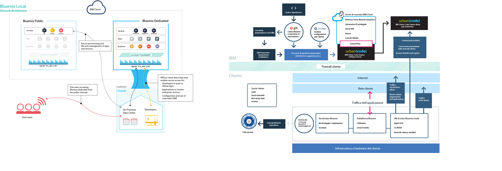

{:new_window: target="_blank"}
{:shortdesc: .shortdesc}

#{{site.data.keyword.Bluemix_notm}} locale
{: #local}
*Ultimo aggiornamento: 20 ottobre 2015*

{{site.data.keyword.Bluemix}} locale porta la potenza e l'agilità della piattaforma basata su cloud {{site.data.keyword.Bluemix_notm}} nel tuo data center. Con {{site.data.keyword.Bluemix_notm}} locale, puoi proteggere i carichi di lavoro più delicati dietro il firewall aziendale, restando sempre connesso e sincronizzato in modo sicuro con {{site.data.keyword.Bluemix_notm}} pubblico.
{:shortdesc}

IBM® utilizza le operazioni cloud come servizio per monitorare e gestire il tuo ambiente, così puoi concentrarti sulla costruzione di applicazioni e servizi che vengono eseguiti sull'ambiente. IBM gestisce inoltre gli aggiornamenti della piattaforma, permettendoti così di dedicarti al tuo business.

{{site.data.keyword.Bluemix_notm}} locale include un catalogo privato diffuso su diversi canali che visualizza i servizi locali disponibili in esclusiva per te. Sono compresi inoltre dei servizi aggiuntivi
che vengono diffusi e messi a disposizione da {{site.data.keyword.Bluemix_notm}} pubblico.

{{site.data.keyword.Bluemix_notm}} locale si inserisce in una macchina virtuale protetta mediante il firewall aziendale, così da permetterti di usufruire della struttura cloud più sicura e dalle prestazioni più elevate. IBM installa, monitora in remoto e gestisce {{site.data.keyword.Bluemix_notm}} locale nel tuo data center attraverso la tecnologia Relay di IBM.

Relay è una capacità di consegna inclusa con {{site.data.keyword.Bluemix_notm}} locale che consente a IBM di fornire automaticamente e costantemente gli aggiornamenti a tutte le distribuzioni locali, affinché tu abbia sempre un sistema aggiornato, stabile e protetto. Relay ottiene la connettività sicura attraverso un tunnel VPN SSL in uscita aperto che ha origine dalla macchina virtuale di inizio utilizzando i certificati specifici di ogni istanza {{site.data.keyword.Bluemix_notm}} locale. Il traffico su questo tunnel è l'automazione di Urban Code Deployer per servire e gestire la piattaforma, le risorse di calcolo e i servizi per la tua istanza.

*Figura 1. Panoramica dettagliata di {{site.data.keyword.Bluemix_notm}} locale*

Gli ambienti di {{site.data.keyword.Bluemix_notm}} locale hanno gli stessi standard di sicurezza di {{site.data.keyword.Bluemix_notm}} pubblico in termini di sicurezza operativa. Tu fornisci l'hardware e l'infrastruttura, il che ti permette di controllarne la sicurezza fisica. L'accesso degli sviluppatori a {{site.data.keyword.Bluemix_notm}} locale è controllato dalle tue politiche LDAP, che possono essere configurate dal team di {{site.data.keyword.Bluemix_notm}} nel momento in cui configurano il tuo ambiente. All'interno dell'ambiente locale, puoi gestire i ruoli e le autorizzazioni degli utenti utilizzando la Console di gestione.

{{site.data.keyword.Bluemix_notm}} locale viene fornito con tutti i runtime {{site.data.keyword.Bluemix_notm}} inclusi e 64 GB di memoria di elaborazione.

Inoltre, esiste una serie di servizi disponibili per {{site.data.keyword.Bluemix_notm}} locale.

| **Tipo** | **Nome** | **Descrizione** |    
|----------|----------|-----------------|
|Incluso | Runtime {{site.data.keyword.Bluemix_notm}}  | Utilizza i runtime per avere un'applicazione subito operativa, senza dover impostare e gestire macchine virtuali e sistemi operativi. Tutti i runtime {{site.data.keyword.Bluemix_notm}} sono disponibili per l'uso nella tua istanza {{site.data.keyword.Bluemix_notm}} locale. |
|Incluso | {{site.data.keyword.autoscaling}}| Ti permette di aumentare o ridurre dinamicamente la capacità
di elaborazione della tua applicazione in base alle politiche. Con questo servizio, avrai un uso illimitato nel tuo ambiente {{site.data.keyword.Bluemix}} locale. |
|Facoltativo |{{site.data.keyword.datacshort}}| Questo servizio fornisce una griglia di dati in memoria
che supporta scenari di cache distribuita per le tue applicazioni. Include 50 GB di cache in memoria. |
|Facoltativo | {{site.data.keyword.APIM}} | Utilizza il servizio {{site.data.keyword.APIMfull}}
per comporre, gestire e socializzare le API. Puoi importare API con delle risorse utilizzando un URL proxy o assemblando dati dalle origini dati HTTP. Il vantaggio di utilizzare il servizio {{site.data.keyword.APIM}} è quello di poter gestire la modalità in cui le API vengono utilizzate. |

*Tabella 1. Servizi locali*

##Configurazione dell'istanza di {{site.data.keyword.Bluemix_notm}} locale
{: #setuplocal}

{{site.data.keyword.Bluemix_notm}} locale è progettato per fornire una versione privata dell'offerta {{site.data.keyword.Bluemix_notm}} pubblico da te gestito che si trova sul tuo hardware. Puoi utilizzare i servizi e i runtime {{site.data.keyword.Bluemix_notm}} per supportare le tue esigenze di elaborazione in un ambiente cloud sicuro ospitato e gestito dal cliente.

IBM ti fornisce l'accesso a {{site.data.keyword.Bluemix_notm}} locale utilizzando un accesso protetto da password. Puoi accedere a servizi, runtime
e risorse associate nonché distribuire e rimuovere applicazioni {{site.data.keyword.Bluemix_notm}}. Esamina la seguente procedura per collaborare con il tuo rappresentante IBM alla configurazione della tua istanza locale di {{site.data.keyword.Bluemix_notm}}.

Per configurare la tua versione privata di {{site.data.keyword.Bluemix_notm}}:

<ol>
<li>Esamina i <a href="index.html#localinfra">Requisiti dell'infrastruttura di {{site.data.keyword.Bluemix_notm}} locale</a> per configurare la tua istanza locale.</li>
<li>Contatta il tuo rappresentante dell'account designato IBM oppure <a href="https://console.ng.bluemix.net/?direct=classic/#/contactUs/cloudOEPaneId=contactUs" target="_blank">{{site.data.keyword.Bluemix_notm}}</a> per iniziare.</li>
<li>Stabilisci un accordo per {{site.data.keyword.Bluemix_notm}} locale con IBM che includa le date cardine per la distribuzione.
<ol type="a">
	<li>Determina insieme a IBM la quota per la tua istanza di {{site.data.keyword.Bluemix_notm}} locale. La quota mensile ricorrente si basa sui servizi locali che desideri utilizzare, oltre a una sottoscrizione a tutti i servizi pubblici {{site.data.keyword.Bluemix_notm}}. Riceverai quindi una fattura per tutto ciò che scegli di utilizzare
al di fuori di tale accordo di sottoscrizione.</li>
	<li>Identifica le scadenze per ogni fase di configurazione della tua istanza di {{site.data.keyword.Bluemix_notm}} locale.</li>
	</ol>
	</li>
<li>Dopo la creazione della piattaforma e dell'account, devi identificare le persone all'interno della tua organizzazione a cui assegnare i ruoli necessari per rendere operativa la tua istanza locale. Per ciascun ruolo, esiste un rappresentante IBM corrispondente. 

Ruoli cliente:

<dl>
<dt>**Procurement focal**</dt>
<dd>Lavora con il rappresentante IBM per organizzare il tuo ambiente {{site.data.keyword.Bluemix_notm}} locale, occupandosi inoltre dell'identificazione delle persone adeguate a gestire ogni aspetto del progetto all'interno della tua organizzazione. Questo ruolo controlla la selezione del modello, gli accordi commerciali e la disposizione dell'accesso alle risorse dei clienti. Il Procurement focal rappresenta il contatto generale per la configurazione dell'istanza locale.</dd>
<dt>**Compliance officer**</dt>
<dd>Lavora con il rappresentante IBM per selezionare un'opzione di topologia e distribuzione che risponda ai tuoi requisiti di sicurezza. Questo ruolo collabora con il Compliance consultant di IBM per determinare quali modelli di distribuzione raggiungono gli obiettivi di conformità.</dd>
<dt>**Network Specialist**</dt>
<dd>Lavora con il rappresentante IBM per identificare i piani di rete per la distribuzione di {{site.data.keyword.Bluemix_notm}}. Questo ruolo fornisce i requisiti al rappresentante IBM e collabora a un piano di implementazione. Al termine della fase di installazione e verifica, questo ruolo dovrà confermare che la configurazione di rete è in conformità con gli standard aziendali.</dd>
<dt>**DevOps focal**</dt>
<dd>Lavora con il rappresentante IBM per pianificare e applicare gli aggiornamenti di manutenzione necessari per la piattaforma, i servizi e i runtime {{site.data.keyword.Bluemix_notm}}. Inoltre, questo ruolo collabora con il rappresentante IBM alla configurazione della tua istanza di {{site.data.keyword.Bluemix_notm}} locale.</dd>
</dl>

Ruoli IBM:

<dl>
<dt>**IBM provisioning manager**</dt>
<dd>Lavora con il Customer procurement focal per organizzare l'ambiente del cliente.</dd>
<dt>**IBM compliance consultant**</dt>
<dd>Lavora con il Customer compliance officer per selezionare un'opzione di topologia e distribuzione che risponda ai tuoi requisiti di sicurezza.</dd>
<dt>**IBM network specialist**</dt>
<dd>Lavora con il Customer network specialist per identificare i piani di rete per la distribuzione. Questo ruolo collabora con il cliente per raccogliere disposizioni e creare un piano di implementazione. Effettua inoltre dei test automatizzati per verificare il risultato fisico del piano di implementazione.</dd>	
<dt>**IBM DevOps focal**</dt>
<dd>Lavora con il Customer DevOps focal sull'installazione e manutenzione continua della topologia di distribuzione. Questo ruolo collabora con il cliente per pianificare ed effettuare aggiornamenti necessari per la piattaforma e i servizi.</dd>
</dl>
</li>
<li>Tu fornisci l'hardware e IBM ti aiuta a definire e stabilire la connettività di rete tra la rete aziendale e l'istanza di {{site.data.keyword.Bluemix_notm}} locale. Per ulteriori informazioni sui requisiti dell'infrastruttura, vedi <a href="index.html#localinfra">Requisiti dell'infrastruttura di {{site.data.keyword.Bluemix_notm}} locale</a>.
<ol type="a">
	<li>IBM configura l'accesso alla rete e il LDAP in base alle informazioni che hai fornito. L'accesso amministrativo
viene fornito ai contatti da te designati. Devi designare un
contatto anche per il supporto e la fatturazione.</li>
	<li>IBM configura un catalogo diffuso su diversi canali nell'ambiente locale per visualizzare i tuoi servizi locali e molti dei servizi {{site.data.keyword.Bluemix_notm}} pubblici.</li>
	<li>Convalida la configurazione di rete e del firewall e
l'accesso ed endpoint LDAP.</li>
	</ol>
</li>
</ol>
	
##Requisiti dell'infrastruttura di {{site.data.keyword.Bluemix_notm}}
locale
{: #localinfra}

Per {{site.data.keyword.Bluemix_notm}} locale,
disponi della sicurezza fisica e dell'infrastruttura per l'hosting dell'istanza locale. IBM imposta i seguenti
requisiti per la configurazione di {{site.data.keyword.Bluemix_notm}}
locale.
###Hardware
Sebbene vi siano requisiti per il tipo e la dimensione dell'hardware disponibile, puoi scegliere
una qualsiasi combinazione per soddisfare i requisiti complessivi impostati per le risorse.
<dl>
<dt>**Hardware ESXi VMware**</dt>
<dd>
ESXi è un livello di virtualizzazione eseguito su server virtuali che astrae il processore,
la memoria, l'archiviazione e le risorse in più macchine virtuali. Scegli una qualsiasi combinazione che soddisfi
le seguenti risorse totali, a condizione che il numero minimo di core fisici per ESXi sia otto. Le seguenti specifiche sono valide solo per i runtime core di {{site.data.keyword.Bluemix_notm}}.
<ul>
<li>48 core fisici a 2.0 o più GHz ciascuno</li>
<li>756 GB di RAM fisica</li>
</li>Dimensione totale dell'archivio dati di 7,5 TB
<ul>
<li>Archivio dati di 7 TB per contenere {{site.data.keyword.Bluemix_notm}}</li>
<li>Archivio dati di 500 GB per contenere la macchina virtuale di inizio</li>
</ul>
</ul>

<strong>Nota:</strong> se usi più archivi dati, utilizza lo stesso prefisso per ognuno.

</dd>
<dt>**Elevata disponibilità**</dt>
<dd>
Per supportare un singolo errore del nodo, devi avere n+1 ESXi. Ad esempio, se vengono utilizzati due ESXi,
che significa 16x core ciascuno, ne sarà necessario un terzo.

<strong>Nota:</strong> l'amministratore dei clienti VMware può decidere di imporre livelli rigidi di failover ad elevata disponibilità nel cluster per garantire le risorse.

</dd>
<dt>**Rete**</dt>
<dd>
I requisiti consigliati includono un gruppo di porte accessibili ai clienti con 10 indirizzi IP di
rete cliente con accesso Internet in uscita. Definisci quindi una seconda VLAN privata tra i soli
ESXi utilizzati per {{site.data.keyword.Bluemix_notm}} locale. Questa VLAN è mostrata come gruppo di porte in VMware. {{site.data.keyword.Bluemix_notm}} locale lo utilizza per la sottorete privata,
che è più sicura e può contribuire a evitare problemi di instradamento.
</dd>
</dl>

###Configurazione del server vCenter
Esamina i seguenti requisiti relativi a versione, datacenter,
pool di risorse e archivio dati.
<dl>
<dt>**Versioni VMware supportate**</dt>
<dd>vCenter e ESXi 5.1 e 5.5</dd>
<dt>**Datacenter**</dt>
<dd>Crea un datacenter, se non ne esiste uno.</dd>
<dt>**Cartella datacenter**</dt>
<dd>Crea una cartella VM con lo stesso nome del cluster, se non intendi concedere l'accesso Amministratore
che viene propagato dal datacenter.</dd>
<dt>**Cluster**</dt>
<dd>Crea un cluster specifico per l'utilizzo di {{site.data.keyword.Bluemix_notm}} locale. Un esempio di nome
per il cluster è `bluemix`.</dd>
<dt>**Pool di risorse**</dt>
<dd>Crea un pool di risorse nel cluster di {{site.data.keyword.Bluemix_notm}} locale. Un esempio di nome per pool di
risorse è `local`.</dd>
</dt>**Archivi dati**</dt>
<dd>Richiede 7,5 TB per la distribuzione iniziale di {{site.data.keyword.Bluemix_notm}}. 
 
**Nota**: quando utilizzi più di un archivio dati, assicurati che ciascuno di questi inizi con lo stesso prefisso. Esempi di nomi per più archivi dati
con lo stesso prefisso sono `bluemix_datastore_01` e
`bluemix_datastore_02`.</dd>
</dl>

###Larghezza di banda della rete
La velocità effettiva consigliata è di 5 Mbps in entrata e 5 Mbps in uscita e
puoi prevedere un utilizzo di dati mensile di 10 GB. IBM stabilisce delle finestre adeguate quando vengono consegnati grandi quantità di dati, che possono avere una dimensione di 3 GB.
###Autorizzazioni VMware
Imposta i seguenti ruoli e autorizzazioni. Per ciascuna autorizzazione
viene impostata la propagazione. Se l'autorizzazione viene propagata, viene tramandata attraverso la
gerarchia di oggetti. Tuttavia, le autorizzazioni per un oggetto figlio sovrascrivono sempre le autorizzazioni
propagate da un oggetto padre.
<dl>
<dt>**v Center Server**</dt>
<dd>Imposta il ruolo come di sola lettura e non propagato. 
 
**Nota**: questo ruolo è necessario per richiamare lo stato dell'attività per specifiche operazioni su disco.</dd>
<dt>**Datacenter**</dt>
<dd>Crea il ruolo "{{site.data.keyword.Bluemix_notm}}" e concedi l'autorizzazione per l'**Archivio dati** includendo **Operazioni sui file di basso livello** e **Aggiorna file macchina virtuale**. 
 
**Nota**: questo ruolo è necessario per supportare la pubblicazione di file negli archivi dati.</dd>
<dt>**Cluster**</dt>
<dd>Imposta il ruolo come amministratore e propagato.</dd>
<dt>**Archivi dati**</dt>
<dd>Imposta il ruolo amministratore e propagato per ogni archivio dati {{site.data.keyword.Bluemix_notm}}.</dd>
<dt>**Rete**</dt>
<dd>Imposta i gruppi di porte pubbliche e private con il ruolo amministratore non propagato.</dd>
</dl>

###Pool DEA (Droplet Execution Agent)
Ciascun DEA è configurato con:
- 16 - 32 GB di RAM
- vCPU 2x - 4x
- 150 - 300 GB di archiviazione

Ad esempio, se la dimensione dell'host ESXi è di 256 GB di memoria con 16x core, verranno aggiunti otto
DEA. Se la dimensione dell'host ESXi è di 64 GB di memoria con 8x core, sarà necessario aggiungere 2 ESXi e quattro
DEA. È richiesto un ulteriore 1,5 TB di archiviazione per ogni quattro DEA. Questo esempio
si basa su un DEA configurato con 32 GB di RAM, vCPU 4x e 300 GB di archiviazione.

##Manutenzione dell'istanza locale
{: #maintainlocal}

IBM effettua la manutenzione e l'installazione di aggiornamenti e correzioni ogni qualvolta lo ritenga appropriato per la piattaforma, i runtime e i servizi di Bluemix locale. I servizi potrebbero non essere disponibili durante le finestre di manutenzione.

**Importante**: IBM si riserva il diritto di interrompere i servizi per applicare la manutenzione di emergenza a seconda delle necessità. IBM potrebbe modificare le ore di manutenzione pianificate, ma verrai avvisato di tali modifiche nonché di tutte le informazioni relative alla manutenzione di emergenza.

Per {{site.data.keyword.Bluemix_notm}} locale, sono richiesti i seguenti tipi di manutenzione:
<dl>
<dt>**Finestre di manutenzione standard**</dt>
<dd>I servizi utilizzano finestre di manutenzione standard predefinite che potrebbero comportare la mancata disponibilità dei servizi. IBM non richiede l'approvazione del cliente per effettuare la manutenzione, ma tenta di minimizzare l'impatto sui tuoi servizi. 
 
IBM invia messaggi broadcast relativi alle modifiche pianificate per ciascuna finestra di manutenzione tramite e-mail, telefono o altri metodi. 
 
**Importante**: alcuni servizi potrebbero non essere disponibili durante il periodo di manutenzione.</dd>

<dt>**Finestra di modifica mensile**</dt>
<dd>La finestra di manutenzione mensile si applica in base al coordinamento tra te e IBM all'interno di una finestra di 21 giorni. Puoi fornire a IBM specifiche date o ore nella finestra di 21 giorni che potrebbero non andar bene per te. IBM tenta di pianificare gli aggiornamenti lontano da quei periodi. In base alle richieste, IBM ti comunica la finestra di manutenzione pianificata. Le finestre di modifica mensile non dovrebbero influire sull'ambiente Bluemix locale in esecuzione. 
 
**Nota**: se non richiedi un periodo specifico per l'aggiornamento, la manutenzione viene applicata automaticamente allo scadere della finestra. 
 
Passa a **AMMINISTRAZIONE > INFORMAZIONI DI SISTEMA** per visualizzare gli aggiornamenti in sospeso, impostare le date non disponibili e approvare gli aggiornamenti. Per ulteriori informazioni sulle notifiche e sulla pianificazione degli aggiornamenti in sospeso, vedi <a href="../admin/index.html#oc_system">Visualizzazione delle informazioni di sistema</a>.</dd>

<dt>**Altro**</dt>
<dd>IBM intende limitare gli interventi di manutenzione che potrebbero influire sui servizi, in particolare sulla disponibilità dell'ambiente, dei runtime e dei servizi di Bluemix locale, alle finestre standard e mensili. In via eccezionale, potrebbero essere utilizzate altre finestre di modifica per la gestione
dell'ambiente. IBM si impegna a ridurre al minimo l'impatto sul tuo lavoro durante tali finestre di modifica e ti avviserà anticipatamente.</dd>
</dl>

Per configurare la manutenzione della tua istanza locale, collabora con il rappresentante designato IBM per identificare una finestra concordata per la manutenzione standard.
   
