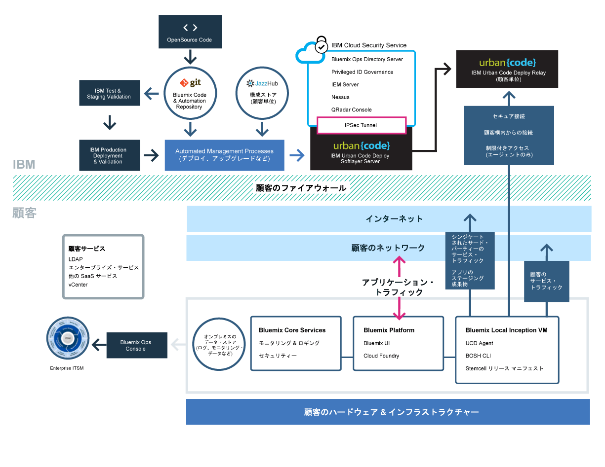

{:new_window: target="_blank"}
{:shortdesc: .shortdesc}

#{{site.data.keyword.Bluemix_notm}} Local
{: #local}
*最終更新日: 2015 年 10 月 20 日*

ユーザーのデータ・センターは、{{site.data.keyword.Bluemix}} Local を使用することにより、{{site.data.keyword.Bluemix_notm}} クラウド・ベースのプラットフォームが持つ能力と俊敏性を得ることができます。{{site.data.keyword.Bluemix_notm}} Local を使用すれば、{{site.data.keyword.Bluemix_notm}} Public にセキュアに接続して同期をとり続けながら、同時に、自社のファイアウォールの内側にある最高機密のワークロードを保護することができます。
{:shortdesc}

IBM® はクラウド操作をサービスとして使用してお客様の環境のモニターと保守を行います。そのため、お客様は、自分の環境上で稼動するアプリやサービスのビルドに注力できます。また、IBM はプラットフォームの更新にも対応するので、お客様はビジネスに専念できます。

{{site.data.keyword.Bluemix_notm}} Local には、自分だけが使用できるローカル・サービスを表示する、プライベートのシンジケートされたカタログが含まれています。また、{{site.data.keyword.Bluemix_notm}} Public からシンジケートおよび使用できる追加サービスも含まれています。

{{site.data.keyword.Bluemix_notm}} Local はお客様の自社ファイアウォールの内側にある仮想マシン上に存在するので、お客様は、最高の処理性能を持つ、最もセキュアなクラウド・インフラストラクチャーが使用できるようになります。IBM は、IBM のリレー・テクノロジーを使用して、お客様のデータ・センターに対して {{site.data.keyword.Bluemix_notm}} Local のインストール、リモート・モニター、および管理を行います。

リレーというのは {{site.data.keyword.Bluemix_notm}} Local に同梱されている配信機能のことで、これにより、IBM は、更新をすべてのローカル・デプロイメントに自動的かつ一貫して配信することが可能になるため、お客様は、最新で安定したセキュアなシステムを維持することができます。リレーは、各 {{site.data.keyword.Bluemix_notm}} Local インスタンスに固有な証明書を使用し、開始仮想マシンを起点とするオープンなアウトバウンド SSL VPN トンネルを介してセキュアな接続を達成します。このトンネルのトラフィックは、プラットフォーム、計算リソース、およびユーザー・インスタンス向けのサービスを提供し保守するため、Urban Code Deployer オートメーションになっています。

*図 1. {{site.data.keyword.Bluemix_notm}} Local の詳細な概要*

{{site.data.keyword.Bluemix_notm}} Local 環境のセキュリティー標準は、運用上のセキュリティーの観点では、パブリックの {{site.data.keyword.Bluemix_notm}} と同じです。お客様はハードウェアとインフラストラクチャーを用意します。これにより、インフラストラクチャーと物理的セキュリティーを制御できるようになります。ローカルの {{site.data.keyword.Bluemix_notm}} に対する開発者のアクセスは、LDAP ポリシーによって制御されます。このポリシーは、環境のセットアップ時に {{site.data.keyword.Bluemix_notm}} チームが構成することができます。ローカル環境内では、管理コンソールを使用すればユーザーの役割と許可を管理できます。

{{site.data.keyword.Bluemix_notm}} Local には、付属しているすべての {{site.data.keyword.Bluemix_notm}} ランタイムおよび 64 GB の計算メモリーが搭載されています。

さらに、{{site.data.keyword.Bluemix_notm}} Local で使用可能なサービスが一式揃っています。

| **タイプ ** | **名前** | **説明** |    
|----------|----------|-----------------|
|組み込み | {{site.data.keyword.Bluemix_notm}} ランタイム | ランタイムはアプリを素早く立ち上げて実行するために使用します。VM とオペレーティング・システムのセットアップと管理は不要です。すべての {{site.data.keyword.Bluemix_notm}} ランタイムが、{{site.data.keyword.Bluemix_notm}} Local インスタンスで使用可能です。|
|組み込み | {{site.data.keyword.autoscaling}}| ポリシーに基づいて、アプリケーションの計算能力を動的に増減します。このサービスを使用することで、{{site.data.keyword.Bluemix}} Local 環境で使用量が無制限になります。|
|オプション |{{site.data.keyword.datacshort}}| このサービスは、アプリで分散キャッシュ・シナリオをサポートするメモリー内データ・グリッドを提供します。50 GB のメモリー内キャッシュが含まれます。 |
|オプション | {{site.data.keyword.APIM}} | {{site.data.keyword.APIMfull}} サービスを使用して、API を構成、管理、およびソーシャル化します。API は、プロキシー URL を使用するか、HTTP データ・ソースからデータをアセンブルすることにより、リソースと一緒にインポートできます。{{site.data.keyword.APIM}} サービスを使用する利点は、API の使用方法を管理できることです。 |

*表 1. Local のサービス*

##{{site.data.keyword.Bluemix_notm}} Local インスタンスのセットアップ
{: #setuplocal}

{{site.data.keyword.Bluemix_notm}} Local は、お客様が管理するお客様自身のハードウェアでホストされる、{{site.data.keyword.Bluemix_notm}} Public オファリングの専用バージョンを提供するよう設計されています。{{site.data.keyword.Bluemix_notm}} のサービスとランタイムを使用すれば、お客様がホストし管理しているセキュアなクラウド環境でコンピューティング・ニーズをサポートすることができます。

IBM は、お客様がパスワードで保護されたログインを使用して {{site.data.keyword.Bluemix_notm}} Local にアクセスできるようにします。サービス、ランタイム、および関連リソースにアクセスしたり、{{site.data.keyword.Bluemix_notm}} アプリをデプロイおよび削除したりすることができます。{{site.data.keyword.Bluemix_notm}} のローカル・インスタンスをセットアップするため IBM 担当員と連携するには、以下のステップを検討してください。

{{site.data.keyword.Bluemix_notm}} の専用バージョンをセットアップするには、以下のようにします。

<ol>
<li>ローカル・インスタンスをセットアップするための『<a href="index.html#localinfra">{{site.data.keyword.Bluemix_notm}} Local のインフラストラクチャー要件</a>』を検討します。</li>
<li>IBM 指定のアカウント担当者に連絡するか、<a href="https://console.ng.bluemix.net/?direct=classic/#/contactUs/cloudOEPaneId=contactUs" target="_blank">{{site.data.keyword.Bluemix_notm}}</a>に連絡して、開始します。</li>
<li>IBM と、納品日のマイルストーンが含まれている {{site.data.keyword.Bluemix_notm}} Local 契約を結びます。
<ol type="a">
	<li>{{site.data.keyword.Bluemix_notm}} Local インスタンスの料金について IBM と連携して決定します。毎月繰り返し発生する料金は、使用するローカル・サービスと、すべての {{site.data.keyword.Bluemix_notm}} Public サービスのサブスクリプションに基づきます。さらに、当該サブスクリプション契約を超えて使用したサービスに対する請求書を受け取ります。</li>
	<li>{{site.data.keyword.Bluemix_notm}} Local インスタンスをセットアップする各フェーズの期限を特定します。</li>
	</ol>
	</li>
<li>プラットフォームとアカウントを作成したら、その後、ローカル・インスタンスを立ち上げて実行するために必要な役割を担う個人を組織内で特定します。各役割に対して、対応する IBM 担当員が存在します。 

お客様の役割:

<dl>
<dt>**調達フォーカル**</dt>
<dd>IBM 担当員と連携して、{{site.data.keyword.Bluemix_notm}} Local 環境を確立します。これには、プロジェクトのどの側面に取り組む場合でも、それに対して適切な個人を組織内で見つけることが含まれます。この役割では、パターン選択、商業協定およびお客様のリソースへのアクセスの取り決めを監視します。調達フォーカルは、ローカル・インスタンスをセットアップする際の総合的連絡先になります。</dd>
<dt>**コンプライアンス責任者**</dt>
<dd>IBM 担当員と連携して、お客様のセキュリティー要件に合ったトポロジーとデプロイメントのオプションを選択します。この役割は IBM コンプライアンス・コンサルタントと連携して、コンプライアンスの目標と目的を達成するデプロイメント・パターンを決めます。</dd>
<dt>**ネットワーク・スペシャリスト**</dt>
<dd>IBM 担当員と連携して、 {{site.data.keyword.Bluemix_notm}} デプロイメントのネットワーク計画を決定します。この役割は、IBM 担当員に要件を伝え、連携して実装計画を策定します。インストールと検証の段階が終わると、この役割は、ネットワーク構成が企業標準に準拠していることを「承認」します。</dd>
<dt>**DevOps フォーカル**</dt>
<dd>IBM 担当員と連携して、{{site.data.keyword.Bluemix_notm}} のプラットフォーム、サービス、およびランタイムに必要な保守更新を計画して適用します。また、この役割は IBM 担当員と連携して、{{site.data.keyword.Bluemix_notm}} Local インスタンスの構成も行います。</dd>
</dl>

IBM の役割:

<dl>
<dt>**IBM プロビジョニング・マネージャー**</dt>
<dd>お客様の調達フォーカルと連携して、お客様の環境を確立します。</dd>
<dt>**IBM コンプライアンス・コンサルタント**</dt>
<dd>お客様のコンプライアンス責任者と連携して、お客様のセキュリティー要件を満たすトポロジーとデプロイメント・オプションを選択します。</dd>
<dt>**IBM ネットワーク・スペシャリスト**</dt>
<dd>お客様のネットワーク・スペシャリストと連携して、デプロイメントに合ったネットワーク計画を策定します。この役割はお客様と連携して、必要条件を収集し、実装計画を作成します。また、この役割は、実装計画が物理的にどういう結果になるかを検証する自動化されたテストも実行します。</dd>	
<dt>**IBM DevOps フォーカル**</dt>
<dd>お客様の DevOps フォーカルと連携して、デプロイメント・トポロジーのインストールと継続的な保守を行います。この役割は、お客様と連携して、プラットフォームとサービスに必要な更新の計画を立てて実施します。</dd>
</dl>
</li>
<li>お客様はハードウェアを用意し、IBM は、お客様が自社のネットワークと {{site.data.keyword.Bluemix_notm}} Local インスタンスの間のネットワーク接続を定義し確立するのを支援します。インフラストラクチャーの要件について詳しくは、『<a href="index.html#localinfra">{{site.data.keyword.Bluemix_notm}} Local のインフラストラクチャー要件</a>』を参照してください。
<ol type="a">
	<li>IBM が、お客様が用意した構成に基づいて、ネットワーク・アクセスおよび LDAP を構成します。お客様が指定した連絡先に、管理アクセス権限が付与されます。サポートおよび請求用の連絡先を指定する必要もあります。</li>
	<li>IBM が、お客様のローカル環境でシンジケートされたカタログをセットアップし、お客様のローカル・サービス、およびパブリックの {{site.data.keyword.Bluemix_notm}} サービスの多くが表示されるようにします。</li>
	<li>お客様が、ネットワークとファイアウォールの構成、および LDAP エンドポイントとアクセスを確認します。</li>
	</ol>
</li>
</ol>
	
##{{site.data.keyword.Bluemix_notm}} Local のインフラストラクチャー要件
{: #localinfra}

{{site.data.keyword.Bluemix_notm}} Local では、物理的セキュリティー、およびローカル・インスタンスをホストするためのインフラストラクチャーをお客様が所有します。IBM では、{{site.data.keyword.Bluemix_notm}} Local をセットアップするための要件を以下のように設定しています。
###ハードウェア
使用可能なハードウェアのタイプおよびサイズの要件はありますが、設定されているリソースの合計の要件を満たすために任意の組み合わせを選択できます。
<dl>
<dt>**VMware ESXi ハードウェア**</dt>
<dd>
ESXi は、物理サーバーで実行され、プロセッサー、メモリー、ストレージ、およびリソースを複数の仮想マシンに抽出する仮想化層です。ESXi ごとの最小物理コア数が 8 という条件の下で、以下のリソース合計を満たす任意の組み合わせを選択できます。以下の仕様は、{{site.data.keyword.Bluemix_notm}} コア・ランタイム専用です。
<ul>
<li>48 個の物理コア (各々 2.0 GHz 以上)</li>
<li>756 GB の物理 RAM</li>
</li>合計データ・ストア・サイズ 7.5 TB <ul>
<li>{{site.data.keyword.Bluemix_notm}} を保持するための 7 TB のデータ・ストア</li>
<li>開始仮想マシンを保持するための 500 GB のデータ・ストア</li>
</ul>
</ul>

<strong>注:</strong> 複数のデータ・ストアを使用する場合は、それぞれに同じプレフィックスを使用してください。

</dd>
<dt>**高可用性**</dt>
<dd>
単一ノードの障害に対応するためには、n+1 個の ESXi が必要です。例えば、2 個の ESXi (それぞれ 16 個のコア) を使用する場合、3 個目の ESXi が必要になります。
<strong>注:</strong> お客様の VMware 管理者が、リソースを保証するためにクラスター内に厳格な高可用性フェイルオーバーを適用するかどうかを決定できます。

</dd>
<dt>**ネットワーク**</dt>
<dd>
推奨要件として、アウトバウンド・インターネット・アクセスを持つ 10 個のお客様のネットワーク IP アドレスが含まれた、お客様からアクセス可能なポート・グループがあります。その場合、{{site.data.keyword.Bluemix_notm}} Local で使用する ESXi のみの間に 2 つ目のプライベート VLAN を定義してください。
この VLAN は、VMware でポート・グループとして表示されます。{{site.data.keyword.Bluemix_notm}} Local はこれをプライベート・サブネットで使用します。プライベート・サブネットは、セキュリティーが高く、ルーティングの問題の回避に役立ちます。</dd>
</dl>

###vCenter サーバー構成
以下のバージョン、データ・センター、リソース・プール、およびデータ・ストアの要件を確認してください。
<dl>
<dt>**サポートされる VMware バージョン**</dt>
<dd>vCenter および ESXi 5.1 および 5.5</dd>
<dt>**データ・センター**</dt>
<dd>データ・センターが存在しない場合は、データ・センターを作成します。</dd>
<dt>**データ・センター・フォルダー**</dt>
<dd>データ・センターから伝搬された管理者権限を付与する計画でない場合は、クラスターと同じ名前の VM フォルダーを作成します。</dd>
<dt>**クラスター**</dt>
<dd>{{site.data.keyword.Bluemix_notm}} Local 専用のクラスターを作成します。クラスター名の例: `bluemix`。</dd>
<dt>**リソース・プール**</dt>
<dd>{{site.data.keyword.Bluemix_notm}} Local クラスターの下にリソース・プールを作成します。リソース・プール名の例: `local`。</dd>
</dt>**データ・ストア**</dt>
<dd>{{site.data.keyword.Bluemix_notm}} の初期デプロイメントに 7.5 TB 必要です。 
 
**注**: 複数のデータ・ストアを使用する場合は、それぞれが同じプレフィックスで始まるようにしてください。同じプレフィックスを持つ複数のデータ・ストア名の例: `bluemix_datastore_01` と `bluemix_datastore_02`。</dd>
</dl>

###ネットワーク帯域幅
推奨スループットは、上り 5 Mbps、下り 5 Mbps です。これで、月次データ使用量 10 GB を予期できます。IBM は、一連の大量データ (最大で 3GB) が送信される場合に合意された枠を設定いたします。
###VMware の許可
以下の役割と許可を設定します。伝搬は許可ごとに設定されます。許可が伝搬されると、許可はオブジェクト階層を介して継承されます。ただし、子オブジェクトの許可は常に、親オブジェクトから伝搬された許可をオーバーライドします。
<dl>
<dt>**v Center サーバー**</dt>
<dd>役割を読み取り専用、かつ伝搬されないものとして設定します。 
 
**注**: この役割は、特定のディスク操作のタスク状況を取得するために必要になります。</dd>
<dt>**データ・センター**</dt>
<dd>「{{site.data.keyword.Bluemix_notm}}」という役割を作成し、**「低レベル・ファイル操作 (Low level file operations)」**および**「仮想マシン・ファイルの更新 (Update virtual machine files)」**を含む**「データ・ストア (Datastore)」**の許可を付与します。 
 
**注**: この役割は、データ・ストアへのファイルのポストをサポートするために必要になります。</dd>
<dt>**クラスター**</dt>
<dd>役割を管理者、かつ伝搬されるものとして設定します。</dd>
<dt>**データ・ストア**</dt>
<dd>{{site.data.keyword.Bluemix_notm}} データ・ストアごとに、役割を管理者、かつ伝搬されるものとして設定します。</dd>
<dt>**ネットワーク**</dt>
<dd>伝搬されない管理者役割を持つ、パブリックおよびプライベート・ポート・グループを設定します。</dd>
</dl>

###ドロップレット実行エージェント (DEA) プール
以下を備えた各 DEA を構成します。
- 16 から 32 GB の RAM
- 2 から 4 個の vCPU
- 150 から 300 GB のストレージ

例えば、ESXi ホスト・サイズが 256 GB のメモリーと 16 個のコアの場合、8 個の DEA を追加します。ESXi ホスト・サイズが 64 GB のメモリーと 8 個のコアの場合、2 個の ESXi と 4 個の DEA を追加する必要があります。4 個の DEA ごとに追加の 1.5 TB のストレージが必要です。この例は、32 GB の RAM、4 個の vCPU、および 300 GB のストレージで構成された DEA に基づいています。

##ローカル・インスタンスの保守
{: #maintainlocal}

Bluemix Local プラットフォーム、ランタイム、およびサービスに適合していると IBM が判断した更新およびフィックスについて、IBM は保守とインストールを行います。保守期間の間はサービスが利用できない場合があります。

**重要**: IBM は、必要に応じて緊急時保守を適用するためにサービスを中断する権利を留保します。IBM は、定期保守の時間を変更することがありますが、そのような変更および緊急時保守の情報についてはすべてお客様に通知いたします。

{{site.data.keyword.Bluemix_notm}} Local には、以下のタイプの保守が必要です。
<dl>
<dt>**標準保守期間**</dt>
<dd>サービスは、事前定義された標準保守期間を利用します。そのため、サービスが利用できなくなる場合があります。IBM は保守の実施に当たり、お客様の承認を必要としませんが、お客様のサービスへの影響が最小限になるよう努めます。 
 
IBM は、E メール、電話、または他の方法を通じて、各保守期間で計画されている変更を示すブロードキャスト・メッセージを通知します。 
 
**重要**: 保守期間中には、一部のサービスが使用不可になる可能性があります。</dd>

<dt>**月次変更期間**</dt>
<dd>月次保守期間は、21 日間の期間内でお客様と IBM の間の調整に基づいて適用されます。お客様は、21 日間の期間内で都合が悪い可能性のある特定の日時を IBM に提示してください。IBM は、その時間を外して更新をスケジュールに入れるようにします。要求に基づき、IBM はスケジュールに入れた保守期間をお客様に伝えます。月次変更期間は、稼働中の Bluemix Local 環境には影響しないと見込まれます。 
 
**注**: 特定の時間に更新するよう要求しない場合、保守は、自動的に期間の最後に適用されます。 
 
**「管理」>「システム情報 (SYSTEM INFORMATION)」**へ移動して保留中の更新を表示し、利用不能日を設定して、更新を承認します。通知と保留中の更新のスケジューリングについて詳しくは、『<a href="../admin/index.html#oc_system">システム情報の表示</a>』を参照してください。</dd>

<dt>**その他**</dt>
<dd>IBM は、ご使用のサービス、特に、お客様の Bluemix Local 環境、ランタイム、およびサービスの可用性に影響する可能性があるすべての保守を、標準期間および月次期間に限定する所存です。
環境の管理のために例外ベースで、その他の変更期間を使用することがあります。IBM は、それらの変更期間中にお客様に与える影響を最小限に抑えるよう十分に努めるとともに、事前に通知いたします。</dd>
</dl>

ご使用のローカル・インスタンスの保守を手配するには、IBM 指定のアカウント担当者と連携して、標準保守について合意した期間を明示してください。
   
