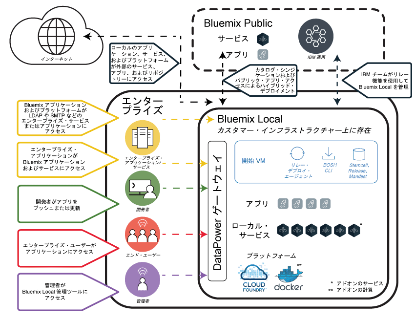
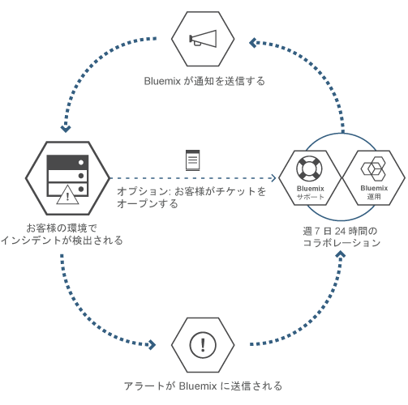

---

copyright:

  years: 2015, 2017

lastupdated: "2017-01-12"

---

{:new_window: target="_blank"}
{:shortdesc: .shortdesc}

# {{site.data.keyword.Bluemix_local_notm}}
{: #local}

ユーザーのデータ・センターは、{{site.data.keyword.Bluemix_local}} を使用することにより、{{site.data.keyword.Bluemix_notm}} クラウド・ベースのプラットフォームが持つ能力と俊敏性を得ることができます。{{site.data.keyword.Bluemix_local_notm}} を使用すれば、{{site.data.keyword.Bluemix_notm}} Public にセキュアに接続して同期をとり続けながら、同時に、自社のファイアウォールの内側にある最高機密のワークロードを保護することができます。
{:shortdesc}

IBM® はクラウド操作をサービスとして使用してお客様の環境のモニターと保守を行います。そのため、お客様は、自分の環境上で稼動するアプリやサービスのビルドに注力できます。また、{{site.data.keyword.IBM_notm}} はプラットフォームの更新にも対応するので、お客様はビジネスに専念できます。

{{site.data.keyword.Bluemix_local_notm}} 環境のセキュリティー標準は、運用上のセキュリティーの観点では、Public  {{site.data.keyword.Bluemix_notm}} と同じです。お客様はハードウェアとインフラストラクチャーを用意します。これにより、インフラストラクチャーと物理的[セキュリティー](/docs/security/index.html#localplatformsecurity)を制御できるようになります。ローカルの {{site.data.keyword.Bluemix_notm}} 環境に対する開発者のアクセスは、LDAP ポリシーによって制御されます。このポリシーは、環境のセットアップ時に {{site.data.keyword.Bluemix_notm}} チームが構成することができます。ローカル環境内では、管理ページを使用して[ユーザーと許可を管理](/docs/admin/index.html#oc_useradmin)できます。

{{site.data.keyword.Bluemix_local_notm}} には、付属しているすべての {{site.data.keyword.Bluemix_notm}} ランタイムおよび 64 GB の計算メモリーが搭載されています。

さらに、{{site.data.keyword.Bluemix_local_notm}} サービスとして使用可能な一連のサービスがあります。以下の表で、組み込みのもの、オプションで購入可能なものを確認してください。

| **タイプ ** | **名前** | **説明** |
|----------|----------|-----------------|
|組み込み | [{{site.data.keyword.Bluemix_notm}} ランタイム](/docs/cfapps/runtimes.html) | ランタイムはアプリを素早く立ち上げて実行するために使用します。マシンとオペレーティング・システムのセットアップと管理は不要です。すべての {{site.data.keyword.Bluemix_notm}} ランタイムが、{{site.data.keyword.Bluemix_notm}} Local インスタンスで使用可能です。|
|組み込み | [{{site.data.keyword.autoscaling}}](/docs/services/Auto-Scaling/index.html)| ポリシーに基づいて、アプリケーションの計算能力を動的に増減します。このサービスを使用することで、{{site.data.keyword.Bluemix}} Local 環境で使用量が無制限になります。|
|オプション | [{{site.data.keyword.apiconnect_short}}](/docs/services/apiconnect/index.html) | {{site.data.keyword.apiconnect_long}} は、{{site.data.keyword.APIM}} と IBM StrongLoop を単一のオファリングに統合し、API とマイクロサービスを作成、実行、管理、および強化する包括的な解決策を提供します。 |
|オプション | [{{site.data.keyword.cloudant}}](/docs/services/Cloudant/index.html#Cloudant) | {{site.data.keyword.cloudant}} は、常に稼働している完全管理 NoSQL JSON データ層へのアクセスを提供します。このサービスは CouchDB と互換性があり、モバイル・アプリケーション・モデルおよび Web アプリケーション・モデル用の、簡単に使用できる HTTP インターフェースでアクセスできます。詳しくは、ローカル環境に関する詳細な[資料 ](http://docs.cloudant.com/BluemixLocal.html){: new_window} および[ハードウェア要件 ](http://docs.cloudant.com/BluemixLocalHardware.html){: new_window} を参照してください。 |
|オプション | [{{site.data.keyword.containershort}}](/docs/containers/container_index.html) | {{site.data.keyword.Bluemix_notm}} Local で Docker コンテナーを実行します。コンテナーは、アプリが実行のために必要とするすべてのエレメントを含む仮想ソフトウェア・オブジェクトです。コンテナーには、リソースの分離と割り振りの利点がありますが、例えば仮想マシンなどよりも、移植可能性と効率性が高まっています。ハードウェア要件については、『[{{site.data.keyword.Bluemix_notm}} Dedicated および Bluemix Local における IBM {{site.data.keyword.containershort}}](/docs/containers/container_dl.html)』を参照してください。 |
|オプション | [{{site.data.keyword.datacshort}}](/docs/services/DataCache/index.html#data_cache) | このサービスは、アプリで分散キャッシュ・シナリオをサポートするメモリー内データ・グリッドを提供します。50 GB のメモリー内キャッシュが含まれます。 |
| オプション (ベータ版) | [ロギング](/docs/monitoringandlogging/cfapps_ml_logs_dedicated_ov.html#container_ml_logs_dedicated_ov) | {{site.data.keyword.Bluemix_notm}} ユーザー・インターフェースで Cloud Foundry アプリのログおよび Kibana で検索可能なログとダッシュボードを提供します。 |
|オプション | [{{site.data.keyword.mobilepush}}](/docs/services/mobilepush/index.html) | {{site.data.keyword.mobilepush}} は、通知を iOS および Android デバイスに送信するために使用することができるサービスです。通知は、すべてのアプリケーション・ユーザー、またはタグを使用して特定のユーザーとデバイスのセットを対象にすることができます。デバイス、タグ、およびサブスクリプションを管理することができます。SDK (Software Development Kit) および　Representational State Transfer (REST) アプリケーション・プログラム・インターフェース (API) を使用して、さらにクライアント・アプリケーションを開発することも可能です。 |
|オプション | [{{site.data.keyword.sescashort}}](/docs/services/SessionCache/index.html#session_cache) | 冗長性を高めるために、{{site.data.keyword.sescashort}} は、キャッシュに保管されたセッションのレプリカを提供します。これにより、ブラウンアウトまたは障害が発生した場合、クライアント・アプリケーションはキャッシュ内のセッションへのアクセスを維持できます。サービスでは、Web アプリケーションとモバイル・アプリケーションのセッション・キャッシュ・シナリオがサポートされます。 |
|オプション | [{{site.data.keyword.iot_short}}](/docs/services/IoT/index.html) | このサービスにより、アプリは、接続されたデバイス、センサー、およびゲートウェイが収集したデータと通信して、それらのデータを取り込むことができます。Local の基本オファリングには、初期環境が含まれます。初期環境では、100,000 個の同時接続されたデバイスまたはアプリケーションと 1.6 TB のデータ交換の容量を備えたローカル環境内で {{site.data.keyword.iot_short}} の専用バージョンを実行できます。 |
{: caption="Table 1. Local services and runtimes" caption-side="top"}
{: #table01}

リソースおよびサービスの容量を拡大および拡張するために購入できる、オプションのコンポーネントが用意されています。販売チームに連絡して、これらのコンポーネントを購入できます。営業担当員への連絡について詳しくは、[「お問い合わせ」](https://console.ng.bluemix.net/?direct=classic/#/contactUs/cloudOEPaneId=contactUs)にアクセスしてください。サービスのプランを増やすには、カタログのサービス・タイルからプランを選択します。

| **名前** | **説明** |
|----------|-----------------|
|{{site.data.keyword.Bluemix_notm}} Local {{site.data.keyword.apiconnect_short}} Professional 500 万回の API 呼び出し | 部門別の API プロジェクトを対象にした、1 月当たり 500 万回の API 呼び出し容量を持つ {{site.data.keyword.apiconnect_short}} の専用バージョンを実行できる環境。 |
|{{site.data.keyword.Bluemix_notm}} Local {{site.data.keyword.apiconnect_short}} Professional 10 万回の API 呼び出し容量の増加| 1 月当たり 10 万回の API 呼び出し容量を追加する {{site.data.keyword.apiconnect_short}} Professional 環境の拡張。 |
|{{site.data.keyword.Bluemix_notm}} Local {{site.data.keyword.apiconnect_short}} Enterprise 2500 万回の API 呼び出し | 企業全体の API プロジェクトを対象にした、1 月当たり 2500 万回の API  呼び出し容量を持つ {{site.data.keyword.apiconnect_short}} の専用バージョンを実行できる環境。 |
|{{site.data.keyword.Bluemix_notm}} Local {{site.data.keyword.apiconnect_short}} Enterprise 10 万回の API 呼び出し容量の増加 | 1 月当たり 10 万回の API 呼び出し容量を追加する {{site.data.keyword.apiconnect_short}} Enterprise 環境の拡張。 |
|{{site.data.keyword.Bluemix_notm}} Local {{site.data.keyword.cloudant}} クラスター | {{site.data.keyword.cloudant}} サービスの 3 ノード・クラスターをデプロイできる環境。ノードのデータ容量は、ローカル環境用に提供されるインフラストラクチャーによって決まります。 |
|{{site.data.keyword.Bluemix_notm}} データ & セッション・キャッシュの 50 GB の容量増加 | 最大 50 GB の累積容量まで「データ・キャッシュ」および「セッション・キャッシュ」のインスタンスをデプロイして実行できる環境。 |
|{{site.data.keyword.Bluemix_notm}} {{site.data.keyword.iot_short}} Local の増分式の拡張 | {{site.data.keyword.iot_short}} Local 基本サービス・オファリングに追加される環境。この追加環境では、100,000 個の同時接続されたデバイスまたはアプリケーションと 0.5 TB のデータ交換の容量を備えたローカル環境内で {{site.data.keyword.iot_short}} の専用バージョンを実行できます。 |
|{{site.data.keyword.IBM_notm}} {{site.data.keyword.mobilepush}} Local アドオン・インスタンス | {{site.data.keyword.mobilepush}} インスタンスをデプロイして実行できる環境であり、1 秒当たりさらに 300 個の要求を受け入れる能力を持つ。 |
{: caption="Table 2. Optional services components for purchase" caption-side="top"}
{: #table02}

| **名前** | **説明** |
|----------|-----------------|
|Local Cloud Foundry ランタイム 64 GB キャパシティー  | 64 GB のランタイム・キャパシティーを備えた Cloud Foundry ランタイム環境。 |
|Local Cloud Foundry ランタイム 16 GB キャパシティー追加  | 追加の 16 GB のランタイム・キャパシティーを備えた Cloud Foundry ランタイム環境の拡張。 |
|Local {{site.data.keyword.containerlong}} 16 GB キャパシティー追加  | 追加の 16 GB のキャパシティーを備えた {{site.data.keyword.containerlong}} 環境の拡張。 |
|Local {{site.data.keyword.containerlong}} 64 GB キャパシティー  | 64 GB のキャパシティーを備えた {{site.data.keyword.containerlong}} 環境。 |
{: caption="Table 3. Optional platform add-on components for purchase" caption-side="top"}
{: #table03}

**注**: {{site.data.keyword.Bluemix_notm}} Local のコンポーネントは、構成された特定の容量 (ギガバイト数や、1 秒当たりのトランザクション数など) で示される場合があります。どんな構成でも、クラウド・サービスで実際に使用される容量は、さまざまな要因によって異なるため、実際に使用される容量は、構成された容量より増減する可能性があります。

### シンジケートされたカタログ
{: #cataloglocal}

{{site.data.keyword.Bluemix_local_notm}} には、パブリック・デプロイメントおよびローカル・デプロイメントすべてにわたって承認済みサービスを集めたプライベート・カタログが含まれています。{{site.data.keyword.Bluemix_notm}} カタログを通して、お客様独自のサービスを公開したり、それらのサービスへのアクセスを管理したりすることもできます。データ・プライバシーとセキュリティー基準に基づいて、ビジネスの要件に合致したパブリック・サービスを決定できます。

ローカル環境用に {{site.data.keyword.Bluemix_notm}} サービスのプライベート・インスタンスを保有している場合、カタログ管理ビュー内でサービス名と共に「ローカル」というタグが示されます。同様に、カスタム・サービスである場合 (つまり、サービス・ブローカーを使用して作成した場合)、サービス名と共に「カスタム」と表示されます。「ローカル」というタグも「カスタム」というタグも付いていない、リスト中の他のサービスはすべて、{{site.data.keyword.Bluemix_notm}} Public からシンジケーションを使用して利用可能です。シンジケートされたサービスは、パブリック・サービスとプライベート・サービスからなるハイブリッド・アプリケーションを作成する機能を提供します。

|サービス	|米国南部地域で利用可能	|ヨーロッパ英国地域で利用可能 |オーストラリア、シドニー地域で利用可能|
|:----------|:------------------------------|:------------------|:------------------|
|{{site.data.keyword.alchemyapishort}} 		|はい	   	|はい  		|はい|
|{{site.data.keyword.alertnotificationshort}}	|はい		|はい		|はい	|
|{{site.data.keyword.apiconnect_short}}         |はい            |はい            |はい  |
|{{site.data.keyword.appseccloudshort}}		|はい		|はい		|はい |
|{{site.data.keyword.apiconnect_short}} 	|はい   	 	|はい  	 	|はい   |
|Automated Accessibility Checker |はい       |はい    |はい   |
|{{site.data.keyword.rules_short}}		|はい		|はい		|はい |
|{{site.data.keyword.cloudant}}			|はい		|はい		|はい |
|{{site.data.keyword.iotmapinsights_short}}    |はい  |はい  |はい  |
|{{site.data.keyword.conversationshort}}  |はい  |はい  |はい  |
|{{site.data.keyword.dashdbshort}}		|はい		|はい		|はい |
|{{site.data.keyword.dataworks_short}}		|はい		|はい		|いいえ|
|{{site.data.keyword.DB2OnCloud_short}}		|はい		|はい		|はい |
|Digital Content Checker |はい  |はい  |はい  |
|{{site.data.keyword.documentconversionshort}}	|はい		|はい		|はい|
|{{site.data.keyword.iotdriverinsights_short}}  |はい |はい  |はい  |
|{{site.data.keyword.geospatialshort_Geospatial}}	|はい	|はい		|はい |
|{{site.data.keyword.GlobalizationPipeline_short}}	|はい		| はい		| はい |
|{{site.data.keyword.identitymixershort}}		|はい		|はい		|はい|
|{{site.data.keyword.iot4auto_short}} |はい   |はい  |はい  |
|{{site.data.keyword.iotelectronics}}  |はい  |はい  |いいえ |
|{{site.data.keyword.iotinsurance_short}} |いいえ   |いいえ   |はい  |
|{{site.data.keyword.twittershort}}		|はい		|はい		|はい|
|{{site.data.keyword.languagetranslationshort}}	|はい		|はい		|はい |
|{{site.data.keyword.languagetranslatorshort}} |はい  |はい  |はい  |
|{{site.data.keyword.dwl_short}}  |はい  |はい  |いいえ  |
|{{site.data.keyword.eventhubshort}}		|はい		|いいえ		|いいえ|
|{{site.data.keyword.messagehub}}		|はい		|はい		|いいえ|
|{{site.data.keyword.manda}}			|はい		|はい		|はい |
|{{site.data.keyword.amashort}}			|はい		|はい		|はい |
|{{site.data.keyword.mqa}}			|はい		|はい		|はい |
|{{site.data.keyword.mql}}			|いいえ		|いいえ		|はい |
|{{site.data.keyword.nlclassifierlshort}} 	|はい 		|はい 		|はい|
|{{site.data.keyword.personalityinsightsshort}}	|はい		|はい		|はい|
|{{site.data.keyword.pm_short}}			|はい		|はい		|いいえ |
|{{site.data.keyword.mobilepush}}		|はい		|はい		|はい |
|{{site.data.keyword.retrieveandrankshort}}	|はい 		|はい 		|はい|
|{{site.data.keyword.runbook_short}}		|はい		|はい		|はい|
|{{site.data.keyword.SecureGateway}}		|はい		|はい		|はい |
|{{site.data.keyword.ssofull}}			|はい		|いいえ		|いいえ|
|{{site.data.keyword.speechtotextshort}}	|はい 		|はい	 	|はい|
|{{site.data.keyword.streaminganalyticsshort}}	|はい		|はい		|はい |
|{{site.data.keyword.texttospeechshort}} 	|はい 		|はい	 	|はい|
|{{site.data.keyword.toneanalyzershort}} 	|はい 		|はい 		|はい|
|{{site.data.keyword.tradeoffanalyticsshort}}	|はい		|はい		|はい|
|{{site.data.keyword.visualrecognitionshort}}	|はい 		|はい	 	|はい|
|{{site.data.keyword.iot_short}}		|はい		|はい		|いいえ|
|{{site.data.keyword.weather_short}}		|はい		|はい		|はい|
|{{site.data.keyword.workloadscheduler}}	|はい		|はい		|はい |
{: caption="Table 4. Services available for syndication from {{site.data.keyword.Bluemix_notm}} Public by region" caption-side="top"}
{: #table04}

**注**: サード・パーティー・サービスは表に含まれていません。サード・パーティー・サービス・オプションについては、カタログを確認してください。

## {{site.data.keyword.Bluemix_local_notm}} アーキテクチャー
{: #localarch}

{{site.data.keyword.Bluemix_local_notm}} は、エンタープライズ・ファイアウォールの内側にある仮想インフラストラクチャー上に存在し、最高の処理性能を持つ最もセキュアなクラウド・インフラストラクチャーを提供します。{{site.data.keyword.IBM_notm}} は、{{site.data.keyword.IBM_notm}} の[リレー](#localrelay)・テクノロジーを使用して、お客様のデータ・センターでの {{site.data.keyword.Bluemix_local_notm}} のインストール、リモート・モニター、および管理を行います。[図 1](#figure01) の論理アーキテクチャーでは、{{site.data.keyword.Bluemix_notm}} がローカル環境にどのようにセットアップされるか、また {{site.data.keyword.IBM_notm}} がお客様のローカル・インスタンスをどのように保守するかを示しています。

 

図 1. {{site.data.keyword.Bluemix_local_notm}} アーキテクチャー
{: #figure01}

開始仮想マシン (開始 VM) は、エンタープライズ・ファイアウォールの内側のエンタープライズ仮想インフラストラクチャーで稼働します。開始 VM は、{{site.data.keyword.IBM_notm}} リレー・テクノロジーを使用して {{site.data.keyword.IBM_notm}} 運用センターへのアウトバウンド・ネットワーク接続を作成します。リレーでは、いくつかの機能を実行します。リレーについては、[『リレー』](#localrelay)のセクションを参照してください。

{{site.data.keyword.Bluemix_notm}} プラットフォーム・コンポーネントと、プラットフォーム・コンポーネントをサポートするコア・フィーチャーは、分離された専用の仮想ローカル・エリア・ネットワーク (VLAN) 内で実行されます。{{site.data.keyword.Bluemix_local_notm}} は、プライベート・サブネットに VLAN を使用します。パブリック VLAN ではなくプライベート・サブネットを使用した方がより安全であり、経路指定の問題を回避するのに役立ちます。プラットフォームを構成し、サポートするコア・フィーチャーには以下のものがあります。

<dl>
<dt>プラットフォーム</dt>
<dd>最小で、プラットフォームは、Cloud Foundry コンポーネントといくつかのローカル・アプリケーション・サービスです。{{site.data.keyword.Bluemix_notm}} では、Cloud Foundry と {{site.data.keyword.containerlong}} ベースの計算環境が提供されます。エンタープライズには、これらの計算環境の一方または両方を構成できます。 
エンタープライズが、ローカル・アプリケーション・サービスをさらに追加する場合もあります。 

追加できるサービスおよび計算機能については、[『購入用のオプション・コンポーネント: サービス・アドオン』](#table02)および[『購入用のオプション・コンポーネント: プラットフォーム・アドオン』](#table03)を参照してください。

</dd>
<dt>{{site.data.keyword.Bluemix_notm}} Public</dt>
<dd>
{{site.data.keyword.Bluemix_local_notm}} 環境は、{{site.data.keyword.Bluemix_notm}} Public 領域にアウトバウンド接続される場合があります。パブリックへの接続により、ローカル・カタログへのパブリック・サービスのシンジケーションが可能になります。{{site.data.keyword.Bluemix_notm}} Public サービスのシンジケーションを利用して、開発者は、エンタープライズの {{site.data.keyword.Bluemix_local_notm}} 環境でホストされたアプリケーションの構築と、{{site.data.keyword.Bluemix_notm}} Public で稼働しているサービスへのアクセスを簡単に行えます。{{site.data.keyword.Bluemix_notm}} Public からシンジケートできる {{site.data.keyword.IBM_notm}} サービスのリストについては、[『シンジケートされたカタログ』](#cataloglocal)のセクションを参照してください。
</dd>
<dt>{{site.data.keyword.IBM_notm}} 運用</dt>
<dd>
ローカル・プラットフォームおよびローカル・サービスの管理、モニター、保守は {{site.data.keyword.IBM_notm}} が行うため、お客様は革新的なアプリケーションの構築に集中することができます。{{site.data.keyword.IBM_notm}} 運用サポート・サービス (OSS) チームは、開始 VM から {{site.data.keyword.IBM_notm}} の運用ネットワークへの VPN トンネル接続を使用して、運用を実行します。
</dd>
<dt>エンタープライズ</dt>
<dd>
エンタープライズ・ネットワーク環境には、{{site.data.keyword.Bluemix_local_notm}} への双方向のネットワーク・リンクがあります。これにより、{{site.data.keyword.Bluemix_local_notm}} でホストされたアプリケーションが、データ・ソースやエンタープライズ・サービスなど、エンタープライズ内のサービスおよびリソースにアクセスすることができます。また、ネットワーク・リンクにより、{{site.data.keyword.Bluemix_local_notm}} が開発者および管理者の認証に LDAP を使用することも可能になります。
</dd>
<dt>ローカル・サービス</dt>
<dd>{{site.data.keyword.Bluemix_local_notm}} 環境で専用に使用される一連の利用可能なサービスがあります。一般的に、{{site.data.keyword.IBM_notm}} チームによるデプロイメントの前に、環境に必要なサービスをお客様が決定します。利用可能なサービスのリストについては、[『Local のサービスとランタイム』](#table01)を参照してください。
</dd>
<dt>DataPower
ゲートウェイ</dt>
<dd>
{{site.data.keyword.IBM_notm}} DataPower Gateway アプライアンスは、{{site.data.keyword.Bluemix_notm}} アプリケーション・ドメインへのアクセスを提供します。これらのアプライアンスは、イントラネット・ネットワークおよび {{site.data.keyword.Bluemix_notm}} プライベート・ネットワークに接続し、{{site.data.keyword.Bluemix_notm}} デプロイメントへのセキュア・ゲートウェイを提供します。アプリおよびサービスをデプロイする開発者は、このゲートウェイを通してイントラネットからアクセスします。アプリケーションのユーザーは、管理者と同様に、DataPower アプライアンスを通してアクセスします。
</dd>
<dt>セキュリティー・インテリジェンス</dt>
<dd>
{{site.data.keyword.IBM_notm}} は、QRadar Security Intelligence Platform を使用して、いくつかの主要コンポーネントを統合するための統一アーキテクチャーを提供します。これらのコンポーネントには、セキュリティー情報とイベント管理、ログ管理、異常検出、インシデント・フォレンジック、および構成と脆弱性の管理があります。また、{{site.data.keyword.Bluemix_notm}} は、{{site.data.keyword.IBM_notm}} QRadar セキュリティー情報とイベント管理 (SIEM) を使用して、特権ユーザーのアクションと、アプリケーション開発者のログイン試行の成功および失敗をモニターします。
お客様は、QRadar レポートの管理ページの「レポートおよびログ」セクションを使用して表示できます。セキュリティー・レポートについて詳しくは、『[レポートの表示](/docs/admin/index.html#oc_report)』を参照してください。

{{site.data.keyword.IBM_notm}} BigFix は、オペレーティング・システムのフィックスが適切な頻度で確実に適用されるようにします。パッチ適用処理は自動化され、スケジュールはお客様と IBM との間で同意されます。保守およびアップグレードについて詳しくは、『[ローカル・インスタンスの保守](index.html#maintainlocal)』を参照してください。

</dd>
</dl>

アプリは、Cloud Foundry 仮想マシンで稼働している仮想コンテナー内にデプロイされます。{{site.data.keyword.Bluemix_notm}} がセットアップされるときに、すべての Cloud Foundry コンポーネント (クラウド・コントローラー、ヘルス・マネージャー、ルーター、Droplet Execution Agent (DEA) など) がデプロイされます。さまざまな {{site.data.keyword.Bluemix_notm}} 管理コンポーネントも {{site.data.keyword.Bluemix_notm}} デプロイメントに組み込まれます。

ネットワークの仕様およびインフラストラクチャーの要件については、[『{{site.data.keyword.Bluemix_local_notm}} のインフラストラクチャー要件』](/docs/local/index.html#localinfra)を参照してください。

### リレー
{: #localrelay}

リレーは、企業ネットワークと {{site.data.keyword.IBM_notm}} クラウド運用の間のセキュア・リンクです。リレー接続上のトラフィックは、お客様のインスタンスに対して {{site.data.keyword.Bluemix_local_notm}} プラットフォーム、計算リソース、およびサービスを提供し保守するための、自動化されたアクティビティーです。リレー接続上のトラフィックは、以下のように分類できます。

* モニターとイベント
* セキュリティー・インテリジェンス
* デプロイメントと更新
* 問題判別とフィックス
* 緊急時保守

<dl>
<dt>
モニターとイベント
</dt>
<dd>
モニターとイベントのフィーチャーは、お客様のデータ・センターにデプロイされます。アプリケーション・データは、お客様のデータ・センターにとどまります。 
リレー接続上のトラフィックには、{{site.data.keyword.IBM_notm}} 運用がヘルス・モニターと必要時の問題判別に使用するモニター機能が含まれます。 

モニター情報に機密データは含まれません。つまり、パスワード、アプリケーション・データ、アプリケーション・ログ、鍵のいずれも含まれません。リレー上のトラフィックには、開始 VM から {{site.data.keyword.Bluemix_notm}} 運用センターへのフローが含まれます。

</dd>
<dt>
セキュリティー・インテリジェンス</dt>
<dd>
{{site.data.keyword.IBM_notm}} は、QRadar Security Intelligence Platform を使用して、いくつかの主要コンポーネントを統合するための統一アーキテクチャーを提供します。これらのコンポーネントには、セキュリティー情報とイベント管理、ログ管理、異常検出、インシデント・フォレンジック、および構成と脆弱性の管理があります。 

また、{{site.data.keyword.Bluemix_notm}} は、{{site.data.keyword.IBM_notm}} QRadar Security Information and Event Management (SIEM) を使用して、特権ユーザーのアクションと、ログイン試行の成功および失敗をモニターします。

QRadar レポートの管理ページの「レポートおよびログ」セクションを使用して、{{site.data.keyword.Bluemix_notm}} 管理者はイベントおよびイベント・データを表示できます。QRadar レポートは、レポート・タイプに応じて、毎日または毎月、定期的に生成されます。すべてのレポートは管理コンソールで 90 日間保持され、検索することができます。90 日が経過した後は、9 カ月の間、{{site.data.keyword.IBM_notm}} からの要求があればオフラインで使用可能です。合計すると、レポートは 1 年までは検索に使用可能です。

QRadar が消費するトラフィックに、アプリケーション・データは含まれません。機密と見なされる可能性があるデータは、ログイン試行レポートのユーザー ID と、一部の {{site.data.keyword.Bluemix_notm}} コンポーネントの IP アドレスのみです。
リレー上のトラフィックには、{{site.data.keyword.Bluemix_local_notm}} 内の QRadar イベント・プロセッサーと {{site.data.keyword.IBM_notm}} 運用センター内の QRadar コンソールの間のフローが含まれます。

</dd>
<dt>
デプロイメントと保守更新
</dt>
<dd>
デプロイメント・プロセスの早期段階でインストールされる開始 VM の初期インストールを除き、他のほとんどのコンポーネントのデプロイメントは、UrbanCode Deploy を使用して自動化されます。 

デプロイメント・アクティビティーで、UrbanCode Deploy は [BOSH ](https://bosh.cloudfoundry.org/){: new_window} に依存し、BOSH コンポーネントは、開始 VM からデプロイされる最初のコンポーネントの中にあります。UrbanCode Deploy の継続的デリバリー機能を使用して、一貫したテストおよび検証プロセスによりプラットフォーム更新を提供します。

スクリプトとパッケージは、{{site.data.keyword.IBM_notm}} 運用センターからローカル {{site.data.keyword.Bluemix_notm}} プラットフォームにリレーを介して転送されます。

</dd>
<dt>
フィックス
</dt>
<dd>
{{site.data.keyword.IBM_notm}} BigFix は、オペレーティング・システムのセキュリティー更新が適切な頻度で確実に適用されるようにします。パッチ適用処理は自動化され、スケジュールはお客様と IBM との間で同意されます。</dd>
<dt>
問題判別と緊急時保守
</dt>
<dd>
{{site.data.keyword.IBM_notm}} は、お客様の環境にアクセスできる {{site.data.keyword.IBM_notm}} 運用の承認済みユーザーおよび ID のリストを提示します。お客様は、{{site.data.keyword.Bluemix_local_notm}} 環境の管理ページを使用して、自分の環境へのすべてのアクセスを監査できます。 

{{site.data.keyword.IBM_notm}} 運用のユーザーは、プラットフォームの状況をより適切に洞察する目的でのみ、{{site.data.keyword.Bluemix_local_notm}} 環境にアクセスします。運用チームがお客様のアプリケーションのコードおよびデータにアクセスすることはありません。緊急事態に自動化されていない操作を実行するために、問題判別に必要な構成またはパラメーターのチェック・コマンドを実行するだけです。これらのコマンドがリレー上に機密データを送信することはありません。

お客様のローカル環境へのアクセスは、接続処理の複数のステップで 2 要素認証によって保護されます。セキュリティー・レポートを生成することによって、誰が環境にアクセスしたのかを、アクセスの時間と理由も含めて確認できます。

問題判別と緊急時保守におけるリレー上のトラフィックは、{{site.data.keyword.IBM_notm}} ユーザーの認証に使用される LDAP および Kerberos トラフィックと同様に、SSH トラフィックです。 
管理者には環境は完全に可視であり、インシデント、問題、変更、容量、およびセキュリティー管理について把握できます。管理ページを使用して、環境についての情報にアクセスできます。リレー・テクノロジーにより、管理ページには常に QRadar からの最新のプラットフォーム・イベント・データが表示されます。

</dd>
</dl>

### SSL インスペクション
{: #sslinspection}

Cloud Foundry アプリケーションおよび {{site.data.keyword.Bluemix_notm}} アプリケーションは、ローカル環境の外にあるソースにアクセスするときに、SSL インスペクション証明書を使用して処理を行うことができます。検査される SSL ストリームに署名するために使用されるルート証明書を用意すれば、お客様の環境で SSL コンテンツ・インスペクションを使用できます。 

{{site.data.keyword.Bluemix_notm}} デプロイメント・チームが、ローカル環境のデプロイメント処理中にルート証明書をロードして、お客様の環境での SSL インスペクションを使用可能にします。環境のセットアップ処理中に SSL インスペクションを使用可能化しても、デプロイメントにかかる時間は増えません。初期デプロイメント中にこの機能が使用可能にされない場合、使用可能にされるように要求できますが、関連する追加コストが発生する可能性があり、使用可能な保守期間に応じて完了までに 2 日から 4 日かかる可能性があります。

## {{site.data.keyword.Bluemix_local_notm}} インスタンスのセットアップ
{: #setuplocal}

{{site.data.keyword.Bluemix_local_notm}} は、お客様が選択したハードウェアでホストされる、{{site.data.keyword.Bluemix_notm}} Public オファリングの専用バージョンを提供するよう設計されています。一般的にサポートされる 2 つのオプションがあります。VMware の形式でハードウェアを提供するか、または、{{site.data.keyword.IBM_notm}} を通して注文できる事前定義済みの PureApplication アプライアンス上でビルドされる {{site.data.keyword.Bluemix_notm}} Local System を注文することを選択できます。PureApplication アプライアンスのオプションについて詳しくは、[IBM {{site.data.keyword.Bluemix_notm}} Local System W3500 and W3550 models run cloud native services, enabled middleware, and open pattern workloads concurrently ](https://www-01.ibm.com/common/ssi/rep_ca/5/897/ENUS216-325/){: new_window} を参照してください。

{{site.data.keyword.Bluemix_local_notm}} では、{{site.data.keyword.Bluemix_notm}} のサービスおよびランタイムを使用して、お客様がホストし管理しているセキュアなクラウド環境でコンピューティング・ニーズをサポートすることができます。{{site.data.keyword.IBM_notm}} は、お客様がパスワードで保護されたログインを使用して {{site.data.keyword.Bluemix_local_notm}} にアクセスできるようにします。サービス、ランタイム、および関連リソースにアクセスしたり、{{site.data.keyword.Bluemix_notm}} アプリをデプロイおよび削除したりすることができます。{{site.data.keyword.Bluemix_notm}} のローカル・インスタンスをセットアップするため {{site.data.keyword.IBM_notm}} 担当員と連携するには、以下のステップを検討してください。

**注:** {{site.data.keyword.Bluemix_local_notm}} を {{site.data.keyword.Bluemix_notm}} Local System ハードウェアでホストするオプションを選択する場合、IBM 担当員にそれほど多くの情報を提供する必要がないという点で、セットアップ手順が異なることがあります。また、お客様が所有する VMware を使用するために必要な管理モデルと対照的な PureApplication アプライアンスの保守モデルに起因する範囲で、開始フェーズと進行フェーズを通して役割と責任も軽減されることがあります。

{{site.data.keyword.Bluemix_notm}} の専用バージョンをセットアップするには、以下のようにします。

<ol>
<li>ローカル・インスタンスをセットアップするための<a href="index.html#localinfra" title="新規ウィンドウで開く">『{{site.data.keyword.Bluemix_local_notm}} のインフラストラクチャー要件』</a>を検討します。</li>
<li>開始するため、{{site.data.keyword.IBM_notm}} 指定のアカウント担当者に連絡するか、<a href="https://console.ng.bluemix.net/?direct=classic/#/contactUs/cloudOEPaneId=contactUs" target="_blank">{{site.data.keyword.Bluemix_notm}} に連絡 </a> します。</li>
<li>{{site.data.keyword.IBM_notm}} と、納品日のマイルストーンが含まれている {{site.data.keyword.Bluemix_local_notm}} 契約を結びます。 <ol type="a">
	<li>{{site.data.keyword.Bluemix_notm}} Local インスタンスの一回限りのセットアップ料金および毎月繰り返し発生する料金について IBM と連携して決定します。毎月繰り返し発生する料金は、使用するローカル・サービスと、すべての {{site.data.keyword.Bluemix_notm}} Public サービスのサブスクリプションに基づきます。さらに、当該サブスクリプション契約を超えて使用したサービスに対する請求書を受け取ります。</li>
	<li>{{site.data.keyword.Bluemix_local_notm}} インスタンスをセットアップする各フェーズの期限を特定します。</li>
	</ol>
	</li>
<li>プラットフォームとアカウントを作成したら、その後、ローカル・インスタンスを立ち上げて実行するために必要な役割を担う個人を組織内で特定します。割り当てる役割について詳しくは、『<a href="/docs/local/index.html#rolesresponsibilities">{{site.data.keyword.Bluemix_notm}} Local 役割および責任</a>』を参照してください。
</li>
<li>お客様はハードウェアを用意し、{{site.data.keyword.IBM_notm}} は、お客様が自社のネットワークと {{site.data.keyword.Bluemix_local_notm}} インスタンスの間のネットワーク接続を定義し確立するのを支援します。インフラストラクチャーの要件について詳しくは、『<a href="index.html#localinfra">{{site.data.keyword.Bluemix_local_notm}} のインフラストラクチャー要件</a>』を参照してください。
	<ol type="a">
	<li>{{site.data.keyword.IBM_notm}} が、お客様が用意した構成に基づいて、ネットワーク・アクセスおよび LDAP を構成します。お客様が指定した連絡先に、管理アクセス権限が付与されます。サポートおよび請求用の連絡先を指定する必要もあります。</li>
	<li>{{site.data.keyword.IBM_notm}} が、お客様のローカル環境でシンジケートされたカタログをセットアップし、お客様のローカル・サービス、および Public {{site.data.keyword.Bluemix_notm}} サービスの多くが表示されるようにします。</li>
	<li>お客様が、ネットワークとファイアウォールの構成、および LDAP エンドポイントとアクセスを確認します。</li>
	</ol>
</li>
</ol>

ご使用の環境の初期デプロイメントおよび構成は、以下にリストするプロセスのようになると考えられます。各タスクを誰が担当するかについて詳しくは、『[役割および責任](/docs/local/index.html#rolesresponsibilities)』を参照してください。

**注:** ローカル・インスタンスを {{site.data.keyword.Bluemix_notm}} Local System ハードウェアでホストするオプションを選択する場合、以下のリスト中のステップ 1 から 3 をスキップできます。

<ol>
<li>計算リソース、ネットワーキング、およびストレージの仕様を満たす VMware 構成を指定します。インフラストラクチャーの要件について詳しくは、『<a href="/docs/local/index.html#localinfra">{{site.data.keyword.Bluemix_notm}} Local のインフラストラクチャー要件</a>』を参照してください。</li>
<li>開始仮想マシンによって使用される、vCenter クラスターの資格情報を指定します。以下の情報を指定する必要があります。
<ul>
<li>VMware クラスターの名前</li>
<li>ユーザー ID およびパスワードを含む、vCenter クラスターの資格情報</li>
<li>データ・ストア名 (ストレージ LUN 名)</li>
<li>VLAN ID/VMware ポート・グループ</li>
<li>リソース・プール名</li>
</ul>
</li>
<li>ユーザーと {{site.data.keyword.IBM_notm}} は連携して、前のタスクでユーザーが指定した資格情報の検証を行います。</li>
<li>ユーザーは、ネットワーク上の 7 つの IP アドレスを提供します。内部の {{site.data.keyword.Bluemix_notm}} コンポーネント用にインターネットへのアウトバウンド・アクセスを可能にするための、保護された Web プロキシーがある場合は、それに接続するための資格情報を提供する必要があります。

**注**: Web プロキシーがセキュアでない場合は、資格情報を提供する必要はありません。また、すべての {{site.data.keyword.Bluemix_local_notm}} のお客様が Web プロキシーを使用するわけではないことに注意してください。
</li>
<li>{{site.data.keyword.IBM_notm}} は、デプロイメントを開始する前に、ユーザーの Web プロキシーの通過が許可される必要のある URL のホワイトリストを提供しています。 

**注**: 必要なリソースに既存または新規のアプリケーションがアクセスできるようにするために、ビルドパックでリソースをバンドルしたり、セキュリティー・チームと連携してアプリケーション実行に必要な URL をホワイトリスト登録したりする追加の手順が必要な場合があります。node.js および Liberty for Java ビルドパックの作業について詳しくは、<a href="../runtimes/nodejs/offlineMode.html">node.js のオフライン・モード</a>および <a href="../runtimes/liberty/offlineMode.html">Liberty for Java のオフライン・モード</a>を参照してください。

</li>
<li>ユーザーは、デプロイメント用のドメイン・ネームと、使用する ID を指定します。ローカル・インスタンスをセットアップする時に、部分的に定義された 2 つのドメインが提供されます。ユーザーは、それら 2 つのドメインの接頭部を選択します。例えば、<code>*mycompany*.bluemix.net</code> と <code>*mycompany*.mybluemix.net</code> の接頭部を選択します。 
 
カスタム・ドメインをフルに定義することもできます (例えば、mycustombmx.mycompany.com および application.mycompany.com)。環境がデプロイされる前に、SSL 証明書、証明書鍵、およびルート証明書を提供する必要があります。提供されたルート証明書は、要求に応じて環境用に <a href="index.html#sslinspection">SSL インスペクション</a>をセットアップするためにも使用されます。 
 
アプリケーション用のカスタム・ドメインは任意の数だけ選択できますが、それらのカスタム・ドメイン用の証明書を提供することが必要です。カスタム・ドメインの作成について詳しくは、『<a href="../manageapps/updapps.html#domain">カスタム・ドメインの作成と使用</a>』を参照してください。</li>
<li>ユーザーは、もとの {{site.data.keyword.IBM_notm}} 運用センターに接続するようリレーを構成するために、IPSec トンネルまたは OpenVPN トンネルのいずれのテクノロジーを使用するか選択します。</li>
<li>{{site.data.keyword.IBM_notm}} は、{{site.data.keyword.Bluemix_notm}} クラスター内に開始仮想マシンをインストールし、始動します。ユーザーが独自の VMware を提供する場合、{{site.data.keyword.IBM_notm}} 担当員は、ユーザーの顧客担当者がこのタスクを完了するのを支援します。{{site.data.keyword.Bluemix_notm}} Local System ハードウェア・オプションを注文した場合、IBM 担当員がこのタスクを実行します。</li>
<li>{{site.data.keyword.IBM_notm}} は、もとの {{site.data.keyword.IBM_notm}} 運用センターと通信するようにリレーを構成します。</li>
<li>開始仮想マシン・リポジトリーは、更新されたビルド成果物を取り込みます。</li>
<li>ユーザーは、{{site.data.keyword.IBM_notm}} が企業の LDAP ディレクトリー・インスタンスに接続するための資格情報を提供します。</li>
<li>{{site.data.keyword.IBM_notm}} は、自動化を使用してコア {{site.data.keyword.Bluemix_notm}} プラットフォームをデプロイします。</li>
<li>{{site.data.keyword.IBM_notm}} は、Elastic Runtime、コンソール、管理フィーチャー、およびモニタリングを含むコア・プラットフォームをデプロイします。</li>
<li>{{site.data.keyword.IBM_notm}} は、シンジケートされたカタログを、パブリック・サービスの使用のために、ローカル・デプロイメントから Public {{site.data.keyword.Bluemix_notm}} インスタンスにリンクします。パブリック・サービスのセットは、デフォルトで、ローカル・インスタンスで使用可能です。カタログ管理用の管理ページを使用すると、ローカル・インスタンスでのサービスをオンにしたりオフにしたりできます。</li>
<li>{{site.data.keyword.IBM_notm}} は、環境へのユーザーの管理アクセスを構成します。</li>
<li>ローカル・インスタンスの使用を開始できます。このインスタンスは、アラートに対応できるように {{site.data.keyword.IBM_notm}} 運用チームによってモニターされています。</li>
</ol>

{{site.data.keyword.Bluemix_notm}} インスタンスがセットアップされた後は、「管理」ページを使用して {{site.data.keyword.Bluemix_notm}} インスタンスをモニターおよび管理することができます。詳しくは、[
『{{site.data.keyword.Bluemix_local_notm}} および Dedicated の管理』](../admin/index.html#mng)を参照してください。アップグレードおよび保守については、『[ローカル・インスタンスの保守](index.html#maintainlocal)』を参照してください。

##役割および責任
{: #rolesresponsibilities}

{{site.data.keyword.Bluemix_local_notm}} アカウントをセットアップした場合、インスタンスを稼働するために必要な役割の組織内のユーザーを特定します。

###役割

以下のリストでは、割り当てる顧客の役割および責任を示します。

<dl>
<dt>**調達フォーカル**</dt>
<dd>{{site.data.keyword.IBM_notm}} 担当員と連携して、お客様の {{site.data.keyword.Bluemix_local_notm}} 環境を確立します。これには、プロジェクトのあらゆる側面について作業するのに適した、組織内の個人を特定することが含まれます。この役割に割り当てられたユーザーは、パターン選択、商業協定およびお客様のリソースへのアクセスの取り決めを監視します。調達フォーカルは、ローカル・インスタンスをセットアップする際の総合的連絡先になります。</dd>
<dt>**コンプライアンス責任者**</dt>
<dd>{{site.data.keyword.IBM_notm}} 担当員と連携して、お客様のセキュリティー要件に合ったトポロジーとデプロイメントのオプションを選択します。この役割に割り当てられたユーザーは {{site.data.keyword.IBM_notm}} コンプライアンス・コンサルタントと連携して、コンプライアンスの目標を達成するデプロイメント・パターンを決めます。</dd>
<dt>**ネットワーク専門家**</dt>
<dd>{{site.data.keyword.IBM_notm}} 担当員と連携して、{{site.data.keyword.Bluemix_notm}} デプロイメントのネットワーク計画を決定します。この役割に割り当てられたユーザーは、{{site.data.keyword.IBM_notm}} によって要求された必要なネットワーキング仕様をレビューし、実装計画について {{site.data.keyword.IBM_notm}} と連携します。インストールと検証の段階が終わると、この役割に割り当てられたユーザーは、ネットワーク構成が企業標準に準拠していることを承認します。</dd>
<dt>**DevOps フォーカル**</dt>
<dd>{{site.data.keyword.IBM_notm}} 担当員と連携して、{{site.data.keyword.Bluemix_notm}} のプラットフォーム、サービス、およびランタイムに必要な保守更新を計画して適用します。また、この役割に割り当てられたユーザーは {{site.data.keyword.IBM_notm}} 担当員と連携して、{{site.data.keyword.Bluemix_local_notm}} インスタンスの構成も行います。</dd>
<dt>**IaaS 専門家**</dt>
<dd>VMware のデプロイメント計画について {{site.data.keyword.IBM_notm}} 担当員と連携します。通常、これは、データ・センターの VMware 管理者であるユーザーです。この役割に割り当てられたユーザーは、<a href="../local/index.html#localinfra">{{site.data.keyword.Bluemix_local_notm}} のインフラストラクチャー要件</a>をレビューし、実装計画について {{site.data.keyword.IBM_notm}} と連携します。デプロイメントが終わると、この役割に割り当てられたユーザーは、IaaS レイヤーにおいてデプロイメントが企業標準に準拠していることを承認します。</dd>
<dt>**運用フォーカル**</dt>
<dd>環境が稼働したら、必要に応じて {{site.data.keyword.IBM_notm}} サポート・チームと連携します。これは、管理コンソールへの**スーパーユーザー**権限を持ち、{{site.data.keyword.Bluemix_notm}} 環境の保守更新を承認およびスケジュールすることができ、重大インシデントの発生時に常に対応可能なユーザーです。この役割に割り当てられる担当者には、{{site.data.keyword.Bluemix_notm}} 環境の技術的知識が必要です。また、ネットワークやセキュリティーなど、影響を受ける可能性がある領域の専門的スキルを持つ社内の担当者に連絡可能な立場でなければなりません。
</dd>
</dl>

お客様の担当者は {{site.data.keyword.IBM_notm}} の専門家と連携して、必要なサポートが常に得られるようにします。プレミアム・サポー
ト層にアップグレードし、アカウントの専用 Client
Success Manager (CSM) と連携できます。異なるサポート層について詳しく
は、[『サポートへのお問い合わせ』](../support/index.html#contacting-support)を参照してください。CSM
は次のタイプのタスクを完了します。

<ul>
<li>お客様と IBM 間の技術的な調整を行います。</li>
<li>更新、アップグレード、IBM の専門家による支援、および {{site.data.keyword.Bluemix_notm}} サポート・エンジニアからの初期イネーブルメントを調整します。</li>
<li>使用可能なタイプのサポートについて情報を提供します。</li>
<li>必要に応じて、初期エスカレーション・ポイントとして機能します。</li>
</ul>

{{site.data.keyword.Bluemix_notm}} インスタンスについてお客様と連携する {{site.data.keyword.Bluemix_notm}} サポートおよび運用チームは、以下の理由でのみ、お客様のローカル環境にアクセスすることがあります。

<ul>
<li>アラートに対応し、運用上の保守を実行するため</li>
<li>サポート・チケットで報告された問題の再現を試みるため</li>
</ul>

###責任

環境のセットアップから継続的保守に至るまで、さまざまなタスクをお客様と IBM の両方で行う必要があります。以下の表に、開始フェーズ、進行フェーズ、および完了フェーズにわたって必要なタスクおよびタスクを完了する責任を持つ側の概要を示します。

方向付けフェーズを使用して、{{site.data.keyword.Bluemix_local_notm}} 環境を設定します。この時点で、お客様は [Local のインフラストラクチャー要件](../local/index.html#localinfra)を既にレビュー済みです。このフェーズの主な目標には、以下のものがあります。

- 金融契約を審査し、配信までのマイルストーン日付を設定します。
- {{site.data.keyword.Bluemix_notm}} プラットフォームを作成し、ランタイムおよびサービスにアクセスできるようにします。
- 企業ネットワークと {{site.data.keyword.Bluemix_notm}} 操作との間のネットワーク接続を定義して確立します。
- 管理チームの役割を特定して割り当てます。

| **タスク** | **タスクの詳細** | **責任を持つ側** |
|----------|------------------|-----------------------|
|コンプライアンス規格の設定 | 環境に必要な政府、業界、および専有企業の標準を特定します。 | お客様 |
|セキュリティーおよびコンプライアンス統合計画の作成 | セキュリティー・コンプライアンスの実現に必要なコスト、スケジュール、およびリソースなどのセキュリティーおよび統合計画を作成します。 | {{site.data.keyword.IBM_notm}} |
|コンプライアンス計画の承認 | コンプライアンス計画を承認します。 | お客様 |
|環境のサイジングの作成 |  	高可用性と災害復旧の目標、およびプラットフォームで作成されるアプリをサポートするために必要な初期 DEA とサービス・プロビジョニングを考慮した事前定義の選択に基づいて、環境のサイジングを作成します。お客様と {{site.data.keyword.IBM_notm}} は連携して、必要なデータベース、顧客のシンジケートされたカタログで提供するサービスなどを定義します。 | {{site.data.keyword.IBM_notm}} とお客様の共同の責任 |
|アーキテクチャーの選択 | 高可用性および災害復旧の要件を考慮に入れた事前定義の選択に基づいて、アーキテクチャーを選択します。 | {{site.data.keyword.IBM_notm}} |
|災害復旧目標の定義 | 環境の災害復旧の要件を定義します。 | お客様 |
|災害復旧計画の作成 | 災害復旧計画を相談して定義します。{{site.data.keyword.IBM_notm}} は災害復旧モデルを作成してお客様と相談し、お客様はフィードバックを提供して計画を承認します。 | {{site.data.keyword.IBM_notm}} とお客様の共同の責任 |
|バックアップおよびリカバリー計画の作成 | 頻度およびバックアップのオン/オフ・サイト分配の要件を定義したバックアップとリカバリーの計画を作成します。{{site.data.keyword.IBM_notm}} はプラットフォーム・コンポーネント、{{site.data.keyword.IBM_notm}} サービス、サービス・メタデータ (ユーザー役割を含む) などをバックアップします。お客様は、お客様が責任を持つアプリケーション固有のデータをバックアップします。 | {{site.data.keyword.IBM_notm}} とお客様の共同の責任 |
|イベント検出および問題判別用ツールの特定 | {{site.data.keyword.Bluemix_notm}} プラットフォーム・レベルでイベント検出および問題判別に使用する {{site.data.keyword.IBM_notm}} およびサード・パーティーのツールを特定します。 | {{site.data.keyword.IBM_notm}} |
|エスカレーション計画の定義 | モニター・コンポーネントで検出されたイベントをトリアージおよび解決するためのエスカレーション計画を定義します。 | {{site.data.keyword.IBM_notm}} |
|インフラストラクチャー、プラットフォーム、およびサポートに関する合意の承認 | 環境の金銭的条件など、サブスクリプションに関する合意を承認します。サポート・サブスクリプションを承認します。 | お客様 |
|環境の調達 | 計算リソース、ネットワーク、およびストレージを調達します。環境のインフラストラクチャーの要件について詳しくは、『[ Local のインフラストラクチャー要件](../local/index.html#localinfra)』を参照してください。 | お客様 |
|VPN ソリューションのインストール | 双方向の VPN ソリューションをインストールします。 | {{site.data.keyword.IBM_notm}} |
|プラットフォーム、アプリケーション、モニター、および管理の各コンポーネントのインストール | プラットフォーム・コンポーネント (BOSH Director、クラウド・コントローラー、正常性マネージャー、メッセージング、ルーター、DEA、サービス・プロバイダーなど) およびエスカレーションや問題検出の計画で定義されているモニター・コンポーネントをインストール、構成、および検証します。 | {{site.data.keyword.IBM_notm}} |
|セキュリティー・コンポーネントのインストールと構成 | {{site.data.keyword.IBM_notm}} QRadar、資格情報ボールト、侵入防止システム、{{site.data.keyword.IBM_notm}} BigFix、{{site.data.keyword.IBM_notm}} Security Privileged Identity Management など、モニターおよびエスカレーション計画に関連したセキュリティー・コンポーネントをインストールして構成します。 | {{site.data.keyword.IBM_notm}} |
|ログイン・サーバーの構成 | 企業 LDAP で使用するログイン・サーバーを構成します。 | {{site.data.keyword.IBM_notm}} |
|カスタム・コンポーネントのインストールと構成 |  	{{site.data.keyword.Bluemix_notm}} 製品およびサービスの有効範囲外にあるカスタム・コンポーネントをインストールして構成します。 | お客様 |
|{{site.data.keyword.Bluemix_notm}} パイプラインの接続 | {{site.data.keyword.Bluemix_notm}} の継続的統合および継続的配信のパイプラインを {{site.data.keyword.IBM_notm}} リポジトリーと接続します。 | {{site.data.keyword.IBM_notm}} |
|外部ソリューション・コンポーネントのカスタマイズ | 災害復旧シナリオ用にロード・バランサーをカスタマイズします。 | お客様 |
|セキュリティー、コンプライアンス、および監査管理の状況の追跡  | すべてのツールおよびプロセスが配備されて、特定したコンプライアンスが実現する時点まで状況を追跡します。 | お客様 |
|物理的インフラストラクチャーのレビュー | データ・センターを保護するセキュリティー制御の脅威および審査のためのソリューション・コンポーネントをホストする物理的プレミスをレビューします。 | お客様 |
|モニタリング・ソフトウェアの検査 | エスカレーションおよび問題判別の計画で定義したモニターおよび管理コンポーネントを検査します。 | お客様 |
|OS の検査 | オペレーティング・システム・イメージがコンプライアンス規格に合っていることを確認するための検査を行います。{{site.data.keyword.IBM_notm}} が OS イメージにアクセスできるようにします。 | {{site.data.keyword.IBM_notm}} とお客様の共同の責任 |
{: caption="Table 5. Inception phase tasks" caption-side="top"}

次に、進行フェーズについて説明します。進行フェーズとは、お客様と IBM との間における協力的な進行中の関係を指します。このフェーズの主な目標には、以下のものがあります。

- キャパシティーを検討し、必要な調整を行います。
- 保守およびプラットフォームの改善を検討します。
- 問題解決および根本原因分析のアクティビティーを調整します。

| **タスク** | **タスクの詳細** | **責任を持つ側** |
|----------|------------------|-----------------------|
|週次容量レポートのレビュー | 週次容量レポートをレビューし、必要に応じて修正アクションを実行します。 | お客様 |
|前月比予測の作成 | 容量および使用量の情報を収集し、前月比予測を作成します。 | {{site.data.keyword.IBM_notm}} とお客様の共同の責任 |
|キャパシティー予測のレビュー | アプリの容量および予想新規デプロイメントに影響する可能性がある外部イベントに関係する容量予測をレビューします。{{site.data.keyword.IBM_notm}} と連携して、予測をレビューし、それに従って計画します。 | {{site.data.keyword.IBM_notm}} とお客様の共同の責任 |
|容量の調整 |  ニーズの変化に合わせて容量を追加または削除します。 | {{site.data.keyword.IBM_notm}} |
|近く予定されている更新および保守の公開 | {{site.data.keyword.IBM_notm}} コンポーネントの必要な保守に関する文書を作成します。 | {{site.data.keyword.IBM_notm}} |
|保守の実行 | {{site.data.keyword.IBM_notm}} と連携して、21 日の期間内の必要な保守をスケジュールします。お客様は 21 日の期間内のお客様にとって都合が悪い日付を指定することが可能で、{{site.data.keyword.IBM_notm}} はそれに従って保守のスケジュールを組みます。 | {{site.data.keyword.IBM_notm}} とお客様の共同の責任 |
|プロビジョニング失敗の解決 | カタログにデプロイされた顧客作成サービスでプロビジョニング失敗が発生した場合に、その失敗を修正します。 | {{site.data.keyword.IBM_notm}} |
|ネットワークおよび IP スキャンの実行 | 日次および月次のネットワーク・スキャンおよび IP スキャンを実行します。 | {{site.data.keyword.IBM_notm}} とお客様の共同の責任 |
|監査ログへのアクセスの提供 | すべてのセキュリティー監査ログおよび管理監査ログへのアクセスを提供します。   | {{site.data.keyword.IBM_notm}} とお客様の共同の責任 |
|テストの実施 | 定期的な KCO (Key Controls over Operations) テストおよびサード・パーティー侵入テストを実施します。 | {{site.data.keyword.IBM_notm}} とお客様の共同の責任 |
|状況レポート作成、監査調整、およびコンプライアンス会議  | 状況レポート作成、外部監査調整、およびコンプライアンス・レビュー状況会議での説明を実施します。 | {{site.data.keyword.IBM_notm}} |
|雇用とビジネス・ニーズの確認 | 四半期ごとに、顧客環境にアクセスできる {{site.data.keyword.IBM_notm}} 担当者について、雇用の確認およびビジネス・ニーズが継続していることの確認を行います。 | {{site.data.keyword.IBM_notm}} |
|セキュリティー脆弱性の解決 | プラットフォームで報告されたセキュリティー脆弱性を解決します。 | {{site.data.keyword.IBM_notm}} |
{: caption="Table 6. Progression phase tasks" caption-side="top"}

最終の完了ステージは、お客様と {{site.data.keyword.IBM_notm}} {{site.data.keyword.Bluemix_notm}} 間の関係の終了を表します。このフェーズの主なタスクには、以下のものがあります。

* 金銭的合意の終了
* すべてのネットワーク接続の削除
* インフラストラクチャーのリサイクル

| **タスク** | **タスクの詳細** | **責任を持つ側** |
|----------|------------------|-----------------------|
|金銭的合意の終了 | 金銭的合意の契約の終了について話し合い、終了に合意します。 | {{site.data.keyword.IBM_notm}} とお客様の共同の責任 |
|環境の廃止 | 環境へのアクセスおよび環境の資格情報をシャットダウンします。 | {{site.data.keyword.IBM_notm}} とお客様の共同の責任 |
|リレーのシャットダウン | リレー接続を終了します。 | {{site.data.keyword.IBM_notm}} |
|インフラストラクチャーのリサイクル | 会社のガイドラインに従って、インフラストラクチャーをリサイクルします。 | お客様 |
{: caption="Table 7. Completion phase tasks" caption-side="top"}

## {{site.data.keyword.Bluemix_local_notm}} のインフラストラクチャー要件
{: #localinfra}

{{site.data.keyword.Bluemix_local_notm}} では、物理的セキュリティー、およびローカル・インスタンスをホストするためのインフラストラクチャーをお客様が所有します。インフラストラクチャー要件は、お客様独自の VMware を使用して管理することを選択したのか、IBM から注文した PureApp アプライアンスを含む {{site.data.keyword.Bluemix_local_notm}} System を購入することを選択したのかに関わらず同じです。ただし、PureApp アプライアンスについては注文時に選択できる 2 つのオプションがあり、環境を拡大縮小するプロセスは VMware と {{site.data.keyword.Bluemix_local_notm}} System とで異なります。PureApp アプライアンスのオプションについて詳しくは、[IBM {{site.data.keyword.Bluemix_notm}} Local System W3500 and W3550 models run cloud native services, enabled middleware, and open pattern workloads concurrently ](https://www-01.ibm.com/common/ssi/rep_ca/5/897/ENUS216-325/){: new_window} を参照してください。

{{site.data.keyword.IBM_notm}} では、{{site.data.keyword.Bluemix_local_notm}} をセットアップするための最小要件を以下のように設定しています。

### ハードウェア

使用可能なハードウェアのタイプおよびサイズの要件はありますが、設定されているリソースの合計の要件を満たすために任意の組み合わせを選択できます。

<dl>
<dt>**VMware ESXi ハードウェア**</dt>
<dd>
ESXi は、物理サーバーで実行され、プロセッサー、メモリー、ストレージ、およびリソースを複数の仮想マシンに抽出する仮想化層です。ESXi ごとの最小物理コア数が 8 という条件の下で、以下のリソース合計を満たす任意の組み合わせを選択できます。以下の仕様は、{{site.data.keyword.Bluemix_notm}} コア・ランタイム専用です。
<ul>
<li>32 個の物理コア (各 2.0 GHz 以上)</li>
<li>512 GB の物理 RAM</li>
<li>合計データ・ストア・サイズ 7.5 TB
<ul>
<li>{{site.data.keyword.Bluemix_notm}} を保持するための 7 TB のデータ・ストア</li>
<li>開始仮想マシンを保持するための 500 GB のデータ・ストア</li>
</ul>
</li>
</ul>

<strong>注:</strong> 複数のデータ・ストアを使用する場合は、それぞれに同じプレフィックスを使用してください。

</dd>
<dt>**高可用性**</dt>
<dd>
単一ノードの障害に対応するためには、n+1 個の ESXi が必要です。例えば、32 個のコアと 512 GB のメモリーが、16 個のコアと 256 GB のメモリーによる ESXi サーバー 2 つを使用して満たされる場合、単一ノードの完全障害に対応するには、これらのサーバーが 3 つ必要です。

<strong>注:</strong> お客様の VMware 管理者が、リソースを保証するためにクラスター内に厳格な高可用性フェイルオーバーを適用するかどうかを決定できます。高可用性フェイルオーバーを構築しないことにした場合は、32 コア、512 GB の最小リソース要件を満たすことで構いません。

</dd>
<dt>**ネットワーク**</dt>
<dd>
推奨要件としては、同じサブネット内でアウトバウンド・インターネット・アクセス権限がある 7 個のカスタマー・ネットワーク IP アドレスを持つ、お客様がアクセス可能なポート・グループがあります。2 つのポートは開始仮想マシンによって使用され、3 つのポートはドメインに使用される仮想 IP アドレスで、最後の 2 つは DataPower 用のパブリック IP アドレスです。その場合、{{site.data.keyword.Bluemix_local_notm}} で使用する ESXi のみの間に 2 つ目のプライベート VLAN を定義してください。この VLAN は、VMware でポート・グループとして表示されます。{{site.data.keyword.Bluemix_local_notm}} はこれをプライベート・サブネットで使用します。プライベート・サブネットは、セキュリティーが高く、ルーティングの問題の回避に役立ちます。 

以下のポートが使用されます。

<ul>
<li>リレー接続用のポート 443

**注**: OpenVPN ではなく IPSec トンネルを使用する場合は、この接続用のカスタマー・ポートをオープンします。
</li>
<li>LDAP またはアクティブ・ディレクトリーの接続用のポート 389 または SSL 636</li>
</ul>

**注**: {{site.data.keyword.IBM_notm}} は、ネットワーク接続が失われたかどうかを検出できます。ネットワーク接続が失われた場合、{{site.data.keyword.IBM_notm}} はユーザーに連絡し、ネットワーク専門家と協力して問題を解決します。

</dd>
<dt>**ネットワーク・アップリンク**</dt>
<dd>システムで予期されるワークロードに基づいて、1 から 10 Gbps の範囲の複数のインターフェースを使用してください。</dd>
</dl>

### vCenter サーバー構成

以下のバージョン、データ・センター、リソース・プール、およびデータ・ストアの要件を確認してください。

<dl>
<dt>**サポートされる VMware バージョン**</dt>
<dd>vCenter および ESXi 5.1、5.5、および 6.0</dd>
<dt>**サポートされる VMware タイプ**</dt>
<dd>vSphere Enterprise 
分散仮想スイッチを使用する予定の場合は、vSphere Enterprise Plus。</dd>
<dt>**データ・センター**</dt>
<dd>データ・センターが存在しない場合は、データ・センターを作成します。</dd>
<dt>**データ・センター・フォルダー**</dt>
<dd>データ・センターから伝搬された管理者権限を付与する計画でない場合は、クラスターと同じ名前の VM フォルダーを作成します。</dd>
<dt>**クラスター**</dt>
<dd>{{site.data.keyword.Bluemix_local_notm}} 専用のクラスターを作成します。クラスター名の例: `bluemix`。</dd>
<dt>**リソース・プール**</dt>
<dd>{{site.data.keyword.Bluemix_local_notm}} クラスターの下にリソース・プールを作成します。リソース・プール名の例: `local`。</dd>
</dt>**データ・ストア**</dt>
<dd>{{site.data.keyword.Bluemix_notm}} の初期デプロイメントに 7.5 TB 必要です。 
 
**注**: 複数のデータ・ストアを使用する場合は、それぞれが同じプレフィックスで始まるようにしてください。同じプレフィックスを持つ複数のデータ・ストア名の例: `bluemix_datastore_01` と `bluemix_datastore_02`。</dd>
<dt>**ネットワーク**</dt>
<dd>アウトバウンド・インターネット機能を備えた、カスタマーがアクセス可能なネットワークが 1 つ必要です。VLAN は、Bluemix Local コンポーネントが稼働するプライベート・サブネットをホストします。すべてのトラフィックはプライベート・サブネットからカスタマー・サブネットへ転送されます。Bluemix Local へのすべてのアクセスにカスタマー・サブネット IP が使用されます。その場合、Bluemix Local に使用されている ESXi のみの間に 2 つ目のプライベート VLAN を定義できます。この VLAN は、VMware でポート・グループとして表示されます。Bluemix Local はこれをプライベート・サブネットで使用します。プライベート・サブネットは、安全性が高く、ルーティングの問題を回避するのに役立ちます。

vSphere Distributed Switch (vDS) を使用する場合、vDS を保持するためのフォルダーを作成し、vDS をそのフォルダー内に置きます。

</dl>

### リレーのネットワーク帯域幅

推奨スループットは、上り 5 Mbps、下り 5 Mbps です。これで、月次データ使用量 10 GB を予期できます。{{site.data.keyword.IBM_notm}} は、大量データが送信されるときの枠を合意に基づいて設定します (最大 4 GB)。

### VMware の許可

以下の役割と許可を設定します。伝搬は許可ごとに設定されます。許可が伝搬されると、許可はオブジェクト階層を介して継承されます。ただし、子オブジェクトの許可は常に、親オブジェクトから伝搬された許可をオーバーライドします。

<dl>
<dt>**vCenter サーバー**</dt>
<dd>役割を読み取り専用、かつ伝搬されないものとして設定します。 
 
**注**: この役割は、特定のディスク操作のタスク状況を取得するために必要になります。</dd>
<dt>**データ・センター**</dt>
<dd>役割 "{{site.data.keyword.Bluemix_notm}}" を作成し、以下の権限を付与します。
<ul>
<li>**データ・ストア**には、**「低レベルのファイル操作」**および**「仮想マシン・ファイルの更新」**を設定します。</li>
<li>**vApp** には、**「インポート」**を設定します。</li>
<li>**dvPort** グループには、**「変更」**を設定します。これは vDS でのみ使用されます。</li>
</ul>
**注**: この役割は、データ・ストアへのファイルのポストをサポートするために必要になります。</dd>
<dt>**クラスター**</dt>
<dd>役割を管理者、かつ伝搬されるものとして設定します。</dd>
<dt>**データ・ストア**</dt>
<dd>{{site.data.keyword.Bluemix_notm}} データ・ストアごとに、役割を管理者、かつ伝搬されるものとして設定します。</dd>
<dt>**ネットワーク**</dt>
<dd><ul>
<li>vSwitch には、伝搬されない管理者役割を持つパブリック・ポート・グループおよびプライベート・ポート・グループを設定します。</li>
<li>vDS 親フォルダーには、読み取り専用であり、伝搬されると設定します。</li>
<li>vDS には、伝搬されない管理者役割を持つパブリック・ポート・グループおよびプライベート・ポート・グループを設定します。</li>
</ul>
</dd>
</dl>

### 環境の拡大縮小

#### VMware オプション

最低限の仕様に基づいて独自の VMware ハードウェアを用意するというオプションを選択した場合、64 GB の使用可能メモリーがセットアップされます。16 GB または 32 GB を追加したい場合、以下の例に示すように、ハードウェア・チームと協力して、必要に応じて使用可能メモリーを用意するか ESXi サーバーを追加します。ハードウェア容量が使用可能である場合、IBM チームと連携できるお客様事例管理者と協力して、計算メモリー増加を管理します。

DEA プールを増やす場合、以下を備えた各 DEA が構成されます。

- 16 または 32 GB の RAM
- 2 または 4 個の vCPU
- 150 または 300 GB のストレージ

例えば、ESXi ホスト・サイズが 256 GB のメモリーと 16 個のコアの場合、8 個の DEA を追加します。ESXi ホスト・サイズが 64 GB のメモリーと 8 個のコアの場合、2 個の ESXi と 4 個の DEA を追加する必要があります。4 個の DEA ごとに追加の 1.5 TB のストレージが必要です。この例は、32 GB の RAM、4 個の vCPU、および 300 GB のストレージで構成された DEA に基づいています。

#### Bluemix Local System オプション

{{site.data.keyword.Bluemix_notm}} Local インスタンスをホストするために {{site.data.keyword.IBM_notm}} を通して PureApplication ハードウェアを注文することを選択する場合、前に購入した仕様サイズの別の計算ノードを注文する必要があります。別ノードの注文は、お客様事例管理者がIBM チームと協力して行って、更新済みのハードウェアが直接配送されるようにできます。ハードウェアが配送されてインストールされると、IBM に通知され、デプロイメント・チームが 64 GB を追加します。
注文した計算ノードのサイズによっては、将来のアップグレード用に容量を追加できる場合があります。その場合、単に IBM に連絡するだけでよく、チームは使用可能な計算メモリーの追加 64 GB 増分を必要に応じて追加できます。

## ローカル・インスタンスの保守
{: #maintainlocal}

{{site.data.keyword.IBM_notm}} は、{{site.data.keyword.Bluemix_notm}} ランタイムおよびサービスに
適切と {{site.data.keyword.IBM_notm}} がみなした更新およびフィックスを保守およびインストールします。保守期間の間はサービスが利用できない場合があります。
さらに、{{site.data.keyword.IBM_notm}} はお客様と連携して、
{{site.data.keyword.Bluemix_notm}} プラットフォームの保守更新をスケジュールに入れます。

### {{site.data.keyword.Bluemix_notm}} の保守

{{site.data.keyword.Bluemix_local_notm}} では、以下のタイプの保守が必要です。

<dl>
<dt>**サービスの標準保守**</dt>
<dd>サービスは、事前定義された標準保守期間を利用します。そのため、サービスが利用できなくなる場合があります。{{site.data.keyword.IBM_notm}} はサービ
スの保守の実施に当たり、お客様の承認を必要としませんが、お客様のサービ
スへの影響が最小限になるよう努めます。 
 
{{site.data.keyword.IBM_notm}} は、「状況」ページで、各保守期間で計画されている変更を示すブロー
ドキャスト・メッセージを通知します。 
 
**重要**: 保守期間中には、一部のサービスが使用不可になる可能性があります。</dd>

<dt>**{{site.data.keyword.Bluemix_notm}} プラ
ットフォームの標準保守**</dt>
<dd>保守の更新は、21 日の期間内でお客様と {{site.data.keyword.IBM_notm}} の間の調整に基づいて適用されます。お客様は {{site.data.keyword.IBM_notm}} に、事前承
認された保守期間およびお客様にとって都合が悪い特定の日時を提供し、
{{site.data.keyword.IBM_notm}} は、お客様が選択した日付の期間またはその近辺で更新のスケジュールを組みます。 

**「管理」>「システム情報 (SYSTEM INFORMATION)」
**へ移動してスケジュールされた保留中の保守更新を表示します。
事前承認された期間の設定、利用不可の日付の設定、および定期保守更新の表示と承認について詳しくは、<a href="../admin/index.html#oc_schedulemaintenance">『保守の更新情報』</a>を参照してください。
</dd>
</dl>

**重要**: {{site.data.keyword.IBM_notm}} は、必要に応じて緊急時保守を適用するためにサービスを中断する権利を留保します。{{site.data.keyword.IBM_notm}} は、定期保守の時間を変更することがありますが、そのような変更および緊急時保守の情報についてはすべてお客様に通知いたします。

保守更新後に報告された問題がある場合、
{{site.data.keyword.IBM_notm}} による更新のロールバックを許可するのが最善であるかどうかについて、お
客様は {{site.data.keyword.Bluemix_notm}} サポートに合意を示します。合意した場合、{{site.data.keyword.IBM_notm}} はその更新をロールバックして、環境を前の状態に戻します。

### カスタマー・インフラストラクチャーの保守
{: #inframaintenance}

{{site.data.keyword.Bluemix_local_notm}} は
ESXi ハイパーバイザー上にデプロイされ、vCenter アプリケーショ
ンは、仮想マシンおよび ESXi ホストを中央管理するために使用されます。
{{site.data.keyword.Bluemix_notm}} は、中間アップデートお
よびパッチをすべて含む ESXi および vCenter の最新バージョン 3 つをサポート
します。サポートされる最新バージョンは、
[『Local のインフラストラ
クチャー条件 (Local infrastracture requirements)』](../local/index.html#localinfra)資
料でいつでも検索することができます。

**重要**: ESXi ハイパーバイザー上にデプロイ
されている {{site.data.keyword.Bluemix_local_notm}} では、
ESXi へのアップグレードおよびパッチは、ローカル環境内で実行中のすべてのアプ
リケーションおよびサービスを含めるローカル環境の可用性を中断する可能性
があります。この中断が過って運用チームに警告されないように、ア
ップグレードまたはパッチを実行する前に、サポート・チケットを使用して
{{site.data.keyword.Bluemix_notm}} に通知する必要があります。クライアント・サクセス・マネージャー (CSM) が割り当てられている場合、CSM と連携してアップグレード・スケジュールを通信することができます。

ローカル・インスタンスと最新のサポート・バージョンとの互換
性を保証するために、{{site.data.keyword.Bluemix_notm}} 運用
チームは、最新の {{site.data.keyword.Bluemix_notm}} Local 環
境の更新と一致しない可能性がある、サポートされないバージョンがないか、環境をモニ
ターします。Cloud Foundry バージョンの更新など、一部の
{{site.data.keyword.Bluemix_notm}} 更新では、
ESXi または vCenter ソフトウェアの更新が必要です。
{{site.data.keyword.Bluemix_notm}} サポートは、必要な更新といつまでに更新する必要があるかに関して警告を出します。
この更新を完了するまでに一定の期間が提供されます。

{{site.data.keyword.Bluemix_notm}} は、ローカル環境が最新の ESXi
および vCenter バージョンとの互換性を維持するようにあ
らゆる取り組みをします。ただし、最新の ESXi および vCenter バージョンがサポートさ
れない短い期間が発生する可能性があります。更新を適用する前に、最新の互換バージョンについて、
[『Local のインフラストラクチャー要件』](/docs/local/index.html#localinfra)資料を参照してください。

## {{site.data.keyword.Bluemix_local_notm}} のインシデント対応およびサポート
{: #incidentresponse}

### お客様が検出した問題

{{site.data.keyword.IBM_notm}} サポートおよび運用チームに知らせる必要のある問題を見つけた場合、サポートに連絡する方法はいくつかあります。サポートへの連絡方法について詳しくは、[サポートへのお問い合わせ](../support/index.html#contacting-bluemix-support-local)を参照してください。問題に応じて、お客様または IBM が問題を修正するか、または協力して問題を修正します。

### IBM が検出した重大インシデント

重大インシデントは、緊急で予期しないサービス障害であり、お客様の環境またはユーザーに影響する安定性の問題です。{{site.data.keyword.IBM_notm}} がお客様の環境内で重大インシデントを検出した場合、それを通知するためにお客様の「**状況**」ページに通知が表示されます。「状況」ページでは、プラットフォームまたはサービスに関して既知の問題があるかどうかも確認できます。「状況」ページについて詳しくは、『[状況の表示](../admin/index.html#oc_status)』を参照してください。

通知を、Web フックをサポートする Web サービスと統合したい場合は、[通知およびイベント・サブスクリプション](/docs/admin/index.html#oc_eventsubscription)で、通知機能の拡張方法についての説明を参照してください。

図 2. インシデント対応プロセス

問題に応じて、お客様または IBM が問題を修正するか、または協力して問題を修正します。インシデントに関する質問がある場合、または、問題を解決するために {{site.data.keyword.IBM_notm}} 担当員の支援を必要とする場合、サポート・チケットをオープンすることができます。サポートへの連絡方法について詳しくは、[サポートへのお問い合わせ](../support/index.html#contacting-bluemix-support-local)を参照してください。

**注**: 重大度 1 のサポート・チケットは、1 日 24 時間、週に 7 日間モニターされます。その他のチケットは、日曜 10:00 pm GMT から土曜 12:00 am GMT まで処理されます。サポート・チケットの重大度とサポートとの協力について詳しくは、<a href="/docs/support/index.html#contacting-bluemix-support-local">サポートへのお問い合わせ</a>を参照してください。

## {{site.data.keyword.Bluemix_local_notm}} の災害復旧
{: #dr}

{{site.data.keyword.Bluemix_short}} Local の災害復旧は、
{{site.data.keyword.Bluemix_short}} Public の使用時の災害復
旧方法と同様にセットアップすることができます。{{site.data.keyword.Bluemix_short}}
Public は、組織、スペース、およびアプリが常に使用可能であるようにする
複数のフェイルセーフ動作手法により、イノベーションのために継続的に使
用可能なプラットフォームを提供します。アプリを複数の地域にデプロイすることで連続可用性が実現し、複数のハードウェアやソフトウェアのコンポーネントが計画外で同時に失われたり、データ・センター全体が失われたりしないように保護されます。これにより、ある地理的場所で自然災害が発生した場合でも、代替の地理的場所にある分散 {{site.data.keyword.Bluemix_notm}} Public アプリ・インスタンスが使用可能になります。
{: shortdesc}

{{site.data.keyword.Bluemix_short}} Local の災害復旧は、アプリの連続可用性、プラットフォームの固有の高可用性、および障害発生時におけるインスタンス復元機能によって可能になります。お客様は、複数の地域にデプロイすることで、アプリの連続可用性を実現する責任を持ちます。高可用性は、Cloud Foundry およびその他のコンポーネントに含まれているテクノロジーによって、プラットフォーム・レベルで組み込まれています。また、{{site.data.keyword.IBM_notm}} と連携して、いつでもインスタンスをリストアする必要性が生じたときに備えて、データが適切にバックアップされるようにします。

### {{site.data.keyword.Bluemix_local_notm}} の継続的可用性の有効化
{: #enabling}

デフォルトでは、{{site.data.keyword.Bluemix_notm}} Public は複数の地理的場所にデプロイされます。ただし、グローバルに分散された {{site.data.keyword.Bluemix_local_notm}} インスタンスを有効にするには、以下を行う必要があります。

* 開発者が手動プロセスまたは自動化プロセスのいずれかで複数の地域にアプリをデプロイすることを確認します。自然災害が両方の地理的場所に影響することがないように、選択地域は互いに 200 km よりも離れている必要があります。
* Akamai や Dyn のようなグローバル・ロード・バランサーを構成して、少なくとも 2 つの異なる地域にあるアプリを指すようにする。

**注**: すべての {{site.data.keyword.Bluemix_notm}} サービスが地域の分散をサポートするわけではありません。アプリの構成時に、地理的分散を実現する場合は、当該アプリで使用されるサービスにキー・フィーチャーとしてデータ同期化が含まれていることを確認する必要もあります。

#### 複数の地理的場所への {{site.data.keyword.Bluemix_local_notm}} アプリのデプロイ
{: #deploying}

2 つ目の場所または複数の場所にデプロイするには、以下のように、1 次地理的場所を使用可能にする際に実行したのと同じようなプロセスに従う必要があります。

1. アプリケーションの追加インスタンスをホストする新規ローカル環境を使用可能にします。新規環境を作成するには、このプロセスを開始するために {{site.data.keyword.IBM_notm}} 営業チームに連絡してください。ローカル・インスタンスのセットアップについて詳しくは、『[{{site.data.keyword.Bluemix_local_notm}} のセットアップ](../local/index.html#setuplocal)』を参照してください。各環境にアクセスするには、別個にログインする必要があります。ホストされている環境の各物理的場所は、可用性を確保するために、元の場所から最小でも 200 km 離れている必要があります。
2. 新たにデプロイされたアプリがホストされる固有のドメイン・ネームを入手します。例えば、元のドメインが *mycompany.caeast.bluemix.net* の場合、*mycompany.cawest.bluemix.net* などの新規ドメインで新規ローカル環境を作成し、新規ドメインにデプロイできます。
3. 元のアプリをデプロイするごとに、新規場所にデプロイします。デプロイについて詳しくは、『[アプリのアップロード](/docs/starters/upload_app.html)』を参照してください。

#### {{site.data.keyword.Bluemix_local_notm}} のグローバル・ロード・バランサーの使用可能化
{: #glb}

グローバル・ロード・バランサーは、連続可用性を確保し、災害復旧に必要なだけではなく、以下のような追加の利点ももたらします。

* デフォルトで、ユーザーを最も近い {{site.data.keyword.Bluemix_notm}} 地域にルーティングする
* パフォーマンスに基づいてルーティングする
* 新規アプリケーション・バージョンに特定の割合のトラフィックを選択的に送信する
* 地域ヘルス・チェックに基づいてサイト・フェイルオーバーを提供する
* アプリケーション・ヘルス・チェックに基づいてサイト・フェイルオーバーを提供する
* 複数のエンドポイント間で重み付きルーティングを使用する

Akamai や Dyn などのグローバル・ロード・バランサーを選択できます。グローバル・ロード・バランサーとしての Akamai の使用について詳しくは、[Global traffic management ](https://www.akamai.com/us/en/solutions/products/web-performance/global-traffic-management.jsp){: new_window} を参照してください。グローバル・ロード・バランサーとしての Dyn の使用について詳しくは、[4 Reasons Businesses Are Taking Global Load Balancing to the Cloud ](http://dyn.com/blog/4-reasons-businesses-are-taking-global-load-balancing-to-the-cloud/){: new_window} を参照してください。

### 高可用性
{: #ha}

連続的可用性を可能にすることに加えて、{{site.data.keyword.Bluemix_notm}} は、Cloud Foundry およびその他のコンポーネントに組み込まれたテクノロジーを使用して、プラットフォーム全体に高可用性も提供します。

これらのテクノロジーには、以下のものがあります。

<dl>
<dt>Cloud Foundry での DEA スケーラビリティー</dt>
<dd>Cloud Foundry <a href="https://docs.cloudfoundry.org/concepts/architecture/execution-agent.html" target="_blank">Droplet Execution Agent (DEA) 
</a> は、その内部で実行しているアプリに対するヘルス・チェックを実行します。アプリまたは DEA 自体に問題が生じた場合、代替 DEA にアプリの追加インスタンスがデプロイされ、問題が解決されます。詳しくは、<a href="https://docs.cloudfoundry.org/concepts/high-availability.html" target="_blank">Configuring CF for High Availability with Redundancy 
</a> を参照してください。

アプリケーションの高可用性を確保するには、負荷のバランスを取るための十分な計算リソースが必要であり、さらに、起こりうる障害に対応するために追加の計算リソースが必要になる場合もあります。障害に備えて、あるいはアプリ・インスタンスの負荷のスパイクに対処できるように、DEA プールを増やすことで環境を拡張する必要がある場合は、IBM 担当者と連携して、追加の DEA を発注し、追加されたリソースに対応できる適切なハードウェアを用意することができます。

</dd>
<dt>メタデータのバックアップ</dt>
<dd>メタデータが、2 次的場所 (通常、オンプレミスの仮想マシン) にバックアップされます。可能な場合、少なくとも 200 km 離れた独自の環境にバックアップを複製することをお勧めします。</dd>
</dl>

## ローカル・インスタンスのリストア
{: #restorelocal}

{{site.data.keyword.Bluemix_local_notm}} の設定、メタデータ、および構成は、環境における計画外停止に備えるために定期的にバックアップされます。お客様の責任でバックアップする必要があるデータには、アプリケーション・データ、クラウド・データベース・サービス・データ、およびオブジェクト・ストアがあります。

システム・メタデータおよび構成を含むデータのバックアップの一環として、{{site.data.keyword.IBM_notm}} は以下のタスクを実行します。

<ul>
<li>すべてのバックアップ・コピーを暗号化し、暗号鍵を管理します。</li>
<li>バックアップ・アクティビティーをモニターおよび管理します。</li>
<li>暗号化されたバックアップ・ファイルを提供します。</li>
<li>要求されたデータをリストアします。</li>
<li>バックアップとフィックス管理の操作のスケジュール競合を管理します。</li>
</ul>

プライベート・データの保護は重要です。そのため、{{site.data.keyword.IBM_notm}} は、ファイルをお客様のデータ・センターの外部に移動しないようにするために、バックアップ・ファイル管理においてお客様に協力して作業していただく必要があります。具体的に、{{site.data.keyword.IBM_notm}} は以下の作業をお客様にお願いします。

<ul>
<li>お客様が管理する他のバックアップ・データと同様に、暗号化されたバックアップ・データのコピーをオフサイトに移動する。</li>
<li>リストアが必要な場合には、{{site.data.keyword.IBM_notm}} 管理者にバックアップ・ファイルを提供する。</li>
</ul>

# 関連リンク
{: rellinks}
## 一般
{: general}
* [{{site.data.keyword.Bluemix_local_notm}} ](http://www.ibm.com/cloud-computing/bluemix/hybrid/local/){: new_window}
* [{{site.data.keyword.Bluemix_notm}} の新機能](/docs/whatsnew/index.html)
* [{{site.data.keyword.Bluemix_notm}} 用語集](/docs/overview/glossary/index.html)
* [{{site.data.keyword.Bluemix_local_notm}} および {{site.data.keyword.Bluemix_notm}} Dedicated の管理](/docs/admin/index.html#mng)
* [サポートへのお問い合わせ](/docs/support/index.html#getting-customer-support)
