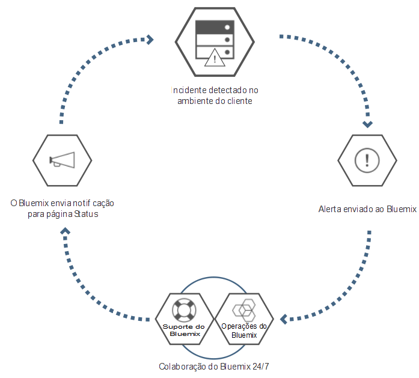

---

 

copyright:

  years: 2015, 2016

 

---

{:new_window: target="_blank"}
{:shortdesc: .shortdesc}

#{{site.data.keyword.Bluemix_notm}} Local
{: #local}
*Última atualização: 16 de maio de 2016*

{{site.data.keyword.Bluemix}} Local traz a eficiência e agilidade da plataforma baseada em nuvem do {{site.data.keyword.Bluemix_notm}} para seu datacenter. Com o
{{site.data.keyword.Bluemix_notm}} Local, é possível proteger
suas cargas de trabalho mais sensíveis no firewall de sua empresa,
enquanto permanece estavelmente conectado e em sincronia
com o {{site.data.keyword.Bluemix_notm}} Public.
{:shortdesc}

A IBM® utiliza operações em nuvem como um serviço para
monitorar e manter seu ambiente, para que você possa se concentrar na construção de apps e serviços que são executados no topo do ambiente. A IBM também manipula atualizações de plataforma, para que você possa se concentrar nos negócios.

Os ambientes do {{site.data.keyword.Bluemix_notm}}
Local possuem os mesmos padrões de segurança do
{{site.data.keyword.Bluemix_notm}} público em termos de
segurança operacional. Você fornece o hardware e a infraestrutura,
que fornece controle sobre a segurança da infraestrutura e física. O
acesso do desenvolvedor ao {{site.data.keyword.Bluemix_notm}}
local é controlado por suas políticas LDAP, que podem ser
configuradas pela equipe do
{{site.data.keyword.Bluemix_notm}} quando seu ambiente foi
configurado. Dentro do ambiente local, usando a página Administração, é possível gerenciar funções e permissões do usuário.

O {{site.data.keyword.Bluemix_notm}} Local vem com
todos os tempos de execução do
{{site.data.keyword.Bluemix_notm}} incluídos e 64 GB de
memória de computação.

Além disso, há um conjunto de serviços que estão disponíveis como serviços do {{site.data.keyword.Bluemix_notm}} Local. Revise a tabela a seguir para ver o que está incluído e o que está disponível para compra.

*Tabela 1. Serviços e tempos de execução locais*

| **Tipo** | **Nome** | **Descrição** |
|----------|----------|-----------------|
|Incluído | Tempos de execução do {{site.data.keyword.Bluemix_notm}} | Use tempos de execução para colocar seu app funcionando rapidamente, sem necessidade de configurar e gerenciar as máquinas e os sistemas operacionais. Todos os tempos de execução do
{{site.data.keyword.Bluemix_notm}} estão disponíveis
para uso em sua instância do {{site.data.keyword.Bluemix_notm}} Local.|
|Opcional | {{site.data.keyword.APIM}} | Use o serviço {{site.data.keyword.APIMfull}} para compor, gerenciar e socializar APIs. É
possível importar APIs com recursos usando uma URL de proxy ou montando dados a partir de origens de dados HTTP. O
benefício do uso do serviço {{site.data.keyword.APIM}}
é que é possível gerenciar como suas APIs são usadas. |
|Incluído | {{site.data.keyword.autoscaling}}| Aumente ou diminua dinamicamente a capacidade de recursos de cálculo do aplicativo com base em políticas. Com esse serviço, você
tem uso ilimitado em seu ambiente do {{site.data.keyword.Bluemix}} Local.|
|Opcional | {{site.data.keyword.datacshort}} | Esse serviço fornece uma grade de dados da memória
que suporta cenários de armazenamento em cache distribuído para seus apps. Inclui
 50 GB de cache na memória. |
|Opcional | {{site.data.keyword.sescashort}} | Para maior redundância, o {{site.data.keyword.sescashort}} fornece uma réplica de uma sessão armazenada no cache. Portanto, no caso de uma indisponibilidade de energia, seu aplicativo cliente manterá acesso à sessão no cache. O serviço suporta cenários de armazenamento em cache de sessão para aplicativos móveis e da web. |
|Opcional | {{site.data.keyword.iot_full}} | Esse serviço permite que os apps se comuniquem e consumam dados que são coletados por seus dispositivos conectados, sensores e gateways. A oferta de base local inclui um ambiente inicial que permite executar uma versão privada do IBM {{site.data.keyword.iot_full}} dentro do ambiente local com uma capacidade de 100.000 dispositivos ou aplicativos conectados simultaneamente e 1,6 TB de troca de dados. |

Há componentes opcionais que estão disponíveis para você comprar para escalar e ampliar a capacidade de seus recursos e serviços. É possível comprar qualquer um desses componentes entrando em contato com a equipe de vendas; acesse [Contate-nos](https://console.ng.bluemix.net/?direct=classic/#/contactUs/cloudOEPaneId=contactUs) para obter informações sobre como contatar um representante de vendas. Para aumentar seu plano para um serviço, é possível selecionar o plano a partir do ladrilho do serviço em seu catálogo.

*Tabela 2. Componentes opcionais para compra*

| **Nome** | **Descrição** |
|----------|-----------------|
|Configuração única de acesso do {{site.data.keyword.Bluemix_notm}} Local | Um encargo de configuração única para implementar e configurar o ambiente local. |
|Aumento de capacidade de 16 GB de recursos de cálculo do {{site.data.keyword.Bluemix_notm}} Local | Uma extensão dos recursos de cálculo do IBM {{site.data.keyword.Bluemix_notm}} Local para fornecer um extra de 16 GB de capacidade de memória. |
|Aumento de capacidade de 50 GB de Dados e Sessão do {{site.data.keyword.Bluemix_notm}} | Um ambiente que permite implementar e executar as instâncias de Cache de Dados e Cache de Sessão até uma capacidade acumulativa de 50 GB. |
|Aumento de capacidade de 500 chamadas API do {{site.data.keyword.Bluemix_notm}} Local {{site.data.keyword.APIM}} | Um ambiente que permite executar uma versão privada do {{site.data.keyword.APIM}} for {{site.data.keyword.Bluemix_notm}} com uma capacidade de 500 chamadas API por segundo. |
|Aumento incremental do {{site.data.keyword.Bluemix_notm}} {{site.data.keyword.iot_short}} Local | Um ambiente adicional para a oferta de serviços de base do {{site.data.keyword.iot_full}} Local que permite executar uma versão privada do {{site.data.keyword.iot_full}} no ambiente local com uma capacidade de 100.000 dispositivos ou aplicativos conectados simultaneamente e 0,5 TB de troca de dados. |

**Nota**: Os componentes do {{site.data.keyword.Bluemix_notm}} Local podem indicar uma capacidade configurada específica, como gigabytes ou transações por segundo. Como a capacidade real na prática para qualquer configuração do serviço de nuvem varia dependendo de vários fatores, a capacidade real pode ser mais ou menos que a capacidade configurada.

### Catálogo organizado

O {{site.data.keyword.Bluemix_notm}} Local inclui um catálogo privado organizado que exibe os serviços locais que estão disponíveis exclusivamente para você. Ele também inclui serviços adicionais que são disponibilizadas para você para uso a partir do {{site.data.keyword.Bluemix_notm}} Public.

O catálogo organizado fornece a função para criar aplicativos híbridos que consistem em serviços públicos e privados. Você tem a opção de decidir quais serviços públicos atendem aos requisitos para seus negócios com base em sua privacidade de dados e critérios de segurança. Se
for uma instância privada do serviço para o seu ambiente local, você verá uma identificação "Local" com os ladrilhos de serviço em seu catálogo. Da mesma forma, se for um serviço customizado, você verá
"Customizado" listado com o ladrilho do serviço. 

*Tabela 3. Serviços disponíveis para organização a partir do {{site.data.keyword.Bluemix_notm}} Public por região*

|Serviço	|Disponível na região sul dos EUA	|Disponível na região do Reino Unido na Europa |Disponível na região de Sydney, na Austrália|
|:----------|:------------------------------|:------------------|:------------------|
|{{site.data.keyword.alchemyapishort}} 		|Sim	   	|Sim  		|Sim|
|{{site.data.keyword.alertnotificationshort}}		|Sim		|Sim			|Sim		|
|{{site.data.keyword.appseccloudshort}}		|Sim		|Sim		|Sim |
|{{site.data.keyword.hadoopst}}			|Sim		|Não		|Não |
|{{site.data.keyword.APIM}}			|Sim		|Sim		|Sim |
|{{site.data.keyword.rules_short}}		|Sim		|Sim		|Sim |
|{{site.data.keyword.cloudant}}			|Sim		|Sim		|Sim |
|{{site.data.keyword.conceptexpansionshort}}	|Sim		|Sim		|Sim|
|{{site.data.keyword.conceptinsightsshort}}	|Sim		|Sim		|Sim |
|{{site.data.keyword.dashdbshort}}		|Sim		|Sim		|Sim |
|{{site.data.keyword.dataworks_short}}		|Sim		|Sim		|Não|
|{{site.data.keyword.DB2OnCloud_short}}		|Sim		|Sim		|Sim |
|{{site.data.keyword.dialogshort}}		|Sim		|Sim		|Sim|
|{{site.data.keyword.documentconversionshort}}	|Sim		|Sim		|Sim|
|{{site.data.keyword.game}}			|Não		|Não		|Sim |
|{{site.data.keyword.geospatialshort_Geospatial}}	|Sim	|Sim		|Sim |
|{{site.data.keyword.GlobalizationPipeline_short}}	|Sim		| Sim		| Sim |
|{{site.data.keyword.identitymixershort}}		|Sim		|Sim		|Sim|
|{{site.data.keyword.twittershort}}		|Sim		|Sim		|Sim|
|{{site.data.keyword.weather_short}}		|Sim		|Sim		|Sim|
|{{site.data.keyword.languagetranslationshort}}	|Sim		|Sim		|Sim |
|{{site.data.keyword.eventhubshort}}		|Sim		|Não		|Não|
|{{site.data.keyword.messagehub}}		|Sim		|Sim		|Não|
|{{site.data.keyword.macm_short}}		|Sim		|Sim		|Sim|
|{{site.data.keyword.manda}}			|Sim		|Sim		|Sim |
|{{site.data.keyword.amashort}}			|Sim		|Sim		|Sim |
|{{site.data.keyword.mqa}}			|Sim		|Sim		|Sim |
|{{site.data.keyword.mql}}			|Sim		|Sim		|Sim |
|{{site.data.keyword.nlclassifierlshort}} 	|Sim 		|Sim 		|Sim|
|{{site.data.keyword.personalityinsightsshort}}	|Sim		|Sim		|Sim|
|{{site.data.keyword.pm_short}}			|Sim		|Sim		|Não |
|{{site.data.keyword.presenceinsightsshort}}	|Sim		|Sim		|Sim|
|{{site.data.keyword.mobilepush}}		|Sim		|Sim		|Sim |
|{{site.data.keyword.questionandanswershort}}	|Sim		|Sim		|Sim|
|{{site.data.keyword.relationshipextractionshort}}	|Sim	|Sim		|Sim|
|{{site.data.keyword.retrieveandrankshort}}	|Sim 		|Sim 		|Sim|
|{{site.data.keyword.runbook_short}}		|Sim		|Sim		|Sim|
|{{site.data.keyword.SecureGateway}}		|Sim		|Sim		|Sim |
|{{site.data.keyword.ssofull}}			|Sim		|Não		|Não|
|{{site.data.keyword.speechtotextshort}}	|Sim 		|Sim	 	|Sim|
|{{site.data.keyword.streaminganalyticsshort}}	|Sim		|Sim		|Sim |
|{{site.data.keyword.texttospeechshort}} 	|Sim 		|Sim	 	|Sim|
|{{site.data.keyword.toneanalyzershort}} 	|Sim 		|Sim 		|Sim|
|{{site.data.keyword.tradeoffanalyticsshort}}	|Sim		|Sim		|Sim|
|{{site.data.keyword.visualinsightsshort}}	|Sim		|Sim		|Sim|
|{{site.data.keyword.visualrecognitionshort}}	|Sim 		|Sim	 	|Sim|
|{{site.data.keyword.iot_short}}		|Sim		|Sim		|Não|
|{{site.data.keyword.workflow}}			|Sim		|Sim		|Sim |
|{{site.data.keyword.workloadscheduler}}	|Sim		|Sim		|Sim |

## Arquitetura do {{site.data.keyword.Bluemix_notm}} Local
{: #localarch}

O {{site.data.keyword.Bluemix_notm}} Local fica em uma máquina virtual que está atrás do firewall de sua empresa, fornecendo o maior desempenho e a infraestrutura de nuvem mais segura para você. A IBM instala, monitora remotamente e gerencia o {{site.data.keyword.Bluemix_notm}} Local em seu datacenter por meio da tecnologia de Retransmissão da IBM. Revise o diagrama a seguir para obter informações sobre como o {{site.data.keyword.Bluemix_notm}} está configurado em seu ambiente local e como a IBM mantém sua instância local:

*Figura 1.
Arquitetura do {{site.data.keyword.Bluemix_notm}} Local*

A máquina virtual de concepção é executada por trás do firewall do cliente em uma rede que possui conectividade de saída com o centro de operações da IBM por meio de Retransmissão. Os componentes da plataforma do {{site.data.keyword.Bluemix_notm}} e os recursos principais que suportam os componentes da plataforma são executados em uma rede local virtual (VLAN) privada e isolada. O {{site.data.keyword.Bluemix_notm}} Local usa uma VLAN para a sub-rede privada. O uso de uma sub-rede privada em vez de uma VLAN pública é mais seguro e pode ajudar a evitar problemas de roteamento. O conjunto de recursos principais que suportam a plataforma inclui o seguinte:

<dl>
<dt>**Monitoramento e criação de log**</dt>
<dd>Os recursos de monitoramento e criação de log são implementados
em seus datacenters por meio de Retransmissão e os dados permanecem em seu datacenter. os alertas são enviados de volta às operações da IBM com base nos critérios de alerta definidos. Nenhuma informação confidencial é incluída nos alertas que são enviados de volta à IBM.</dd>
<dt>**Rede**</dt>
<dd>Retransmissão é a rede de entrega incluída com o {{site.data.keyword.Bluemix_notm}} Local. A Retransmissão permite que a IBM forneça automática e consistentemente as atualizações mais recentes para todas as implementações locais, para que você sempre tenha um sistema atualizado e seguro. O tráfego nesse túnel é a atividade automatizada para serviço e manutenção da plataforma, recursos de cálculo e serviços para sua instância. O tráfego inclui a capacidade de monitoramento que é usada por operações da IBM para concluir determinação de problemas para sua instância local. Para obter mais informações sobre Retransmissão, consulte [Retransmissão](index.html#localrelay).</dd>
<dt>**Cálculo**</dt>
<dd>O {{site.data.keyword.Bluemix_notm}} Local usa ambientes de tempo de execução centrados no app com base no Cloud Foundry.</dd>
<dt>**Inteligência de segurança**</dt>
<dd>
A IBM usa a QRadar Security Intelligence Platform para fornecer uma arquitetura unificada para integrar diversos componentes chave. Esses componentes incluem gerenciamento de informações e eventos de segurança, gerenciamento de log, detecção de anomalias, perícia de incidentes e gerenciamento de configuração vulnerabilidade. O
Bluemix também usa o IBM QRadar Security Information and Event Management (SIEM) para monitorar ações de usuários privilegiados e tentativas de login bem e mal sucedidas de desenvolvedores de aplicativos. Os relatórios do QRadar fornecem ao cliente visibilidade para esses dados de eventos por meio da seção Relatórios e logs da página Administração. Para obter informações sobre relatórios de segurança, consulte [Visualizando relatórios](../admin/index.html#oc_report).

O IBM BigFix assegura que as correções para sistemas operacionais sejam aplicadas em frequências apropriadas. O processo de correção é automatizado e o planejamento é acordado entre o Cliente e a IBM. Para obter informações sobre manutenção e upgrades, consulte [Mantendo sua instância local](index.html#maintainlocal).

</dd>
</dl>

Seus apps são implementados dentro de contêineres virtuais que são executados em máquinas virtuais do Cloud Foundry. Todos os componentes do Cloud Foundry, como controladores de nuvem, gerenciadores de funcionamento, roteadores e Droplet Execution Agents (DEAs) são implementados quando o {{site.data.keyword.Bluemix_notm}} for configurado. Os vários componente de gerenciamento do {{site.data.keyword.Bluemix_notm}} também são incluídos na implementação do {{site.data.keyword.Bluemix_notm}}.

Os dispositivos do DataPower fornecem acesso aos domínios de aplicativos {{site.data.keyword.Bluemix_notm}}. Esses dispositivos conectam à rede que é acessível a partir de sua intranet. Seus usuários que estão implementando apps e serviços obtêm acesso a partir da rede que está acessível a partir de sua intranet. Deve-se fornecer sete endereços IP que tenham acesso à Internet de saída. Os dispositivos do DataPower são roteados a partir desses endereços IP do cliente para a implementação isolada do {{site.data.keyword.Bluemix_notm}}. Para obter informações sobre as especificações de rede e os requisitos de infraestrutura, veja [Requisitos de infraestrutura do {{site.data.keyword.Bluemix_notm}} Local](../local/index.html#localinfra).

### Retransmitir
{: #localrelay}

Retransmissão é um recurso de entrega que está incluído com o {{site.data.keyword.Bluemix_notm}} Local. A Retransmissão permite que a IBM forneça automática e consistentemente as atualizações mais recentes para todas as implementações locais, para que você sempre tenha um sistema atualizado e seguro. A retransmissão obtém conectividade segura por meio de um túnel VPN aberto, com SSL de saída, que se origina da máquina virtual de concepção local usando certificados que são específicos de cada instância do {{site.data.keyword.Bluemix_notm}} Local. Todas as liberações iniciais do {{site.data.keyword.Bluemix_notm}} estão disponíveis na máquina virtual de concepção, que também age como uma máquina do agente de automação para implementações e atualizações. A conexão SSL origina-se da máquina virtual de concepção.  Após uma conexão segura ser estabelecida de volta com o servidor de automação do {{site.data.keyword.Bluemix_notm}}, a IBM verifica a atualidade e a consistência das liberações do {{site.data.keyword.Bluemix_notm}} e inicia a implementação de atualizações.

O tráfego nesse túnel é a atividade automatizada para serviço e manutenção da plataforma, recursos de cálculo e serviços para sua instância. O tráfego inclui a capacidade de monitoramento que é usada por operações da IBM para concluir determinação de problemas para sua instância local. A porta da web de saída 443 é usada para essa conexão. A IBM usa o recurso de Retransmissão para entregar atualizações de plataforma por meio de teste e validação consistentes. Esse processo assegura que todas as implementações enviadas por push para seus ambientes locais sejam estáveis e seguras.

Apenas a equipe da IBM que está trabalhando com você em seu ambiente local pode acessar com segurança sua instância do {{site.data.keyword.Bluemix_notm}}. O acesso a seu ambiente local é protegido usando a autenticação com dois fatores durante várias etapas no processo de conexão. A IBM fornece uma lista dos usuários e IDs aprovados que podem acessar seu ambiente e, em seguida, será possível auditar qualquer acesso a seu ambiente. Ao gerar um relatório de segurança, será possível descobrir quem acessou seu ambiente e quando e por que foi acessado. Para obter informações sobre a geração de relatórios de segurança, consulte [Relatórios de segurança](../security/index.html#reports).

O ambiente está completamente visível para você, como administrador, para gerenciamento de incidente, problema, mudança, capacidade e segurança. É possível acessar as informações sobre seu ambiente usando a página Administração. A tecnologia de Retransmissão mantém a página Administração atualizada com os dados mais recentes. Para obter mais informações sobre acesso de usuário, logs de segurança, controle de catálogo organizado e comunicação para atualizações e reparo do problema, consulte [Gerenciando o {{site.data.keyword.Bluemix_notm}} Local e o {{site.data.keyword.Bluemix_notm}} Dedicated](../admin/index.html#mng).

##Configurando a instância do {{site.data.keyword.Bluemix_notm}} Local
{: #setuplocal}

O {{site.data.keyword.Bluemix_notm}} Local foi projetado para fornecer uma versão privada da oferta do {{site.data.keyword.Bluemix_notm}} Public que está hospedada em seu próprio hardware, gerenciada por você. É possível usar serviços e tempos de execução do {{site.data.keyword.Bluemix_notm}} para suportar suas necessidades de computação em um ambiente em nuvem seguro, hospedado pelo cliente e gerenciado.

A IBM fornece acesso ao {{site.data.keyword.Bluemix_notm}} Local usando um login protegido por senha. É possível acessar os serviços, os tempos de execução e os recursos associados e implementar e remover apps do {{site.data.keyword.Bluemix_notm}}. Revise as etapas a seguir para trabalhar com seu representante IBM para configurar sua instância local do {{site.data.keyword.Bluemix_notm}}.

Para configurar sua versão privada do {{site.data.keyword.Bluemix_notm}}:

<ol>
<li>Revise os
<a href="index.html#localinfra">requisitos
da infraestrutura do {{site.data.keyword.Bluemix_notm}}
Local</a> para configurar sua instância local.</li>
<li>Entre em contato com o representante de conta da IBM ou entre em
contato com o
<a href="https://console.ng.bluemix.net/?direct=classic/#/contactUs/cloudOEPaneId=contactUs" target="_blank">{{site.data.keyword.Bluemix_notm}}</a>
para começar.</li>
<li>Estabeleça seu contrato do {{site.data.keyword.Bluemix_notm}}
Local com a IBM que inclui datas do acontecimento para entrega.
	<ol type="a">
	<li>Trabalhe com a IBM com relação à taxa para sua instância do
{{site.data.keyword.Bluemix_notm}} Local. A taxa de
recorrência mensal baseia-se nos serviços locais que você deseja
usar, mais uma assinatura para todos os
serviços públicos do {{site.data.keyword.Bluemix_notm}}. Em seguida, você receberá uma fatura para tudo o que usar além
desse contrato de assinatura.</li>
	<li>Identifique os prazos finais de cada fase de configuração da
instância do {{site.data.keyword.Bluemix_notm}} Local.</li>
	</ol>
	</li>
<li>Depois que sua plataforma e conta forem criadas,
identifique as pessoas em sua organização para as funções
que são necessárias para que sua instância local esteja ativa e
executando. Para obter mais informações sobre as funções designadas, consulte <a href="index.html#rolesresponsibilities" target="_blank">Funções e responsabilidades do {{site.data.keyword.Bluemix_notm}} Local</a>.
</li>
<li>Você fornece o hardware e a IBM ajuda a definir e estabelecer
conectividade de rede entre a rede corporativa e a
instância do {{site.data.keyword.Bluemix_notm}} Local. Para
obter mais informações sobre os requisitos de infraestrutura,
consulte
<a href="index.html#localinfra">requisitos de
infraestrutura do {{site.data.keyword.Bluemix_notm}}
Local</a>.
	<ol type="a">
	<li>A IBM configura o acesso à rede e LDAP baseado no que foi
fornecido. É fornecido
acesso administrativo aos contatos designados. Deve-se também
designar um contato para suporte e faturamento.</li>
	<li>A IBM configura um catálogo organizado em seu ambiente local
para mostrar os serviços locais e vários dos serviços públicos do
{{site.data.keyword.Bluemix_notm}}.</li>
	<li>Você valida a configuração de rede e de firewall,
do terminal LDAP, e acessa.</li>
	</ol>
</li>
</ol>

É possível esperar um processo semelhante à lista a seguir para a implementação e configuração iniciais do seu ambiente. Para obter detalhes sobre quem é responsável por cada uma das tarefas, veja [Funções e responsabilidades](../local/index.html#rolesresponsibilities).

<ol>
<li>Forneça a configuração do VMware que atenda às especificações para recursos de cálculo, configuração de redes e armazenamento. Para obter mais informações sobre os requisitos de infraestrutura, veja <a href="../local/index.html#localinfra">Requisitos de infraestrutura do {{site.data.keyword.Bluemix_notm}} Local</a>.</li>
<li>Forneça as credenciais do cluster do vCenter a serem usadas pela máquina virtual de concepção. Você deve fornecer as seguintes
informações:
<ul>
<li>Nome do cluster do VMware</li>
<li>Credenciais do cluster do vCenter, incluindo o ID do usuário e a senha</li>
<li>Nome ou nomes do armazenamento de dados (nome do LUN de armazenamento)</li>
<li>ID da VLAN/grupo de portas do VMware</li>
<li>Nome do conjunto de recursos</li>
</ul>
</li>
<li>Você e a IBM trabalham juntos para validar as credenciais fornecidas na tarefa anterior.</li>
<li>Forneça 7 endereços IP em sua rede. Se houver um proxy da web seguro que permita acesso de saída para a Internet para componentes internos do {{site.data.keyword.Bluemix_notm}}, então deve-se fornecer as credenciais para conectar a ele.

**Nota**: se o seu proxy da web não for seguro, então não será necessário fornecer as credenciais. Além disso, observe que nem todos os clientes do {{site.data.keyword.Bluemix_notm}} Local usam um proxy da web.
</li>
<li>A IBM fornece uma lista de desbloqueio de URLs à qual você deve ser permitido por meio do proxy da web antes de iniciar a implementação. 

**Nota**: A lista de desbloqueio de URLs contém websites como twitter.com, facebook.com e youtube.com. Se essas URLs não forem permitidas, determinados serviços e áreas do {{site.data.keyword.Bluemix_notm}} poderão não estar disponíveis para uso.

</li>
<li>Especifique os nomes de domínio para a implementação e os IDs que deseja usar. Você obtém dois domínios definidos parcialmente ao configurar sua instância local e selecione o prefixo para os dois domínios. Por exemplo, selecione o prefixo para <code>*mycompany*.bluemix.net</code> e <code>*mycompany*.mybluemix.net</code>. E, em seguida, também é possível escolher o domínio completo para criar um domínio customizado.

É possível escolher quantos domínios customizados desejar. No entanto, você é responsável pelos certificados dos domínios customizados. Para obter informações sobre como criar seu domínio customizado, veja <a href="../manageapps/updapps.html#domain">Criando e usando um domínio customizado</a>.
</li>
<li>Escolha qual tecnologia, túnel IPSec ou OpenVPN, usar para configurar a Retransmissão para conectar novamente ao centro de operações IBM.</li>
<li>A IBM instala e inicia a máquina virtual de concepção dentro do cluster do {{site.data.keyword.Bluemix_notm}}. Se você fornecer seu próprio VMware, então um representante IBM ajudará seu representante do cliente a concluir esta tarefa.</li>
<li>A IBM configura a Retransmissão para comunicar novamente com o centro de operações IBM.</li>
<li>O repositório de máquina virtual de concepção puxa os artefatos de construção atualizados.</li>
<li>Forneça as credenciais para que a IBM conecte à instância do diretório LDAP corporativo.</li>
<li>A IBM usa a automação para implementar a plataforma principal do {{site.data.keyword.Bluemix_notm}}.</li>
<li>A IBM implementa a plataforma principal que inclui os tempos de execução elásticos, o console, o recurso de administração e o monitoramento.</li>
<li>A IBM configura o acesso administrativo para o ambiente.</li>
<li>A IBM vincula seu catálogo organizado a partir de sua implementação local a uma instância pública do {{site.data.keyword.Bluemix_notm}} para uso de serviços públicos. Um conjunto de serviços públicos está disponível em sua instância local por padrão. É possível usar a página de administração para gerenciamento de catálogos para ativar ou desativar os serviços para sua instância local.</li>
<li>É possível começar a usar sua instância local que é monitorada pela equipe de operações da IBM para responder aos alertas.</li>
</ol>

Depois que a instância do {{site.data.keyword.Bluemix_notm}} estiver configurada, será possível monitorar e gerenciar sua instância do {{site.data.keyword.Bluemix_notm}} usando a página Administração. Para
obter mais informações, consulte
[Gerenciando o {{site.data.keyword.Bluemix_notm}} Local e Dedicated](../admin/index.html#mng). Para obter informações sobre upgrades e manutenção, veja [Mantendo sua instância local](index.html#maintainlocal).

##Funções e Responsabilidades
{: #rolesresponsibilities}

Se você configurar uma conta do {{site.data.keyword.Bluemix_notm}} Local, identificará as pessoas em sua organização para as funções necessárias para que sua instância funcione.

###Funções

A lista a seguir mostra as funções e as responsabilidades designadas ao cliente:

<dl>
<dt>**Focal em compras**</dt>
<dd>Trabalha com o representante IBM no estabelecimento de seu
ambiente do {{site.data.keyword.Bluemix_notm}} Local,
incluindo a identificação da pessoa certa em sua organização para
trabalhar em qualquer aspecto do projeto. A pessoa designada a essa função supervisiona a seleção padrão, acordos comerciais e a disposição de acesso aos recursos do cliente. O
focal em compras é o contato geral para configurar a instância local.</dd>
<dt>**Executivo de conformidade**</dt>
<dd>Trabalha com o representante IBM para selecionar uma opção de topologia e de implementação que atenda aos requisitos de segurança. A pessoa designada a essa função trabalha com o consultor de conformidade IBM para determinar quais padrões de implementação alcançam os objetivos de conformidade.</dd>
<dt>**Especialista em rede**</dt>
<dd>Trabalha com o representante IBM nos planos de rede para a
implementação do {{site.data.keyword.Bluemix_notm}}. A pessoa designada a essa função revisa as especificações de rede necessárias para a IBM e trabalha junto com a IBM em um plano de implementação. No término da fase de instalação e verificação, a pessoa designada a essa função aprovará que a configuração de rede está em conformidade com os padrões corporativos.</dd>
<dt>**DevOps focal**</dt>
<dd>Trabalha com o representante IBM para planejar e aplicar as
atualizações de manutenção que são necessárias para a plataforma,
serviços e tempos de execução do
{{site.data.keyword.Bluemix_notm}}. A pessoa designada a essa função também trabalha com o representante IBM na configuração da instância do {{site.data.keyword.Bluemix_notm}} Local.</dd>
<dt>**Especialista em IaaS**</dt>
<dd>Trabalha com os representantes IBM no plano de implementação do VMware. Geralmente, é alguém que é um administrador do VMware no datacenter. A pessoa designada a essa função revisa os <a href="../local/index.html#localinfra">requisitos de infraestrutura do {{site.data.keyword.Bluemix_notm}} Local</a> e trabalha junto com a IBM em um plano de implementação. No término da implementação, a pessoa designada a essa função aprovará que a implementação está em conformidade com os padrões corporativos na camada IaaS.</dd>
</dl>

Seus representantes de serviços trabalham com especialistas IBM, que trabalham juntos para assegurar que você sempre tenha o suporte necessário. É possível fazer upgrade para a camada de suporte
Premium, para trabalhar com um Client Success Manager (CSM) dedicado para a sua conta. Para obter mais informações sobre as camadas de suporte diferentes, consulte
[Entrando em contato com o suporte](../support/index.html#contacting-support). O CSM conclui os tipos de tarefas a seguir:

<ul>
<li>Fornece coordenação técnica entre você e a IBM.</li>
<li>Coordena atualizações, upgrades, ajuda de especialistas da IBM, além de ativação inicial de um engenheiro de suporte do {{site.data.keyword.Bluemix_notm}}.</li>
<li>Fornece informações sobre os tipos de suporte que estão disponíveis.</li>
<li>Agirá como um ponto de escalada inicial, se necessário.</li>
</ul>

O suporte e a equipe de operações do {{site.data.keyword.Bluemix_notm}} que trabalham com você em sua instância do {{site.data.keyword.Bluemix_notm}} podem acessar seu ambiente local, mas faz isso apenas pelos motivos a seguir.

<ul>
<li>Para responder a alertas e executar manutenção operacional</li>
<li>Para tentar reproduzir um problema relatado em um chamado de suporte</li>
</ul>

###Responsabilidades

Da configuração de seu ambiente até a manutenção contínua, você e a IBM devem concluir uma variedade de tarefas. As tabelas a seguir descrevem as tarefas necessárias e os proprietários para concluir a tarefa durante as fases de concepção, progressão e conclusão.

A fase de concepção é usada para estabelecer o ambiente do {{site.data.keyword.Bluemix_notm}} Local. Neste momento, você já revisou os [Requisitos de infraestrutura local](../local/index.html#localinfra). Os objetivos principais dessa fase incluem os itens a seguir:

- Revisar o contrato financeiro e estabelecer as datas do acontecimento para entrega.
- Criar a plataforma {{site.data.keyword.Bluemix_notm}} e fornecer acesso aos tempos de execução e serviços.
- Definir e estabelecer conectividade de rede entre a rede corporativa e as operações do {{site.data.keyword.Bluemix_notm}}.
- Identificar e designar funções para sua equipe administrativa.

*Tabela 4. Tarefas da fase de concepção*

| **Tarefa** | **Detalhes da tarefa** | **Parte responsável** |
|----------|------------------|-----------------------|
|Configurar padrões de conformidade | Identificar padrões corporativos do governo, da indústria e proprietários que são necessários para o ambiente. | Cliente |
|Criar plano de integração de segurança e conformidade | Criar plano de segurança e integração que inclui custos, planejamento e recursos que são necessários para atingir conformidade de segurança. | IBM |
|Aprovação do plano de conformidade | Aprovar o plano de conformidade. | Cliente |
|Criar dimensionamento para o ambiente |  	Criar dimensionamento de ambiente com base nas opções predefinidas que consideram a alta disponibilidade e os objetivos de recuperação de desastre, bem como o DEA inicial e o fornecimento de serviço que são necessários para suportar os apps criados com a plataforma. Você e a IBM trabalham juntos para definir, por exemplo, quais bancos de dados são necessários, quais serviços são oferecidos no catálogo organizado do cliente e muito mais. | A IBM e o cliente compartilham a responsabilidade |
|Selecionar arquitetura | Selecione a arquitetura com base nas opções predefinidas que consideram a alta disponibilidade e os requisitos de recuperação de desastre. | IBM |
|Definir objetivos de recuperação de desastre | Definir os requisitos de recuperação de desastre para o ambiente. | Cliente |
|Criar plano de recuperação de desastres | Consultar e definir o plano de recuperação de desastres. A IBM cria um modelo de recuperação de desastre e consulta você sobre fornecimento de feedback e aprovação do plano. | A IBM e o cliente compartilham a responsabilidade |
|Criar plano de backup e recuperação | Criar um plano de backup e recuperação que defina a frequência e os requisitos para distribuição ocasional do backup pelo site. A IBM faz backup de componentes da plataforma, serviços IBM, metadados de serviços, incluindo funções de usuários e muito mais. Você faz backup de todos os dados específicos do aplicativo pelos quais é responsável. | A IBM e o cliente compartilham a responsabilidade |
|Identificar ferramentas para detecção de eventos e determinação de problemas | Identificar ferramentas da IBM e de terceiros usadas para detecção de eventos e determinação de problemas no nível da plataforma {{site.data.keyword.Bluemix_notm}}. | IBM |
|Definir plano de escalada | Definir o plano de escalada para fazer triagem e resolver eventos detectados a partir dos componentes de monitoramento. | IBM |
|Assinar contratos de infraestrutura, de plataforma e de suporte | Assinar o contrato de assinatura, incluindo os termos financeiros e as condições para o ambiente. Assine a assinatura de suporte. | Cliente |
|Comprar ambiente | Comprar recursos de cálculo, de rede e de armazenamento. Para obter mais informações sobre os requisitos de infraestrutura para o ambiente, consulte [Requisitos de infraestrutura local](../local/index.html#localinfra). | Cliente |
|Instalar solução de VPN | Instalar solução de VPN bidirecional. | IBM |
|Instalar componentes de plataforma, de aplicativo e de monitoramento e gerenciamento | Instale, configure e verifique componentes da plataforma, como BOSH Director, Cloud Controller, Health Manager, sistema de mensagens, roteadores, DEAs e provedores de serviço, além dos componentes de monitoramento definidos no plano de escalada e de detecção de problema. | IBM |
|Instalar e configurar componentes de segurança | Instalar e configurar componentes de segurança que são ligados ao plano de monitoramento e escalada, incluindo IBM QRadar, área segura de credenciais, sistema de prevenção de intrusão, IBM BigFix e IBM Security Privileged Identity Management. | IBM |
|Configurar servidor de login | Configurar o servidor de login para uso com o LDAP corporativo. | IBM |
|Instalar e configurar componentes customizados |  	Instalar e configurar componentes customizados que residem fora do escopo do produto e serviços {{site.data.keyword.Bluemix_notm}}. | Cliente |
|Conectar pipeline do {{site.data.keyword.Bluemix_notm}} | Conectar pipeline de integração contínua e de entrega contínua do {{site.data.keyword.Bluemix_notm}} com repositórios da IBM. | IBM |
|Customizar componentes de solução externa | Customizar balanceadores de carga para cenários de recuperação de desastre. | Cliente |
|Rastrear status para controles de segurança, de conformidade e de auditoria  | Rastrear status até o ponto em que todas as ferramentas e processos estiverem adequados para atingir a conformidade identificada. | Cliente |
|Revisar a infraestrutura física | Revisar instalações físicas que hospedam os componentes da solução para ameaças e revisão de controles de segurança para proteger o datacenter. | Cliente |
|Inspecionar software de monitoramento | Inspecionar componentes de monitoramento e gerenciamento, conforme definido no plano de escalada e de determinação de problema. | Cliente |
|Inspecionar sistema operacional | Inspecionar para assegurar-se de que a imagem do sistema operacional atenda aos padrões de conformidade. A IBM fornece acesso à imagem do sistema operacional. | A IBM e o cliente compartilham a responsabilidade |

A fase seguinte é a de progressão. A fase de progressão descreve o relacionamento colaborativo em andamento, entre você e a IBM. Os objetivos principais dessa fase incluem os itens a seguir:

- Revisar a capacidade e coordenar os ajustes necessários.
- Revisar as melhorias de manutenção e plataforma.
- Coordenar as atividades para resolução de problemas e análise de causa raiz.

*Tabela 5. Tarefas da fase de progressão*

| **Tarefa** | **Detalhes da tarefa** | **Parte responsável** |
|----------|------------------|-----------------------|
|Revisar relatórios de capacidade semanal | Revisar os relatórios de capacidade semanal e executar a ação corretiva, se necessário. | Cliente |
|Criar projeções mês a mês | Coletar informações e criar uma projeção mês a mês da capacidade e do consumo. | A IBM e o cliente compartilham a responsabilidade |
|Revisar projeções de capacidade | Revisar as projeções de capacidade, visto que estão relacionadas a eventos externos que podem causar impacto na capacidade, bem como novas implementações previstas de apps. Trabalhe com a IBM para revisar as projeções e planejar adequadamente. | A IBM e o cliente compartilham a responsabilidade |
|Ajustar a capacidade |  Incluir ou remover capacidade conforme suas necessidades mudarem. | IBM |
|Publicar atualizações e manutenção futuras | Criar documentação para a manutenção necessária de componentes da IBM. | IBM |
|Executar manutenção | Trabalhe com a IBM para planejar a manutenção necessária dentro de uma janela de 21 dias. É possível fornecer datas que podem não funcionar para você na janela de 21 dias e a IBM
trabalha para planejar a manutenção adequadamente. | A IBM e o cliente compartilham a responsabilidade |
|Tratar de falhas de fornecimento | Corrigir falhas de fornecimento, se ocorrerem, para serviços criados pelo cliente que estejam implementados no Catálogo. | IBM |
|Executar varreduras de rede e de IP | Executar varreduras diárias e mensais de rede e de IP. | A IBM e o cliente compartilham a responsabilidade |
|Fornecer acesso aos logs de auditoria | Fornecer acesso a todos os logs de auditoria de segurança e administrativos.   | A IBM e o cliente compartilham a responsabilidade |
|Conduzir teste | Conduzir teste periódico de Controles de chave sobre operações e teste de penetração de terceiros. | A IBM e o cliente compartilham a responsabilidade |
|Relato de status, coordenação de auditoria e reuniões de conformidade  | Concluir relato de status, coordenação de auditoria externa e representação em reuniões de status de revisão de conformidade. | IBM |
|Verificação de emprego e de necessidade de negócios | Verificação completa do emprego trimestralmente e verificação da necessidade contínua de negócios para representantes IBM que possuem acesso ao ambiente do cliente. | IBM |
|Resolução de vulnerabilidades de segurança | Resolver vulnerabilidades de segurança relatadas na plataforma. | IBM |

O estágio final da conclusão representa o término do relacionamento entre você e a IBM {{site.data.keyword.Bluemix_notm}}. As tarefas principais dessa fase incluem os itens a seguir:

* Término do contrato financeiro
* Remoção de todas as conexões de rede
* Infraestrutura de reciclagem

*Tabela 6. Tarefas da fase de conclusão*

| **Tarefa** | **Detalhes da tarefa** | **Parte responsável** |
|----------|------------------|-----------------------|
|Terminar o contrato financeiro | Discutir e concordar com um término para o contrato financeiro. | A IBM e o cliente compartilham a responsabilidade |
|Ambiente de desatribuição | Encerrar o acesso e as credenciais para o ambiente. | A IBM e o cliente compartilham a responsabilidade |
|Encerrar a retransmissão | Finalizar a conexão de retransmissão. | IBM |
|Reciclar a infraestrutura | Reciclar sua infraestrutura de acordo com as diretrizes da empresa. | Cliente |

## Requisitos da infraestrutura local do {{site.data.keyword.Bluemix_notm}}
{: #localinfra}

Para {{site.data.keyword.Bluemix_notm}} Local, você possui a segurança física e a infraestrutura para hospedar a instância local. A IBM configura os requisitos mínimos a seguir para configurar o {{site.data.keyword.Bluemix_notm}} Local.

### Hardware

Embora existam requisitos para o tipo e o tamanho do hardware disponível, é possível escolher qualquer combinação
para atender os requisitos totais do recurso.

<dl>
<dt>**Hardware do VMware ESXi**</dt>
<dd>
ESXi é uma camada de virtualização que é executada em servidores físicos e que abstrai o processador,
a memória, o armazenamento e os recursos em múltiplas máquinas virtuais. Escolha qualquer combinação que atenda aos
totais de recurso a seguir, sob a condição de que a contagem núcleo física mínima por ESXi é oito. As
seguintes especificações são apenas para o tempo de execução
principal do {{site.data.keyword.Bluemix_notm}}.
<ul>
<li>48 núcleos físicos a 2.0 GHz ou mais cada</li>
<li>756 GB de RAM física</li>
<li>Tamanho total de armazenamento de dados de 7.5 TB
<ul>
<li>Armazenamento de dados de 7 TB para manter
{{site.data.keyword.Bluemix_notm}}</li>
<li>500 GB de armazenamento de dados para suspender a máquina virtual de concepção</li>
</ul>
</li>
</ul>

<strong>Nota:</strong> Se você usar diversos armazenamentos de
dados, use o mesmo prefixo para cada um.

</dd>
<dt>**Alta disponibilidade**</dt>
<dd>
Para suportar uma única falha de nó, deve-se ter n+1 ESXi. Por exemplo, se três ESXis forem usados, significando 16x núcleos cada, então, um quarto será necessário.

<strong>Nota:</strong> O administrador VMware do cliente pode decidir impingir o failover de alta disponibilidade rigorosa no cluster para garantir os recursos.

</dd>
<dt>**Rede**</dt>
<dd>
Os requisitos recomendados incluem um grupo de portas acessível ao cliente com sete endereços IP de rede do cliente que possuem acesso à Internet de saída na mesma sub-rede. Duas portas são usadas pela máquina virtual de concepção, três portas são endereços IP virtuais usados para os domínios e as duas finais são endereços IP públicos para os DataPowers. Em seguida, defina uma segunda VLAN privada somente entre os ESXis que estão sendo usados no {{site.data.keyword.Bluemix_notm}} Local. Essa VLAN é mostrada como um grupo da porta em VMware. O {{site.data.keyword.Bluemix_notm}} Local usa isso para sub-rede privada,
que é mais segura e pode ajudar a evitar problemas de roteamento. 

As portas a seguir são usadas:

<ul>
<li>Porta 443 para a conexão de Retransmissão

**Nota**: se você optar por usar um túnel IPSec em vez de um OpenVPN, então abra uma porta do cliente para essa conexão.
</li>
<li>Porta 389 ou SSL 636 para a conexão LDAP ou Active Directory</li>
</ul>

**Nota**: a IBM pode detectar se a conexão de rede for perdida. No caso de perda de conexão de rede, a IBM entra em contato com você e trabalha com seu especialista de rede para resolver o problema.

</dd>
<dt>**Uplinks de rede**</dt>
<dd>Use duas ou mais interfaces que variam de 1 a 10 Gbps, dependendo da carga de trabalho desejada para o sistema.</dd>
</dl>

### Configuração do servidor vCenter

Revise os requisitos a seguir de versão,
de datacenter, de conjunto de recursos e de armazenamento de dados.

<dl>
<dt>**Versões suportadas de VMware**</dt>
<dd>vCenter e ESXi 5.1, 5.5 e 6.0</dd>
<dt>**Tipos de VMware suportados**</dt>
<dd>vSphere Enterprise 
Enterprise vSphere plus, se você planeja usar os comutadores virtuais distribuídos</dd>
<dt>**Datacenter**</dt>
<dd>Crie um datacenter, se não existir um.</dd>
<dt>**Pasta do Datacenter**</dt>
<dd>Crie uma pasta de MV com o mesmo nome que o cluster, se não planeja conceder acesso de Administrador que seja propagado do datacenter.</dd>
<dt>**Cluster**</dt>
<dd>Crie um cluster especialmente para uso do {{site.data.keyword.Bluemix_notm}} Local. Um exemplo para o nome do cluster é
`bluemix`.</dd>
<dt>**Conjunto de recursos**</dt>
<dd>Crie um conjunto de recursos sob o cluster do {{site.data.keyword.Bluemix_notm}} Local. Um exemplo para o nome do conjunto de
recursos é `local`.</dd>
</dt>**Armazenamento de dados**</dt>
<dd>Requer 7.5 TB para a implementação inicial de
{{site.data.keyword.Bluemix_notm}}. 
 
**Nota**: Ao usar mais de um armazenamento de
dados, assegure-se de que cada um deles comece com o mesmo prefixo. Os exemplos de múltiplos nomes de
armazenamento de dados com o mesmo prefixo são `bluemix_datastore_01` e
`bluemix_datastore_02`.</dd>
<dt>**Rede**</dt>
<dd>Deve-se ter uma rede acessível para o cliente com capacidade de acesso à Internet de saída. A
VLAN hospeda a sub-rede privada em que os componentes do Bluemix Local
são executados. Todo o tráfego é roteado a partir da sub-rede privada para a sub-rede do cliente. Um IP de sub-rede do cliente é usado para todo o acesso ao Bluemix Local. Em seguida, é possível definir uma segunda VLAN privada entre somente os ESXis sendo usados para o Bluemix Local. Essa VLAN é mostrada como um grupo da porta em VMware. O Bluemix Local a usa para a sub-rede privada, que é mais segura e pode ajudar a evitar problemas de roteamento.

Se estiver usando comutadores vSphere distributed switches (vDS), crie uma pasta para conter os vDS e coloque os vDS dentro da pasta.

</dl>

### Largura da banda da rede para Retransmissão

O rendimento recomendado é 5 Mbps para cima e 5 Mbps
para baixo e é possível esperar um uso de dados mensal de 10 GB. A IBM estabelece janelas acordadas quando grandes pacotes configuráveis de dados forem entregues, que podem ser tão grandes quanto 4 GB.

### Permissões de VMware

Configure as funções e as permissões a seguir. A propagação é
configurada para cada permissão. Se a permissão for propagada, a permissão será aprovada na hierarquia de objeto. No
entanto, as permissões para um objeto-filho sempre substituem as permissões que são propagadas de um objeto pai.

<dl>
<dt>**vCenter Server
**</dt>
<dd>Configure a função como somente leitura e não propagada. 
 
**Nota**: Essa função é necessária para recuperar o status de
tarefa para operações de disco específicas.</dd>
<dt>**Datacenter**</dt>
<dd>Crie a função "{{site.data.keyword.Bluemix_notm}}" e conceda as permissões a seguir:
<ul>
<li>Para o **Armazenamento de dados**, configure **Operações de arquivo de nível baixo** e **Atualizar arquivos da máquina virtual**.</li>
<li>Para **vApp**, configure **Importar**.</li>
<li>Para o grupo **dvPort**, configure **Modificar**. Essa é para somente para uso de vDS.</li>
</ul>
**Nota**: Esta função é necessária para suportar
posts de arquivos para os armazenamentos de dados.</dd>
<dt>**Cluster**</dt>
<dd>Configure a função como administrador e propagado.</dd>
<dt>**Armazenamento de dados**</dt>
<dd>Configure o administrador de função e propagado para cada armazenamento de dados do {{site.data.keyword.Bluemix_notm}}.</dd>
<dt>**Rede**</dt>
<dd><ul>
<li>Para vSwitch, configure grupos de portas públicas e privadas com a função de administrador, não propagados.</li>
<li>Para a pasta pai de vDS, configure como somente leitura e propagada.</li>
<li>Para vDS, configure grupos de portas públicas e privadas com a função de administrador, não propagados.</li>
</ul>
</dd>
</dl>

### Aumentando o conjunto de Droplet Execution Agent (DEA)
Cada DEA é configurado com:
- 16 - 32 GB de RAM
- 2x - 4x vCPU
- 150 - 300 GB de armazenamento

Por exemplo, se o tamanho do host ESXi for 256 GB
de memória com 16x núcleos, então serão incluídos oito DEAs. Se o tamanho do host ESXi for 64 GB de memória com
8x núcleos, dois ESXis e quatro DEAs precisarão ser incluídos. É necessário um adicional de 1,5 TB de armazenamento
para cada um dos quatro DEAs. Esse exemplo é baseado em um DEA configurado com 32 GB de RAM, 4x vCPU e 300 GB de armazenamento.

## Mantendo sua instância local
{: #maintainlocal}

A IBM mantém e instala atualizações e correções nos tempos de execução e serviços do {{site.data.keyword.Bluemix_notm}}, conforme julga adequado. Os serviços podem não estar disponíveis durante
as janelas de manutenção. Além disso, a IBM trabalha com você para planejar atualizações de manutenção para a plataforma do {{site.data.keyword.Bluemix_notm}}.

Os tipos de manutenção a seguir são necessários para o {{site.data.keyword.Bluemix_notm}} Local:
<dl>
<dt>**Manutenção padrão para serviços**</dt>
<dd>Os serviços utilizam janelas de manutenção predefinidas padrão,
o que pode fazer com que os serviços fiquem indisponíveis. A IBM não requer aprovação do cliente para executar manutenção, mas tenta minimizar o impacto nos serviços do cliente. 
 
A IBM envia mensagens transmitidas detalhando as mudanças que estão planejadas para cada janela de manutenção, na página Status. 
 
**Importante**: alguns serviços podem não ficar disponíveis durante o período de manutenção.</dd>

<dt>**Manutenção padrão para a plataforma do {{site.data.keyword.Bluemix_notm}}**</dt>
<dd>As atualizações de manutenção são aplicadas com base na coordenação entre você e a IBM dentro de uma janela de 21 dias. Você fornece à IBM janelas de manutenção pré-aprovadas e datas ou horas específicas
que podem não funcionar para você e a IBM trabalha para planejar atualizações durante ou em torno das datas que você selecionou. 

Acesse **ADMINISTRAÇÃO > INFORMAÇÕES DO SISTEMA**, para visualizar atualizações de manutenção planejadas e pendentes. Para obter mais informações sobre como configurar as suas janelas
pré-aprovadas, as datas indisponíveis e visualizar ou aprovar atualizações de manutenção, consulte <a href="../admin/index.html#oc_schedulemaintenance">Atualizações de manutenção</a>
.</dd>
</dl>

**Importante**: A IBM se reserva o direito de interromper os serviços para aplicar manutenção emergencial, conforme necessário. A
IBM pode mudar os horários de manutenção planejados, mas o notifica sobre quaisquer mudanças, bem como quaisquer informações de manutenção emergencial.

Se houver um problema relatado após uma atualização de manutenção, você concordará com o Suporte do {{site.data.keyword.Bluemix_notm}} se for de seu melhor interesse permitir que a IBM
recupere a atualização. Em concordância, a IBM reverterá a atualização para restaurar o ambiente para o estado anterior.

## Resposta ao incidente e suporte
{: #incidentresponse}

### Problemas detectados pelo cliente

Se você identificar um problema que precisa de atenção do suporte e operações da IBM, será possível entrar em contato com o suporte usando alguns métodos diferentes. Para obter informações sobre como entrar em contato com o suporte, consulte [Contatando o suporte](../support/index.html#contacting-bluemix-support-local). Dependendo do problema, você, a IBM ou ambos trabalham juntos para corrigir o problema.

### Incidentes críticos detectados pela IBM

Os incidentes críticos são indisponibilidades de serviço urgentes e inesperadas e problemas de estabilidade que afetam seu ambiente ou seus usuários. Se a IBM detectar um incidente crítico em seu ambiente, você será notificado por uma notificação na página **Status**. Também é possível verificar a página Status para quaisquer problemas conhecidos da plataforma ou de seus serviços. Para obter mais informações sobre a página Status, veja [Visualizando o status](../admin/index.html#oc_status). 

Se deseja integrar suas notificações a um serviço da web que suporta o ganchos da web, consulte [Notificações e inscrições de eventos](../admin/index.html#oc_eventsubscription) para obter informações sobre como estender seus recursos de notificação.

*Figura 2. Processo de resposta de incidente*

Dependendo do problema, você, a IBM ou ambos trabalham juntos para corrigir o problema. Se você tiver uma pergunta sobre o incidente ou se precisar de um representante IBM para ajudá-lo a resolver o problema, será possível, então, abrir um chamado de suporte. Para obter informações sobre como entrar em contato com o suporte, consulte [Contatando o suporte](../support/index.html#contacting-bluemix-support-local).

**Nota**: chamados de suporte de gravidade 1 são monitorados 24 horas por dia, sete dias por semana. Outros chamados são processados a partir de domingo às 22h GMT até sábado às 0h GMT. Para obter mais informações sobre gravidade de chamados de suporte e trabalhar com suporte, consulte <a href="../support/index.html#contacting-bluemix-support-local">Contatando o suporte</a>.

## Recuperação de desastre
{: #dr}

A recuperação de desastre para o {{site.data.keyword.Bluemix_short}} Local pode ser configurada de forma semelhante à maneira que funciona quando você usa o
{{site.data.keyword.Bluemix_short}}
Public. O {{site.data.keyword.Bluemix_short}} Public fornece uma plataforma continuamente disponível para inovação com várias medidas à prova de falhas, a fim de assegurar que as suas organizações,
os seus espaços e aplicativos estejam sempre disponíveis. Implementar apps em várias regiões geográficas permite disponibilidade contínua que protege contra perda simultânea não planejada de vários componentes de hardware ou software, ou a perda de um datacenter inteiro, para que, mesmo no caso de um desastre natural em uma localização geográfica, as instâncias de app distribuídas do {{site.data.keyword.Bluemix_notm}} Public em localizações geográficas alternativas fiquem disponíveis.
{: shortdesc}

A recuperação de desastre do {{site.data.keyword.Bluemix_short}} Local torna-se possível por meio de disponibilidade contínua para seus apps, da alta disponibilidade inerente da plataforma e da capacidade de restaurar sua instância no caso de uma falha. Você é responsável por ativar a disponibilidade contínua de seus apps implementando em várias regiões. A alta disponibilidade é construída no nível de plataforma por meio de tecnologias incluídas no Cloud Foundry e de outros componentes. Além disso, é possível trabalhar junto com a IBM para assegurar que seus dados sejam corretamente submetidos a backup no caso de você precisar restaurar sua instância a qualquer momento.

### Ativando a disponibilidade contínua para o {{site.data.keyword.Bluemix_notm}} Local
{: #enabling}

Por padrão, o {{site.data.keyword.Bluemix_notm}} Public é implementado em várias localizações geográficas. No entanto, deve-se fazer o seguinte para ativar instâncias do {{site.data.keyword.Bluemix_notm}} Local distribuídas globalmente:

* Assegure-se de que os desenvolvedores estejam implementando apps em mais de uma região, por meio de um processo manual ou automatizado. As regiões selecionadas devem ter uma separação de mais de 200 km umas das outras para assegurar que um desastre natural não possa afetar ambas as localizações geográficas.
* Configure um balanceador de carga global, como Akamai ou Dyn, para apontar para apps em pelo menos duas regiões diferentes.

**Nota**: nem todos os serviços do {{site.data.keyword.Bluemix_notm}} suportam distribuição regional. Ao construir um app, para atingir a distribuição geográfica, deve-se também certificar-se de que os serviços usados por esse app tenham a sincronização de dados como um recurso-chave.

#### Implementando apps do {{site.data.keyword.Bluemix_notm}} Local em várias localizações geográficas
{: #deploying}

Para implementar em um segundo local ou em vários locais, deve-se seguir um processo semelhante ao usado para ativar sua localização geográfica primária:

1. Ative um novo ambiente local para hospedar instâncias adicionais de seus aplicativos. Para criar um novo ambiente, entre em contato com a equipe de vendas da IBM para iniciar o processo. Para obter mais informações sobre a configuração de uma instância local, consulte [Configurando o {{site.data.keyword.Bluemix_notm}} Local](../local/index.html#setuplocal). Deve-se efetuar login separadamente para acessar cada ambiente. Cada local físico dos ambientes hospedados deve ter uma separação mínima de 200 km do local original para assegurar disponibilidade.
2. Obtenha o nome de domínio exclusivo no qual seu novo app implementado será hospedado. Por exemplo, se seu domínio original for *mycompany.east.bluemix.net*, será possível criar um novo ambiente local com um novo domínio, como *mycompany.west.bluemix.net* e implementar no novo domínio.
3. Sempre que você implementar seu app original, implemente no novo local. Para obter mais informações sobre implementação, consulte [Fazendo upload de seu app](../starters/upload_app.html).

#### Ativando um balanceador de carga global para o {{site.data.keyword.Bluemix_notm}} Local
{: #glb}

Um balanceador de carga global não apenas assegura disponibilidade contínua e é necessário para recuperação de desastre, como também possui diversos benefícios adicionais:

* Roteia usuários para a região mais próxima do {{site.data.keyword.Bluemix_notm}}, por padrão
* Roteia com base no desempenho
* Direciona seletivamente uma porcentagem de tráfego para uma nova versão do aplicativo
* Fornece failover do site com base na verificação de funcionamento da região
* Fornece failover do site com base na verificação de funcionamento do aplicativo
* Usa roteamento ponderado entre os terminais

É possível escolher um balanceador de carga global, como Akamai ou Dyn. Para obter mais informações sobre como usar Akamai como um balanceador de carga global, consulte [Gerenciamento de tráfego global](https://www.akamai.com/us/en/solutions/products/web-performance/global-traffic-management.jsp){: new_window}. Para obter mais informações sobre como usar Dyn como um balanceador de carga global, consulte [Quatro motivos pelos quais as empresas estão levando o balanceamento de carga global para a nuvem](http://dyn.com/blog/4-reasons-businesses-are-taking-global-load-balancing-to-the-cloud/){: new_window}.

### Alta disponibilidade
{: #ha}

Além de permitir a disponibilidade contínua, o {{site.data.keyword.Bluemix_notm}} também fornece alta disponibilidade na plataforma usando tecnologias construídas no Cloud Foundry e outros componentes.

Essas tecnologias incluem os itens a seguir:

<dl>
<dt>Escalabilidade de DEA no Cloud Foundry</dt>
<dd>Um <a href="https://docs.cloudfoundry.org/concepts/architecture/execution-agent.html" target="_blank">Droplet Execution Agent (DEA)</a> do Cloud Foundry executa verificações de funcionamento nos apps nele executados. Se houver um problema com o app ou com o próprio DEA, ele implementará instâncias adicionais do app em um DEA alternativo para tratar do problema. Para obter mais informações, consulte <a href="https://docs.cloudfoundry.org/concepts/high-availability.html" target="_blank">Configurando o CF para alta disponibilidade com redundância</a>. 

Para garantir a alta disponibilidade para seus aplicativos, é necessário calcular recursos suficientes para equilibrar a carga e você também pode requerer recursos de cálculo adicionais para suportar uma possível falha. Se precisar escalar seu ambiente aumentando o conjunto de DEA para ser preparado para uma falha ou direcionar um aumento na carga para suas instâncias de app, será possível trabalhar com seu representante IBM para pedir DEAs adicionais e que tenha o hardware apropriado para suportar os recursos incluídos.

</dd>
<dt>Backup de metadados</dt>
<dd>Os metadados são submetidos a backup em um local secundário, geralmente uma máquina virtual local. Se possível, convém replicar o backup para seu próprio ambiente com pelo menos 200 km de distância.</dd>
</dl>

## Restaurando sua instância local
{: #restorelocal}

É feito backup regularmente de definições, metadados e configurações do {{site.data.keyword.Bluemix_notm}} Local para se preparar para indisponibilidades não planejadas no ambiente. Os dados por cujo backup você é responsável incluem dados do aplicativo, dados de serviços do banco de dados em nuvem e armazenamentos de objeto.

Como parte do backup de dados, que inclui metadados e configurações do sistema, a IBM conclui as tarefas a seguir:

<ul>
<li>Criptografa todas as cópias de backup e gerencia chaves de criptografia</li>
<li>Monitora e gerencia a atividade de backup</li>
<li>Fornece os arquivos de backup criptografados</li>
<li>Restaura os dados solicitados</li>
<li>Gerencia conflitos de planejamento entre as operações de gerenciamento de backup e correção</li>
</ul>

Como a proteção de dados privados é crítica, a IBM precisa da sua colaboração ao lidar com o gerenciamento de arquivo de backup, de modo que os arquivos não sejam movidos para fora dos datacenters. Especificamente, a IBM solicita que você conclua as tarefas a seguir:

<ul>
<li>Mova uma cópia dos dados de backup criptografados externos, exatamente como faria para quaisquer outros dados de backup gerenciados.</li>
<li>Forneça os arquivos de backup para o operador da IBM no caso de qualquer necessidade de restauração.</li>
</ul>

# rellinks
## general
* [Descobrir: {{site.data.keyword.Bluemix_notm}} Local](http://www.ibm.com/cloud-computing/bluemix/hybrid/local/)
* [O que há de novo no {{site.data.keyword.Bluemix_notm}}](../whatsnew/index.html)
* [{{site.data.keyword.Bluemix_notm}} glossário](../overview/glossary/index.html)
* [Gerenciando o {{site.data.keyword.Bluemix_notm}} Local e o {{site.data.keyword.Bluemix_notm}} Dedicated](../admin/index.html#mng)
* [Entrando em contato com o suporte](../support/index.html#getting-customer-support)
