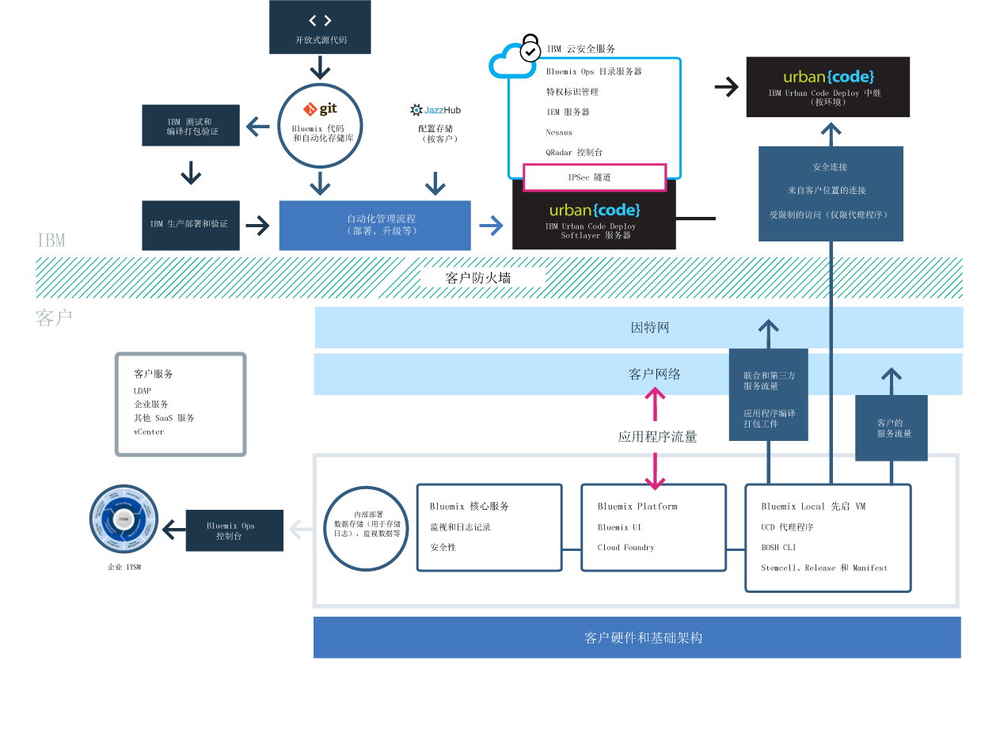

{:new_window: target="_blank"}
{:shortdesc: .shortdesc}

#{{site.data.keyword.Bluemix_notm}} Local
{: #local}
*上次更新时间：2015 年 10 月 20 日*

{{site.data.keyword.Bluemix}} Local 将为您的数据中心带来 {{site.data.keyword.Bluemix_notm}} 基于云的平台的能力和敏捷性。通过 {{site.data.keyword.Bluemix_notm}} Local，在与 {{site.data.keyword.Bluemix_notm}} Public 保持安全连接并与之同步的同时，可以在公司防火墙后保护您最敏感的工作负载。{:shortdesc}

IBM® 使用云操作即服务来监视和维护您的环境，让您可以专注于构建基于该环境运行的应用程序和服务。IBM 还可以处理平台更新，让您可以专注于业务。

{{site.data.keyword.Bluemix_notm}} Local 包含专用的联合目录，其中显示只供您使用的本地服务。此外，还包含从 {{site.data.keyword.Bluemix_notm}} Public 联合的其他服务，供您使用。

{{site.data.keyword.Bluemix_notm}} Local 位于公司防火墙后的虚拟机上，可为您提供最高级别的执行和最安全的云基础架构。IBM 通过 IBM 的中继设备技术对您数据中心的 {{site.data.keyword.Bluemix_notm}} Local 进行安装、远程监视以及管理。

中继设备是 {{site.data.keyword.Bluemix_notm}} Local 随附的一项交付功能，能够使 IBM 自动地向所有本地部署持续交付更新，这样您将始终拥有稳定、安全的最新系统。中继设备通过开放的出站 SSL VPN 通道实现安全连接，此通道源自使用证书的先启虚拟机，证书是特定于每个 {{site.data.keyword.Bluemix_notm}} Local 实例的。此通道上的流量由 Urban Code Deployer 为您实例的平台、计算资源和服务自动提供服务并进行维护。

*图 1. {{site.data.keyword.Bluemix_notm}} Local 详细概览图*

{{site.data.keyword.Bluemix_notm}} Local 环境在操作安全性方面所采用的安全标准与公共 {{site.data.keyword.Bluemix_notm}} 相同。您需要提供硬件和基础架构，这样就能对基础架构和物理安全性进行控制。开发者对本地 {{site.data.keyword.Bluemix_notm}} 的访问由 LDAP 策略进行控制，这些策略可以由 {{site.data.keyword.Bluemix_notm}} 团队在设置您的环境时进行配置。在该本地环境中，您可以使用管理控制台来管理用户角色和许可权。

{{site.data.keyword.Bluemix_notm}} Local 随附所有内含的 {{site.data.keyword.Bluemix_notm}} 运行时和 64 GB 计算内存。

此外，还有一组可供 {{site.data.keyword.Bluemix_notm}} Local 使用的服务。

| **类型** | **名称** | **描述** |    
|----------|----------|-----------------|
|内含 | {{site.data.keyword.Bluemix_notm}} 运行时 | 使用运行时可快速启动并运行应用程序，无需设置和管理 VM 与操作系统。所有 {{site.data.keyword.Bluemix_notm}} 运行时都可供您在 {{site.data.keyword.Bluemix_notm}} Local 实例中使用。|
|内含 | {{site.data.keyword.autoscaling}}| 根据策略，动态增大或减小应用程序的计算容量。通过此服务，您在 {{site.data.keyword.Bluemix}} Local 环境中的使用不受限制。|
|可选 |{{site.data.keyword.datacshort}}| 此服务提供内存中数据网格，用于在分布式高速缓存场景中为您的应用程序提供支持。包含 50 GB 内存中高速缓存。 |
|可选 | {{site.data.keyword.APIM}} | 使用 {{site.data.keyword.APIMfull}} 服务可编写、管理和社交化 API。可以使用资源导入 API，方法是使用代理 URL 或从 HTTP 数据源组合数据。使用 {{site.data.keyword.APIM}} 服务的好处是，您可以管理 API 的使用方式。 |

*表 1. 本地服务*

##设置 {{site.data.keyword.Bluemix_notm}} Local 实例
{: #setuplocal}

{{site.data.keyword.Bluemix_notm}} Local 的设计宗旨是提供专用版本的 {{site.data.keyword.Bluemix_notm}} Public 产品，此产品在您自己的硬件上托管并由您进行管理。您可以使用 {{site.data.keyword.Bluemix_notm}} 服务和运行时来满足安全、客户托管和受管云环境中的计算需求。

IBM 为您提供了使用受密码保护的登录来访问 {{site.data.keyword.Bluemix_notm}} Local 的方式。您可以访问服务、运行时和关联的资源，还可以部署和除去 {{site.data.keyword.Bluemix_notm}} 应用程序。要与 IBM 代表合作来设置您的 {{site.data.keyword.Bluemix_notm}} 本地实例，请查看以下步骤。

要设置专用版本的 {{site.data.keyword.Bluemix_notm}}，请执行以下操作：

<ol>
<li>要设置本地实例，请查看 <a href="index.html#localinfra">{{site.data.keyword.Bluemix_notm}} Local 基础架构需求</a>。</li>
<li>首先联系 IBM 指定的客户代表或联系 <a href="https://console.ng.bluemix.net/?direct=classic/#/contactUs/cloudOEPaneId=contactUs" target="_blank">{{site.data.keyword.Bluemix_notm}}</a>。</li>
<li>与 IBM 达成 {{site.data.keyword.Bluemix_notm}} Local 协议，其中包含交付的里程碑日期。<ol type="a">
	<li>与 IBM 合作来设置您的 {{site.data.keyword.Bluemix_notm}} Local 实例，费用由您支付。每月的经常性费用基于要使用的本地服务以及对所有 {{site.data.keyword.Bluemix_notm}} Public 服务的预订。对于超出预订协议范围的任何费用，您会收到相应发票。</li>
	<li>为设置 {{site.data.keyword.Bluemix_notm}} Local 实例的每个阶段确定截止期限。</li>
	</ol>
	</li>
<li>创建您的平台和帐户后，为组织中需要启动并运行本地实例的角色确定相应人员。每个角色都有对应的 IBM 代表。 

客户角色：

<dl>
<dt>**采购联系人**</dt>
<dd>与 IBM 代表合作来建立 {{site.data.keyword.Bluemix_notm}} Local 环境，包括确定组织中负责项目中所有方面的相应人员。此角色监管模式选择、商业安排以及安排对客户资源的访问。采购联系人是设置本地实例的总联系人。</dd>
<dt>**合规管理人员**</dt>
<dd>与 IBM 代表合作来选择拓扑和部署选项，以满足您的安全需求。此角色与 IBM 合规顾问合作来确定哪些部署模式可以达到合规目标。</dd>
<dt>**网络专员**</dt>
<dd>与 IBM 代表合作来规划用于部署 {{site.data.keyword.Bluemix_notm}} 的网络。此角色向 IBM 代表提出要求，并与 IBM 代表一起制定实施计划。安装和验证阶段结束后，此角色将进行“签核”，证明网络配置达到公司标准。</dd>
<dt>**DevOps 焦点联系人**</dt>
<dd>与 IBM 代表合作来规划和应用 {{site.data.keyword.Bluemix_notm}} 平台、服务和运行时所需的维护更新。此角色还将与 IBM 代表一起配置 {{site.data.keyword.Bluemix_notm}} Local 实例。</dd>
</dl>

IBM 角色：

<dl>
<dt>**IBM 供应经理**</dt>
<dd>与客户采购联系人合作来确定客户环境。</dd>
<dt>**IBM 合规顾问**</dt>
<dd>与客户合规管理人员合作来选择拓扑和部署选项，以满足您的安全需求。</dd>
<dt>**IBM 网络专员**</dt>
<dd>与客户网络专员合作来规划用于部署的网络。此角色与客户合作来收集需求，然后创建实施计划。此角色还执行自动化测试，以验证实施计划的实际结果。</dd>	
<dt>**IBM DevOps 联系人**</dt>
<dd>与客户 DevOps 联系人就部署拓扑的安装和持续维护进行合作。此角色与客户合作来规划并执行平台和服务所需的更新。</dd>
</dl>
</li>
<li>您需要提供硬件，而 IBM 将帮助您定义并建立企业网络与 {{site.data.keyword.Bluemix_notm}} Local 实例之间的网络连接。有关基础架构需求的更多信息，请参阅 <a href="index.html#localinfra">{{site.data.keyword.Bluemix_notm}} Local 基础架构需求</a>。
<ol type="a">
	<li>IBM 根据您提供的信息配置网络访问和 LDAP。为您指定的联系人授予管理访问权。还必须指定一名联系人来负责记帐和提供相应支持。</li>
	<li>IBM 在您的本地环境中设置联合目录，用于显示您的本地服务以及许多公共 {{site.data.keyword.Bluemix_notm}} 服务。</li>
	<li>您验证网络和防火墙配置以及 LDAP 端点和访问权。</li>
	</ol>
</li>
</ol>
	
##{{site.data.keyword.Bluemix_notm}} Local 基础架构需求
{: #localinfra}

对于 {{site.data.keyword.Bluemix_notm}} Local，您拥有托管本地实例的物理安全性和基础架构。IBM 针对 {{site.data.keyword.Bluemix_notm}} Local 的设置，设置了以下需求。
###硬件
虽然对可用硬件的类型和大小有要求，但可以选择任意组合来满足所设置的资源总需求。
<dl>
<dt>**VMware ESXi 硬件**</dt>
<dd>
ESXi 是一种在物理服务器上运行的虚拟化层，可将处理器、内存、存储器和资源抽取到多个虚拟机中。选择满足以下资源总数的任意组合，但条件是每个 ESXi 的最小物理核心计数为 8。以下规范仅适用于 {{site.data.keyword.Bluemix_notm}} 核心运行时。
<ul>
<li>48 个物理核心，每个核心 2.0 GHz 或更高</li>
<li>756 GB 物理 RAM</li>
</li>数据存储总大小为 7.5 TB <ul>
<li>7 TB 数据存储，用于容纳 {{site.data.keyword.Bluemix_notm}}</li>
<li>500 GB 数据存储，用于容纳先启虚拟机</li>
</ul>
</ul>

<strong>注：</strong>如果使用多个数据存储，请对每个数据存储使用相同的前缀。

</dd>
<dt>**高可用性**</dt>
<dd>
为了针对单节点故障提供支持，必须有 n+1 个 ESXi。例如，如果使用 2 个 ESXi，每个 ESXi 16 个核心，那么需要第三个 ESXi。
<strong>注：</strong>客户 VMware 管理员可以决定是否在集群中强制执行严格的高可用性故障转移以保证有足够的资源。

</dd>
<dt>**网络**</dt>
<dd>
建议的需求包括客户可访问的端口组，端口组带 10 个具有出站互联网访问权的客户网络 IP 地址。然后，定义第二个专用 VLAN，仅供要用于 {{site.data.keyword.Bluemix_notm}} Local 的 ESXi 使用。此 VLAN 在 VMware 中显示为端口组。{{site.data.keyword.Bluemix_notm}} Local 将其用于专用子网，这样不但更为安全，而且有助于避免路由问题。</dd>
</dl>

###vCenter 服务器配置
查看以下版本、数据中心、资源池和数据存储需求。
<dl>
<dt>**支持的 VMware 版本**</dt>
<dd>vCenter 和 ESXi 5.1 和 5.5</dd>
<dt>**数据中心**</dt>
<dd>创建数据中心（如果数据中心不存在）。</dd>
<dt>**数据中心文件夹**</dt>
<dd>如果计划不授予从数据中心传播的管理员访问权，请创建与集群同名的 VM 文件夹。</dd>
<dt>**集群**</dt>
<dd>创建专用于 {{site.data.keyword.Bluemix_notm}} Local 的集群。例如，集群名称为 `bluemix`。</dd>
<dt>**资源池**</dt>
<dd>在 {{site.data.keyword.Bluemix_notm}} Local 集群下创建资源池。例如，资源池名称为 `local`。</dd>
</dt>**数据存储**</dt>
<dd>初始部署 {{site.data.keyword.Bluemix_notm}} 需要 7.5 TB 数据存储。 
 
**注**：使用多个数据存储时，请确保每个数据存储都以相同的前缀开头。例如，具有相同前缀的多个数据存储为 `bluemix_datastore_01` 和 `bluemix_datastore_02`。</dd>
</dl>

###网络带宽
建议吞吐量上行为 5 Mbps，下行为 5 Mbps，每个月的预期数据使用量为 10 GB。在传递大小最大达到 3 GB 的大型捆绑数据时，IBM 会确定商定时段。
###VMware 许可权
设置以下角色和许可权。为每个许可权设置传播。如果传播许可权，那么该许可权将通过对象层次结构向下传递。但是，子对象的许可权始终会覆盖自父对象传播的许可权。
<dl>
<dt>**vCenter 服务器**</dt>
<dd>将角色设置为只读且不传播。 
 
**注**：要检索特定磁盘操作的任务状态，需要此角色。</dd>
<dt>**数据中心**</dt>
<dd>创建角色“{{site.data.keyword.Bluemix_notm}}”并授予对**数据存储**（包括**低级别文件操作**和**更新虚拟机文件**）的许可权。 
 
**注**：要支持将文件发布到数据存储，需要此角色。</dd>
<dt>**集群**</dt>
<dd>将角色设置为管理员且进行传播。</dd>
<dt>**数据存储**</dt>
<dd>将角色设置为管理员且对每个 {{site.data.keyword.Bluemix_notm}} 数据存储进行传播。</dd>
<dt>**网络**</dt>
<dd>使用管理员角色设置公共和专用端口组，但不传播。</dd>
</dl>

###Droplet Execution Agent (DEA) 池
每个 DEA 都会配置为：
- 16 - 32 GB RAM
- 2 - 4 个 vCPU
- 150 - 300 GB 存储器

例如，如果 ESXi 主机大小为 256 GB 内存，16 个核心，那么将添加 8 个 DEA。如果 ESXi 主机大小为 64 GB 内存，8 个核心，那么将需要添加 2 个 ESXi 和 4 个 DEA。每四个 DEA 还需要额外添加 1.5 TB 的存储器。此示例基于配置有 32 GB RAM、4 个 vCPU 和 300 GB 存储器的 DEA。

##维护本地实例
{: #maintainlocal}

IBM 会在 IBM 认为适当的时候，为 Bluemix Local 平台、运行时以及服务维护和安装更新与修订。在维护时段内，服务可能会不可用。

**重要信息**：IBM 保留在必要时中断服务来实施紧急维护的权利。IBM 可能会更改所安排的维护时间，但会通知您任何此类更改以及任何紧急维护信息。

{{site.data.keyword.Bluemix_notm}} Local 需要以下类型的维护：
<dl>
<dt>**标准维护时段**</dt>
<dd>服务会利用预定义的标准维护时段，而这可能会导致服务不可用。IBM 无需客户批准就能执行维护，在执行维护时 IBM 会尝试尽可能减小对您服务的影响。 
 
IBM 会通过电子邮件、电话或其他方法来发送有关针对每个维护时段计划进行哪些更改的广播报文。 
 
**重要信息**：在维护期间，某个服务可能不可用。</dd>

<dt>**每月更改时段**</dt>
<dd>每月维护时段根据您与 IBM 在 21 天时段中的协商进行应用。您可以在 21 天时段中向 IBM 提供可能不适合您的具体日期和时间。IBM 会尝试基于这些时间来安排更新。根据请求，IBM 会向您发送安排的维护时段。每月更改时段应该不会影响运行中的 Bluemix Local 环境。 
 
**注**：如果未请求更新的具体时间，那么维护会自动在时段结束时应用。 
 
转至**管理 > 系统信息**以查看暂挂的更新，设置不可用的日期以及批准更新。有关通知和安排暂挂更新的更多信息，请参阅<a href="../admin/index.html#oc_system">查看系统信息</a>。</dd>

<dt>**其他**</dt>
<dd>IBM 想要将可能会影响您的服务（尤其是影响 Bluemix Local 环境、运行时和服务的可用性）的所有维护限定在标准时段和每月时段范围内。对于例外情况，可能会使用其他更改时段来管理环境。在此类更改时段内，IBM 会通过合理的努力尽量不影响您，并会提前通知您。</dd>
</dl>

要为本地实例设置维护，请与 IBM 指定的客户代表一起商定标准维护时段。
   
