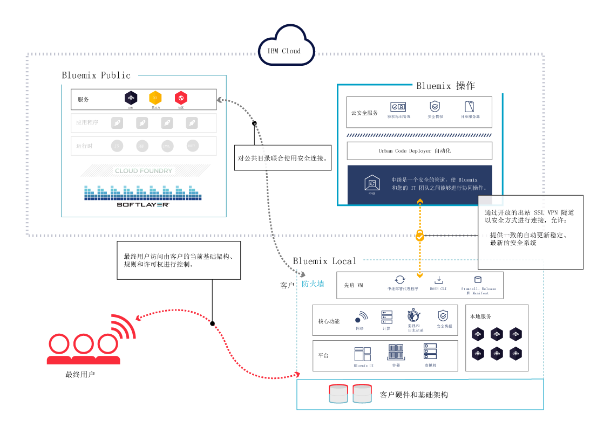
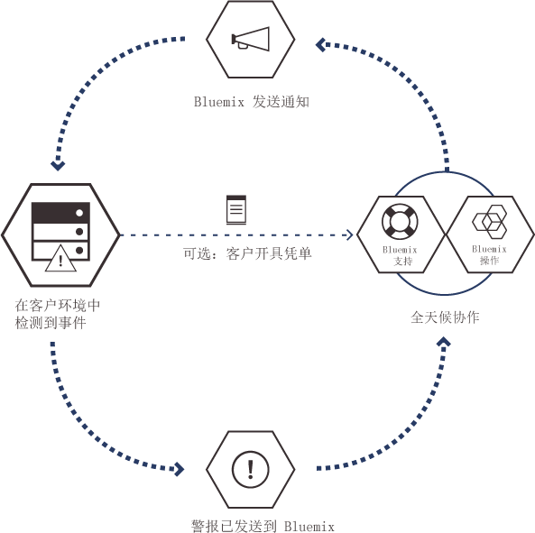

---

 

copyright:

  years: 2015, 2016

 

---

{:new_window: target="_blank"}
{:shortdesc: .shortdesc}

#{{site.data.keyword.Bluemix_notm}} Local
{: #local}
*上次更新时间：2016 年 5 月 16 日*

{{site.data.keyword.Bluemix}} Local 将为您的数据中心带来 {{site.data.keyword.Bluemix_notm}} 基于云的平台的能力和敏捷性。通过 {{site.data.keyword.Bluemix_notm}} Local，在与 {{site.data.keyword.Bluemix_notm}} Public 保持安全连接并与之同步的同时，可以在公司防火墙后保护您最敏感的工作负载。
{:shortdesc}

IBM® 使用云操作即服务来监视和维护您的环境，让您可以专注于构建基于该环境运行的应用程序和服务。IBM 还可以处理平台更新，让您可以专注于业务。

{{site.data.keyword.Bluemix_notm}} Local 环境在操作安全方面所采用的安全标准与公共 {{site.data.keyword.Bluemix_notm}} 相同。您需要提供硬件和基础架构，这样就能对基础架构和物理安全进行控制。开发者对本地 {{site.data.keyword.Bluemix_notm}} 的访问由 LDAP 策略进行控制，这些策略可以由 {{site.data.keyword.Bluemix_notm}} 团队在设置您的环境时进行配置。在本地环境中，您可以使用“管理”页面来管理用户角色和许可权。

{{site.data.keyword.Bluemix_notm}} Local 随附所有内含的 {{site.data.keyword.Bluemix_notm}} 运行时和 64 GB 计算内存。

此外，还有一组可作为 {{site.data.keyword.Bluemix_notm}} Local 服务使用的服务。请查看下表以了解哪些已包含在内，哪些可供您购买。

*表 1. Local 服务和运行时*

| **类型** | **名称** | **描述** |
|----------|----------|-----------------|
|内含 | {{site.data.keyword.Bluemix_notm}} 运行时 | 使用运行时可快速启动并运行应用程序，无需设置和管理计算机与操作系统。所有 {{site.data.keyword.Bluemix_notm}} 运行时都可供您在 {{site.data.keyword.Bluemix_notm}} Local 实例中使用。|
|可选 | {{site.data.keyword.APIM}} | 使用 {{site.data.keyword.APIMfull}} 服务可编写、管理和社交化 API。可以使用资源导入 API，方法是使用代理 URL 或从 HTTP 数据源组合数据。使用 {{site.data.keyword.APIM}} 服务的好处是，您可以管理 API 的使用方式。 |
|内含 | {{site.data.keyword.autoscaling}}| 根据策略，动态增大或减小应用程序的计算资源容量。通过此服务，您在 {{site.data.keyword.Bluemix}} Local 环境中的使用不受限制。|
|可选 | {{site.data.keyword.datacshort}} | 此服务提供内存中数据网格，支持应用程序使用分布式高速缓存方案。包含 50 GB 内存中高速缓存。 |
|可选 | {{site.data.keyword.sescashort}} | 为了提高冗余度，{{site.data.keyword.sescashort}} 提供了高速缓存中存储的会话的副本。因此，万一发生掉线或中断，客户机应用程序会保持对高速缓存中的会话的访问。此服务支持 Web 和移动应用程序的会话高速缓存场景。 |
|可选 | {{site.data.keyword.iot_full}} | 此服务允许应用程序与连接的设备、传感器和网关进行通信，以及使用这些设备、传感器和网关收集的数据。本地基本产品包括初始环境，允许在本地环境中运行 IBM {{site.data.keyword.iot_full}} 的专用版本，容量为 100,000 个并行连接设备或应用程序，数据交换量为 1.6 TB。 |

有一些可选组件可供您购买，用于扩展资源和服务的容量。可以通过联系销售团队来购买其中任何组件；请转至[联系我们](https://console.ng.bluemix.net/?direct=classic/#/contactUs/cloudOEPaneId=contactUs)，以获取有关联系销售代表的信息。要增加服务的套餐，可以从目录的服务磁贴中选择套餐。

*表 2. 可购买的可选组件*

| **名称** | **描述** |
|----------|-----------------|
|{{site.data.keyword.Bluemix_notm}} Local 访问权一次性设置 | 用于部署和配置本地环境的一次性设置费用。 |
|{{site.data.keyword.Bluemix_notm}} Local 计算资源增加 16 GB 容量 | 扩展 IBM {{site.data.keyword.Bluemix_notm}} Local 计算资源，以额外提供 16 GB 内存容量。 |
|{{site.data.keyword.Bluemix_notm}} Data & Session Cache 增加 50 GB 容量 | 此环境允许部署和运行 Data Cache 和 Session Cache 实例，最高累计容量为 50 GB。 |
|{{site.data.keyword.Bluemix_notm}} Local {{site.data.keyword.APIM}} 增加 500 个 API 调用容量 | 此环境允许运行 {{site.data.keyword.APIM}} for {{site.data.keyword.Bluemix_notm}} 的专用版本，容量为每秒 500 个 API 调用。 |
|{{site.data.keyword.Bluemix_notm}} {{site.data.keyword.iot_short}} Local 递增增加 | 除允许在本地环境中运行 {{site.data.keyword.iot_full}} 专用版本的 {{site.data.keyword.iot_full}} Local 基本服务产品以外的环境，容量为 100,000 个并行连接设备或应用程序，数据交换量为 0.5 TB。 |

**注**：{{site.data.keyword.Bluemix_notm}} Local 组件可能指示特定配置的容量，例如千兆字节或每秒事务数。由于实践中云服务的任何配置的实际容量根据多种因素而变化，因此实践中的实际容量可能大于或小于配置的容量。

### 联合目录

{{site.data.keyword.Bluemix_notm}} Local 包含专用的联合目录，其中显示只供您使用的本地服务。此外，还包含可通过 {{site.data.keyword.Bluemix_notm}} Public 供您使用的其他服务。

联合目录提供了用于创建混合应用程序的功能，混合应用程序由公共服务和私有服务组成。您可以选择根据自己的数据隐私和安全标准来确定哪些公共服务满足您的业务需求。如果这是适合本地环境的服务私有实例，那么您将看到目录中的服务磁贴带有“本地”标记。与此类似，如果这是定制服务，那么您将看到服务磁贴列有“定制”。 

*表 3. 可用于从 {{site.data.keyword.Bluemix_notm}} Public 按区域联合的服务*

|服务	|在美国南部区域中可用	|在欧洲英国区域中可用 |在澳洲悉尼区域中可用|
|:----------|:------------------------------|:------------------|:------------------|
|{{site.data.keyword.alchemyapishort}} 		|是	   	|是  		|是|
|{{site.data.keyword.alertnotificationshort}}		|是		|是			|是		|
|{{site.data.keyword.appseccloudshort}}		|是		|是		|是 |
|{{site.data.keyword.hadoopst}}			|是		|否		|否 |
|{{site.data.keyword.APIM}}			|是		|是		|是 |
|{{site.data.keyword.rules_short}}		|是		|是		|是 |
|{{site.data.keyword.cloudant}}			|是		|是		|是 |
|{{site.data.keyword.conceptexpansionshort}}	|是		|是		|是|
|{{site.data.keyword.conceptinsightsshort}}	|是		|是		|是 |
|{{site.data.keyword.dashdbshort}}		|是		|是		|是 |
|{{site.data.keyword.dataworks_short}}		|是		|是		|否|
|{{site.data.keyword.DB2OnCloud_short}}		|是		|是		|是 |
|{{site.data.keyword.dialogshort}}		|是		|是		|是|
|{{site.data.keyword.documentconversionshort}}	|是		|是		|是|
|{{site.data.keyword.game}}			|否		|否		|是 |
|{{site.data.keyword.geospatialshort_Geospatial}}	|是	|是		|是 |
|{{site.data.keyword.GlobalizationPipeline_short}}	|是		| 是		| 是 |
|{{site.data.keyword.identitymixershort}}		|是		|是		|是|
|{{site.data.keyword.twittershort}}		|是		|是		|是|
|{{site.data.keyword.weather_short}}		|是		|是		|是|
|{{site.data.keyword.languagetranslationshort}}	|是		|是		|是 |
|{{site.data.keyword.eventhubshort}}		|是		|否		|否|
|{{site.data.keyword.messagehub}}		|是		|是		|否|
|{{site.data.keyword.macm_short}}		|是		|是		|是|
|{{site.data.keyword.manda}}			|是		|是		|是 |
|{{site.data.keyword.amashort}}			|是		|是		|是 |
|{{site.data.keyword.mqa}}			|是		|是		|是 |
|{{site.data.keyword.mql}}			|是		|是		|是 |
|{{site.data.keyword.nlclassifierlshort}} 	|是 		|是 		|是|
|{{site.data.keyword.personalityinsightsshort}}	|是		|是		|是|
|{{site.data.keyword.pm_short}}			|是		|是		|否 |
|{{site.data.keyword.presenceinsightsshort}}	|是		|是		|是|
|{{site.data.keyword.mobilepush}}		|是		|是		|是 |
|{{site.data.keyword.questionandanswershort}}	|是		|是		|是|
|{{site.data.keyword.relationshipextractionshort}}	|是	|是		|是|
|{{site.data.keyword.retrieveandrankshort}}	|是 		|是 		|是|
|{{site.data.keyword.runbook_short}}		|是		|是		|是|
|{{site.data.keyword.SecureGateway}}		|是		|是		|是 |
|{{site.data.keyword.ssofull}}			|是		|否		|否|
|{{site.data.keyword.speechtotextshort}}	|是 		|是	 	|是|
|{{site.data.keyword.streaminganalyticsshort}}	|是		|是		|是 |
|{{site.data.keyword.texttospeechshort}} 	|是 		|是	 	|是|
|{{site.data.keyword.toneanalyzershort}} 	|是 		|是 		|是|
|{{site.data.keyword.tradeoffanalyticsshort}}	|是		|是		|是|
|{{site.data.keyword.visualinsightsshort}}	|是		|是		|是|
|{{site.data.keyword.visualrecognitionshort}}	|是 		|是	 	|是|
|{{site.data.keyword.iot_short}}		|是		|是		|否|
|{{site.data.keyword.workflow}}			|是		|是		|是 |
|{{site.data.keyword.workloadscheduler}}	|是		|是		|是 |

## {{site.data.keyword.Bluemix_notm}} Local 体系结构
{: #localarch}

{{site.data.keyword.Bluemix_notm}} Local 位于公司防火墙后的虚拟机上，可为您提供性能最佳和最安全的云基础架构。IBM 通过 IBM 的中继技术在您的数据中心内对 {{site.data.keyword.Bluemix_notm}} Local 进行安装、远程监视以及管理。请查看下图，以获取有关如何在本地环境中设置 {{site.data.keyword.Bluemix_notm}} 以及 IBM 如何维护本地实例的信息：

*图 1. {{site.data.keyword.Bluemix_notm}} Local 体系结构*

网络中的先启虚拟机在客户防火墙后面运行，该网络使用出站连接通过中继连接到 IBM 操作中心。{{site.data.keyword.Bluemix_notm}} 平台组件以及支持这些平台组件的核心功能在一个独立的专用虚拟局域网 (VLAN) 中运行。{{site.data.keyword.Bluemix_notm}} Local 将 VLAN 用于专用子网。使用专用子网（而不使用公用 VLAN）不但更为安全，而且还有助于避免路由问题。支持该平台的核心功能集包括以下内容：

<dl>
<dt>**监视和日志记录**</dt>
<dd>监视和日志记录功能通过中继部署在您的数据中心内，并且数据保留在数据中心内。警报会根据定义的警报条件发回 IBM 操作人员。发回 IBM 的警报中不会包含任何敏感信息。</dd>
<dt>**网络**</dt>
<dd>中继是 {{site.data.keyword.Bluemix_notm}} Local 随附的交付网络。中继使 IBM 能够以一致的方式自动向所有本地部署交付最新更新，以便您始终都能有一个安全的最新系统。此隧道上的流量是自动执行的活动，用于处理和维护您实例的平台、计算资源和服务。流量包括 IBM 操作人员用于完成您本地实例的问题确定的监视能力。有关中继的更多信息，请参阅[中继](index.html#localrelay)。</dd>
<dt>**计算**</dt>
<dd>{{site.data.keyword.Bluemix_notm}} Local 使用基于 Cloud Foundry 的以应用程序为中心的运行时环境。</dd>
<dt>**安全情报**</dt>
<dd>
IBM 使用 QRadar 安全情报平台提供了用于集成多个关键组件的统一体系结构。这些组件包括安全信息和事件管理、日志管理、异常检测、事件取证以及配置和漏洞管理。Bluemix 还使用 IBM QRadar 安全信息和事件管理 (SIEM) 来监视特权用户操作以及应用程序开发者的成功和不成功登录尝试。QRadar 报告通过“管理”页面的“报告和日志”部分，让客户了解这些事件数据。有关安全报告的信息，请参阅[查看报告](../admin/index.html#oc_report)。

IBM BigFix 会确保以适当的频率应用操作系统的修订。打补丁进程会自动执行，并遵循您与 IBM 约定的日程安排。有关维护和升级的信息，请参阅[维护本地实例](index.html#maintainlocal)。

</dd>
</dl>

您的应用程序会部署到在 Cloud Foundry 虚拟机上运行的虚拟容器内部。安装 {{site.data.keyword.Bluemix_notm}} 时，将部署所有 Cloud Foundry 组件，例如云控制器、运行状况管理器、路由器和 Droplet Execution Agent (DEA)。此外，在 {{site.data.keyword.Bluemix_notm}} 部署中还将包含各种 {{site.data.keyword.Bluemix_notm}} 管理组件。

DataPower 设备提供对 {{site.data.keyword.Bluemix_notm}} 应用程序域的访问。这些设备所连接到的网络从您的内部网即可进行访问。要部署应用程序和服务的用户通过可从内部网进行访问的网络中获取相应访问权。您必须提供 7 个 IP 地址，以用于出站因特网访问。DataPower 设备会从这些客户 IP 地址路由到独立的 {{site.data.keyword.Bluemix_notm}} 部署。有关网络规范和基础架构需求的信息，请参阅 [{{site.data.keyword.Bluemix_notm}} Local 基础架构需求](../local/index.html#localinfra)。

### 中继
{: #localrelay}

中继是 {{site.data.keyword.Bluemix_notm}} Local 随附的交付功能。中继使 IBM 能够以一致的方式自动向所有本地部署交付最新更新，以便您始终都能有一个安全的最新系统。中继通过源自内部部署先启虚拟机的开放式出站 SSL VPN 隧道，使用特定于每个 {{site.data.keyword.Bluemix_notm}} Local 实例的证书来实现安全连接。所有初始 {{site.data.keyword.Bluemix_notm}} 发行版都在先启虚拟机中提供，先启虚拟机还可作为用于部署和更新的自动化代理程序机器。SSL 连接源自先启虚拟机。通过安全连接成功连回 {{site.data.keyword.Bluemix_notm}} 自动化服务器后，IBM 会检查 {{site.data.keyword.Bluemix_notm}} 发行版是否最新以及是否一致，然后开始部署更新。

此隧道上的流量是自动执行的活动，用于处理和维护您实例的平台、计算资源和服务。流量包括 IBM 操作人员用于完成您本地实例的问题确定的监视能力。此连接使用出站 Web 端口 443。IBM 使用中继功能通过一致的测试和验证过程来交付平台更新。此过程将确保推送到本地环境的所有部署均稳定、安全。

只有在您本地环境上与您协作的 IBM 团队才能安全地访问您的 {{site.data.keyword.Bluemix_notm}} 实例。在执行连接过程的多个步骤期间，使用双重认证对本地环境的访问进行了保护。IBM 提供了已批准访问您环境的用户和标识的列表，随后您可以审计对您环境的任何访问。通过生成安全报告，您能够了解谁访问过您的环境，何时以及为什么进行访问。有关生成安全报告的信息，请参阅[安全报告](../security/index.html#reports)。

作为管理员，您可以全面了解环境中的事件、问题、变更、容量和安全管理。您可以使用“管理”页面来访问有关环境的信息。中继技术可确保“管理”页面中的数据是最新的。有关用户访问权、安全日志、联合目录控制以及更新与问题修复沟通的更多信息，请参阅[管理 {{site.data.keyword.Bluemix_notm}} Local 和 {{site.data.keyword.Bluemix_notm}} Dedicated](../admin/index.html#mng)。

##设置 {{site.data.keyword.Bluemix_notm}} Local 实例
{: #setuplocal}

{{site.data.keyword.Bluemix_notm}} Local 的设计宗旨是提供专用版本的 {{site.data.keyword.Bluemix_notm}} Public 产品，此产品在您自己的硬件上托管并由您进行管理。您可以使用 {{site.data.keyword.Bluemix_notm}} 服务和运行时来满足安全、客户托管和受管云环境中的计算需求。

IBM 为您提供了使用受密码保护的登录来访问 {{site.data.keyword.Bluemix_notm}} Local 的方式。您可以访问服务、运行时和关联的资源，还可以部署和除去 {{site.data.keyword.Bluemix_notm}} 应用程序。要与 IBM 代表一起设置您的 {{site.data.keyword.Bluemix_notm}} 本地实例，请查看以下步骤。

要设置专用版本的 {{site.data.keyword.Bluemix_notm}}，请执行以下操作：

<ol>
<li>要设置本地实例，请审查 <a href="index.html#localinfra">{{site.data.keyword.Bluemix_notm}} Local 基础架构需求</a>。</li>
<li>首先联系 IBM 指定的客户代表或联系 <a href="https://console.ng.bluemix.net/?direct=classic/#/contactUs/cloudOEPaneId=contactUs" target="_blank">{{site.data.keyword.Bluemix_notm}}</a>。</li>
<li>与 IBM 达成 {{site.data.keyword.Bluemix_notm}} Local 协议，其中包含交付的里程碑日期。
	<ol type="a">
	<li>与 IBM 合作来设置您的 {{site.data.keyword.Bluemix_notm}} Local 实例，费用由您支付。每月的经常性费用基于要使用的本地服务以及对所有 {{site.data.keyword.Bluemix_notm}} 公共服务的预订。对于超出预订协议范围的任何费用，您会收到相应发票。</li>
	<li>为设置 {{site.data.keyword.Bluemix_notm}} Local 实例的每个阶段确定截止期限。</li>
	</ol>
	</li>
<li>创建您的平台和帐户后，为组织中需要启动并运行本地实例的人员分配必要的角色。有关分配的角色的更多信息，请参阅 <a href="index.html#rolesresponsibilities" target="_blank">{{site.data.keyword.Bluemix_notm}} Local 角色和责任</a>。
</li>
<li>您需要提供硬件，而 IBM 将帮助您定义并建立企业网络与 {{site.data.keyword.Bluemix_notm}} Local 实例之间的网络连接。有关基础架构需求的更多信息，请参阅 <a href="index.html#localinfra">{{site.data.keyword.Bluemix_notm}} Local 基础架构需求</a>。
	<ol type="a">
	<li>IBM 根据您提供的信息配置网络访问和 LDAP。为您指定的联系人授予管理访问权。还必须指定一名联系人来负责记帐和提供相应支持。</li>
	<li>IBM 在您的本地环境中设置联合目录，用于显示您的本地服务以及许多公共 {{site.data.keyword.Bluemix_notm}} 服务。</li>
	<li>您验证网络和防火墙配置以及 LDAP 端点和访问权。</li>
	</ol>
</li>
</ol>

对您的环境进行初始部署和配置的过程应类似于以下列表。有关每个任务负责人员的详细信息，请参阅[角色和责任](../local/index.html#rolesresponsibilities)。

<ol>
<li>您提供与计算资源、联网和存储规范相符的 VMware 配置。有关基础架构需求的更多信息，请参阅 <a href="../local/index.html#localinfra">{{site.data.keyword.Bluemix_notm}} Local 基础架构需求</a>。</li>
<li>您提供 vCenter 集群凭证，以供先启虚拟机使用。您必须提供以下信息：<ul>
<li>VMware 集群的名称</li>
<li>vCenter 集群凭证（包括用户标识和密码）</li>
<li>一个或多个数据存储名称（存储 LUN 名称）</li>
<li>VLAN 标识/VMware 端口组</li>
<li>资源池名称</li>
</ul>
</li>
<li>您与 IBM 一起来验证您在前一任务中提供的凭证。</li>
<li>您提供自己网络上的 7 个 IP 地址。如果您有安全 Web 代理支持内部 {{site.data.keyword.Bluemix_notm}} 组件对因特网进行出站访问，那么必须提供用于连接到该代理的凭证。
**注**：如果您的 Web 代理不是安全代理，那么无需提供凭证。另请注意，并非所有 {{site.data.keyword.Bluemix_notm}} Local 客户都使用 Web 代理。
</li>
<li>IBM 提供了一个 URL 白名单，在开始部署之前，您必须允许这些 URL 通过您的 Web 代理。 

**注**：此 URL 白名单包含诸如 twitter.com、facebook.com 和 youtube.com 之类的 Web 站点。如果不允许这些 URL，那么 {{site.data.keyword.Bluemix_notm}} 的特定服务和区域可能无法使用。

</li>
<li>您为部署指定域名，以及要使用的标识。设置本地实例时，您会得到两个部分定义的域，请选取这两个域的前缀。例如，选取 <code>*mycompany*.bluemix.net</code> 和 <code>*mycompany*.mybluemix.net</code> 的前缀。然后，还可以选择完整域来创建定制域。
您可以根据自己的需要选择任意数量的定制域。不过，您应负责获取定制域的证书。有关创建定制域的信息，请参阅<a href="../manageapps/updapps.html#domain">创建和使用定制域</a>。
</li>
<li>选择要使用何种技术（IPSec 或 OpenVPN 隧道）来配置中继，以便连回 IBM 操作中心。</li>
<li>IBM 在 {{site.data.keyword.Bluemix_notm}} 集群中安装并启动先启虚拟机。如果您提供自己的 VMware，那么 IBM 代表会帮助您的客户代表来完成此任务。</li>
<li>IBM 配置中继，以便连回 IBM 操作中心与之进行通信。</li>
<li>先启虚拟机存储库拉入更新后的构建工件。</li>
<li>您提供凭证，供 IBM 连接到公司 LDAP 目录实例。</li>
<li>IBM 使用自动化来部署核心 {{site.data.keyword.Bluemix_notm}} 平台。</li>
<li>IBM 部署核心平台，其中包含弹性运行时、控制台、管理功能和监视。</li>
<li>IBM 配置您对环境的管理访问权。</li>
<li>IBM 将您的联合目录从本地部署链接到公共 {{site.data.keyword.Bluemix_notm}} 实例，以便使用公共服务。缺省情况下，本地实例中会提供一组公共服务。您可以使用管理页面进行目录管理，以便为本地实例开启或关闭服务。</li>
<li>您可以开始使用您的本地实例来响应警报，该实例由 IBM 操作团队进行监视。</li>
</ol>

{{site.data.keyword.Bluemix_notm}} 实例设置完成后，您可以使用“管理”页面来监视和管理 {{site.data.keyword.Bluemix_notm}} 实例。有关更多信息，请参阅[管理 {{site.data.keyword.Bluemix_notm}} Local 和 Dedicated](../admin/index.html#mng)。有关升级和维护的信息，请参阅[维护本地实例](index.html#maintainlocal)。

##角色和责任
{: #rolesresponsibilities}

如果设置了 {{site.data.keyword.Bluemix_notm}} Local 帐户，请为组织中需要启动并运行实例的人员分配必要的角色。

###角色

以下列表显示了分配的客户角色和责任：

<dl>
<dt>**采购联系人**</dt>
<dd>与 IBM 代表一起建立 {{site.data.keyword.Bluemix_notm}} Local 环境，包括确定组织中负责项目各个方面的相应人员。分配有此角色的人员可监管模式选择、商业安排以及对客户资源访问的安排。采购联系人是设置本地实例的总联系人。</dd>
<dt>**合规管理人员**</dt>
<dd>与 IBM 代表一起选择符合您安全需求的拓扑和部署选项。分配有此角色的人员可与 IBM 合规顾问一起确定哪些部署模式可达到合规目标。</dd>
<dt>**网络专家**</dt>
<dd>与 IBM 代表一起规划用于部署 {{site.data.keyword.Bluemix_notm}} 的网络。分配有此角色的人员负责审查 IBM 要求的联网规范，并与 IBM 一起制定实施规划。安装和验证阶段结束后，分配有此角色的人员可对网络配置是否符合公司标准进行审批。</dd>
<dt>**DevOps 联系人**</dt>
<dd>与 IBM 代表一起规划和应用 {{site.data.keyword.Bluemix_notm}} 平台、服务和运行时所需的维护更新。分配有此角色的人员还可与 IBM 代表一起配置 {{site.data.keyword.Bluemix_notm}} Local 实例。</dd>
<dt>**IaaS 专家**</dt>
<dd>与 IBM 代表一起制定 VMware 部署计划。通常，此人为数据中心的 VMware 管理员。分配有此角色的人员负责审查 <a href="../local/index.html#localinfra">{{site.data.keyword.Bluemix_notm}} Local 基础架构需求</a>，并与 IBM 一起制定实施计划。部署结束后，分配有此角色的人员可对部署是否符合 IaaS 层的公司标准进行审批。</dd>
</dl>

您的客户代表会与 IBM 专家进行合作，共同来确保您始终拥有所需的支持。对于您的帐户，您可以升级到“高级”支持层，以便与专用客户成功经理 (CSM) 进行合作。有关不同支持层的更多信息，请参阅[联系支持](../support/index.html#contacting-support)。CSM 会完成以下类型的任务：

<ul>
<li>在您与 IBM 之间进行技术协调。</li>
<li>协调更新、升级、来自 IBM 的专家帮助，以及来自 {{site.data.keyword.Bluemix_notm}} 支持工程师的初步帮助。</li>
<li>提供有关可用支持类型的信息。</li>
<li>根据需要，担当初步上报联系点。</li>
</ul>

在 {{site.data.keyword.Bluemix_notm}} 实例上与您合作的 {{site.data.keyword.Bluemix_notm}} 支持和运营团队可能需要访问您的本地环境，但仅出于以下原因才会这样做。

<ul>
<li>处理警报和执行操作维护</li>
<li>尝试重现支持凭单上报告的问题</li>
</ul>

###责任

从设置环境到持续维护的过程中，您和 IBM 都必须完成各种任务。以下各表列出了在先启、进展和完成各阶段所需的任务以及完成任务的所有者。

先启阶段用于建立 {{site.data.keyword.Bluemix_notm}} Local 环境。此时，您已审查[本地基础架构需求](../local/index.html#localinfra)。此阶段的主要目标包含以下内容：

- 复查财务协议，并确定交付的里程碑日期。
- 创建 {{site.data.keyword.Bluemix_notm}} 平台，并提供对运行时和服务的访问权。
- 定义并建立企业网络与 {{site.data.keyword.Bluemix_notm}} 运营之间的网络连接。
- 为管理团队确定并分配角色。

*表 4. 先启阶段任务*

| **任务** | **任务详细信息** | **责任方** |
|----------|------------------|-----------------------|
|设置合规标准 | 确定环境所需的政府、行业和专有公司标准。 | 客户 |
|创建安全和合规性集成计划 | 创建安全和集成计划，其中包含达到安全合规性所需的成本、计划安排和资源。 | IBM |
|合规性计划审批 | 审批合规性计划。 | 客户 |
|创建环境规模标准 |  	基于预定义的选项来创建环境规模标准，这些选项将高可用性、灾难恢复目标以及初始 DEA 和服务供应全部考虑在内，其中初始 DEA 和服务供应是为使用平台创建的应用程序提供支持所必需的。您和 IBM 一起定义一些内容，例如需要哪些数据库，以及在客户的联合目录中提供哪些服务等。 | IBM 和客户共担责任 |
|选择体系结构 | 基于预定义的选项来选择体系结构，这些选项将高可用性和灾难恢复需求考虑在内。 | IBM |
|定义灾难恢复目标 | 为环境定义灾难恢复需求。 | 客户 |
|创建灾难恢复计划 | 协商和定义灾难恢复计划。IBM 创建灾难恢复模型，并与您协商在何处由您提供反馈和审批计划。 | IBM 和客户共担责任 |
|创建备份和恢复计划 | 创建备份和恢复计划，其中定义现场和非现场分布的备份的频率和需求。IBM 备份平台组件、IBM 服务、服务元数据（包括用户角色）等。您备份自己负责的任何特定于应用程序的数据。 | IBM 和客户共担责任 |
|确定用于事件检测和问题确定的工具 | 确定用于在 {{site.data.keyword.Bluemix_notm}} 平台级别进行事件检测和问题确定的 IBM 和第三方工具。 | IBM |
|定义上报计划 | 定义上报计划以分类和解决从监视组件检测到的事件。 | IBM |
|签署基础架构、平台和支持协议 | 签署预订协议，包括环境的财务条款和条件。签署支持预订。 | 客户 |
|采购环境 | 采购计算资源、网络和存储。有关环境基础架构需求的更多信息，请参阅 [Local 基础架构需求](../local/index.html#localinfra)。 | 客户 |
|安装 VPN 解决方案 | 安装双向 VPN 解决方案。 | IBM |
|安装平台、应用程序以及监视和管理组件 | 安装、配置和验证平台组件（例如，BOSH Director、云控制器、运行状况管理器、消息传递、路由器、DEA 和服务提供者），以及在上报和问题检测计划中定义的监视组件。 | IBM |
|安装和配置安全组件 | 安装和配置与监视和上报计划绑定的安全组件，包括 IBM QRadar、凭证保险库、入侵防御系统、IBM BigFix 和 IBM Security Privileged Identity Management。 | IBM |
|配置登录服务器 | 配置登录服务器以与公司 LDAP 配合使用。 | IBM |
|安装和配置定制组件 |  	安装和配置位于 {{site.data.keyword.Bluemix_notm}} 产品和服务范围之外的定制组件。 | 客户 |
|连接 {{site.data.keyword.Bluemix_notm}} 管道 | 将 {{site.data.keyword.Bluemix_notm}} 持续集成和持续交付管道与 IBM 存储库相连接。 | IBM |
|定制外部解决方案组件 | 为灾难恢复方案定制负载均衡器。 | 客户 |
|跟踪安全性、合规性和审计控制的状态  | 跟踪状态，直到所有工具和流程全部落实到位，达到确定的合规性为止。 | 客户 |
|审查物理基础架构 | 审查托管解决方案组件的物理部署是否有威胁，并查看用于保护数据中心的安全性控制。 | 客户 |
|检查监视软件 | 检查上报和问题确定计划中定义的监视和管理组件。 | 客户 |
|检查操作系统 | 检查以确保操作系统映像达到合规标准。IBM 提供对操作系统映像的访问权。 | IBM 和客户共担责任 |

接下来是进展阶段。进展阶段描述了您和 IBM 之间的现行协作关系。此阶段的主要目标包含以下内容：

- 审查容量并进行必要的调整。
- 审查维护和平台改进。
- 协调问题解决和根本原因分析活动。

*表 5. 进展阶段任务*

| **任务** | **任务详细信息** | **责任方** |
|----------|------------------|-----------------------|
|审查每周容量报告 | 审查每周容量报告，并根据需要采取纠正措施。 | 客户 |
|创建每月预测 | 收集容量和使用量信息，并创建容量和使用量的每月预测。 | IBM 和客户共担责任 |
|审查容量预测 | 审查容量预测，这些预测与可能影响容量的外部事件以及与预期的新应用程序部署相关。与 IBM 一起审查预测并相应地进行规划。 | IBM 和客户共担责任 |
|调整容量 |  随着需求的变化来增减容量。 | IBM |
|发布即将到来的更新和维护 | 为必需的 IBM 组件维护创建文档。 | IBM |
|执行维护 | 与 IBM 一起安排必需的维护（维护时段为 21 天）。您可以提供在 21 天的时段内可能不适合进行维护的日期，然后 IBM 会尽量相应地制定维护计划。 | IBM 和客户共担责任 |
|地址供应失败 | 针对部署到“目录”的客户创建的服务，解决供应失败问题（如果发生）。 | IBM |
|执行网络和 IP 扫描 | 执行每日和每月网络和 IP 扫描。 | IBM 和客户共担责任 |
|提供对审计日志的访问权 | 提供对所有安全和管理审计日志的访问权。   | IBM 和客户共担责任 |
|执行测试 | 执行定期“关键运营控制”测试和第三方渗透测试。 | IBM 和客户共担责任 |
|状态报告、审计协调和合规性会议  | 完成状态报告、外部审计协调以及在合规性审查状态会议上陈述。 | IBM |
|聘用和业务需求核查 | 针对有权访问客户环境的 IBM 代表，完成每季度就业核查和持续业务需求核查。 | IBM |
|解决安全漏洞 | 解决报告的平台安全漏洞。 | IBM |

最后是完成阶段，此阶段表示您和 IBM {{site.data.keyword.Bluemix_notm}} 之间的关系结束。此阶段的主要任务包含以下内容：

* 结束财务协议
* 除去所有网络连接
* 回收基础架构

*表 6. 完成阶段任务*

| **任务** | **任务详细信息** | **责任方** |
|----------|------------------|-----------------------|
|结束财务协议 | 讨论并同意结束财务协议合同。 | IBM 和客户共担责任 |
|解除环境 | 关闭对环境的访问以及环境的凭证。 | IBM 和客户共担责任 |
|关闭中继 | 终止中继连接。 | IBM |
|回收基础架构 | 根据公司准则回收基础架构。 | 客户 |

## {{site.data.keyword.Bluemix_notm}} Local 基础架构需求
{: #localinfra}

对于 {{site.data.keyword.Bluemix_notm}} Local，您拥有物理安全和用于托管本地实例的基础架构。针对 {{site.data.keyword.Bluemix_notm}} Local 的安装，IBM 设置了以下最低需求。

### 硬件

虽然对可用硬件的类型和大小有要求，但可以选择任意组合来满足所设置的资源总需求。

<dl>
<dt>**VMware ESXi 硬件**</dt>
<dd>
ESXi 是一种在物理服务器上运行的虚拟化层，可将处理器、内存、存储器和资源抽取到多个虚拟机中。选择满足以下资源总数的任意组合，但条件是每个 ESXi 的最小物理核心计数为 8。以下规范仅适用于 {{site.data.keyword.Bluemix_notm}} 核心运行时。
<ul>
<li>48 个物理核心，每个核心 2.0 GHz 或更高</li>
<li>756 GB 物理 RAM</li>
<li>数据存储总大小为 7.5 TB <ul>
<li>7 TB 数据存储，用于容纳 {{site.data.keyword.Bluemix_notm}}</li>
<li>500 GB 数据存储，用于容纳先启虚拟机</li>
</ul>
</li>
</ul>

<strong>注：</strong>如果使用多个数据存储，请对每个数据存储使用相同的前缀。

</dd>
<dt>**高可用性**</dt>
<dd>
为了针对单节点故障提供支持，必须有 n+1 个 ESXi。例如，如果使用 3 个 ESXi（意味着每个 ESXi 有 16 个核心），那么需要第四个 ESXi。
<strong>注：</strong>客户 VMware 管理员可以决定是否在集群中强制执行严格的高可用性故障转移以保证有足够的资源。

</dd>
<dt>**网络**</dt>
<dd>
建议的需求包括一个客户可访问的端口组，该端口组具有 7 个位于同一子网的客户网络 IP 地址，用于进行出站因特网访问。其中，2 个端口由先启虚拟机使用，3 个端口是供域使用的虚拟 IP 地址，最后 2 个端口是供 DataPower 使用的公共 IP 地址。然后，定义第二个专用 VLAN，仅在要用于 {{site.data.keyword.Bluemix_notm}} Local 的 ESXi 之间使用。此 VLAN 在 VMware 中显示为端口组。{{site.data.keyword.Bluemix_notm}} Local 将其用于专用子网，这样不但更为安全，而且有助于避免路由问题。 

所使用的端口如下所示：

<ul>
<li>端口 443，用于中继连接
**注**：如果选择使用 IPSec 隧道，而不是 OpenVPN，请为此连接打开一个客户端口。
</li>
<li>端口 389 或 SSL 636，用于 LDAP 或 Active Directory 连接</li>
</ul>

**注**：IBM 可检测到网络连接是否中断。如果网络连接中断，IBM 会联系您并与您的网络专家一起来解决该问题。

</dd>
<dt>**网络上行链路**</dt>
<dd>使用两个或更多接口（范围：1 到 10 Gbps），具体取决于系统的目标工作负载。</dd>
</dl>

### vCenter 服务器配置

复查以下版本、数据中心、资源池和数据存储需求。

<dl>
<dt>**支持的 VMware 版本**</dt>
<dd>vCenter 和 ESXi 5.1、5.5 和 6.0</dd>
<dt>**支持的 VMware 类型**</dt>
<dd>vSphere Enterprise 
vSphere Enterprise plus（如果计划使用分布式虚拟交换机）</dd>
<dt>**数据中心**</dt>
<dd>创建数据中心（如果数据中心不存在）。</dd>
<dt>**数据中心文件夹**</dt>
<dd>如果计划不授予从数据中心传播的管理员访问权，请创建与集群同名的 VM 文件夹。</dd>
<dt>**集群**</dt>
<dd>创建专用于 {{site.data.keyword.Bluemix_notm}} Local 的集群。例如，集群名称为 `bluemix`。</dd>
<dt>**资源池**</dt>
<dd>在 {{site.data.keyword.Bluemix_notm}} Local 集群下创建资源池。例如，资源池名称为 `local`。</dd>
</dt>**数据存储**</dt>
<dd>初始部署 {{site.data.keyword.Bluemix_notm}} 需要 7.5 TB 数据存储。 
 
**注**：使用多个数据存储时，请确保每个数据存储都以相同的前缀开头。例如，具有相同前缀的多个数据存储为 `bluemix_datastore_01` 和 `bluemix_datastore_02`。</dd>
<dt>**网络**</dt>
<dd>您必须有一个可供客户访问且带有出站因特网功能的网络。VLAN 会托管运行 Bluemix Local 组件的专用子网。所有流量都会从专用子网路由到客户子网。客户子网 IP 用于对 Bluemix Local 的所有访问。然后，可以定义第二个专用 VLAN，但仅在要用于 Bluemix Local 的 ESXi 之间使用。此 VLAN 在 VMware 中显示为端口组。Bluemix Local 会将其用于专用子网，这样不但更为安全，而且有助于避免路由问题。
如果要使用 vSphere 分布式交换机 (vDS)，请创建用于保存 vDS 的文件夹，然后将 vDS 放入该文件夹中。

</dl>

### 用于中继的网络带宽

建议吞吐量上行为 5 Mbps，下行为 5 Mbps，每个月的预期数据使用量为 10 GB。在传递其大小最高可达 4 GB 的大型数据束时，IBM 会确定商定时段。

### VMware 许可权

设置以下角色和许可权。为每个许可权设置传播。如果传播许可权，那么该许可权将通过对象层次结构向下传递。但是，子对象的许可权始终会覆盖自父对象传播的许可权。

<dl>
<dt>**vCenter Server**</dt>
<dd>将角色设置为只读且不传播。 
 
**注**：要检索特定磁盘操作的任务状态，需要此角色。</dd>
<dt>**数据中心**</dt>
<dd>创建角色“{{site.data.keyword.Bluemix_notm}}”，并授予以下许可权：
<ul>
<li>对于 **Datastore**，设置**低级别文件操作**和**更新虚拟机文件**。</li>
<li>对于 **vApp**，设置**导入**。</li>
<li>对于 **dvPort** 组，设置**修改**。这仅供 vDS 使用。</li>
</ul>
**注**：要支持将文件发布到数据存储，需要此角色。</dd>
<dt>**集群**</dt>
<dd>将角色设置为管理员且进行传播。</dd>
<dt>**数据存储**</dt>
<dd>将角色设置为管理员且对每个 {{site.data.keyword.Bluemix_notm}} 数据存储进行传播。</dd>
<dt>**网络**</dt>
<dd><ul>
<li>对于 vSwitch，使用管理员角色设置公共和专用端口组，但不传播。</li>
<li>对于 vDS 父文件夹，设置为只读且传播。</li>
<li>对于 vDS，使用管理员角色设置公共和专用端口组，但不传播。</li>
</ul>
</dd>
</dl>

### 增大 Droplet Execution Agent (DEA) 池
每个 DEA 都会配置为：
- 16 - 32 GB RAM
- 2 - 4 个 vCPU
- 150 - 300 GB 存储器

例如，如果 ESXi 主机大小为 256 GB 内存，16 个核心，那么将添加 8 个 DEA。如果 ESXi 主机大小为 64 GB 内存，8 个核心，那么将需要添加 2 个 ESXi 和 4 个 DEA。每四个 DEA 还需要额外添加 1.5 TB 的存储器。此示例基于配置有 32 GB RAM、4 个 vCPU 和 300 GB 存储器的 DEA。

## 维护本地实例
{: #maintainlocal}

IBM 会在 IBM 认为适当的时候，为 {{site.data.keyword.Bluemix_notm}} 运行时和服务维护并安装更新与修订。在维护时段内，服务可能会不可用。此外，IBM 会与您合作安排对 {{site.data.keyword.Bluemix_notm}} 平台的维护更新。

{{site.data.keyword.Bluemix_notm}} Local 需要以下类型的维护：
<dl>
<dt>**服务标准维护**</dt>
<dd>服务会利用预定义的标准维护时段，而这可能会导致服务不可用。IBM 无需客户批准就能执行服务维护，但在执行维护时 IBM 会尝试尽可能减小对您服务的影响。 
 
IBM 会发送广播报文，详细描述在“状态”页面上针对每个维护时段计划进行哪些更改。 
 
**重要信息**：在维护期间，某些服务可能对您不可用。</dd>

<dt>**{{site.data.keyword.Bluemix_notm}} 平台标准维护**</dt>
<dd>将根据您与 IBM 的协商在 21 天时段中应用维护更新。您为 IBM 提供了预先批准的维护时段以及可能不适用于您的特定日期或时间，IBM 会尽量将更新安排在您选择的日期内或相邻日期执行。 

转至**管理 > 系统信息**以查看安排的和暂挂的维护更新。有关设置预先批准的时段、不可用的日期以及查看或批准维护更新的更多信息，请参阅<a href="../admin/index.html#oc_schedulemaintenance">维护更新</a>
。</dd>
</dl>

**重要信息**：IBM 保留在必要时中断服务来实施紧急维护的权利。IBM 可能会更改所安排的维护时间，但会通知您任何此类更改以及任何紧急维护信息。

如果在维护更新后报告有问题，您与 {{site.data.keyword.Bluemix_notm}} 支持人员协商，允许 IBM 回滚更新是否对您最有利。IBM 会根据商定的结果回滚更新，使环境复原到先前的状态。

## 事件响应和支持
{: #incidentresponse}

### 客户检测到的问题

如果识别到需要 IBM 支持和操作人员关注的问题，您可以使用多种不同的方法来联系支持人员。有关如何联系支持人员的信息，请参阅[联系支持人员](../support/index.html#contacting-bluemix-support-local)。根据问题情况，您和/或 IBM 可合作解决问题。

### IBM 检测到的严重事件

严重事件是指紧迫的意外服务中断以及影响您的环境或用户的稳定性问题。如果 IBM 检测到您的环境内有严重事件，那么会在**状态**页面上借助通知来告知您。您还可以检查“状态”页面来获取平台或服务的任何已知问题。有关“状态”页面的更多信息，请参阅[查看状态](../admin/index.html#oc_status)。 

如果要将通知与支持 Web Hook 的 Web Service 集成在一起，请参阅[通知和事件预订](../admin/index.html#oc_eventsubscription)，以获取有关如何扩展通知功能的信息。

*图 2. 事件响应过程*

根据问题情况，您和/或 IBM 可合作解决问题。如果您有与事件相关的疑问，或者需要 IBM 代表帮助您解决问题，那么可以开具支持凭单。有关如何联系支持人员的信息，请参阅[联系支持人员](../support/index.html#contacting-bluemix-support-local)。

**注**：将全天候监视严重性为 1 的支持凭单。其他凭单的处理时间是周日晚上 10:00 GMT 到周六凌晨 12:00 GMT。有关支持凭单严重性和使用支持的更多信息，请参阅<a href="../support/index.html#contacting-bluemix-support-local">联系支持人员</a>。

## 灾难恢复
{: #dr}

{{site.data.keyword.Bluemix_short}} Local 灾难恢复可按照与使用 {{site.data.keyword.Bluemix_short}} Public 时类似的方式进行设置。{{site.data.keyword.Bluemix_short}} Public 提供了持续可用的创新平台，具有多种自动防故障措施，可确保您的组织、空间和应用程序始终可用。将应用程序部署到多个地理区域可实现持续可用性，避免多个硬件或软件组件同时发生意外故障，或者整个数据中心发生故障。这样，即使一个地理位置发生自然灾害，分布在其他地理位置中的 {{site.data.keyword.Bluemix_notm}} Public 应用程序实例也会可用。
{: shortdesc}

{{site.data.keyword.Bluemix_short}} Local 的灾难恢复是通过应用程序的持续可用性、平台固有的高可用性以及发生故障时恢复实例的能力来实现的。您负责通过将应用程序部署到多个区域来实现应用程序的持续可用性。高可用性是通过 Cloud Foundry 和其他组件中包含的各种技术在平台级别构建的。此外，您可以与 IBM 合作，共同来确保数据已正确备份，可随时满足您的实例复原需求。

### 实现 {{site.data.keyword.Bluemix_notm}} Local 的持续可用性
{: #enabling}

缺省情况下，{{site.data.keyword.Bluemix_notm}} Public 会部署到多个地理位置。但是，要实现 {{site.data.keyword.Bluemix_notm}} Local 实例的全球分布，您必须执行以下操作：

* 确保您的开发者通过手动或自动过程将应用程序部署在多个区域。两个所选区域之间的距离应超过 200 公里，以确保自然灾害不会同时影响到这两个地理位置。
* 配置全球负载均衡器（如 Akamai 或 Dyn），以指向至少位于两个不同区域中的应用程序。

**注**：并非所有 {{site.data.keyword.Bluemix_notm}} 服务都支持区域分布。构造应用程序时，如果想要实现地理分布，还必须确保该应用程序使用的服务具有数据同步这一关键功能。

#### 将 {{site.data.keyword.Bluemix_notm}} Local 应用程序部署到多个地理位置
{: #deploying}

要部署到第二个位置或多个位置，必须采用与启用主地理位置类似的过程：

1. 启用新的本地环境来托管应用程序的其他实例。要创建新环境，请联系 IBM 销售团队来开始这一过程。有关设置本地实例的更多信息，请参阅[设置 {{site.data.keyword.Bluemix_notm}} Local](../local/index.html#setuplocal)。要访问每个环境，必须分别登录。托管环境的每个物理位置都应该至少距离原始位置 200 公里，才可确保可用性。
2. 获取要在其中托管新部署应用程序的域的唯一域名。例如，如果原始域为 *mycompany.east.bluemix.net*，那么可以使用新域（例如，*mycompany.west.bluemix.net*）来创建新的本地环境，并部署到新域。
3. 每次部署原始应用程序时，都会部署到新位置。有关部署的更多信息，请参阅[上传应用程序](../starters/upload_app.html)。

#### 为 {{site.data.keyword.Bluemix_notm}} Local 启用全球负载均衡器
{: #glb}

全球负载均衡器不仅能确保持续可用性，是灾难恢复所必需的，而且还具有其他若干优点：

* 缺省情况下，将用户路由到距离最近的 {{site.data.keyword.Bluemix_notm}} 区域
* 基于性能进行路由
* 选择性将一定百分比的流量定向到新的应用程序版本
* 根据区域运行状况检查，提供站点故障转移
* 根据应用程序运行状况检查，提供站点故障转移
* 在端点之间使用加权路由

您可以选择全球负载均衡器，例如 Akamai 或 Dyn。有关将 Akamai 用作全球负载均衡器的更多信息，请参阅 [Global Traffic Management](https://www.akamai.com/us/en/solutions/products/web-performance/global-traffic-management.jsp){: new_window}。有关将 Dyn 用作全球负载均衡器的更多信息，请参阅 [4 Reasons Businesses Are Taking Global Load Balancing to the Cloud](http://dyn.com/blog/4-reasons-businesses-are-taking-global-load-balancing-to-the-cloud/){: new_window}。

### 高可用性
{: #ha}

除了可实现持续可用性外，{{site.data.keyword.Bluemix_notm}} 还使用 Cloud Foundry 和其他组件中内置的技术，在整个平台提供高可用性。

这些技术包括以下各项：

<dl>
<dt>Cloud Foundry 中的 DEA 可扩展性</dt>
<dd>Cloud Foundry <a href="https://docs.cloudfoundry.org/concepts/architecture/execution-agent.html" target="_blank">Droplet Execution Agent (DEA)</a> 会对其中运行的应用程序执行运行状况检查。如果应用程序或 DEA 本身存在问题，那么它会将应用程序的其他实例部署到备用 DEA 来解决该问题。有关更多信息，请参阅<a href="https://docs.cloudfoundry.org/concepts/high-availability.html" target="_blank">配置 CF 以通过冗余实现高可用性</a>。 

要确保应用程序的高可用性，您需要有足够的计算资源来均衡负载，并且还可能需要额外的计算资源来支持可能发生的故障。如果需要通过增大 DEA 池来扩展环境，以做好准备应对故障或满足应用程序实例高峰负载要求，您可以联系 IBM 代表来订购更多 DEA，并确保您有相应的硬件来支持添加的资源。

</dd>
<dt>元数据备份</dt>
<dd>元数据会备份到辅助位置，通常位于内部部署虚拟机上。如果可能，应该将备份复制到自己的环境中，至少 200 公里远的位置。</dd>
</dl>

## 复原本地实例
{: #restorelocal}

系统会定期备份 {{site.data.keyword.Bluemix_notm}} Local 设置、元数据和配置，以做好准备来应对环境中的任何意外中断。您负责备份的数据包括应用程序数据、云数据库服务数据和对象存储。

在数据备份过程中（包括系统元数据和配置），IBM 会完成以下任务：

<ul>
<li>加密所有备份副本并管理加密密钥</li>
<li>监视并管理备份活动</li>
<li>提供加密的备份文件</li>
<li>复原所请求的数据</li>
<li>管理备份和修订管理操作之间的计划冲突</li>
</ul>

由于保护专用数据至关重要，因此 IBM 在处理备份文件管理时需要您的协作，以便不将文件移出您的数据中心。具体来说，IBM 会要求您完成以下任务：

<ul>
<li>异地备份一份您的加密备份数据，与您所管理的任何其他备份数据的处理方法一样。</li>
<li>向 IBM 操作员提供备份文件，以防万一有任何需要复原的情况。</li>
</ul>

# 相关链接
## 常规
* [Discover: {{site.data.keyword.Bluemix_notm}} Local](http://www.ibm.com/cloud-computing/bluemix/hybrid/local/)
* [{{site.data.keyword.Bluemix_notm}} 中的新增功能](../whatsnew/index.html)
* [{{site.data.keyword.Bluemix_notm}} 词汇表](../overview/glossary/index.html)
* [管理 {{site.data.keyword.Bluemix_notm}} Local 和 {{site.data.keyword.Bluemix_notm}} Dedicated](../admin/index.html#mng)
* [联系支持人员](../support/index.html#getting-customer-support)
