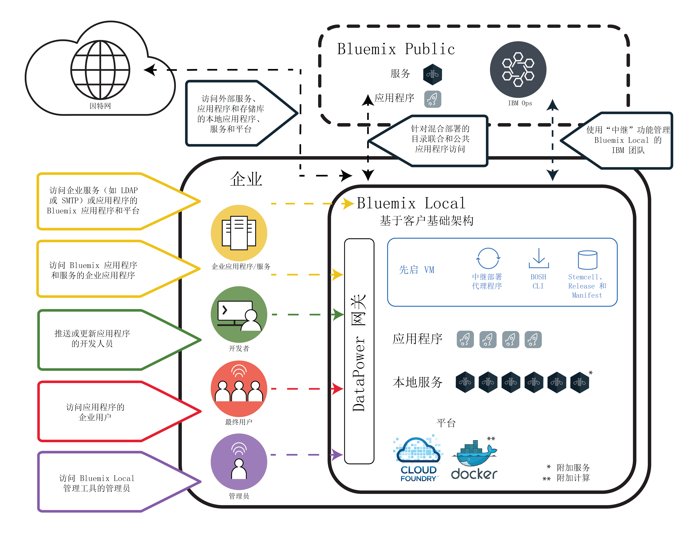

---

copyright:

  years: 2015, 2017

lastupdated: "2017-01-12"

---

{:new_window: target="_blank"}
{:shortdesc: .shortdesc}

# {{site.data.keyword.Bluemix_local_notm}}
{: #local}

{{site.data.keyword.Bluemix_local}} 将为您的数据中心带来 {{site.data.keyword.Bluemix_notm}} 基于云的平台的能力和敏捷性。通过 {{site.data.keyword.Bluemix_local_notm}}，在与 {{site.data.keyword.Bluemix_notm}} Public 保持安全连接并与之同步的同时，可以在公司防火墙后保护您最敏感的工作负载。
{:shortdesc}

IBM® 使用云操作即服务来监视和维护您的环境，让您可以专注于构建基于该环境运行的应用程序和服务。{{site.data.keyword.IBM_notm}} 还可以处理平台更新，让您可以专注于业务。

{{site.data.keyword.Bluemix_local_notm}} 环境在操作安全方面所采用的安全标准与公共 {{site.data.keyword.Bluemix_notm}} 相同。您需要提供硬件和基础架构，这样就能对基础架构和物理[安全](/docs/security/index.html#localplatformsecurity)进行控制。开发者对本地 {{site.data.keyword.Bluemix_notm}} 环境的访问由 LDAP 策略进行控制，这些策略可以由 {{site.data.keyword.Bluemix_notm}} 团队在设置您的环境时进行配置。在本地环境中，您可以使用“管理”页面来[管理用户和许可权](/docs/admin/index.html#oc_useradmin)。

{{site.data.keyword.Bluemix_local_notm}} 随附所有包含的 {{site.data.keyword.Bluemix_notm}} 运行时和 64 GB 计算内存。

此外，还有一组可作为 {{site.data.keyword.Bluemix_local_notm}} 服务使用的服务。请查看下表以了解哪些已包含在内，哪些可供您购买。

| **类型** | **名称** | **描述** |
|----------|----------|-----------------|
|已包含 | [{{site.data.keyword.Bluemix_notm}} 运行时](/docs/cfapps/runtimes.html) | 使用运行时可快速启动并运行应用程序，无需设置和管理计算机与操作系统。所有 {{site.data.keyword.Bluemix_notm}} 运行时都可供您在 {{site.data.keyword.Bluemix_notm}} Local 实例中使用。|
|已包含 | [{{site.data.keyword.autoscaling}}](/docs/services/Auto-Scaling/index.html)| 根据策略，动态增大或减小应用程序的计算容量。通过此服务，您在 {{site.data.keyword.Bluemix}} Local 环境中的使用不受限制。|
|可选 | [{{site.data.keyword.apiconnect_short}}](/docs/services/apiconnect/index.html) | {{site.data.keyword.apiconnect_long}} 将 {{site.data.keyword.APIM}} 和 IBM StrongLoop 集成到单个产品中，以提供一个综合解决方案来创建、运行、管理和强制执行 API 与微服务。 |
|可选 | [{{site.data.keyword.containershort}}](/docs/containers/container_index.html) | 在 {{site.data.keyword.Bluemix_notm}} Local 上运行 Docker 容器。容器是包含应用程序运行所需的所有元素的虚拟软件对象。容器不仅具有资源隔离和分配的好处，而且还比虚拟机器（举例来说）的可移植性更好，且更有效率。有关硬件需求的信息，请参阅 [{{site.data.keyword.Bluemix_notm}} Dedicated 和 Bluemix Local 中的 IBM {{site.data.keyword.containershort}}](/docs/containers/container_dl.html)。 |
|可选 | [{{site.data.keyword.datacshort}}](/docs/services/DataCache/index.html#data_cache) | 此服务提供内存中数据网格，支持应用程序使用分布式高速缓存方案。包含 50 GB 内存中高速缓存。 |
| 可选 (Beta) | [日志记录](/docs/monitoringandlogging/cfapps_ml_logs_dedicated_ov.html#container_ml_logs_dedicated_ov) | 为 {{site.data.keyword.Bluemix_notm}} 用户界面中的 Cloud Foundry 应用程序和 Kibana 中的可搜索日志和仪表板提供日志。 |
|可选 | [{{site.data.keyword.mobilepush}}](/docs/services/mobilepush/index.html) | {{site.data.keyword.mobilepush}} 是可用于向 iOS 和 Android 设备发送通知的服务。通知可以针对所有应用程序用户发送，也可以针对一组使用标记的特定用户和设备发送。您可以管理设备、标记和预订。还可以使用 SDK（软件开发包）和具象状态传输 (REST) 应用程序编程接口 (API) 来进一步开发您的客户机应用程序。 |
|可选 | [{{site.data.keyword.sescashort}}](/docs/services/SessionCache/index.html#session_cache) | 为了提高冗余度，{{site.data.keyword.sescashort}} 提供了高速缓存中存储的会话的副本。因此，万一发生掉线或中断，客户机应用程序能够继续访问高速缓存中的会话。此服务支持 Web 和移动应用程序的会话高速缓存场景。 |
|可选 | [{{site.data.keyword.iot_short}}](/docs/services/IoT/index.html) | 此服务允许应用程序与连接的设备、传感器和网关进行通信，以及使用这些设备、传感器和网关收集的数据。本地基本产品包括初始环境，允许在本地环境中运行 IBM {{site.data.keyword.iot_short}} 的专用版本，容量为 100,000 个并行连接设备或应用程序，数据交换量为 1.6 TB。 |
{: caption="表 1. 本地服务和运行时" caption-side="top"}
{: #table01}

有一些可选组件可供您购买，用于扩展资源和服务的容量。可以通过联系销售团队来购买其中任何组件；请转至[联系我们](https://console.ng.bluemix.net/?direct=classic/#/contactUs/cloudOEPaneId=contactUs)，以获取有关联系销售代表的信息。要增加服务的套餐，可以从目录的服务磁贴中选择套餐。

| **名称** | **描述** |
|----------|-----------------|
|{{site.data.keyword.Bluemix_notm}} Local {{site.data.keyword.apiconnect_short}} Professional 500 万次 API 调用 | 此环境允许运行 {{site.data.keyword.apiconnect_short}} 的专用版本，容量为每月针对部门 API 项目进行 500 万次 API 调用。 |
|{{site.data.keyword.Bluemix_notm}} Local {{site.data.keyword.apiconnect_short}} Professional 增加 10 万次 API 调用| {{site.data.keyword.apiconnect_short}} Professional 环境的扩展，用于每月提供额外 10 万次 API 调用容量。 |
|{{site.data.keyword.Bluemix_notm}} Local {{site.data.keyword.apiconnect_short}} Enterprise 2500 万次 API 调用 | 此环境允许运行 {{site.data.keyword.apiconnect_short}} 的专用版本，容量为每月针对企业级 API 项目进行 2500 万次 API 调用。 |
|{{site.data.keyword.Bluemix_notm}} Local {{site.data.keyword.apiconnect_short}} Enterprise 增加 10 万次 API 调用 | {{site.data.keyword.apiconnect_short}} Enterprise 环境的扩展，用于每月提供额外 10 万次 API 调用容量。 |
|{{site.data.keyword.Bluemix_notm}} Data & Session Cache 增加 50 GB 容量 | 此环境允许部署和运行 Data Cache 和 Session Cache 实例，最高累计容量为 50 GB。 |
|{{site.data.keyword.Bluemix_notm}} {{site.data.keyword.iot_short}} Local 递增增加 | 除允许在本地环境中运行 {{site.data.keyword.iot_short}} 专用版本的 {{site.data.keyword.iot_short}} Local 基本服务产品以外的环境，容量为 100,000 个并行连接设备或应用程序，数据交换量为 0.5 TB。 |
|{{site.data.keyword.IBM_notm}} {{site.data.keyword.mobilepush}} Local 附加组件实例 | 此环境允许部署和运行 {{site.data.keyword.mobilepush}} 实例，每秒能额外接受 300 个请求。 |
{: caption="表 2. 可选择采购的服务组件" caption-side="top"}
{: #table02}

| **名称** | **描述** |
|----------|-----------------|
|本地 Cloud Foundry 运行时 64 GB 容量  | Cloud Foundry 运行时环境，具有 64 GB 运行时容量。 |
|本地 Cloud Foundry 运行时增加 16 GB 容量  | 扩展 Cloud Foundry 运行时环境，以额外提供 16 GB 运行时容量。 |
|本地 {{site.data.keyword.containerlong}} 增加 16 GB 容量  | 扩展 {{site.data.keyword.containerlong}} 环境，以额外提供 16 GB 容量。 |
|本地 {{site.data.keyword.containerlong}} 64 GB 容量  | {{site.data.keyword.containerlong}} 环境，具有 64 GB 容量。 |
{: caption="表 3. 可选择采购的平台附加组件" caption-side="top"}
{: #table03}

**注**：{{site.data.keyword.Bluemix_notm}} Local 组件可能指示特定配置的容量，例如千兆字节或每秒事务数。由于现实中云服务的任何配置的实际容量根据多种因素而变化，因此现实中的实际容量可能大于或小于配置的容量。

### 联合目录
{: #cataloglocal}

{{site.data.keyword.Bluemix_local_notm}} 包含一个私有目录，用于将公共部署和本地部署中已批准的服务集中在一起。您甚至可以通过 {{site.data.keyword.Bluemix_notm}} 目录来发布您自己的服务并管理对这些服务的访问权。您可以选择根据自己的数据隐私和安全标准来确定哪些公共服务满足您的业务需求。

如果您的本地环境有私有的 {{site.data.keyword.Bluemix_notm}} 服务实例，那么您将在目录管理视图中看到服务名称带有“本地”标记。与此类似，如果这是定制服务（即您使用的是服务代理程序创建的服务），那么您将看到列出服务名称时有“定制”字样。通过从 {{site.data.keyword.Bluemix_notm}} Public 使用联合，即可使用列出的不带“本地”或“定制”标记的其他所有服务。联合服务提供了用于创建混合应用程序的功能，混合应用程序由公共服务和私有服务组成。

|服务	|在美国南部区域中可用	|在欧洲英国区域中可用 |在澳洲悉尼区域中可用|
|:----------|:------------------------------|:------------------|:------------------|
|{{site.data.keyword.alchemyapishort}} 		|是	   	|是  		|是|
|{{site.data.keyword.alertnotificationshort}}	|是		|是		|是	|
|{{site.data.keyword.apiconnect_short}}         |是            |是            |是  |
|{{site.data.keyword.appseccloudshort}}		|是		|是		|是 |
|{{site.data.keyword.apiconnect_short}} 	|是   	 	|是  	 	|是   |
|Automated Accessibility Checker |是       |是    |是   |
|{{site.data.keyword.rules_short}}		|是		|是		|是 |
|{{site.data.keyword.iotmapinsights_short}}    |是  |是  |是  |
|{{site.data.keyword.conversationshort}}  |是  |是  |是  |
|{{site.data.keyword.dashdbshort}}		|是		|是		|是 |
|{{site.data.keyword.dataworks_short}}		|是		|是		|否|
|{{site.data.keyword.DB2OnCloud_short}}		|是		|是		|是 |
|Digital Content Checker |是  |是  |是  |
|{{site.data.keyword.documentconversionshort}}	|是		|是		|是|
|{{site.data.keyword.iotdriverinsights_short}}  |是 |是  |是  |
|{{site.data.keyword.geospatialshort_Geospatial}}	|是	|是		|是 |
|{{site.data.keyword.GlobalizationPipeline_short}}	|是		| 是		| 是 |
|{{site.data.keyword.identitymixershort}}		|是		|是		|是|
|{{site.data.keyword.iot4auto_short}} |是   |是  |是  |
|{{site.data.keyword.iotelectronics}}  |是  |是  |否 |
|{{site.data.keyword.iotinsurance_short}} |否   |否   |是  |
|{{site.data.keyword.twittershort}}		|是		|是		|是|
|{{site.data.keyword.languagetranslationshort}}	|是		|是		|是 |
|{{site.data.keyword.languagetranslatorshort}} |是  |是  |是  |
|{{site.data.keyword.dwl_short}}  |是  |是  |否  |
|{{site.data.keyword.eventhubshort}}		|是		|否		|否|
|{{site.data.keyword.messagehub}}		|是		|是		|否|
|{{site.data.keyword.manda}}			|是		|是		|是 |
|{{site.data.keyword.amashort}}			|是		|是		|是 |
|{{site.data.keyword.mqa}}			|是		|是		|是 |
|{{site.data.keyword.mql}}			|否		|否		|是 |
|{{site.data.keyword.nlclassifierlshort}} 	|是 		|是 		|是|
|{{site.data.keyword.personalityinsightsshort}}	|是		|是		|是|
|{{site.data.keyword.pm_short}}			|是		|是		|否 |
|{{site.data.keyword.mobilepush}}		|是		|是		|是 |
|{{site.data.keyword.retrieveandrankshort}}	|是 		|是 		|是|
|{{site.data.keyword.runbook_short}}		|是		|是		|是|
|{{site.data.keyword.SecureGateway}}		|是		|是		|是 |
|{{site.data.keyword.ssofull}}			|是		|否		|否|
|{{site.data.keyword.speechtotextshort}}	|是 		|是	 	|是|
|{{site.data.keyword.streaminganalyticsshort}}	|是		|是		|是 |
|{{site.data.keyword.texttospeechshort}} 	|是 		|是	 	|是|
|{{site.data.keyword.toneanalyzershort}} 	|是 		|是 		|是|
|{{site.data.keyword.tradeoffanalyticsshort}}	|是		|是		|是|
|{{site.data.keyword.visualrecognitionshort}}	|是 		|是	 	|是|
|{{site.data.keyword.iot_short}}		|是		|是		|否|
|{{site.data.keyword.weather_short}}		|是		|是		|是|
|{{site.data.keyword.workloadscheduler}}	|是		|是		|是 |
{: caption="表 4. 按区域为 {{site.data.keyword.Bluemix_notm}} Public 联合提供的服务" caption-side="top"}
{: #table04}

**注**：此表中未包含第三方服务。请检查目录以获取第三方服务选项。

## {{site.data.keyword.Bluemix_local_notm}} 体系结构
{: #localarch}

{{site.data.keyword.Bluemix_local_notm}} 位于企业防火墙后的虚拟基础架构上，可为您提供性能最佳、最安全的云基础架构。{{site.data.keyword.IBM_notm}} 通过 {{site.data.keyword.IBM_notm}} 的[中继](#localrelay)技术在您的数据中心内对 {{site.data.keyword.Bluemix_local_notm}} 进行安装、远程监视以及管理。[图 1](#figure01) 中的逻辑体系结构描述了如何在本地环境中设置 {{site.data.keyword.Bluemix_notm}} 以及 {{site.data.keyword.IBM_notm}} 如何维护本地实例的信息：

 

图 1. {{site.data.keyword.Bluemix_local_notm}} 体系结构
{: #figure01}

先启虚拟机（先启 VM）在企业防火墙后的企业虚拟基础架构上运行。先启 VM 通过 {{site.data.keyword.IBM_notm}} 中继技术创建与 {{site.data.keyword.IBM_notm}} 运营中心的出站网络连接。中继可执行多种功能，下面的[中继](#localrelay)部分中对其进行了描述。

{{site.data.keyword.Bluemix_notm}} 平台组件以及支持这些平台组件的核心功能在一个独立的专用虚拟局域网 (VLAN) 中运行。{{site.data.keyword.Bluemix_local_notm}} 将 VLAN 用于专用子网。使用专用子网（而不使用公用 VLAN）不但更为安全，而且还有助于避免路由问题。构成并支持该平台的核心功能集包括以下内容：

<dl>
<dt>平台</dt>
<dd>平台至少具有 Cloud Foundry 组件和一些本地应用程序服务。{{site.data.keyword.Bluemix_notm}} 提供了 Cloud Foundry 和基于 {{site.data.keyword.containerlong}} 的计算环境。企业可配置其中一个计算环境，也可以同时配置这两个计算环境。 
企业还可添加其他本地应用程序服务。 

有关可添加的其他服务和计算功能，请参阅[可购买的可选组件：服务附加组件](#table02)和[可购买的可选组件：平台附加组件](#table03)。

</dd>
<dt>{{site.data.keyword.Bluemix_notm}} Public</dt>
<dd>
{{site.data.keyword.Bluemix_local_notm}} 环境可能具有与 {{site.data.keyword.Bluemix_notm}} Public 区域的出站连接。通过与 Public 的连接，支持将公共服务联合到本地目录中。借助 {{site.data.keyword.Bluemix_notm}} Public 服务联合，开发者可方便地构建在企业的 {{site.data.keyword.Bluemix_local_notm}} 环境上托管的应用程序，也可便利地访问在 {{site.data.keyword.Bluemix_notm}} Public 中运行的服务。请参阅[联合目录](#cataloglocal)部分中可从 {{site.data.keyword.IBM_notm}} Public 联合的 {{site.data.keyword.Bluemix_notm}} 服务的列表。
</dd>
<dt>{{site.data.keyword.IBM_notm}} 运营</dt>
<dd>
{{site.data.keyword.IBM_notm}} 可管理、监视和维护本地平台与本地服务，以便您可以专注于构建创新应用程序。{{site.data.keyword.IBM_notm}} 运营支持服务 (OSS) 团队使用先启 VM 与 {{site.data.keyword.IBM_notm}} 运营网络的 VPN 隧道连接来执行多种操作。
</dd>
<dt>企业</dt>
<dd>
企业网络环境具有与 {{site.data.keyword.Bluemix_local_notm}} 的双向网络链路。此网络链路允许在 {{site.data.keyword.Bluemix_local_notm}} 中托管的应用程序访问企业中的服务和资源，包括数据源和企业服务。另外，此网络链路还允许 {{site.data.keyword.Bluemix_local_notm}} 使用 LDAP 来认证开发者和管理员。
</dd>
<dt>本地服务</dt>
<dd>有一组服务可专用于 {{site.data.keyword.Bluemix_local_notm}} 环境。通常要在 {{site.data.keyword.IBM_notm}} 团队部署服务之前，先决定希望将哪些服务用于您的环境。有关可用服务的列表，请转至[本地服务和运行时](#table01)。
</dd>
<dt>DataPower
网关</dt>
<dd>
通过 {{site.data.keyword.IBM_notm}} DataPower Gateway 设备，可访问 {{site.data.keyword.Bluemix_notm}} 应用程序域。这些设备会连接到您的内部网网络和 {{site.data.keyword.Bluemix_notm}} 专用网络，从而为 {{site.data.keyword.Bluemix_notm}} 部署提供安全网关。要部署应用程序和服务的开发者将获得通过此网关从内部网进行访问的权限。而应用程序的用户将获得通过 DataPower 设备进行访问的权限，管理员亦是如此。
</dd>
<dt>安全情报</dt>
<dd>
{{site.data.keyword.IBM_notm}} 使用 QRadar 安全情报平台提供了用于集成多个关键组件的统一体系结构。这些组件包括安全信息和事件管理、日志管理、异常检测、事件取证以及配置和漏洞管理。{{site.data.keyword.Bluemix_notm}} 还使用 {{site.data.keyword.IBM_notm}} QRadar 安全信息和事件管理 (SIEM) 来监视特权用户操作以及应用程序开发者的成功和不成功登录尝试。QRadar 报告使用“管理”页面的“报告和日志”部分，让客户了解这些情况。有关安全报告的信息，请参阅[查看报告](/docs/admin/index.html#oc_report)。

{{site.data.keyword.IBM_notm}} BigFix 会确保以适当的频率应用操作系统的修订。打补丁进程会自动执行，并遵循您与 IBM 约定的日程安排。有关维护和升级的信息，请参阅[维护本地实例](index.html#maintainlocal)。

</dd>
</dl>

您的应用程序会部署到在 Cloud Foundry 虚拟机上运行的虚拟容器内部。安装 {{site.data.keyword.Bluemix_notm}} 时，将部署所有 Cloud Foundry 组件，例如云控制器、运行状况管理器、路由器和 Droplet Execution Agent (DEA)。此外，在 {{site.data.keyword.Bluemix_notm}} 部署中还将包含各种 {{site.data.keyword.Bluemix_notm}} 管理组件。

有关网络规范和基础架构需求的信息，请参阅 [{{site.data.keyword.Bluemix_local_notm}} 基础架构需求](/docs/local/index.html#localinfra)。

### 中继
{: #localrelay}

中继是企业网络与 {{site.data.keyword.IBM_notm}} 云操作之间的安全链接。中继连接上的流量是自动执行的活动，用于为您的实例提供并维护 {{site.data.keyword.Bluemix_local_notm}} 平台、计算资源和服务。中继连接上的流量可以按如下所示进行分类：

* 监视和事件
* 安全情报
* 部署和更新
* 问题确定和修订
* 紧急维护

<dl>
<dt>
监视和事件
</dt>
<dd>
监视和事件功能部署在您的数据中心内。应用程序数据也保留在您的数据中心。 
中继连接上的流量包含监视功能，{{site.data.keyword.IBM_notm}} 运营使用该功能来执行运行状况监视，并根据需要来完成问题的确定。 

监视信息中不包含敏感数据，即不包含密码、应用程序数据、应用程序日志和密钥。中继上的流量包含从先启 VM 流动到 {{site.data.keyword.Bluemix_notm}} 运营中心的数据。

</dd>
<dt>
安全情报</dt>
<dd>
{{site.data.keyword.IBM_notm}} 使用 QRadar 安全情报平台提供了用于集成多个关键组件的统一体系结构。这些组件包括安全信息和事件管理、日志管理、异常检测、事件取证以及配置和漏洞管理。 

{{site.data.keyword.Bluemix_notm}} 还使用 {{site.data.keyword.IBM_notm}} QRadar 安全信息和事件管理 (SIEM) 来监视特权用户操作以及成功和不成功登录尝试。

QRadar 报告通过“管理”页面的“报告和日志”部分，让 {{site.data.keyword.Bluemix_notm}} 管理员了解这些事件和事件数据。QRadar 报告是定期生成的，是每天还是每月生成取决于报告的类型。所有报告都会在管理控制台中保留 90 天，以供您检索。在 90 天后，报告在 {{site.data.keyword.IBM_notm}} 中可根据请求脱机提供，这一时间为 9 个月。报告总计可供检索的时间最长为 1 年。

QRadar 使用的流量中不包含应用程序数据。唯一有可能被视为敏感数据的是用于登录尝试报告的用户标识和某些 {{site.data.keyword.Bluemix_notm}} 组件的 IP 地址。中继上的流量包含在 {{site.data.keyword.Bluemix_local_notm}} 中的 QRadar 事件处理器与 {{site.data.keyword.IBM_notm}} 运营中心的 QRadar 控制台之间流动的数据。

</dd>
<dt>
部署和维护更新
</dt>
<dd>
除了在部署过程中早期阶段安装的先启 VM 初始安装外，其他大部分组件的部署均使用 UrbanCode Deploy 自动执行。 

对于部署活动，UrbanCode Deploy 依赖于 [BOSH ](https://bosh.cloudfoundry.org/){:new_window}，其中 BOSH 组件属于从先启 VM 部署的第一批组件。UrbanCode Deploy 的持续交付功能用于通过一致的测试和验证过程来交付平台更新。

脚本和数据包会通过中继从 {{site.data.keyword.IBM_notm}} 运营中心传输到本地 {{site.data.keyword.Bluemix_notm}} 平台。

</dd>
<dt>
修订
</dt>
<dd>
{{site.data.keyword.IBM_notm}} BigFix 会确保以适当的频率应用操作系统的安全性更新。打补丁进程会自动执行，并遵循您与 IBM 约定的日程安排。</dd>
<dt>
问题确定和紧急维护
</dt>
<dd>
{{site.data.keyword.IBM_notm}} 提供了已批准从 {{site.data.keyword.IBM_notm}} 运营访问您环境的用户和标识的列表。您可以通过 {{site.data.keyword.Bluemix_local_notm}} 环境的“管理”页面来审核对环境进行的所有访问。 

{{site.data.keyword.IBM_notm}} 运营用户访问 {{site.data.keyword.Bluemix_local_notm}} 环境的唯一目的就是为了更好地了解平台状态。运营团队绝不会获取对您应用程序代码或数据的访问权，只有在紧急情况下，他们才会以确定问题为目的，运行必要的命令来执行不会自动执行的操作，以检查配置和参数。这些命令不会通过中继传输任何敏感数据。

在执行连接过程的多个步骤期间，对本地环境的访问使用双重认证进行保护。通过生成安全报告，您能够了解谁访问过您的环境，何时以及为什么进行访问。

在中继上的流量中，用于问题确定和紧急维护的是 SSH 流量，而 LDAP 和 Kerberos 流量则用于认证 {{site.data.keyword.IBM_notm}} 用户。 
作为管理员，您可以全面了解环境中的事件、问题、变更、容量和安全管理。您可以使用“管理”页面来访问有关环境的信息。中继技术使“管理”页面始终能够显示来自 QRadar 的最新平台事件数据。

</dd>
</dl>

### SSL 检查
{: #sslinspection}

Cloud Foundry 和 {{site.data.keyword.Bluemix_notm}} 应用程序访问本地环境外部的源时，可以使用 SSL 检查证书。如果提供了用于注册被检查 SSL 流的根证书，说明可以对环境使用 SSL 内容检查。 

在本地环境部署过程中，{{site.data.keyword.Bluemix_notm}} 部署团队会装入根证书，以在环境中启用 SSL 检查。在环境设置过程中启用 SSL 检查不会增加额外的部署时间。如果在初始部署期间未启用此功能，您可以请求启用此功能；但是，这样可能会有额外的关联成本，并且根据您的可用维护时段，可能需要两到四天才能完成启用。

## 设置 {{site.data.keyword.Bluemix_local_notm}} 实例
{: #setuplocal}

{{site.data.keyword.Bluemix_local_notm}} 提供了专用版本的 {{site.data.keyword.Bluemix_notm}} Public 产品，此产品版本在您自己选择的硬件上托管。两个通常支持的选项如下：
* 您提供 VMware 硬件。
* 您订购 {{site.data.keyword.Bluemix_notm}} Local System，此系统在可通过 {{site.data.keyword.IBM_notm}} 订购的预配置 PureApplication 设备上构建。有关 PureApplication 设备选项的更多信息，请参阅 [IBM {{site.data.keyword.Bluemix_notm}} Local System W3500 and W3550 models run cloud native services, enabled middleware, and open pattern workloads concurrently ](https://www-01.ibm.com/common/ssi/rep_ca/5/897/ENUS216-325/){: new_window}。

对于 {{site.data.keyword.Bluemix_local_notm}}，您可以使用 {{site.data.keyword.Bluemix_notm}} 服务和运行时来满足安全、客户托管和受管云环境中的计算需求。{{site.data.keyword.IBM_notm}} 为您提供了使用受密码保护的登录来访问 {{site.data.keyword.Bluemix_local_notm}} 的方式。您可以访问服务、运行时和关联的资源，还可以部署和除去 {{site.data.keyword.Bluemix_notm}} 应用程序。要与 {{site.data.keyword.IBM_notm}} 代表一起设置您的 {{site.data.keyword.Bluemix_notm}} 本地实例，请查看以下步骤。

**注**：如果在 {{site.data.keyword.Bluemix_notm}} Local System 硬件上托管 {{site.data.keyword.Bluemix_local_notm}}，那么设置过程可能会不同 - 您需要向 IBM 代表提供的信息较少。此外，在整个先启和进展阶段中，您的角色和责任的范围也可能会缩小，因为 PureApplication 设备的“自动通报”维护模型与管理模型不同；如果使用客户拥有的 VMware，那么需要使用管理模型。

要设置专用版本的 {{site.data.keyword.Bluemix_notm}}，请执行以下操作：

<ol>
<li>要设置本地实例，请查看 <a href="index.html#localinfra" title="在新窗口中打开">{{site.data.keyword.Bluemix_local_notm}} 基础架构需求</a>。</li>
<li>首先联系 {{site.data.keyword.IBM_notm}} 指定的客户代表或<a href="https://console.ng.bluemix.net/?direct=classic/#/contactUs/cloudOEPaneId=contactUs" target="_blank">联系 {{site.data.keyword.Bluemix_notm}} 
</a>。</li>
<li>与 {{site.data.keyword.IBM_notm}} 达成 {{site.data.keyword.Bluemix_local_notm}} 协议，其中包含交付的里程碑日期。
	<ol type="a">
	<li>与 IBM 一起确定您 {{site.data.keyword.Bluemix_notm}} Local 实例的一次性设置费用和周期性每月费用。每月的经常性费用基于要使用的本地服务以及对所有 {{site.data.keyword.Bluemix_notm}} 公共服务的预订。对于超出预订协议范围的任何费用，您会收到相应发票。</li>
	<li>为设置 {{site.data.keyword.Bluemix_local_notm}} 实例的每个阶段确定截止期限。</li>
	</ol>
	</li>
<li>创建您的平台和帐户后，为组织中需要启动并运行本地实例的人员分配必要的角色。有关分配的角色的更多信息，请参阅 <a href="/docs/local/index.html#rolesresponsibilities">{{site.data.keyword.Bluemix_notm}} Local 角色和责任</a>。
</li>
<li>您需要提供硬件，而 {{site.data.keyword.IBM_notm}} 将帮助您定义并建立企业网络与 {{site.data.keyword.Bluemix_local_notm}} 实例之间的网络连接。有关基础架构需求的更多信息，请参阅 <a href="index.html#localinfra">{{site.data.keyword.Bluemix_local_notm}} 基础架构需求</a>。
<ol type="a">
	<li>{{site.data.keyword.IBM_notm}} 根据您提供的信息配置网络访问和 LDAP。为您指定的联系人授予管理访问权。还必须指定一名联系人来负责记帐和提供相应支持。</li>
	<li>{{site.data.keyword.IBM_notm}} 在您的本地环境中设置联合目录，用于显示您的本地服务以及许多公共 {{site.data.keyword.Bluemix_notm}} 服务。</li>
	<li>您验证网络和防火墙配置以及 LDAP 端点和访问权。</li>
	</ol>
</li>
</ol>

对您的环境进行初始部署和配置的过程应类似于以下列表。有关每个任务负责人员的详细信息，请参阅[角色和责任](/docs/local/index.html#rolesresponsibilities)。

**注**：如果选择在 {{site.data.keyword.Bluemix_notm}} Local System 硬件选项上托管本地实例，那么可以跳过以下列表中的步骤 1-3。

<ol>
<li>您提供与计算资源、联网和存储规范相符的 VMware 配置。有关基础架构需求的更多信息，请参阅 <a href="/docs/local/index.html#localinfra">{{site.data.keyword.Bluemix_notm}} Local 基础架构需求</a>。</li>
<li>您提供 vCenter 集群凭证，以供先启虚拟机使用。您必须提供以下信息：<ul>
<li>VMware 集群的名称</li>
<li>vCenter 集群凭证（包括用户标识和密码）</li>
<li>一个或多个数据存储名称（存储 LUN 名称）</li>
<li>VLAN 标识/VMware 端口组</li>
<li>资源池名称</li>
</ul>
</li>
<li>您与 {{site.data.keyword.IBM_notm}} 一起来验证您在前一任务中提供的凭证。</li>
<li>您提供自己网络上的 7 个 IP 地址。如果您有安全 Web 代理支持内部 {{site.data.keyword.Bluemix_notm}} 组件对因特网进行出站访问，那么必须提供用于连接到该代理的凭证。
**注**：如果您的 Web 代理不是安全代理，那么无需提供凭证。另请注意，并非所有 {{site.data.keyword.Bluemix_local_notm}} 客户都使用 Web 代理。
</li>
<li>{{site.data.keyword.IBM_notm}} 提供了一个 URL 白名单，在开始部署之前，您必须允许这些 URL 通过您的 Web 代理。 

**注**：为了确保您现有的或新的应用程序可以访问必要的资源，您可能必须采取额外的步骤，将资源与 buildpack 捆绑在一起，或者与安全团队一起工作，以制作运行应用程序所需的 URL 白名单。有关使用 node.js 和 Liberty for Java buildpack 的更多信息，请参阅 <a href="../runtimes/nodejs/offlineMode.html">node.js 的脱机方式</a>和 <a href="../runtimes/liberty/offlineMode.html">Liberty for Java 的脱机方式</a>。

</li>
<li>您为部署指定域名，以及要使用的标识。设置本地实例时，您会得到两个部分定义的域，请选取这两个域的前缀。例如，选取 <code>*mycompany*.bluemix.net</code> 和 <code>*mycompany*.mybluemix.net</code> 的前缀。 
 
您还可以定义完全定制域，例如 mycustombmx.mycompany.com 和 application.mycompany.com。这需要您提供 SSL 证书、证书密钥和根证书后，才可部署环境。提供的根证书还可在请求时用于设置对环境的 <a href="index.html#sslinspection">SSL 检查</a>。 
 
您可以根据需要为应用程序选择所需数量的定制域，只要能为这些定制域提供证书即可。有关创建定制域的信息，请参阅<a href="../manageapps/updapps.html#domain">创建和使用定制域</a>。</li>
<li>选择要使用何种技术（IPSec 或 OpenVPN 隧道）来配置连接回 {{site.data.keyword.IBM_notm}} 运营中心的中继。</li>
<li>{{site.data.keyword.IBM_notm}} 在 {{site.data.keyword.Bluemix_notm}} 集群中安装并启动先启虚拟机。如果您提供自己的 VMware，那么 {{site.data.keyword.IBM_notm}} 代表会帮助您的客户代表来完成此任务。如果订购了 {{site.data.keyword.Bluemix_notm}} Local System 硬件选项，IBM 代表会完成此任务。</li>
<li>{{site.data.keyword.IBM_notm}} 会配置与 {{site.data.keyword.IBM_notm}} 运营中心进行返回通信的中继。</li>
<li>先启虚拟机存储库拉入更新后的构建工件。</li>
<li>您提供凭证，供 {{site.data.keyword.IBM_notm}} 连接到公司 LDAP 目录实例。</li>
<li>{{site.data.keyword.IBM_notm}} 使用自动化来部署核心 {{site.data.keyword.Bluemix_notm}} 平台。</li>
<li>{{site.data.keyword.IBM_notm}} 部署核心平台，其中包含弹性运行时、控制台、管理功能和监视。</li>
<li>{{site.data.keyword.IBM_notm}} 将您的联合目录从本地部署链接到公共 {{site.data.keyword.Bluemix_notm}} 实例，以便使用公共服务。缺省情况下，本地实例中会提供一组公共服务。您可以使用管理页面进行目录管理，以便为本地实例开启或关闭服务。</li>
<li>{{site.data.keyword.IBM_notm}} 配置您对环境的管理访问权。</li>
<li>您可以开始使用您的本地实例来响应警报，该实例由 {{site.data.keyword.IBM_notm}} 运营团队进行监视。</li>
</ol>

{{site.data.keyword.Bluemix_notm}} 实例设置完成后，您可以使用“管理”页面来监视和管理 {{site.data.keyword.Bluemix_notm}} 实例。有关更多信息，请参阅[管理 {{site.data.keyword.Bluemix_local_notm}} 和 Dedicated](../admin/index.html#mng)。有关升级和维护的信息，请参阅[维护本地实例](index.html#maintainlocal)。

##角色和责任
{: #rolesresponsibilities}

如果设置了 {{site.data.keyword.Bluemix_local_notm}} 帐户，请为组织中需要启动并运行实例的人员分配必要的角色。

###角色

以下列表显示了分配的客户角色和责任：

<dl>
<dt>**采购联系人**</dt>
<dd>与 {{site.data.keyword.IBM_notm}} 代表一起建立 {{site.data.keyword.Bluemix_local_notm}} 环境，包括确定组织中负责项目各个方面的相应人员。分配有此角色的人员可监管模式选择、商业安排以及对客户资源访问的安排。采购联系人是设置本地实例的总联系人。</dd>
<dt>**合规管理人员**</dt>
<dd>与 {{site.data.keyword.IBM_notm}} 代表一起选择符合您安全需求的拓扑和部署选项。被分配了此角色的人员可与 {{site.data.keyword.IBM_notm}} 合规顾问一起确定哪些部署模式可达到合规目标。</dd>
<dt>**网络专家**</dt>
<dd>与 {{site.data.keyword.IBM_notm}} 代表一起规划用于部署 {{site.data.keyword.Bluemix_notm}} 的网络。被分配了此角色的人员负责审查 {{site.data.keyword.IBM_notm}} 要求的联网规范，并与 {{site.data.keyword.IBM_notm}} 一起制定实施规划。安装和验证阶段结束后，分配有此角色的人员可对网络配置是否符合公司标准进行审批。</dd>
<dt>**DevOps 联系人**</dt>
<dd>与 {{site.data.keyword.IBM_notm}} 代表一起规划和应用 {{site.data.keyword.Bluemix_notm}} 平台、服务和运行时所需的维护更新。被分配了此角色的人员还可与 {{site.data.keyword.IBM_notm}} 代表一起配置 {{site.data.keyword.Bluemix_local_notm}} 实例。</dd>
<dt>**IaaS 专家**</dt>
<dd>与 {{site.data.keyword.IBM_notm}} 代表一起制定 VMware 部署计划。通常，此人为数据中心的 VMware 管理员。被分配了此角色的人员负责审查 <a href="../local/index.html#localinfra">{{site.data.keyword.Bluemix_local_notm}} 基础架构需求</a>，并与 {{site.data.keyword.IBM_notm}} 一起制定实施计划。部署结束后，分配有此角色的人员可对部署是否符合 IaaS 层的公司标准进行审批。</dd>
<dt>**运营联系人**</dt>
<dd>环境启动并运行后，可根据需要与 {{site.data.keyword.IBM_notm}} 支持团队一起工作。此人员对管理控制台具有**超级用户**访问权，可以批准和安排 {{site.data.keyword.Bluemix_notm}} 环境的维护更新，并可在发生关键事件时随时与之取得联系。例如，被分配了此角色的人员必须具备 {{site.data.keyword.Bluemix_notm}} 环境的技术知识，并且必须在公司中承担一定职位，能够联系到可能受影响的具有某一领域（包括联网或安全性）专家技能的其他人员。
</dd>
</dl>

您的客户代表会与 {{site.data.keyword.IBM_notm}} 专家进行合作，共同来确保您始终拥有所需的支持。对于您的帐户，您可以升级到“高级”支持层，以便与专用客户成功经理 (CSM) 进行合作。有关不同支持层的更多信息，请参阅[联系支持](../support/index.html#contacting-support)。CSM 会完成以下类型的任务：

<ul>
<li>在您与 IBM 之间进行技术协调。</li>
<li>协调更新、升级、来自 IBM 的专家帮助，以及来自 {{site.data.keyword.Bluemix_notm}} 支持工程师的初步帮助。</li>
<li>提供有关可用支持类型的信息。</li>
<li>根据需要，担当初步上报联系点。</li>
</ul>

在 {{site.data.keyword.Bluemix_notm}} 实例上与您合作的 {{site.data.keyword.Bluemix_notm}} 支持和运营团队可能需要访问您的本地环境，但仅出于以下原因才会这样做。

<ul>
<li>响应警报和执行操作维护</li>
<li>尝试重现支持凭单上报告的问题</li>
</ul>

###责任

从设置环境到持续维护的过程中，您和 IBM 都必须完成各种任务。以下各表列出了在先启、进展和完成各阶段所需的任务以及完成任务的所有者。

先启阶段用于建立 {{site.data.keyword.Bluemix_local_notm}} 环境。此时，您已审查[本地基础架构需求](../local/index.html#localinfra)。此阶段的主要目标包含以下内容：

- 复查财务协议，并确定交付的里程碑日期。
- 创建 {{site.data.keyword.Bluemix_notm}} 平台，并提供对运行时和服务的访问权。
- 定义并建立企业网络与 {{site.data.keyword.Bluemix_notm}} 运营之间的网络连接。
- 为管理团队确定并分配角色。

| **任务** | **任务详细信息** | **责任方** |
|----------|------------------|-----------------------|
|设置合规标准 | 确定环境所需的政府、行业和专有公司标准。 | 客户 |
|创建安全和合规性集成计划 | 创建安全和集成计划，其中包含达到安全合规性所需的成本、计划安排和资源。 | {{site.data.keyword.IBM_notm}} |
|合规性计划审批 | 审批合规性计划。 | 客户 |
|创建环境规模标准 |  	基于预定义的选项来创建环境规模标准，这些选项将高可用性、灾难恢复目标以及初始 DEA 和服务供应全部考虑在内，其中初始 DEA 和服务供应是为使用平台创建的应用程序提供支持所必需的。您和 {{site.data.keyword.IBM_notm}} 一起定义一些内容，例如需要哪些数据库，以及在客户的联合目录中提供哪些服务等。 | {{site.data.keyword.IBM_notm}} 和客户共担责任 |
|选择体系结构 | 基于预定义的选项来选择体系结构，这些选项将高可用性和灾难恢复需求考虑在内。 | {{site.data.keyword.IBM_notm}} |
|定义灾难恢复目标 | 为环境定义灾难恢复需求。 | 客户 |
|创建灾难恢复计划 | 协商和定义灾难恢复计划。{{site.data.keyword.IBM_notm}} 创建灾难恢复模型，并与您协商在何处由您提供反馈和审批计划。 | {{site.data.keyword.IBM_notm}} 和客户共担责任 |
|创建备份和恢复计划 | 创建备份和恢复计划，其中定义现场和非现场分布的备份的频率和需求。{{site.data.keyword.IBM_notm}} 备份平台组件、{{site.data.keyword.IBM_notm}} 服务、服务元数据（包括用户角色）等。您备份自己负责的任何特定于应用程序的数据。 | {{site.data.keyword.IBM_notm}} 和客户共担责任 |
|确定用于事件检测和问题确定的工具 | 确定用于在 {{site.data.keyword.Bluemix_notm}} 平台级别进行事件检测和问题确定的 {{site.data.keyword.IBM_notm}} 和第三方工具。 | {{site.data.keyword.IBM_notm}} |
|定义上报计划 | 定义上报计划以分类和解决从监视组件检测到的事件。 | {{site.data.keyword.IBM_notm}} |
|签署基础架构、平台和支持协议 | 签署预订协议，包括环境的财务条款和条件。签署支持预订。 | 客户 |
|采购环境 | 采购计算资源、网络和存储。有关环境基础架构需求的更多信息，请参阅 [Local 基础架构需求](../local/index.html#localinfra)。 | 客户 |
|安装 VPN 解决方案 | 安装双向 VPN 解决方案。 | {{site.data.keyword.IBM_notm}} |
|安装平台、应用程序以及监视和管理组件 | 安装、配置和验证平台组件（例如，BOSH Director、云控制器、运行状况管理器、消息传递、路由器、DEA 和服务提供者），以及在上报和问题检测计划中定义的监视组件。 | {{site.data.keyword.IBM_notm}} |
|安装和配置安全组件 | 安装和配置与监视和上报计划绑定的安全组件，包括 {{site.data.keyword.IBM_notm}} QRadar、凭证保险库、入侵防御系统、{{site.data.keyword.IBM_notm}} BigFix 和 {{site.data.keyword.IBM_notm}} Security Privileged Identity Management。 | {{site.data.keyword.IBM_notm}} |
|配置登录服务器 | 配置登录服务器以与公司 LDAP 配合使用。 | {{site.data.keyword.IBM_notm}} |
|安装和配置定制组件 |  	安装和配置位于 {{site.data.keyword.Bluemix_notm}} 产品和服务范围之外的定制组件。 | 客户 |
|连接 {{site.data.keyword.Bluemix_notm}} 管道 | 将 {{site.data.keyword.Bluemix_notm}} 持续集成和持续交付管道与 {{site.data.keyword.IBM_notm}} 存储库相连接。 | {{site.data.keyword.IBM_notm}} |
|定制外部解决方案组件 | 为灾难恢复方案定制负载均衡器。 | 客户 |
|跟踪安全性、合规性和审计控制的状态  | 跟踪状态，直到所有工具和流程全部落实到位，达到确定的合规性为止。 | 客户 |
|审查物理基础架构 | 审查托管解决方案组件的物理部署是否有威胁，并查看用于保护数据中心的安全性控制。 | 客户 |
|检查监视软件 | 检查上报和问题确定计划中定义的监视和管理组件。 | 客户 |
|检查操作系统 | 检查以确保操作系统映像达到合规标准。{{site.data.keyword.IBM_notm}} 提供对操作系统映像的访问权。 | {{site.data.keyword.IBM_notm}} 和客户共担责任 |
{: caption="表 5. 先启阶段任务" caption-side="top"}

接下来是进展阶段。进展阶段描述了您和 IBM 的持续协作关系。此阶段的主要目标包含以下内容：

- 审查容量并进行必要的调整。
- 审查维护和平台改进。
- 协调问题解决和根本原因分析活动。

| **任务** | **任务详细信息** | **责任方** |
|----------|------------------|-----------------------|
|审查每周容量报告 | 审查每周容量报告，并根据需要采取纠正措施。 | 客户 |
|创建每月预测 | 收集容量和使用量信息，并创建容量和使用量的每月预测。 | {{site.data.keyword.IBM_notm}} 和客户共担责任 |
|审查容量预测 | 审查容量预测，这些预测与可能影响容量的外部事件以及与预期的新应用程序部署相关。与 {{site.data.keyword.IBM_notm}} 一起审查预测并相应地进行规划。 | {{site.data.keyword.IBM_notm}} 和客户共担责任 |
|调整容量 |  随着需求的变化来增减容量。 | {{site.data.keyword.IBM_notm}} |
|发布即将到来的更新和维护 | 创建 {{site.data.keyword.IBM_notm}} 组件所需维护的相应文档。 | {{site.data.keyword.IBM_notm}} |
|执行维护 | 与 {{site.data.keyword.IBM_notm}} 一起安排必需的维护（维护时段为 21 天）。您可以提供在 21 天的时段内可能不适合进行维护的日期，然后 {{site.data.keyword.IBM_notm}} 会尽量相应地制定维护计划。 | {{site.data.keyword.IBM_notm}} 和客户共担责任 |
|地址供应失败 | 针对部署到“目录”的客户创建的服务，解决供应失败问题（如果发生）。 | {{site.data.keyword.IBM_notm}} |
|执行网络和 IP 扫描 | 执行每日和每月网络和 IP 扫描。 | {{site.data.keyword.IBM_notm}} 和客户共担责任 |
|提供对审计日志的访问权 | 提供对所有安全和管理审计日志的访问权。   | {{site.data.keyword.IBM_notm}} 和客户共担责任 |
|执行测试 | 执行定期“关键运营控制”测试和第三方渗透测试。 | {{site.data.keyword.IBM_notm}} 和客户共担责任 |
|状态报告、审计协调和合规性会议  | 完成状态报告、外部审计协调以及在合规性审查状态会议上陈述。 | {{site.data.keyword.IBM_notm}} |
|聘用和业务需求核查 | 针对有权访问客户环境的 {{site.data.keyword.IBM_notm}} 代表，完成每季度的聘用情况核查和持续业务需求核查。 | {{site.data.keyword.IBM_notm}} |
|解决安全漏洞 | 解决报告的平台安全漏洞。 | {{site.data.keyword.IBM_notm}} |
{: caption="表 6. 进展阶段任务" caption-side="top"}

最后是完成阶段，此阶段表示您和 {{site.data.keyword.IBM_notm}} {{site.data.keyword.Bluemix_notm}} 之间的关系结束。此阶段的主要任务包含以下内容：

* 结束财务协议
* 除去所有网络连接
* 回收基础架构

| **任务** | **任务详细信息** | **责任方** |
|----------|------------------|-----------------------|
|结束财务协议 | 讨论并同意结束财务协议合同。 | {{site.data.keyword.IBM_notm}} 和客户共担责任 |
|解除环境 | 关闭对环境的访问以及环境的凭证。 | {{site.data.keyword.IBM_notm}} 和客户共担责任 |
|关闭中继 | 终止中继连接。 | {{site.data.keyword.IBM_notm}} |
|回收基础架构 | 根据公司准则回收基础架构。 | 客户 |
{: caption="表 7. 完成阶段任务" caption-side="top"}

## {{site.data.keyword.Bluemix_local_notm}} 基础架构需求
{: #localinfra}

对于 {{site.data.keyword.Bluemix_local_notm}}，您拥有托管本地实例的物理安全性和基础架构。不管您是选择使用并管理自己的 VMware，还是购买包含向 IBM 订购的 PureApp 设备的 {{site.data.keyword.Bluemix_local_notm}} System，基础架构需求都相同。但是，订购时会有两个 PureApp 设备选项可供选择，并且对于 VMware 和 {{site.data.keyword.Bluemix_local_notm}} System，扩展环境的过程是不同的。有关 PureApp 设备选项的更多信息，请参阅 [IBM {{site.data.keyword.Bluemix_notm}} Local System W3500 and W3550 models run cloud native services, enabled middleware, and open pattern workloads concurrently ](https://www-01.ibm.com/common/ssi/rep_ca/5/897/ENUS216-325/){: new_window}。

针对 {{site.data.keyword.Bluemix_local_notm}} 的安装，{{site.data.keyword.IBM_notm}} 设置了以下最低需求。

### 硬件

虽然对可用硬件的类型和大小有要求，但可以选择任意组合来满足所设置的资源总需求。

<dl>
<dt>**VMware ESXi 硬件**</dt>
<dd>
ESXi 是一种在物理服务器上运行的虚拟化层，可将处理器、内存、存储器和资源抽取到多个虚拟机中。选择满足以下资源总数的任意组合，但条件是每个 ESXi 的最小物理核心计数为 8。以下规范仅适用于 {{site.data.keyword.Bluemix_notm}} 核心运行时。
<ul>
<li>32 个物理核心，每个核心 2.0 GHz 或更高</li>
<li>512 GB 物理 RAM</li>
<li>数据存储总大小为 7.5 TB <ul>
<li>7 TB 数据存储，用于容纳 {{site.data.keyword.Bluemix_notm}}</li>
<li>500 GB 数据存储，用于容纳先启虚拟机</li>
</ul>
</li>
</ul>

<strong>注：</strong>如果使用多个数据存储，请对每个数据存储使用相同的前缀。

</dd>
<dt>**高可用性**</dt>
<dd>
为了针对单节点故障提供支持，必须有 n+1 个 ESXi。例如，如果使用两个 16x 核心 256 GB ESXi 的服务器满足 32 核心和 512 GB 的内存，那么您需要三个这样的服务器，以针对单节点的完全故障提供支持。

<strong>注：</strong>客户的 VMware 管理员可以决定是否在集群中强制执行严格的高可用性故障转移以保证有足够的资源。如果选择继续而没有高可用性故障转移，那么您可以满足最低 32 核心和 512 GB 的资源需求。

</dd>
<dt>**网络**</dt>
<dd>
建议的需求包括一个客户可访问的端口组，该端口组具有 7 个位于同一子网的客户网络 IP 地址，用于进行出站因特网访问。其中，2 个端口由先启虚拟机使用，3 个端口是供域使用的虚拟 IP 地址，最后 2 个端口是供 DataPower 使用的公共 IP 地址。然后，定义另一个仅在要用于 {{site.data.keyword.Bluemix_local_notm}} 的 ESXi 之间使用的专用 VLAN。此 VLAN 在 VMware 中显示为端口组。{{site.data.keyword.Bluemix_local_notm}} 将其用于专用子网，这样不但更为安全，而且有助于避免路由问题。 

所使用的端口如下所示：

<ul>
<li>端口 443，用于中继连接
**注**：如果选择使用 IPSec 隧道，而不是 OpenVPN，请为此连接打开一个客户端口。
</li>
<li>端口 389 或 SSL 636，用于 LDAP 或 Active Directory 连接</li>
</ul>

**注**：{{site.data.keyword.IBM_notm}} 可检测到网络连接是否中断。如果网络连接中断，{{site.data.keyword.IBM_notm}} 会联系您并与您的网络专家一起来解决该问题。

</dd>
<dt>**网络上行链路**</dt>
<dd>使用两个或更多接口（范围：1 到 10 Gbps），具体取决于系统的目标工作负载。</dd>
</dl>

### vCenter 服务器配置

复查以下版本、数据中心、资源池和数据存储需求。

<dl>
<dt>**支持的 VMware 版本**</dt>
<dd>vCenter 和 ESXi 5.1、5.5 和 6.0</dd>
<dt>**支持的 VMware 类型**</dt>
<dd>vSphere Enterprise 
vSphere Enterprise plus（如果计划使用分布式虚拟交换机）</dd>
<dt>**数据中心**</dt>
<dd>创建数据中心（如果数据中心不存在）。</dd>
<dt>**数据中心文件夹**</dt>
<dd>如果计划不授予从数据中心传播的管理员访问权，请创建与集群同名的 VM 文件夹。</dd>
<dt>**集群**</dt>
<dd>创建专用于 {{site.data.keyword.Bluemix_local_notm}} 的集群。例如，集群名称为 `bluemix`。</dd>
<dt>**资源池**</dt>
<dd>在 {{site.data.keyword.Bluemix_local_notm}} 集群下创建资源池。例如，资源池名称为 `local`。</dd>
</dt>**数据存储**</dt>
<dd>初始部署 {{site.data.keyword.Bluemix_notm}} 需要 7.5 TB 数据存储。 
 
**注**：使用多个数据存储时，请确保每个数据存储都以相同的前缀开头。例如，具有相同前缀的多个数据存储名称为 `bluemix_datastore_01` 和 `bluemix_datastore_02`。</dd>
<dt>**网络**</dt>
<dd>您必须有一个可供客户访问且带有出站因特网功能的网络。VLAN 会托管运行 Bluemix Local 组件的专用子网。所有流量都会从专用子网路由到客户子网。客户子网 IP 用于对 Bluemix Local 的所有访问。然后，可以定义第二个专用 VLAN，但仅在要用于 Bluemix Local 的 ESXi 之间使用。此 VLAN 在 VMware 中显示为端口组。Bluemix Local 会将其用于专用子网，这样不但更为安全，而且有助于避免路由问题。
如果要使用 vSphere 分布式交换机 (vDS)，请创建用于保存 vDS 的文件夹，然后将 vDS 放入该文件夹中。

</dl>

### 用于中继的网络带宽

建议吞吐量上行为 5 Mbps，下行为 5 Mbps，每个月的预期数据使用量为 10 GB。{{site.data.keyword.IBM_notm}} 会确定用于传递大型数据束（大小最高可达 4 GB）的商定时段。

### VMware 许可权

设置以下角色和许可权。为每个许可权设置传播。如果传播许可权，那么该许可权将通过对象层次结构向下传递。但是，子对象的许可权始终会覆盖自父对象传播的许可权。

<dl>
<dt>**vCenter Server**</dt>
<dd>将角色设置为只读且不传播。 
 
**注**：要检索特定磁盘操作的任务状态，需要此角色。</dd>
<dt>**数据中心**</dt>
<dd>创建角色“{{site.data.keyword.Bluemix_notm}}”，并授予以下许可权：
<ul>
<li>对于 **Datastore**，设置**低级别文件操作**和**更新虚拟机文件**。</li>
<li>对于 **vApp**，设置**导入**。</li>
<li>对于 **dvPort** 组，设置**修改**。这仅供 vDS 使用。</li>
</ul>
**注**：要支持将文件发布到数据存储，需要此角色。</dd>
<dt>**集群**</dt>
<dd>将角色设置为管理员且进行传播。</dd>
<dt>**数据存储**</dt>
<dd>将角色设置为管理员且对每个 {{site.data.keyword.Bluemix_notm}} 数据存储进行传播。</dd>
<dt>**网络**</dt>
<dd><ul>
<li>对于 vSwitch，使用管理员角色设置公共和专用端口组，但不传播。</li>
<li>对于 vDS 父文件夹，设置为只读且传播。</li>
<li>对于 vDS，使用管理员角色设置公共和专用端口组，但不传播。</li>
</ul>
</dd>
</dl>

### 扩展环境

#### VMware 选项

如果选择基于最低规范提供自己的 VMware 硬件选项，那么会为您设置 64 GB 可用内存。如果要增加 16 或 32 GB，您必须根据需要与硬件团队合作提供可用内存或添加 ESXi 服务器，如以下示例中所述。硬件容量可用时，请与您的客户成功经理（此人可以与 IBM 团队一起工作）一起管理计算内存的增加情况。

为了增大 DEA 池，每个 DEA 都会配置有：

- 16 或 32 GB RAM
- 2x 或 4x vCPU
- 150 或 300 GB 存储器

例如，如果 ESXi 主机大小为 256 GB 内存，16 个核心，那么将添加 8 个 DEA。如果 ESXi 主机大小为 64 GB 内存，8 个核心，那么将需要添加 2 个 ESXi 和 4 个 DEA。每四个 DEA 还需要额外添加 1.5 TB 的存储器。此示例基于配置有 32 GB RAM、4 个 vCPU 和 300 GB 存储器的 DEA。

#### Bluemix Local System 选项

如果选择通过 {{site.data.keyword.IBM_notm}} 订购 PureApplication 硬件来托管 {{site.data.keyword.Bluemix_notm}} Local 实例，那么必须再订购一个计算节点，此节点的规范大小与先前购买的节点相同。可以通过客户成功经理（此人与 IBM 团队一起工作）再订购一个节点，以便更新的硬件可直接配送给您。一旦交付并安装了硬件，IBM 即会收到通知，接着部署团队将另外添加 64 GB。根据订购的计算节点的大小，可能有额外的容量可用于未来升级。在这种情况下，您只需要联系 IBM，随后团队就可根据需要另外添加 64 GB 可用计算内存。

## 维护本地实例
{: #maintainlocal}

{{site.data.keyword.IBM_notm}} 会在 {{site.data.keyword.IBM_notm}} 认为适当的时候，为 {{site.data.keyword.Bluemix_notm}} 运行时和服务维护并安装更新与修订。在维护时段内，服务可能会不可用。此外，{{site.data.keyword.IBM_notm}} 会与您一起安排对 {{site.data.keyword.Bluemix_notm}} 平台的维护更新。

### {{site.data.keyword.Bluemix_notm}} 维护

{{site.data.keyword.Bluemix_local_notm}} 需要以下类型的维护：

<dl>
<dt>**服务标准维护**</dt>
<dd>服务会利用预定义的标准维护时段，而这可能会导致服务不可用。{{site.data.keyword.IBM_notm}} 无需客户批准就能执行服务维护，但会尝试尽可能减小对您服务的影响。 
 
{{site.data.keyword.IBM_notm}} 会发送广播报文，在“状态”页面上详细描述针对每个维护时段计划进行了哪些更改。 
 
**重要信息**：在维护期间，某些服务可能对您不可用。</dd>

<dt>**{{site.data.keyword.Bluemix_notm}} 平台标准维护**</dt>
<dd>将根据您与 {{site.data.keyword.IBM_notm}} 的协商在 21 天时段中应用维护更新。您为 {{site.data.keyword.IBM_notm}} 提供预先批准的维护时段以及可能不适用于您的特定日期或时间，{{site.data.keyword.IBM_notm}} 会尽量将更新安排在您选择的日期内或相邻日期执行。 

转至**管理 > 系统信息**以查看安排的和暂挂的维护更新。有关设置预先批准的时段、不可用的日期以及查看或批准安排的维护更新的更多信息，请参阅<a href="../admin/index.html#oc_schedulemaintenance">维护更新</a>。
</dd>
</dl>

**重要信息**：{{site.data.keyword.IBM_notm}} 保留在必要时中断服务来实施紧急维护的权利。{{site.data.keyword.IBM_notm}} 可能会更改所安排的维护时间，但会通知您任何此类更改以及任何紧急维护信息。

如果在维护更新后报告有问题，您可与 {{site.data.keyword.Bluemix_notm}} 支持人员协商，以确定允许 {{site.data.keyword.IBM_notm}} 回滚更新是否对您最有利。{{site.data.keyword.IBM_notm}} 会根据商定的结果回滚更新，使环境复原到先前的状态。

### 客户基础架构维护
{: #inframaintenance}

{{site.data.keyword.Bluemix_local_notm}} 部署到 ESXi 管理程序，vCenter 应用程序用于集中管理虚拟机和 ESXi 主机。{{site.data.keyword.Bluemix_notm}} 支持 ESXi 和 vCenter 最新的三个版本，包括所有中间更新和补丁。您始终可以在 [Local 基础架构需求](../local/index.html#localinfra)文档中查找最新的受支持版本。

**重要信息**：当 {{site.data.keyword.Bluemix_local_notm}} 部署到 ESXi 管理程序时，ESXi 的升级和修补可能会中断本地环境的可用性，包括在该环境中运行的所有应用程序和服务。您必须使用支持凭单通知 {{site.data.keyword.Bluemix_notm}}，然后才能完成升级和修补，以确保中断不会错误地向操作团队发出警报。如果您具有已分配的客户成功经理 (CSM)，那么您可以与该 CSM 一起工作，就升级安排进行沟通。

为了确保您的本地实例与最新的受支持版本兼容，{{site.data.keyword.Bluemix_notm}} 运营团队会监视环境是否存在与最新 {{site.data.keyword.Bluemix_notm}} Local 环境更新不匹配的不受支持版本。一些 {{site.data.keyword.Bluemix_notm}} 更新（如 Cloud Foundry 版本更新）需要您更新 ESXi 或 vCenter 软件。{{site.data.keyword.Bluemix_notm}} 支持将就必须更新的内容和更新截止时间向您发出警报。您将收到完成此更新的时间范围。

{{site.data.keyword.Bluemix_notm}} 会尽一切努力让本地环境与最新的 ESXi 和 vCenter 版本兼容。但是，可能会有一小段时期无法支持最新的 ESXi 和 vCenter 版本。请参阅 [Local 基础架构需求](/docs/local/index.html#localinfra)文档，以获取最新的兼容版本，然后再应用任何更新。

## {{site.data.keyword.Bluemix_local_notm}} 的事件响应和支持
{: #incidentresponse}

### 客户检测到的问题

如果识别到需要 {{site.data.keyword.IBM_notm}} 支持和运营人员关注的问题，您可以使用多种不同的方法来联系支持人员。有关如何联系支持人员的信息，请参阅[联系支持人员](../support/index.html#contacting-bluemix-support-local)。根据问题情况，您和/或 IBM 可合作解决问题。

### IBM 检测到的严重事件

严重事件是指紧迫的意外服务中断以及影响您的环境或用户的稳定性问题。如果 {{site.data.keyword.IBM_notm}} 检测到您的环境内有严重事件，那么会在**状态**页面上借助通知来告知您。您还可以检查“状态”页面来获取平台或服务的任何已知问题。有关“状态”页面的更多信息，请参阅[查看状态](../admin/index.html#oc_status)。

如果要将通知与支持 Web Hook 的 Web Service 集成在一起，请参阅[通知和事件预订](/docs/admin/index.html#oc_eventsubscription)，以获取有关如何扩展通知功能的信息。

图 2. 事件响应过程

根据问题情况，您和/或 IBM 可合作解决问题。如果您有与事件相关的疑问，或者需要 {{site.data.keyword.IBM_notm}} 代表帮助您解决问题，那么可以提交支持凭单。有关如何联系支持人员的信息，请参阅[联系支持人员](../support/index.html#contacting-bluemix-support-local)。

**注**：将全天候监视严重性为 1 的支持凭单。其他凭单的处理时间是周日晚上 10:00 GMT 到周六凌晨 12:00 GMT。有关支持凭单严重性和使用支持的更多信息，请参阅<a href="/docs/support/index.html#contacting-bluemix-support-local">联系支持人员</a>。

## {{site.data.keyword.Bluemix_local_notm}} 的灾难恢复
{: #dr}

{{site.data.keyword.Bluemix_short}} Local 灾难恢复可按照与使用 {{site.data.keyword.Bluemix_short}} Public 时类似的方式进行设置。{{site.data.keyword.Bluemix_short}} Public 提供了持续可用的创新平台，具有多种自动防故障措施，可确保您的组织、空间和应用程序始终可用。将应用程序部署到多个地理区域可实现持续可用性，避免多个硬件或软件组件同时发生意外故障，或者整个数据中心发生故障。这样，即使一个地理位置发生自然灾害，分布在其他地理位置中的 {{site.data.keyword.Bluemix_notm}} Public 应用程序实例也会可用。
{: shortdesc}

{{site.data.keyword.Bluemix_short}} Local 的灾难恢复是通过应用程序的持续可用性、平台固有的高可用性以及发生故障时恢复实例的能力来实现的。您负责通过将应用程序部署到多个区域来实现应用程序的持续可用性。高可用性是通过 Cloud Foundry 和其他组件中包含的各种技术在平台级别构建的。此外，您可以与 {{site.data.keyword.IBM_notm}} 合作，共同来确保数据已正确备份，可随时满足您的实例复原需求。

### 实现 {{site.data.keyword.Bluemix_local_notm}} 的持续可用性
{: #enabling}

缺省情况下，{{site.data.keyword.Bluemix_notm}} Public 会部署到多个地理位置。但是，要实现 {{site.data.keyword.Bluemix_local_notm}} 实例的全球分布，您必须执行以下操作：

* 确保您的开发者通过手动或自动过程将应用程序部署在多个区域。两个所选区域之间的距离应超过 200 公里，以确保自然灾害不会同时影响到这两个地理位置。
* 配置全球负载均衡器（如 Akamai 或 Dyn），以指向至少位于两个不同区域中的应用程序。

**注**：并非所有 {{site.data.keyword.Bluemix_notm}} 服务都支持区域分布。构造应用程序时，如果想要实现地理分布，还必须确保该应用程序使用的服务具有数据同步这一关键功能。

#### 将 {{site.data.keyword.Bluemix_local_notm}} 应用程序部署到多个地理位置
{: #deploying}

要部署到第二个位置或多个位置，必须采用与启用主地理位置类似的过程：

1. 启用新的本地环境来托管应用程序的其他实例。要创建新环境，请联系 {{site.data.keyword.IBM_notm}} 销售团队来开始这一过程。有关设置本地实例的更多信息，请参阅[设置 {{site.data.keyword.Bluemix_local_notm}}](../local/index.html#setuplocal)。要访问每个环境，必须分别登录。托管环境的每个物理位置都应该至少距离原始位置 200 公里，才可确保可用性。
2. 获取要在其中托管新部署应用程序的域的唯一域名。例如，如果原始域为 *mycompany.caeast.bluemix.net*，那么可以使用新域（例如，*mycompany.cawest.bluemix.net*）来创建新的本地环境，并部署到新域。
3. 每次部署原始应用程序时，都会部署到新位置。有关部署的更多信息，请参阅[上传应用程序](/docs/starters/upload_app.html)。

#### 为 {{site.data.keyword.Bluemix_local_notm}} 启用全球负载均衡器
{: #glb}

全球负载均衡器不仅能确保持续可用性，是灾难恢复所必需的，而且还具有其他若干优点：

* 缺省情况下，将用户路由到距离最近的 {{site.data.keyword.Bluemix_notm}} 区域
* 基于性能进行路由
* 选择性将一定百分比的流量定向到新的应用程序版本
* 根据区域运行状况检查，提供站点故障转移
* 根据应用程序运行状况检查，提供站点故障转移
* 在端点之间使用加权路由

您可以选择全球负载均衡器，例如 Akamai 或 Dyn。有关将 Akamai 用作全球负载均衡器的更多信息，请参阅 [Global Traffic Management ](https://www.akamai.com/us/en/solutions/products/web-performance/global-traffic-management.jsp){: new_window}。有关将 Dyn 用作全球负载均衡器的更多信息，请参阅 [4 Reasons Businesses Are Taking Global Load Balancing to the Cloud ](http://dyn.com/blog/4-reasons-businesses-are-taking-global-load-balancing-to-the-cloud/){: new_window}。

### 高可用性
{: #ha}

除了可实现持续可用性外，{{site.data.keyword.Bluemix_notm}} 还使用 Cloud Foundry 和其他组件中内置的技术，在整个平台提供高可用性。

这些技术包括以下各项：

<dl>
<dt>Cloud Foundry 中的 DEA 可扩展性</dt>
<dd>Cloud Foundry <a href="https://docs.cloudfoundry.org/concepts/architecture/execution-agent.html" target="_blank">Droplet Execution Agent (DEA) 
</a> 会对其中运行的应用程序执行运行状况检查。如果应用程序或 DEA 本身存在问题，那么它会将应用程序的其他实例部署到备用 DEA 来解决该问题。有关更多信息，请参阅<a href="https://docs.cloudfoundry.org/concepts/high-availability.html" target="_blank">配置 CF 以通过冗余实现高可用性 
</a>。
要确保应用程序的高可用性，您需要有足够的计算资源来均衡负载，并且还可能需要额外的计算资源来支持可能发生的故障。如果需要通过增大 DEA 池来扩展环境，以做好准备应对故障或满足应用程序实例高峰负载要求，您可以联系 IBM 代表来订购更多 DEA，并确保您有相应的硬件来支持添加的资源。

</dd>
<dt>元数据备份</dt>
<dd>元数据会备份到辅助位置，通常位于内部部署虚拟机上。如果可能，应该将备份复制到自己的环境中，至少 200 公里远的位置。</dd>
</dl>

## 复原本地实例
{: #restorelocal}

系统会定期备份 {{site.data.keyword.Bluemix_local_notm}} 设置、元数据和配置，以做好准备来应对环境中的任何意外中断。您负责备份的数据包括应用程序数据、云数据库服务数据和对象存储。

在数据备份过程中（包括系统元数据和配置），{{site.data.keyword.IBM_notm}} 会完成以下任务：

<ul>
<li>加密所有备份副本并管理加密密钥</li>
<li>监视并管理备份活动</li>
<li>提供加密的备份文件</li>
<li>复原所请求的数据</li>
<li>管理备份和修订管理操作之间的计划冲突</li>
</ul>

由于保护专用数据至关重要，因此 {{site.data.keyword.IBM_notm}} 在处理备份文件管理时需要您的协作，以便不将文件移出您的数据中心。具体来说，{{site.data.keyword.IBM_notm}} 会要求您完成以下任务：

<ul>
<li>异地备份一份您的加密备份数据，与您所管理的任何其他备份数据的处理方法一样。</li>
<li>向 {{site.data.keyword.IBM_notm}} 管理员提供备份文件，以防万一有任何需要复原的情况。</li>
</ul>

# rellinks
{: rellinks}
## general
{: general}
* [发现：{{site.data.keyword.Bluemix_local_notm}} ](http://www.ibm.com/cloud-computing/bluemix/hybrid/local/){: new_window}
* [{{site.data.keyword.Bluemix_notm}} 中的新增功能](/docs/whatsnew/index.html)
* [{{site.data.keyword.Bluemix_notm}} 词汇表](/docs/overview/glossary/index.html)
* [管理 {{site.data.keyword.Bluemix_local_notm}} 和 {{site.data.keyword.Bluemix_notm}} Dedicated](/docs/admin/index.html#mng)
* [联系支持人员](/docs/support/index.html#getting-customer-support)
