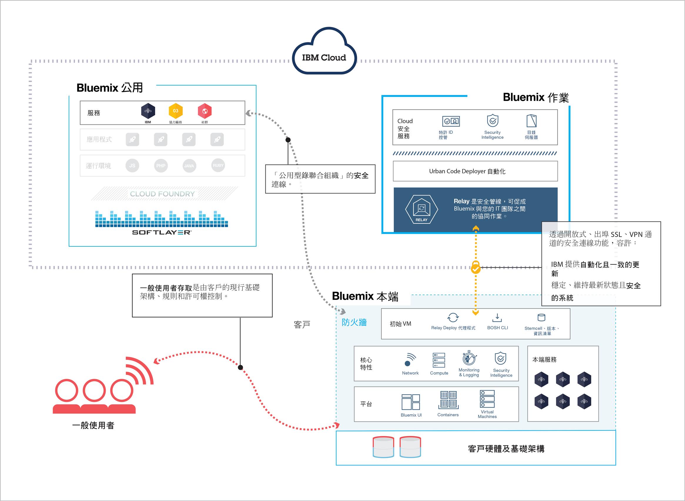
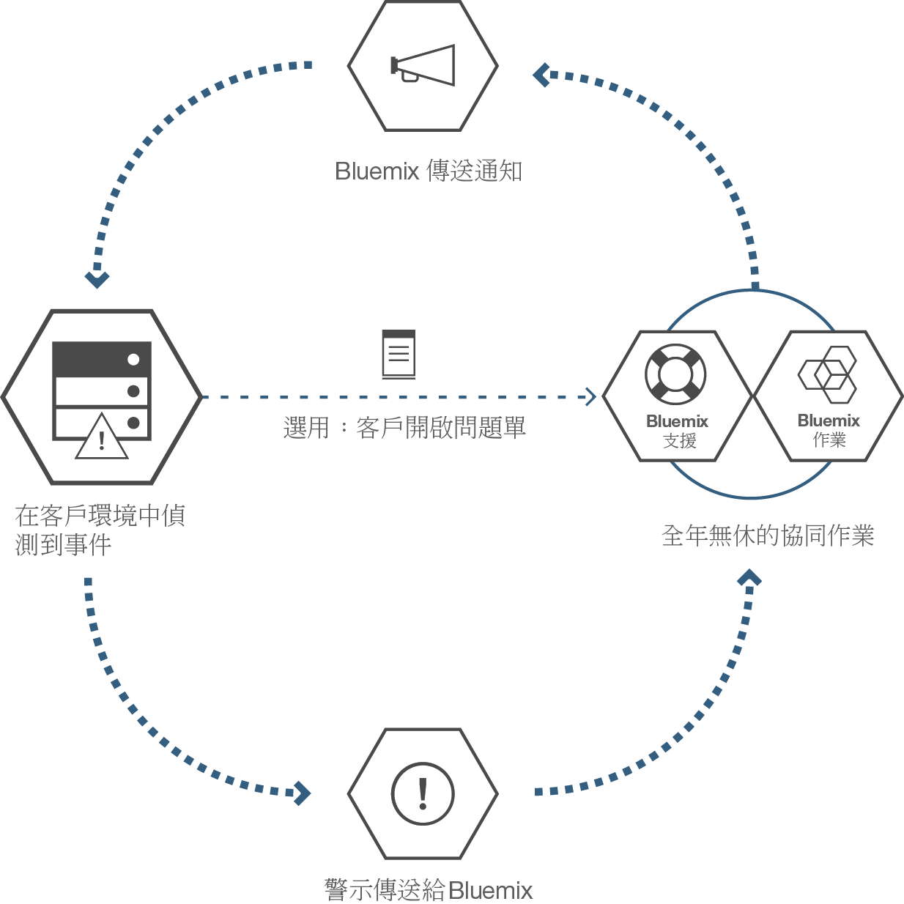

---

 

copyright:

  years: 2015, 2016

 

---

{:new_window: target="_blank"}
{:shortdesc: .shortdesc}

#{{site.data.keyword.Bluemix_notm}} 本端
{: #local}
*前次更新：2016 年 5 月 16 日*

「{{site.data.keyword.Bluemix}} 本端」將 {{site.data.keyword.Bluemix_notm}} 雲端型平台的功能及靈活性帶給資料中心。使用「{{site.data.keyword.Bluemix_notm}} 本端」，您可以利用公司防火牆來保護最機密的工作量，同時安全地連接至「{{site.data.keyword.Bluemix_notm}} 公用」並與它同步。
{:shortdesc}

IBM® 使用雲端作業作為服務來監視及維護您的環境，因此您可以專注於建置在環境之上執行的應用程式及服務。IBM 也會處理平台更新，讓您可以專注於事業。

就作業安全而言，「{{site.data.keyword.Bluemix_notm}} 本端」環境的安全標準與公用 {{site.data.keyword.Bluemix_notm}} 相同。您提供的硬體及基礎架構，可讓您控制基礎架構及實體安全。開發人員對本端 {{site.data.keyword.Bluemix_notm}} 的存取是透過 LDAP 原則所控制，而 {{site.data.keyword.Bluemix_notm}} 團隊可以在設定環境時配置 LDAP 原則。在本端環境內，您可以使用「管理」頁面來管理使用者角色及許可權。

「{{site.data.keyword.Bluemix_notm}} 本端」包含所有內含的 {{site.data.keyword.Bluemix_notm}} 執行時期，以及 64 GB 的運算記憶體。

此外，還會有一組服務可用作「{{site.data.keyword.Bluemix_notm}} 本端」服務。請檢閱下表，以查看所含項目及您可購買的項目。

*表 1. 本端服務及執行時期*

| **類型** | **名稱** | **說明** |
|----------|----------|-----------------|
|內含 | {{site.data.keyword.Bluemix_notm}} 執行時期 | 使用執行時期可快速啟動並執行您的應用程式，而不需要設定及管理機器和作業系統。您可以在「{{site.data.keyword.Bluemix_notm}} 本端」實例中使用所有 {{site.data.keyword.Bluemix_notm}} 執行時期。|
|選用 | {{site.data.keyword.APIM}} | 使用 {{site.data.keyword.APIMfull}} 服務來組合、管理及社交化 API。您可以使用 Proxy URL 或組合來自 HTTP 資料來源中的資料，以匯入 API 與資源。使用 {{site.data.keyword.APIM}} 服務的好處是您可以管理 API 的使用方式。 |
|內含 | {{site.data.keyword.autoscaling}}| 根據原則，動態增加或減少應用程式的運算資源能力。使用此服務，即可在「{{site.data.keyword.Bluemix}} 本端」環境中無限制地使用。|
|選用 | {{site.data.keyword.datacshort}} | 此服務提供記憶體內的資料網格，它支援應用程式的分散式快取情境。包含 50 GB 的記憶體內快取。 |
|選用 | {{site.data.keyword.sescashort}} | 為了提高備援，{{site.data.keyword.sescashort}} 會提供快取中所儲存階段作業的抄本。因此，電壓過低或作業中斷時，用戶端應用程式仍然保有快取中階段作業的存取權。此服務支援 Web 及行動式應用程式的階段作業快取情境。 |
|選用 | {{site.data.keyword.iot_full}} | 此服務可讓您的應用程式與已連接的裝置、感應器及閘道進行通訊，並且取用這些項目所收集的資料。本端基本供應項目包括起始環境，此環境允許在本端環境內執行專用版本的 {{site.data.keyword.iot_full}}，其容量為 100,000 台同時連接的裝置或應用程式，以及 1.6 TB 的資料交換。 |

您可以選購一些元件來擴充及延伸您的資源和服務容量。聯絡銷售團隊，即可購買所有這些元件；如需聯絡業務代表的相關資訊，請移至[與我們聯絡](https://console.ng.bluemix.net/?direct=classic/#/contactUs/cloudOEPaneId=contactUs)。若要增加服務的方案，您可以從型錄的服務磚選取方案。

*表 2. 選購元件*

| **名稱** | **說明** |
|----------|-----------------|
|「{{site.data.keyword.Bluemix_notm}} 本端」存取一次性設定 | 部署及配置本端環境的一次性設定費用。 |
|「{{site.data.keyword.Bluemix_notm}} 本端」運算資源 16 GB 容量增加 | 延伸「IBM {{site.data.keyword.Bluemix_notm}} 本端」運算資源，以提供額外的 16 GB 記憶體容量。 |
|{{site.data.keyword.Bluemix_notm}} Data & Session Cache 50 GB 容量增加 | 此環境允許部署及執行 Data Cache 和 Session Cache 實例，最多有 50 GB 的累積容量。 |
|「{{site.data.keyword.Bluemix_notm}} 本端」{{site.data.keyword.APIM}} 500 個 API 呼叫容量增加 | 此環境允許針對容量為每秒 500 個 API 呼叫的 {{site.data.keyword.Bluemix_notm}} 執行專用版本的 {{site.data.keyword.APIM}}。 |
|「{{site.data.keyword.Bluemix_notm}} {{site.data.keyword.iot_short}} 本端」漸進式增加 | 「{{site.data.keyword.iot_full}} 本端」基本供應項目再加上一個環境，此環境允許在本端環境內執行專用版本的 {{site.data.keyword.iot_full}}，其容量為 100,000 台同時連接的裝置或應用程式，以及 0.5 TB 的資料交換。 |

**附註**：「{{site.data.keyword.Bluemix_notm}} 本端」元件可能會指出特定的已配置容量（例如 GB 數或每秒交易數）。因為任何雲端服務配置的實際容量實際上會因許多因素而不同，所以實際容量實際上可能會高於或低於已配置的容量。

### 聯合型錄

「{{site.data.keyword.Bluemix_notm}} 本端」包含一份專用聯合型錄，以顯示只供您使用的本端服務。它也包含來自「{{site.data.keyword.Bluemix_notm}} 公用」且可供您使用的其他服務。

聯合型錄提供建立包含公用及專用服務之混合式應用程式的功能。您可以選擇根據資料隱私及安全準則來決定符合商業需求的公用服務。如果它是適用於您本端環境的服務專用實例，您會看到型錄中的服務磚含有「本端」標籤。同樣地，如果它是自訂服務，則會看到列有服務磚的「自訂」。 

*表 3. 可從「{{site.data.keyword.Bluemix_notm}} 公用」聯合組織的服務（依地區）*

|服務	|可在美國南部地區使用	|可在歐洲英國地區使用 |可在澳洲雪梨地區使用|
|:----------|:------------------------------|:------------------|:------------------|
|{{site.data.keyword.alchemyapishort}} 		|是	   	|是  		|是|
|{{site.data.keyword.alertnotificationshort}}		|是		|是			|是		|
|{{site.data.keyword.appseccloudshort}}		|是		|是		|是 |
|{{site.data.keyword.hadoopst}}			|是		|否		|否 |
|{{site.data.keyword.APIM}}			|是		|是		|是 |
|{{site.data.keyword.rules_short}}		|是		|是		|是 |
|{{site.data.keyword.cloudant}}			|是		|是		|是 |
|{{site.data.keyword.conceptexpansionshort}}	|是		|是		|是|
|{{site.data.keyword.conceptinsightsshort}}	|是		|是		|是 |
|{{site.data.keyword.dashdbshort}}		|是		|是		|是 |
|{{site.data.keyword.dataworks_short}}		|是		|是		|否|
|{{site.data.keyword.DB2OnCloud_short}}		|是		|是		|是 |
|{{site.data.keyword.dialogshort}}		|是		|是		|是|
|{{site.data.keyword.documentconversionshort}}	|是		|是		|是|
|{{site.data.keyword.game}}			|否		|否		|是 |
|{{site.data.keyword.geospatialshort_Geospatial}}	|是	|是		|是 |
|{{site.data.keyword.GlobalizationPipeline_short}}	|是		| 是		| 是 |
|{{site.data.keyword.identitymixershort}}		|是		|是		|是|
|{{site.data.keyword.twittershort}}		|是		|是		|是|
|{{site.data.keyword.weather_short}}		|是		|是		|是|
|{{site.data.keyword.languagetranslationshort}}	|是		|是		|是 |
|{{site.data.keyword.eventhubshort}}		|是		|否		|否|
|{{site.data.keyword.messagehub}}		|是		|是		|否|
|{{site.data.keyword.macm_short}}		|是		|是		|是|
|{{site.data.keyword.manda}}			|是		|是		|是 |
|{{site.data.keyword.amashort}}			|是		|是		|是 |
|{{site.data.keyword.mqa}}			|是		|是		|是 |
|{{site.data.keyword.mql}}			|是		|是		|是 |
|{{site.data.keyword.nlclassifierlshort}} 	|是 		|是 		|是|
|{{site.data.keyword.personalityinsightsshort}}	|是		|是		|是|
|{{site.data.keyword.pm_short}}			|是		|是		|否 |
|{{site.data.keyword.presenceinsightsshort}}	|是		|是		|是|
|{{site.data.keyword.mobilepush}}		|是		|是		|是 |
|{{site.data.keyword.questionandanswershort}}	|是		|是		|是|
|{{site.data.keyword.relationshipextractionshort}}	|是	|是		|是|
|{{site.data.keyword.retrieveandrankshort}}	|是 		|是 		|是|
|{{site.data.keyword.runbook_short}}		|是		|是		|是|
|{{site.data.keyword.SecureGateway}}		|是		|是		|是 |
|{{site.data.keyword.ssofull}}			|是		|否		|否|
|{{site.data.keyword.speechtotextshort}}	|是 		|是	 	|是|
|{{site.data.keyword.streaminganalyticsshort}}	|是		|是		|是 |
|{{site.data.keyword.texttospeechshort}} 	|是 		|是	 	|是|
|{{site.data.keyword.toneanalyzershort}} 	|是 		|是 		|是|
|{{site.data.keyword.tradeoffanalyticsshort}}	|是		|是		|是|
|{{site.data.keyword.visualinsightsshort}}	|是		|是		|是|
|{{site.data.keyword.visualrecognitionshort}}	|是 		|是	 	|是|
|{{site.data.keyword.iot_short}}		|是		|是		|否|
|{{site.data.keyword.workflow}}			|是		|是		|是 |
|{{site.data.keyword.workloadscheduler}}	|是		|是		|是 |

## {{site.data.keyword.Bluemix_notm}} 本端架構
{: #localarch}

「{{site.data.keyword.Bluemix_notm}} 本端」位在受公司防火牆保護的虛擬機器上，以提供您最高效能且最安全的雲端基礎架構。IBM 透過 IBM 的「轉遞」技術來安裝、遠端監視及管理資料中心中的「{{site.data.keyword.Bluemix_notm}} 本端」。如需如何在本端環境中設定 {{site.data.keyword.Bluemix_notm}} 以及 IBM 如何維護本端實例的相關資訊，請檢閱下圖：

*圖 1. {{site.data.keyword.Bluemix_notm}} 本端架構*

初始虛擬機器在受客戶防火牆保護的網路中執行，該網路透過「轉遞」對 IBM 作業中心具有出埠連線功能。{{site.data.keyword.Bluemix_notm}} 平台元件及支援平台元件的核心特性，會在一個隔離的專用虛擬區域網路 (VLAN) 中執行。「{{site.data.keyword.Bluemix_notm}} 本端」將 VLAN 用於專用子網路。使用專用子網路（而不使用公用 VLAN）不但更為安全，而且還有助於避免發生遞送問題。這組支援平台的核心特性包括下列各項：

<dl>
<dt>**監視及記載**</dt>
<dd>監視及記載特性是透過「轉遞」部署在資料中心內，而資料則保留在您的資料中心內。根據定義的警示準則，將警示傳回給 IBM 作業中心。傳回給 IBM 的警示中不包括機密性資訊。</dd>
<dt>**網路**</dt>
<dd>「轉遞」是「{{site.data.keyword.Bluemix_notm}} 本端」所含的交付網路。「轉遞」可讓 IBM 自動且一致地將最新的更新交付給所有本端部署，讓您隨時擁有最新且安全的系統。此通道上的資料流量是自動化活動，可以為您的實例提供及維護平台、運算資源及服務。資料流量包括 IBM 作業中心用來完成本端實例問題判斷的監視功能。如需「轉遞」的相關資訊，請參閱[轉遞](index.html#localrelay)。</dd>
<dt>**運算**</dt>
<dd>「{{site.data.keyword.Bluemix_notm}} 本端」根據 Cloud Foundry 來使用以應用程式為中心的執行時期環境。</dd>
<dt>**安全智慧**</dt>
<dd>
IBM 使用 QRadar Security Intelligence Platform 來提供用於整合數個金鑰元件的統一架構。這些元件包括安全資訊及事件管理、日誌管理、異常偵測、事件鑑識，以及配置和漏洞管理。Bluemix 也會使用 IBM QRadar 安全資訊及事件管理 (SIEM)，來監視特許使用者動作以及應用程式開發人員的成功和不成功登入嘗試。QRadar 報告可讓客戶透過「管理」頁面的「報告及日誌」區段來查看該事件資料。如需安全報告的相關資訊，請參閱[檢視報告](../admin/index.html#oc_report)。

IBM BigFix 確保依適當的頻率套用作業系統的修正程式。修補程序是自動化程序，而且您與 IBM 都同意排程。如需維護及升級的相關資訊，請參閱[維護本端實例](index.html#maintainlocal)。

</dd>
</dl>

您的應用程式部署在 Cloud Foundry 虛擬機器上執行的虛擬儲存器內。設定 {{site.data.keyword.Bluemix_notm}} 時，已部署所有 Cloud Foundry 元件（例如雲端控制器、性能管理程式、路由器及 Droplet Execution Agent (DEA)）。各種 {{site.data.keyword.Bluemix_notm}} 管理元件也會包括在 {{site.data.keyword.Bluemix_notm}} 部署中。

DataPower 應用裝置提供對 {{site.data.keyword.Bluemix_notm}} 應用程式網域的存取。這些應用裝置會連接至可從您的內部網路存取的網路。部署應用程式及服務的使用者可從您的內部網路存取的網路進行存取。您必須提供 7 個具有出埠網際網路存取權的 IP 位址。DataPower 應用裝置會從這些客戶 IP 位址遞送至隔離的 {{site.data.keyword.Bluemix_notm}} 部署。如需網路規格和基礎架構需求的相關資訊，請參閱 [{{site.data.keyword.Bluemix_notm}} 本端基礎架構需求](../local/index.html#localinfra)。

### 轉遞
{: #localrelay}

「轉遞」是「{{site.data.keyword.Bluemix_notm}} 本端」所含的交付功能。「轉遞」可讓 IBM 自動且一致地將最新的更新交付給所有本端部署，讓您隨時擁有最新且安全的系統。轉遞會使用每一個「{{site.data.keyword.Bluemix_notm}} 本端」實例特有的憑證，透過源自初始虛擬機器的開放式、出埠 SSL、VPN 通道以內部部署方式來達成安全連線功能。初始虛擬機器中具有所有起始 {{site.data.keyword.Bluemix_notm}} 版本，同時作為進行部署及更新的自動化代理程式機器。SSL 連線源自初始虛擬機器。重新建立與 {{site.data.keyword.Bluemix_notm}} 自動化伺服器的安全連線之後，IBM 會檢查 {{site.data.keyword.Bluemix_notm}} 版本是否最新及其一致性，並開始部署更新。

此通道上的資料流量是自動化活動，可以為您的實例提供及維護平台、運算資源及服務。資料流量包括 IBM 作業中心用來完成本端實例問題判斷的監視功能。出埠 Web 埠 443 用於此連線。IBM 使用「轉遞」功能以透過一致的測試及驗證來交付平台更新。此程序確保所有推送至本端環境的部署都能保持穩定且安全。

只有在本端環境上與您一起工作的 IBM 團隊才能安全地存取您的 {{site.data.keyword.Bluemix_notm}} 實例。在連線程序的多個步驟期間使用雙重鑑別，以保護本端環境存取的安全。IBM 提供可存取您環境的已核准使用者及 ID 清單，之後您就可以審核任何對您環境的存取。透過產生安全報告，即可找出誰存取您的環境，以及其存取時間和原因。如需產生安全報告的相關資訊，請參閱[安全報告](../security/index.html#reports)。

您可以使用管理者身分完整查看環境的發生事件、問題、變更、容量及安全管理。您可以使用「管理」頁面來存取您環境的相關資訊。「轉遞」技術會使用最新的資料，讓「管理」頁面保有最新資料。如需進行更新及問題修復的使用者存取權、安全日誌、聯合型錄控制及通訊的相關資訊，請參閱[管理 {{site.data.keyword.Bluemix_notm}} 本端及 {{site.data.keyword.Bluemix_notm}} 專用](../admin/index.html#mng)。

##設定 {{site.data.keyword.Bluemix_notm}} 本端實例
{: #setuplocal}

「{{site.data.keyword.Bluemix_notm}} 本端」的設計，是為了提供「{{site.data.keyword.Bluemix_notm}} 公用」供應項目的專用版本，這不只裝載在您自己的硬體，並且也由您進行管理。您可以使用 {{site.data.keyword.Bluemix_notm}} 服務及執行時期，支援客戶所管理的安全雲端環境中的運算需求。

IBM 讓您能使用受到密碼保護的登入方式來存取「{{site.data.keyword.Bluemix_notm}} 本端」。您可以存取服務、執行時期及關聯的資源，也可以部署和移除 {{site.data.keyword.Bluemix_notm}} 應用程式。請檢閱下列步驟，與 IBM 業務代表一起設定 {{site.data.keyword.Bluemix_notm}} 的本端實例。

若要設定您的 {{site.data.keyword.Bluemix_notm}} 專用版本，請執行下列動作：

<ol>
<li>檢閱用於設定本端實例的「<a href="index.html#localinfra">{{site.data.keyword.Bluemix_notm}} 本端」基礎架構需求</a>。</li>
<li>若要開始使用，請與您的 IBM 指定客戶業務代表聯絡，或與 <a href="https://console.ng.bluemix.net/?direct=classic/#/contactUs/cloudOEPaneId=contactUs" target="_blank">{{site.data.keyword.Bluemix_notm}}</a> 聯絡。</li>
<li>建立與 IBM 的「{{site.data.keyword.Bluemix_notm}} 本端」合約，其中包括交付的里程碑日期。
	<ol type="a">
	<li>與 IBM 一起處理您的「{{site.data.keyword.Bluemix_notm}} 本端」實例費用。每月的經常性費用是根據您要使用的本端服務，再加上所有 {{site.data.keyword.Bluemix_notm}} 公用服務的訂閱。您會收到關於任何超出訂閱合約之使用項目的發票。</li>
	<li>識別設定「{{site.data.keyword.Bluemix_notm}} 本端」實例的每一個階段的截止時間。</li>
	</ol>
	</li>
<li>建立平台及帳戶之後，識別組織中負責維持本端實例運作所需角色的人員。如需您可指派之角色的相關資訊，請參閱 <a href="index.html#rolesresponsibilities" target="_blank">{{site.data.keyword.Bluemix_notm}} 本端角色及責任</a>。</li>
<li>您提供硬體，而 IBM 協助您定義並建立公司網路與「{{site.data.keyword.Bluemix_notm}} 本端」實例之間的網路連線功能。如需基礎架構需求的相關資訊，請參閱<a href="index.html#localinfra">「{{site.data.keyword.Bluemix_notm}} 本端」基礎架構需求</a>。
	<ol type="a">
	<li>IBM 會根據您提供的資訊，配置網路存取權及 LDAP。管理存取權會授與給您指定的聯絡人。您也必須指定聯絡人來負責支援及計費。</li>
	<li>IBM 會在您的本端環境中設定聯合型錄，以顯示您的本端服務及許多公用 {{site.data.keyword.Bluemix_notm}} 服務。</li>
	<li>您會驗證網路和防火牆配置，以及 LDAP 端點和存取權。</li>
	</ol>
</li>
</ol>

對您的環境進行初始部署和配置的過程應類似於下列清單。如需每個作業負責人員的詳細資料，請參閱[角色及責任](../local/index.html#rolesresponsibilities)。

<ol>
<li>您提供符合運算資源、網路和儲存體之規格的 VMware 配置。如需基礎架構需求的相關資訊，請參閱 <a href="../local/index.html#localinfra">{{site.data.keyword.Bluemix_notm}} 本端基礎架構需求</a>。</li>
<li>您提供要由初始虛擬機器使用的 vCenter 叢集認證。您必須提供下列資訊：
<ul>
<li>VMware 叢集的名稱</li>
<li>vCenter 叢集認證（包括使用者 ID 和密碼）</li>
<li>一個或多個資料儲存庫名稱（儲存體 LUN 名稱）</li>
<li>VLAN ID/VMware 埠群組</li>
<li>資源儲存區名稱</li>
</ul>
</li>
<li>您與 IBM 合作，一起驗證您在前一個作業中提供的認證。</li>
<li>您提供自己網路上的 7 個 IP 位址。如果您有安全的 Web Proxy，容許內部 {{site.data.keyword.Bluemix_notm}} 元件對網際網路進行出埠存取，則必須提供認證以便進行連接。

**附註**：如果您的 Web Proxy 不是安全的 Proxy，則無需提供認證。另請注意，並非所有「{{site.data.keyword.Bluemix_notm}} 本端」客戶都使用 Web Proxy。
</li>
<li>IBM 提供一個 URL 白名單，在開始部署之前，您必須容許這些 URL 可通過您的 Web Proxy。 

**附註**：URL 白名單確實包含例如 twitter.com、facebook.com 及 youtube.com 等網站。如果不容許這些 URL，則可能無法使用 {{site.data.keyword.Bluemix_notm}} 的特定服務及區域。

</li>
<li>您為部署指定網域名稱，以及要使用的 ID。設定本端實例時，您會得到兩個局部定義的網域，請挑選這兩個網域的字首。例如，挑選 <code>*mycompany*.bluemix.net</code> 和 <code>*mycompany*.mybluemix.net</code> 的字首。然後，還可以選擇完整網域來建立自訂網域。

您可以根據自己的需要選擇任意數量的自訂網域。不過，您應負責取得自訂網域的憑證。如需建立自訂網域的相關資訊，請參閱<a href="../manageapps/updapps.html#domain">建立及使用自訂網域</a>。
</li>
<li>您選擇要使用何種技術（IPSec 或 OpenVPN 通道）來配置「轉遞」，以便連回 IBM 作業中心。</li>
<li>IBM 在 {{site.data.keyword.Bluemix_notm}} 叢集內安裝並啟動初始虛擬機器。如果您提供自己的 VMware，則 IBM 業務代表會協助您的客戶代表來完成此作業。</li>
<li>IBM 配置「轉遞」，以便連回 IBM 作業中心與之進行通訊。</li>
<li>初始虛擬機器儲存庫拉入更新後的建置構件。</li>
<li>您提供認證，供 IBM 連接至公司的 LDAP 目錄實例。</li>
<li>IBM 使用自動化來部署核心 {{site.data.keyword.Bluemix_notm}} 平台。</li>
<li>IBM 部署核心平台，其中包含彈性執行時期、主控台、管理特性和監視。</li>
<li>IBM 配置您對環境的管理存取權。</li>
<li>IBM 將您的聯合型錄從本端部署鏈結至「公用 {{site.data.keyword.Bluemix_notm}}」實例，以便使用公用服務。依預設，本端實例中會提供一組公用服務。您可以使用管理頁面進行型錄管理，以便為本端實例開啟或關閉服務。</li>
<li>您可以開始使用您的本端實例來回應警示，該實例由 IBM 作業中心的團隊進行監視。</li>
</ol>

在設定 {{site.data.keyword.Bluemix_notm}} 實例之後，您可以使用「管理」頁面來監視和管理 {{site.data.keyword.Bluemix_notm}} 實例。如需相關資訊，請參閱[管理 {{site.data.keyword.Bluemix_notm}} 本端和專用](../admin/index.html#mng)。如需升級和維護的相關資訊，請參閱[維護本端實例](index.html#maintainlocal)。

##角色及責任
{: #rolesresponsibilities}

如果您設定「{{site.data.keyword.Bluemix_notm}} 本端」帳戶，請識別組織中負責維持實例運作所需角色的人員。

###角色

下列清單顯示您可指派的客戶角色及責任：

<dl>
<dt>**採購聯絡人**</dt>
<dd>與 IBM 業務代表一起建立您的「{{site.data.keyword.Bluemix_notm}} 本端」環境，包括識別您組織中處理專案任何層面的正確人員。指派給這個角色的人員會監督模式選擇、商業安排，以及客戶資源存取的安排。採購聯絡人是設定本端實例的整體聯絡人。</dd>
<dt>**規範管理者**</dt>
<dd>與 IBM 業務代表一起選取符合您安全需求的拓蹼及部署選項。指派給這個角色的人員會與 IBM 規範顧問一起確定哪些部署模式能達到規範目標。</dd>
<dt>**網路專家**</dt>
<dd>與 IBM 業務代表一起訂定 {{site.data.keyword.Bluemix_notm}} 部署的網路計劃。指派給這個角色的人員會檢查 IBM 所需的必要網路規格，並與 IBM 一起訂定實作計劃。安裝及驗證階段結束時，指派給這個角色的人員會進行核准，確認網路配置符合組織標準。</dd>
<dt>**DevOps 聯絡人**</dt>
<dd>與 IBM 業務代表一起計劃並套用 {{site.data.keyword.Bluemix_notm}} 平台、服務及執行時期所需的維護更新作業。指派給這個角色的人員也會與 IBM 業務代表一起配置您的「{{site.data.keyword.Bluemix_notm}} 本端」實例。</dd>
<dt>**IaaS 專家**</dt>
<dd>與 IBM 業務代表一起訂定 VMware 的部署計劃。一般而言，這是資料中心的一位 VMware 管理者。指派給這個角色的人員會檢查 <a href="../local/index.html#localinfra">{{site.data.keyword.Bluemix_notm}} 本端基礎架構需求</a>，以及與 IBM 一起訂定實作計劃。部署結束時，指派給這個角色的人員會進行核准，確認部署符合 IaaS 層的組織標準。</dd>
</dl>

您的客戶代表會與其他合作的 IBM 專家一起合作，確保您隨時擁有所需的支援。您可以升級至「高階」支援層，以與您帳戶的專用「客戶成功經理 (CSM)」合作。如需不同支援層的相關資訊，請參閱[聯絡支援中心](../support/index.html#contacting-support)。CSM 會完成下列類型的作業：

<ul>
<li>提供您與 IBM 之間的技術協調。</li>
<li>協調更新、升級、IBM 的專家協助，以及 {{site.data.keyword.Bluemix_notm}} 支援工程師的起始啟用。</li>
<li>提供可用支援類型的相關資訊。</li>
<li>視需要擔任起始呈報人。</li>
</ul>

與您一起處理 {{site.data.keyword.Bluemix_notm}} 實例的 {{site.data.keyword.Bluemix_notm}} 支援及作業團隊可能會存取本端環境，但只會因為下列原因而這麼做。

<ul>
<li>回應警示，並執行作業維護</li>
<li>嘗試重新產生支援問題單上所報告的問題</li>
</ul>

###責任

從設定您的環境一直到持續維護，您和 IBM 必須完成各種作業。下列各表概述在初始、進度及完成階段完成作業的必要作業及擁有者。

初始階段用來建立「{{site.data.keyword.Bluemix_notm}} 本端」環境。此刻，您已檢閱[本端基礎架構需求](../local/index.html#localinfra)。此階段的主要目標包括下列各項：

- 審查財務合約，並建立交付的里程碑日期。
- 建立 {{site.data.keyword.Bluemix_notm}} 平台，並提供執行時期及服務的存取權。
- 定義並建立貴公司網路與 {{site.data.keyword.Bluemix_notm}} 作業之間的網路連線功能。
- 識別並指派管理團隊的角色。

*表 4. 初始階段作業*

| **作業** | **作業詳細資料** | **負責單位** |
|----------|------------------|-----------------------|
|設定規範標準 | 識別環境所需的政府、產業及專屬組織標準。 | 客戶 |
|建立安全及規範整合計劃 | 建立安全及整合計劃，以包括達成安全規範所需的成本、排程及資源。 | IBM |
|規範計劃核准 | 核准規範計劃。 | 客戶 |
|建立環境的大小 |  	根據預先定義選項來建立環境大小，這些選項考慮高可用性及災難回復目標，以及支援使用平台所建立的應用程式所需的起始 DEA 及服務佈建。例如，您與 IBM 一起定義所需的資料庫、客戶聯合型錄中提供的服務等等。 | IBM 及客戶皆負有責任 |
|選取架構 | 根據考慮高可用性及災難回復需求的預先定義選項來選取架構。 | IBM |
|定義災難回復目標 | 定義環境的災難回復需求。 | 客戶 |
|建立災難回復計劃 | 諮詢並定義災難回復計劃。IBM 會建立災難回復模型，並向您諮詢提供意見並核准計劃的位置。 | IBM 及客戶皆負有責任 |
|建立備份及回復計劃 | 建立備份及回復計劃，以定義在現場及異地分散備份的頻率及需求。IBM 會備份平台元件、IBM 服務中心、服務 meta 資料（包括使用者角色）等等。您要備份您負責的任何應用程式特有資料。 | IBM 及客戶皆負有責任 |
|識別進行事件偵測及問題判斷的工具 | 識別用於在 {{site.data.keyword.Bluemix_notm}} 平台層次進行事件偵測及問題判斷的 IBM 及協力廠商工具。 | IBM |
|定義提升計劃 | 定義提升計劃來分類並解決從監視元件偵測到的事件。 | IBM |
|簽署基礎架構、平台及支援合約 | 簽署訂閱合約（包括環境的財務條款）。簽署支援訂閱。 | 客戶 |
|採購環境 | 採購運算資源、網路及儲存體。如需環境基礎架構需求的相關資訊，請參閱[本端基礎架構需求](../local/index.html#localinfra)。 | 客戶 |
|安裝 VPN 解決方案 | 安裝雙向 VPN 解決方案。 | IBM |
|安裝平台、應用程式，以及監視和管理元件 | 安裝、配置及驗證平台元件（例如 BOSH Director、「雲端控制器」、「性能管理程式」、傳訊、路由器、DEA 及服務提供者），以及提升及問題偵測計劃中所定義的監視元件。 | IBM |
|安裝並配置安全元件 | 安裝並配置嵌入監視及提升計劃的安全元件（包括 IBM QRadar、認證儲存庫、侵入防禦系統、IBM BigFix 及「IBM Security 特許身分管理」）。 | IBM |
|配置登入伺服器 | 配置要與公司 LDAP 搭配使用的登入伺服器。 | IBM |
|安裝並配置自訂元件 |  	安裝並配置位在 {{site.data.keyword.Bluemix_notm}} 產品及服務範圍外部的自訂元件。 | 客戶 |
|連接 {{site.data.keyword.Bluemix_notm}} 管線 | 連接 {{site.data.keyword.Bluemix_notm}} 持續整合及持續交付管線與 IBM 儲存庫。 | IBM |
|自訂外部解決方案元件 | 針對災難回復情境自訂負載平衡器。 | 客戶 |
|追蹤安全、規範及審核控制的狀態  | 追蹤狀態，直到所有工具及處理程序都準備好可達到所識別的規範為止。 | 客戶 |
|檢查實體基礎架構 | 檢查可管理威脅解決方案元件的實體場所，並檢查保護資料中心用的安全控制。 | 客戶 |
|檢查監視軟體 | 檢查監視及管理元件（如提升及問題判斷計劃中所定義）。 | 客戶 |
|檢查 OS | 檢查以確保作業系統映像檔符合規範標準。IBM 提供 OS 映像檔的存取權。 | IBM 及客戶皆負有責任 |

接下來是進度階段。進度階段說明您與 IBM 之間的進行中協同關係。此階段的主要目標包括下列各項：

- 檢查容量，並協調進行必要調整。
- 檢查維護及平台增進功能。
- 協調進行問題解決及主要原因分析的活動。

*表 5. 進度階段作業*

| **作業** | **作業詳細資料** | **負責單位** |
|----------|------------------|-----------------------|
|檢閱每週容量報告 | 檢閱每週容量報告，並視需要採取更正動作。 | 客戶 |
|建立按月預測 | 收集資訊，並建立容量及耗用量的按月預測。 | IBM 及客戶皆負有責任 |
|檢閱容量預測 | 檢閱容量預測，因為它們與可能影響容量的外部事件，以及預期的新應用程式部署有關。與 IBM 一起據此檢閱預測及計劃。 | IBM 及客戶皆負有責任 |
|調整容量 |  隨著需求的變更來新增或移除容量。 | IBM |
|發佈即將到來的更新及維護 | 建立進行必要 IBM 元件維護的文件。 | IBM |
|執行維護 | 與 IBM 一起排定 21 天時間範圍內的必要維護。您可以提供 21 天時間範圍內無法進行的日期，而 IBM 會據此排定維護。 | IBM 及客戶皆負有責任 |
|處理佈建失敗 | 修正部署至「型錄」之客戶建立服務的佈建失敗（發生時）。 | IBM |
|執行網路及 IP 掃描 | 執行每日及每月網路和 IP 掃描。 | IBM 及客戶皆負有責任 |
|提供審核日誌的存取權 | 提供所有安全及管理審核日誌的存取權。   | IBM 及客戶皆負有責任 |
|進行測試 | 進行定期「重要作業控制 (KCO)」測試及協力廠商滲透測試。 | IBM 及客戶皆負有責任 |
|狀態報告、審核協調及規範會議  | 完成狀態報告、外部審核協調，以及規範審查狀態會議的呈現。 | IBM |
|聘雇及商業需求驗證 | 完成可存取客戶環境之 IBM 業務代表的每季聘雇驗證及持續商業需求驗證。 | IBM |
|解決安全漏洞 | 解決平台中所報告的安全漏洞。 | IBM |

最終階段「完成」代表您與 IBM {{site.data.keyword.Bluemix_notm}} 之間的關係結束。此階段的主要作業包括下列各項：

* 結束財務合約
* 移除所有網路連線
* 回收基礎架構

*表 6. 完成階段作業*

| **作業** | **作業詳細資料** | **負責單位** |
|----------|------------------|-----------------------|
|結束財務合約 | 討論並同意結束財務合約。 | IBM 及客戶皆負有責任 |
|解除任務環境 | 關閉環境的存取權及認證。 | IBM 及客戶皆負有責任 |
|關閉轉遞 | 終止「轉遞」連線。 | IBM |
|回收基礎架構 | 根據公司準則，回收基礎架構。 | 客戶 |

## {{site.data.keyword.Bluemix_notm}} 本端基礎架構需求
{: #localinfra}

若為「{{site.data.keyword.Bluemix_notm}} 本端」，您掌控了管理本端實例的實體安全及基礎架構。IBM 針對設定「{{site.data.keyword.Bluemix_notm}} 本端」，設定了下列最低需求。

### 硬體

雖然有可用硬體類型及大小方面的需求，不過您可以選擇任何組合，以符合設定的資源需求總計。

<dl>
<dt>**VMware ESXi 硬體**</dt>
<dd>
ESXi 是一種在實體伺服器上執行的虛擬化層級，它會將處理器、記憶體、儲存體及資源抽象化成為多個虛擬機器。請根據每個 ESXi 的實體核心計數下限為八的條件，選擇符合下列資源總計的任何組合。下列規格僅適用於 {{site.data.keyword.Bluemix_notm}} 核心執行時期。
<ul>
<li>48 個實體核心，每一個為 2.0 以上的 GHz</li>
<li>756 GB 的實體 RAM</li>
<li>總計 7.5 TB 的資料儲存庫大小
<ul>
<li>7 TB 資料儲存庫，用來存放 {{site.data.keyword.Bluemix_notm}}</li>
<li>500 GB 資料儲存庫，用來存放初始虛擬機器</li>
</ul>
</li>
</ul>

<strong>附註：</strong>如果您使用多個資料儲存庫，請對每一個資料儲存庫使用相同的字首。

</dd>
<dt>**高可用性**</dt>
<dd>
若要支援單一節點失效，您必須具有 n+1 個 ESXi。例如，如果使用三個 ESXi（表示每一個有 16 個核心），則需要有第四個 ESXi。

<strong>附註：</strong>為了保證資源，客戶 VMware 管理者可能會決定要在叢集內施行嚴格的高可用性失效接手。

</dd>
<dt>**網路**</dt>
<dd>
建議的需求包括客戶可存取的埠群組，其中含有 7 個在相同子網路中具有出埠網際網路存取權的客戶網路 IP 位址。2 個埠由初始虛擬機器使用，3 個埠是供網域使用的虛擬 IP 位址，最後 2 個埠是 DataPower 的公用 IP 位址。然後，定義第二個專用 VLAN，僅在要用於「{{site.data.keyword.Bluemix_notm}} 本端」的 ESXi 之間使用。此 VLAN 在 VMware 中會顯示為埠群組。「{{site.data.keyword.Bluemix_notm}} 本端」會將它用於專用子網路，這樣更安全，且有助於避免發生遞送問題。 

使用下列埠：

<ul>
<li>埠 443，用於「轉遞」連線

**附註**：如果選擇使用 IPSec 通道，而不是 OpenVPN，請為此連線開啟一個客戶埠。
</li>
<li>埠 389 或 SSL 636，用於 LDAP 或 Active Directory 連線</li>
</ul>

**附註**：IBM 可偵測到網路連線是否中斷。如果網路連線已中斷，IBM 會聯絡您，並與您的網路專家一起來解決該問題。

</dd>
<dt>**網路上行鏈路**</dt>
<dd>使用兩個以上範圍從 1 到 10 Gbps 的介面（根據系統的預期工作量而定）。</dd>
</dl>

### vCenter 伺服器配置

請檢閱下列版本、資料中心、資源儲存區及資料儲存庫需求。

<dl>
<dt>**支援的 VMware 版本**</dt>
<dd>vCenter 及 ESXi 5.1、5.5 和 6.0</dd>
<dt>**支援的 VMware 類型**</dt>
<dd>vSphere Enterprise 
vSphere Enterprise plus（如果您計劃使用分散式虛擬交換器）</dd>
<dt>**資料中心**</dt>
<dd>建立資料中心（如果不存在）。</dd>
<dt>**資料中心資料夾**</dt>
<dd>如果您未計劃授與從資料中心延伸而來的「管理者」存取權，請建立與叢集同名的 VM 資料夾。</dd>
<dt>**叢集**</dt>
<dd>建立專門供「{{site.data.keyword.Bluemix_notm}} 本端」使用的叢集。叢集名稱的範例為 `bluemix`。</dd>
<dt>**資源儲存區**</dt>
<dd>在「{{site.data.keyword.Bluemix_notm}} 本端」叢集下建立資源儲存區。資源儲存區名稱的範例為 `local`。</dd>
</dt>**資料儲存庫**</dt>
<dd>需要 7.5 TB，用於起始部署 {{site.data.keyword.Bluemix_notm}}。 
 
**附註**：當您使用多個資料儲存庫時，請確定每一個資料儲存庫都以相同字首開始。具有相同字首的多個資料儲存庫名稱的範例為 `bluemix_datastore_01` 及 `bluemix_datastore_02`。</dd>
<dt>**網路**</dt>
<dd>您必須有一個具有出埠網際網路功能的客戶可存取網路。VLAN 管理在其中執行「Bluemix 本端」元件的專用子網路。所有資料流量都會從此專用子網路遞送至客戶子網路。客戶子網路 IP 用於所有對「Bluemix 本端」的存取。然後，您可以定義第二個專用 VLAN，僅在用於「Bluemix 本端」的 ESXis 之間使用。此 VLAN 在 VMware 中會顯示為埠群組。「Bluemix 本端」會將它用於專用子網路，這樣更安全，且有助於避免發生遞送問題。

如果您是使用 vSphere 分散式交換器 (vDS)，請建立資料夾來保留 vDS，並將 vDS 放在資料夾內。

</dl>

### 進行轉遞的網路頻寬

建議的傳輸量為上傳 5 Mbps 及下載 5 Mbps，而您可以預期每月資料使用量為 10 GB。IBM 會針對交付大型資料組合（可能高達 4 GB）的時機，建立協議的時間範圍。

### VMware 許可權

設定下列角色及許可權。延伸是針對每一個許可權設定的。如果延伸許可權，則許可權會透過物件階層向下傳遞。不過，子物件的許可權一律會置換從母項物件延伸而來的許可權。

<dl>
<dt>**vCenter 伺服器**</dt>
<dd>將角色設為唯讀且不會延伸。 
 
**附註**：需有這個角色，才能擷取特定磁碟作業的作業狀態。</dd>
<dt>**資料中心**</dt>
<dd>建立角色 "{{site.data.keyword.Bluemix_notm}}"，並授與下列許可權：
<ul>
<li>對於**資料儲存庫**，設定**低層次檔案作業**及**更新虛擬機器檔案**。</li>
<li>對於 **vApp**，設定**匯入**。</li>
<li>對於 **dvPort** 群組，設定**修改**。這僅適用於 vDS。</li>
</ul>
**附註**：需有這個角色，才能支援將檔案公佈至資料儲存庫。</dd>
<dt>**叢集**</dt>
<dd>將角色設為管理者並延伸。</dd>
<dt>**資料儲存庫**</dt>
<dd>針對每一個 {{site.data.keyword.Bluemix_notm}} 資料儲存庫將角色設為管理者並延伸。</dd>
<dt>**網路**</dt>
<dd><ul>
<li>對於 vSwitch，以管理者角色設定公開和私密埠群組，且不會延伸。</li>
<li>對於 vDS 上層資料夾，設定為唯讀，並進行延伸。</li>
<li>對於 vDS，以管理者角色設定公開和私密埠群組，且不會延伸。</li>
</ul>
</dd>
</dl>

### 增加 Droplet Execution Agent (DEA) 儲存區
每一個 DEA 都配置有：
- 16 - 32 GB 的 RAM
- 2x - 4x vCPU
- 150 - 300 GB 的儲存體

例如，如果 ESXi 主機大小為 256 GB 記憶體且具有 16 個核心，則會新增八個 DEA。如果 ESXi 主機大小為 64 GB 記憶體且具有 8 個核心，則需要新增兩個 ESXi 及四個 DEA。每四個 DEA 需要額外的 1.5 TB 儲存體。此範例是根據配置有 32 GB RAM、4 個 vCPU 及 300 GB 儲存體的 DEA。

## 維護本端實例
{: #maintainlocal}

當 IBM 認為適當時，即會維護並安裝 {{site.data.keyword.Bluemix_notm}} 執行時期和服務的更新及修正程式。在維護時間範圍期間，可能無法使用服務。此外，IBM 會與您一起合作來排定 {{site.data.keyword.Bluemix_notm}} 平台的維護更新。

「{{site.data.keyword.Bluemix_notm}} 本端」需要下列類型的維護：
<dl>
<dt>**服務的標準維護**</dt>
<dd>這些服務使用預先定義的標準維護時間範圍，這樣可能導致服務無法使用。IBM 不需要客戶核准即可執行服務維護，但是會嘗試將對服務的影響降到最低。 
 
IBM 會傳送廣播訊息，詳述針對「狀態」頁面上每一個維護時間範圍所規劃的變更。 
 
**重要事項**：在維護期間，部分服務可能無法使用。</dd>

<dt>**{{site.data.keyword.Bluemix_notm}} 平台的標準維護**</dt>
<dd>維護更新是根據 21 天的時間範圍內，您與 IBM 之間的協調來套用。您將您不適用但 IBM 適用的預先核准維護時間範圍及特定日期或時間提供給 IBM，來排定在所選取日期期間或大約時間進行更新。 

移至**管理 > 系統資訊**，以檢視已排定及擱置維護更新。如需設定預先核准時間範圍、設定無法使用日期以及檢視或核准維護更新的相關資訊，請參閱<a href="../admin/index.html#oc_schedulemaintenance">維護更新</a>。
</dd>
</dl>

**重要事項**：IBM 保留視需要岔斷服務以套用緊急維護的權利。IBM 可能會變更排定的維護時間，但是一旦有這樣的變更以及任何緊急維護資訊時，就會通知您。

如果在維護更新作業之後發生報告過的問題，請與「{{site.data.keyword.Bluemix_notm}} 支援中心」協議容許 IBM 回復更新是否最符合您的權益。達成協議之後，IBM 會回復更新，以將環境還原至前一個狀態。

## 發生事件回應及支援
{: #incidentresponse}

### 客戶偵測到的問題

如果您識別到需要 IBM 支援中心及作業注意的問題，則可以使用數種不同的方法來聯絡支援中心。如需如何聯絡支援中心的相關資訊，請參閱[聯絡支援中心](../support/index.html#contacting-bluemix-support-local)。根據問題，您及（或）IBM 會一起合作來修正問題。

### IBM 偵測到的嚴重事件

嚴重事件包含緊急、非預期的服務中斷，以及影響環境或使用者的穩定性問題。如果 IBM 在您的環境內偵測到嚴重事件，則會透過**狀態**頁面上的通知來通知您。您也可以檢查「狀態」頁面，以尋找平台或您服務的任何已知問題。如需「狀態」頁面的相關資訊，請參閱[檢視狀態](../admin/index.html#oc_status)。 

如果您要整合您的通知與支援 Webhook 的 Web 服務，請參閱[通知及事件訂閱](../admin/index.html#oc_eventsubscription)，以取得如何延伸通知功能的相關資訊。

*圖 2. 發生事件回應程序*

根據問題，您及（或）IBM 會一起合作來修正問題。如果您有關於發生事件的問題，或者需要 IBM 業務代表來協助您解決問題，則可以開啟支援問題單。如需如何聯絡支援中心的相關資訊，請參閱[聯絡支援中心](../support/index.html#contacting-bluemix-support-local)。

**附註**：我們會 24 小時全年無休地監視嚴重性 1 支援問題單。其他問題單的處理時間是從星期日晚上 10:00 GMT 到星期六凌晨 12:00 GMT。如需支援問題單嚴重性以及與支援中心合作的相關資訊，請參閱<a href="../support/index.html#contacting-bluemix-support-local">聯絡支援中心</a>。

## 災難回復
{: #dr}

「{{site.data.keyword.Bluemix_short}} 本端」災難回復的設定方式與使用「{{site.data.keyword.Bluemix_short}} 公用」類似。「{{site.data.keyword.Bluemix_short}} 公用」提供一個連續可用的平台，以使用多種失敗安全的措施來進行創新，確保您的組織、空間及應用程式隨時可用。將應用程式部署至多個地理區域會啟用持續可用性，以免於非計劃性地同時損失多個硬體或軟體元件，或損失整個資料中心，以便即使在某個地理位置發生自然災難時，仍將可以使用替代地理位置中的分散式「{{site.data.keyword.Bluemix_notm}} 公用」應用程式實例。
{: shortdesc}

透過應用程式的持續可用性、固有的平台高可用性以及發生失敗時還原實例的能力，可以達成「{{site.data.keyword.Bluemix_short}} 本端」的災難回復。您需要負責透過部署至多個地區，來啟用應用程式的持續可用性。高可用性是透過 Cloud Foundry 及其他元件中所含的技術建置於平台層次。而且，您可以與 IBM 合作，確保已適當地備份資料，以便隨時應付需要還原實例的情況。

### 啟用「{{site.data.keyword.Bluemix_notm}} 本端」的持續可用性
{: #enabling}

「{{site.data.keyword.Bluemix_notm}} 公用」預設會部署至多個地理位置。不過，您必須執行下列動作，才能啟用分散在全球的「{{site.data.keyword.Bluemix_notm}} 本端」實例：

* 確定您的開發人員將應用程式部署至多個地區（透過手動或自動化處理程序）。選取的地區應該彼此相隔 200 公里以上，確保自然災難不會影響這兩個地理位置。
* 配置廣域負載平衡器（例如 Akamai 或 Dyn），使其指向至少兩個不同地區中的應用程式。

**附註**：並非所有 {{site.data.keyword.Bluemix_notm}} 服務都支援地區分散。當您建構應用程式時，如果要達到地理分散，則也必須確保該應用程式所使用的服務具有資料同步處理這個重要特性。

#### 將「{{site.data.keyword.Bluemix_notm}} 本端」應用程式部署至多個地理位置
{: #deploying}

若要部署至第二個位置或多個位置，您必須遵循與用來啟用主要地理位置類似的處理程序：

1. 啟用新的本端環境來管理您應用程式的其他實例。若要建立新的環境，請聯絡 IBM 銷售團隊來起始處理程序。如需設定本端實例的相關資訊，請參閱[設定 {{site.data.keyword.Bluemix_notm}} 本端](../local/index.html#setuplocal)。您必須分別登入才能存取每一個環境。所管理環境的每一個實體位置都應該與原始位置距離最少 200 公里，以確保可用性。
2. 取得將管理新的已部署應用程式所在之唯一網域名稱。例如，如果您的原始網域是 *mycompany.east.bluemix.net*，則可以建立具有新網域（例如 *mycompany.west.bluemix.net*）的新的本端環境，並部署至新網域。
3. 每次部署原始應用程式時，都會部署至新位置。如需部署的相關資訊，請參閱[上傳應用程式](../starters/upload_app.html)。

#### 啟用「{{site.data.keyword.Bluemix_notm}} 本端」的廣域負載平衡器
{: #glb}

廣域負載平衡器不僅可確保持續可用性，也是災難回復的必要項目，而且它還有數個其他優點：

* 預設會將使用者遞送至最近的 {{site.data.keyword.Bluemix_notm}} 地區
* 根據效能進行遞送
* 選擇性地將某個百分比的資料流量導向新的應用程式版本
* 根據地區性能檢查，提供網站失效接手
* 根據應用程式性能檢查，提供網站失效接手
* 在端點之間使用加權遞送

您可以選擇廣域負載平衡器（例如 Akamai 或 Dyn）。如需使用 Akamai 作為廣域負載平衡器的相關資訊，請參閱 [Global traffic management](https://www.akamai.com/us/en/solutions/products/web-performance/global-traffic-management.jsp){: new_window}。如需使用 Dyn 作為廣域負載平衡器的相關資訊，請參閱 [4 Reasons Businesses Are Taking Global Load Balancing to the Cloud](http://dyn.com/blog/4-reasons-businesses-are-taking-global-load-balancing-to-the-cloud/){: new_window}。

### 高可用性
{: #ha}

除了啟用持續可用性之外，{{site.data.keyword.Bluemix_notm}} 也可透過使用建置至 Cloud Foundry 及其他元件的技術，來提供跨平台的高可用性。

這些技術包括下列各項：

<dl>
<dt>Cloud Foundry 中的 DEA 可擴充性</dt>
<dd>Cloud Foundry <a href="https://docs.cloudfoundry.org/concepts/architecture/execution-agent.html" target="_blank">Droplet Execution Agent (DEA)</a> 會對其內部執行的應用程式執行性能檢查。如果應用程式或 DEA 本身發生問題，則會將應用程式的其他實例部署至替代 DEA，以處理問題。如需相關資訊，請參閱 <a href="https://docs.cloudfoundry.org/concepts/high-availability.html" target="_blank">Configuring CF for High Availability with Redundancy</a>。
 

若要確保您應用程式的高可用性，您需要有足夠的運算資源來平衡負載，而且也可能需要其他運算資源來支援可能的失敗。如果您需要增加 DEA 儲存區來調整環境以為失敗做準備，或者處理應用程式實例的負載驟升，則可以與 IBM 業務代表合作來訂購額外的 DEA，並確定您有適當的硬體可支援新增的資源。

</dd>
<dt>meta 資料備份</dt>
<dd>meta 資料會備份至次要位置，一般是內部部署虛擬機器。如果可能，您應該將備份抄寫至距離至少 200 公里的自有環境。</dd>
</dl>

## 還原本端實例
{: #restorelocal}

「{{site.data.keyword.Bluemix_notm}} 本端」設定、meta 資料及配置會定期備份，以為環境中發生的任何非計劃性的運作中斷作好準備。您負責備份的資料包括應用程式資料、雲端資料庫服務資料及物件儲存庫。

在資料備份過程（包括系統 meta 資料及配置），IBM 會完成下列作業：

<ul>
<li>加密所有備份副本並管理加密金鑰</li>
<li>監視及管理備份活動</li>
<li>提供已加密的備份檔</li>
<li>還原所要求的資料</li>
<li>管理備份與修正管理作業之間的排程衝突</li>
</ul>

因為保護專用資料十分重要，所以 IBM 需要您的協同作業來處理備份檔管理，讓檔案不會移至資料中心外部。具體而言，IBM 會要求您完成下列作業：

<ul>
<li>將已加密備份資料的副本移到異地，就如同您針對所管理的任何其他備份資料所採取的程序一樣。</li>
<li>在需要進行還原時，將備份檔提供給 IBM 操作員。</li>
</ul>

# 相關鏈結
## 一般
* [探索：{{site.data.keyword.Bluemix_notm}} 本端](http://www.ibm.com/cloud-computing/bluemix/hybrid/local/)
* [{{site.data.keyword.Bluemix_notm}} 新增功能](../whatsnew/index.html)
* [{{site.data.keyword.Bluemix_notm}} 名詞解釋](../overview/glossary/index.html)
* [管理 {{site.data.keyword.Bluemix_notm}} 本端及 {{site.data.keyword.Bluemix_notm}} 專用](../admin/index.html#mng)
* [與支援中心聯絡](../support/index.html#getting-customer-support)
