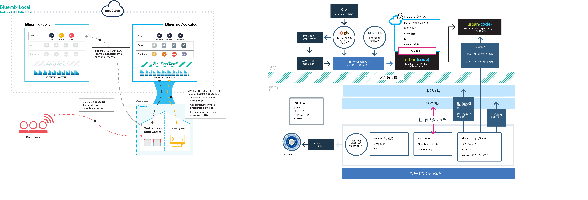

{:new_window: target="_blank"}
{:shortdesc: .shortdesc}

#{{site.data.keyword.Bluemix_notm}} 本端
{: #local}
*前次更新：2015 年 10 月 20 日*

「{{site.data.keyword.Bluemix}} 本端」將 {{site.data.keyword.Bluemix_notm}} 雲端型平台的功能及靈活性帶給資料中心。使用「{{site.data.keyword.Bluemix_notm}} 本端」，您可以利用公司防火牆來保護最機密的工作量，同時安全地連接「{{site.data.keyword.Bluemix_notm}} 公用」並與之同步。{:shortdesc}

IBM® 使用雲端作業作為服務來監視及維護您的環境，因此您可以專注於建置在環境之上執行的應用程式及服務。IBM 也會處理平台更新，讓您可以專注於事業。

「{{site.data.keyword.Bluemix_notm}} 本端」包括專用同步型錄，其顯示只供您使用的本端服務。它也包括從中同步使用而且可讓您從「{{site.data.keyword.Bluemix_notm}} 公用」中使用的其他服務。

「{{site.data.keyword.Bluemix_notm}} 本端」位在受公司防火牆保護的虛擬機器上，因此您可以使用最高效能且最安全的雲端基礎架構。IBM 透過 IBM 的轉遞技術來安裝、遠端監視及管理資料中心中的「{{site.data.keyword.Bluemix_notm}} 本端」。

轉遞是一個「{{site.data.keyword.Bluemix_notm}} 本端」所含的交付功能，讓 IBM 自動且一致地將更新遞送給所有本端部署，讓您一律有最新、穩定且安全的系統。轉遞會使用每一個「{{site.data.keyword.Bluemix_notm}} 本端」實例特有的憑證，透過源自初始虛擬機器的開放式、出埠 SSL、VPN 通道來達成安全連線功能。此通道上的資料流量是 Urban Code Deployer 自動化，用於提供及維護您實例的平台、計算資源及服務。

*圖 1. 「{{site.data.keyword.Bluemix_notm}} 本端」的詳細概觀*

就作業安全而言，「{{site.data.keyword.Bluemix_notm}} 本端」環境的安全標準與公用 {{site.data.keyword.Bluemix_notm}} 相同。您提供的硬體及基礎架構，可讓您控制基礎架構及實體安全。開發人員對本端 {{site.data.keyword.Bluemix_notm}} 的存取是透過 LDAP 原則所控制，而 {{site.data.keyword.Bluemix_notm}} 團隊可以在設定環境時配置 LDAP 原則。在本端環境內，您可以使用「管理主控台」來管理使用者角色及許可權。

「{{site.data.keyword.Bluemix_notm}} 本端」包含所有內含的 {{site.data.keyword.Bluemix_notm}} 執行時期，以及 64 GB 的計算記憶體。

此外，還會有一組可用於「{{site.data.keyword.Bluemix_notm}} 本端」的服務。

| **類型** | **名稱** | **說明** |    
|----------|----------|-----------------|
|內含 | {{site.data.keyword.Bluemix_notm}} 執行時期 | 使用執行時期可快速啟動並執行您的應用程式，而不需要設定及管理 VM 和作業系統。您可以將所有 {{site.data.keyword.Bluemix_notm}} 執行時期用於「{{site.data.keyword.Bluemix_notm}} 本端」實例中。|
|內含 | {{site.data.keyword.autoscaling}}| 根據原則，動態增加或減少您應用程式的計算功能。使用此服務，即可在「{{site.data.keyword.Bluemix}} 本端」環境中無限制地使用。|
|選用 |{{site.data.keyword.datacshort}}| 此服務提供記憶體內資料網格，其支援應用程式的分散式快取實務範例。包括 50 GB 的記憶體內快取。 |
|選用 | {{site.data.keyword.APIM}} | 使用 {{site.data.keyword.APIMfull}} 服務來編寫、管理及社交化 API。您也可以利用 Proxy URL 或組合 HTTP 資料來源中的資料，以使用資源匯入 API。使用 {{site.data.keyword.APIM}} 服務的好處是您可以管理 API 的使用方式。 |

*表 1. 本端服務*

##設定 {{site.data.keyword.Bluemix_notm}} 本端實例
{: #setuplocal}

「{{site.data.keyword.Bluemix_notm}} 本端」的設計旨在提供您可在專屬硬體上管理且由您所管理之專屬版本的「{{site.data.keyword.Bluemix_notm}} 公用」供應項目。您可以使用 {{site.data.keyword.Bluemix_notm}} 服務及執行時期來支援安全、客戶所管理及受管理雲端環境中的計算需求。

IBM 提供您以利用受密碼保護之登入的方式來存取「{{site.data.keyword.Bluemix_notm}} 本端」。您可以存取服務、執行時期及關聯的資源，以及部署和移除 {{site.data.keyword.Bluemix_notm}} 應用程式。請檢閱下列步驟，以與 IBM 業務代表一起設定本端 {{site.data.keyword.Bluemix_notm}} 實例。

若要設定您的 {{site.data.keyword.Bluemix_notm}} 專屬版本，請執行下列動作：

<ol>
<li>檢閱用於設定本端實例的「<a href="index.html#localinfra">{{site.data.keyword.Bluemix_notm}} 本端」基礎架構需求</a>。</li>
<li>聯絡您的 IBM 指定帳戶代表，或聯絡 <a href="https://console.ng.bluemix.net/?direct=classic/#/contactUs/cloudOEPaneId=contactUs" target="_blank">{{site.data.keyword.Bluemix_notm}}</a>，以開始使用。</li>
<li>建立與 IBM 的「{{site.data.keyword.Bluemix_notm}} 本端」合約，其中包括遞送的里程碑日期。<ol type="a">
	<li>與 IBM 一起處理您的「{{site.data.keyword.Bluemix_notm}} 本端」實例費用。每月的經常性費用是基於您要使用的本端服務，外加所有 {{site.data.keyword.Bluemix_notm}} 公用服務的訂閱。然後，您會收到除該訂閱合約外所使用之任何項目的發票。</li>
	<li>識別設定「{{site.data.keyword.Bluemix_notm}} 本端」實例的每一個階段的截止時間。</li>
	</ol>
	</li>
<li>建立平台及帳戶之後，針對啟動及執行本端實例所需的角色，識別您組織中的人員。每一個角色都有對應的 IBM 業務代表。 

客戶角色：

<dl>
<dt>**採購焦點**</dt>
<dd>與 IBM 業務代表一起建立您的「{{site.data.keyword.Bluemix_notm}} 本端」環境，包括識別您組織中要執行專案任何層面的正確人員。這個角色監督型樣選擇、商業安排，以及客戶資源存取權安排。採購焦點是設定本端實例的整體聯絡人。</dd>
<dt>**法規遵循管理者**</dt>
<dd>與 IBM 業務代表一起選取符合您安全需求的拓蹼及部署選項。這個角色與 IBM 法規遵循顧問一起判斷哪些部署型樣達到法規遵循目標及目的。</dd>
<dt>**網路專家**</dt>
<dd>與 IBM 業務代表一起處理 {{site.data.keyword.Bluemix_notm}} 部署的網路計劃。這個角色會向 IBM 業務代表提供需求，並一起研究實作計劃。安裝及驗證階段結束時，這個角色會「簽核」網路配置符合組織標準。</dd>
<dt>**DevOps 焦點**</dt>
<dd>與 IBM 業務代表一起計劃並套用 {{site.data.keyword.Bluemix_notm}} 平台、服務及執行時期所需的維護更新。這個角色也與 IBM 業務代表一起配置您的「{{site.data.keyword.Bluemix_notm}} 本端」實例。</dd>
</dl>

IBM 角色：

<dl>
<dt>**IBM 佈建管理員**</dt>
<dd>與客戶採購焦點一起建立客戶環境。</dd>
<dt>**IBM 法規遵循顧問**</dt>
<dd>與客戶法規遵循管理者一起選取符合您安全需求的拓蹼及部署選項。</dd>
<dt>**IBM 網路專家**</dt>
<dd>與客戶網路專家一起建立部署的網路方案。這個角色與客戶一起收集需求以及建立實作方案。這個角色也會執行自動化測試來驗證實作方案的實體結果。</dd>	
<dt>**IBM DevOps 焦點**</dt>
<dd>與客戶 DevOps 焦點一起進行部署拓蹼的安裝及進行中維護。這個角色與客戶一起計劃及執行平台和服務所需的更新。</dd>
</dl>
</li>
<li>您提供硬體，而 IBM 協助您定義並建立貴公司網路與「{{site.data.keyword.Bluemix_notm}} 本端」實例之間的網路連線功能。如需基礎架構需求的相關資訊，請參閱<a href="index.html#localinfra">「{{site.data.keyword.Bluemix_notm}} 本端」基礎架構需求</a>。
<ol type="a">
	<li>IBM 根據您提供的資訊，配置網路存取權及 LDAP。將管理存取權授與給所指定的聯絡人。您也必須指定用於支援及計費的聯絡人。</li>
	<li>IBM 會在您的本端環境中設定同步型錄，以顯示您的本端服務及許多公用 {{site.data.keyword.Bluemix_notm}} 服務。</li>
	<li>驗證網路和防火牆配置，以及 LDAP 端點和存取權。</li>
	</ol>
</li>
</ol>
	
##{{site.data.keyword.Bluemix_notm}} 本端基礎架構需求
{: #localinfra}

若為「{{site.data.keyword.Bluemix_notm}} 本端」，您掌控了管理本端實例的實體安全及基礎架構。IBM 針對設定「{{site.data.keyword.Bluemix_notm}} 本端」，設定了下列需求。
###硬體
雖然有可用硬體類型及大小方面的需求，不過您可以選擇任何組合，以符合設定的資源需求總計。
<dl>
<dt>**VMware ESXi 硬體**</dt>
<dd>
ESXi 是一種在實體伺服器上執行的虛擬化層級，它會將處理器、記憶體、儲存體及資源抽象化為多個虛擬機器。請根據每個 ESXi 的實體核心計數下限為八的條件，選擇任何符合下列資源總計的組合。下列規格僅適用於 {{site.data.keyword.Bluemix_notm}} 核心執行時期。
<ul>
<li>48 個實體核心，每一個為 2.0 GHz 以上</li>
<li>756 GB 的實體 RAM</li>
</li>總計 7.5 TB 的資料儲存庫大小 <ul>
<li>7 TB 資料儲存庫，用來存放 {{site.data.keyword.Bluemix_notm}}</li>
<li>500 GB 資料儲存庫，用來存放初始虛擬機器</li>
</ul>
</ul>

<strong>附註：</strong>如果您使用多個資料儲存庫，請對每一個資料儲存庫使用相同的字首。

</dd>
<dt>**高可用性**</dt>
<dd>
若要支援單一節點失效，您必須具有 n+1 個 ESXi。例如，如果使用兩個 ESXi（表示每一個有 16 個核心），則需要有第三個 ESXi。
<strong>附註：</strong>為了保證資源，客戶 VMware 管理者可能會決定要在叢集內施行嚴格的高可用性失效接手。

</dd>
<dt>**網路**</dt>
<dd>
建議的需求包括客戶可存取的埠群組，其中含有 10 個具有出埠網際網路存取權的客戶網路 IP 位址。然後，僅在用於「{{site.data.keyword.Bluemix_notm}} 本端」的 ESXi 之間定義第二個專用 VLAN。此 VLAN 在 VMware 中會顯示為埠群組。「{{site.data.keyword.Bluemix_notm}} 本端」會將它用於專用子網路，這樣更安全，且有助於避免發生遞送問題。</dd>
</dl>

###vCenter 伺服器配置
檢閱下列版本、資料中心、資源儲存區及資料儲存庫需求。
<dl>
<dt>**支援的 VMware 版本**</dt>
<dd>vCenter 及 ESXi 5.1 和 5.5</dd>
<dt>**資料中心**</dt>
<dd>建立資料中心（如果不存在）。</dd>
<dt>**資料中心資料夾**</dt>
<dd>如果您未計劃授與「管理者」從資料中心延伸而來的存取權，請建立與叢集同名的 VM 資料夾。</dd>
<dt>**叢集**</dt>
<dd>建立專門供「{{site.data.keyword.Bluemix_notm}} 本端」使用的叢集。叢集名稱的範例為 `bluemix`。</dd>
<dt>**資源儲存區**</dt>
<dd>在「{{site.data.keyword.Bluemix_notm}} 本端」叢集下建立資源儲存區。資源儲存區名稱的範例為 `local`。</dd>
</dt>**資料儲存庫**</dt>
<dd>需要 7.5 TB，用於起始部署 {{site.data.keyword.Bluemix_notm}}。 
 
**附註**：當您使用多個資料儲存庫時，請確定每一個資料儲存庫都以相同字首開始。字首相同的多個資料儲存庫名稱的範例為 `bluemix_datastore_01` 及 `bluemix_datastore_02`。</dd>
</dl>

###網路頻寬
建議的傳輸量為上傳 5 Mbps 及下載 5 Mbps，而您可以預期每月資料使用量為 10 GB。IBM 會在遞送大型資料組合（可高達 3 GB）時建立同意的時間範圍。
###VMware 許可權
設定下列角色及許可權。延伸是針對每一個許可權設定的。如果延伸許可權，則許可權會透過物件階層向下傳遞。不過，子物件的許可權一律會置換從母項物件延伸而來的許可權。
<dl>
<dt>**vCenter 伺服器**</dt>
<dd>將角色設為唯讀且不會延伸。 
 
**附註**：需有這個角色，才能擷取特定磁碟作業的作業狀態。</dd>
<dt>**資料中心**</dt>
<dd>建立角色 "{{site.data.keyword.Bluemix_notm}}"，並授與**資料儲存庫**的許可權，包括**低層次檔案作業**及**更新虛擬機器檔案**。 
 
**附註**：需有這個角色，才能支援將檔案公佈至資料儲存庫。</dd>
<dt>**叢集**</dt>
<dd>將角色設為管理者並延伸。</dd>
<dt>**資料儲存庫**</dt>
<dd>針對每一個 {{site.data.keyword.Bluemix_notm}} 資料儲存庫將角色設為管理者並延伸。</dd>
<dt>**網路**</dt>
<dd>以管理者角色設定公開和私密埠群組，且不會延伸。</dd>
</dl>

###Droplet Execution Agent (DEA) 儲存區
每一個 DEA 都配置有：
- 16 至 32 GB 的 RAM
- 2 至 4 個 vCPU
- 150 至 300 GB 的儲存體

例如，如果 ESXi 主機大小為 256 GB 記憶體且具有 16 個核心，則會新增八個 DEA。如果 ESXi 主機大小為 64 GB 記憶體且具有 8 個核心，則需要新增兩個 ESXi 及四個 DEA。每四個 DEA 需要額外的 1.5 TB 儲存體。此範例是根據配置有 32 GB RAM、4 個 vCPU 及 300 GB 儲存體的 DEA。

##維護本端實例
{: #maintainlocal}

當 IBM 認為適用於「Bluemix 本端」平台、執行時期及服務時，IBM 即會維護並安裝更新項目及修正程式。在維護時間期間，可能無法使用服務。

**重要事項**：IBM 保留視需要岔斷服務以套用緊急維護的權利。IBM 可能會變更排定的維護時間，但是一旦有這樣的變更以及任何緊急維護資訊時，就會通知您。

「{{site.data.keyword.Bluemix_notm}} 本端」需要下列類型的維護：
<dl>
<dt>**標準維護時間**</dt>
<dd>這些服務使用預先定義的標準維護時間，這樣可能導致服務無法使用。IBM 不需要客戶核准即可執行維護，但是會嘗試將對服務的影響降到最低。 
 
IBM 會透過電子郵件、電話或其他方法，來傳送針對每一個維護時間所規劃之變更的播送訊息。 
 
**重要事項**：在維護期間，部分服務可能無法使用。</dd>

<dt>**每月變更時間**</dt>
<dd>根據 21 天時間內您與 IBM 之間的協調來套用每月維護時間。您可以將 21 天時間內可能不適用的特定日期或時間提供給 IBM。IBM 會嘗試排定在這些時間進行更新。根據要求，IBM 會與您溝通排定的維護時間。每月變更時間預期不會影響「Bluemix 本端」環境的執行。 
 
**附註**：如果您未要求在特定時間進行更新，則在時間結束時會自動套用維護。 
 
移至**管理 > 系統資訊**，以檢視擱置更新、設定無法使用的日期，以及核准更新。如需通知及排定擱置更新的相關資訊，請參閱<a href="../admin/index.html#oc_system">檢視系統資訊</a>。</dd>

<dt>**其他**</dt>
<dd>IBM 打算將可能會影響您服務（特別是「Bluemix 本端」環境、執行時期及服務的可用性）的所有維護，限制在標準及每月時間。其他變更時間可能會根據異常狀況，用於管理環境。IBM 會盡量降低在這類變更時間期間對您所造成的影響，並提前通知您。</dd>
</dl>

若要設定本端實例的維護，請與 IBM 指定的帳戶業務代表一起識別用於標準維護的協議時間。
   
