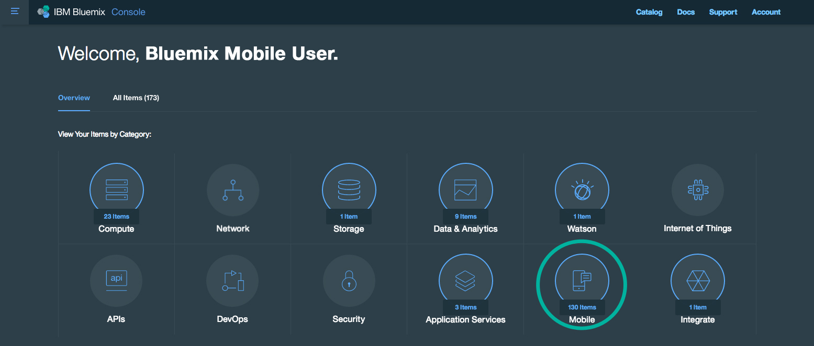

---

copyright:
  years: 2016

---
{:new_window: target="_blank"}

# Creating mobile projects from the Mobile dashboard
{: #mobile}
*Last Updated: 8 July 2016*
{: .last-updated} 

The Mobile dashboard provides an integrated experience on {{site.data.keyword.Bluemix_notm}}. You can create new mobile projects easily from within the dashboard. With the **Projects** view, you can manage all of your projects in one place. The **Services** view shows your existing mobile service instances.

To view the Mobile dashboard, click the **Mobile** category from your {{site.data.keyword.Bluemix_notm}} home.

To get started, click **New Project** from the Mobile dashboard **Projects** view.

## Integrating mobile services
{: #services_integration}
You can integrate the {{site.data.keyword.Bluemix_notm}} Mobile services into your project.

#### Integrating {{site.data.keyword.mobilepushshort}}
{: #push_integration}

To integrate your existing {{site.data.keyword.mobilepushshort}} service, follow these steps:

1. Click your {{site.data.keyword.mobilepushshort}} service instance.
2. Click **Mobile Options** and copy the **Route** and **AppGuid** values.

   **Note**: Your {{site.data.keyword.mobilepushshort}} service must be bound to an app to see **Mobile Options**.

3. Navigate back to the Mobile dashboard **Projects** view.
4. Click on your project to edit it.
5. Click **Push** and enable notifications.
6. Provide the **AppGuid** value that you previously copied into **App ID**.
7. Provide the **Route** value that you previously copied into **App Route URL**.

#### Integrating {{site.data.keyword.cloudant}}
{: #cloudant_integration}

To integrate your existing {{site.data.keyword.cloudant}} service, follow these steps:

1. Click your {{site.data.keyword.cloudant}} service instance.
2. Click **LAUNCH**.
3. In the **Databases** view, click your Database name.
4. Click **API** and copy the **API Key** value through your database name.

   **Note**: Do not copy the content past your database name.
   
5. Click **Permissions** > **Generate API Key** and copy the **Key** and **Password** values.
6. Navigate back to the Mobile dashboard **Projects** view.
7. Click on your project to edit it.
8. Click **Data** > **+ Data Source** > **Cloudant** and provide your data source name and click **Add**.
9. Click **Cloudant Config**.
10. Provide the **API Key** value that you previously copied into **API URL**.
11. Provide the **Key** value that you previously copied into **User**.
12. Provide the **Password** value that you previously copied into **Password**.
13. Click **Ok**.

## {{site.data.keyword.Bluemix_notm}} Mobile services overview
{: #mobile_services_overview}

The following table depicts the available {{site.data.keyword.Bluemix_notm}} Mobile services.

<table>
<caption>Table 1. {{site.data.keyword.Bluemix_notm}} Mobile services</caption>
<th>{{site.data.keyword.Bluemix_notm}} Mobile service</th>
<th>Description</th>
<tr>
<td>  <b>{{site.data.keyword.mobileanalytics_short}} (Experimental)</b></td>
<td valign="top">Use the {{site.data.keyword.mobileanalytics_full}} service to measure the state, behavior, and context of your mobile apps, mobile users, and mobile devices.  
Read more about operating this service in the <a href="../services/mobileanalytics/index.html" alt="{{site.data.keyword.mobileanalytics_short}} documentation link">{{site.data.keyword.mobileanalytics_short}} documentation</a>.
</td>
</tr>
<tr>
<td> <b>{{site.data.keyword.amashort}}</b></td>
<td valign="top">Use the {{site.data.keyword.amafull}} service to add security functionality to your mobile app. You can configure client authentication and identity providers so that users can log in to the app with their existing Google or Facebook accounts.  
Read more about operating this service in the <a href="../services/mobileaccess/index.html" alt="{{site.data.keyword.amashort}} documentation link">{{site.data.keyword.amashort}} documentation</a>.</td>
</tr>
<tr>
<td>  <b>{{site.data.keyword.mobilefoundation_short}}</b></td>
<td valign="top">Use the {{site.data.keyword.mobilefoundation_long}} service to expedite setting up an {{site.data.keyword.mfp_full}} environment from which you can develop, test, and operate enterprise mobile apps.  
Read more about operating this service in the <a href="../services/mobilefoundation/index.html" alt="{{site.data.keyword.mobilefoundation_short}} documentation link">{{site.data.keyword.mobilefoundation_short}} documentation</a>.</td>
</tr>
<tr>
<td> <b>{{site.data.keyword.mqa}}</b></td>
<td valign="top">Use the {{site.data.keyword.mqafull}} service to discover and set up mobile quality services for your apps. You can view high-level quality metrics for your mobile apps to get a quick understanding of the issues for apps that you are working on. These metrics include information for crashes, bugs, user feedback, and user sentiment. By viewing this information for your apps, you can determine whether to investigate specific issues further.  
Read more about operating this service in the <a href="../services/MobileQualityAssurance/index.html" alt="{{site.data.keyword.mqa}} documentation link">{{site.data.keyword.mqa}} documentation</a>.</td>
</tr>
<tr>
<td> <b>{{site.data.keyword.mobilepushshort}}</b></td>
<td valign="top">Use the {{site.data.keyword.mobilepushfull}} service to send and manage mobile push notifications that are targeted to iOS and Android platforms. This service manages the mapping of your application users to their devices, device platform, and handles dispatching push notifications to the devices. With this service, you can send broadcasts, unicasts (based on userID, deviceID), and tags (or topics) based on push notifications to your mobile application users.  
Read more about operating this service in the <a href="../services/mobilepush/index.html" alt="{{site.data.keyword.mobilepushshort}} documentation link">{{site.data.keyword.mobilepushshort}} documentation</a>.</td>
</table>

# rellinks
{: #rellinks}

<!-- links to internal services don't work
## {{site.data.keyword.Bluemix_notm}} Mobile services
{: #general}
* [Mobile Analytics (Experimental)](../services/mobileanalytics/index.html){: new_window}
* [Mobile Client Access](../services/mobileaccess/index.html){: new_window}
* [Mobile Foundation](../services/mobilefoundation/index.html){: new_window}
* [Mobile Quality Assurance)](../services/MobileQualityAssurance/index.html){: new_window}
* [Push Notifications](../services/mobilepush/index.html){: new_window}
-->
* [Blog Post: Introducing the Bluemix Mobile dashboard](https://developer.ibm.com/bluemix/2016/07/08/new-bluemix-mobile-dashboard/){: new_window}
 
## Tutorials and Samples
{: #samples}
* [Mobile Backend for Bluemix](https://github.com/ibm-bluemix-mobile-services/mobiledashboard-storecatalog-backend){: new_window}
<!-- * [Blog Post: Creating a Store Catalog application using Bluemix Mobile (Part 1/2)](https://developer.ibm.com/bluemix/?p=35667&preview=true){: new_window}
* [Blog Post: Integrating a custom Bluemix backend into the Store Catalog application (Part 2/2)](https://developer.ibm.com/bluemix/?p=35191&preview=true){: new_window} -->
