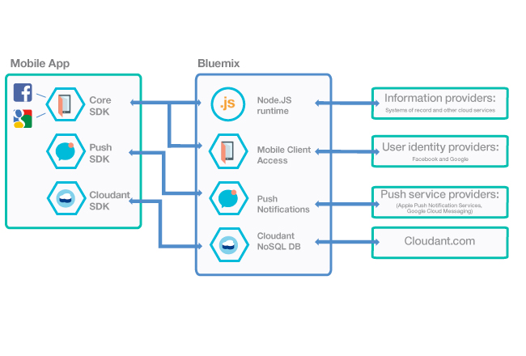

---

copyright:
  years: 2015, 2017
lastupdated: "2016-10-19"

---

# Creación de apps móviles desde el contenedor modelo de {{site.data.keyword.mobilefirstbp}} Starter
{: #try_mobile}

Puede utilizar cada uno de los servicios de {{site.data.keyword.Bluemix}} Mobile independientemente. También puede utilizarlos juntos, con el contenedor modelo de {{site.data.keyword.mobilefirstbp}} Starter, para obtener el mayor beneficio.

Para comenzar, utilice {{site.data.keyword.mobilefirstbp}} Starter para crear su app. El contenedor modelo le permite llevar a cabo las siguientes tareas:

* Cree un tiempo de ejecución Node.js con una aplicación de plantilla. Puede utilizar esta aplicación para proporcionar funciones de lado de servidor, como por ejemplo las API RESTful y los archivos estáticos. <!-- You can read more about operating this application in the Developing Mobile Backend section.-->
* Proporcione una instancia de cada uno de los servicios de {{site.data.keyword.Bluemix_notm}} Mobile y enlace el servicio a la aplicación Node.js.

<!--
 {{site.data.keyword.mobilefirstbp}} Starter boilerplate
-->

Después de utilizar el contenedor modelo de {{site.data.keyword.mobilefirstbp}} Starter para crear su app, puede obtener ejemplos de Hello Bluemix para cada uno de los servicios o iniciar la instrumentación de la app existente para utilizar los servicios de {{site.data.keyword.Bluemix_notm}}.

## Visión general de los servicios
{: #services-overview}
Puede utilizar todos los servicios de {{site.data.keyword.Bluemix_notm}} Mobile juntos utilizando el contenedor modelo de {{site.data.keyword.Bluemix_notm}} {{site.data.keyword.mobilefirstbp}} Starter o bien puede utilizar servicios individuales del catálogo de {{site.data.keyword.Bluemix_notm}}. El diagrama siguiente resalta los componentes de los servicios de {{site.data.keyword.Bluemix_notm}} Mobile.

Arquitectura de 

<table summary="Esta tabla describe los servicios de {{site.data.keyword.Bluemix_notm}} Mobile">
<caption>Tabla 1. {{site.data.keyword.Bluemix_notm}} y sistemas empresariales</caption>
<th>{{site.data.keyword.Bluemix_notm}}</th>
<th>Sistemas empresariales</th>
<tr>
<td> <b>Node.js</b>   Se proporciona un tiempo de ejecución de Node.js que aloja una aplicación plantilla como parte del contenedor modelo de {{site.data.keyword.mobilefirstbp}} Starter. Puede utilizar la aplicación de plantilla para proporcionar funciones de lado de servidor, como por ejemplo las API RESTful y los archivos estáticos.  Por ejemplo, puede extender la aplicación Node.js para el proceso lógico personalizado o conectar con las API REST en la infraestructura existente de la empresa. Cada app que cree en {{site.data.keyword.Bluemix_notm}} tiene un ID de aplicación exclusivo. La app para móvil utiliza este ID con SDK para acceder a los servicios asociados con dicha aplicación. La plataforma utiliza el ID de la app como contexto para funciones comunes, como por ejemplo la calibración y el registro.
<!--You can read more about operating this application in the "Developing Mobile Backend" section.--></td>
<td valign="top"><b>Proveedores de información</b>  Puede utilizar un tiempo de ejecución de Node.js que esté alojado en {{site.data.keyword.Bluemix_notm}} para conectar con cualquier tipo de proveedor de información:
<ul>
	<li>Programa de fondo de empresa</li>
	<li>Base de datos </li>
	<li>Otro servicio de terceros alojado</li>
</ul>
</td>
</tr>
<tr>
<td> <b>{{site.data.keyword.amashort}}</b> Utilice el servicio {{site.data.keyword.amafull}} para proteger las aplicaciones Node.js y Java for Liberty alojadas en {{site.data.keyword.Bluemix_notm}}. Al instrumentar la app para móvil con el SDK de {{site.data.keyword.amashort}}, puede necesitar que los usuarios inicien sesión para acceder a Node.js o los servicios de {{site.data.keyword.Bluemix_notm}} Mobile.
<!-- In addition to security capabilities, {{site.data.keyword.amashort}} also gathers analytics data, so that you can monitor your mobile application performance and collect client logs and usage statistics.--> </td>
<td valign="top"><b>Proveedores de identidad de usuarios</b>  Puede utilizar los siguientes proveedores de identidad: <ul><li>Facebook</li><li>Google</li><li> Personalizada </li></ul></td>
</tr>
<tr>
<td> <b>El servicio {{site.data.keyword.mobilepushshort}}</b> El servicio {{site.data.keyword.mobilepushfull}} proporciona una plataforma unificada para enviar y gestionar notificaciones push destinadas a plataformas móviles (iOS y Android) y aplicaciones de navegador web. Este servicio gestiona la correlación de los usuarios de aplicaciones en sus dispositivos, plataforma de dispositivos y navegadores, y maneja la asignación de notificaciones push en los suscriptores. Con este servicio, puede enviar difusiones, unicasts (en función del userID, deviceID), y etiquetas (o temas) basadas en notificaciones push para sus clientes.</td>
<td valign="top"><b>Proveedores de servicio Push</b><ul><li>Apple Push Notifications Service</li><li>Firebase Cloud Messaging</li></ul></td>
</tr>
<tr>
<td><b>Cloudant NoSQLDB</b>  Cloudant es una base de datos de NoSQL como servicio (DBaaS). Está creada desde la base para escalar globalmente, ejecutarse sin parar y manejar una gran variedad de tipos de datos como JSON, texto completo y geoespacial. </td>
<td>Cloudant.com</td>
</tr>
</table>
