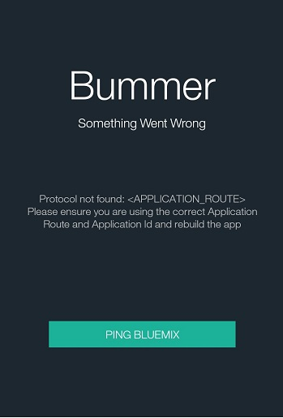

<!-- Attribute definitions -->
{:codeblock: .codeblock}

# HelloWorld 샘플 시작하기
{: #gettingstarted-android}
*마지막 업데이트 날짜: 2016년 1월 28일*  

새 Android 애플리케이션을 시작하고자 하는 경우 HelloWorld 앱을 사용할 수 있습니다. 이 앱에서는 인증 없이 모바일 앱에서 {{site.data.keyword.Bluemix}} 백엔드에 연결하는 방법을 예시합니다. 앱에는 이미 SDK가 설치되어 있습니다. 준비가 완료되면 사용자는 앱에서 사용할 특정 라이브러리를 가져올 수 있습니다.

1. {{site.data.keyword.Bluemix_notm}}에서 모바일 백엔드를 작성하십시오.
    1. 표준 유형 섹션 {{site.data.keyword.Bluemix_notm}} 카탈로그에서 MobileFirst Services 스타터를 클릭하십시오.
    2. 앱에 대한 이름 및 호스트를 입력하고 **작성**을 클릭하십시오.
    3. **완료**를 클릭하십시오.
2. GitHub에서 프로젝트를 가져오십시오. 선택에 따라 git clone 명령을 사용하여 프로젝트를 가져올 수도 있습니다. 컴퓨터에서 터미널을 열고, 다음 명령을 입력하십시오.
```
git clone https://github.com/ibm-bluemix-mobile-services/bms-samples-android-helloworld.git
```
시작하기 전에 `Gradle.zip` 파일을 다운로드하고 다운로드된 압축 파일을 선택한 디렉토리에 추출하여 Gradle을 설치하십시오. 샘플 파일을 처음 가져올 경우 Android Studio에서 GRADLE HOME을 요청할 수도 있습니다. 추출된 `Gradle.zip` 파일에 있는 bin 디렉토리로 경로를 설정하십시오. `build.gradle` 파일이 필요한 종속 항목을 가져와 자동으로 프로젝트를 빌드합니다.
3. 프로젝트를 초기화하십시오.
SDK를 초기화하려면 &lt;APPLICATION_ROUTE&gt; 및 &lt;APPLICATION_ID&gt;를 `BMSClient.getInstance().initialize()` 함수의 try 블록에 있는 애플리케이션 라우트 및 GUID로 대체하십시오.
```
// initialize SDK with IBM Bluemix application ID and route
BMSClient.getInstance().initialize(this, "<APPLICATION_ROUTE>", "<APPLICATION_ID>");
```{: codeblock}

4. 개발 환경에서 샘플을 실행하십시오.
Android Studio 도구 모음에서 재생 단추를 클릭하고 시뮬레이터를 선택하십시오.
시뮬레이터에서 **Ping {{site.data.keyword.Bluemix_notm}}**를 클릭하십시오. 샘플 앱이 {{site.data.keyword.Bluemix_notm}}의 Node.js 런타임에 있는 보호된 자원에 Get 요청을 전송합니다. 요청이 성공하면 연결이 확인되고 시뮬레이터의 텍스트가 업데이트됩니다.
<br/>**참고:** MobileFirst Services 스타터 표준 유형에 Node.js 런타임 코드가 제공됩니다. MobileFirst Services 스타터 표준 유형에서 백엔드 애플리케이션이 작성되지 않은 경우 애플리케이션이 성공적으로 연결되지 않습니다.<br/>
Android Studio의 모바일 앱에서 {{site.data.keyword.Bluemix_notm}}에 성공적으로 연결하면 "Yay! You are connected"라는 메시지가 표시됩니다.<br/>


5. 문제를 해결하십시오.<br/>연결에 실패하면 "Bummer. Something went wrong"이라는 메시지가 표시됩니다.</br>

<br/>
다음 항목을 확인하십시오.
 * 라우트 및 GUID 값을 올바로 붙여넣었는지 확인하십시오.
 * 디버그 로그에서 자세한 정보를 확인할 수도 있습니다.

## 다음 단계:
{: #next}
SDK를 가져와 모바일 앱에 통합하는 방법에 대한 정보는 Bluemix 서비스 설정에 대한 정보를 참조하십시오.
   * [Mobile Client Access](../../services/mobileaccess/index.html)
   * [Push](../../services/mobilepush/index.html)

# 관련 링크

## 샘플
   * [HelloWorld 샘플](https://github.com/ibm-bluemix-mobile-services/bms-samples-android-helloworld)

## SDK
   * [코어 SDK](https://github.com/ibm-bluemix-mobile-services/bms-clientsdk-android-core)

## API
   * [코어 API](https://classicdocs.{DomainName}/docs/api/content/api/mobilefirst/android/core-api-doc/overview-summary.html)
