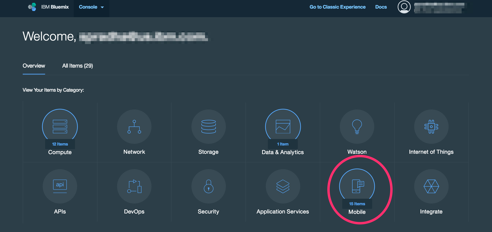

---

copyright:
  years: 2016

---
{:new_window: target="_blank"}

# 모바일 대시보드에서 모바일 프로젝트 작성
{: #mobile}
*마지막 업데이트 날짜: 2016년 7월 18일*
{: .last-updated}

{{site.data.keyword.Bluemix}} 모바일 서비스를 사용하여, 사전 빌드되고 관리되며 확장 가능한 클라우드 서비스를 IT의 관여 없이 사용자의 모바일 애플리케이션에 통합할 수 있습니다. 복잡한 백엔드 인프라를 관리하는 대신 모바일 앱을 빌드하는 데 집중할 수 있습니다.

모바일 대시보드는 {{site.data.keyword.Bluemix_notm}}에 대한 통합적인 경험을 제공합니다. 사용자는 대시보드 내에서 새 모바일 프로젝트를 쉽게 작성할 수 있습니다. **프로젝트** 보기를 통해 한 곳에서 모든 프로젝트를 관리할 수 있습니다. **서비스** 보기는 기존 모바일 서비스 인스턴스를 표시합니다.

모바일 대시보드를 보려면, {{site.data.keyword.Bluemix_notm}} 홈에서 **모바일** 카테고리를 클릭하십시오.

시작하려면 모바일 대시보드 **프로젝트** 보기에서 **새 프로젝트**를 클릭하십시오.

## {{site.data.keyword.Bluemix_notm}} 모바일 서비스 개요
{: #mobile_services_overview}

다음 표는 사용 가능한 {{site.data.keyword.Bluemix_notm}} 모바일 서비스를 표시합니다. {{site.data.keyword.Bluemix_notm}} 카탈로그에서 개별 서비스를 사용하거나 서비스를 모바일 프로젝트에 통합할 수 있습니다.

<table summary="이 표는 {{site.data.keyword.Bluemix_notm}} 모바일 서비스를 설명하고 서비스 문서에 대한 링크를 제공합니다.">
<caption>표 1. {{site.data.keyword.Bluemix_notm}} 모바일 서비스</caption>
<th>{{site.data.keyword.Bluemix_notm}} 모바일 서비스</th>
<th>설명</th>
<tr>
<td>  <b>{{site.data.keyword.mobileanalytics_short}}(시범)</b></td>
<td valign="top">{{site.data.keyword.mobileanalytics_full}} 서비스를 사용하여 모바일 앱, 모바일 사용자 및 모바일 디바이스의 상태, 작동 및 컨텍스트를 측정할 수 있습니다.  
이 서비스 운영에 대한 자세한 정보는 <a href="../services/mobileanalytics/index.html" alt="{{site.data.keyword.mobileanalytics_short}} 문서 링크">{{site.data.keyword.mobileanalytics_short}} 문서</a>를 살펴보십시오.
</td>
</tr>
<tr>
<td> <b>{{site.data.keyword.amashort}}</b></td>
<td valign="top">{{site.data.keyword.amafull}} 서비스를 사용하여 모바일 앱에 보안 기능을 추가할 수 있습니다. 기존의 Google 또는 Facebook 계정을 사용하여 앱에 로그인할 수 있도록 클라이언트 인증 및 ID 제공자를 구성할 수 있습니다.  
이 서비스 운영에 대한 자세한 정보는 <a href="../services/mobileaccess/index.html" alt="{{site.data.keyword.amashort}} 문서 링크">{{site.data.keyword.amashort}} 문서</a>를 살펴보십시오.</td>
</tr>
<tr>
<td>  <b>{{site.data.keyword.mobilefoundation_short}}</b></td>
<td valign="top">{{site.data.keyword.mobilefoundation_long}} 서비스를 사용하여 엔터프라이즈 모바일 앱을 개발하고, 테스트하고, 운영할 수 있는 {{site.data.keyword.mfp_full}} 환경을 신속하게 설정할 수 있습니다.  
이 서비스 운영에 대한 자세한 정보는 <a href="../services/mobilefoundation/index.html" alt="{{site.data.keyword.mobilefoundation_short}} 문서 링크">{{site.data.keyword.mobilefoundation_short}} 문서</a>를 살펴보십시오.</td>
</tr>
<tr>
<td> <b>{{site.data.keyword.mqa}}</b></td>
<td valign="top">{{site.data.keyword.mqafull}} 서비스를 사용하여 앱에 대한 모바일 품질 서비스를 검색 및 설정할 수 있습니다. 모바일 앱에 대한 상위 레벨의 품질 메트릭을 보고 작업 중인 앱의 문제를 신속하게 파악할 수 있습니다. 이러한 메트릭에는 충돌, 버그, 사용자 피드백 및 사용자 감성에 대한 정보가 포함됩니다. 앱에 대한 이 정보를 보고 특정 문제를 더 자세히 조사할지 여부를 결정할 수 있습니다.  
이 서비스 운영에 대한 자세한 정보는 <a href="../services/MobileQualityAssurance/index.html" alt="{{site.data.keyword.mqa}} 문서 링크">{{site.data.keyword.mqa}} 문서</a>를 살펴보십시오. </td>
</tr>
<tr>
<td> <b>{{site.data.keyword.mobilepushshort}}</b></td>
<td valign="top">{{site.data.keyword.mobilepushfull}} 서비스를 사용하여 iOS 및 Android 플랫폼을 대상으로 하는 모바일 푸시 알림을 전송 및 관리할 수 있습니다. 이 서비스에서는 디바이스 및 디바이스 플랫폼에 대한 애플리케이션 사용자의 맵핑을 관리하고 디바이스에 푸시 알림을 디스패치하는 작업을 처리합니다. 이 서비스를 사용하면 푸시 알림을 기반으로 모바일 애플리케이션 사용자에게 브로드캐스트, 유니캐스트(사용자 ID, 디바이스 ID 기반) 및 태그(또는 주제)를 보낼 수 있습니다.  
이 서비스 운영에 대한 자세한 정보는 <a href="../services/mobilepush/index.html" alt="{{site.data.keyword.mobilepushshort}} 문서 링크">{{site.data.keyword.mobilepushshort}} 문서</a>를 살펴보십시오.</td>
</table>

## 모바일 서비스 통합
{: #services_integration}
{{site.data.keyword.mobilepushshort}} 및 {{site.data.keyword.cloudant}}와 같은 기존 {{site.data.keyword.Bluemix_notm}} 모바일 서비스를 프로젝트에 통합할 수 있습니다.

#### {{site.data.keyword.mobilepushshort}} 통합
{: #push_integration}

기존 {{site.data.keyword.mobilepushshort}} 서비스를 통합하려면, 다음 단계를 따르십시오.

1. {{site.data.keyword.mobilepushshort}} 서비스 인스턴스를 클릭하십시오.
2. **모바일 옵션**을 클릭하고 **라우트** 및 **AppGuid** 값을 복사하십시오.

   **참고**: **모바일 옵션**을 보려면 {{site.data.keyword.mobilepushshort}} 서비스가 앱에 바인딩되어야 합니다.

3. 모바일 대시보드 **프로젝트** 보기로 다시 이동하십시오.
4. 편집할 프로젝트를 클릭하십시오.
5. **푸시**를 클릭하고 알림을 사용으로 설정하십시오.
6. 이전에 복사한 **AppGuid** 값을 **앱 ID**에 제공하십시오.
7. 이전에 복사한 **라우트** 값을 **앱 라우트 URL**에 제공하십시오.

#### {{site.data.keyword.cloudant}} 통합
{: #cloudant_integration}

기존 {{site.data.keyword.cloudant}} 서비스를 통합하려면, 다음 단계를 따르십시오.

1. {{site.data.keyword.cloudant}} 서비스 인스턴스를 클릭하십시오.
2. **시작**을 클릭하십시오.
3. **데이터베이스** 보기에서 데이터베이스 이름을 클릭하십시오.
4. **API**를 클릭하고 데이터베이스 이름을 통해 **API 키** 값을 복사하십시오.

   **참고**: 데이터베이스 이름 뒤에 있는 컨텐츠를 복사하지 마십시오.

5. **권한** > **API 키 생성**을 클릭하고 **키** 및 **비밀번호** 값을 복사하십시오.
6. 모바일 대시보드 **프로젝트** 보기로 다시 이동하십시오.
7. 편집할 프로젝트를 클릭하십시오.
8. **데이터** > **+ 데이터 소스** > **Cloudant**를 클릭하고 데이터 소스 이름을 제공한 후 **추가**를 클릭하십시오.
9. **Cloudant 구성**을 클릭하십시오.
10. 이전에 복사한 **API 키** 값을 **API URL**에 제공하십시오.
11. 이전에 복사한 **키** 값을 **사용자**에 제공하십시오.
12. 이전에 복사한 **비밀번호** 값을 **비밀번호**에 제공하십시오.
13. **확인**을 클릭하십시오.

# 관련 링크
{: #rellinks}

<!-- links to internal services don't work
## {{site.data.keyword.Bluemix_notm}} Mobile services
{: #general}
* [Mobile Analytics (Experimental)](../services/mobileanalytics/index.html){: new_window}
* [Mobile Client Access](../services/mobileaccess/index.html){: new_window}
* [Mobile Foundation](../services/mobilefoundation/index.html){: new_window}
* [Mobile Quality Assurance)](../services/MobileQualityAssurance/index.html){: new_window}
* [Push Notifications](../services/mobilepush/index.html){: new_window}
-->

## 블로그 게시물
{: #general}
* [블로그 게시물: Introducing the Bluemix Mobile dashboard](https://developer.ibm.com/bluemix/2016/07/08/new-bluemix-mobile-dashboard/){: new_window}
* [블로그 게시물: Bluemix Mobile, Part 1: Creating a Store Catalog application](https://developer.ibm.com/bluemix/2016/07/13/bluemix-mobile-creating-store-catalog-app-part1/){: new_window}
* [블로그 게시물: Bluemix Mobile, Part 2: Integrating custom Bluemix backend into the Store Catalog app](https://developer.ibm.com/bluemix/2016/07/14/bluemix-mobile-integrating-custom-backend-part2/){: new_window}

## 튜토리얼 및 샘플
{: #samples}
* [Mobile Backend for Bluemix](https://github.com/ibm-bluemix-mobile-services/mobiledashboard-storecatalog-backend){: new_window}
