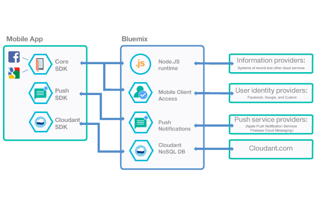

---

copyright:
  years: 2015, 2017
lastupdated: "2016-10-19"

---

# 从 {{site.data.keyword.mobilefirstbp}} Starter 样板创建移动应用程序
{: #try_mobile}

您可以单独使用每个 {{site.data.keyword.Bluemix}} Mobile Services。也可以通过 {{site.data.keyword.mobilefirstbp}} Starter 样板一起使用这些服务，从而获取最大好处。

要开始操作，请使用 {{site.data.keyword.mobilefirstbp}} Starter 来创建您的应用程序。该样板支持完成以下操作：

* 使用模板应用程序创建 Node.js 运行时。您可以使用此应用程序来提供服务器端功能，例如 RESTful API 和静态文件。<!-- You can read more about operating this application in the Developing Mobile Backend section.-->
* 供应每个 {{site.data.keyword.Bluemix_notm}} Mobile Services 的实例，并将该服务绑定到 Node.js 应用程序。

<!--
 {{site.data.keyword.mobilefirstbp}} Starter boilerplate
-->

在使用 {{site.data.keyword.mobilefirstbp}} Starter 样板创建您的应用程序之后，可以获取每个服务的 Hello Bluemix 样本，也可以着手配置您的现有应用程序以使用 {{site.data.keyword.Bluemix_notm}} 服务。

## 服务概述
{: #services-overview}
您可以通过 {{site.data.keyword.Bluemix_notm}} {{site.data.keyword.mobilefirstbp}} Starter 样板统一使用所有 {{site.data.keyword.Bluemix_notm}} Mobile Services，也可以从 {{site.data.keyword.Bluemix_notm}}“目录”中使用单个服务。下图概述了 {{site.data.keyword.Bluemix_notm}} Mobile Services 的组件。

<table summary="此表描述了 {{site.data.keyword.Bluemix_notm}} Mobile Services">
<caption>表 1. {{site.data.keyword.Bluemix_notm}} 和企业系统</caption>
<th>{{site.data.keyword.Bluemix_notm}}</th>
<th>企业系统</th>
<tr>
<td>  <b>Node.js</b> Node.js 运行时（托管一个模板应用程序）是作为 {{site.data.keyword.mobilefirstbp}} Starter 样板的一部分来提供的。您可以使用该模板应用程序来提供服务器端功能，例如 RESTful API 和静态文件。 例如，您可以在您所在公司的现有基础架构中扩展 Node.js 应用程序，以便处理定制逻辑或与 REST API 相连接。您在 {{site.data.keyword.Bluemix_notm}} 上创建的每个应用程序都具有唯一的应用程序标识。您的移动应用程序会将此标识与 SDK 配合使用，以访问与该应用程序相关联的服务。平台会将应用程序标识用作常用功能（例如测量和日志记录）的上下文。<!--You can read more about operating this application in the "Developing Mobile Backend" section.--></td>
<td valign="top"><b>信息提供者</b>  您可以使用 {{site.data.keyword.Bluemix_notm}} 上托管的 Node.js 运行时来连接到任何种类的信息提供者：<ul>
	<li>企业后端</li>
	<li>数据库</li>
	<li>其他托管的第三方服务</li>
</ul>
</td>
</tr>
<tr>
<td> <b>{{site.data.keyword.amashort}}</b> 使用 {{site.data.keyword.amafull}} 服务可保护 {{site.data.keyword.Bluemix_notm}} 上托管的 Node.js 和 Java for Liberty 应用程序。为您的移动应用程序配备 {{site.data.keyword.amashort}} SDK 后，就可以要求用户必须登录才能访问 Node.js 或 {{site.data.keyword.Bluemix_notm}} Mobile Services。<!-- In addition to security capabilities, {{site.data.keyword.amashort}} also gathers analytics data, so that you can monitor your mobile application performance and collect client logs and usage statistics.--></td>
<td valign="top"><b>用户身份提供者</b>  您可以使用以下身份提供者：<ul><li>Facebook</li><li>Google</li><li> 定制</li></ul></td>
</tr>
<tr>
<td> <b>{{site.data.keyword.mobilepushshort}}</b> {{site.data.keyword.mobilepushfull}} 服务提供一个统一平台来发送和管理针对移动（iOS 和 Android）平台和 Web 浏览器应用程序的推送通知。此服务会管理您的应用程序用户与其设备、设备平台和浏览器之间的映射，还会处理将推送通知派送给订户。使用此服务，可以基于推送通知，向客户发送广播、单点广播（基于用户标识、设备标识）和标记（或主题）。</td>
<td valign="top"><b>推送服务提供者</b><ul><li>Apple 推送通知服务</li><li>Firebase 云消息传递</li></ul></td>
</tr>
<tr>
<td> <b>Cloudant NoSQLDB</b> Cloudant 是一种 NoSQL 数据库即服务 (DBaaS)。它从头开始构建，用于在全球范围内进行扩展，实现不间断运行，以及处理各种数据类型，例如 JSON、全文本和地理空间。</td>
<td>Cloudant.com</td>
</tr>
</table>
