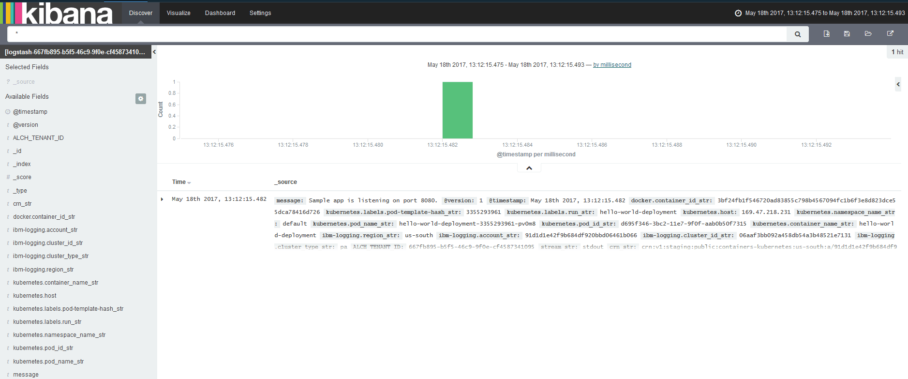
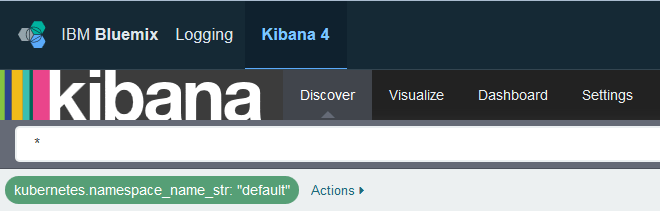

---

copyright:
  years: 2015, 2017

lastupdated: "2017-05-23"

---


{:shortdesc: .shortdesc}
{:new_window: target="_blank"}
{:codeblock: .codeblock}
{:screen: .screen}


# Analyze logs in Kibana for an app that is deployed in a Kubernetes cluster
{: #kibana_tutorial_1}

Get started with Kibana. Learn how to search and analyze container logs for an app that is deployed in a Kubernetes cluster.
{:shortdesc}

**Note:** To complete this tutorial, complete the tutorials that are linked from the different steps.

## Prerequisites
{: #prereq}

1. Be a member or an owner of a Bluemix account with permissions to create Kubernetes clusters, deploy apps into clusters, and query the logs in Bluemix for advanced analysis in Kibana.

2. Have a terminal session from where you can manage the Kubernetes cluster and deploy apps from the command line. The examples in this tutorial are given for an Ubuntu Linux system.

3. [Install the CLI plugins](../../../../containers/cs_cli_install.html#cs_cli_install_steps) in your Ubuntu system to manage the IBM Bluemix Container service from the command line. 


## Step 1: Get up and running with Kubernetes in Bluemix
{: #step1}

Complete the following steps:

1. [Create a Kubernetes cluster](../../../../containers/cs_cluster.html#cs_cluster_ui).

2. [Setup the cluster context](../../../../containers/cs_cli_install.html#cs_cli_configure) in a Linux terminal. After the context is set, you can manage the Kubernetes cluster and deploy the application in the Kubernetes cluster.

## Step 2: Deploy an app in the Kubernetes cluster
{: #step2}

Deploy and run a sample app in the Kubernetes cluster. [Complete the steps for lesson 1](../../../../containers/cs_tutorials.html#cs_apps_tutorial).

The app is a Hello World node js app:

```
var express = require('express')
var app = express()

app.get('/', function(req, res) {
  res.send('Hello world! Your app is up and running in a cluster!\n')
})
app.listen(8080, function() {
  console.log('Sample app is listening on port 8080.')
})
```

When the app is deployed, log collection is automatically enabled for any log entries that are sent by the app to stdout (standard output) and stderr (standard error). 

In this sample app, when you test your app in a browser, the app writes to stdout the following message: ```Sample app is listening on port 8080.```


## Step 3: Analyze log data in Kibana
{: #step3}

1. Launch Kibana from a browser. 

    To analyze log data for a cluster, you must access Kibana in the cloud Public region where the cluster is created. 
    
    Choose the correct URL based on the region where you created the Kubernetes cluster in the previos step:

    <table>
      <caption>Table 1. URLs to launch Kibana  </caption>
        <tr>
          <th>Region</th>
          <th>URL</th>
         </tr>
         <tr>
           <td>US South</td>
           <td>https://logging.ng.bluemix.net/ </td>
          </tr>
          <tr>
            <td>United Kingdom</td>
            <td>https://logging.eu-gb.bluemix.net/ </td>
           </tr>
           <tr>
             <td>Frankfurt</td>
             <td>https://logging.eu-de.bluemix.net/ </td>
           </tr>
    </table>
    
    Then, from a browser, launch the URL to open Kibana.
    
2. In the **Discover** page, look at the events that are displayed. 

    The sample Hello-World application generates one event.
    
    
    
    In the *Available fields* section, you can see the list of fields that you can use to define new queries or filter the entries listed in the table that is displayed on the page.
    
    The following table lists the common fields that you can use to define new search queries. The table also includes sample values that correspond to the event that is generated by the sample app:
    
     <table>
              <caption>Table 2. Common fields for container logs </caption>
               <tr>
                <th align="center">Field</th>
                <th align="center">Description</th>
                <th align="center">Example</th>
              </tr>
              <tr>
                <td>*docker.container_id_str*</td>
                <td> The value of this field corresponds to the GUID of the container that runs the app in a pod of the Kubernetes cluster.</td>
                <td></td>
              </tr>
              <tr>
                <td>*ibm-containers.region_str*</td>
                <td>The value of this field corresponds to the {{site.data.keyword.Bluemix_notm}} region where the log entry is collected.</td>
                <td>us-south</td>
              </tr>
              <tr>
                <td>*kubernetes.container_name_str*</td>
                <td>The value of this field informs about the name of the container.</td>
                <td>hello-world-deployment</td>
              </tr>
              <tr>
                <td>*kubernetes.host*</td>
                <td>The value of this field informs about the public IP that is available to access the app from the internet. </td>
                <td>169.47.218.231</td>
              </tr>
              <tr>
                <td>*kubernetes.labels.label_name*</td>
                <td>Label fields are optional. You can have 0 or more labels. Each label starts with the prefix `kubernetes.labels.` followed by the *label_name*. </td>
                <td>In the sample app, you can see 2 labels: <br>* *kubernetes.labels.pod-template-hash_str* = 3355293961 <br>* *kubernetes.labels.run_str* =	hello-world-deployment  </td>
              </tr>
              <tr>
                <td>*kubernetes.namespace_name_str*</td>
                <td>The value of this field informs about the Kubernetes namespace where the pod is running. </td>
                <td>default</td>
              </tr>
              <tr>
                <td>*kubernetes.pod_id_str*</td>
                <td>The value of this field corresponds to the GUID of the pod where the container runs. </td>
                <td>d695f346-xxxx-xxxx-xxxx-aab0b50f7315</td>
              </tr>
              <tr>
                <td>*kubernetes.pod_name_str*</td>
                <td>The value of this field informs about the pod name.</td>
                <td>hello-world-deployment-3xxxxxxx1-xxxxx8</td>
              </tr>
              <tr>
                <td>*message*</td>
                <td>This is the full message logged by the application.</td>
                <td>Sample app is listening on port 8080.</td>
              </tr>
        </table>
    
    
    
3. Filter data in the *Discover* page.  

    In the table, you can see all the entries that are available for analysis. The entries that are listed correspond to the search query that is displayed in the *Search* bar. `*` is the character that is used to display all entries within the period of time that is configiured for the page. 
    
    For example, to filter the data by Kubernetes namespace, modify the *Search* bar query. Add a filter based on the custom field *kubernetes.namespace_name_str*:
    
    1. In the **Available fields** section, select the field *kubernetes.namespace_name_str*. A subset of available values for the field is displayed.    
    
    2. Select the value **default**. This is the namespace where you deployed in a previous step the sample app.
    
        After you select the value, a filter is added to the *Search bar* and the table displays only entries that match the criteria you just selected.     
    
    
    
    You can select the filter's edit symbol to modify the namespace name that you search for.   
    
    
    
    The following query displays:
    
    ```{
        "query": {
          "match": {
            "kubernetes.namespace_name_str": {
              "query": "default",
              "type": "phrase"
            }
          }
        }
      }
    ```
    
    To search for entries in a different namespace such as *mynamespace1*, modify the query:
    
    ```{
        "query": {
          "match": {
            "kubernetes.namespace_name_str": {
              "query": "mynamespace1",
              "type": "phrase"
            }
          }
        }
      }
    ```
    

    If you cannot see any data, try changing the time filter. For more information, see [Setting a time filter](../../kibana4/k4_filter_logs.html#set_time_filter).
    


For more information, see [Filtering logs in Kibana](../../kibana4/k4_filter_logs.html#k4_filter_logs).

