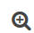
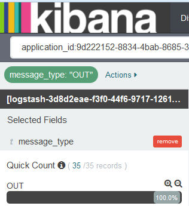
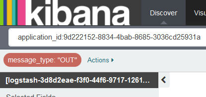

---

copyright:
  years: 2015, 2017

lastupdated: "2017-03-13"

---

{:shortdesc: .shortdesc}
{:new_window: target="_blank"}
{:codeblock: .codeblock}
{:screen: .screen}

# Filtering your CF app logs by message type
{:#k4_filter_cf_logs_by_msg_type}

You can view and filter Cloud Foundry logs by message type in Kibana.
{:shortdesc}

Complete the following steps to search for entries that include a specific message type:

1. Look at the Kibana Discover page to see what subset of your data it displays. For more information, see [Identifying the data that is displayed in your Kibana Discover page](logging_kibana_analize_logs_interactively.html#k4_identify_data).

2. In the *Field List*, select the field **message_type**.

    The following figure shows values found for the field *message_type* in the logs of a CF app:
    
         

3. To add a filter that searches for entries that include a specific *message_type*, choose the magnifying button  for that value.

    For example, to add a filter that includes log entries that have a message_type value of *OUT*, select the magnifying glass button  that is available for the value *OUT* in the *Fields list* section. The following figure shows the filter for the message_type value *OUT* enabled.
    
    

    To add a filter that searches for entries that do not include a specific *message_type*, choose the magnifying button  for the value.
    
    For example, to add a filter that excludes log entries for the message_type *OUT*, select the magnifying glass button  that is available for the value *CELL* in the *Fields list* section. The following figure shows the filter that excludes entries for the message_type value *OUT*.

    

