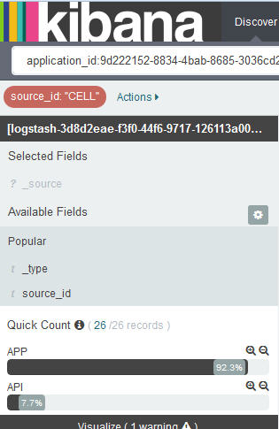

---

copyright:
  years: 2015, 2017

lastupdated: "2017-04-06"

---

{:shortdesc: .shortdesc}
{:new_window: target="_blank"}
{:codeblock: .codeblock}
{:screen: .screen}

# Filtering logs in Kibana
{:#k4_filter_logs}

In the Discover page, you can create search queries and apply filters to constrain the information that is displayed for analysis.
{:shortdesc}

* You can define one or more search queries in the search bar of the Discover page. A search query defines a subset of log entries. Use the Lucene query language to define a search query. 

* You can add filters from the *Fields list* or from the table entries. A filter refines the data selection by including or excluding information. You can enable or disable a filter, invert the filter action, toggle the filter on or off, or remove it entirely. 

After you define a new search, save it so you can reuse it for future analysis in the Discover page or to create visualizations that you can use in custom dashboards. For more information, see [Saving a search](logging_kibana_filtering_logs.html#k4_save_search).

When you perform a new search, the histogram, the table, and the Fields list are updated automatically to show the search results. To find out what data is shown, see [Identifying the data that is displayed in the Discover page](k4_identify_data.html#k4_identify_data).

The following list outline scenarios of how to filter data in your logs:

* You can create custom searches to filter your logs. For more information, see [Filtering logs by defining custom queries](k4_filter_queries.html#k4_filter_queries).

* You can search your log for entries that include a specific text in the value of a field. For more information, see [Filtering your logs for a specific text in a field value](k4_filter_logs_spec_text.html#k4_filter_logs_spec_text).
 
* You can search your log for a specific field value or exclude entries from the log for a specific field value. For more information, see [Filtering your logs for a specific field value](k4_filter_logs_spec_field.html#k4_filter_logs_spec_field).
 
* You can filter your logs to show entries within a time period. For more information, see [Setting a time filter](logging_kibana_set_time_filter.html#set_time_filter).
     

## Adding a filter for a value that is not listed in the *Fields list*
{:#k4_add_filter_out_value}

To add a filter for a value that is not shown in the *Field list*, search for records that include that value through a query. Then. add the filter from the table entry that is available in the Discover page. 

Complete the following steps to add a filter for value that is not available in the list shown in the *Fields list* section:

1. Look at the Kibana Discover page to see what subset of your data it displays. For more information, see [Identifying the data that is displayed in your Kibana Discover page](logging_kibana_analize_logs_interactively.html#k4_identify_data).

    For example, the following figure shows the values of instances for a CF app in the *Fields list*. 
    
    
    
    You are interested in instance number *3*, but it is not available in the list that you can see.

2. In the Discover page, modify the query to search for a specific field value.

    For example, to search for instance *3*, the query that you enter is the following: 
   `application_id:9d222152-8834-4bab-8685-3036cd25931a AND instance_id:"3"`
    
    
    
    In the table, you can see any records that match your query. 
    
 3. Expand one record, and select the magnifying glass button  to add a filter.
 
     For example, to add a filter for the instance ID with value *3*, click the magnifying glass button  by the field *instance_id*.
     
     
     
4. Check that the filter has been added.

    For example, the following figure shows the filter enabled after you add it from the table.
    
    
    
    

## Filtering your logs for a specific field value
{:#k4_filter_logs_spec_field}

You can search for entries that include a specific field value. 

Complete the following steps to search for entries that include a specific field value:

1. Look at the Kibana Discover page to see what subset of your data it displays. For more information, see [Identifying the data that is displayed in your Kibana Discover page](logging_kibana_analize_logs_interactively.html#k4_identify_data).

2. In the *Field List*, identify the field for which you want to define a filter and click it.

    A maximum of 5 values is shown for the field. Each value has two magnifying glass buttons. 
    
    If you cannot see the value, see [Adding a filter for a value that is not listed in the Fields list](k4_add_filter_out_value.html#k4_add_filter_out_value).

3. To add a filter that searches for entries with a field value, choose the magnifying button  for that value.

    

    To add a filter that searches for entries that do not include that field value, choose the magnifying button  for the value.

    

4. Choose any of the following options to work with filters in Kibana:

    <table>
      <caption>Table 1. Methods to work with filters</caption>
      <tbody>
        <tr>
          <th align="center">Option</th>
          <th align="center">Description</th>
          <th align="center">Other info</th>
        </tr>
        <tr>
          <td align="left">Enable</td>
          <td align="left">Select this option to enable a filter.</td>
          <td align="left">When you add a filter, it is automatically enabled.   If a filter is disable, click on it to enable it.</td>
        </tr>
        <tr>
          <td align="left">Disable</td>
          <td align="left">Select this option to disable a filter.</td>
          <td align="left">After you add a filter, if you want to hide entries for a field value, click **disable**.</td>
        </tr>
        <tr>
          <td align="left">Pin</td>
          <td align="left">Select this option to persist the filter across Kibana pages.</td>
          <td align="left">You can pin a filter in the *Discover* page, the *Visualize* page, or the *Dashboard* page.</td>
        </tr>
        <tr>
          <td align="left">Toggle</td>
          <td align="left">Select this option to toggle a filter.</td>
          <td align="left">By default, entries that match a filter are displayed. To display entries that do not match, toggle the filter.</td>
        </tr>
        <tr>
          <td align="left">Remove</td>
          <td align="left">Select this option to remove a filter.</td>
          <td align="left"></td>
        </tr>
      </tbody>
    </table>

## Filtering your CF app logs by source
{:#k4_filter_logs_by_source}

Complete the following steps to search for entries that include a specific log source:

1. Look at the Kibana Discover page to see what subset of your data it displays. For more information, see [Identifying the data that is displayed in your Kibana Discover page](logging_kibana_analize_logs_interactively.html#k4_identify_data).

2. In the *Field List*, select the field **source_id**.

         

3. To add a filter that searches for entries that include a specific source_id, choose the magnifying button  for that value.

    For a list of log sources that are available for CF apps, see [Log sources for CF apps](../logging_cf_apps.html#logging_bluemix_cf_apps_log_sources).

    For example, to add a filter that includes log entries about the start, stop, or crash of a CF application, select the magnifying glass button  that is available for the value *CELL* in the *Fields list* section. The following figure shows the filter for the source_id value *CELL* enabled.
    
    

    To add a filter that searches for entries that do not include a specific source_id, choose the magnifying button  for the value.
    
    For example, to add a filter that excludes log entries about the start, stop, or crash of a CF application, select the magnifying glass button  that is available for the value *CELL* in the *Fields list* section. The following figure shows the filter that excludes entries for the source_id value *CELL*.

    

## Filtering your logs by log type
{:#k4_filter_logs_by_log_type}

Complete the following steps to search for entries that include a specific log type:

1. Look at the Kibana Discover page to see what subset of your data it displays. For more information, see [Identifying the data that is displayed in your Kibana Discover page](logging_kibana_analize_logs_interactively.html#k4_identify_data).

2. In the *Field List*, select the field **type**.

    For example, in the following figure, only one log type is available: *syslog*
    
    
   
3. To add a filter that searches for a specific log type, choose the magnifying button  for the type of log that you want to analyze.

    For example, to add a filter that includes log entries for *syslog*, select the magnifying glass button  that is available for the value *syslog* in the *Fields list* section. The following figure shows the filter that includes entries for the log type *syslog*.

    

    To add a filter that searches for entries that do not include a specific log type, choose the magnifying button  for the value.

     For example, to add a filter that excludes log entries for *syslog*, select the magnifying glass button  that is available for the value *syslog* in the *Fields list* section. The following figure shows the filter that excludes entries for the log type *syslog*.
     
     

## Filtering your logs by instance ID
{:#k4_filter_logs_by_instance_id}

Complete the following steps to view and filter your logs by instance ID on the Kibana dashboard:

1. Look at the Kibana Discover page to see what subset of your data it displays. For more information, see [Identifying the data that is displayed in your Kibana Discover page](logging_kibana_analize_logs_interactively.html#k4_identify_data).

2. In the *Field List*, select one of the following fields to search for a specific instance ID:

    * **instance_ID**: This field lists the different instance IDs that are available in the log for a Cloud Foundry application. 
    * **instance**: This field lists the different GUIDs of all the instances for a container group. 

    For example, the following figure shows different values of instances for a CF app:
    
    
   
3. To add a filter that searches for a specific log type, choose the magnifying button  for the type of log that you want to analyze.

   For example, to add a filter that includes entries for CF app instance *2*, select the magnifying glass button  that is available for the value *2* in the Fields list section. The following figure shows the filter that includes entries for instance *2*.
    
    

    To add a filter that searches for entries that do not include a specific instance ID, choose the magnifying button  for the value.

     For example, to add a filter that excludes entries for CF app instance *2*, select the magnifying glass button  that is available for the value *2* in the Fields list section. The following figure shows the filter that excludes entries for instance *2*.
     
      

## Filtering your CF app logs by message type
{:#k4_filter_cf_logs_by_msg_type}

Complete the following steps to search for entries that include a specific message type:

1. Look at the Kibana Discover page to see what subset of your data it displays. For more information, see [Identifying the data that is displayed in your Kibana Discover page](logging_kibana_analize_logs_interactively.html#k4_identify_data).

2. In the *Field List*, select the field **message_type**.

    The following figure shows values found for the field *message_type* in the logs of a CF app:
    
         

3. To add a filter that searches for entries that include a specific *message_type*, choose the magnifying button  for that value.

    For example, to add a filter that includes log entries that have a message_type value of *OUT*, select the magnifying glass button  that is available for the value *OUT* in the *Fields list* section. The following figure shows the filter for the message_type value *OUT* enabled.
    
    

    To add a filter that searches for entries that do not include a specific *message_type*, choose the magnifying button  for the value.
    
    For example, to add a filter that excludes log entries for the message_type *OUT*, select the magnifying glass button  that is available for the value *CELL* in the *Fields list* section. The following figure shows the filter that excludes entries for the message_type value *OUT*.

    

## Filtering your logs for a specific text in a field value
{:#k4_filter_logs_spec_text}

View and search for entries that include a specific text in the value of a field. 

**Notice:** You can only do a free text search of string fields that are analyzed by the Elasticsearch analyzer. 
    
When Elasticsearch analyzes the value of a string field, it splits the text on word boundaries, as defined by the Unicode Consortium, removes punctuation and lowercases all words.
    
Complete the following steps to search for entries that include specific text in a field value:

1. Look at the Kibana Discover page to see what subset of your data it displays. For more information, see [Identifying the data that is displayed in your Kibana Discover page](logging_kibana_analize_logs_interactively.html#k4_identify_data).

2. Identify the fields that are analyzed in ElasticSearch by default.

    To display the complete list of analyzed fields that are available for searching and filtering log data, [reload the list of fields](logging_kibana_analize_logs_interactively.html#kibana_discover_view_reload_fields). Then, in the *Fields list* that is available in the Discover page, complete the following steps:
    
    1. Click the configure icon . The section **Selected fields**, where you can filter fields, is displayed.

        
    
    2. To identify the fields that are analyzed, select **Yes** for the search field **Analyzed**.

        
    
        The list of analyzed fields is shown.
    
        
        
         
    3. Check if the field in which you want to look for free text is a field that is analyzed by ElasticSearch by default.
    
3. If the field is analyzed, modify the query to search for entries in the logs that include that free text as part of the value of a field.

    
**Example**

If you launch Kibana for a Cloud Foundry (CF) application from the {{site.data.keyword.Bluemix}} UI, and you want to look for a specific message that includes the message ID *CWWKT0016I:*, modify the search to include the free text.
    
1. Check the search query that is loaded and the data that is displayed in the Discover page.
       
    
        
2. To search for the message ID *CWWKT0016I*, modify the search query and press **Enter**:
    
    <pre class="pre">application_id:f52f6016-3aab-4b5c-aa2e-5493747cb978 AND message:"CWWKT0016I:" </pre>
        
    
      
The table shows entries for your CF app where the text *CWWKT0016I* is part of the value in the *message* field.
    
     	
        

## Setting a time filter
{: #set_time_filter}

View and filter {{site.data.keyword.Bluemix_notm}} logs within a time period by configuring the *Time Picker*.

You can configure the *Time Picker* in the Discover page. By default, it is set to the last 15 minutes. 

Complete the following steps to search for entries that include a specific time:

1. In the Discover page menu bar, click the Time Picker .

2. Set up the time interval. 

    You can define any of the following types of time intervals:
    
    * Quick: These are predefined time intervals that include the most common uses of both Relative and Absolute time intervals, for example, *Today* and *This Month*. 
    
        
    
    * Relative: These are time intervals where you can specify the starting date and time, and the end date and time. You can round by the hour.
    
        
    
    * Absolute: These are time intervals between a star date and an end date.
    
        
      

After you configure a time interval, the data shown in Kibana corresponds to entries within that time range.

