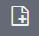
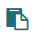

---

copyright:
  years: 2015, 2017

lastupdated: "2017-04-06"

---

{:shortdesc: .shortdesc}
{:new_window: target="_blank"}
{:codeblock: .codeblock}
{:screen: .screen}

# Analyzing logs in Kibana through a dashboard
{:#kibana_analize_logs_dashboard}

Use the *Dashboard* page in Kibana to display collections of visualizations that are grouped in dashboards. Use the dashboards to analyze your log data and compare results.
{:shortdesc}

In {{site.data.keyword.Bluemix}}, there are different types of dashboards that you can define and customize to visualize and analyze the data. For example, the following table lists some common dashboard types:

| Type of dashboard | Description |
|-------------------|-------------|
| Single-cf-app dashboard | This is a dashboard that shows information for a single Cloud Foundry application. |
| Single container dashboard  | This is a dashboard that shows information for a single container.  |
| Container group dashboard  | This is a dashboard that shows information for a specific container group.  |
| Multi-cf-app dashboard | This is a dashboard that shows information for all the Cloud Foundry applications that are deployed in the same  {{site.data.keyword.Bluemix_notm}} space.  | 
| Multi-container dashboard | This is a dashboard that shows information for all the containers that are deployed in the same  {{site.data.keyword.Bluemix_notm}} space.  |
| Space dashboard | This is a dashboard that shows logging data that is available in a {{site.data.keyword.Bluemix_notm}} space.  | 
{: caption="Table 1. Samples of dashboard types" caption-side="top"}

To visualize the data in a dashboard, you configure panels. Kibana includes different visualizations such as table, trends, and histogram that you can use to analyze the information. A visualization is added as a panel to a dashboard. You can add, remove, and rearrange panels in the dashboard. The objective of each panel varies. Some panels are organized into rows that provide the results of a one or more queries. Other panels display documents or custom information. Each panel is based on a search. The search defines the subset of data that the panel displays. For example, you can configure a bar chart, pie chart, or table to visualize the data and analyze it.  

The following table lists different tasks that you can perform in the Dashboard page:

| Task | More information |
|------|------------------|
| [Create a new dashboard](logging_kibana_analize_logs_dashboard.html#K4_dashboard_new) | You can create multiple dashboards. Each dashboard can be designed to include different searches, visualizations, and a different subset of log data.  |
| [Save a dashboard](logging_kibana_analize_logs_dashboard.html#k4_dashboard_save) | You can save a dashboard for later reuse. |
| [Load a dashboard](logging_kibana_analize_logs_dashboard.html#k4_dashboard_reload) | You can upload a dashboard to either update its data, modify it, or analyze the data. |
| [Delete a dashboard](logging_kibana_analize_logs_dashboard.html#k4_dashboard_delete) | Delete dashboards that are not required. |
| [Export a dashboard](logging_kibana_analize_logs_dashboard.html#k4_dashboard_export) | You can export a dashboard as a JSON file. |
| [Import a dashboard](logging_kibana_analize_logs_dashboard.html#k4_dashboard_import) | You can import a dashboard as a JSON file. |
| [Share a dashboard](logging_kibana_analize_logs_dashboard.html#k4_dashboard_share) | You can share a dashboard through your HTML source or through the Kibana dashboard. |
| [Add a visualization](logging_kibana_analize_logs_dashboard.html#k4_dashboard_add_visualization) | You can add an existing visualization or search to a dashboard.|
{: caption="Table 2. Tasks to work with dashboards" caption-side="top"}

For more information about Kibana, see the [Kibana User Guide ](https://www.elastic.co/guide/en/kibana/4.1/index.html){: new_window}.

## Adding a new search or visualization
{: #k4_dashboard_add_visualization}

Complete the following steps to add an existing visualization or search:

1. In the toolbar of the Dashboard page, click the **Add visualization** button .

    **Note**: You can add visualizations and searches. 

2. Select the **Visualizations** tab to add a visualization or select the **Searches** tab to add a search.

3. Click the search or visualization that you want to add.

    A panel for that search or visualization is added to the dashboard.

## Creating a new Kibana dashboard
{: #K4_dashboard_new}

Complete the following steps to create a new dashboard:

1. In the toolbar of the Dashboard page, click the **New dashboard** button .

2. Add one or more searches and visualizations. For more information, see [Adding a new search or visualization](logging_kibana_analize_logs_dashboard.html#K4_dashboard_add_visualization).

    When you add a search or a visualization, a panel is added in the dashboard.

3. Drag a panel and drop in the part of the dashboard where you want to position it.
 
4. Save the dashboard for future reuse. For more information, see [Saving a Kibana dashboard](logging_kibana_analize_logs_dashboard.html#k4_dashboard_save).

## Deleting a Kibana dashboard
{: #k4_dashboard_delete}

To delete a visualization, complete the following steps in the Settings page:

1. In the Settings page, select the **Objects** tab.

2. In the **Visualizations** tab, select the visualizations that you want to delete.

3. Click **Delete**.

## Exporting a Kibana dashboard
{: #k4_dashboard_export}

To export a dashboard as a JSON file, complete the following steps in the Settings page:

1. In the Settings page, select the **Objects** tab.

2. In the **Dashboard** tab, select the dashboard that you want to export.

3. Click **Export**.

4. Save the file.

## Importing a Kibana dashboard
{: #k4_dashboard_import}

To import a dashboard as a JSON file, complete the following steps in the Settings page:

1. In the Settings page, select the **Objects** tab.

2. In the **Dashboard** tab, select **Import**.

3. Select a file and click **Open**.

The dashboard is added to the list of dashboards.

## Loading a Kibana dashboard
{: #k4_dashboard_reload}

Complete the following steps to load a saved dashboard:

1. In the toolbar of the Dashboard page, click the **Load Saved Dashboard** button .

2. Select the dashboard that you want to load. 

## Saving a Kibana dashboard
{: #k4_dashboard_save}

Complete the following steps to save a Kibana dashboard after you customize it:

1. In the toolbar, click the **Save** button .

2. Enter a name for the dashboard.

    **Note:** If you try to save a dashboard with a name containing blank spaces, it will not save.

3. Next to the name field, click the **Save** icon.

## Sharing a Kibana dashboard
{: #k4_dashboard_share}

Complete the following steps to share a dashboard:

1. In the toolbar of the Dashboard page, click the **Share dashboard** button .

2. Choose one of the following actions:

    * **Embed this dashboard**: Select this option to share the dashboard through your HTML source. 
    
        Click the copy button  to copy the HTML code that you can use to embed the dashboard in your HTML source. 
        
        **Note**: To see the dashboard, the users must be able to access Kibana.
	
    * **Share a link**:  Select this option to share the dashboard in Kibana with other users.

