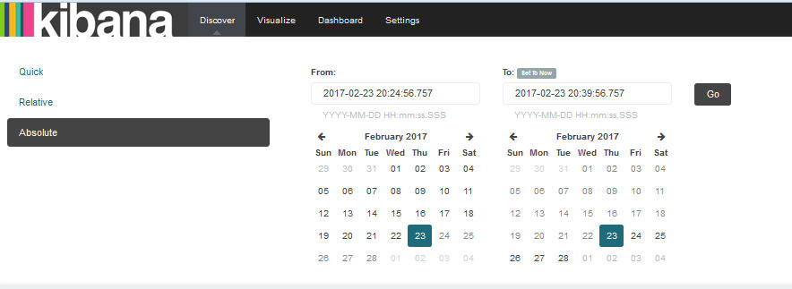

---

copyright:
  years: 2015, 2017

lastupdated: "2017-03-13"

---

{:shortdesc: .shortdesc}
{:new_window: target="_blank"}
{:codeblock: .codeblock}
{:screen: .screen}

# Setting a time filter
{: #set_time_filter}

View and filter {{site.data.keyword.Bluemix}} logs within a time period by configuring the *Time Picker*.
{:shortdesc}

You can configure the *Time Picker* in the Discover page. By default, it is set to the last 15 minutes. 

Complete the following steps to search for entries that include a specific time:

1. In the Discover page menu bar, click the Time Picker .

2. Set up the time interval. 

    You can define any of the following types of time intervals:
    
    * Quick: These are predefined time intervals that include the most common uses of both Relative and Absolute time intervals, for example, *Today* and *This Month*. 
    
        
    
    * Relative: These are time intervals where you can specify the starting date and time, and the end date and time. You can round by the hour.
    
        
    
    * Absolute: These are time intervals between a star date and an end date.
    
        
      

After you configure a time interval, the data shown in Kibana corresponds to entries within that time range.

