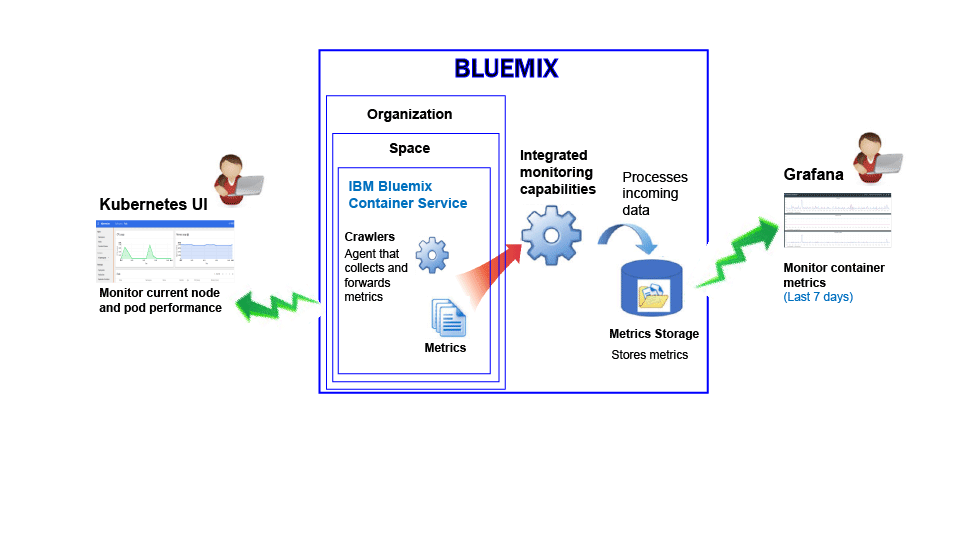
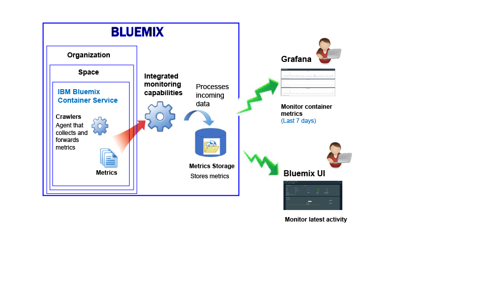

---

copyright:
  years: 2015, 2017

lastupdated: "2017-05-26"

---

{:shortdesc: .shortdesc}
{:new_window: target="_blank"}
{:codeblock: .codeblock}
{:screen: .screen}

# Monitoring for the IBM Bluemix Container service
{: #monitoring_bmx_containers_ov}

In {{site.data.keyword.Bluemix}}, container metrics are collected automatically from outside of the container, without having to install and maintain agents inside of the container. You can use Grafana to visualize container metrics. You can also use the Kubernetes UI to view metrics for nodes (workers) and pods.
{:shortdesc}

## Collecting metrics for a container that runs in a Kubernetes cluster
{: #metrics_containers_kube_ov}

In {{site.data.keyword.Bluemix_notm}}, when you deploy applications in a Kubernetes cluster, consider the following information:

* In a {{site.data.keyword.Bluemix_notm}} account, you can have 1 or more organizations.
* Each organization can have 1 or more {{site.data.keyword.Bluemix_notm}} spaces.
* You can have 1 or more Kubernetes clusters in an organization.
* Collection of metrics is enabled automatically when you create a Kubernetes cluster.
* A Kubernetes cluster is agnostic of {{site.data.keyword.Bluemix_notm}} spaces. However, the metrics collected for a cluster and its resources is associated with a {{site.data.keyword.Bluemix_notm}} space.
* Metrics are collected for a container as soon as the pod is deployed.
* You can view metrics in Grafana or in the Kubernetes UI.
* To visualize metric data for a cluster, you must configure Grafana dashboards for the Cloud Public region where the cluster is created.

Before you create a cluster, either through the {{site.data.keyword.Bluemix_notm}} UI or through the command line, you must log into a specific {{site.data.keyword.Bluemix_notm}} region, account, organization, and space. The space where you are logged in is the space where metric data for the cluster and its resources is collected.

The following figure shows a high level view of monitoring for the {{site.data.keyword.containershort}}:

The crawler is a process that is running in the host and performs agentless monitoring for metrics. The crawler constantly collects the following metrics from all of the containers by default:

<table>
  <caption>Table 1. Metrics captured by default</caption>
  <tr>
    <th>Metric Type</th>
    <th>Metric Name</th>
    <th>Description</th>
  </tr>
  <tr>
    <td>Memory</td>
    <td>*memory_current*</td>
    <td>This metric reports the bytes of memory that the container is currently using. </td>
  </tr>
  <tr>
    <td>Memory</td>
    <td>*memory_limit*</td>
    <td>This metric reports on the memory amount that a container is allowed to swap to disk in comparison to the maximum and minimum limits set for a pod.    By default, pods run with unlimited memory limits. A pod can consume as much memory as is on the worker where it is running. When you deploy a pod, you can set limits to the amount of memory that a pod can use. </td>
  </tr>
  <tr>
    <td>CPU</td>
    <td>*cpu_usage*</td>
    <td>This metric reports the nanoseconds of cpu time across all cores.   When the CPU usage is high, you may experience delay. High CPU usage indicates insufficient processing power.</td>
  </tr>
  <tr>
    <td>CPU</td>
    <td>*cpu_usage_pct*</td>
    <td>This metric reports on the CPU time that is used as a percentage of the CPU's capacity.   When the percentage of CPU usage is high, you may experience delay. High CPU usage indicates insufficient processing power.</td>
  </tr>
  <tr>
    <td>CPU</td>
    <td>*cpu_num_cores*</td>
    <td>This metric reports on the number of CPU cores that are available to the container.</td>
  </tr>
</table>

## Collecting metrics for a container managed in Bluemix
{: #metrics_containers_bmx_ov}

The following figure shows a high level view of monitoring for the {{site.data.keyword.containershort}}:

The crawler constantly collects the following metrics from all of the containers by default:

* CPU
* Memory
* Network information

## Monitoring metrics for a container that runs in a Kubernetes cluster
{: #monitoring_metrics_kube}

Metrics are collected and displayed in both the Kubernetes UI and Grafana:

* Use Grafana, an open source analytics and visualization platform, to monitor, search, analyze, and visualize your metrics in a variety of graphs, for example charts and tables.
 
    You can launch Grafana from a browser. For more information, see [Navigating to the Grafana dashboard from a web browser](../grafana/navigating_grafana.html#launch_grafana_from_browser).
    
* Use the Kubernetes UI to view metrics for nodes and pods. For more information, see [Web UI Dashboard ](https://kubernetes.io/docs/tasks/access-application-cluster/web-ui-dashboard/){: new_window}.

## Monitoring metrics for a container managed in Bluemix
{: #monitoring_metrics_bmx}

Metrics are collected and displayed in both the {{site.data.keyword.Bluemix_notm}} UI and Grafana:

* Use Grafana, an open source analytics and visualization platform, to monitor, search, analyze, and visualize your metrics in a variety of graphs, for example charts and tables.
 
    You can launch Grafana from the {{site.data.keyword.Bluemix_notm}} UI or from a browser. For more information, see [Navigating to the Grafana dashboard](../grafana/navigating_grafana.html#navigating_grafana).
    

* Use the {{site.data.keyword.Bluemix_notm}} UI to view the latest metrics.

    To view the metrics in the {{site.data.keyword.Bluemix_notm}} UI, see [Analyzing metrics from the Bluemix console](analyzing_metrics_bmx_ui.html#analyzing_metrics_bmx_ui).

## Metrics retention
{: #metrics_retention}

Up to one data point per minute is collected. Container metrics that have not been written to in 7 days are deleted.
    

