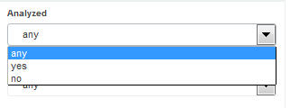
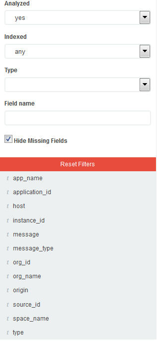

---

copyright:
  years: 2015, 2017

lastupdated: "2017-03-13"

---


{:shortdesc: .shortdesc}
{:new_window: target="_blank"}
{:codeblock: .codeblock}
{:screen: .screen}

# Protokolle nach einem bestimmten Text in einem Feldwert filtern
{:#k4_filter_logs_spec_text}

Sie können nach Einträgen suchen, die einen bestimmten Text im Wert eines Felds enthalten.
{:shortdesc}

**Hinweis:** Sie können eine Freitextsuche nur über Zeichenfolgefelder ausführen, die durch Elasticsearch Analyzer analysiert wurden. 
    
Wenn Elasticsearch den Wert eines Zeichenfolgefelds analysiert, gliedert die Analysefunktion den Text an den durch das Unicode Consortium definierten Wortgrenzen auf, entfernt die Interpunktion und setzt alle Wörter in Kleinbuchstaben um. 
    
Führen Sie die folgenden Schritte aus, um nach Einträgen zu suchen, die bestimmten Text in einem Feldwert enthalten: 

1. Schauen Sie sich die Kibana-Seite 'Discover' an, um festzustellen, welche Untergruppe Ihrer Daten dort angezeigt wird. Weitere Informationen finden Sie unter [Auf der Kibana-Seite 'Discover' angezeigte Daten ermitteln]((logging_kibana_analize_logs_interactively.html#k4_identify_data). 

2. Ermitteln Sie die Felder, die in ElasticSearch standardmäßig analysiert werden. 

    Zum Anzeigen der vollständigen Liste der analysierten Felder, die für das Suchen und Filtern von Protokolldaten verfügbar sind, [laden Sie die Feldliste erneut](logging_kibana_analize_logs_interactively.html#kibana_discover_view_reload_fields). 
Führen Sie anschließend in der Feldliste *Fields*, die auf der Seite 'Discover' verfügbar ist, die folgenden Schritte aus: 
    
    1. Klicken Sie auf das Symbol zum Konfigurieren . Der Abschnitt **Selected fields** wird angezeigt, in dem Sie Filterfelder hinzufügen können. 

        
    
    2. Wählen Sie zum Ermitteln der Felder, die analysiert werden, die Option **Yes** für das Suchfeld **Analyzed** aus. 

        
    
        Die Liste der analysierten Felder wird angezeigt. 
    
        
        
         
    3. Prüfen Sie, ob das Feld, in dem Sie nach Text mit freiem Format suchen wollen, ein Feld ist, das standardmäßig von ElasticSearch analysiert wird. 
    
3. Wenn das Feld analysiert wird, ändern Sie die Abfrage, um nach Einträgen in den Protokollen zu suchen, die diesen Text mit freiem Format als Teil des Werts eines Felds enthalten. 

    
**Beispiel**

Wenn Sie Kibana für eine Cloud Foundry-Anwendung (CF-Anwendung) aus der {{site.data.keyword.Bluemix}}-Benutzerschnittstelle heraus starten und nach einer bestimmten Nachricht suchen wollen, die die Nachrichten-ID *CWWKT0016I:* enthält, ändern Sie die Suche, um den Text mit freiem Format einzuschließen. 
    
1. Prüfen Sie die geladene Suchabfrage und die auf der Seite 'Discover' angezeigten Daten. 
       
    
        
2. Für die Suche nach der Nachrichten-ID *CWWKT0016I* ändern Sie die Suchabfrage und drücken die **Eingabetaste**: 
    
    ```
	application_id:f52f6016-3aab-4b5c-aa2e-5493747cb978 AND message:"CWWKT0016I:" 
	```
        
    
      
    
Die Tabelle zeigt Einträge für Ihre CF-App an, in denen der Text *CWWKT0016I* Teil des Werts im Feld *message* ist. 
    
     	
        
 
 
