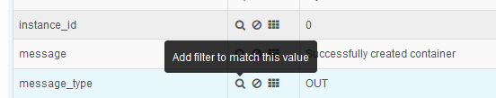

---

copyright:
  years: 2016, 2017
lastupdated: "2017-02-16"

---

{:new_window: target="_blank"}
{:shortdesc: .shortdesc}
{:screen:.screen}
{:codeblock:.codeblock}

# Filtrado de registros de apps de Cloud Foundry por tipo de mensaje en Kibana
<!-- for example, Uploading your data -->
{: #logging_kibana_message_type_filter}
<!-- Provide an appropriate ID above -->

Puede ver y filtrar registros de aplicaciones de {{site.data.keyword.Bluemix_notm}} por tipo de mensaje en el panel de control de Kibana. Puede acceder al panel de control de Kibana desde el separador **Registros** de la app de Cloud Foundry. 
{:shortdesc}

<!-- Include a sentence to briefly introduce the steps/subtopics. Example: -->
Lleve a cabo las tareas siguientes para ver y filtrar los registros de la app de Cloud Foundry por tipo de mensaje en el panel de control de Kibana:

1. Acceda al separador **Registros** de la app de Cloud Foundry. 

    1. Pulse el nombre de la app en el panel de control **Apps** de {{site.data.keyword.Bluemix_notm}}.
    2. Pulse el separador **Registros**. 
    
    Se muestran los registros de la app.

2. Acceda al panel de control de Kibana de la app. Para ello, pulse **Vista avanzada** . Se visualiza el panel de control de Kibana.

3. En la ventana **TODOS LOS SUCESOS**, pulse el icono de flecha hacia la derecha para mostrar todos los campos. 

    

4. En el panel **Campos**, seleccione **message_type** para visualizar el componente que ha generado cada entrada del registro en la ventana **TODOS LOS SUCESOS**.

    

5. En la ventana **TODOS LOS SUCESOS**, pulse una fila de suceso de registro para ver los detalles de dicho suceso. Elija un suceso que muestre el **message_type** que desea filtrar.

    

6. Añada un filtro para incluir o excluir información sobre un tipo de mensaje. 

    * Para añadir un filtro que incluya información sobre un tipo de mensaje, pulse el icono **Lupa**  en la fila message_type de la tabla. 
    
           
    
    * Para añadir un filtro que excluya información sobre un tipo de mensaje, pulse el icono **Exclusión**  en la fila message_type de la tabla. 
    
    Se añade una nueva condición de filtro al panel de control de Kibana.

7. Si lo desea, repita el paso anterior para añadir un filtro para otros tipos de mensaje. Para ver la lista completa de tipos de mensaje, consulte [Formato de registro](../logging_view_kibana3.html#kibana_log_format_cf).

9. Guarde el panel de control.    
        
    Cuando haya terminado de crear los filtros, pulse el icono **Guardar**  y escriba un nombre para el panel de control. 
      
    **Nota:** si intenta guardar un panel de control con un nombre que contenga espacios en blanco, no se guardará. Escriba un nombre sin espacios y pulse el icono **Guardar**.
    
    .

Ha creado un panel de control que filtra las entradas de registro por tipo de mensaje. Puede cargar el panel de control que ha guardado en cualquier momento pulsando el icono **Carpeta**  y seleccionando el panel de control por nombre.
