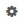

---

copyright:
  years: 2016, 2017
lastupdated: "2017-02-07"

---

{:new_window: target="_blank"}
{:shortdesc: .shortdesc}
{:screen:.screen}
{:codeblock:.codeblock}

# Creación de tablas y gráficos a partir de consultas en Kibana
{: #logging_kibana_tables_graphs}

Utilice Kibana para crear gráficos y tablas para sus consultas para visualizar los datos de registro y los resultados de una comparación. Puede acceder al panel de control de Kibana desde el separador **Registros** de la app de Cloud Foundry. 
{:shortdesc}

El panel de control de Kibana está organizado como una serie de filas, cada una de las cuales contiene uno o varios paneles. Puede configurar paneles para visualizar representaciones gráficas de sus datos. Utilice consultas para determinar qué datos desea visualizar. Para crear un gráfico o una tabla, primero debe crear una fila en blanco; a continuación, cree un panel. Si accede al panel de control de Kibana desde el separador **Registros** de la app de CF, el panel de control muestra automáticamente dos paneles: un histograma y una tabla.

Lleve a cabo las tareas siguientes para añadir un gráfico o una tabla en el panel de control de Kibana:

1. Para acceder al separador **Registros** de la app de Cloud Foundry, pulse el nombre de la app en la tabla **Apps de Cloud Foundry** en el panel de control **Apps** de {{site.data.keyword.Bluemix_notm}}; luego pulse el separador **Registros**. Se muestran los registros de la app.

2. Para acceder al panel de control de Kibana de la app, pulse **Vista avanzada** . Se visualiza el panel de control de Kibana.

3. En el panel de control de Kibana, desplácese hasta la parte inferior del panel de control y pulse **AÑADIR UNA FILA**  para crear una fila para el panel que desea añadir. Se muestra el panel Valores del panel de control. 
	
	
	
	En el panel Añadir fila, escriba un nombre para la fila en el campo **Título**; luego pulse **Crear fila**. Se añade una fila nueva. Puede ajustar el orden de las filas pulsando los iconos de **flecha arriba** o **flecha abajo** que hay junto a los títulos de las filas. Cuando ha definido el orden de las filas, pulse **Guardar**. Se crea una fila vacía en el panel de control de Kibana.

4. Para añadir un panel, pulse **Añadir panel a fila vacía**. Se muestra el panel Valores de fila.

    
	
	Puede elegir distintos tipos de panel, como por ejemplo **tabla**, **histograma** o **términos**, en la lista desplegable **Seleccionar tipo de panel**. Seleccione **términos** para crear un diagrama de barras, un diagrama circular o una tabla basada en sus consultas. Aparecerán varias opciones de configuración en el panel Valores de fila.
	
	
	
	Configure el panel. Escriba un **Título** para su visualización gráfica. Seleccione **Amplitud** del panel en la lista desplegable; la **Amplitud** determina la anchura del panel en el panel de control. En la sección Parámetros, suprima el contenido de **Campo** y escriba un campo de registro válido, por ejemplo `instance_id`. 

5. En la sección Opciones de vista, seleccione **barra**, **circular** o **tabla** en la lista desplegable **Estilo** para elegir un diagrama de barras, un diagrama circular o una tabla. En la sección Consultas, seleccione **seleccionada** en la lista desplegable **Consultas** para utilizar los datos de registro de las consultas del panel de control. Finalmente, pulse **Guardar**. El panel nuevo se mostrará en el panel de control.

	
	
6. Para cambiar este panel de forma que muestre una tabla, pulse el icono **Configurar** . Se muestra el panel Valores de términos. 

	
	
	Pulse el separador **Panel**; a continuación, seleccione **tabla** en la lista desplegable **Estilo**. Pulse **Guardar** para actualizar el panel y volver al panel de control.

7. Añada más filas y paneles a su panel de control. Cuando termine, guarde los cambios en este panel de control pulsando el icono **Guardar**.

    **Nota:** si intenta guardar un panel de control con un nombre que contenga espacios en blanco, no se guardará. Escriba un nombre sin espacios y pulse el icono **Guardar**.

    .

