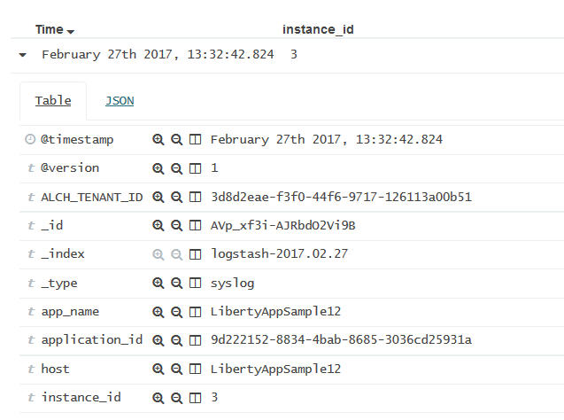

---

copyright:
  years: 2015, 2017

lastupdated: "2017-03-01"

---

{:shortdesc: .shortdesc}
{:new_window: target="_blank"}
{:codeblock: .codeblock}
{:screen: .screen}

# Adición de un filtro para un valor que no aparece en la *Lista de campos*
{:#k4_add_filter_out_value}

Para añadir un filtro para un valor que no se muestra en la *Lista de campos*, busque los registros que incluyen dicho valor mediante una consulta. A continuación, añada el filtro de la entrada de la tabla que está disponible en la página Descubrir.
{:shortdesc}

Siga los pasos siguientes para añadir un filtro para un valor que no está disponible en la lista que se muestra en la sección *Lista de campos*: 

1. Examine la página Descubrir de Kibana para ver el subconjunto de datos que muestra. Para obtener más información, consulte [Identificación de los datos que se muestran en la página Descubrir de Kibana](logging_kibana_analize_logs_interactively.html#k4_identify_data). 

    Por ejemplo, en la figura siguiente se muestran los valores de las instancias correspondientes a una app CF en la *Lista de campos*.  
    
    
    
    Está interesado en la instancia número *3*, pero no está disponible en la lista que se ve. 

2. En la página Descubrir, modifique la consulta para que busque un determinado valor de campo. 

Por ejemplo, para buscar la instancia *3*, la consulta que debe especificar es la siguiente:
   `application_id:9d222152-8834-4bab-8685-3036cd25931a AND instance_id:"3"`
    
    
    
    En la tabla verá los registros que coincidan con la consulta. 
    
 3. Expanda un registro y seleccione el botón de lupa  para añadir un filtro.
 
     Por ejemplo, para añadir un filtro para el ID de instancia con el valor *3*, pulse el botón de lupa  que hay junto al campo *instance_id*.
     
     
     
4. Compruebe que el filtro se ha añadido.

    Por ejemplo, la figura siguiente muestra el filtro habilitado después de añadirlo desde la tabla.
    
    
    
    
