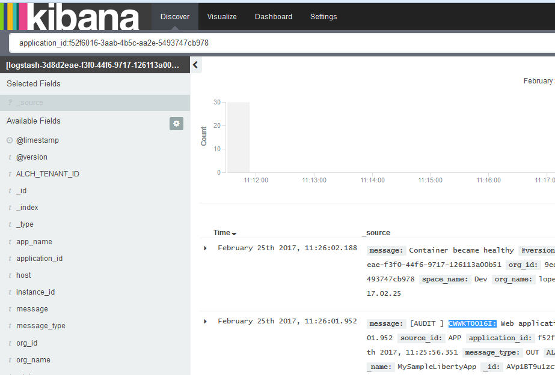
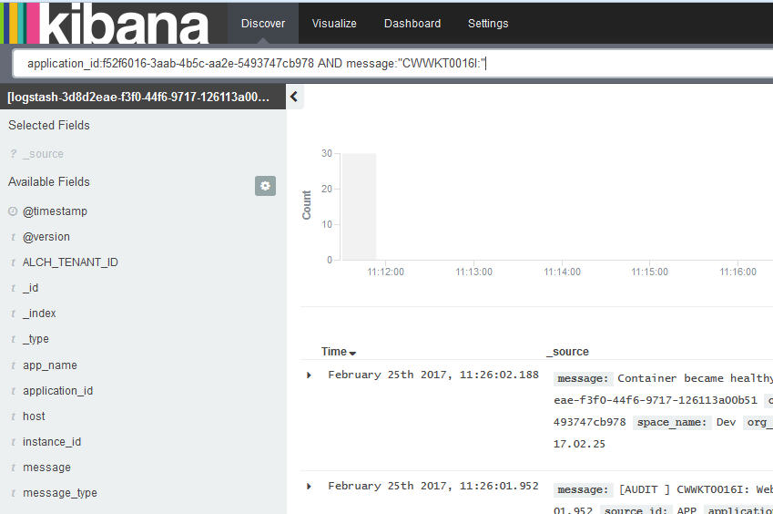

---

copyright:
  years: 2015, 2017

lastupdated: "2017-03-13"

---


{:shortdesc: .shortdesc}
{:new_window: target="_blank"}
{:codeblock: .codeblock}
{:screen: .screen}

# Filtrado de los registros correspondientes a un texto específico en un valor de campo
{:#k4_filter_logs_spec_text}

Vea y busque entradas que incluyan un texto específico en el valor de un campo.
{:shortdesc}

**Aviso:** Solo puede realizar una búsqueda de texto libre de campos de serie de caracteres que analice en analizador Elasticsearch.  
    
Cuando Elasticsearch analiza el campo valor de una serie, divide el texto en límites de palabras, según lo establecido por el consorcio Unicode, y elimina los signos de puntuación y las minúsculas en todas las palabras.
    
Siga estos pasos para buscar entradas que incluyan un determinado texto en un valor de campo:


1. Examine la página Descubrir de Kibana para ver el subconjunto de datos que muestra. Para obtener más información, consulte [Identificación de los datos que se muestran en la página Descubrir de Kibana]((logging_kibana_analize_logs_interactively.html#k4_identify_data). 

2. Identifique los campos que se analizan en ElasticSearch de forma predeterminada.

    Para ver la lista completa de campos analizados que están disponibles para buscar y filtrar datos de registro, [vuelva a cargar la lista de campos](logging_kibana_analize_logs_interactively.html#kibana_discover_view_reload_fields). A continuación, en la *Lista de campos* disponible en la página Descubrir, siga los pasos siguientes:
    
    1. Pulse el icono de configuración . Se muestra la sección **Campos seleccionados**, donde puede filtrar los campos. 

        
    
    2. Para identificar los campos que se analizan, seleccione **Sí** en el campo de búsqueda **Analizado**.

        
    
        Se muestra la lista de campos analizados. 
    
        
        
         
    3. Compruebe si el campo en el que desea buscar texto libre es un campo analizado por ElasticSearch de forma predeterminada.
    
3. Si es un campo analizado, modifique la consulta para buscar las entradas en los registros que incluyan dicho texto libre como parte del valor de un campo.

    
**Ejemplo**

Si inicia Kibana para una aplicación Cloud Foundry (CF) desde la IU de {{site.data.keyword.Bluemix}} y desea buscar un determinado mensaje que incluya el ID de mensaje *CWWKT0016I:*, modifique la búsqueda para que incluya el texto libre.
    
1. Compruebe la consulta de búsqueda que se carga y los datos que se muestran en la página Descubrir. 
       
    
        
2. Para buscar el ID de mensaje *CWWKT0016I*, modifique la consulta de búsqueda y pulse **Intro**:
    
    ```
	application_id:f52f6016-3aab-4b5c-aa2e-5493747cb978 AND message:"CWWKT0016I:"
	```
        
    
      
    
La tabla muestra las entradas de la app CF en las que el texto *CWWKT0016I* forma parte del valor del campo *Mensaje*. 
    
     	
        
 
 
