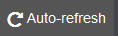

---

copyright:
  years: 2015, 2017

lastupdated: "2017-04-06"

---

{:shortdesc: .shortdesc}
{:new_window: target="_blank"}
{:codeblock: .codeblock}
{:screen: .screen}

# Análisis interactivo de registros en Kibana
{:#kibana_analize_logs_interactively}

En la página Descubrir, puede ver y analizar los registros de {{site.data.keyword.Bluemix}} de forma interactiva. Puede definir consultas de búsqueda para filtrar los datos utilizando el lenguaje de consulta Lucene. Para cada consulta de búsqueda, puede aplicar filtros para precisar las entradas que están disponibles para el análisis. Puede guardar una búsqueda para su reutilización en el futuro.
{:shortdesc}

En {{site.data.keyword.Bluemix_notm}}, de forma predeterminada el conjunto de datos que se muestra en la página Descubrir cuando se inicia Kibana desde la IU de {{site.data.keyword.Bluemix_notm}} está configurado de modo que solo muestre las entradas de la aplicación Cloud Foundry (CF) o contenedor desde el que se ha iniciado Kibana. Para obtener más información sobre cómo ver el subconjunto de datos que muestra la página Descubrir, consulte [Identificación de los datos que se muestran](logging_kibana_analize_logs_interactively.html#k4_identify_data).

En la tabla siguiente se muestra la consulta predeterminada por recurso cuando se inicia Kibana desde {{site.data.keyword.Bluemix_notm}}:

| Recurso | Consulta de búsqueda predeterminada de Kibana |
|---------------|---------------|
| Aplicación CF   | `application_id:<app_GUID>`    |
| Un solo contenedor Docker | `instance:<instance_GUID>`    |
| Grupo de contenedores con 2 instancias | `instance:<instance_GUID> OR instance:<instance_GUID>` |
{: caption="Tabla 1. Búsquedas de consulta predeterminadas" caption-side="top"}

**Nota:** 
* Cada vez que inicie Kibana desde la IU de {{site.data.keyword.Bluemix_notm}}, los datos que vea corresponderán a la consulta que se está predefinida de forma predeterminada y que se basa en el patrón de índice.
* En la página Descubrir se muestra un máximo de 500 entradas, que corresponden a las entradas más recientes. Puede modificar este valor en la página Valores.

Cuando inicie Kibana desde un navegador, los datos que se muestran en la página Descubrir incluirán todos los datos de registro que están disponibles en el espacio en el que ha iniciado la sesión. La página no se limita a contenedores o apps específicos.

La página Descubrir incluye un histograma y una tabla que puede personalizar para analizar los datos de forma interactiva. 

Puede realizar cualquiera de las tareas siguientes para personalizar la tabla en la página Descubrir:

| Tarea | Descripción | 
|------|-------------|
| [Añadir una columna de campo](logging_kibana_analize_logs_interactively.html#kibana_discover_add_fields_to_table) | Añadir campos para ver datos específicos que se necesitan para el análisis en lugar de todo el mensaje. |
| [Reorganizar una columna de campo](logging_kibana_analize_logs_interactively.html#kibana_discover_rearrange_fields_in_table) | Mover la posición de un campo en la tabla a la posición que desee. |
| [Ver una entrada](logging_kibana_analize_logs_interactively.html#kibana_discover_view_entry_in_table) | Expandir una entrada de la tabla para ver los detalles de la entrada analizados por campo o como JSON. |
| [Eliminar una columna de campo](logging_kibana_analize_logs_interactively.html#kibana_discover_remove_fields_from_table) | Eliminar un campo cuando ya no se necesite en la vista para el análisis. |
| [Ordenar entradas por valor de un campo indexado](logging_kibana_analize_logs_interactively.html#kibana_discover_sort_by_table) | Reordenar las entradas para facilitar su análisis. |
| [Renovar automáticamente los datos](logging_kibana_analize_logs_interactively.html#kibana_discover_view_refresh_interval) | Renovar los datos que se muestran en la tabla con las últimas entradas. De forma predeterminada, la renovación está **DESACTIVADA**. |
{: caption="Tabla 2. Tareas para personalizar una tabla" caption-side="top"}

 

En la figura siguiente se muestra un ejemplo de una tabla de la página Descubrir:

Puede definir otras búsquedas. Para obtener más información, consulte [Filtrado de registros mediante la definición de búsquedas personalizadas](k4_filter_queries.html#k4_filter_queries). Cuando defina una nueva búsqueda, los datos que se muestran en el histograma y en la tabla se actualizan automáticamente.

Para definir una nueva búsqueda, utilice la consulta de búsqueda predeterminada como punto de partida y luego ajuste la búsqueda realizando las tareas siguientes:

* Aplicar filtros de campo para ajustar el conjunto de datos que puede ver. Puede conmutar cada filtro, fijarlo a la página, habilitarlo o inhabilitarlo según sea necesario y configurarlo para que incluya o excluya el valor. Para obtener más información, consulte [Filtrado de registros en Kibana](logging_kibana_filtering_logs.html#kibana_filtering_logs).

    **Consejo:** Si no encuentra un campo que esperaba ver en la *Lista de campos*, o si alguna de las lupas que aparecen por campos listados está inhabilitada en la página Descubrir, vuelva a cargar la lista de campos renovando el patrón de índice en la página Valores. Para obtener más información, consulte [Cómo volver a cargar la lista de campos](logging_kibana_analize_logs_interactively.html#kibana_discover_view_reload_fields).

    Por ejemplo, si la app CF tiene varias instancias, es posible que desee analizar los datos correspondientes a una instancia específica. Puede definir un filtro de campo para el ID de instancia específico que desea analizar. 
    
* Personalizar el *Selector de tiempo* para datos basados en tiempo. Puede definir un rango de tiempo absoluto para una consulta, o uno relativo, o bien elegir entre un conjunto de valores predefinidos. Para obtener más información, consulte [Establecimiento de un filtro de tiempo](logging_kibana_set_time_filter.html#set_time_filter).

Después de configurar la búsqueda que define el subconjunto de datos que desea analizar, puede guardarla para volverla a utilizar posteriormente.

Puede realizar cualquiera de las siguientes tareas con búsquedas que defina en la página Descubrir:

| Tarea | Descripción |
|------|-------------|
| [Guardar una búsqueda](logging_kibana_filtering_logs.html#k4_save_search) | Guardar la búsqueda para volverla a utilizar posteriormente.  |
| [Suprimir una búsqueda](logging_kibana_filtering_logs.html#k4_delete_search) | Suprimir una búsqueda cuando ya no se necesite. |
| [Exportar una búsqueda](logging_kibana_filtering_logs.html#k4_export_search) | Exportar una búsqueda para compartirla.  |
| [Volver a cargar una búsqueda](logging_kibana_filtering_logs.html#k4_reload_search)  | Cargar una búsqueda existente para analizar un conjunto de datos. |
| [Renovar los datos de una búsqueda](logging_kibana_filtering_logs.html#k4_refresh_search) | Configurar la renovación automática de los datos que se visualizan en la búsqueda.  |
| [Importar una búsqueda](logging_kibana_filtering_logs.html#k4_import_search) | Importar una búsqueda.  |
{: caption="Tabla 3. Tareas para trabajar con búsquedas" caption-side="top"}

 

También puede examinar las estadísticas en la página Descubrir:
* Puede ver estadísticas por campo. 
* Puede ver estadísticas en el histograma por el valor `@timestamp` que ha configurado.

Para obtener más información, consulte [Visualización de estadísticas de datos de campo](logging_kibana_analize_logs_interactively.html#kibana_discover_view_fields_stats).

**Nota:** Los datos que se muestran en la tabla y el histograma son estáticos. Para seguir viendo las últimas entradas, debe definir un intervalo de renovación. 

## Adición de columnas de campo a la tabla
{: #kibana_discover_add_fields_to_table}

La tabla que está disponible para analizar datos en la página Descubrir incluye los campos siguientes de forma predeterminada:
* **time:** Este campo indica cuándo se ha capturado y registrado la entrada en {{site.data.keyword.Bluemix_notm}}.
* **_source:**  Este campo incluye los datos originales de la entrada.

Puede añadir una columna de campo a la tabla seleccionando cualquiera de las siguientes opciones:

* Añadir una columna de campo de la Lista de campos que está disponible en la página.

    1. En la página Descubrir, identifique el campo en la sección `Campos seleccionados`.
    2. Mueva el puntero del ratón sobre un campo de la lista de campos.
    
        
    
    3. Para añadir un campo, pulse **Añadir**.
    
 * Añadir una columna de campo de la vista de tabla de la entrada expandida.

    1. Expanda una entrada de la tabla.
    2. En la vista Tabla, identifique el campo que desea añadir.
    
        
    
    3. Pulse el icono **Conmutar columna en tabla** .
    

**Nota:** Cuando añada una columna de campo a la tabla por primera vez, la columna de campo *_source* que se muestra en la tabla está oculto. El campo *_source* muestra el valor de cada uno de los campos para cada entrada de registro. Para ver otros valores de campo para una entrada de registro en la tabla después de añadir una columna a la tabla, consulte el separador de la vista de tabla o el separador JSON de cada entrada.

Por ejemplo, si añade el campo *application_id* a la tabla, la tabla se modifica y adquiere este aspecto:

## Renovación automática de los datos
{: #kibana_discover_view_refresh_interval}

De forma predeterminada, en {{site.data.keyword.Bluemix_notm}} el periodo de *Renovación automática* está **DESACTIVADO** y los datos que puede ver en Kibana corresponden a los últimos 15 minutos desde que se ha iniciado Kibana. Los 15 minutos corresponden al filtro de tiempo preconfigurado. Puede cambiar este valor definiendo otro periodo de tiempo. Para obtener más información, consulte [Establecimiento de un filtro de tiempo](logging_kibana_set_time_filter.html#set_time_filter).

Siga los pasos siguientes para definir un periodo de *Renovación automática*:

1. En la barra de menús de la página Descubrir, pulse Selector de tiempo .

2. Seleccione el botón de renovación automática .

3. Seleccione un intervalo de renovación.

    

Puede colocar en pausa el intervalo de renovación pulsando el botón de pausa  

## Identificación de los datos que se visualizan en la página Descubrir
{:#k4_identify_data}

Cuando se utiliza Kibana para analizar los registros de {{site.data.keyword.Bluemix_notm}}, los datos que puede ver dependen de cómo inicie Kibana, del patrón de índice configurado y de la consulta personalizada y los filtros que haya aplicado.

Tenga en cuenta la información siguiente para identificar los datos que están disponibles en la tabla y en el histograma en la página Descubrir:

1. Consulte el patrón de índice en la página Valores.

    El patrón de índice define la consulta de búsqueda que se aplica de forma predeterminada para mostrar las entradas en las páginas de Kibana. De forma predeterminada, el patrón de índice está preconfigurado y establecido en todos los datos que están disponibles en un espacio de {{site.data.keyword.Bluemix_notm}}. Por ejemplo,

    * Si inicia Kibana desde la IU de {{site.data.keyword.Bluemix_notm}}, es decir, desde la sección *Registro* de las páginas de la IU de un recurso específico como una aplicación o contenedor Cloud Foundry (CF), el patrón de índice que se aplica incluye todas las entradas que están disponibles en el espacio.
    
    * Si inicia Kibana desde un navegador, el patrón de índice que se aplica incluye todas las entradas que están disponibles en el espacio que Kibana muestra en el que ha iniciado la sesión.
        
2. Compruebe la consulta en la página Descubrir.  

    La consulta que se muestra en la página Descubrir se utiliza para filtrar las entradas que están disponibles de forma predeterminada para el análisis. Por ejemplo:

    * Si escribe cualquier serie de caracteres en la barra de búsqueda, la consulta explora todos los campos en busca de dicha serie.
    
    * Si la consulta se ha establecido en `application_id:<GUID>` donde *GUID* es el ID de una app CF, las entradas que puede ver corresponden a todas las entradas que están disponibles para esa app CF en el espacio que está configurado en el patrón de índice.
    
    * Si la consulta se ha establecido en `instance_id:<GUID>` donde *GUID* es el ID de una instancia de contenedor, las entradas que puede ver corresponden a todas las entradas que están disponibles para dicho contenedor en el espacio que está configurado en el patrón de índice.
    
    * Si la consulta se ha establecido en `instance_id:<GUID> AND instance_id:<GUID>` donde *GUID* es el ID de una instancia de contenedor, las entradas que pueda ver corresponden a todas las entradas que están disponibles para ese grupo de contenedores en el espacio que está configurado en el patrón de índice.
   
    * Si la consulta se ha establecido en `*`, los datos se establecen en todas las entradas que están disponibles en el espacio que está configurado en el patrón de índice.
    
    * Si la consulta se ha establecido en `application_id:<GUID> AND message:"MY_search_text"` donde *GUID* es el ID de una app CF y *My_search_text* es la serie que desea buscar, las entradas que puede ver corresponden a todas las entradas que incluyen *My_search_text* en el campo de mensaje para las entradas de la app CD disponibles en el espacio configurado en el patrón de índice.
    
3. Compruebe los filtros de campo que se aplican a la consulta en la página Descubrir.

    Puede definir 0 o más filtros de campo para conmutar entradas en función del valor del campo. Por ejemplo, si un filtro de campo está habilitado, las entradas que pueda ver corresponden a las entradas en las que el valor de dicho campo coincide.
    

## Ordenación de entradas por valor de un campo indexado 
{: #kibana_discover_sort_by_table}

Sólo puede clasificar entradas de la tabla para los campos están indexados.

Para ver qué campos están indexados, siga estos pasos:

1. En la página Descubrir, pulse el icono de configuración . Se muestra la sección en la que puede filtrar campos en la sección **Campos seleccionados** de la página.

    
    
2. Para identificar los campos que están indexados, seleccione **Sí** en el campo de búsqueda **Indexado**.

    
    
 Se muestra la lista de campos indexados.
 
 
  	
 
Para ordenar las entradas de una tabla por los valores de un campo indexado, siga los pasos siguientes: 

1. Mueva el puntero del ratón sobre el nombre del campo de la tabla por el cual desea ordenar los datos. Aparecen los distintos botones de acción.
2. Pulse el botón de clasificación correspondiente al campo por el que desea clasificar los datos. Pulse el icono de clasificación de campo una segunda vez para invertir el orden de clasificación.

**Nota:** Cuando clasifique por un campo de tiempo, de forma predeterminada las entradas se clasifican en orden cronológico inverso. Las entradas más recientes aparecen en primer lugar.

## Reorganización de las columnas de campo en la tabla
{: #kibana_discover_rearrange_fields_in_table}

Puede reorganizar las columnas de campo en la tabla. Mueva el puntero del ratón sobre la cabecera de la columna que desea mover y pulse el botón **Mover columna a la izquierda** o el botón **Mover columna a la derecha**.
 

## Cómo volver a cargar la lista de campos
{: #kibana_discover_view_reload_fields}

Siga los pasos siguientes para volver a cargar la lista de campos que se visualizan en Kibana:

1. Seleccione la página Valores.

    Cuando selecciona la página Valores, se abre el separador *Índices*.
   
2. Seleccione el patrón de índice para ver cada uno de los campos patrón y el tipo principal asociado al campo registrado por Elasticsearch. 

3. Pulse el botón *Volver a cargar lista de campos*  para volver a cargar los campos del patrón de índice. 

La lista de campos se renueva.

## Eliminación de columnas de campo de la tabla
{: #kibana_discover_remove_fields_from_table}

Para eliminar campos de la tabla, siga estos pasos:

1. En la tabla, identifique el campo que desea eliminar de la vista de tabla.
2. Pulse **Eliminar columna**.
    
    

## Visualización de una entrada de la tabla
{: #kibana_discover_view_entry_in_table}

Para ver los datos de una entrada de la tabla, pulse el botón expandir  de la entrada que desea analizar. 

 	

Luego elija una de las opciones siguientes para ver los datos:

* Para ver los datos en formato de tabla, pulse **Tabla**. Puede ver el valor de cada campo que está disponible para el análisis en formato de tabla. Para cada campo, también dispone de botones de filtro y de un botón para conmutar.
* Para ver los datos en formato Json, pulse **JSON**.

## Visualización de estadísticas de datos de campo
{: #kibana_discover_view_fields_stats}

En la página Descubrir, puede ver estadísticas para cada campo en la *Lista de campos* y en el *histograma*. 

Puede ver la información siguiente en la lista de campos:
* El número de entradas de la tabla que contienen un campo determinado.
* Los 5 valores principales.
* El porcentaje de entradas que contienen cada valor.

Puede ver la información siguiente en el histograma:
* Número de entradas en un rango de tiempo.

Para ver las estadísticas en el histograma, pulse una indicación de fecha y hora para ver las estadísticas correspondientes a dicho periodo. Por ejemplo, 

   	
 	
Para ver las estadísticas en un campo de la lista de campos, pulse el nombre. Por ejemplo,

