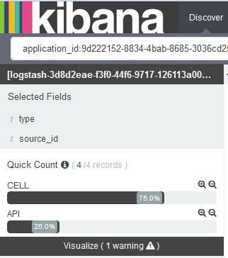

---

copyright:
  years: 2015, 2017

lastupdated: "2017-04-06"

---

{:shortdesc: .shortdesc}
{:new_window: target="_blank"}
{:codeblock: .codeblock}
{:screen: .screen}

# Filtrage des journaux dans Kibana
{:#k4_filter_logs}

Sur la page Discover, vous pouvez définir de nouvelles requêtes de recherche et appliquer des filtres pour circonscrire les informations affichées pour analyse.
{:shortdesc}

* Vous pouvez définir une ou plusieurs requêtes de recherche dans la barre de recherche de la page Discover. Une requête de recherche définit un sous-ensemble d'entrées de journal. Utilisez le langage d'interrogation Lucene pour définir une requête de recherche. 

* Vous pouvez ajouter des filtres depuis la section *Fields list* (Liste de zones) ou depuis les entrées de la table. Un filtre affine la sélection de données en incluant ou en excluant des informations. Vous pouvez activer ou désactiver un filtre, inverser l'opération de filtrage, basculer l'état du filtre ou le supprimer complètement. 

Lorsque vous définissez une nouvelle recherche, enregistrez-la pour pouvoir la réutiliser dans une requête future dans la page Discover ou pour créer des visualisations dans des tableaux de bord personnalisés. Pour plus d'informations, voir [Sauvegarde d'une recherche](logging_kibana_filtering_logs.html#k4_save_search).

Lorsque vous lancez une nouvelle recherche, l'histogramme, le tableau et la section Fields list (Liste des zones) sont mis à jour automatiquement en affichant les résultats de la recherche. Pour déterminer quelles données sont affichées, voir [Identification des données affichées sur la page Discover](k4_identify_data.html#k4_identify_data).

La liste suivante décrit des scénarios de filtrage des données de vos journaux :

* Vous pouvez créer des recherches personnalisées pour filtrer vos journaux. Pour plus d'informations, voir [Filtrage des journaux en définissant des requêtes personnalisées](k4_filter_queries.html#k4_filter_queries).

* Vous pouvez rechercher dans vos journaux des entrées contenant un texte spécifique dans la valeur d'une zone. Pour plus d'informations, voir [Filtrage de vos journaux d'après un texte spécifique dans la valeur d'une zone](k4_filter_logs_spec_text.html#k4_filter_logs_spec_text).
 
* Vous pouvez rechercher dans votre journal une valeur de zone spécifique ou exclure les entrées de journal contenant une valeur de zone spécifique. Pour plus d'informations, voir [Filtrage de vos journaux d'après une valeur de zone spécifique](k4_filter_logs_spec_field.html#k4_filter_logs_spec_field).
 
* Vous pouvez filtrer vos journaux afin d'afficher les entrées correspondant à une période donnée. Pour plus d'informations, voir [Configuration d'un filtre temporel](logging_kibana_set_time_filter.html#set_time_filter).
     

## Ajout d'un filtre pour une valeur non répertoriée dans la section *Fields list* (Liste des zones)
{:#k4_add_filter_out_value}

Pour ajouter un filtre pour une valeur ne figurant pas dans la section *Field list* (Liste des zones), recherchez par le biais d'une requête les enregistrements contenant cette valeur. Ajoutez ensuite le filtre depuis l'entrée de table figurant dans la page Discover. 

Pour ajouter un filtre pour une valeur ne figurant pas dans la section *Fields list* (Liste des zones), procédez comme suit :

1. Examinez la page Discover de Kibana pour identifier le sous-ensemble de données qu'elle affiche. Pour plus d'informations, voir  [Identification des données affichées dans votre page Kibana Discover](logging_kibana_analize_logs_interactively.html#k4_identify_data).

    L'illustration ci-dessous, par exemple, présente les valeurs des instances pour une application CF dans la section *Fields list* (Liste des zones). 
    
    
    
    Supposons que vous êtes intéressé par l'instance numéro *3*, mais qu'elle ne figure pas dans la liste.

2. Dans la page Discover, modifiez la requête afin de rechercher une valeur de zone spécifique.

    Par exemple, pour rechercher l'instance *3*, la requête à saisir serait la suivante :
   `application_id:9d222152-8834-4bab-8685-3036cd25931a AND instance_id:"3"`
    
    
    
    Dans le tableau, vous pouvez voir les enregistrements éventuels correspondant à votre requête. 
    
 3. Développez un enregistrement et sélectionnez la loupe  afin d'ajouter un filtre.
 
     Par exemple, pour ajouter un filtre pour l'ID d'instance avec la valeur *3*, cliquez sur la loupe  en regard de la zone *instance_id* (ID d'instance).
     
     
     
4. Vérifiez que le filtre a été ajouté.

    L'illustration suivante, par exemple, indique que le filtre a été activé après son ajout depuis le tableau.
    
    
    
    

## Filtrage de vos journaux d'après une valeur de zone spécifique
{:#k4_filter_logs_spec_field}

Vous pouvez rechercher des entrées contenant une valeur de zone spécifique. 

Pour rechercher des entrées contenant une valeur de zone spécifique, procédez comme suit :

1. Examinez la page Discover de Kibana pour identifier le sous-ensemble de données qu'elle affiche. Pour plus d'informations, voir  [Identification des données affichées dans votre page Kibana Discover](logging_kibana_analize_logs_interactively.html#k4_identify_data).

2. Dans la zone *Field List* (Liste des zones), identifiez celle pour laquelle vous désirez définir un filtre et cliquez dessus.

    5 valeurs au maximum sont affichées pour la zone. Chaque valeur comporte deux boutons en forme de loupe. 
    
    Si vous ne voyez pas la valeur recherchée, voir [Ajout d'un filtre pour une valeur non répertoriée dans la liste des zones](k4_add_filter_out_value.html#k4_add_filter_out_value).

3. Pour ajouter un filtre recherchant des entrées avec une valeur de zone spécifique, sélectionnez la loupe  en regard de cette valeur.

    

    Pour ajouter un filtre recherchant des entrées n'incluant pas la valeur de zone, sélectionnez la loupe  en regard de cette valeur.

    

4. Choisissez l'une des options suivantes pour utiliser des filtres dans Kibana :

    <table>
      <caption>Tableau 1. Méthodes de gestion de filtres</caption>
      <tbody>
        <tr>
          <th align="center">Option</th>
          <th align="center">Description</th>
          <th align="center">Autres informations</th>
        </tr>
        <tr>
          <td align="left">Enable</td>
          <td align="left">Sélectionnez cette option pour activer un filtre.</td>
          <td align="left">Lorsque vous ajoutez un filtre, il est automatiquement activé.   Si un filtre est désactivé, cliquez dessus pour l'activer.</td>
        </tr>
        <tr>
          <td align="left">Disable</td>
          <td align="left">Sélectionnez cette option pour désactiver un filtre.</td>
          <td align="left">Après avoir ajouté un filtre, si vous désirez masquer les entrées correspondant à une valeur de zone, cliquez sur **disable**.</td>
        </tr>
        <tr>
          <td align="left">Pin</td>
          <td align="left">Sélectionnez cette option pour reproduire le filtre sur les pages Kibana.</td>
          <td align="left">Vous pouvez épingler un filtre sur la page *Discover*, la page *Visualize*, ou la page *Dashboard*.</td>
        </tr>
        <tr>
          <td align="left">Toggle</td>
          <td align="left">Sélectionnez cette option pour basculer l'opération du filtre.</td>
          <td align="left">Par défaut, les entrées correspondant à un filtre sont affichées. Pour afficher les entrées ne correspondant pas, basculez l'opération du filtre.</td>
        </tr>
        <tr>
          <td align="left">Remove</td>
          <td align="left">Sélectionnez cette option pour supprimer un filtre.</td>
          <td align="left"></td>
        </tr>
      </tbody>
    </table>

## Filtrage de vos applications CF par source
{:#k4_filter_logs_by_source}

Pour rechercher des entrées de journal se rapportant à une source de journal spécifique, procédez comme suit :

1. Examinez la page Discover de Kibana pour identifier le sous-ensemble de données qu'elle affiche. Pour plus d'informations, voir  [Identification des données affichées dans votre page Kibana Discover](logging_kibana_analize_logs_interactively.html#k4_identify_data).

2. Dans la section *Field List* (Liste des zones), sélectionnez la zone **source_id** (ID source).

         

3. Pour ajouter un filtre recherchant des entrées incluant une valeur source_id spécifique, sélectionnez la loupe  en regard de cette valeur.

    Pour consulter la liste des sources de journal disponibles pour les applications CF, voir [Sources de journal pour les applications CF](../logging_cf_apps.html#logging_bluemix_cf_apps_log_sources).

    Par exemple, pour ajouter un filtre renvoyant les entrées de journal sur le démarrage, l'arrêt ou les pannes d'une application CF, sélectionnez la loupe  en regard de la valeur *CELL* dans la section *Fields list* (Liste des zones). L'illustration suivante présente le filtre avec activation de la valeur source_id *CELL*.
    
    

    Pour ajouter un filtre recherchant des entrées n'incluant pas un élément source_id spécifique, sélectionnez la loupe  en regard de cette valeur.
    
    Par exemple, pour ajouter un filtre afin d'exclure les entrées concernant le démarrage, l'arrêt ou les pannes d'une application CF, sélectionnez la loupe  en regard de la valeur *CELL* dans la section *Fields list* (Liste des zones). L'illustration suivante présente le filtre excluant les entrées associées à la valeur source_id *CELL*.

    

## Filtrage de vos journaux par type de journal
{:#k4_filter_logs_by_log_type}

Pour rechercher des entrées incluant un type de journal spécifique, procédez comme suit :

1. Examinez la page Discover de Kibana pour identifier le sous-ensemble de données qu'elle affiche. Pour plus d'informations, voir  [Identification des données affichées dans votre page Kibana Discover](logging_kibana_analize_logs_interactively.html#k4_identify_data).

2. Dans la section *Field List* (Liste des zones), sélectionnez la zone **type**.

    Par exemple, dans la figure suivante, un seul type de journal est disponible : *syslog*
    
    ")
   
3. Pour ajouter un filtre recherchant un type de journal spécifique, sélectionnez la loupe  en regard du type de journal que vous désirez analyser.

    Par exemple, pour ajouter un filtre afin d'inclure les entrées de journal *syslog*, sélectionnez la loupe  en regard de la valeur *syslog* dans la section *Fields list* (Liste des zones). L'illustration suivante présente le filtre incluant les entrées associées au type de journal *syslog*.

    

    Pour ajouter un filtre recherchant des entrées n'incluant pas un type de journal spécifique, sélectionnez la loupe  en regard de la valeur concernée.

     Par exemple, pour ajouter un filtre afin d'exclure les entrées de journal *syslog*, sélectionnez la loupe  en regard de la valeur *syslog* dans la section *Fields list* (Liste des zones). L'illustration suivante présente le filtre excluant les entrées du type de journal *syslog*.
     
     

## Filtrage de vos journaux par ID d'instance
{:#k4_filter_logs_by_instance_id}

Pour visualiser et filtrer vos journaux par ID d'instance dans le tableau de bord Kibana, procédez comme suit :

1. Examinez la page Discover de Kibana pour identifier le sous-ensemble de données qu'elle affiche. Pour plus d'informations, voir  [Identification des données affichées dans votre page Kibana Discover](logging_kibana_analize_logs_interactively.html#k4_identify_data).

2. Dans la liste des zones (*Field List*), sélectionnez l'une des zones suivantes pour rechercher un ID d'instance spécifique :

    * **instance_ID** : Cette zone répertorie les différents ID d'instance disponibles dans le journal pour une application Cloud Foundry. 
    * **instance** : Cette zone répertorie les différents identificateurs globaux uniques (GUID) de toutes les instances d'un groupe de conteneurs. 

    L'illustration ci-dessous, par exemple, présente différentes valeurs d'instances pour une application CF :
    
    
   
3. Pour ajouter un filtre recherchant un type de journal spécifique, sélectionnez la loupe  en regard du type de journal que vous désirez analyser.

   Par exemple, pour ajouter un filtre afin d'inclure les entrées pour l'instance d'application CF *2*, sélectionnez la loupe  en regard de la valeur *2* dans la section Fields list (Liste des zones). L'illustration suivante présente le filtre incluant les entrées pour l'instance *2*.
    
    

    Pour ajouter un filtre afin de rechercher des entrées n'incluant pas un ID d'instance spécifique, sélectionnez la loupe  en regard de cette valeur.

     Par exemple, pour ajouter un filtre excluant les entrées de l'application CF *2*, sélectionnez la loupe  en regard de la valeur *2* dans la section Fields list (Liste des zones). L'illustration suivante présente le filtre excluant les entrées pour l'instance *2*.
     
      

## Filtrage de vos journaux d'application CF par type de message
{:#k4_filter_cf_logs_by_msg_type}

Pour rechercher des entrées incluant un type de message spécifique, procédez comme suit :

1. Examinez la page Discover de Kibana pour identifier le sous-ensemble de données qu'elle affiche. Pour plus d'informations, voir  [Identification des données affichées dans votre page Kibana Discover](logging_kibana_analize_logs_interactively.html#k4_identify_data).

2. Dans la section *Field List* (Liste des zones), sélectionnez la zone **message_type** (type de message).

    L'illustration suivante présente les valeurs identifiées pour la zone *message_type* dans les journaux d'une application CF :
    
         

3. Pour ajouter un filtre recherchant des entrées incluant un *message_type* spécifique, sélectionnez la loupe  en regard de cette valeur.

    Par exemple, pour ajouter un filtre afin d'inclure les entrées de journal avec le type de message *OUT*, sélectionnez la loupe  en regard de la valeur *OUT* dans la section *Fields list* (Liste des zones). L'illustration suivante présente le filtre avec la valeur message_type *OUT* activée.
    
    

    Pour ajouter un filtre recherchant des entrées n'incluant pas un élément *message_type* spécifique, sélectionnez la loupe  en regard de cette valeur.
    
    Par exemple, pour ajouter un filtre afin d'exclure les entrées de journal de l'élément message_type *OUT*, sélectionnez la loupe  en regard de la valeur *CELL* dans la section *Fields list* (Liste des zones). L'illustration suivante présente le filtre excluant les entrées associées à la valeur message_type *OUT*.

    

## Filtrage de vos journaux d'après un texte spécifique dans la valeur d'une zone
{:#k4_filter_logs_spec_text}

Vous pouvez visualiser et rechercher des entrées incluant un texte spécifique dans la valeur d'une zone. 

**Remarque :** vous ne pouvez effectuer une recherche de texte libre que dans des zones chaîne analysées par l'analyseur Elasticsearch. 
    
Lorsque Elasticsearch analyse la valeur d'une zone de type chaîne, il décompose le texte d'après les limites de mot définies par l'organisme Unicode Consortium, supprime la ponctuation et convertit en minuscules tous les mots.
    
Pour rechercher des entrées contenant un texte spécifique dans une valeur de zone, procédez comme suit :

1. Examinez la page Discover de Kibana pour identifier le sous-ensemble de données qu'elle affiche. Pour plus d'informations, voir  [Identification des données affichées dans votre page Kibana Discover](logging_kibana_analize_logs_interactively.html#k4_identify_data).

2. Identifiez les zones analysées par défaut dans ElasticSearch.

    Pour afficher la liste complète des zones analysées qui sont disponibles pour recherche et filtrage des données de journal, [rechargez la liste des zones](logging_kibana_analize_logs_interactively.html#kibana_discover_view_reload_fields). Ensuite, dans la liste des zones (*Fields list*) disponibles dans la page Discover, procédez comme suit :
    
    1. Cliquez sur l'icône Configurer . La section **Selected fields** (Zones sélectionnées) est affichée et vous permet de filtrer les zones.

        
    
    2. Pour identifier les zones analysées, sélectionnez **Yes** pour la zone de recherche **Analyzed** (Analysé).

        
    
        La liste des zones analysées s'affiche.
    
        
        
         
    3. Vérifiez si la zone dans laquelle vous désirez effectuer une recherche en texte libre est une zone analysée par défaut par ElasticSearch.
    
3. S'il s'agit d'une zone analysée, modifiez la requête afin de rechercher des entrées dans les journaux incluant ce texte libre dans la valeur d'une zone.

    
**Exemple**

Supposons que vous lancez Kibana pour une application Cloud Foundry (CF) depuis l'interface utilisateur de {{site.data.keyword.Bluemix}} et désirez rechercher un message spécifique comportant l'ID de message *CWWKT0016I:*, modifiez la recherche en incluant le texte libre.
    
1. Examinez la requête de recherche chargée et les données affichées sur la page Discover.
       
    
        
2. Pour rechercher l'ID de message *CWWKT0016I*, modifiez la requête de recherche et cliquez sur la touche **Entrée**:
    
    <pre class="pre">application_id:f52f6016-3aab-4b5c-aa2e-5493747cb978 AND message:"CWWKT0016I:" </pre>
        
    
      
Le tableau affiche les entrées pour votre application CF où le texte *CWWKT0016I* fait partie de la valeur de la zone *message*.
    
     	
        

## Définition d'un filtre temporel
{: #set_time_filter}

Vous pouvez visualiser et filtrer des journaux {{site.data.keyword.Bluemix_notm}} sur une période donnée en configurant le *Sélecteur de période*.

Vous pouvez configurer le *sélecteur de période* sur la page Discover. Par défaut, il est configuré sur les 15 dernières minutes. 

Pour rechercher des entrées couvrant une date/heure spécifique, procédez comme suit :

1. Dans la barre de menu de la page Discover, cliquez sur le sélecteur de période .

2. Configurez l'intervalle de temps. 

    Vous pouvez définir l'un des types suivants d'intervalle de temps :
    
    * Quick : Intervalles de temps prédéfinis incluant les utilisations les plus courantes d'intervalle de temps relatif et absolu. Par exemple, *Today* (Aujourd'hui) et *This Month* (Ce mois). 
    
        
    
    * Relative : Intervalles de temps vous permettant de spécifier la date et heure de début et la date et heure de fin. Vous pouvez arrondir sur l'heure la plus proche.
    
        
    
    * Absolute : Intervalles de temps entre un date de début et une date de fin.
    
        
      

Après avoir configuré un intervalle de temps, les données affichées dans Kibana correspondent aux entrées sur la période concernée.

