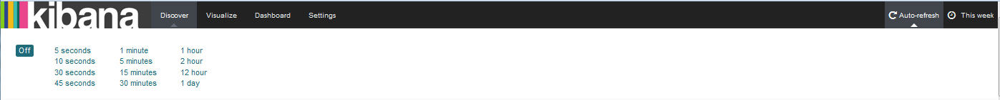

---

copyright:
  years: 2015, 2017

lastupdated: "2017-04-06"

---

{:shortdesc: .shortdesc}
{:new_window: target="_blank"}
{:codeblock: .codeblock}
{:screen: .screen}

# Analyse interactive de journaux dans Kibana
{:#kibana_analize_logs_interactively}

Sur la page Discover (Reconnaître), vous pouvez visualiser et analyser interactivement vos journaux {{site.data.keyword.Bluemix}}. Vous pouvez définir des requêtes de recherche pour filtrer ces données à l'aide du langage d'interrogation Lucene. Pour chaque requête de recherche, vous pouvez appliquer des filtres pour affiner les entrées disponibles pour analyse. Vous pouvez sauvegarder une recherche pour la réutiliser plus tard.
{:shortdesc}

Par défaut, dans {{site.data.keyword.Bluemix_notm}}, le jeu de données affiché sur la page Discover (Reconnaître) lorsque vous lancez Kibana depuis l'interface utilisateur de {{site.data.keyword.Bluemix_notm}} est configurée pour n'afficher que les entrées de l'application ou du conteneur CF (Cloud Foundry) depuis lequel vous avez lancé Kibana. Pour plus d'informations sur les sous-ensembles de données affichés par la page Discover, voir [Identification des données affichées](logging_kibana_analize_logs_interactively.html#k4_identify_data).

Le tableau suivant décrit la requête par défaut par ressource lorsque vous lancez Kibana depuis {{site.data.keyword.Bluemix_notm}}:

| Ressource | Requête de recherche Kibana par défaut |
|---------------|---------------|
| Application CF   | `ID_application<GUID_application>`    |
| Conteneur Docker unique | `instance:<GUID_instance>`    |
| Groupe de conteneurs avec 2 instances | `instance:<GUID_instance> OU instance:<GUID_instance>` |
{: caption="Tableau 1. Requête de recherches par défaut" caption-side="top"}

**Remarque :** 
* Chaque fois que vous lancez Kibana depuis l'interface utilisateur de {{site.data.keyword.Bluemix_notm}}, les données affichées correspondent à la requête prédéfinie par défaut et baséee sur le canevas d'index.
* 500 entrées au maximum (correspondant aux plus récentes) sont affichées sur la page Discover (Reconnaître). Vous pouvez modifier cette valeur sur la page Settings (Paramètres).

Lorsque vous lancez Kibana depuis un navigateur, les données affichées sur la page Discover (Reconnaître) correspondent aux données de journal disponibles dans l'espace auquel vous êtes connecté. La page n'est pas limitée à des conteneurs ou à des applications spécifiques.

La page Discover (Reconnaître) inclut un histogramme et un tableau que vous pouvez personnaliser pour analyser interactivement les données. 

Vous pouvez réaliser n'importe laquelle des tâches suivantes pour personnaliser le tableau de la page Discover (Reconnaître) :

| Tâche | Description | 
|------|-------------|
| [Ajout d'une colonne de zones](logging_kibana_analize_logs_interactively.html#kibana_discover_add_fields_to_table) | Ajout de zones pour affichage de données spécifiques requises pour l'analyse au lieu du message intégral. |
| [Réorganisation d'une colonne de zones](logging_kibana_analize_logs_interactively.html#kibana_discover_rearrange_fields_in_table) | Déplacement de la position d'une zone vers celle voulue. |
| [Affichage d'une entrée](logging_kibana_analize_logs_interactively.html#kibana_discover_view_entry_in_table) | Développement d'une entrée du tableau pour afficher ses informations détaillées analysées par zone ou en tant qu'objet JSON. |
| [Suppression d'une colonne de zone](logging_kibana_analize_logs_interactively.html#kibana_discover_remove_fields_from_table) | Suppression d'une zone superflue de la vue pour analyse. |
| [Classement des entrées par valeur d'une zone indexée](logging_kibana_analize_logs_interactively.html#kibana_discover_sort_by_table) | Réorganisation des entrées pour faciliter l'analyse. |
| [Actualisation automatique des données](logging_kibana_analize_logs_interactively.html#kibana_discover_view_refresh_interval) | Actualisation des données affichées dans le tableau avec les entrées les plus récentes. Par défaut, l'actualisation est en mode **OFF** (désactivée). |
{: caption="Tableau 2. Tâches de personnalisation d'un tableau" caption-side="top"}

 

La figure suivante illustre un exemple de tableau sur la page Discover (Reconnaître) :

Vous pouvez définir d'autres recherches. Pour plus d'informations, voir [Filtrage des journaux en définissant des recherches personnalisées](k4_filter_queries.html#k4_filter_queries). Lorsque vous définissez une nouvelle recherche, les données affichées dans l'histogramme et le tableau sont automatiquement mises à jour.

Pour définir une nouvelle recherche, utilisez comme point de départ la requête de recherche par défaut, puis affinez-la en réalisant les tâches suivantes :

* Appliquez des filtres de zone pour épurer l'ensemble de données affichées. Vous pouvez basculer l'opération de chaque filtre, l'épingler à la page, l'activer ou le désactiver en fonction de vos besoins, et le configurer afin d'inclure ou d'exclure la valeur. Pour plus d'informations, voir [Filtrage des journaux dans Kibana](logging_kibana_filtering_logs.html#kibana_filtering_logs).

    **Conseil :** Si vous ne localisez pas dans la section *Fields list* (Liste des zones) une zone que vous vous attendiez à rencontrer, ou que des loupes en regard de de zones répertoriées sont désactivées sur la page Discover (Reconnaître), rechargez cette liste en actualisant le canevas d'index sur la page Settings (Paramètres). Pour plus d'informations, voir [Rechargement de la liste des zones](logging_kibana_analize_logs_interactively.html#kibana_discover_view_reload_fields).

    Par exemple, si votre application CF comporte plusieurs instances, vous pourriez vouloir analyser les données d'une instance spécifique. Vous pouvez définir un filtre de zone restreignant les données à celles que vous désirez analyser. 
    
* Personnalisez la zone *Time Picker* (sélecteur de période) pour des données temporelles. Vous pouvez définir pour une requête une plage de temps absolue, relative, ou la sélectionner depuis un ensemble de valeurs prédéfinies. Pour plus d'informations, voir [Configuration d'un filtre temporel](logging_kibana_set_time_filter.html#set_time_filter).

Après avoir configuré la recherche définissant le sous-ensemble de données à analyser, vous pouvez la sauvegarder pour une utilisation ultérieure.

Vous pouvez réaliser n'importe laquelle des tâches suivantes avec des recherches que vous avez définies sur la page Discover (Reconnaître) :

| Tâche | Description |
|------|-------------|
| [Save a search](logging_kibana_filtering_logs.html#k4_save_search)(Sauvegarde d'une recherche) | Sauvegarde de votre recherche pour une utilisation ultérieure).  |
| [Delete a search](logging_kibana_filtering_logs.html#k4_delete_search) (Suppression d'une recherche) | Suppression d'une recherche devenue superflue. |
| [Export a search](logging_kibana_filtering_logs.html#k4_export_search) (Exportation d'une recherche) | Exportation d'une recherche pour son partage.  |
| [Reload a search](logging_kibana_filtering_logs.html#k4_reload_search) (Rechargement d'une recherche)  | Téléchargement d'une recherche existante pour nouvelle analyse d'un jeu de données. |
| [Refresh the data of a search](logging_kibana_filtering_logs.html#k4_refresh_search) (Actualisation des données d'une recherche) | Configuration d'une actualisation automatique des données affichées au cours de la recherche.  |
| [Import a search](logging_kibana_filtering_logs.html#k4_import_search) (Importation d'une recherche) | Importation d'une recherche.  |
{: caption="Tableau 3. Tâches de gestion de recherches" caption-side="top"}

 

Vous pouvez également examiner des statistiques sur la page Discover (Reconnaître) :
* Statistiques par zone. 
* Statistiques dans l'histogramme compte tenu du `@timestamp` (horodatage) configuré.

Pour plus d'informations, voir [Affichage des statistiques sur les données de zone](logging_kibana_analize_logs_interactively.html#kibana_discover_view_fields_stats).

**Remarque :** les données affichées dans le tableau et l'histogramme sont statiques. Pour pouvoir visualiser les plus récentes, vous devez définir un intervalle d'actualisation. 

## Ajout de colonnes de zone au tableau
{: #kibana_discover_add_fields_to_table}

Le tableau disponible pour analyse des données sur la page Discover inclut les zones suivantes par défaut :
* **time:** cette zone indique quand l'entrée a été capturée et enregistrée dans {{site.data.keyword.Bluemix_notm}}.
* **_source:**  cette zone contient les données d'origine de l'entrée.

Vous pouvez ajouter une colonne de zone au tableau en sélectionnant l'une des options suivantes :

* Ajout d'une colonne de zone depuis la liste Field (Zone) disponible sur la page.

    1. Sur la page Discover, identifiez la zone dans la section `Selected Fields` (Zones sélectionnées).
    2. Survolez une zone dans la liste Fields.
    
        
    
    3. Pour ajouter une zone, cliquez sur **Add** (Ajouter).
    
 * Ajout d'une colonne de zone depuis la vue de table d'une entrée développée.

    1. Développez une entrée dans le tableau.
    2. Dans la vue Table, identifiez la zone que vous désirez ajouter.
    
        
    
    3. Cliquez sur l'icône **Toggle Column in table** .
    

**Remarque :** lorsque vous ajoutez une colonne de zone à la table pour la première fois, la colonne de zone *_source* affichée dans la table est masquée. La zone *_source* affiche la valeur de chaque zone pour chaque entrée de journal. Pour afficher d'autres valeurs de zone pour une entrée de journal après avoir ajouté une colonne à la table, reportez-vous à l'onglet de vue table ou à l'onglet JSON de chaque entrée.

Par exemple, si vous ajoutez la zone *application_id* à la table, celle-ci est modifiée en adoptant l'apparence suivante :

## Actualisation automatique des données
{: #kibana_discover_view_refresh_interval}

Par défaut, dans {{site.data.keyword.Bluemix_notm}}, la période d'*actualisation automatique* est définie à **OFF** (Désactivée) et les données visibles dans Kibana correspondent aux 15 dernières minutes après le lancement de Kibana. Ces 15 minutes correspondent au filtre temporel préconfiguré. Vous pouvez le modifier en stipulant une plage de temps différente. Pour plus d'informations, voir [Configuration d'un filtre temporel](logging_kibana_set_time_filter.html#set_time_filter).

Procédez comme suit pour définir une période d'*actualisation automatique* :

1. Dans la barre de menu de la page Discover, cliquez sur le sélecteur de période .

2. Sélectionnez le bouton d'actualisation automatique .

3. Sélectionner un intervalle d'actualisation.

    

Vous pouvez interrompre l'intervalle d'actualisation en cliquant sur le bouton Pause  

## Identification des données affichées sur la page Discover (Reconnaître)
{:#k4_identify_data}

Lorsque vous utilisez Kibana pour analyser des journaux {{site.data.keyword.Bluemix_notm}}, les données présentées dépendent de la manière dont vous avez lancé Kibana, du canevas d'index configuré, ainsi que de la requête et des filtres personnalisés que vous pourriez avoir appliqués.

Prenez en compte les informations suivantes pour identifier les données disponibles dans le tableau et l'histogramme de la page Discover (Reconnaître) :

1. Vérifiez le canevas d'index sur la page Settings (Paramètres).

    Le canevas d'index définit la requête de recherche appliquée par défaut pour afficher les entrées sur vos pages Kibana. Par défaut, cet index est préconfiguré et défini sur toutes les données disponibles dans un espace {{site.data.keyword.Bluemix_notm}}. Par exemple

    * Si vous lancez Kibana depuis l'interface utilisateur {{site.data.keyword.Bluemix_notm}} (à savoir depuis la section *Journal* des pages de l'interface utilisateur d'une ressource spécifique comme une application  ou un conteneur d'application Cloud Foundry (CF), le canevas d'index appliqué inclut toutes les entrées disponibles dans l'espace.
    
    * Si vous lancez Kibana depuis un navigateur, le canevas d'index appliqué inclut toutes les entrées disponibles dans l'espace où Kibana indique que vous vous êtes connecté.
        
2. Vérifiez la requête sur la page Discover (Reconnaître).  

    La requête affichée sur la page Discover est utilisée pour filtrer les entrées disponibles par défaut pour analyse. Par exemple :

    * Si vous entrez une chaîne dans la barre de recherche, la recherche examine toutes les zones pour cette chaîne.
    
    * Si la recherche est définie à `application_id:<GUID>`, où *GUID* est l'ID d'une application CF, les entrées que vous pouvez voir correspondent à toutes les entrées disponibles pour cette application CF dans l'espace configuré dans le canevas d'index.
    
    * Si la requête est définie à `instance_id:<GUID>`, où *GUID* est l'ID d'une instance de conteneur, les entrées que vous pouvez voir correspondent à toutes les entrées disponibles pour ce conteneur dans l'espace configuré dans le canevas d'index.
    
    * Si la requête est définie à `instance_id:<GUID> AND instance_id:<GUID>`, où *GUID* est l'ID d'une instance de conteneur, les entrées que vous pouvez voir correspondent à toutes les entrées disponibles pour ce groupe de conteneurs dans l'espace configuré dans le canevas d'index.
   
    * Si la requête est définie à `*`, les données correspondent à toutes les entrées disponibles dans l'espace configuré dans le canevas d'index.
    
    * Si la requête est définie à `application_id:<GUID> AND message:"MY_search_text"`, où *GUID* est l'ID d'une application CF  et *My_search_text* la chaîne à rechercher, les entrées que vous pouvez voir correspondent à toutes les entrées incluant *My_search_text* dans la zone de message pour les entrées de cette application CF disponibles dans l'espace configuré dans le canevas d'index.
    
3. Vérifiez les filtres de zone appliqués à votre requête dans la page Discover (Reconnaître).

    Vous pouvez définir 0 filtre de zone, ou au contraire plusieurs pour basculer les entrées en fonction de la valeur de la zone. Par exemple, si un filtre de zone est activé, les entrées que vous pouvez voir correspondent à celles où la valeur de cette zone correspond.
    

## Tri des entrées d'après la valeur d'une zone indexée 
{: #kibana_discover_sort_by_table}

Vous ne pouvez trier les entrées de la table que pour les zones qui ont été indexées.

Pour identifier les zones indexées, procédez comme suit :

1. Sur la page Discover, cliquez sur l'icône de configuration . La section où vous pouvez filtrer des zones dans la section **Selected fields** (Zones sélectionnées) de la page est affichée.

    
    
2. Pour identifier les zones indexées, sélectionnez **Yes** pour la zone de recherche **Indexed**.

    
    
 La liste des zones indexées est affichée.
 
 
  	
 
Pour trier les entrées d'une table d'après les valeurs d'une zone indexée, procédez comme suit : 

1. Survolez dans la table le nom de la zone d'après laquelle vous désirez trier les données. Les différents boutons d'action apparaissent.
2. Cliquez sur le bouton de tri de la zone d'après laquelle vous désirez trier les données. Cliquez une seconde fois sur le bouton de tri si vous désirez inverser l'ordre de tri.

**Remarque :** lorsque vous effectuez un tri d'après une zone d'heure, les entrées sont triées par défaut en ordre chronologique inverse. Les entrées les plus récentes figurent en premier.

## Réorganisation des colonnes de zone dans la table
{: #kibana_discover_rearrange_fields_in_table}

Vous pouvez réorganiser les colonnes de zone dans la table. Positionnez la souris sur l'en-tête de la colonne que vous désirez déplacer et cliquez sur le bouton **Move column to the left** (Déplacer la colonne vers la gauche) ou sur le bouton **Move column to the right** (Déplacer la colonne vers la droite).
 

## Rechargement de la liste des zones
{: #kibana_discover_view_reload_fields}

Pour recharger la liste des zones affichées dans Kibana, procédez comme suit :

1. Sélectionnez la page Settings (Paramètres).

    Lorsque vous sélectionnez la page Settings (Paramètres), celle-ci s'ouvre sur l'onglet *Indices* (Index).
   
2. Sélectionnez le canevas d'index afin de visualiser chaque zone et le type principal associé à la zone comme enregistré par Elasticsearch. 

3. Cliquez sur le bouton *Reload field list* (Recharger la liste des zones)  afin de recharger les zones du canevas d'index. 

La liste des zones est actualisée.

## Suppression de colonnes de zone dans la table
{: #kibana_discover_remove_fields_from_table}

Pour supprimer des zones de la table, procédez comme suit :

1. Dans la table, identifiez la zone que vous désirez supprimer de la vue Table.
2. Cliquez sur **Remove column** (Supprimer la colonne).
    
    

## Visualisation d'une entrée dans la table
{: #kibana_discover_view_entry_in_table}

Pour afficher les données d'une entrée dans la table, cliquez sur le bouton de développement  de l'entrée que vous désirez analyser. 

 	

Sélectionnez ensuite l'une des options suivantes pour visualiser les données :

* Pour afficher les données sous un format de table, cliquez sur **Table**. La valeur de chaque zone disponible pour analyse est affichée sous un format table. Pour chaque zone, vous disposez aussi de boutons de filtrage et d'un bouton de basculement.
* Pour afficher les données au format Json, cliquez sur **JSON**.

## Affichage des statistiques des données de zone
{: #kibana_discover_view_fields_stats}

Sur la page Discover (Reconnaître), vous pouvez consulter des statistiques sur chaque zone de la section *Fields list* (Liste des zones) et dans l'*histogramme*. 

Les informations suivantes figurent dans la liste des zones :
* Nombre d'entrées dans la table qui contiennent une zone spécifique.
* 5 valeurs les plus élevées.
* Pourcentage des entrées contenant chaque valeur.

Les informations suivantes figurent dans l'histogramme :
* Nombre d'entrées sur un intervalle de temps.

Pour examiner les statistiques dans l'histogramme, cliquez sur un horodatage pour consulter les statistiques sur cette période. Par exemple 

   	
 	
Pour examiner les statistiques sur une zone dans la liste des zones, cliquez sur le nom de la zone. Par exemple

