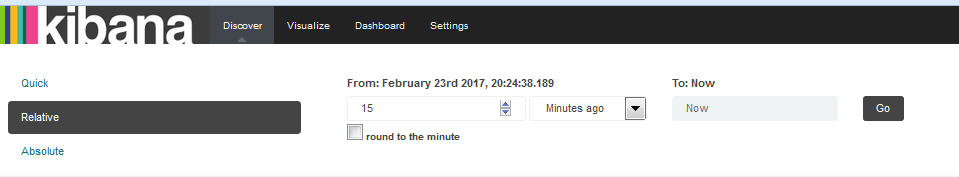

---

copyright:
  years: 2015, 2017

lastupdated: "2017-03-13"

---

{:shortdesc: .shortdesc}
{:new_window: target="_blank"}
{:codeblock: .codeblock}
{:screen: .screen}

# Définition d'un filtre temporel
{: #set_time_filter}

Vous pouvez visualiser et filtrer des journaux {{site.data.keyword.Bluemix}} sur une période donnée en configurant le *Sélecteur de période*.
{:shortdesc}

Vous pouvez configurer le *sélecteur de période* sur la page Discover. Par défaut, il est configuré sur les 15 dernières minutes. 

Pour rechercher des entrées couvrant une date/heure spécifique, procédez comme suit :

1. Dans la barre de menu de la page Discover, cliquez sur le sélecteur de période .

2. Configurez l'intervalle de temps. 

    Vous pouvez définir l'un des types suivants d'intervalle de temps :
    
    * Quick : Intervalles de temps prédéfinis incluant les utilisations les plus courantes d'intervalle de temps relatif et absolu. Par exemple, *Today* (Aujourd'hui) et *This Month* (Ce mois). 
    
        
    
    * Relative : Intervalles de temps vous permettant de spécifier la date et heure de début et la date et heure de fin. Vous pouvez arrondir sur l'heure la plus proche.
    
        
    
    * Absolute : Intervalles de temps entre un date de début et une date de fin.
    
        
      

Après avoir configuré un intervalle de temps, les données affichées dans Kibana correspondent aux entrées sur la période concernée.

