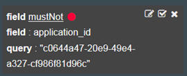

---

copyright:
  years: 2016, 2017
lastupdated: "2017-02-06"

<!-- Common attributes used in the template are defined as follows: -->
{:new_window: target="_blank"}
{:shortdesc: .shortdesc}
{:screen:.screen}
{:codeblock:.codeblock}

# Filtraggio dei log dell'applicazione Cloud Foundry per ID istanza in Kibana
<!-- for example, Uploading your data -->
{: #logging_kibana_instance_id}
<!-- Provide an appropriate ID above -->

Visualizza e filtra i log dell'istanza {{site.data.keyword.Bluemix_notm}} per ID istanza (instance_id) della tua applicazione nel dashboard Kibana. Puoi accedere al dashboard Kibana dalla scheda **Log** della tua applicazione Cloud Foundry.
{:shortdesc}

<!-- Include a sentence to briefly introduce the steps/subtopics. Example: -->
Completa le seguenti attività per visualizzare e filtrare i log della tua applicazione Cloud Foundry per instance_id nel dashboard Kibana:

1. Accedi alla scheda **Log** della tua applicazione Cloud Foundry. 

    1. Fai clic sul nome dell'applicazione nel dashboard delle **Applicazioni** {{site.data.keyword.Bluemix_notm}}.
    2. Fai clic sulla scheda **Log**. 
    
    Vengono visualizzati i log della tua applicazione.

2. Accedi al dashboard Kibana per la tua applicazione. Fai clic su **Vista avanzata** . Viene visualizzato il dashboard Kibana.

3. Nel dashboard Kibana, fai clic sull'icona **Vai a valore predefinito salvato**   per visualizzare tutti i log per un spazio. Nella finestra **TUTTI GLI EVENTI**, fai clic sull'icona Freccia destra per visualizzare tutti i campi. 

    

4. Nel riquadro **Campi**, seleziona **application_id** e **instance_id** per visualizzare i campi  application_id e instance_id nella finestra **TUTTI GLI EVENTI**.

    

5. Nella finestra **TUTTI GLI EVENTI**, fai clic su una riga di evento di log per visualizzare i dettagli di tale evento. Scegli un evento che visualizzi l'instance_id che desideri filtrare.

    

6. Aggiungi un filtro per includere o escludere informazioni su un ID applicazione. 

    * Per aggiungere un filtro che includa informazioni relative a uno specifico ID applicazione, fai clic sull'icona **Lente di ingrandimento**  nella riga application_id della tabella. 
    
           
    
    * Per aggiungere un filtro che escluda informazioni relative a uno specifico ID applicazione, fai clic sull'icona **Esclusione**  nella riga application_id della tabella. 
    
           
    
    Viene aggiunta una nuova condizione di filtro al dashboard Kibana.
 

7. Aggiungi un filtro per includere o escludere informazioni su un ID istanza dell'applicazione. 

    * Per aggiungere un filtro che includa informazioni relative a uno specifico ID istanza, fai clic sull'icona **Lente di ingrandimento**  nella riga instance_id della tabella. 

    

     * Per aggiungere un filtro che escluda informazioni relative a uno specifico ID istanza, fai clic sull'icona **Esclusione**  nella riga instance_id della tabella. 
    
           
    
    Viene aggiunta una nuova condizione di filtro al dashboard Kibana.

9. Salva il dashboard. Una volta terminato di creare il filtro, fai clic sull'icona **Salva**  e immetti un nome per il tuo dashboard. 

    **Nota:** un dashboard con un nome che contiene spazi vuoti non verrà salvato. Immetti un nome senza spazi e fai clic sull'icona **Salva**.

    .

Hai creato un dashboard che filtra le voci di log per instance_id. Puoi caricare in qualsiasi momento il tuo dashboard salvato facendo clic sull'icona **Cartella**  e selezionando il tuo dashboard per nome. 
