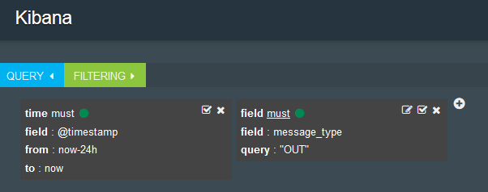

---

copyright:
  years: 2016, 2017
lastupdated: "2017-02-16"

---

{:new_window: target="_blank"}
{:shortdesc: .shortdesc}
{:screen:.screen}
{:codeblock:.codeblock}

# Filtraggio dei log dell'applicazione Cloud Foundry per tipo di messaggio in Kibana
<!-- for example, Uploading your data -->
{: #logging_kibana_message_type_filter}
<!-- Provide an appropriate ID above -->

Visualizza e filtra i log dell'applicazione {{site.data.keyword.Bluemix_notm}} in base al tipo di messaggio sul dashboard Kibana. Puoi accedere al dashboard Kibana dalla scheda **Log** della tua applicazione Cloud Foundry.
{:shortdesc}

<!-- Include a sentence to briefly introduce the steps/subtopics. Example: -->
Completa le seguenti attività per visualizzare e filtrare i log della tua applicazione Cloud Foundry per tipo di messaggio nel dashboard Kibana:

1. Accedi alla scheda **Log** della tua applicazione Cloud Foundry. 

    1. Fai clic sul nome dell'applicazione nel dashboard delle **Applicazioni** {{site.data.keyword.Bluemix_notm}}.
    2. Fai clic sulla scheda **Log**. 
    
    Vengono visualizzati i log della tua applicazione.

2. Accedi al dashboard Kibana per la tua applicazione. Fai clic su **Vista avanzata** . Viene visualizzato il dashboard Kibana.

3. Nella finestra **TUTTI GLI EVENTI**, fai clic sull'icona Freccia destra per visualizzare tutti i campi. 

    

4. Nel riquadro **Campi**, seleziona **message_type** per visualizzare il componente che ha generato ogni voce di log nella finestra **TUTTI GLI EVENTI**.

    

5. Nella finestra **TUTTI GLI EVENTI**, fai clic su una riga di evento di log per visualizzare i dettagli di tale evento. Scegli un evento che visualizzi il **message_type** che desideri filtrare.

    

6. Aggiungi un filtro per includere o escludere informazioni su un tipo di messaggio. 

    * Per aggiungere un filtro che includa informazioni relative a un tipo di messaggio, fai clic sull'icona **Lente di ingrandimento**  nella riga message_type della tabella. 
    
           
    
    * Per aggiungere un filtro che escluda informazioni relative a un tipo di messaggio, fai clic sull'icona **Esclusione**  nella riga message_type della tabella. 
    
    Viene aggiunta una nuova condizione di filtro al dashboard Kibana.

7. Facoltativamente, ripeti il passo precedente per aggiungere un filtro per altri tipi di messaggio. Per visualizzare l'elenco completo dei tipi di messaggio, vedi [Formato del log](../logging_view_kibana3.html#kibana_log_format_cf).

9. Salva il dashboard.    
        
    Una volta terminato di creare i filtri, fai clic sull'icona **Salva**  e immetti un nome per il tuo dashboard. 
      
    **Nota:** un dashboard con un nome che contiene spazi vuoti non verrà salvato. Immetti un nome senza spazi e fai clic sull'icona **Salva**.
    
    .

Hai creato un dashboard che filtra le voci di log per tipo di messaggio. Puoi caricare in qualsiasi momento il tuo dashboard salvato facendo clic sull'icona **Cartella**  e selezionando il tuo dashboard per nome.
