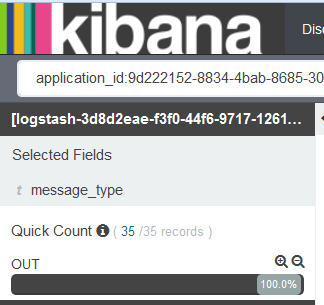

---

copyright:
  years: 2015, 2017

lastupdated: "2017-03-13"

---

{:shortdesc: .shortdesc}
{:new_window: target="_blank"}
{:codeblock: .codeblock}
{:screen: .screen}

# Filtro dei tuoi log dell'applicazione CF per tipo di messaggio
{:#k4_filter_cf_logs_by_msg_type}

Puoi visualizzare e filtrare i log Cloud Foundry per tipo di messaggio in Kibana.
{:shortdesc}

Completa la seguente procedura per ricercare le voci che includono un tipo di messaggio specifico:

1. Guarda nella pagina Rileva Kibana per visualizzare quale sottorete dei tuoi dati viene visualizzata. Per ulteriori informazioni, consulta [Identificazione dei dati visualizzati nella tua pagina Rileva Kibana](logging_kibana_analize_logs_interactively.html#k4_identify_data).

2. Nell'*Elenco campo*, seleziona il campo **tipo_messaggio**.

    La seguente figura mostra i valori trovati per il campo *tipo_messaggio* nei log dell'applicazione CF:
    
         

3. Per aggiungere un filtro che ricerca le voci che includono un *tipo_messaggio* specifico, scegli il pulsante di ingrandimento  per tale valore.

    Ad esempio, per aggiungere un filtro che include le voci di log che hanno un valore tipo_messaggio di *OUT*, seleziona il pulsante della lente di ingrandimento  disponibile per il valore *OUT* nella sezione *Elenco campi*. La seguente figura mostra il filtro per il valore tipo_messaggio *OUT* abilitato.
    
    

    Per aggiungere un filtro che ricerca le voci che non includono un *tipo_messaggio* specifico, scegli il pulsante di ingrandimento  per il valore.
    
    Ad esempio, per aggiungere un filtro che esclude le voci di log per il tipo_messaggio *OUT*, seleziona il pulsante della lente di ingrandimento  disponibile per il valore *CELL* nella sezione *Elenco campi*. La seguente figura mostra il filtro che esclude le voci per il valore tipo_messaggio *OUT*.

    

