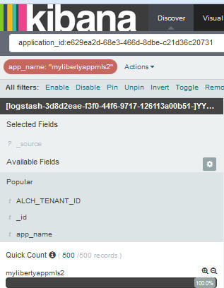

---

copyright:
  years: 2015, 2017

lastupdated: "2017-03-13"

---

{:shortdesc: .shortdesc}
{:new_window: target="_blank"}
{:codeblock: .codeblock}
{:screen: .screen}

# Filtro dei tuoi log per un valore del campo specifico 
{:#k4_filter_logs_spec_field}

Puoi ricercare le voci che includono un valore del campo specifico.
{:shortdesc}

Completa la seguente procedura per ricercare le voci che includono un valore del campo specifico: 

1. Guarda nella pagina Rileva Kibana per visualizzare quale sottorete dei tuoi dati viene visualizzata. Per ulteriori informazioni, consulta [Identificazione dei dati visualizzati nella tua pagina Rileva Kibana](logging_kibana_analize_logs_interactively.html#k4_identify_data).

2. Nell'*Elenco campo*, identifica il campo per cui desideri definire un filtro e fai clic su di esso.

    Per il campo viene visualizzato un massimo di 5 valori. Ogni valore ha due pulsanti della lente di ingrandimento. 
    
    Se non puoi visualizzare il valore, consulta [ Aggiunta di un filtro a un valore non elencato nell'Elenco campi](k4_add_filter_out_value.html#k4_add_filter_out_value).

3. Per aggiungere un filtro che ricerca le voci con un valore del campo, scegli il pulsante di ingrandimento  per tale valore.

    

    Per aggiungere un filtro che ricerca le voci che non includono tale valore del campo, scegli il pulsante di ingrandimento  per il valore.

    

4. Scegli una delle seguenti opzioni per utilizzare i filtri in Kibana:

    <table>
      <tbody>
        <tr>
          <th align="center">Opzione</th>
          <th align="center">Descrizione</th>
          <th align="center">Ulteriori informazioni</th>
        </tr>
        <tr>
          <td align="left">Abilita</td>
          <td align="left">Seleziona questa opzione per abilitare un filtro. </td>
          <td align="left">Quando aggiungi un filtro, viene abilitata automaticamente.   Se un filtro è disabilitato, fai clic su di essa per abilitarlo.</td>
        </tr>
        <tr>
          <td align="left">Disabilita</td>
          <td align="left">Seleziona questa opzione per disabilitare un filtro. </td>
          <td align="left">Dopo aver aggiunto un filtro, se desideri nascondere le voci per un valore del campo, fai clic su **disabilita**.</td>
        </tr>
        <tr>
          <td align="left">Blocca</td>
          <td align="left">Seleziona questa opzione per bloccare il filtro tra le pagine Kibana. </td>
          <td align="left">Puoi bloccare un filtro nella pagina *Ricerca*, *Visualizza* o *Dashboard*.</td>
        </tr>
        <tr>
          <td align="left">Attiva/disattiva</td>
          <td align="left">Seleziona questa opzione per attivare/disattivare un filtro.  </td>
          <td align="left">Per impostazione predefinita, le voci che corrispondono a un filtro vengono visualizzate. Per visualizzare le voci che non corrispondono, attiva/disattiva il filtro.</td>
        </tr>
        <tr>
          <td align="left">Rimuovi</td>
          <td align="left">Seleziona questa opzione per rimuovere un filtro.</td>
          <td align="left"></td>
        </tr>
      </tbody>
    </table>

 

 
 

