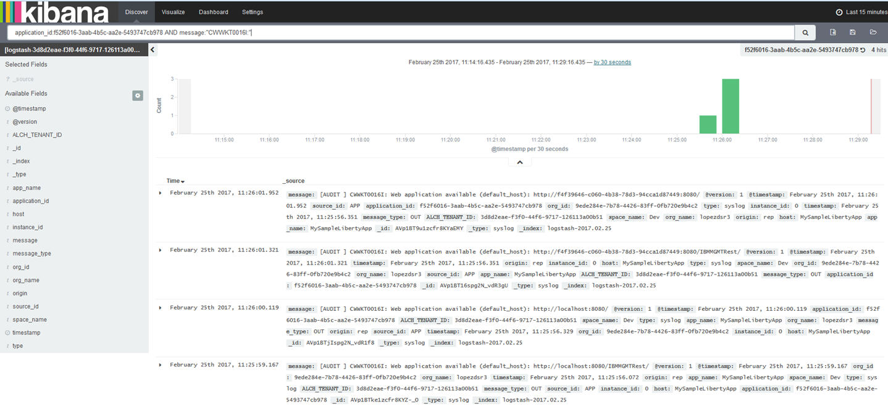

---

copyright:
  years: 2015, 2017

lastupdated: "2017-03-13"

---


{:shortdesc: .shortdesc}
{:new_window: target="_blank"}
{:codeblock: .codeblock}
{:screen: .screen}

# Filtro dei tuoi log per un testo specifico in un valore del campo
{:#k4_filter_logs_spec_text}

Visualizza e ricerca le voci che includono un testo specifico nel valore di un campo.
{:shortdesc}

**Avviso:** puoi solo eseguire una ricerca di testo libero dei campi stringa che vengono analizzati dal programma di analisi Elasticsearch. 
    
Quando Elasticsearch analizza il valore di un campo stringa, suddivide il testo in confini di parola, come definito dal Unicode Consortium, rimuove la punteggiatura e i caratteri minuscoli da tutte le parole.
    
Completa la seguente procedura per ricercare le voci che includono testo specifico in un valore del campo: 

1. Guarda nella pagina Rileva Kibana per visualizzare quale sottorete dei tuoi dati viene visualizzata. Per ulteriori informazioni, consulta [Identificazione dei dati visualizzati nella tua pagina Rileva Kibana]((logging_kibana_analize_logs_interactively.html#k4_identify_data).

2. Identifica i campi analizzati in ElasticSearch per impostazione predefinita.

    Per visualizzare l'elenco completo dei campi analizzati disponibili per la ricerca e il filtro dei dati di log, [ricarica l'elenco dei campi](logging_kibana_analize_logs_interactively.html#kibana_discover_view_reload_fields). Quindi, nell'*Elenco campi* disponibile nella pagina Rileva, completa la seguente procedura:
    
    1. Fai clic sull'icona di configurazione . Viene visualizzata la sezione **Campi selezionati**, quando puoi eseguire il filtro dei campi.

        
    
    2. Per identificare i campi che vengono analizzati, seleziona **Sì** per il campo di ricerca **Analizzato**.

        
    
        Viene visualizzato l'elenco dei campi analizzati.
    
        
        
         
    3. Controlla se il campo in cui desideri eseguire la ricerca del testo libero sia un campo che viene analizzato da ElasticSearch per impostazione predefinita.
    
3. Se il campo viene analizzato, modifica la query per ricercare le voci nei log che includono tale testo libero come parte di un valore di un campo.

    
**Esempio**

Se avvii Kibana per un'applicazione Cloud Foundry (CF) dalla IU {{site.data.keyword.Bluemix}} e desideri ricercare un messaggio specifico che include l'ID messaggio *CWWKT0016I:*, modifica la ricerca in modo che includa del testo libero.
    
1. Controlla la query di ricerca caricata e i dati visualizzati nella pagina Rileva.
       
    
        
2. Per ricercare l'ID messaggio *CWWKT0016I*, modifica la query di ricerca e premi **Invio**:
    
    ```
	application_id:f52f6016-3aab-4b5c-aa2e-5493747cb978 AND message:"CWWKT0016I:" 
	```
        
    
      
    
La tabella mostra le voci per la tua applicazione CF in cui il testo *CWWKT0016I* è parte del valore nel campo *messaggio*.
    
     	
        
 
 
