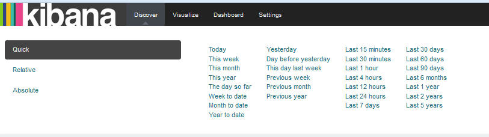

---

copyright:
  years: 2015, 2017

lastupdated: "2017-03-13"

---

{:shortdesc: .shortdesc}
{:new_window: target="_blank"}
{:codeblock: .codeblock}
{:screen: .screen}

# Configurazione di un filtro temporale
{: #set_time_filter}

Visualizza e filtra i log {{site.data.keyword.Bluemix}} in un periodo di tempo configurando il *Selezionatore di tempo*.
{:shortdesc}

Puoi configurare il *Selezionatore di tempo* nella pagina Rileva. Per impostazione predefinita, è impostato sugli ultimi 15 minuti. 

Completa la seguente procedura per ricercare le voci che includono un'ora specifica: 

1. Nella barra del menu della pagina Rileva, fai clic sul selezionatore di tempo .

2. Configura l'intervallo di tempo 

    Puoi definire tutti i seguenti tipi di intervalli di tempo:
    
    * Veloce: questi sono gli intervalli di tempo predefiniti che includono gli utilizzi più comuni degli intervalli di tempo Assoluto e Relativo, ad esempio, *Oggi* e *Questo mese*. 
    
        
    
    * Relativo: questi sono gli intervalli di tempo in cui puoi specificare la data e ora di inizio e di fine. Puoi eseguire arrotondare all'ora.
    
        
    
    * Assoluto: questi sono gli intervalli di tempo tra una data di inizio e di fine.
    
        
      

Dopo aver configurato un intervallo di tempo, i dati visualizzati in Kibana corrispondono alle voci in quell'intervallo di tempo.

