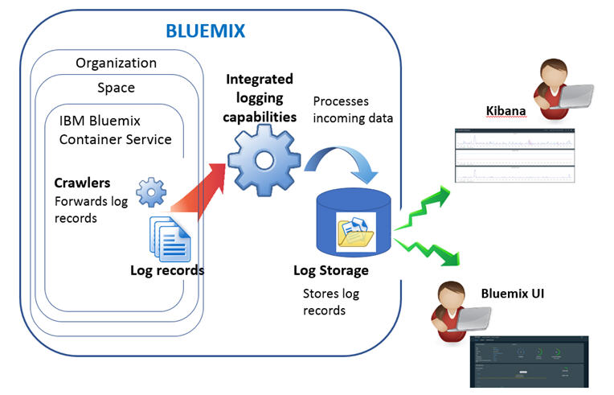

---

copyright:
  years: 2015, 2017

lastupdated: "2017-03-16"

---

{:shortdesc: .shortdesc}
{:new_window: target="_blank"}
{:codeblock: .codeblock}
{:screen: .screen}

# IBM Bluemix Container Service のロギング
{: #logging_containers_ov}

{{site.data.keyword.Bluemix}} では、コンテナー・ログの表示、フィルタリング、および分析を、{{site.data.keyword.Bluemix_notm}} ダッシュボード、Kibana、およびコマンド・ライン・インターフェースを介して行うことができます。
{:shortdesc}

コンテナーのログは、クローラーを使用して、コンテナーの外部からモニターおよび転送されます。データは、クローラーによって {{site.data.keyword.Bluemix_notm}} 内のマルチテナント Elasticsearch に送信されます。

以下の図では、{{site.data.keyword.containershort}} のロギングの概要ビューを示します。

コンテナーのロギングは、そのコンテナーを {{site.data.keyword.Bluemix_notm}} にデプロイしたときに自動的に有効になります。

## コンテナー用に収集されるログ
{: #logging_containers_ov_logs_collected}

デフォルトでは、以下のログが収集されます。

<table>
  <tbody>
    <tr>
      <th align="center">ログ</th>
      <th align="center">説明</th>
    </tr>
    <tr>
      <td align="left" width="30%">/var/log/messages</td>
      <td align="left" width="70%"> デフォルトでは、Docker メッセージは、コンテナーの /var/log/messages フォルダーに保管されます。このログには、システム・メッセージが含まれます。
      </td>
    </tr>
    <tr>
      <td align="left">./docker.log</td>
      <td align="left">このログは、Docker ログです。  Docker ログ・ファイルはコンテナー内にファイルとして保管されることはありませんが、収集されます。このログ・ファイルがデフォルトで収集されるのは、それがコンテナーの stdout (標準出力) 情報と stderr (標準エラー) 情報の公開に関する標準 Docker 規則であるためです。コンテナー・プロセスが stdout または stderr を出力すると、その情報が収集されます。
      </td>
     </tr>
  </tbody>
</table>

追加ログを収集するには、コンテナーの作成時にログ・ファイルへのパスを指定した **LOG_LOCATIONS** 環境変数を追加します。複数のログ・ファイルをコンマで区切って追加できます。詳しくは、『[コンテナーからの非デフォルト・ログ・データの収集](logging_containers_other_logs.html#logging_containers_collect_data)』を参照してください。

## コンテナー・ログを分析する方法
{: #logging_containers_ov_methods}
 
コンテナーのログを分析するための方法には以下のものがあり、任意の方法を選択できます。

* {{site.data.keyword.Bluemix_notm}} でログを分析して、コンテナーの最新アクティビティーを表示します。
    
    各コンテナーに対して使用可能な**「モニターおよびログ (Monitoring and logs)」**のタブを使用してログの表示、フィルタリング、および分析を行うことができます。詳しくは、『[Bluemix ダッシュボードからのログの分析](../logging_view_dashboard.html#analyzing_logs_bmx_ui)』を参照してください。
    
* Kibana でログを分析して、高機能な分析タスクを実行します。
    
    分析および視覚化のためのオープン・ソース・プラットフォームである Kibana を使用して、さまざまなグラフ (図表や表など) でデータのモニター、検索、分析、および視覚化を行うことができます。詳しくは、『[Kibana でのログの分析](../kibana4/logging_analyzing_logs_Kibana.html#analyzing_logs_Kibana)』を参照してください。

* CLI を介してログを分析して、コマンドを使用してログをプログラマチックに管理します。
    
    **cf ic logs** コマンドを使用することによって、ログの表示、フィルター操作、および分析をコマンド・ライン・インターフェースを介して行うことができます。詳しくは、『[コマンド・ライン・インターフェースからのログの分析](../logging_view_cli.html#analyzing_logs_cli)』を参照してください。

## ログ保持期間
{: #logging_containers_ov_log_retention}

ログの保存に関する以下の情報を考慮してください。

* スペースごとに 1 日に最大で 1 GB のデータが保管されます。1 GB の上限を超えるログは破棄されます。上限割り当ては、毎日午前 12:30 (UTC) にリセットされます。 

    サポートに連絡することで、上限を引き上げることができます。サポート・チケットで、上限引き上げ要求の対象となるスペース ID、新しい上限サイズ、および要求の理由を含めてください。

* 7 GB までのデータを最大 7 日間検索可能です。ログ・データは、データが 7 GB に達するか 7 日が過ぎると、ロールオーバーします (先入れ先出し)。

