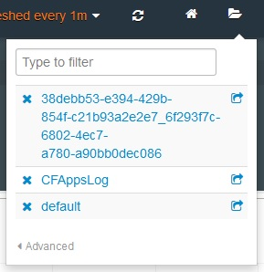

---

copyright:
  years: 2016, 2017
lastupdated: "2017-02-03"

---

{:new_window: target="_blank"}
{:shortdesc: .shortdesc}
{:screen:.screen}
{:codeblock:.codeblock}

# Kibana ダッシュボードのエクスポートと共有
{: #exporting_sharing_kibana_dash}

ダッシュボード・スキーマを JSON ファイルとしてエクスポートするか、ログ・データのカスタマイズ済み Kibana ダッシュボードの URL を共有します。
{:shortdesc}

Kibana を使用して、ダッシュボードを JSON ファイルとしてエクスポートするか、ダッシュボードの URL を共有することで、他のステークホルダーと共同作業することができます。

Kibana ダッシュボードを JSON ファイルとしてエクスポートするには、以下のタスクを行います。

1. **「Save」**アイコン をクリックし、**「Advanced」** **>** **「Export schema」**をクリックします。

    

2. JSON ファイルに分かりやすい名前を選択し、**「Save」**をクリックします。この JSON ファイルを持つユーザーは誰でも、Kibana ダッシュボードでこのファイルを開くことができます。 

Kibana ダッシュボードの URL を作成して共有するには、以下のタスクを行います。

1. Kibana ダッシュボードで、**「Folder」**アイコン  をクリックして、最近のダッシュボードをすべてリストするメニューを表示します。このメニューには、名前で保存したダッシュボードのほかに、名前を付けていないダッシュボードが *ALCH_TENANT_ID_application_id* の形式でリストされます。 

    

2. 共有するダッシュボードの **「Share」**アイコン  をクリックします。共有可能な URL が作成され、表示されます。 

    

    この URL をコピーして、他のユーザーとダッシュボードを共有します。**「Close」**をクリックして、ダッシュボードに戻ります。
