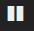

---

copyright:
  years: 2015, 2017

lastupdated: "2017-03-13"

---

{:shortdesc: .shortdesc}
{:new_window: target="_blank"}
{:codeblock: .codeblock}
{:screen: .screen}

# カスタム検索照会の定義
{:#k4_define_search}

「Discover」ページの検索バーで、Lucene 照会言語を使用して検索照会を定義および保存できます。検索ごとに、フィルターを適用して、分析で使用可能な項目を詳細化できます。
{:shortdesc}

カスタム検索を定義するには、以下のタスクを実行します。

1. Cloud Foundry (CF) アプリまたはコンテナーの**「ログ」**タブにアクセスします。 

    1. {{site.data.keyword.Bluemix}} ダッシュボードでアプリ名またはコンテナーをクリックします。
    2. CF アプリケーションの場合、**「ログ」**タブをクリックします。コンテナーの場合、**「モニターおよびログ (Monitoring and logs)」**をクリックしてから、**「ロギング (Logging)」**タブを選択します。
    
    ログが表示されます。

2. Kibana にアクセスします。**「詳細ビュー」**  をクリックします。Kibana ダッシュボードが表示されます。

    Kibana にアクセスすると、デフォルト検索が適用されます。Kibana を起動した対象リソースのインスタンスのリストに関するログを確認できます。そのスペース内の {{site.data.keyword.Bluemix_notm}} リソースのすべてまたは任意のものについて、ログをフィルタリングできます。

3. 「Discover」ページを見て、表示されているデータのサブセットを確認します。詳しくは、『[「Discover」ページで表示されているデータの識別](logging_kibana_analize_logs_interactively.html#k4_identify_data)』を参照してください。次に、項目をフィルタリングするためのデフォルト照会を変更します。

    **注:** カスタム照会の定義には、Lucene 照会言語を使用します。詳しくは、『[Apache Lucene - Query Parser Syntax  ](https://lucene.apache.org/core/2_9_4/queryparsersyntax.html){: new_window}』を参照してください。
    
    Kibana が {{site.data.keyword.Bluemix_notm}} から起動された場合、照会の変更および複数の検索基準の定義のために、論理項 **AND** および **OR** を使用できます。これらの演算子は、大文字でなければなりません。    
    
    * キーワードまたはその一部を検索するには、語の後にワイルドカード記号 \* を付けて入力します。例えば、`Java*` などです。 
    * 特定の句を検索するには、二重引用符の中にその句を入れます。例えば、`"Java/1.8.0"` などです。
    * さらに複雑な検索を作成するには、論理条件の AND および OR を使用できます。例えば、`"Java/1.8.0" OR "Java/1.7.0"` などです。
    * 特定フィールド内の値を検索するには、*log_field_name:search_term* の形式 (例えば、`instance_id:"1"` など) で検索を入力します。
    * 特定ログ・フィールドで一定範囲の値を検索するには、*log_field_name:[start_of_range TO end_of_range]* の形式 (例えば、`instance_id:["1" TO "2"]` など) で検索を入力します。

     例えば、CF アプリの場合、照会 `application_id:9d222152-8834-4bab-8685-3036cd25931a AND instance_id:["0" TO "1"]` を作成できます。これにより、インスタンス *0* および *1* の項目のみがリストされます。 

4. 照会を保存して、後から再使用できるようにします。詳しくは、『[検索の保存](logging_kibana_filtering_logs.html#k4_save_search)』を参照してください。 

**注:** 照会を削除する必要がある場合は、『[検索の削除](logging_kibana_filtering_logs.html#k4_delete_search)』を参照してください。

## 検索の削除
{: #k4_delete_search}

検索を削除するには、「Settings」ページで以下のステップを実行します。

1. 「Settings」ページで**「Objects」**タブを選択します。

2. **「Searches」**タブで、削除する検索を選択します。

3. **「削除」**をクリックします。

## 検索のエクスポート
{: #k4_export_search}

検索をエクスポートするには、「Settings」ページで以下のステップを実行します。

1. 「Settings」ページで**「Objects」**タブを選択します。

2. **「Searches」**タブで、エクスポートする検索を選択します。

3. **「エクスポート」**をクリックします。

4. ファイルを保存します。

 
## 検索のインポート
{: #k4_import_search}

検索をインポートするには、「Settings」ページで以下のステップを実行します。

1. 「Settings」ページで**「Objects」**タブを選択します。

2. **「Searches」**タブで**「Import」**を選択します。

3. ファイルを選択し、**「Open」**をクリックします。

検索が検索リストに追加されます。

## 検索のコンテンツの最新表示
{: #k4_refresh_search}

検索のコンテンツを手動で最新表示するために、検索バーで使用可能な拡大鏡をクリックできます。 

「Discover」ページで表示されるデータを自動的に最新表示する場合は、最新表示間隔を構成できます。最新表示間隔の現行値は、「Discover」ページのメニュー・バーに表示されます。デフォルトでは、自動最新表示は **OFF** に設定されます。

最新表示間隔を設定するには、以下のステップを実行します。

1. 「Discover」ページのメニュー・バーで使用可能な**「Time Filter」**をクリックします。

2. **「Auto Refresh」**  をクリックします。

3. リストから最新表示間隔を選択します。 

    

**注**: 自動最新表示間隔を有効にした後には、一時停止ボタン  をクリックすることで、自動最新表示を一時停止できます。

## 検索の再ロード
{: #k4_reload_search}

保存済み検索をロードするには、以下のステップを実行します。

1. 「Discover」ページのツールバーにある**「Load Search」**ボタン  をクリックします。

2. ロードする検索を選択します。 

## 新規検索の開始
{: #k4_new_search}

新規検索を開始するには、「Discover」ページのツールバーにある**「New Search」**ボタン をクリックします。

## 検索の保存 
{: #k4_save_search}

検索を保存すると、検索照会ストリングおよび現在選択されている索引パターンが保存されます。

「Discovery」ページで現在の検索を保存するには、以下のステップを実行します。

1. 「Discover」ページのツールバーにある**「Save Search」**ボタン  をクリックします。

2. 検索の名前を入力します。

3. 「保存」をクリックします。 
