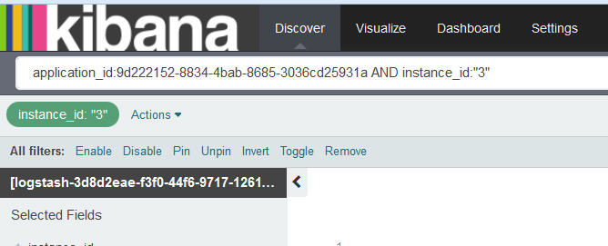

---

copyright:
  years: 2015, 2017

lastupdated: "2017-04-06"

---

{:shortdesc: .shortdesc}
{:new_window: target="_blank"}
{:codeblock: .codeblock}
{:screen: .screen}

# Kibana でのログのフィルタリング
{:#k4_filter_logs}

「Discover」ページでは、検索照会を作成し、フィルターを適用して、分析で表示される情報を制約できます。
{:shortdesc}

* 「Discover」ページの検索バーで 1 つ以上の検索照会を定義できます。検索照会により、ログ項目のサブセットを定義します。検索照会の定義には、Lucene 照会言語を使用します。 

* *フィールド・リスト* または表の項目からフィルターを追加できます。フィルターは、情報の包含または除外によって、データ選択を詳細化します。フィルターの有効化または無効化、フィルター・アクションの反転、フィルターのオンまたはオフへの切り替え、フィルターの完全削除を行うことができます。 

新規検索を定義した後に、これを保存し、「Discover」ページで後に分析を行ったり、カスタム・ダッシュボードで使用できる視覚化を作成するために再使用できます。詳しくは、『[検索の保存](logging_kibana_filtering_logs.html#k4_save_search)』を参照してください。

新規検索を実行すると、ヒストグラム、表、およびフィールド・リストが自動的に更新され、検索結果が表示されます。どのようなデータが表示されているのかを判別するには、『[「Discover」ページで表示されているデータの識別](k4_identify_data.html#k4_identify_data)』を参照してください。

以下のリストでは、ログ内のデータをフィルタリングする方法を示すシナリオの概要を示します。

* ログをフィルタリングするカスタム検索を作成できます。詳しくは、『[カスタム検索照会の定義によるログのフィルタリング](k4_filter_queries.html#k4_filter_queries)』を参照してください。

* フィールドの値に特定のテキストが含まれている項目をログで検索できます。詳しくは、『[フィールド値に特定のテキストが含まれたログのフィルタリング](k4_filter_logs_spec_text.html#k4_filter_logs_spec_text)』を参照してください。
 
* ログで特定のフィールド値を検索したり、特定のフィールド値が含まれた項目をログから除外したりすることができます。詳しくは、『[特定のフィールド値が含まれたログのフィルタリング](k4_filter_logs_spec_field.html#k4_filter_logs_spec_field)』を参照してください。
 
* 特定の期間内の項目を表示するようにログをフィルタリングできます。詳しくは、『[時間フィルターの設定](logging_kibana_set_time_filter.html#set_time_filter)』を参照してください。
     

## *フィールド・リスト* でリストされない値のフィルターの追加
{:#k4_add_filter_out_value}

*フィールド・リスト* に表示されていない値のフィルターを追加するには、照会を介してその値が含まれているレコードを検索します。その後、「Discover」ページで使用可能な表項目からフィルターを追加します。
 

*フィールド・リスト*・セクションに表示されるリストで使用可能でない値のフィルターを追加するには、以下のステップを実行します。

1. Kibana の「Discover」ページを見て、表示されているデータのサブセットを確認します。詳しくは、『[「Discover」ページで表示されているデータの識別](logging_kibana_analize_logs_interactively.html#k4_identify_data)』を参照してください。

    例えば、以下の図では、*フィールド・リスト* 内の CF アプリのインスタンスの値を示しています。 
    
    
    
    インスタンス番号 *3* に関心があるのにもかかわらず、表示されるリストでそのインスタンスが使用可能でありません。

2. 「Discover」ページで、特定のフィールド値を検索するように照会を変更します。

    例えば、インスタンス *3* を検索する場合、入力する照会は以下のようになります。
   `application_id:9d222152-8834-4bab-8685-3036cd25931a AND instance_id:"3"`
    
    
    
    表で、照会に一致したすべてのレコードが表示されます。 
    
 3. 1 つのレコードを展開し、拡大鏡ボタン ") を選択してフィルターを追加します。
 
     例えば、値が *3* のインスタンス ID のフィルターを追加するには、*instance_id* フィールドの横にある拡大鏡ボタン ") をクリックします。
     
     
     
4. フィルターが追加されたことを確認します。

    例えば、以下の表では、表からフィルターを追加した後に有効になっているフィルターを示しています。
    
    
    
    

## 特定のフィールド値が含まれたログのフィルタリング
{:#k4_filter_logs_spec_field}

特定のフィールド値が含まれた項目を検索できます。
 

特定のフィールド値が含まれた項目を検索するには、以下のステップを実行します。

1. Kibana の「Discover」ページを見て、表示されているデータのサブセットを確認します。詳しくは、『[「Discover」ページで表示されているデータの識別](logging_kibana_analize_logs_interactively.html#k4_identify_data)』を参照してください。

2. *フィールド・リスト* で、フィルターを定義するフィールドを識別してクリックします。

    フィールドに対して最大で 5 つの値が表示されます。各値には、2 つの拡大鏡ボタンがあります。 
    
    値を表示できない場合は、『[フィールド・リストでリストされない値のフィルターの追加](k4_add_filter_out_value.html#k4_add_filter_out_value)』を参照してください。

3. あるフィールド値が含まれている項目を検索するフィルターを追加するには、その値の拡大ボタン ") を選択します。

    

    当該フィールド値が含まれていない項目を検索するフィルターを追加するには、その値の拡大ボタン ") を選択します。

    

4. Kibana のフィルターを操作するには、以下のいずれかのオプションを選択します。

    <table>
      <caption>表 1. フィルターの操作方法</caption>
      <tbody>
        <tr>
          <th align="center">オプション</th>
          <th align="center">説明</th>
          <th align="center">その他の情報</th>
        </tr>
        <tr>
          <td align="left">有効化</td>
          <td align="left">このオプションは、フィルターを有効にする場合に選択します。</td>
          <td align="left">フィルターを追加すると、そのフィルターは自動的に有効になります。  フィルターが無効になっている場合、有効にするにはそのフィルターをクリックします。</td>
        </tr>
        <tr>
          <td align="left">無効化</td>
          <td align="left">このオプションは、フィルターを無効にする場合に選択します。</td>
          <td align="left">フィルターの追加後に、あるフィールド値の項目を非表示にする場合、**「disable」**をクリックします。</td>
        </tr>
        <tr>
          <td align="left">Pin</td>
          <td align="left">このオプションは、すべての Kibana ページでフィルターを保持する場合に選択します。</td>
          <td align="left">「*Discover*」ページ、「*Visualize*」ページ、または「*Dashboard*」ページでフィルターをピン留めできます。</td>
        </tr>
        <tr>
          <td align="left">Toggle</td>
          <td align="left">このオプションは、フィルターを切り替える場合に選択します。</td>
          <td align="left">デフォルトでは、フィルターに一致する項目が表示されます。一致しない項目を表示するには、フィルターを切り替えます。</td>
        </tr>
        <tr>
          <td align="left">削除</td>
          <td align="left">このオプションは、フィルターを削除する場合に選択します。</td>
          <td align="left"></td>
        </tr>
      </tbody>
    </table>

## ソースによる CF アプリ・ログのフィルタリング
{:#k4_filter_logs_by_source}

特定のログ・ソースが含まれた項目を検索するには、以下のステップを実行します。

1. Kibana の「Discover」ページを見て、表示されているデータのサブセットを確認します。詳しくは、『[「Discover」ページで表示されているデータの識別](logging_kibana_analize_logs_interactively.html#k4_identify_data)』を参照してください。

2. *フィールド・リスト* で、**source_id** フィールドを選択します。

         

3. 特定の source_id が含まれている項目を検索するフィルターを追加するには、その値の拡大ボタン ") を選択します。

    CF アプリで使用可能なログ・ソースのリストについては、『[CF アプリのログ・ソース](../logging_cf_apps.html#logging_bluemix_cf_apps_log_sources)』を参照してください。

    例えば、CF アプリケーションの開始、停止、または異常終了に関するログ項目を含めるフィルターを追加するには、*フィールド・リスト*・セクションの値「*CELL*」に対して使用可能な拡大鏡ボタン ") を選択します。以下の図では、source_id 値が *CELL* のフィルターが有効になっているのを示しています。
    
    

    特定の source_id が含まれていない項目を検索するフィルターを追加するには、その値の拡大ボタン ") を選択します。
    
    例えば、CF アプリケーションの開始、停止、または異常終了に関するログ項目を除外するフィルターを追加するには、*フィールド・リスト*・セクションの値「*CELL*」に対して使用可能な拡大鏡ボタン ") を選択します。以下の図では、source_id 値が *CELL* の項目を除外するフィルターを示しています。

    

## ログ・タイプによるログのフィルタリング
{:#k4_filter_logs_by_log_type}

特定のログ・タイプが含まれた項目を検索するには、以下のステップを実行します。

1. Kibana の「Discover」ページを見て、表示されているデータのサブセットを確認します。詳しくは、『[「Discover」ページで表示されているデータの識別](logging_kibana_analize_logs_interactively.html#k4_identify_data)』を参照してください。

2. *フィールド・リスト* で、**type** フィールドを選択します。

    例えば、以下の図では、1 つのログ・タイプ *syslog* だけが使用可能です。
    
    
   
3. 特定のログ・タイプを検索するフィルターを追加するには、分析するログ・タイプの拡大ボタン ") を選択します。

    例えば、*syslog* のログ項目が含まれるフィルターを追加するには、*フィールド・リスト*・セクションの値「*syslog*」に対して使用可能な拡大鏡ボタン ") を選択します。以下の図では、ログ・タイプが *syslog* の項目が含まれるフィルターを表示しています。

    

    特定のログ・タイプが含まれていない項目を検索するフィルターを追加するには、その値の拡大ボタン ") を選択します。

     例えば、*syslog* のログ項目を除外するフィルターを追加するには、*フィールド・リスト*・セクションの値「*syslog*」に対して使用可能な拡大鏡ボタン ") を選択します。以下の図では、ログ・タイプが *syslog* の項目を除外するフィルターを表示しています。
     
     

## インスタンス ID によるログのフィルタリング
{:#k4_filter_logs_by_instance_id}

Kibana ダッシュボードでインスタンス ID によってログを表示およびフィルタリングするには、以下のステップを実行します。

1. Kibana の「Discover」ページを見て、表示されているデータのサブセットを確認します。詳しくは、『[「Discover」ページで表示されているデータの識別](logging_kibana_analize_logs_interactively.html#k4_identify_data)』を参照してください。

2. *フィールド・リスト* で、特定のインスタンス ID を検索する以下のいずれかのフィールドを選択します。

    * **instance_ID**: このフィールドは、Cloud Foundry アプリケーションのログで使用可能な各種インスタンス ID をリストします。 
    * **instance**: このフィールドは、コンテナー・グループのすべてのインスタンスの各種 GUID をリストします。 

    例えば、以下の図では、CF アプリのインスタンスの各値を示しています。
    
    
   
3. 特定のログ・タイプを検索するフィルターを追加するには、分析するログ・タイプの拡大ボタン ") を選択します。

   例えば、CF アプリ・インスタンス *2* の項目を含めるフィルターを追加するには、フィールド・リスト・セクションの値「*2*」に対して使用可能な拡大鏡ボタン ") を選択します。以下の図では、インスタンス *2* の項目を含めるフィルターを示しています。
    
    

    特定のインスタンス ID が含まれていない項目を検索するフィルターを追加するには、その値の拡大ボタン ") を選択します。

     例えば、CF アプリ・インスタンス *2* の項目を除外するフィルターを追加するには、フィールド・リスト・セクションの値「*2*」に対して使用可能な拡大鏡ボタン ") を選択します。以下の図では、インスタンス *2* の項目を除外するフィルターを示しています。
     
      

## メッセージ・タイプによる CF アプリ・ログのフィルタリング
{:#k4_filter_cf_logs_by_msg_type}

特定のメッセージ・タイプが含まれた項目を検索するには、以下のステップを実行します。

1. Kibana の「Discover」ページを見て、表示されているデータのサブセットを確認します。詳しくは、『[「Discover」ページで表示されているデータの識別](logging_kibana_analize_logs_interactively.html#k4_identify_data)』を参照してください。

2. *フィールド・リスト* で、**message_type** フィールドを選択します。

    以下の図では、CF アプリのログ内の *message_type* フィールドで見つかった値を示しています。
    
         

3. 特定の *message_type* が含まれている項目を検索するフィルターを追加するには、その値の拡大ボタン ") を選択します。

    例えば、message_type 値が *OUT* のログ項目が含まれるフィルターを追加するには、*フィールド・リスト*・セクションの値「*OUT*」に対して使用可能な拡大鏡ボタン ") を選択します。以下の図では、message_type 値が *OUT* のフィルターが有効になっているのを示しています。
    
    

    特定の *message_type* が含まれていない項目を検索するフィルターを追加するには、その値の拡大ボタン ") を選択します。
    
    例えば、message_type が *OUT* のログ項目を除外するフィルターを追加するには、*フィールド・リスト*・セクションの値「*CELL*」に対して使用可能な拡大鏡ボタン ") を選択します。以下の図では、message_type 値が *OUT* の項目を除外するフィルターを示しています。

    

## フィールド値内の特定のテキストについてのログのフィルタリング
{:#k4_filter_logs_spec_text}

フィールドの値に特定のテキストが含まれている項目を表示および検索します。
 

**注意:** Elasticsearch アナライザーによって分析されるストリング・フィールドのフリー・テキスト検索のみを実行できます。 
    
Elasticsearch では、ストリング・フィールドの値を分析する際、Unicode Consortium での定義に従ってワード境界でテキストを分割し、句読点を削除し、すべての単語を小文字化します。
    
フィールド値に特定のテキストが含まれた項目を検索するには、以下のステップを実行します。

1. Kibana の「Discover」ページを見て、表示されているデータのサブセットを確認します。詳しくは、『[「Discover」ページで表示されているデータの識別](logging_kibana_analize_logs_interactively.html#k4_identify_data)』を参照してください。

2. デフォルトで Elasticsearch で分析されるフィールドを指定します。

    ログ・データの検索およびフィルタリングで使用可能な分析されるフィールドの完全なリストを表示するには、[フィールドのリストを再ロードします](logging_kibana_analize_logs_interactively.html#kibana_discover_view_reload_fields)。その後、「Discover」ページで使用可能な*フィールド・リスト* で、以下のステップを実行します。
    
    1. 構成アイコン  をクリックします。フィールドをフィルタリングできる**「Selected fields」**セクションが表示されます。

        
    
    2. 分析されるフィールドを指定するには、検索フィールド**「Analyzed」**で**「Yes」**を選択します。

        
    
        分析されるフィールドのリストが表示されます。
    
        
        
         
    3. フリー・テキスト検索を行うフィールドが、デフォルトで Elasticsearch によって分析されるフィールドかどうかを確認します。
    
3. フィールドが分析される場合は、フィールドの値の一部としてそのフリー・テキストを含む項目をログで検索するように照会を変更します。

    
**例**

{{site.data.keyword.Bluemix}} UI から Cloud Foundry (CF) アプリケーション用に Kibana を起動し、メッセージ ID *CWWKT0016I:* が含まれている特定のメッセージを検索する場合は、そのフリー・テキストが含まれるように検索を変更します。
    
1. ロードされた検索照会、および「Discover」ページに表示されたデータを確認します。
       
    
        
2. メッセージ ID *CWWKT0016I* を検索するには、以下のように検索照会を変更し、**Enter** キーを押します。
    
    <pre class="pre">application_id:f52f6016-3aab-4b5c-aa2e-5493747cb978 AND message:"CWWKT0016I:" 
	</pre>
        
    
      
テキスト *CWWKT0016I* が *message* フィールドの値に含まれている CF アプリの項目が表で表示されます。
    
     	
        

## 時間フィルターの設定
{: #set_time_filter}

*時間ピッカー* を構成して、特定の期間内の {{site.data.keyword.Bluemix_notm}} ログを表示およびフィルタリングします。

「Discover」ページで*時間ピッカー* を構成できます。デフォルトでは、過去 15 分間に設定されています。 

特定の時間が含まれた項目を検索するには、以下のステップを実行します。

1. 「Discover」ページのメニュー・バーで時間ピッカー  をクリックします。

2. 時間間隔をセットアップします。 

    以下の時間間隔タイプのいずれかを定義できます。
    
    * Quick: これは事前定義の時間間隔であり、ごく一般的に使用される相対時間間隔と絶対時間間隔の両方が含まれています (例えば、*Today* や *This Month*)。 
    
        
    
    * Relative: これは、開始日時と終了日時を指定できる時間間隔です。時間単位で表すことができます。
    
        
    
    * Absolute: これは、開始日から終了日までの時間間隔です。
    
        
      

時間間隔を構成すると、Kibana で表示されるデータが、その時間範囲内の項目に対応します。

