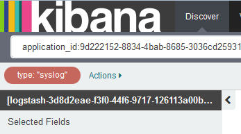

---

copyright:
  years: 2015, 2017

lastupdated: "2017-03-01"

---

{:shortdesc: .shortdesc}
{:new_window: target="_blank"}
{:codeblock: .codeblock}
{:screen: .screen}

# ログ・タイプによるログのフィルタリング
{:#k4_filter_logs_by_log_type}

ログ・タイプによって {{site.data.keyword.Bluemix}} ログを表示およびフィルタリングします。
{:shortdesc}

特定のログ・タイプが含まれた項目を検索するには、以下のステップを実行します。

1. Kibana の「Discover」ページを見て、表示されているデータのサブセットを確認します。詳しくは、『[「Discover」ページで表示されているデータの識別](logging_kibana_analize_logs_interactively.html#k4_identify_data)』を参照してください。

2. *フィールド・リスト* で、**type** フィールドを選択します。

    例えば、以下の図では、1 つのログ・タイプ *syslog* だけが使用可能です。
    
    
   
3. 特定のログ・タイプを検索するフィルターを追加するには、分析するログ・タイプの拡大ボタン ") を選択します。

    例えば、*syslog* のログ項目が含まれるフィルターを追加するには、*フィールド・リスト*・セクションの値「*syslog*」に対して使用可能な拡大鏡ボタン ") を選択します。以下の図では、ログ・タイプが *syslog* の項目が含まれるフィルターを表示しています。

    

    特定のログ・タイプが含まれていない項目を検索するフィルターを追加するには、その値の拡大ボタン ") を選択します。

     例えば、*syslog* のログ項目を除外するフィルターを追加するには、*フィールド・リスト*・セクションの値「*syslog*」に対して使用可能な拡大鏡ボタン ") を選択します。以下の図では、ログ・タイプが *syslog* の項目を除外するフィルターを表示しています。
     
     

