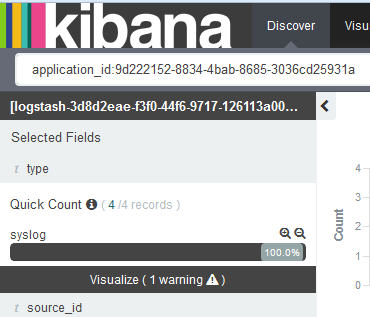
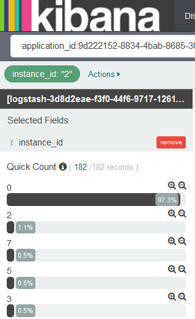
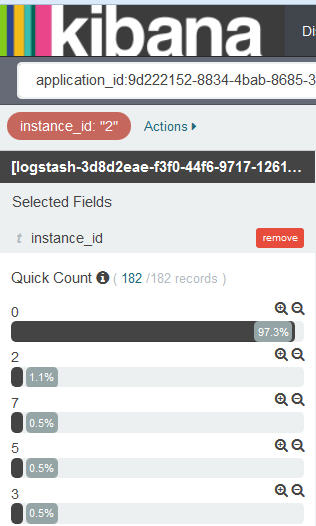

---

copyright:
  years: 2015, 2017

lastupdated: "2017-04-06"

---

{:shortdesc: .shortdesc}
{:new_window: target="_blank"}
{:codeblock: .codeblock}
{:screen: .screen}

# Kibana에서 로그 필터링
{:#k4_filter_logs}

검색 페이지에서 검색 조회를 작성하고 분석을 위해 표시된 정보를 제한하도록 필터를 적용할 수 있습니다.
{:shortdesc}

* 검색 페이지의 검색 표시줄에서 하나 이상의 검색 조회를 정의할 수 있습니다. 검색 조회는 로그 항목의 서브세트를 정의합니다. Lucene 조회 언어를 사용하여 검색 조회를 정의하십시오. 

* *필드 목록* 또는 테이블 항목에서 필터를 추가할 수 있습니다. 필터는 정보를 포함하거나 제외하여 데이터 선택사항을 세분화합니다. 필터를 사용 또는 사용하지 않게 설정하거나, 필터 조치를 되돌리거나, 필터를 켜기 또는 끄기로 전환하거나, 필터를 완전히 제거할 수 있습니다. 

새 검색을 정의한 다음 검색 페이지에서 추가 분석을 위해 다시 사용하거나 사용자 정의 대시보드에서 사용할 수 있는 시각화를 작성하기 위해 다시 사용하도록 저장하십시오. 자세한 정보는 [검색 저장](logging_kibana_filtering_logs.html#k4_save_search)을 참조하십시오.

새 검색을 수행하면 히스토그램, 테이블 및 필드 목록이 자동으로 업데이트되어 검색 결과를 표시합니다. 표시되는 데이터를 알아보려면 [검색 페이지에 표시된 데이터 식별](k4_identify_data.html#k4_identify_data)을 참조하십시오.

다음 목록은 로그에서 데이터를 필터링하는 방법의 시나리오를 간략하게 설명합니다.

* 사용자 정의 검색을 작성하여 로그를 필터링할 수 있습니다. 자세한 정보는 [사용자 정의 조회를 정의하여 로그 필터링](k4_filter_queries.html#k4_filter_queries)을 참조하십시오. 

* 로그에서 필드 값에 특정 텍스트를 포함하는 항목을 검색할 수 있습니다. 자세한 정보는 [필드 값의 특정 텍스트에 맞게 로그 필터링](k4_filter_logs_spec_text.html#k4_filter_logs_spec_text)을 참조하십시오.
 
* 로그에서 특정 필드 값을 검색하거나 로그에서 특정 필드 값의 항목을 제외할 수 있습니다. 자세한 정보는 [특정 필드 값에 맞게 로그 필터링](k4_filter_logs_spec_field.html#k4_filter_logs_spec_field)을 참조하십시오.
 
* 기간 내의 항목을 표시하도록 로그를 필터링할 수 있습니다. 자세한 정보는 [시간 필터 설정](logging_kibana_set_time_filter.html#set_time_filter)을 참조하십시오.
     

## *필드 목록*에 나열되지 않은 값의 필터 추가
{:#k4_add_filter_out_value}

*필드 목록*에 표시되지 않은 값의 필터를 추가하려면 조회를 통해 값을 포함하는 레코드를 검색하십시오. 그런 다음 검색 페이지에서 사용 가능한 테이블 항목에서 필터를 추가하십시오.
 

*필드 목록* 섹션에 표시된 목록에서 사용할 수 없는 값의 필터를 추가하려면 다음 단계를 완료하십시오.

1. Kibana 검색 페이지에서 표시하는 데이터의 서브세트를 확인하십시오. 자세한 정보는 [Kibana 검색 페이지에 표시되는 데이터 식별](logging_kibana_analize_logs_interactively.html#k4_identify_data)을 참조하십시오.

    예를 들어, 다음 그림은 *필드 목록*에 있는 CF 앱의 인스턴스 값을 보여줍니다. 
    
    
    
    인스턴스 번호 *3*에 관심이 있지만, 이 번호는 사용자에게 표시되는 목록에서 사용 가능하지 않습니다.

2. 검색 페이지에서 특정 필드 값을 검색하도록 조회를 수정하십시오.

    예를 들어, 인스턴스 *3*을 검색하려면 다음과 같이 조회를 입력합니다.
   `application_id:9d222152-8834-4bab-8685-3036cd25931a AND instance_id:"3"`
    
    
    
    테이블에서 조회와 일치하는 레코드를 볼 수 있습니다. 
    
 3. 한 레코드를 펼치고 돋보기 단추 를 선택하여 필터를 추가하십시오.
 
     예를 들어, 값이 *3*인 인스턴스 ID의 필터를 추가하려면 *instance_id*별로 돋보기 단추 를 클릭하십시오.
     
     
     
4. 필터가 추가되었는지 확인하십시오.

    예를 들어 다음 그림은 테이블에서 추가한 후 사용으로 설정된 필터를 표시합니다.
    
    
    
    

## 특정 필드 값에 맞게 로그 필터링
{:#k4_filter_logs_spec_field}

특정 필드 값을 포함하는 항목을 검색할 수 있습니다.
 

특정 필드 값을 포함하는 항목을 검색하려면 다음 단계를 완료하십시오.

1. Kibana 검색 페이지에서 표시하는 데이터의 서브세트를 확인하십시오. 자세한 정보는 [Kibana 검색 페이지에 표시되는 데이터 식별](logging_kibana_analize_logs_interactively.html#k4_identify_data)을 참조하십시오.

2. *필드 목록*에서 필터를 정의하려는 필드를 식별하고 클릭하십시오.

    필드에 대해 최대 5개의 값이 표시됩니다. 각 값에는 두 개의 돋보기 단추가 있습니다. 
    
    값을 볼 수 없으면 [필드 목록에 나열되지 않은 값의 필터 추가](k4_add_filter_out_value.html#k4_add_filter_out_value)를 참조하십시오.

3. 필드 값이 있는 항목을 검색하는 필터를 추가하려면 해당 값에 대해 돋보기 단추 를 선택하십시오.

    

    필드 값을 포함하지 않는 항목을 검색하는 필터를 추가하려면 해당 값에 대해 돋보기 단추 를 선택하십시오.

    

4. 다음 옵션 중 하나를 선택하여 Kibana의 필터에 대해 작업하십시오.

    <table>
      <caption>표 1. 필터에 대한 작업을 수행하는 방법</caption>
      <tbody>
        <tr>
          <th align="center">옵션</th>
          <th align="center">설명</th>
          <th align="center">기타 정보</th>
        </tr>
        <tr>
          <td align="left">사용</td>
          <td align="left">필터를 사용하려면 이 옵션을 선택하십시오.</td>
          <td align="left">필터를 추가하면 자동으로 사용됩니다.  필터를 사용하지 않으면 이 옵션을 클릭하여 사용으로 설정하십시오.</td>
        </tr>
        <tr>
          <td align="left">사용 안함</td>
          <td align="left">필터를 사용하지 않으려면 이 옵션을 선택하십시오.</td>
          <td align="left">필터를 추가한 다음 필드 값의 항목을 숨기려면 **사용 안함**을 클릭하십시오.</td>
        </tr>
        <tr>
          <td align="left">고정</td>
          <td align="left">Kibana 페이지 전체에서 필터를 유지하려면 이 옵션을 선택하십시오.</td>
          <td align="left">*검색* 페이지, *시각화* 페이지 또는 *대시보드* 페이지에 필터를 고정할 수 있습니다.</td>
        </tr>
        <tr>
          <td align="left">전환</td>
          <td align="left">필터를 전환하려면 이 옵션을 선택하십시오.</td>
          <td align="left">기본적으로 필터와 일치하는 항목이 표시됩니다. 일치하지 않는 항목을 표시하려면 필터를 전환하십시오.</td>
        </tr>
        <tr>
          <td align="left">제거</td>
          <td align="left">필터를 제거하려면 이 옵션을 선택하십시오.</td>
          <td align="left"></td>
        </tr>
      </tbody>
    </table>

## 소스에 따라 CF 앱 로그 필터링
{:#k4_filter_logs_by_source}

특정 로그 소스를 포함하는 항목을 검색하려면 다음 단계를 완료하십시오.

1. Kibana 검색 페이지에서 표시하는 데이터의 서브세트를 확인하십시오. 자세한 정보는 [Kibana 검색 페이지에 표시되는 데이터 식별](logging_kibana_analize_logs_interactively.html#k4_identify_data)을 참조하십시오.

2. *필드 목록*에서 **source_id** 필드를 선택하십시오.

         

3. 특정 source_id를 포함하는 항목을 검색하는 필터를 추가하려면 해당 값에 대해 돋보기 단추 를 선택하십시오.

    CF 앱에 사용 가능한 로그 소스 목록은 [CF 앱의 로그 소스](../logging_cf_apps.html#logging_bluemix_cf_apps_log_sources)를 참조하십시오.

    예를 들어, CF 애플리케이션을 시작, 중지 또는 충돌하는 데 대한 로그 항목을 포함하는 필터를 추가하려면 *필드 목록* 섹션에 있는 *CELL* 값에 사용 가능한 돋보기 단추 를 선택하십시오. 다음 그림은 source_id 값 *CELL*이 사용된 필터를 보여줍니다.
    
    

    특정 source_id를 포함하지 않는 항목을 검색하는 필터를 추가하려면 값의 돋보기 단추 를 선택하십시오.
    
    예를 들어, CF 애플리케이션을 시작, 중지 또는 충돌하는 데 대한 로그 항목을 제외하는 필터를 추가하려면 *필드 목록* 섹션에 있는 *CELL* 값에 사용 가능한 돋보기 단추 를 선택하십시오. 다음 그림은 source_id 값 *CELL*의 항목을 제외하는 필터를 보여줍니다.

    

## 로그 유형에 따라 로그 필터링
{:#k4_filter_logs_by_log_type}

특정 로그 유형을 포함하는 항목을 검색하려면 다음 단계를 완료하십시오.

1. Kibana 검색 페이지에서 표시하는 데이터의 서브세트를 확인하십시오. 자세한 정보는 [Kibana 검색 페이지에 표시되는 데이터 식별](logging_kibana_analize_logs_interactively.html#k4_identify_data)을 참조하십시오.

2. *필드 목록*에서 **type** 필드를 선택하십시오.

    예를 들어 다음 그림에서는 하나의 로그 유형(*syslog*)만 사용 가능합니다.
    
    
   
3. 특정 로그 유형을 검색하는 필터를 추가하려면 분석하려는 로그 유형의 돋보기 를 선택하십시오.

    예를 들어, *syslog*의 로그 항목을 포함하는 필터를 추가하려면 *필드 목록* 섹션의 *syslog* 값에 사용 가능한 돋보기 단추 를 선택하십시오. 다음 그림은 로그 유형 *syslog*의 항목을 포함하는 필터를 보여줍니다.

    

    특정 로그 유형을 포함하지 않는 항목을 검색하는 필터를 추가하려면 값의 돋보기 단추 를 선택하십시오.

     예를 들어, *syslog*의 로그 항목을 제외하는 필터를 추가하려면 *필드 목록* 섹션의 *syslog* 값에 사용 가능한 돋보기 단추 를 선택하십시오. 다음 그림은 로그 유형 *syslog*의 항목을 제외하는 필터를 보여줍니다.
     
     

## 인스턴스 ID에 따라 로그 필터링
{:#k4_filter_logs_by_instance_id}

Kibana 대시보드에서 인스턴스 ID에 따라 로그를 보고 필터링하려면 다음 단계를 완료하십시오.

1. Kibana 검색 페이지에서 표시하는 데이터의 서브세트를 확인하십시오. 자세한 정보는 [Kibana 검색 페이지에 표시되는 데이터 식별](logging_kibana_analize_logs_interactively.html#k4_identify_data)을 참조하십시오.

2. *필드 목록*에서 다음 필드 중 하나를 선택하여 특정 인스턴스 ID를 검색하십시오.

    * **instance_ID**: 이 필드에서는 Cloud Foundry 애플리케이션의 로그에서 사용할 수 있는 여러 다른 인스턴스 ID를 나열합니다. 
    * **instance**: 이 필드에서는 컨테이너 그룹용 모든 인스턴스의 여러 다른 GUID를 나열합니다. 

    예를 들어, 다음 그림은 CF 앱의 여러 다른 인스턴스 값을 보여줍니다.
    
    
   
3. 특정 로그 유형을 검색하는 필터를 추가하려면 분석하려는 로그 유형의 돋보기 를 선택하십시오.

   예를 들어, CF 앱 인스턴스 *2*의 항목을 포함하는 필터를 추가하려면 필드 목록 섹션의 값 *2*에 사용 가능한 를 선택하십시오. 다음 그림은 인스턴스 *2*의 항목을 포함하는 필터를 보여줍니다.
    
    

    특정 인스턴스 ID를 포함하지 않는 항목을 검색하는 필터를 추가하려면 값의 돋보기 단추 를 선택하십시오.

     예를 들어 CF 앱 인스턴스 *2*의 항목을 제외하는 필터를 추가하려면 필드 목록 섹션의 값 *2*에 사용 가능한 돋보기 단추 를 선택하십시오. 다음 그림은 인스턴스 *2*의 항목을 제외하는 필터를 보여줍니다.
     
      

## 메시지 유형에 따라 CF 앱 로그 필터링
{:#k4_filter_cf_logs_by_msg_type}

특정 메시지 유형을 포함하는 항목을 검색하려면 다음 단계를 완료하십시오.

1. Kibana 검색 페이지에서 표시하는 데이터의 서브세트를 확인하십시오. 자세한 정보는 [Kibana 검색 페이지에 표시되는 데이터 식별](logging_kibana_analize_logs_interactively.html#k4_identify_data)을 참조하십시오.

2. *필드 목록*에서 **message_type** 필드를 선택하십시오.

    다음 그림은 CF 앱의 로그에 있는 *message_type* 필드의 값을 보여줍니다.
    
         

3. 특정 *message_type*을 포함하는 항목을 검색하는 필터를 추가하려면 해당 값에 대해 돋보기 단추 를 선택하십시오.

    예를 들어, message_type 값이 *OUT*인 로그 항목을 포함하는 필터를 추가하려면 *필드 목록* 섹션의 *OUT* 값에 사용 가능한 돋보기 단추 를 선택하십시오. 다음 그림은 message_type 값 *OUT*이 사용된 필터를 보여줍니다.
    
    

    특정 *message_type*을 포함하지 않는 항목을 검색하는 필터를 추가하려면 값의 돋보기 단추 를 선택하십시오.
    
    예를 들어, message_type *OUT*의 로그 항목을 제외하는 필터를 추가하려면 *필드 목록* 섹션의 *CELL* 값에 사용 가능한 돋보기 단추 를 선택하십시오. 다음 그림은 message_type 값 *OUT*의 항목을 제외하는 필터를 보여줍니다.

    

## 필드 값의 특정 텍스트에 맞게 로그 필터링
{:#k4_filter_logs_spec_text}

필드 값에 특정 텍스트를 포함하는 항목을 보고 검색하십시오.
 

**주의사항:** Elasticsearch 분석기를 통해 분석된 문자열 필드의 자유 텍스트 검색만 수행할 수 있습니다. 
    
Elasticsearch에서 문자열 필드의 값을 분석하면, 유니코드 컨소시엄에서 정의한 대로 단어 경계에 따라 텍스트를 분할하고 구두점을 제거하며 모든 단어를 소문자로 지정합니다.
    
필드 값에 특정 텍스트가 포함되는 항목을 검색하려면 다음 단계를 완료하십시오.

1. Kibana 검색 페이지에서 표시하는 데이터의 서브세트를 확인하십시오. 자세한 정보는 [Kibana 검색 페이지에 표시되는 데이터 식별](logging_kibana_analize_logs_interactively.html#k4_identify_data)을 참조하십시오.

2. 기본적으로 ElasticSearch에서 분석되는 필드를 식별하십시오.

    로그 데이터를 검색하고 필터링하는 데 사용할 수 있는 분석된 전체 필드 목록을 표시하려면 [필드 목록을 다시 로드](logging_kibana_analize_logs_interactively.html#kibana_discover_view_reload_fields)하십시오. 그런 다음 검색 페이지에서 사용할 수 있는 *필드 목록*에서 다음 단계를 완료하십시오.
    
    1. 구성 아이콘 을 클릭하십시오. 필드를 필터링할 수 있는 **선택한 필드** 섹션이 표시됩니다.

        
    
    2. 분석된 필드를 식별하려면 **분석됨** 검색 필드에 대해 **예**를 선택하십시오.

        
    
        분석된 필드 목록이 표시됩니다.
    
        
        
         
    3. 자유 텍스트를 검색하려는 필드가 기본적으로 ElasticSearch에서 분석하는 필드인지 확인하십시오.
    
3. 필드를 분석하는 경우 필드 값의 일부로 해당 자유 텍스트를 포함하는 로그에서 항목을 검색하도록 조회를 수정하십시오.

    
**예**

{{site.data.keyword.Bluemix}} UI에서 CF(Cloud Foundry) 애플리케이션의 Kibana를 시작하고 메시지 ID *CWWKT0016I:*를 포함하는 특정 메시지를 찾으려면 자유 텍스트를 포함하도록 검색을 수정하십시오.
    
1. 로드된 검색 조회 및 검색 페이지에 표시된 데이터를 확인하십시오.
       
    
        
2. 메시지 ID *CWWKT0016I*를 검색하려면 검색 조회를 수정하고 **Enter**를 누르십시오.
    
    <pre class="pre">application_id:f52f6016-3aab-4b5c-aa2e-5493747cb978 AND message:"CWWKT0016I:" 
	</pre>
        
    
      
*CWWKT0016I* 텍스트가 *메시지* 필드의 값 일부인 CF 앱의 항목이 테이블에 표시됩니다.
    
     	
        

## 시간 필터 설정
{: #set_time_filter}

*시간 선택도구*를 구성하여 기간 내의 {{site.data.keyword.Bluemix_notm}} 로그를 보고 필터링하십시오.

검색 페이지에서 *시간 선택도구*를 구성할 수 있습니다. 기본적으로 지난 15분으로 설정됩니다. 

특정 시간을 포함하는 항목을 검색하려면 다음 단계를 완료하십시오.

1. 검색 페이지 메뉴 표시줄에서 시간 선택도구 를 클릭하십시오.

2. 시간 간격을 설정하십시오. 

    다음 유형의 시간 간격을 정의할 수 있습니다.
    
    * 빠름: *오늘* 및 *이번 달*과 같이 상대 시간 간격 및 절대 시간 간격의 가장 일반적인 용도를 포함하는 사전 정의된 시간 간격입니다. 
    
        
    
    * 상대: 시작 날짜 및 시간, 종료 날짜 및 시간을 지정할 수 있는 시간 간격입니다. 시간 단위로 반올림할 수 있습니다.
    
        
    
    * 절대: 시작 날짜와 종료 날짜 사이의 시간 간격입니다.
    
        
      

시간 간격을 구성하고 나면 Kibana에 표시되는 데이터가 해당 기간의 항목에 해당합니다.

