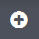

---

copyright:
  years: 2015, 2017

lastupdated: "2017-03-08"

---

{:shortdesc: .shortdesc}
{:new_window: target="_blank"}
{:codeblock: .codeblock}
{:screen: .screen}

# 대시보드를 통해 Kibana에서 로그 분석
{:#kibana_analize_logs_dashboard}

Kibana의 *대시보드* 페이지를 사용하여 대시보드에 그룹화된 시각화 콜렉션을 표시하십시오. 대시보드를 사용하여 로그 데이터를 분석하고 결과를 비교하십시오.
{:shortdesc}

{{site.data.keyword.Bluemix}}에는 데이터를 시각화하고 분석하기 위해 정의하고 사용자 정의할 수 있는 여러 다른 유형의 대시보드가 있습니다. 예를 들어 다음 테이블에서는 일부 공통 대시보드 유형을 나열합니다.

| 대시보드 유형 | 설명 |
|-------------------|-------------|
| 단일 cf-app 대시보드 | 단일 Cloud Foundry 애플리케이션의 정보를 표시하는 대시보드입니다. |
| 단일 컨테이너 대시보드  | 단일 컨테이너의 정보를 표시하는 대시보드입니다.  |
| 컨테이너 그룹 대시보드  | 특정 컨테이너 그룹의 정보를 표시하는 대시보드입니다.  |
| 다중 cf-app 대시보드 | 동일한 {{site.data.keyword.Bluemix_notm}} 영역에 배치된 모든 Cloud Foundry 애플리케이션의 정보를 보여주는 대시보드입니다.  | 
| 다중 컨테이너 대시보드 | 동일한 {{site.data.keyword.Bluemix_notm}} 영역에 배치된 모든 컨테이너의 정보를 보여주는 대시보드입니다.  |
| 영역 대시보드 | {{site.data.keyword.Bluemix_notm}} 영역에서 사용할 수 있는 로깅 데이터를 보여주는 대시보드입니다.  | 

대시보드에서 데이터를 시각화하기 위해 패널을 구성합니다. Kibana에는 정보를 분석하는 데 사용할 수 있는 테이블, 상태동향 및 히스토그램과 같은 여러 다른 시각화가 포함됩니다. 시각화가 패널로 대시보드에 추가됩니다. 대시보드에서 패널을 추가하고 제거하고 다시 배열할 수 있습니다. 각 패널의 목적은 서로 다릅니다. 일부 패널은 하나 이상의 조회 결과를 제공하는 행으로 구성됩니다. 나머지 패널은 문서 또는 사용자 정의 정보를 표시합니다. 각 패널은 검색을 기반으로 합니다. 검색을 통해 패널이 표시하는 데이터의 서브세트를 정의합니다. 예를 들어, 데이터를 시각화하고 분석하기 위해 막대형 차트, 원형 차트 또는 테이블을 구성할 수 있습니다.  

다음 표에서는 대시보드 페이지에서 수행할 수 있는 여러 가지 태스크를 나열합니다.

| 태스크 | 자세한 정보  |
|------|------------------|
| [새 대시보드 작성](logging_kibana_analize_logs_dashboard.html#K4_dashboard_new) | 여러 대시보드를 작성할 수 있습니다. 각 대시보드는 여러 다른 검색, 시각화 및 로그 데이터의 다양한 서브세트를 포함하도록 설계될 수 있습니다.  |
| [대시보드 저장](logging_kibana_analize_logs_dashboard.html#k4_dashboard_save) | 나중에 다시 사용하도록 대시보드를 저장할 수 있습니다.  |
| [대시보드 로드](logging_kibana_analize_logs_dashboard.html#k4_dashboard_reload) | 대시보드를 업로드하여 데이터를 업데이트하거나 수정하거나 데이터를 분석할 수 있습니다. |
| [대시보드 삭제](logging_kibana_analize_logs_dashboard.html#k4_dashboard_delete) | 필요하지 않은 대시보드를 삭제합니다. |
| [대시보드 내보내기](logging_kibana_analize_logs_dashboard.html#k4_dashboard_export) | JSON 파일로 대시보드를 내보낼 수 있습니다. |
| [대시보드 가져오기](logging_kibana_analize_logs_dashboard.html#k4_dashboard_import) | JSON 파일로 대시보드를 가져올 수 있습니다. |
| [대시보드 공유](logging_kibana_analize_logs_dashboard.html#k4_dashboard_share) | HTML 소스 또는 Kibana 대시보드를 통해 대시보드를 공유할 수 있습니다. |
| [시각화 추가](logging_kibana_analize_logs_dashboard.html#k4_dashboard_add_visualization) | 기존 시각화나 검색을 대시보드에 추가할 수 있습니다.|

Kibana에 대한 자세한 정보는 [Kibana 사용자 안내서 ](https://www.elastic.co/guide/en/kibana/4.1/index.html){: new_window}를 참조하십시오.

## 새 Kibana 대시보드 작성
{: #K4_dashboard_new}

새 대시보드를 작성하려면 다음 단계를 완료하십시오.

1. 대시보드 페이지의 도구 모음에서 **새 대시보드** 단추 를 클릭하십시오.

2. 하나 이상의 검색 및 시각화를 추가하십시오. 자세한 정보는 [새 검색 또는 시각화 추가](logging_kibana_analize_logs_dashboard.html#K4_dashboard_add_visualization)를 참조하십시오.

    검색 또는 시각화를 추가하면 패널이 대시보드에 추가됩니다.

3. 패널을 끌고 대시보드에서 원하는 위치에 놓으십시오.
 
4. 나중에 재사용하도록 대시보드를 저장하십시오. 자세한 정보는 [Kibana 대시보드 저장](logging_kibana_analize_logs_dashboard.html#k4_dashboard_save)을 참조하십시오.

## 새 검색 또는 시각화 추가
{: #k4_dashboard_add_visualization}

다음 단계를 완료하여 기존 시각화 또는 검색을 추가하십시오.

1. 대시보드 페이지의 도구 모음에서 **시각화 추가** 단추 를 클릭하십시오.

    **참고**: 시각화와 검색을 추가할 수 있습니다. 

2. **시각화** 탭을 선택하여 시각화를 추가하거나 **검색** 탭을 선택하여 검색을 추가하십시오.

3. 추가하려는 검색 또는 시각화를 클릭하십시오.

    해당 검색 또는 시각화의 패널이 대시보드에 추가됩니다.

## Kibana 대시보드 저장
{: #k4_dashboard_save}

Kibana 대시보드를 사용자 정의한 후 저장하려면 다음 단계를 수행하십시오.

1. 도구 모음에서 **저장** 단추 를 클릭하십시오.

2. 대시보드의 이름을 입력하십시오. 

    **참고:** 공백이 있는 이름의 대시보드는 저장되지 않습니다. 

3. 이름 필드 옆에 있는 **저장** 아이콘을 클릭하십시오. 

## Kibana 대시보드 삭제
{: #k4_dashboard_delete}

시각화를 삭제하려면 설정 페이지에서 다음 단계를 완료하십시오.

1. 설정 페이지에서 **오브젝트** 탭을 선택하십시오.

2. **시각화** 탭에서 삭제할 시각화를 선택하십시오.

3. **삭제**를 클릭하십시오.

## Kibana 대시보드 로드
{: #k4_dashboard_reload}

저장된 대시보드를 로드하려면 다음 단계를 완료하십시오.

1. 대시보드 페이지의 도구 모음에서 **저장된 대시보드 로드** 단추 를 클릭하십시오.

2. 로드하려는 대시보드를 선택하십시오. 

## Kibana 대시보드 내보내기
{: #k4_dashboard_export}

JSON 파일로 대시보드를 내보내려면 설정 페이지에서 다음 단계를 완료하십시오.

1. 설정 페이지에서 **오브젝트** 탭을 선택하십시오.

2. **대시보드** 탭에서 내보낼 대시보드를 선택하십시오.

3. **내보내기**를 클릭하십시오.

4. 파일을 저장하십시오.

## Kibana 대시보드 가져오기
{: #k4_dashboard_import}

JSON 파일로 대시보드를 가져오려면 설정 페이지에서 다음 단계를 완료하십시오.

1. 설정 페이지에서 **오브젝트** 탭을 선택하십시오.

2. **대시보드** 탭에서 **가져오기**를 선택하십시오.

3. 파일을 선택하고 **열기**를 클릭하십시오.

대시보드 목록에 대시보드가 추가됩니다.

## Kibana 대시보드 공유
{: #k4_dashboard_share}

대시보드를 공유하려면 다음 단계를 완료하십시오.

1. 대시보드 페이지의 도구 모음에서 **대시보드 공유** 단추 를 클릭하십시오.

2. 다음 조치 중 하나를 선택하십시오.

    * **이 대시보드 임베드**: 이 옵션을 선택하여 HTML 소스를 통해 대시보드를 공유하십시오. 
    
        복사 단추 를 클릭하여 HTML 소스에 대시보드를 임베드하는 데 사용할 수 있는 HTML 코드를 복사하십시오. 
        
        **참고**: 대시보드를 보려면 사용자가 Kibana에 액세스할 수 있어야 합니다.
	
    * **링크 공유**: 다른 사용자와 Kibana의 대시보드를 공유하려면 이 옵션을 선택하십시오.

