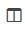
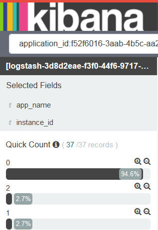

---

copyright:
  years: 2015, 2017

lastupdated: "2017-04-06"

---

{:shortdesc: .shortdesc}
{:new_window: target="_blank"}
{:codeblock: .codeblock}
{:screen: .screen}

# Kibana에서 대화식으로 로그 분석
{:#kibana_analize_logs_interactively}

검색 페이지에서 {{site.data.keyword.Bluemix}} 로그를 대화식으로 보고 분석할 수 있습니다. Lucene 조회 언어를 사용하여 해당 데이터를 필터링하도록 검색 조회를 정의할 수 있습니다. 각 검색 조회에 대해 필터를 적용하여 분석에 사용할 수 있는 항목을 세분화할 수 있습니다. 나중에 다시 사용하도록 검색을 저장할 수 있습니다.
{:shortdesc}

{{site.data.keyword.Bluemix_notm}}에서는 기본적으로 {{site.data.keyword.Bluemix_notm}} UI에서 Kibana를 시작할 때 검색 페이지에 표시되는 데이터 세트가 Kibana를 시작하는 컨테이너나 CF(Cloud Foundry) 애플리케이션의 항목만 표시하도록 구성됩니다. 검색 페이지에서 표시하는 데이터의 서브세트를 확인하는 방법에 대한 자세한 정보는 [표시된 데이터 식별](logging_kibana_analize_logs_interactively.html#k4_identify_data)을 참조하십시오.

다음 테이블에서는 {{site.data.keyword.Bluemix_notm}}에서 Kibana를 시작할 때 리소스당 기본 조회를 보여줍니다.

| 리소스 | 기본 Kibana 검색 조회 |
|---------------|---------------|
| CF 애플리케이션   | `application_id:<app_GUID>`    |
| 단일 Docker 컨테이너 | `instance:<instance_GUID>`    |
| 2개의 인스턴스가 있는 컨테이너 그룹 | `instance:<instance_GUID> OR instance:<instance_GUID>` |
{: caption="표 1. 기본 조회 검색" caption-side="top"}

**참고:** 
* {{site.data.keyword.Bluemix_notm}} UI에서 Kibana를 시작할 때마다 표시되는 데이터는 기본적으로 사전 구성된 조회에 해당하며 색인 패턴을 기반으로 합니다.
* 최신 항목에 해당하는 최대 500개의 항목이 검색 페이지에 표시됩니다. 설정 페이지에서 이 값을 수정할 수 있습니다.

브라우저에서 Kibana를 시작할 때 검색 페이지에 표시되는 데이터에는 로그인된 영역에서 사용할 수 있는 모든 로그 데이터가 포함됩니다. 페이지는 특정 컨테이너 또는 앱으로 한정되지 않습니다.

검색 페이지에는 대화식으로 데이터를 분석할 수 있도록 사용자 정의할 수 있는 테이블과 히스토그램이 포함되어 있습니다. 

다음 태스크를 수행하여 검색 페이지에서 테이블을 사용자 정의할 수 있습니다.

| 태스크 | 설명 | 
|------|-------------|
| [필드 열 추가](logging_kibana_analize_logs_interactively.html#kibana_discover_add_fields_to_table) | 전체 메시지가 아니라 분석에 필요한 특정 데이터를 표시하는 필드를 추가합니다. |
| [필드 열 재정렬](logging_kibana_analize_logs_interactively.html#kibana_discover_rearrange_fields_in_table) | 테이블에서 필드 위치를 원하는 위치로 이동합니다. |
| [항목 보기](logging_kibana_analize_logs_interactively.html#kibana_discover_view_entry_in_table) | 테이블의 항목을 확장하여 필드별 또는 JSON으로 구문 분석된 항목의 세부사항을 표시합니다. |
| [필드 열 제거](logging_kibana_analize_logs_interactively.html#kibana_discover_remove_fields_from_table) | 분석을 위해 보기에 필요하지 않은 경우 필드를 제거합니다. |
| [색인화된 필드의 값별로 항목 순서 지정](logging_kibana_analize_logs_interactively.html#kibana_discover_sort_by_table) | 더 쉽게 분석하기 위해 항목을 다시 정렬합니다. |
| [자동으로 데이터 새로 고치기](logging_kibana_analize_logs_interactively.html#kibana_discover_view_refresh_interval) | 테이블에 표시된 데이터를 최신 항목으로 새로 고칩니다. 기본적으로 새로 고치기는 **OFF**입니다. |
{: caption="표 2. 테이블을 사용자 정의하는 태스크" caption-side="top"}

 

다음 그림은 검색 페이지의 테이블 샘플을 보여줍니다.

다른 검색을 정의할 수 있습니다. 자세한 정보는 [사용자 정의 검색을 정의하여 로그 필터링](k4_filter_queries.html#k4_filter_queries)을 참조하십시오. 새 검색을 정의할 때 히스토그램과 테이블에 표시되는 데이터가 자동으로 업데이트됩니다.

새 검색을 정의하려면 기본 검색을 시작점으로 사용한 후 다음 태스크를 수행하여 검색을 세분화하십시오.

* 필드 필터를 적용하여 볼 수 있는 데이터 세트를 세분화하십시오. 각 필터를 전환하고, 페이지에 고정하며, 필요한 대로 사용 또는 사용 안함으로 설정하고, 값을 포함 또는 제거하도록 구성할 수 있습니다. 자세한 정보는 [Kibana에서 로그 필터링](logging_kibana_filtering_logs.html#kibana_filtering_logs)을 참조하십시오.

    **팁:** 표시될 것으로 예상하는 필드가 *필드 목록*에 없거나 나열된 필드별 돋보기 중 일부가 검색 페이지에서 사용되지 않는 경우, 설정 페이지에서 색인 패턴을 다시 고쳐 필드 목록을 다시 로드하십시오. 자세한 정보는 [필드 목록 다시 로드](logging_kibana_analize_logs_interactively.html#kibana_discover_view_reload_fields)를 참조하십시오.

    예를 들어 CF 앱의 인스턴스가 여러 개인 경우 특정 인스턴스의 데이터를 분석할 수 있습니다. 분석하려는 특정 인스턴스 ID 값의 필드 필터를 정의할 수 있습니다. 
    
* 시간 기반 데이터의 *시간 선택도구*를 사용자 정의하십시오. 조회의 절대 시간 범위, 상대적인 시간 범위를 정의하거나 사전 정의된 값 세트에서 선택할 수 있습니다. 자세한 정보는 [시간 필터 설정](logging_kibana_set_time_filter.html#set_time_filter)을 참조하십시오.

분석하려는 데이터 서브세트를 정의하는 검색을 구성한 다음 나중에 재사용하도록 저장할 수 있습니다.

검색 페이지에서 정의한 검색을 사용하여 다음 태스크를 수행할 수 있습니다.

| 태스크 | 설명 |
|------|-------------|
| [검색 저장](logging_kibana_filtering_logs.html#k4_save_search) | 나중에 재사용하도록 검색을 저장합니다.  |
| [검색 삭제](logging_kibana_filtering_logs.html#k4_delete_search) | 더 이상 필요하지 않은 검색을 삭제합니다. |
| [검색 내보내기](logging_kibana_filtering_logs.html#k4_export_search) | 검색을 공유하도록 내보냅니다.  |
| [검색 다시 로드](logging_kibana_filtering_logs.html#k4_reload_search)  | 데이터 세트를 다시 분석하기 위해 기존 검색을 업로드합니다. |
| [검색 데이터 새로 고치기](logging_kibana_filtering_logs.html#k4_refresh_search) | 검색을 통해 표시된 데이터의 자동 새로 고치기를 구성합니다.  |
| [검색 가져오기](logging_kibana_filtering_logs.html#k4_import_search) | 검색을 가져옵니다.  |
{: caption="표 3. 검색에 대한 작업을 수행하는 태스크" caption-side="top"}

 

검색 페이지에서 통계도 볼 수 있습니다.
* 필드당 통계를 볼 수 있습니다. 
* 구성한 `@timestamp`당 히스토그램에서 통계를 볼 수 있습니다.

자세한 정보는 [필드 데이터 통계 보기](logging_kibana_analize_logs_interactively.html#kibana_discover_view_fields_stats)를 참조하십시오.

**참고:** 테이블과 히스토그램에 표시되는 데이터는 정적입니다. 최신 항목을 계속 표시하려면 새로 고치기 간격을 설정해야 합니다. 

## 테이블에 필드 열 추가
{: #kibana_discover_add_fields_to_table}

검색 페이지에서 데이터를 분석하는 데 사용할 수 있는 테이블에는 기본적으로 다음 필드가 포함되어 있습니다.
* **time:** 이 필드는 항목을 캡처하여 {{site.data.keyword.Bluemix_notm}}에 기록한 시간을 표시합니다.
* **_source:** 이 필드에는 항목의 원래 데이터가 포함되어 있습니다.

다음 옵션 중 하나를 선택하여 필드 열을 테이블에 추가할 수 있습니다.

* 페이지에서 사용할 수 있는 필드 목록에서 필드 열을 추가하십시오.

    1. 검색 페이지의 `선택한 필드` 섹션에서 필드를 식별하십시오.
    2. 필드 목록에서 필드 위로 마우스를 이동하십시오.
    
        
    
    3. 필드를 추가하려면 **추가**를 클릭하십시오.
    
 * 확장된 항목의 테이블 보기에서 필드 열을 추가하십시오.

    1. 테이블의 항목을 확장하십시오.
    2. 테이블 보기에서 추가할 필드를 식별하십시오.
    
        
    
    3. **테이블에서 열 전환** 아이콘 을 클릭하십시오.
    

**참고:** 한 필드 열을 테이블에 처음으로 추가할 때 테이블에 표시되는 *_source* 필드 열이 숨겨집니다. *_source* 필드에는 각 로그 항목에 대한 각 필드 값이 표시됩니다. 테이블에 열을 추가한 다음 테이블에서 로그 항목의 다른 필드 값을 보려면 각 항목의 테이블 보기 탭 또는 JSON 탭을 보십시오.

예를 들어 *application_id* 필드를 테이블에 추가하면 테이블이 변경되어 다음과 같이 표시됩니다.

## 자동으로 데이터 새로 고치기
{: #kibana_discover_view_refresh_interval}

{{site.data.keyword.Bluemix_notm}}에서 기본적으로 *자동으로 새로 고치기* 기간은 **OFF**로 설정되며, Kibana에서 볼 수 있는 데이터는 Kibana를 시작한 이후 지난 15분 동안의 데이터에 해당합니다. 15분은 사전 구성된 시간 필터에 해당합니다. 다른 기간을 설정하여 변경할 수 있습니다. 자세한 정보는 [시간 필터 설정](logging_kibana_set_time_filter.html#set_time_filter)을 참조하십시오.

다음 단계를 완료하여 *자동으로 새로 고치기* 기간을 설정하십시오.

1. 검색 페이지 메뉴 표시줄에서 시간 선택도구 를 클릭하십시오.

2. 자동으로 새로 고치기 단추 를 선택하십시오.

3. 새로 고치기 간격을 선택하십시오.

    

일시정지 단추 를 클릭하여 새로 고치기 간격을 일시정지할 수 있습니다. 

## 검색 페이지에 표시되는 데이터 식별
{:#k4_identify_data}

Kibana를 사용하여 {{site.data.keyword.Bluemix_notm}} 로그를 분석할 때 볼 수 있는 데이터는 Kibana를 시작하는 방식, 구성된 색인 패턴 및 적용한 사용자 정의 조회 및 필터에 따라 달라집니다.

검색 페이지의 테이블과 히스토그램에서 사용할 수 있는 데이터를 식별하기 위해 다음 정보를 고려하십시오.

1. 설정 페이지에서 색인 패턴을 확인하십시오.

    색인 패턴은 Kibana 페이지에 항목을 표시하기 위해 기본적으로 적용되는 검색 조회를 정의합니다. 기본적으로 색인 패턴은 사전 구성되고 {{site.data.keyword.Bluemix_notm}} 영역에서 사용할 수 있는 모든 데이터로 설정됩니다. 예를 들어, 다음과 같습니다.

    * {{site.data.keyword.Bluemix_notm}} UI, 즉 CF(Cloud Foundry) 애플리케이션 또는 컨테이너와 같은 특정 리소스의 UI 페이지에 있는 *로그* 섹션에서 Kibana를 시작하면, 적용되는 색인 패턴에 영역에서 사용할 수 있는 모든 항목이 포함됩니다.
    
    * 브라우저에서 Kibana를 시작하면 Kibana가 사용자의 로그인 위치를 보여주는 영역에서 사용 가능한 모든 항목이 적용된 색인 패턴에 포함됩니다.
        
2. 검색 페이지에서 조회를 확인하십시오.  

    검색 페이지에 표시된 조회를 사용하여 기본적으로 분석에 사용할 수 있는 항목을 필터링합니다. 예를 들어, 다음과 같습니다. 

    * 검색 표시줄에 문자열을 입력하면 조회를 통해 모든 필드에서 해당 문자열을 스캔합니다.
    
    * 조회가 `application_id:<GUID>`로 설정되어 있으면(여기서, *GUID*는 CF 앱의 ID) 표시되는 항목은 색인 패턴에 구성된 영역의 CF 앱에 사용할 수 있는 모든 항목에 해당합니다.
    
    * 조회가 `instance_id:<GUID>`로 설정되어 있으면(여기서, *GUID*는 컨테이너 인스턴스의 ID임) 표시되는 항목은 색인 패턴에 구성된 영역에서 해당 컨테이너에 사용할 수 있는 모든 항목에 해당합니다.
    
    * 조회가 `instance_id:<GUID> AND instance_id:<GUID>`로 설정되어 있으면(여기서, *GUID*는 컨테이너 인스턴스의 ID임) 표시되는 항목은 색인 패턴에 구성된 영역에서 해당 컨테이너 그룹에 사용할 수 있는 모든 항목에 해당합니다.
   
    * 조회가 `*`로 설정되어 있으면 색인 패턴에 구성된 영역에서 사용할 수 있는 모든 항목으로 데이터가 설정됩니다.
    
    * 조회가 `application_id:<GUID> AND message:"MY_search_text"`로 설정되어 있으면(여기서, *GUID*는 CF 앱의 ID이고 *My_search_text*는 검색하려는 문자열임) 표시되는 항목은 색인 패턴에 구성된 영역에서 사용할 수 있는 해당 CF 앱 항목의 메시지 필드에 *My_search_text*를 포함하는 모든 항목에 해당합니다.
    
3. 검색 페이지에서 조회에 적용되는 필드 필터를 확인하십시오.

    필드 값에 따라 항목을 전환하도록 0개 이상의 필드 필터를 정의할 수 있습니다. 예를 들어 필드 필터가 사용 가능한 경우, 표시되는 항목은 해당 필드의 값이 일치하는 항목에 해당합니다.
    

## 색인화된 필드의 값순으로 항목 순서 지정 
{: #kibana_discover_sort_by_table}

색인화된 필드의 항목만 테이블에서 정렬할 수 있습니다.

색인화된 항목을 알아보려면 다음 단계를 완료하십시오.

1. 검색 페이지에서 구성 아이콘 을 클릭하십시오. 필드를 필터링할 수 있는 섹션이 페이지의 **선택한 필드** 섹션에 표시됩니다. 

    
    
2. 색인화된 필드를 식별하려면 **색인화됨** 검색 필드에 대해 **예**를 선택하십시오.

    
    
 색인화된 필드 목록이 표시됩니다.
 
 
  	
 
색인화된 필드의 값별로 테이블의 항목을 정렬하려면 다음 단계를 완료하십시오. 

1. 테이블에서 데이터를 정렬하는 기준이 되는 필드의 이름 위로 마우스를 이동하십시오. 다른 조치 단추가 표시됩니다.
2. 데이터를 정렬하는 기준이 될 필드의 정렬 단추를 클릭하십시오. 필드 정렬 아이콘을 두 번 클릭하여 정렬 순서를 되돌리십시오.

**참고:** 시간 필드별로 정렬하면 기본적으로 항목이 역시간 순서로 정렬됩니다. 최신 항목이 먼저 표시됩니다.

## 테이블에서 필드 열 다시 정렬
{: #kibana_discover_rearrange_fields_in_table}

테이블의 필드 열을 다시 정렬할 수 있습니다. 이동할 열의 표제 위에 마우스를 두고 **열을 왼쪽으로 이동** 단추 또는 **열을 오른쪽으로 이동** 단추를 클릭하십시오.
 

## 필드 목록 다시 로드
{: #kibana_discover_view_reload_fields}

다음 단계를 완료하여 Kibana에 표시되는 필드 목록을 다시 로드하십시오.

1. 설정 페이지를 선택하십시오.

    설정 페이지를 선택하면 *색인* 탭이 열립니다.
   
2. 모든 필드와 필드의 연관 핵심 유형을 Elasticsearch로 기록된 대로 표시하려면 색인 패턴을 선택하십시오. 

3. *필드 목록 다시 로드* 단추 를 클릭하여 색인 패턴 필드를 다시 로드하십시오. 

필드 목록이 새로 고쳐집니다.

## 테이블에서 필드 열 제거
{: #kibana_discover_remove_fields_from_table}

테이블에서 필드를 제거하려면 다음 단계를 완료하십시오.

1. 테이블 보기에서 제거하려는 필드를 테이블에서 식별하십시오.
2. **열 제거**를 클릭하십시오.
    
    

## 테이블의 항목 보기
{: #kibana_discover_view_entry_in_table}

테이블에서 항목 데이터를 보려면 분석할 항목의 확장 단추 을 클릭하십시오. 

 	

그런 다음 데이터를 보려면 다음 옵션 중 하나를 선택하십시오.

* 테이블 형식으로 데이터를 보려면 **테이블**을 클릭하십시오. 분석에 사용 가능한 각 필드의 값을 테이블 형식으로 볼 수 있습니다. 필드마다 필터 단추와 전환 단추도 있습니다.
* JSON 형식으로 데이터를 보려면 **JSON**을 클릭하십시오.

## 필드 데이터 통계 보기
{: #kibana_discover_view_fields_stats}

검색 페이지의 *필드 목록* 및 *히스토그램*에서 각 필드의 통계를 볼 수 있습니다. 

필드 목록에서 다음 정보를 볼 수 있습니다.
* 특정 필드를 포함하는 테이블의 항목 수.
* 상위 5개의 값.
* 각 값을 포함하는 항목의 백분율.

히스토그램에서 다음 정보를 볼 수 있습니다.
* 시간 범위의 항목 수.

히스토그램에서 통계를 보려면 시간소인을 클릭하여 해당 기간의 통계를 보십시오. 예를 들어, 다음과 같습니다. 

   	
 	
필드 목록에서 필드에 대한 통계를 보려면 이름을 클릭하십시오. 예를 들어, 다음과 같습니다.

