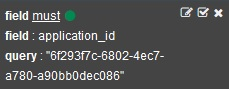

---

copyright:
  years: 2016, 2017
lastupdated: "2017-02-06"

<!-- Common attributes used in the template are defined as follows: -->
{:new_window: target="_blank"}
{:shortdesc: .shortdesc}
{:screen:.screen}
{:codeblock:.codeblock}

# Filtrando seus logs do app Cloud Foundry por ID da instância no Kibana
<!-- for example, Uploading your data -->
{: #logging_kibana_instance_id}
<!-- Provide an appropriate ID above -->

Visualize e filtre logs da instância do {{site.data.keyword.Bluemix_notm}} pelo ID da instância (instance_id) de seu app no painel do Kibana. É possível acessar o painel do Kibana na guia **Logs** para seu app Cloud Foundry.
{:shortdesc}

<!-- Include a sentence to briefly introduce the steps/subtopics. Example: -->
Conclua as tarefas a seguir para visualizar e filtrar seus logs do app Cloud Foundry por instance_id no painel do Kibana:

1. Acesse a guia **Logs** de seu app Cloud Foundry. 

    1. Clique no nome do app no painel **Apps** do {{site.data.keyword.Bluemix_notm}}.
    2. Clique na guia **Logs**. 
    
    Os logs para seu app são exibidos.

2. Acesse o painel do Kibana para seu app. Clique em **Visualização avançada** . O painel do Kibana é exibido.

3. No painel do Kibana, clique no ícone **Acessar padrão salvo**  para exibir todos os logs para um espaço. Na janela **TODOS OS EVENTOS**, clique no ícone de seta à direita para mostrar todos os campos. 

    

4. Na área de janela **Campos**, selecione **application_id** e **instance_id** para exibir os campos application_id e instance_id na janela **TODOS OS EVENTOS**.

    

5. Na janela **TODOS OS EVENTOS**, clique em uma linha de evento de log para exibir os detalhes para esse evento. Escolha um evento que exiba o instance_id que você deseja filtrar.

    

6. Inclua um filtro para incluir ou excluir informações sobre um ID de app. 

    * Para incluir um filtro que inclua informações sobre um ID do aplicativo específico, clique no ícone de **Lupa**  na linha application_id da tabela. 
    
           
    
    * Para incluir um filtro que exclua informações sobre um ID do aplicativo específico, clique no ícone de **Exclusão**  na linha application_id da tabela. 
    
           
    
    Uma nova condição do filtro é incluída no painel do Kibana.
 

7. Inclua um filtro para incluir ou excluir informações sobre um ID da instância do app. 

    * Para incluir um filtro que inclua informações sobre um ID da instância específico, clique no ícone de **Lupa**  na linha instance_id da tabela. 

    

     * Para incluir um filtro que exclua informações sobre um ID da instância específico, clique no ícone de **Exclusão**  na linha instance_id da tabela. 
    
           
    
    Uma nova condição do filtro é incluída no painel do Kibana.

9. Salve o painel. Quando concluir a criação do filtro, clique no ícone **Salvar**  e insira um nome para seu painel. 

    **Nota:** se você tentar salvar um painel com um nome contendo espaços em branco, ele não será salvo. Insira um nome sem espaços e clique no ícone **Salvar**.

    .

Você criou um painel que filtra suas entradas de log por instance_id. É possível carregar seu painel salvo a qualquer momento clicando no ícone **Pasta**  e selecionando seu painel por nome. 
