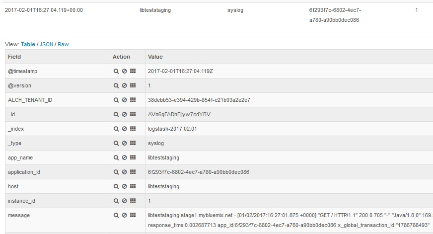
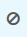

---

copyright:
  years: 2016, 2017
lastupdated: "2017-02-06"

---

<!-- Common attributes used in the template are defined as follows: -->
{:new_window: target="_blank"}
{:shortdesc: .shortdesc}
{:screen:.screen}
{:codeblock:.codeblock}

# Filtrando seus logs do app Cloud Foundry por ID do aplicativo conhecido no Kibana
<!-- for example, Uploading your data -->
{: #logging_kibana_known_application_id}
<!-- Provide an appropriate ID above -->

<!-- The short description section should include a sentence describing why this task is needed. For search engine optimization, include the service long name and "Bluemix". For example: -->

Se você souber o ID do aplicativo de seu app Cloud Foundry, será possível visualizar e filtrar rapidamente os logs pelo ID do aplicativo (application_id) de seu app no painel do Kibana. É possível acessar o painel do Kibana na guia **Logs** para seu app Cloud Foundry. 
{:shortdesc}

<!-- Include a sentence to briefly introduce the steps/subtopics. Example: -->
Conclua as tarefas a seguir para visualizar e filtrar seus logs do app Cloud Foundry por um ID do aplicativo conhecido no painel do Kibana:

1. Acesse a guia **Logs** de seu app Cloud Foundry. 

    1. Clique no nome do app no painel **Apps** do {{site.data.keyword.Bluemix_notm}}.
    2. Clique na guia **Logs**. 
    
    Os logs para seu app são exibidos.

2. Acesse o painel do Kibana para seu app. Clique em **Visualização avançada** . O painel do Kibana é exibido.

3. No painel do Kibana, clique no ícone **Pasta**  para exibir um menu que lista todos os painéis recentes. 

    **Nota:** além dos painéis que você salvou por nome, o menu lista os painéis não nomeados de acordo com o formato a seguir: *ALCH_TENANT_ID_application_id*. 

    

4. Selecione o painel com um nome que contenha seu application_id conhecido. 

    O painel carrega e exibe informações filtradas para seu application_id.

5. Opcionalmente, é possível incluir mais campos em sua seção de filtro, por exemplo, **instance_id** para ativar ou desativar a filtragem de registros por ID da instância. 
  
    1. Na janela **TODOS OS EVENTOS**, clique em uma linha de evento de log para exibir os detalhes para esse evento. 
	
        
	
    2. Escolha um evento que exiba o valor do campo que você deseja filtrar.
	
    3. Inclua um filtro.
    
        Para incluir um filtro que inclua informações sobre esse valor do campo específico, clique no ícone de **Lupa**  na linha da tabela que contém o campo que você deseja filtrar. 
	
        Para incluir um filtro que exclua informações sobre esse valor do campo específico, clique no ícone de **Exclusão**  na linha da tabela que contém o campo que você deseja filtrar.  

        Uma nova condição do filtro é incluída no painel do Kibana.
	
	    
	
6. Salve esse painel com um nome reconhecível. 

    Clique no ícone **Salvar**  e insira um nome para seu painel. 

    **Nota:** se você tentar salvar um painel com um nome contendo espaços em branco, ele não será salvo. Insira um nome sem espaços e clique no ícone **Salvar**.

    .

Você criou um painel que filtra suas entradas de log por ID do aplicativo e ID da instância. É possível carregar seu painel salvo a qualquer momento clicando no ícone **Pasta**  e selecionando seu painel por nome.
