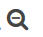

---

copyright:
  years: 2015, 2017

lastupdated: "2017-03-01"

---

{:shortdesc: .shortdesc}
{:new_window: target="_blank"}
{:codeblock: .codeblock}
{:screen: .screen}

# Filtrando seus logs por ID da instância
{:#k4_filter_logs_by_instance_id}

Visualize e filtre logs do {{site.data.keyword.Bluemix}} por ID da instância.
{:shortdesc}

Conclua as etapas a seguir para visualizar e filtrar seus logs por ID da instância no painel do Kibana: 

1. Consulte a página Descobrir do Kibana para ver qual subconjunto de seus dados é exibido. Para
obter mais informações, consulte
[Identificando os dados que são
exibidos em sua página Descobrir do Kibana](logging_kibana_analize_logs_interactively.html#k4_identify_data).

2. Na *Lista de campos*, selecione um dos campos a seguir para procurar por um ID da instância específico:

    * **instance_ID**: esse campo lista os IDs de instância diferentes que estão
disponíveis no log para um aplicativo Cloud Foundry. 
    * **instance**: esse campo lista os GUIDs diferentes de todas as instâncias
para um grupo de contêiner. 

    Por exemplo, a figura a seguir mostra valores diferentes de instâncias para um app CF:
    
    

   
3. Para incluir um filtro que procura por um tipo de log específico, escolha o botão de lupa
 para o tipo de log que deseja analisar.

   Por exemplo, para incluir um filtro que inclua entradas para a instância do app CF *2*,
selecione o botão de lupa  que está disponível para o valor *2* na

seção Lista de campos. A figura a seguir mostra o filtro que inclui entradas para a instância *2*.
    
    

    Para incluir um filtro que procure por entradas que não incluam um ID da instância específico,
escolha o botão de lupa  para o valor.

     Por exemplo, para incluir um filtro que exclua entradas para a instância do app CF
*2*, selecione o botão de lupa  que está disponível para o valor *2*

na seção Lista de campos. A figura a seguir mostra o filtro que exclua entradas para a instância
*2*.
     
      

